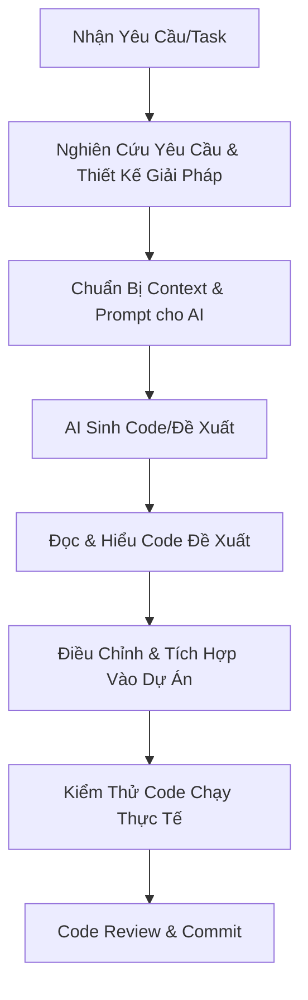

# Quy Tắc & Hướng Dẫn Phát Triển Phần Mềm Cùng AI (AI Coding Policy)

Tài liệu này định nghĩa các quy tắc, nguyên tắc cốt lõi và quy trình làm việc khi các thành viên dự án **Aura Moon** sử dụng công cụ Trợ lý AI (như ChatGPT, Claude, Gemini, GitHub Copilot) trong quá trình phát triển mã nguồn.

---

## 1. Nguyên Tắc Cốt Lõi (Core Principles)

### 1.1. Con Người Làm Chủ & Chịu Trách Nhiệm (Human-in-the-Loop)
* **AI đề xuất, Lập trình viên quyết định:** AI chỉ là trợ lý hỗ trợ tăng hiệu suất. Toàn bộ mã nguồn được đẩy lên hệ thống (GitLab) là trách nhiệm của lập trình viên viết/được phân công nhiệm vụ đó.
* **Không sao chép mù quáng (No blind copy-paste):** Tuyệt đối không copy mã nguồn từ AI trực tiếp vào dự án mà không hiểu rõ từng dòng code đó hoạt động như thế nào. Bạn phải giải thích được logic của đoạn code đó khi được review.

### 1.2. Bảo Mật & Bảo Mật Thông Tin (Security & Privacy)
* **Không chia sẻ thông tin nhạy cảm:** Cấm tuyệt đối việc đưa các thông tin nhạy cảm của dự án lên các công cụ AI công cộng (Public AI). Các thông tin nhạy cảm bao gồm:
  - API Keys, Database credentials (username, password), Secret Keys.
  - Dữ liệu thật của người dùng (CCCD, Số hộ chiếu, Thông tin y tế nhạy cảm).
  - Mã nguồn sở hữu trí tuệ độc quyền (nếu có yêu cầu bảo mật).
* **Mẹo an toàn:** Khi hỏi AI về lỗi hoặc nhờ sinh code, hãy thay thế các thông tin nhạy cảm bằng dữ liệu giả lập (mock data), ví dụ: `my-db-password`, `YOUR_API_KEY`.

### 1.3. Tuân Thủ Tiêu Chuẩn Dự Án (Project Coding Standards)
* Mã nguồn do AI sinh ra phải tuân thủ nghiêm ngặt các quy chuẩn của dự án:
  - **Kiến trúc:** Phân lớp Spring Boot chuẩn (`Controller` -> `Service` -> `Repository` -> `Entity`).
  - **Quy tắc đặt tên:** `camelCase` cho biến/hàm, `PascalCase` cho class, `SNAKE_CASE` cho hằng số.
  - **Xử lý ngoại lệ (Exception Handling):** Phải có try-catch, kiểm tra Null, ném ngoại lệ rõ ràng thay vì bỏ qua lỗi hoặc chỉ in ra console (`e.printStackTrace()`).

---

## 2. Quy Trình Coding Cùng AI (Workflow)

### Bước 1: Nghiên cứu & Thiết kế trước khi hỏi AI
* Trước khi mở chat với AI, bạn cần xác định rõ:
  - Mục tiêu của đoạn code cần viết là gì?
  - Dữ liệu đầu vào (Input) và dữ liệu đầu ra (Output) gồm những gì?
  - Đoạn code này sẽ nằm ở class/package nào trong dự án?

### Bước 2: Cung cấp ngữ cảnh (Context is King)
* AI hoạt động tốt nhất khi có đầy đủ thông tin. Khi prompt, hãy gửi kèm:
  - Cấu trúc Entity liên quan.
  - Công nghệ đang sử dụng (ví dụ: Spring Boot 3.x, Java 17, Spring Data JPA).
  - Quy tắc xử lý lỗi của dự án.

### Bước 3: Đọc hiểu và rà soát lỗi thường gặp của AI
AI thường có xu hướng mắc các lỗi sau, bạn cần đặc biệt kiểm tra:
* **Thư viện lỗi thời hoặc hư cấu (Hallucination):** AI tự chế ra các hàm hoặc thư viện không tồn tại.
* **Thiếu kiểm tra tính hợp lệ (Validation):** AI hay bỏ qua kiểm tra `null`, rỗng, hoặc validate định dạng dữ liệu đầu vào.
* **Bảo mật:** Sinh code SQL dễ bị SQL Injection, hoặc không mã hóa dữ liệu nhạy cảm.
* **Transaction Management:** Quên gắn `@Transactional` đối với các thao tác ghi đè/nhiều bước vào database (như Spa Scheduling).

### Bước 4: Kiểm thử và Tích hợp
* Chạy unit test hoặc test thủ công qua Postman/Swagger để đảm bảo code hoạt động đúng như mong đợi.
* Kiểm tra hiệu năng sơ bộ (tránh vòng lặp lồng nhau vô tận hoặc truy vấn N+1).

---

## 3. Checklist Kiểm Tra Code Sinh Bởi AI (Verification Checklist)

Trước khi gửi Merge Request (MR), hãy tự kiểm tra xem code của bạn đã đạt các tiêu chí sau chưa:

| STT | Câu Hỏi Kiểm Tra | Trạng Thái (Y/N) | Ghi Chú |
|:---:|---|:---:|---|
| 1 | Mình có hiểu 100% dòng code này hoạt động như thế nào không? | | *Bắt buộc* |
| 2 | Code có chứa API key, mật khẩu hay dữ liệu nhạy cảm thực tế không? | | *Cấm chứa* |
| 3 | Tên class, biến, hàm có đúng quy chuẩn của dự án không? | | |
| 4 | Đã xử lý ngoại lệ (try-catch, Custom Exception) đầy đủ chưa? | | Không dùng Exception chung chung |
| 5 | Các hàm ghi/xóa dữ liệu phức tạp đã có `@Transactional` chưa? | | Đặc biệt là Spa/Booking |
| 6 | Đã viết Unit Test cho logic quan trọng này chưa? | | |
| 7 | Đã định dạng lại code (Format Code) sạch sẽ trước khi commit chưa? | | |

---

## 4. Các Công Cụ Khuyên Dùng Trong Dự Án
* **Sinh code / Giải thích code:** ChatGPT, Claude (đối với viết logic nghiệp vụ phức tạp), Gemini (cho việc phân tích tài liệu và mã nguồn lớn).
* **Auto-complete tại chỗ:** GitHub Copilot hoặc Tabnine để viết nhanh các đoạn code lặp đi lặp lại.
* **Phân tích lỗi (Troubleshooting):** Sử dụng các prompt giải thích stacktrace lỗi của Spring Boot để tìm nguyên nhân nhanh hơn.
