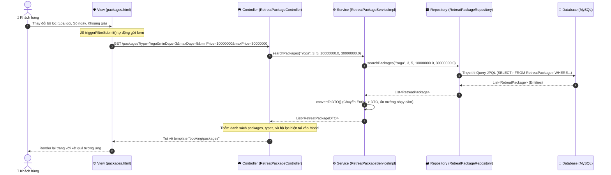

# BÁO CÁO CHI TIẾT LUỒNG XỬ LÝ UC06: DUYỆT VÀ LỌC GÓI TRỊ LIỆU

Báo cáo này phân tích chi tiết cách thức dữ liệu di chuyển từ giao diện người dùng (View Layer), đi qua các tầng xử lý của Backend (Controller, Service, Repository), truy vấn xuống Cơ sở dữ liệu và quay trở lại để hiển thị cho người dùng.

---

## 1. Sơ Đồ Luồng Hoạt Động (Flow Sequence)

Dưới đây là sơ đồ chi tiết biểu diễn luồng tương tác khi người dùng thực hiện lọc gói trị liệu trên giao diện:



---

## 2. Chi Tiết Từng Bước Trong Luồng Xử LÝ

### Bước 1: Giao Diện Người Dúng (View Layer)
- **File nguồn:** [packages.html](file:///d:/su26-swp391-se2023-g6/auramoon/src/main/resources/templates/booking/packages.html)
- **Hoạt động:**
  - Người dùng tương tác với thanh bên bộ lọc (Sidebar) bao gồm:
    1. **Mục tiêu sức khỏe (Retreat Type):** Các nút Radio tương ứng với từng loại trị liệu (`type`). Khi click, một đoạn mã JavaScript sẽ gán giá trị vào `input[type="hidden"]` có tên là `type` và gọi hàm `triggerFilterSubmit()`.
    2. **Thời lượng (Duration):** Thanh trượt kéo kép (Dual Range Slider) từ 2 đến 7 ngày (`minDays`, `maxDays`) hoặc các nút chọn nhanh (Quick Selects) như "Tất cả", "3 - 5 ngày", "6 - 7 ngày".
    3. **Khoảng giá (Price Range):** Thanh trượt kéo kép từ 10.000.000đ đến 50.000.000đ (`minPrice`, `maxPrice`) hoặc các tùy chọn chọn nhanh.
  - Khi có bất kỳ thay đổi nào từ các bộ lọc trên, sự kiện JS `change` hoặc hàm `setDurationRange()` / `setPriceRange()` sẽ gọi:
    ```javascript
    function triggerFilterSubmit() {
        document.getElementById("filterForm").submit();
    }
    ```
  - Form `#filterForm` sẽ gửi một HTTP GET Request tới endpoint `/packages` kèm theo các Query Parameters. 
  - **Ví dụ URL thực tế được tạo ra:** 
    `http://localhost:8080/packages?type=Yoga&minDays=3&maxDays=5&minPrice=10000000&maxPrice=30000000`

---

### Bước 2: Tầng Điều Khiển (Controller Layer)
- **File nguồn:** [RetreatPackageController.java](file:///d:/su26-swp391-se2023-g6/auramoon/src/main/java/com/AuraMoon/auramoon/booking/controller/RetreatPackageController.java)
- **Hàm xử lý:** `listPackages(...)`
- **Mã nguồn chi tiết:**
  ```java
  @GetMapping
  public String listPackages(
          @RequestParam(value = "type", required = false) String type,
          @RequestParam(value = "minDays", required = false) Integer minDays,
          @RequestParam(value = "maxDays", required = false) Integer maxDays,
          @RequestParam(value = "minPrice", required = false) Double minPrice,
          @RequestParam(value = "maxPrice", required = false) Double maxPrice,
          Model model) {

      // Gọi nghiệp vụ tìm kiếm từ Service
      List<RetreatPackageDTO> packages = retreatPackageService.searchPackages(
              type, minDays, maxDays, minPrice, maxPrice);

      // Đưa danh sách gói trị liệu tìm được vào Model
      model.addAttribute("packages", packages);
      
      // Lấy danh sách tất cả các loại gói hiện có để hiển thị lại trên Sidebar
      model.addAttribute("types", retreatPackageService.getAllActivePackageTypes());

      // Giữ lại trạng thái bộ lọc của người dùng để hiển thị trên giao diện
      model.addAttribute("selectedType", type == null || type.trim().isEmpty() ? "All" : type);
      model.addAttribute("minDays", minDays != null ? minDays : 2);
      model.addAttribute("maxDays", maxDays != null ? maxDays : 7);
      model.addAttribute("minPrice", minPrice != null ? minPrice : 10000000.0);
      model.addAttribute("maxPrice", maxPrice != null ? maxPrice : 50000000.0);

      // Xử lý luồng ngoại lệ: Nếu không tìm thấy gói phù hợp, lấy các gói phổ biến (Popular) để gợi ý
      if (packages.isEmpty()) {
          model.addAttribute("popularPackages", retreatPackageService.getPopularPackages());
      }

      return "booking/packages"; // Trả về tên template Thymeleaf
  }
  ```

---

### Bước 3: Tầng Nghiệp Vụ (Service Layer)
- **File nguồn:** [RetreatPackageService.java](file:///d:/su26-swp391-se2023-g6/auramoon/src/main/java/com/AuraMoon/auramoon/booking/service/RetreatPackageService.java) & [RetreatPackageServiceImpl.java](file:///d:/su26-swp391-se2023-g6/auramoon/src/main/java/com/AuraMoon/auramoon/booking/service/impl/RetreatPackageServiceImpl.java)
- **Hàm xử lý:** `searchPackages(...)` và hàm bổ trợ `convertToDTO(...)`
- **Mã nguồn chi tiết:**
  ```java
  @Override
  public List<RetreatPackageDTO> searchPackages(String typePackage, Integer minDays, Integer maxDays, Double minPrice, Double maxPrice) {
      // Gọi repository truy vấn thực thể (Entity) từ Database
      return retreatPackageRepository.searchPackages(typePackage, minDays, maxDays, minPrice, maxPrice)
              .stream()
              .map(this::convertToDTO) // Chuyển đổi mỗi Entity thành DTO
              .toList();
  }

  // Hàm Helper chuyển đổi thực thể để bảo vệ thông tin hệ thống (Soft delete, Audit date)
  private RetreatPackageDTO convertToDTO(RetreatPackage retreatPackage) {
      return RetreatPackageDTO.builder()
              .id(retreatPackage.getId())
              .typePackage(retreatPackage.getTypePackage())
              .packageName(retreatPackage.getPackageName())
              .durationDays(retreatPackage.getDurationDays())
              .services(retreatPackage.getServices())
              .description(retreatPackage.getDescription())
              .price(retreatPackage.getPrice())
              .build();
  }
  ```

---

### Bước 4: Tầng Truy Vấn (Repository Layer)
- **File nguồn:** [RetreatPackageRepository.java](file:///d:/su26-swp391-se2023-g6/auramoon/src/main/java/com/AuraMoon/auramoon/booking/repository/RetreatPackageRepository.java)
- **Hàm xử lý:** `searchPackages(...)`
- **Mã nguồn chi tiết:**
  Repository sử dụng JPQL để thực hiện tìm kiếm động tùy chỉnh, kiểm tra các tham số truyền vào (nếu là `null` hoặc chuỗi rỗng thì bỏ qua điều kiện đó):
  ```java
  @Query("""
          SELECT r
          FROM RetreatPackage r
          WHERE r.isActive = true
          AND r.isDelete = false
          AND (:typePackage IS NULL OR :typePackage = '' OR r.typePackage = :typePackage)
          AND (:minDays IS NULL OR r.durationDays >= :minDays)
          AND (:maxDays IS NULL OR r.durationDays <= :maxDays)
          AND (:minPrice IS NULL OR r.price >= :minPrice)
          AND (:maxPrice IS NULL OR r.price <= :maxPrice)
          """)
  List<RetreatPackage> searchPackages(
                  @Param("typePackage") String typePackage,
                  @Param("minDays") Integer minDays,
                  @Param("maxDays") Integer maxDays,
                  @Param("minPrice") Double minPrice,
                  @Param("maxPrice") Double maxPrice);
  ```
- **SQL tương đương sinh ra bởi Hibernate:**
  ```sql
  SELECT * FROM RETREAT_PACKAGE r 
  WHERE r.is_active = TRUE 
    AND r.is_delete = FALSE
    AND (?1 IS NULL OR ?1 = '' OR r.type_package = ?1)
    AND (?2 IS NULL OR r.duration_days >= ?2)
    AND (?3 IS NULL OR r.duration_days <= ?3)
    AND (?4 IS NULL OR r.price >= ?4)
    AND (?5 IS NULL OR r.price <= ?5);
  ```

---

### Bước 5: Thực Thể và Database Layer
- **File nguồn:** [RetreatPackage.java](file:///d:/su26-swp391-se2023-g6/auramoon/src/main/java/com/AuraMoon/auramoon/booking/entity/RetreatPackage.java) kế thừa từ [BaseEntity.java](file:///d:/su26-swp391-se2023-g6/auramoon/src/main/java/com/AuraMoon/auramoon/common/entity/BaseEntity.java)
- Bảng cơ sở dữ liệu `RETREAT_PACKAGE` chứa thông tin chi tiết về các gói như:
  - `package_id` (Khóa chính)
  - `type_package` (Yoga, Detox, Weight Loss, v.v.)
  - `package_name` (Tên gói)
  - `duration_days` (Số ngày diễn ra gói)
  - `price` (Giá tiền kiểu Decimal)
  - `is_active` (Cờ trạng thái hoạt động)
  - `is_delete` (Cờ xóa mềm kế thừa từ `BaseEntity`)
- Database trả về danh sách các bản ghi thô, Hibernate map chúng thành `List<RetreatPackage>` đưa về Service.

---

### Bước 6: Trả Kết Quả và Render View
1. Danh sách `List<RetreatPackageDTO>` được Controller thêm vào Model dưới tên `"packages"`.
2. Thymeleaf engine phân tích file `packages.html` và sinh mã HTML động:
   - Sử dụng vòng lặp `th:each="pkg : ${packages}"` để lặp qua danh sách và hiển thị card gói trị liệu.
   - Sử dụng hàm tiện ích `#numbers.formatDecimal(pkg.price, 0, 'POINT', 0, 'COMMA')` để format giá tiền đẹp mắt (ví dụ: `15.000.000 đ`).
   - Phân tích chuỗi danh sách dịch vụ đi kèm bằng cách dùng `#strings.arraySplit(pkg.services, ',')` để hiển thị các thẻ nhãn (tags) dịch vụ riêng biệt.
   - Hiển thị danh mục loại gói trị liệu ở cột bên trái bằng cách lặp `th:each="type : ${types}"`.
   - Nếu danh sách rỗng (`packages.isEmpty()`), Thymeleaf kiểm tra điều kiện `th:if="${popularPackages != null}"` để hiển thị phần gợi ý "Không tìm thấy gói phù hợp" và liệt kê 3 gói phổ biến hàng đầu.
3. Trang HTML hoàn thiện được trả về trình duyệt của khách hàng.

---

## 3. Tóm Tắt Các Hàm Chính Trong Luồng

| Tầng | Tên File nguồn | Tên Hàm / API | Vai trò |
| :--- | :--- | :--- | :--- |
| **View** | [packages.html](file:///d:/su26-swp391-se2023-g6/auramoon/src/main/resources/templates/booking/packages.html) | `triggerFilterSubmit()` | Lắng nghe thay đổi bộ lọc trên giao diện và submit form bằng JS. |
| **Controller** | [RetreatPackageController.java](file:///d:/su26-swp391-se2023-g6/auramoon/src/main/java/com/AuraMoon/auramoon/booking/controller/RetreatPackageController.java) | `listPackages(...)` | Đón nhận HTTP GET `/packages`, tiếp nhận các tham số lọc, điều phối dữ liệu vào Model và chuyển hướng tới view. |
| **Controller** | [RetreatPackageController.java](file:///d:/su26-swp391-se2023-g6/auramoon/src/main/java/com/AuraMoon/auramoon/booking/controller/RetreatPackageController.java) | `packageDetail(...)` | API hỗ trợ xem chi tiết một gói theo ID (`/packages/{id}`). |
| **Service** | [RetreatPackageServiceImpl.java](file:///d:/su26-swp391-se2023-g6/auramoon/src/main/java/com/AuraMoon/auramoon/booking/service/impl/RetreatPackageServiceImpl.java) | `searchPackages(...)` | Xử lý logic nghiệp vụ tìm kiếm, chuyển đổi Entities nhận được từ Repository thành DTOs. |
| **Service** | [RetreatPackageServiceImpl.java](file:///d:/su26-swp391-se2023-g6/auramoon/src/main/java/com/AuraMoon/auramoon/booking/service/impl/RetreatPackageServiceImpl.java) | `convertToDTO(...)` | Hàm hỗ trợ (private helper) ánh xạ dữ liệu từ `RetreatPackage` sang `RetreatPackageDTO`. |
| **Repository** | [RetreatPackageRepository.java](file:///d:/su26-swp391-se2023-g6/auramoon/src/main/java/com/AuraMoon/auramoon/booking/repository/RetreatPackageRepository.java) | `searchPackages(...)` | Thực hiện câu query JPQL động lọc dữ liệu an toàn dựa trên tham số người dùng nhập vào. |
