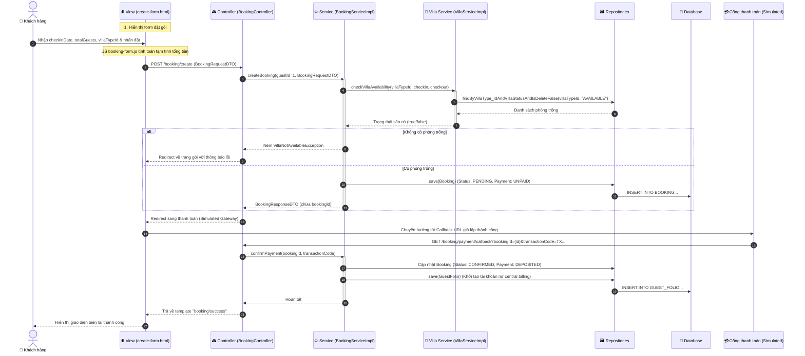

# BÁO CÁO CHI TIẾT LUỒNG XỬ LÝ UC07: ĐẶT GÓI TRỊ LIỆU & THANH TOÁN ĐẶT CỌC

Báo cáo này phân tích chi tiết cách thức dữ liệu di chuyển từ giao diện điền thông tin và thanh toán (View Layer), đi qua các tầng xử lý Backend (Controller, Service, Repository, Villa Availability Check) và tích hợp sang Billing Context để tự động khởi tạo Guest Folio.

---

## 1. Sơ Đồ Luồng Hoạt Động (Flow Sequence)

Dưới đây là sơ đồ chi tiết biểu diễn luồng tương tác khi người dùng thực hiện chọn ngày check-in, số khách, loại biệt thự, thanh toán đặt cọc và khởi tạo tài khoản nợ Guest Folio:



---

## 2. Chi Tiết Từng Bước Trong Luồng Xử LÝ

### Bước 1: View Layer (Mẫu đơn đặt - create-form.html & JS tính toán)
- **File nguồn:** [create-form.html](file:///d:/su26-swp391-se2023-g6/auramoon/src/main/resources/templates/booking/create-form.html) & [booking-form.js](file:///d:/su26-swp391-se2023-g6/auramoon/src/main/resources/static/js/booking/booking-form.js)
- **Hoạt động:**
  - Trang nhận dữ liệu của gói chọn trước từ model (`pkg`).
  - [booking-form.js](file:///d:/su26-swp391-se2023-g6/auramoon/src/main/resources/static/js/booking/booking-form.js) thực hiện tính toán động trên giao diện (Client-side):
    - Đặt giới hạn ngày check-in sớm nhất là ngày hôm nay.
    - Khi thay đổi ngày check-in, tự động cộng `durationDays` của gói để tính toán và hiển thị ngày **Check-out dự kiến** (`checkoutDateDisplay`).
    - Khi thay đổi loại Villa (`villaTypeId`), lấy phụ thu mỗi ngày của Villa (`data-price`) nhân với số ngày của gói để ra **Phụ thu Villa** (`surchargeDisplay`).
    - Tính **Tổng chi phí** tạm tính = `Giá gói cơ bản` + `Phụ thu Villa` và render lên giao diện.
  - Khi người dùng nhấn nút "Xác nhận & Thanh toán cọc", form sẽ gửi yêu cầu HTTP POST tới `/booking/create` kèm thông tin dạng `BookingRequestDTO` (`checkinDate`, `totalGuests`, `villaTypeId`, `retreatPackageId`).

---

### Bước 2: Tầng Điều Khiển (BookingController.java)
- **File nguồn:** [BookingController.java](file:///d:/su26-swp391-se2023-g6/auramoon/src/main/java/com/AuraMoon/auramoon/booking/controller/BookingController.java)
- **Hàm xử lý:** `createBooking(...)`
- **Mã nguồn:**
  ```java
  @PostMapping("/create")
  public String createBooking(@ModelAttribute("bookingRequest") BookingRequestDTO request) {
      Integer guestId = 1; // Giả lập tài khoản khách hàng mặc định (Demo)
      try {
          BookingResponseDTO response = bookingService.createBooking(guestId, request);
          // Chuyển hướng sang trang callback giả lập thanh toán thành công
          return "redirect:/booking/payment/callback?bookingId=" + response.getBookingId() 
                 + "&transactionCode=TX_AURA_" + System.currentTimeMillis();
      } catch (Exception e) {
          // Nếu có lỗi (Ví dụ: hết phòng), redirect về trang gói trị liệu kèm thông tin lỗi
          return "redirect:/packages/" + request.getRetreatPackageId() + "?error=" + e.getMessage();
      }
  }
  ```

---

### Bước 3: Tầng Nghiệp Vụ (BookingServiceImpl.java)
- **File nguồn:** [BookingServiceImpl.java](file:///d:/su26-swp391-se2023-g6/auramoon/src/main/java/com/AuraMoon/auramoon/booking/service/impl/BookingServiceImpl.java)
- **Hàm xử lý:** `createBooking(...)`
- **Mã nguồn:**
  ```java
  @Override
  @Transactional
  public BookingResponseDTO createBooking(Integer guestId, BookingRequestDTO request) {
      // 1. Tìm kiếm thông tin gói trị liệu đang kích hoạt
      RetreatPackage retreatPackage = retreatPackageRepository.findByIdAndIsActiveTrueAndIsDeleteFalse(request.getRetreatPackageId())
              .orElseThrow(() -> new IllegalArgumentException("Không tìm thấy gói trị liệu."));

      // 2. Tự động tính ngày check-out dựa vào số ngày của gói trị liệu
      LocalDate checkinDate = request.getCheckinDate();
      LocalDate checkoutDate = checkinDate.plusDays(retreatPackage.getDurationDays());

      // 3. Gọi Villa Service kiểm tra trạng thái khả dụng của loại Villa được chọn
      boolean isAvailable = villaService.checkVillaAvailability(request.getVillaTypeId(), checkinDate, checkoutDate);
      if (!isAvailable) {
          // Phòng tránh đặt trùng (Double Booking Prevention)
          throw new VillaNotAvailableException("Loại biệt thự đã chọn không còn phòng trống trong thời gian này.");
      }

      // 4. Khởi tạo thực thể Booking với trạng thái PENDING & UNPAID
      Booking booking = Booking.builder()
              .guestId(guestId)
              .retreatPackage(retreatPackage)
              .checkinDate(checkinDate)
              .checkoutDate(checkoutDate)
              .totalGuests(request.getTotalGuests())
              .bookingStatus("PENDING")
              .paymentStatus("UNPAID")
              .build();

      Booking savedBooking = bookingRepository.save(booking);

      return BookingResponseDTO.builder()
              .bookingId(savedBooking.getId())
              .guestId(savedBooking.getGuestId())
              .checkinDate(savedBooking.getCheckinDate())
              .checkoutDate(savedBooking.getCheckoutDate())
              .totalGuests(savedBooking.getTotalGuests())
              .bookingStatus(savedBooking.getBookingStatus())
              .paymentStatus(savedBooking.getPaymentStatus())
              .retreatPackageName(savedBooking.getRetreatPackage().getPackageName())
              .build();
  }
  ```

---

### Bước 4: Kiểm Tra Phòng Trống (VillaServiceImpl.java)
- **File nguồn:** [VillaServiceImpl.java](file:///d:/su26-swp391-se2023-g6/auramoon/src/main/java/com/AuraMoon/auramoon/booking/service/impl/VillaServiceImpl.java)
- **Hàm xử lý:** `checkVillaAvailability(...)`
- **Mã nguồn:**
  ```java
  @Override
  public boolean checkVillaAvailability(Integer villaTypeId, LocalDate checkinDate, LocalDate checkoutDate) {
      // Tìm xem có Villa nào thuộc Loại Villa yêu cầu, đang trạng thái "AVAILABLE" và chưa bị xóa mềm không
      List<Villa> availableVillas = villaRepository.findByVillaType_IdAndVillaStatusAndIsDeleteFalse(villaTypeId, "AVAILABLE");
      return !availableVillas.isEmpty();
  }
  ```

---

### Bước 5: Callback Thanh Toán & Tạo Guest Folio (Tích Hợp Tài Chính)
- Sau khi thanh toán đặt cọc thành công, Cổng thanh toán gọi callback đến Endpoint:
  `GET /booking/payment/callback?bookingId={id}&transactionCode={code}`
- Controller đón nhận yêu cầu và gọi hàm xác nhận thanh toán `bookingService.confirmPayment(...)`:
  ```java
  @Override
  @Transactional
  public void confirmPayment(Integer bookingId, String transactionCode) {
      // 1. Tìm kiếm Booking
      Booking booking = bookingRepository.findById(bookingId)
              .orElseThrow(() -> new BookingNotFoundException("Không tìm thấy đơn đặt phòng."));

      // 2. Xác nhận trạng thái Đơn đặt phòng và Thanh toán cọc
      booking.setBookingStatus("CONFIRMED");
      booking.setPaymentStatus("DEPOSITED");
      bookingRepository.save(booking);

      // 3. Tự động khởi tạo tài khoản công nợ GuestFolio (Tiêu chuẩn AHLEI)
      GuestFolio guestFolio = GuestFolio.builder()
              .bookingId(bookingId)
              .totalPackageAmount(booking.getRetreatPackage().getPrice()) // Lưu giá gốc gói
              .totalExtraFb(BigDecimal.ZERO)                              // Chi phí ăn uống phát sinh ban đầu = 0
              .finalAmount(booking.getRetreatPackage().getPrice())         // Tổng hóa đơn công nợ
              .status("PENDING")                                           // Chưa thanh toán hết (chờ Checkout mới thanh toán phần còn lại)
              .build();
      guestFolioRepository.save(guestFolio);
  }
  ```
- Việc tạo tài khoản nợ `GuestFolio` trung tâm giúp các Module khác (Spa - Module 3, F&B - Module 4) có thể đẩy chi phí phát sinh trực tiếp vào đây qua `booking_id`, phục vụ việc in hóa đơn tổng hợp khi làm thủ tục check-out.

---

### Bước 6: Hoàn Tất
- Controller định hướng người dùng tới template `booking/success.html` để hiển thị biên lai xác nhận đặt phòng thành công, kết thúc luồng UC07.

---

## 3. Danh Sách Các Hàm Tham Gia Hệ Thống

| Tầng | Tên File nguồn | Tên Hàm / Phương thức | Nhiệm vụ |
| :--- | :--- | :--- | :--- |
| **View (Client)** | [booking-form.js](file:///d:/su26-swp391-se2023-g6/auramoon/src/main/resources/static/js/booking/booking-form.js) | `updateCheckoutDate()` | Tính toán động ngày Check-out dự kiến. |
| **View (Client)** | [booking-form.js](file:///d:/su26-swp391-se2023-g6/auramoon/src/main/resources/resources/static/js/booking/booking-form.js) | `updatePricing()` | Tính toán động phụ thu loại biệt thự và tổng chi phí tạm tính. |
| **Controller** | [BookingController.java](file:///d:/su26-swp391-se2023-g6/auramoon/src/main/java/com/AuraMoon/auramoon/booking/controller/BookingController.java) | `showCreateForm(...)` | Lấy dữ liệu và trả về trang điền thông tin đặt phòng. |
| **Controller** | [BookingController.java](file:///d:/su26-swp391-se2023-g6/auramoon/src/main/java/com/AuraMoon/auramoon/booking/controller/BookingController.java) | `createBooking(...)` | Tiếp nhận thông tin đặt phòng, gọi service xử lý đặt phòng. |
| **Controller** | [BookingController.java](file:///d:/su26-swp391-se2023-g6/auramoon/src/main/java/com/AuraMoon/auramoon/booking/controller/BookingController.java) | `paymentCallback(...)` | Lắng nghe phản hồi từ cổng thanh toán, gọi confirmPayment. |
| **Service** | [BookingServiceImpl.java](file:///d:/su26-swp391-se2023-g6/auramoon/src/main/java/com/AuraMoon/auramoon/booking/service/impl/BookingServiceImpl.java) | `createBooking(...)` | Kiểm tra phòng trống, tính toán thời gian, tạo mới thực thể `Booking` với trạng thái PENDING. |
| **Service** | [BookingServiceImpl.java](file:///d:/su26-swp391-se2023-g6/auramoon/src/main/java/com/AuraMoon/auramoon/booking/service/impl/BookingServiceImpl.java) | `confirmPayment(...)` | Cập nhật trạng thái Booking sang CONFIRMED và tự động mở tài khoản hóa đơn nợ `GuestFolio`. |
| **Service** | [VillaServiceImpl.java](file:///d:/su26-swp391-se2023-g6/auramoon/src/main/java/com/AuraMoon/auramoon/booking/service/impl/VillaServiceImpl.java) | `checkVillaAvailability(...)` | Kiểm tra xem loại Villa có còn phòng trống sẵn sàng sử dụng hay không. |
| **Repository** | [VillaRepository.java](file:///d:/su26-swp391-se2023-g6/auramoon/src/main/java/com/AuraMoon/auramoon/booking/repository/VillaRepository.java) | `findByVillaType_IdAndVillaStatusAnd...` | Thực thi query tìm kiếm biệt thự theo ID loại biệt thự và trạng thái "AVAILABLE". |
