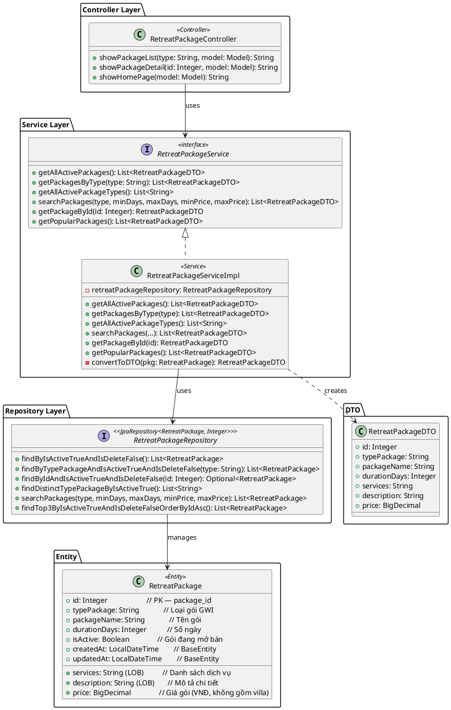
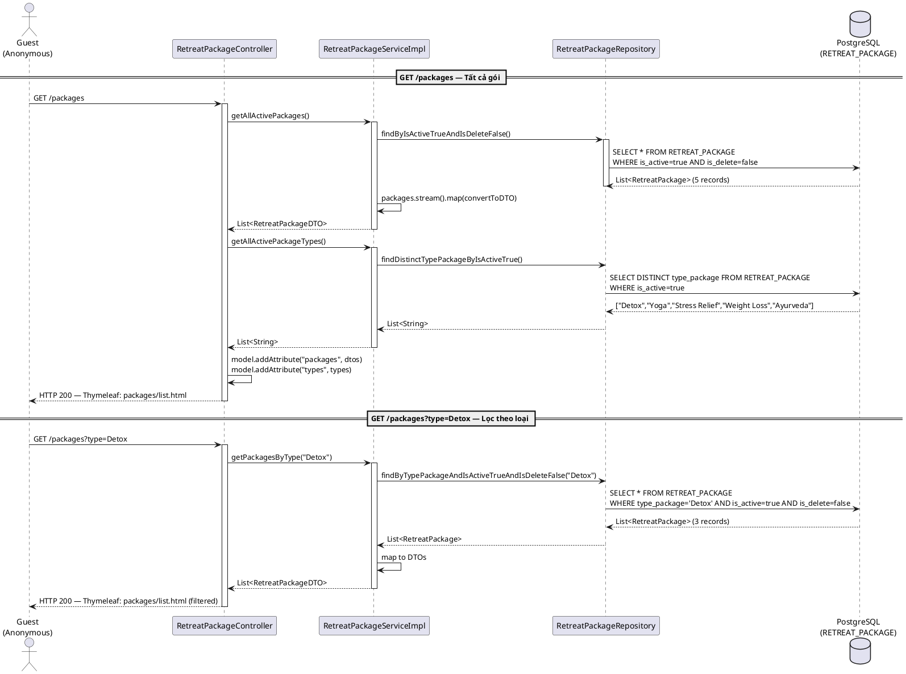
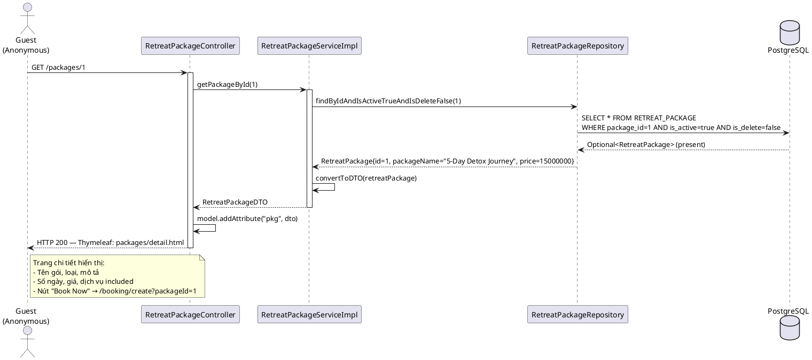
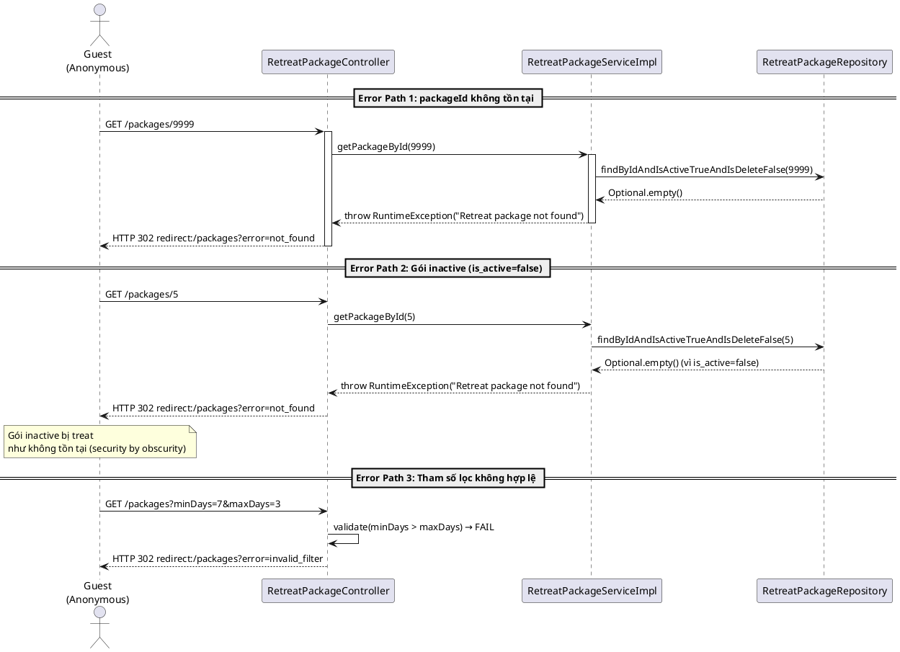
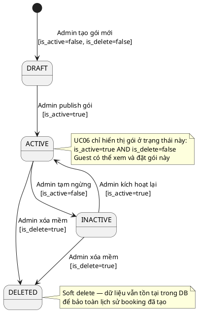

# ENGINEERING DESIGN SPECIFICATION (EDS) v2.0

# UC06 — Browse Wellness Packages

| Field                    | Value                                           |
| ------------------------ | ----------------------------------------------- |
| **Document ID**    | `AURAMOON-BOOKING-EDS-UC06`                   |
| **Version**        | 1.1                                             |
| **Date**           | 2026-06-19                                      |
| **Status**         | Approved                                        |
| **Document Owner** | Lê Trà My — Module 2 Lead                   |
| **Author**         | Lê Trà My — Full-stack Developer            |
| **Reviewed by**    | Phùng Giang Hải                               |
| **DPO Sign-off**   | N/A — Không xử lý PII (Public catalog data) |
| **Approved by**    | Phùng Giang Hải — Tech Lead                   |
| **Last Review**    | 2026-06-20                                      |
| **Based on EDS**   | v2.0                                            |

# CHANGELOG

| Ngày      | Người thực hiện | Nội dung thay đổi                                                                                         |
| ---------- | ------------------- | ------------------------------------------------------------------------------------------------------------ |
| 2026-06-19 | Student 2           | Tạo tài liệu lần đầu — UC06 Browse Wellness Packages                                                  |
| 2026-06-19 | Student 2           | v1.1 — Bổ sung §5.3 Repository, §6.3 State Machine, §6.4 Error paths, cập nhật DTO thực tế từ code |

---

# MỤC LỤC

1. Tổng quan UC
2. Ma trận Truy vết
3. Architecture Decision Records
4. Non-Functional Requirements & SLA
5. Static Modeling
6. Dynamic Modeling
7. Domain Event Catalog
8. Interface Specification
9. API Specification
10. Bảng mã lỗi
11. Quy trình Triển khai
12. Rollback & Incident Runbook
13. Kịch bản Kiểm thử
14. Phương pháp Xác minh
15. Mẫu thử thực tế
16. Bảng tổng hợp phân quyền

---

# 1. Tổng quan UC

> **UC06** cho phép Guest (kể cả khách vãng lai chưa đăng nhập) duyệt và lọc danh sách các gói nghỉ dưỡng (Retreat Packages) theo mục tiêu wellness để tìm gói phù hợp trước khi đặt phòng.

| Field                           | Value                                                                           |
| ------------------------------- | ------------------------------------------------------------------------------- |
| **UC ID**                 | `UC06`                                                                        |
| **UC Name**               | Browse Wellness Packages                                                        |
| **Priority**              | 🟡 P1 — Core Discovery Feature                                                 |
| **Module**                | `booking` — Retreat Package & Accommodation Booking                          |
| **Bounded Context**       | `booking`                                                                     |
| **Data Classification**   | `Public` (catalog data — không có PII)                                     |
| **Compliance Scope**      | N/A — Không xử lý dữ liệu cá nhân                                       |
| **Primary Actor**         | Guest (authenticated hoặc anonymous)                                           |
| **Upstream Dependencies** | Không có (entry point)                                                        |
| **Downstream Consumers**  | UC07 (Book Package — nhận `packageId` được chọn)                        |
| **Precondition**          | Hệ thống đang hoạt động, có ít nhất 1 gói active trong DB             |
| **Postcondition**         | Guest xem được danh sách hoặc chi tiết gói và có thể click "Book Now" |

---

# 2. Ma trận Truy vết

| Requirement ID      | Loại         | Mô tả yêu cầu                            | Thành phần Code                                                        | Compliance Target     | ADR liên quan |
| ------------------- | ------------- | -------------------------------------------- | ------------------------------------------------------------------------ | --------------------- | -------------- |
| **UC06-01**   | User Story    | Guest duyệt toàn bộ gói active           | `RetreatPackageController.GET /packages` → `getAllActivePackages()` | GWI Wellness Taxonomy | ADR-UC06-001   |
| **UC06-02**   | User Story    | Guest lọc gói theo loại (Detox, Yoga...)  | `getPackagesByType(typePackage)`                                       | GWI Standards         | ADR-UC06-001   |
| **UC06-03**   | User Story    | Guest tìm kiếm nâng cao (ngày, giá)     | `searchPackages(type, minDays, maxDays, minPrice, maxPrice)`           | —                    | —             |
| **UC06-04**   | User Story    | Guest xem chi tiết 1 gói cụ thể          | `getPackageById(id)`                                                   | —                    | —             |
| **UC06-05**   | User Story    | Trang chủ hiển thị top 3 gói nổi bật   | `getPopularPackages()`                                                 | —                    | —             |
| **BR-GWI**    | Business Rule | Tên gói phải dùng thuật ngữ chuẩn GWI | `RetreatPackage.typePackage`, `packageName`                          | GWI Standards         | —             |
| **BR-PUBLIC** | Business Rule | Catalog xem không cần đăng nhập         | `SecurityConfig` — public endpoints                                   | —                    | ADR-UC06-001   |

---

# 3. Architecture Decision Records (ADR)

## ADR-UC06-001 — Gói nghỉ dưỡng là Public catalog, không yêu cầu đăng nhập

| Field              | Value                      |
| ------------------ | -------------------------- |
| **Status**   | Accepted                   |
| **Deciders** | Student 2 — Module 2 Lead |
| **Date**     | 2026-06-19                 |

**Bối cảnh:**
Trang duyệt gói là landing page công khai. Yêu cầu đăng nhập để xem catalog sẽ làm giảm conversion rate và cản trở khách tiềm năng.

**Các phương án đã xem xét:**

| Phương án | Mô tả                              | Ưu điểm                  | Nhược điểm                                |
| ------------ | ------------------------------------ | --------------------------- | --------------------------------------------- |
| A            | Xem catalog không cần đăng nhập | + UX tốt, tăng conversion | - Cần handle guest/authenticated state ở UI |
| B            | Yêu cầu đăng nhập để xem      | + Đơn giản hóa RBAC     | - Giảm UX, cản trở khách tiềm năng      |

**Quyết định:** Chọn **Phương án A** — Public catalog. Nút "Book Now" mới redirect đến `/login` nếu chưa login.

**Hệ quả tích cực:**

- Khách vãng lai xem catalog → tăng organic traffic
- Không friction cho lần trải nghiệm đầu tiên

**Tiêu cực / Trade-offs:**

- Controller phải xử lý cả `currentUser == null` tại `GET /booking/create`

---

## ADR-UC06-002 — isDelete (Soft Delete) cho RetreatPackage

| Field            | Value      |
| ---------------- | ---------- |
| **Status** | Accepted   |
| **Date**   | 2026-06-19 |

**Quyết định:** Dùng soft delete (`is_delete = true`) thay vì xóa vật lý. Tất cả query đều filter `isDeleteFalse` để bảo toàn lịch sử booking.

**Implementation:**

```java
// Repository luôn filter: isActive=true AND isDelete=false
retreatPackageRepository.findByIsActiveTrueAndIsDeleteFalse()
```

---

# 4. Non-Functional Requirements & SLA

## 4.1. Performance & Availability

| Category     | Requirement             | Target SLA      | Measurement Method |
| ------------ | ----------------------- | --------------- | ------------------ |
| Latency      | Page load (p99)         | `< 200ms`     | k6 load test       |
| Availability | Uptime (monthly)        | `99.9%`       | Uptime monitor     |
| Throughput   | Concurrent requests     | `200 req/s`   | Load test          |
| Cache        | Catalog data (optional) | Refresh 5 phút | Spring Cache       |

## 4.2. Data Integrity

| Category        | Requirement                     | Target                                           | Measurement Method  | Compliance Basis |
| --------------- | ------------------------------- | ------------------------------------------------ | ------------------- | ---------------- |
| Data freshness  | Package catalog                 | Real-time từ DB                                 | Manual check (§14.1) | Hotel Operations |
| Data accuracy   | isActive + isDelete filter      | 100% — chỉ hiển thị gói active + chưa xóa | Unit test (§13.1)    | Hotel Operations |
| Type validation | typePackage thuộc GWI taxonomy | Admin-controlled                                 | DB integrity check  | GWI Standards    |

## 4.3. Security

| Category          | Requirement                              | Target                  | Verification Method     | Compliance Basis  |
| ----------------- | ---------------------------------------- | ----------------------- | ----------------------- | ----------------- |
| Endpoint exposure | Public — không cần JWT                | 200 OK không cần token  | curl test (§15)          | ADR-UC06-001      |
| SQL Injection     | Spring Data JPA — parameterized queries | 0 injection incidents   | OWASP ZAP scan          | OWASP Top 10      |
| XSS               | Thymeleaf auto-escape HTML               | 0 XSS incidents         | Manual security test    | OWASP Top 10      |
| Rate Limiting     | 300 req/min per IP (nếu cần)           | < 300 req/min choạy ổn | Load test (k6)          | Hotel Operations  |

---

# 5. Static Modeling

## 5.1. Class Diagram



## 5.2. Data Structure (JPA Entity & DTO)

```java
// RetreatPackage.java — bảng RETREAT_PACKAGE
@Entity
@Table(name = "RETREAT_PACKAGE")
@Data @EqualsAndHashCode(callSuper = true)
@NoArgsConstructor @AllArgsConstructor @Builder
public class RetreatPackage extends BaseEntity {

    @Id
    @GeneratedValue(strategy = GenerationType.IDENTITY)
    @Column(name = "package_id")
    private Integer id;

    @Column(name = "type_package", length = 50)
    private String typePackage;          // GWI taxonomy: "Detox", "Yoga", "Stress Relief", "Weight Loss", "Ayurveda"

    @Column(name = "package_name", length = 50)
    private String packageName;          // VD: "5-Day Detoxification Journey"

    @Column(name = "duration_days")
    private Integer durationDays;        // Số ngày — checkoutDate = checkinDate + durationDays

    @Lob
    @Column(name = "services")
    private String services;             // VD: "3 Spa sessions, 2 Yoga classes, Full board meals"

    @Lob
    @Column(name = "description")
    private String description;          // Mô tả chi tiết chương trình

    @Column(name = "is_active")
    @Builder.Default
    private Boolean isActive = true;     // false = tạm ngừng bán, ẩn khỏi catalog

    @Column(name = "price")
    private BigDecimal price;            // Giá gói spa/wellness (VNĐ, KHÔNG bao gồm giá villa)
}

// RetreatPackageDTO.java — DTO trả về Controller/View
@Data @NoArgsConstructor @AllArgsConstructor @Builder
public class RetreatPackageDTO {
    private Integer id;
    private String typePackage;
    private String packageName;
    private Integer durationDays;
    private String services;
    private String description;
    private BigDecimal price;
    // Note: isActive không cần trả ra vì chỉ query active packages
}
```

## 5.3. Repository — Query Methods (từ code thực tế)

```java
// RetreatPackageRepository.java
@Repository
public interface RetreatPackageRepository extends JpaRepository<RetreatPackage, Integer> {

    // UC06-01: Lấy tất cả gói active, chưa xóa
    List<RetreatPackage> findByIsActiveTrueAndIsDeleteFalse();

    // UC06-02: Lọc theo typePackage
    List<RetreatPackage> findByTypePackageAndIsActiveTrueAndIsDeleteFalse(String typePackage);

    // UC06-03 (filter bar): Lấy danh sách loại duy nhất cho dropdown
    @Query("SELECT DISTINCT r.typePackage FROM RetreatPackage r WHERE r.isActive = true")
    List<String> findDistinctTypePackageByIsActiveTrue();

    // UC06-03 (search): Tìm kiếm nâng cao (JPQL @Query với nullable params)
    @Query("SELECT r FROM RetreatPackage r WHERE " +
           "(:type IS NULL OR r.typePackage = :type) AND " +
           "(:minDays IS NULL OR r.durationDays >= :minDays) AND " +
           "(:maxDays IS NULL OR r.durationDays <= :maxDays) AND " +
           "(:minPrice IS NULL OR r.price >= :minPrice) AND " +
           "(:maxPrice IS NULL OR r.price <= :maxPrice) AND " +
           "r.isActive = true AND r.isDelete = false")
    List<RetreatPackage> searchPackages(
        @Param("type") String type,
        @Param("minDays") Integer minDays, @Param("maxDays") Integer maxDays,
        @Param("minPrice") Double minPrice, @Param("maxPrice") Double maxPrice
    );

    // UC06-04: Chi tiết gói — đảm bảo vẫn active
    Optional<RetreatPackage> findByIdAndIsActiveTrueAndIsDeleteFalse(Integer id);

    // UC06-05: Top 3 gói nổi bật cho homepage
    List<RetreatPackage> findTop3ByIsActiveTrueAndIsDeleteFalseOrderByIdAsc();
}
```

---

# 6. Dynamic Modeling

## 6.1. Sequence Diagram — Browse All / Filter by Type (Happy Path)



## 6.2. Sequence Diagram — Xem chi tiết gói (Happy Path)



## 6.3. Sequence Diagram — Error Paths



## 6.4. State Machine — RetreatPackage Lifecycle



---

# 7. Domain Event Catalog

## 7.1. Events Published

| Event Name          | Trigger                                       | Publisher                     | Subscriber(s)          | Async? |
| ------------------- | --------------------------------------------- | ----------------------------- | ---------------------- | ------ |
| `PackageViewed`   | Guest xem chi tiết gói (`getPackageById`) | `RetreatPackageServiceImpl` | Analytics Module (log) | No     |
| `PackageSearched` | Guest tìm kiếm nâng cao                    | `RetreatPackageServiceImpl` | Analytics Module (log) | No     |

## 7.2. Events Consumed

> UC06 không tiêu thụ event nào từ module khác — đây là entry point của user journey.

## 7.3. Payload Schema

> UC06 là **read-only catalog** — chỉ phát ra analytics event không có payload PII.

```java
// PackageViewed — Analytics event (logging format, không phải message queue)
public class PackageViewedEvent {
    String eventType;       // "PackageViewed" | "PackageSearched"
    String occurredAt;      // ISO 8601 — Instant.now().toString()
    String version;         // "1.0"

    // Payload — không có PII
    Integer packageId;      // ID của gói được xem (nếu PackageViewed)
    String  packageType;    // Loại gói: "Detox", "Yoga"... (nếu PackageSearched)
    String  searchCriteria; // Mô tả bộ filter đã áp dụng (nếu PackageSearched)

    // Metadata
    String  sessionId;      // Session ID để track user journey (không phải userId)
    String  correlationId;  // RequestId để trace
}
// Note: Không ghi userId/email nếu user Anonymous — chỉ sessionId
```

---

# 8. Interface Specification

## 8.1. Service Interface (từ code thực tế)

```java
// RetreatPackageService.java
// @version 1.0
public interface RetreatPackageService {

    /** Lấy tất cả gói đang active — dùng cho trang /packages */
    List<RetreatPackageDTO> getAllActivePackages();

    /**
     * Lọc gói theo loại GWI (type_package)
     * @param typePackage VD: "Detox", "Yoga", "Stress Relief"
     * @return Danh sách gói theo loại, empty list nếu không có
     */
    List<RetreatPackageDTO> getPackagesByType(String typePackage);

    /** Lấy danh sách loại gói duy nhất cho dropdown filter */
    List<String> getAllActivePackageTypes();

    /**
     * Tìm kiếm nâng cao — tất cả params đều nullable (null = không filter)
     * @param typePackage Loại gói
     * @param minDays / maxDays Khoảng số ngày
     * @param minPrice / maxPrice Khoảng giá (VNĐ)
     */
    List<RetreatPackageDTO> searchPackages(
        String typePackage, Integer minDays, Integer maxDays,
        Double minPrice, Double maxPrice
    );

    /**
     * Lấy chi tiết gói theo ID
     * @throws RuntimeException("Retreat package not found") nếu không tìm thấy hoặc inactive
     */
    RetreatPackageDTO getPackageById(Integer id);

    /** Lấy top 3 gói nổi bật cho trang chủ (order by id ASC) */
    List<RetreatPackageDTO> getPopularPackages();
}
```

## 8.2. Repository Interface

```java
// RetreatPackageRepository.java
// @version 1.0
public interface RetreatPackageRepository extends JpaRepository<RetreatPackage, Integer> {

    /** UC06-01: Lấy tất cả gói active, chưa xóa */
    List<RetreatPackage> findByIsActiveTrueAndIsDeleteFalse();

    /** UC06-02: Lọc theo typePackage */
    List<RetreatPackage> findByTypePackageAndIsActiveTrueAndIsDeleteFalse(String typePackage);

    /** UC06-03: Lấy danh sách loại duy nhất cho dropdown */
    @Query("SELECT DISTINCT r.typePackage FROM RetreatPackage r WHERE r.isActive = true")
    List<String> findDistinctTypePackageByIsActiveTrue();

    /** UC06-03 (search): Tìm kiếm nâng cao với nullable params */
    @Query("SELECT r FROM RetreatPackage r WHERE " +
           "(:type IS NULL OR r.typePackage = :type) AND " +
           "(:minDays IS NULL OR r.durationDays >= :minDays) AND " +
           "(:maxDays IS NULL OR r.durationDays <= :maxDays) AND " +
           "(:minPrice IS NULL OR r.price >= :minPrice) AND " +
           "(:maxPrice IS NULL OR r.price <= :maxPrice) AND " +
           "r.isActive = true AND r.isDelete = false")
    List<RetreatPackage> searchPackages(
        @Param("type") String type,
        @Param("minDays") Integer minDays, @Param("maxDays") Integer maxDays,
        @Param("minPrice") Double minPrice, @Param("maxPrice") Double maxPrice
    );

    /** UC06-04: Chi tiết gói — đảm bảo vẫn active */
    Optional<RetreatPackage> findByIdAndIsActiveTrueAndIsDeleteFalse(Integer id);

    /** UC06-05: Top 3 gói nổi bật cho homepage */
    List<RetreatPackage> findTop3ByIsActiveTrueAndIsDeleteFalseOrderByIdAsc();
}
```

## 8.3. Service Implementation — convertToDTO (từ code thực tế)

```java
// RetreatPackageServiceImpl.java
private RetreatPackageDTO convertToDTO(RetreatPackage retreatPackage) {
    return RetreatPackageDTO.builder()
            .id(retreatPackage.getId())
            .typePackage(retreatPackage.getTypePackage())
            .packageName(retreatPackage.getPackageName())
            .durationDays(retreatPackage.getDurationDays())
            .services(retreatPackage.getServices())
            .description(retreatPackage.getDescription())
            .price(retreatPackage.getPrice())
            .build();
}
```

---

# 9. API Specification

## 9.1. Endpoints Table

| Method | Path                               | Auth Level | Required Roles      | Rate Limit | Idempotent? | View                         |
| ------ | ---------------------------------- | ---------- | ------------------- | ---------- | ----------- | ---------------------------- |
| GET    | `/packages`                      | Public     | `*` (không cần) | 300/min    | Yes         | `packages/list.html`       |
| GET    | `/packages/{id}`                 | Public     | `*` (không cần) | 300/min    | Yes         | `packages/detail.html`     |
| GET    | `/booking/create?packageId={id}` | JWT Bearer | `GUEST`           | 100/min    | Yes         | `booking/create-form.html` |

## 9.2. Request / Response

### GET `/packages` — Danh sách gói

**Query Params (tất cả optional):**

```
?type=Detox             # Lọc theo loại GWI
?minDays=3&maxDays=7    # Lọc theo số ngày
?minPrice=5000000       # Lọc giá từ (VNĐ)
?maxPrice=20000000      # Lọc giá đến (VNĐ)
```

**Response — 200 OK (Thymeleaf model):**

```
Model attributes:
  - "packages": List<RetreatPackageDTO>
  - "types": List<String>  — danh sách loại gói cho filter dropdown
  - "selectedType": String — loại đang chọn (nếu có)

View: packages/list.html
```

**Response — 302 Redirect (filter invalid):**

```
Location: /packages?error=invalid_filter
```

### GET `/packages/{id}` — Chi tiết gói

**Path Variable:** `id` — Integer (package_id)

**Response — 200 OK (Thymeleaf model):**

```
Model attributes:
  - "pkg": RetreatPackageDTO

View: packages/detail.html
```

**Response — 302 Redirect (package not found / inactive):**

```
Location: /packages?error=not_found
```

---

# 10. Bảng mã lỗi

| Code        | HTTP Status  | Message (EN)          | Message (VI)                         | Trigger Condition                                   | Xử lý                                          |
| ----------- | ------------ | --------------------- | ------------------------------------ | --------------------------------------------------- | ------------------------------------------------ |
| `PKG-001` | 302 Redirect | Package not found     | Không tìm thấy gói nghỉ dưỡng | ID không tồn tại hoặc inactive/deleted          | Redirect `/packages?error=not_found`           |
| `PKG-002` | 302 Redirect | Invalid filter params | Tham số lọc không hợp lệ        | `minDays > maxDays` hoặc `minPrice > maxPrice` | Redirect `/packages?error=invalid_filter`      |
| `PKG-003` | 302 Redirect | No packages found     | Không có gói nào phù hợp       | Filter trả về empty list                          | Hiển thị thông báo trên UI, không redirect |
| `PKG-500` | 500          | Internal error        | Lỗi hệ thống                      | DB connection error                                 | Error page                                       |

---

# 11. Quy trình Triển khai

## 11.1. Prerequisites

- [X] Bảng `RETREAT_PACKAGE` đã tồn tại với đủ columns
- [X] Dữ liệu seed: ít nhất 5 gói active với đủ loại GWI
- [X] `RetreatPackageRepository` extends `JpaRepository<RetreatPackage, Integer>`
- [X] Thymeleaf templates: `packages/list.html`, `packages/detail.html`
- [X] SecurityConfig: `/packages/**` là public endpoint

## 11.2. Database Seed

```sql
-- Seed 5 gói với đủ loại GWI taxonomy
INSERT INTO RETREAT_PACKAGE (type_package, package_name, duration_days, price, is_active, is_delete, services, description)
VALUES
  ('Detox', '5-Day Detoxification Journey', 5, 15000000, true, false,
   '3 Spa sessions, Daily yoga, Full board organic meals, Detox drinks',
   'Chương trình thải độc toàn diện 5 ngày với liệu trình spa chuyên sâu...'),

  ('Yoga', '3-Day Yoga & Mindfulness Retreat', 3, 9000000, true, false,
   '2x Daily yoga class, Meditation sessions, Healthy meals, Pool access',
   'Kỳ nghỉ yoga và thiền định 3 ngày dành cho người mới bắt đầu...'),

  ('Stress Relief', '7-Day Stress Relief & Renewal', 7, 21000000, true, false,
   'Daily aromatherapy massage, Sound healing, Mindfulness walks, Full board',
   'Chương trình phục hồi tâm lý 7 ngày, giảm stress và làm mới tinh thần...'),

  ('Weight Loss', '5-Day Weight Management Program', 5, 18000000, true, false,
   'Daily cardio, Nutrition coaching, Low-calorie meals, Body wrap treatment',
   'Chương trình quản lý cân nặng khoa học 5 ngày với chuyên gia dinh dưỡng...'),

  ('Ayurveda', '4-Day Ayurveda Healing Retreat', 4, 12000000, true, false,
   'Ayurvedic consultation, Abhyanga massage, Herbal treatments, Ayurvedic meals',
   'Liệu pháp Ayurveda truyền thống Ấn Độ 4 ngày phục hồi cân bằng cơ thể...');
```

## 11.3. Implementation Steps

### Chặng 1 — Service Implementation (đã implement)

```java
// RetreatPackageServiceImpl.java
@Override
public List<RetreatPackageDTO> getAllActivePackages() {
    return retreatPackageRepository.findByIsActiveTrueAndIsDeleteFalse()
            .stream()
            .map(this::convertToDTO)
            .collect(Collectors.toList());
}

@Override
public List<RetreatPackageDTO> getPackagesByType(String typePackage) {
    return retreatPackageRepository
            .findByTypePackageAndIsActiveTrueAndIsDeleteFalse(typePackage)
            .stream()
            .map(this::convertToDTO)
            .collect(Collectors.toList());
}

@Override
public RetreatPackageDTO getPackageById(Integer id) {
    RetreatPackage pkg = retreatPackageRepository
            .findByIdAndIsActiveTrueAndIsDeleteFalse(id)
            .orElseThrow(() -> new RuntimeException("Retreat package not found"));
    return convertToDTO(pkg);
}

@Override
public List<RetreatPackageDTO> getPopularPackages() {
    return retreatPackageRepository
            .findTop3ByIsActiveTrueAndIsDeleteFalseOrderByIdAsc()
            .stream()
            .map(this::convertToDTO)
            .collect(Collectors.toList());
}
```

### Chặng 2 — Verification

```bash
# Kiểm tra tất cả gói
curl -X GET http://localhost:8080/packages
# Expected: Thymeleaf page với 5 gói

# Kiểm tra filter theo loại
curl -X GET "http://localhost:8080/packages?type=Detox"
# Expected: Chỉ gói Detox

# Kiểm tra chi tiết gói
curl -X GET http://localhost:8080/packages/1
# Expected: Trang chi tiết gói ID=1

# Kiểm tra gói không tồn tại
curl -X GET http://localhost:8080/packages/9999
# Expected: Redirect to /packages?error=not_found
```

## 11.4. Deployment Checklist

- [ ] Bảng `RETREAT_PACKAGE` có đủ columns: `type_package`, `package_name`, `duration_days`, `price`, `is_active`, `is_delete`
- [ ] Seed data có ít nhất 5 gói active với đủ 5 loại GWI taxonomy
- [ ] `SecurityConfig` cấu hình `/packages/**` là public endpoint (không cần JWT)
- [ ] Thymeleaf templates `packages/list.html` và `packages/detail.html` tồn tại
- [ ] Test public access không cần JWT: `curl GET /packages` trả về 200
- [ ] Test redirect đến `/login` khi anonymous click "Book Now"
- [ ] Health check endpoint trả về 200 sau deploy

---

# 12. Rollback & Incident Runbook

## 12.1. Điều kiện kích hoạt Rollback

| Điều kiện                               | Ngưỡng           | Người quyết định |
| ------------------------------------------ | ------------------ | --------------------- |
| Packages list trả về empty bất thường | Bất kỳ lúc nào | Developer             |
| Error rate `/packages` > 5%              | Trong 5 phút      | On-call Engineer      |
| DB connection timeout                      | > 30 giây         | On-call Engineer      |

## 12.2. Rollback Procedure

```sql
-- Kiểm tra seed data còn không
SELECT COUNT(*) FROM RETREAT_PACKAGE WHERE is_active=true AND is_delete=false;
-- Expected: >= 5

-- Nếu seed bị mất, restore từ backup hoặc chạy lại seed script:
-- (Chạy lại INSERT script ở §11.2)

-- Nếu vô tình soft-delete nhầm, restore:
UPDATE RETREAT_PACKAGE
SET is_delete = false, is_active = true
WHERE package_id IN ([list_of_ids]);
```

```bash
# Re-deploy nếu cần
git revert HEAD
./mvnw spring-boot:run
```

## 12.3. Monitoring

```sql
-- Kiểm tra health catalog định kỳ
SELECT type_package, COUNT(*) as total
FROM RETREAT_PACKAGE
WHERE is_active=true AND is_delete=false
GROUP BY type_package;
-- Expected: Có ít nhất 1 gói mỗi loại
```

## 12.4. Post-Incident Review (PIR)

> Bắt buộc hoàn thành PIR document trong vòng **48 giờ** sau khi incident được resolve.

- **Timeline**: Diễn biến theo thứ tự thời gian (khi nào phát hiện, ai phát hiện, xử lý thế nào)
- **Root Cause**: Seed data bị xóa? Repository query sai? DB connection liên tục timeout?
- **Impact**: Bao nhiêu Guest không xem được catalog? Thời gian downtime là bao lâu?
- **Remediation**: Bước đã thực hiện để restore (restore seed, re-deploy, rollback)
- **Prevention**: Có nên thêm health check tự động kiểm tra `COUNT(active packages) >= 5` không?

---

# 13. Kịch bản Kiểm thử

## 13.1. Unit Tests — RetreatPackageServiceImpl

### TC-UC06-001 — getAllActivePackages thành công

```text
Feature: Browse Wellness Packages
  Background:
    Given test data classification: SYNTHETIC
    And mock retreatPackageRepository

  Scenario: Lấy tất cả gói active thành công
    Given retreatPackageRepository.findByIsActiveTrueAndIsDeleteFalse() trả về 5 packages
    When getAllActivePackages() được gọi
    Then kết quả là List<RetreatPackageDTO> với 5 phần tử
    And mỗi DTO có đủ: id, typePackage, packageName, durationDays, price

  Scenario: Không có gói nào active
    Given retreatPackageRepository.findByIsActiveTrueAndIsDeleteFalse() trả về []
    When getAllActivePackages() được gọi
    Then kết quả là empty list — KHÔNG throw exception
```

### TC-UC06-002 — getPackagesByType lọc đúng

```text
  Scenario: Lọc theo type = "Detox" thành công
    Given DB có 3 gói Detox và 2 gói Yoga
    When getPackagesByType("Detox") được gọi
    Then kết quả là List với đúng 3 phần tử
    And tất cả phần tử có typePackage = "Detox"

  Scenario: Lọc theo type không tồn tại
    Given không có gói nào thuộc type "Ayurveda"
    When getPackagesByType("Ayurveda") được gọi
    Then kết quả là empty list — KHÔNG throw exception
```

### TC-UC06-003 — getPackageById

```text
  Scenario: Lấy gói hợp lệ
    Given RetreatPackage(id=1, isActive=true, isDelete=false) tồn tại
    When getPackageById(1) được gọi
    Then trả về RetreatPackageDTO với id=1

  Scenario: Lấy gói không tồn tại
    Given không có package với id=9999
    When getPackageById(9999) được gọi
    Then throw RuntimeException("Retreat package not found")

  Scenario: Lấy gói đã inactive
    Given RetreatPackage(id=5, isActive=false) tồn tại
    When getPackageById(5) được gọi
    Then throw RuntimeException("Retreat package not found")
    Note: inactive treated như không tồn tại
```

### TC-UC06-004 — getPopularPackages

```text
  Scenario: Lấy top 3 gói nổi bật
    Given DB có 5 gói active, sắp xếp theo id ASC
    When getPopularPackages() được gọi
    Then kết quả là List với đúng 3 phần tử đầu tiên (id nhỏ nhất)
```

### TC-UC06-005 — searchPackages

```text
  Scenario: Tìm kiếm với tất cả params null (= lấy tất cả)
    When searchPackages(null, null, null, null, null) được gọi
    Then kết quả = getAllActivePackages()

  Scenario: Tìm kiếm theo khoảng ngày
    Given có 2 gói 3-ngày, 3 gói 5-ngày, 1 gói 7-ngày
    When searchPackages(null, 4, 6, null, null) được gọi
    Then kết quả chứa đúng 3 gói 5-ngày
```

---

## 13.2. Integration Tests

### TC-INT-UC06-001 — Repository tích hợp DB: filter chính xác

```text
  Scenario: findByIsActiveTrueAndIsDeleteFalse chỉ trả về gói hợp lệ
    Given test data classification: SYNTHETIC
    And DB có: 3 gói (isActive=true, isDelete=false)
    And DB có: 1 gói (isActive=false, isDelete=false)  ← INACTIVE
    And DB có: 1 gói (isActive=true, isDelete=true)   ← DELETED
    When RetreatPackageRepository.findByIsActiveTrueAndIsDeleteFalse() được gọi
    Then kết quả chỉ có 3 phần tử (gói inactive và deleted không xuất hiện)

  External dependencies: H2 in-memory DB (test scope)
  Mock strategy: @DataJpaTest + H2
```

### TC-INT-UC06-002 — searchPackages JPQL query hoạt động với nullable params

```text
  Scenario: Tất cả params null = lấy tất cả
    Given test data classification: SYNTHETIC
    And DB có 5 gói active
    When searchPackages(null, null, null, null, null)
    Then trả về 5 gói (không lọc)

  Scenario: Kết hợp filter type + minPrice
    Given DB có 2 gói Detox: Detox-A(price=10M), Detox-B(price=20M)
    When searchPackages("Detox", null, null, 15000000.0, null)
    Then chỉ trả về Detox-B (price >= 15M)
    And Detox-A không xuất hiện
```

---

## 13.3. E2E / Security Tests

### TC-E2E-UC06-001 — Luồng duyệt catalog hoàn chỉnh

```text
  Scenario: Anonymous Guest xem catalog (không cần JWT)
    Given test data classification: SYNTHETIC
    And 5 gói active tồn tại trong DB
    When GET /packages được gọi KHÔNG có session cookie
    Then response là 200 OK
    And response body chứa tên tất cả 5 gói
    And KHÔNG có redirect đến /login

  Scenario: Filter theo type hoạt động
    Given GET /packages?type=Yoga
    Then chỉ hiển thị gói Yoga
    And không có gói Detox/Stress Relief trong kết quả

  Scenario: Gói không tồn tại redirect đúng
    When GET /packages/9999
    Then response là 302 redirect
    And Location header chứa "/packages?error=not_found"

  Scenario: Anonymous click "Book Now" bị redirect đến login
    Given Anonymous Guest (không có session)
    When GET /booking/create?packageId=1
    Then response là 302 redirect đến /login
    And không hiển thị form đặt phòng

  Scenario: SQL Injection attempt bị chặn bởi JPA parameterized query
    When GET /packages?type=Detox'+OR+'1'='1
    Then response là 200 OK (JPA xử lý an toàn)
    And kết quả chỉ trả về gói có typePackage = "Detox'+OR+'1'='1" (empty list)
    And KHÔNG lấy ra tất cả records (không bị injection)
```

---

# 14. Phương pháp Xác minh

## 14.1. Database Inspection

```sql
-- Verify seed data tồn tại và đủ loại
SELECT package_id, type_package, package_name, duration_days, price, is_active, is_delete
FROM RETREAT_PACKAGE
ORDER BY package_id;
-- Expected: ít nhất 5 records, is_active=true, is_delete=false

-- Verify filter theo type hoạt động
SELECT COUNT(*) FROM RETREAT_PACKAGE
WHERE type_package = 'Detox' AND is_active = true AND is_delete = false;
-- Expected: >= 1

-- Verify distinct types
SELECT DISTINCT type_package FROM RETREAT_PACKAGE WHERE is_active = true;
-- Expected: Detox, Yoga, Stress Relief, Weight Loss, Ayurveda
```

## 14.2. Manual UI Verification

1. Mở `http://localhost:8080/packages` → Hiển thị tất cả gói active
2. Click dropdown filter "Detox" → Chỉ gói Detox xuất hiện
3. Click vào 1 gói → Trang chi tiết đúng nội dung
4. Click "Book Now" khi chưa login → Redirect `/login`
5. Click "Book Now" khi đã login → Redirect `/booking/create?packageId={id}`
6. Truy cập `/packages/9999` → Redirect với error=not_found

## 14.3. Security Test

```bash
# Verify public access không cần JWT
curl -X GET http://localhost:8080/packages
# Expected: 200 OK (không cần session/token)

# Verify /booking/create cần JWT
curl -X GET "http://localhost:8080/booking/create?packageId=1"
# Expected: 302 redirect to /login (vì chưa có JWT)
```

---

# 15. Mẫu thử thực tế (curl)

```bash
# 1. Lấy tất cả gói (public)
curl -X GET http://localhost:8080/packages

# 2. Lọc theo loại Yoga
curl -X GET "http://localhost:8080/packages?type=Yoga"

# 3. Lọc theo khoảng ngày và giá
curl -X GET "http://localhost:8080/packages?minDays=3&maxDays=7&minPrice=10000000"

# 4. Chi tiết gói ID=1
curl -X GET http://localhost:8080/packages/1

# 5. Gói không tồn tại — kiểm tra error handling
curl -X GET http://localhost:8080/packages/9999
# Expected: 302 redirect to /packages?error=not_found
```

---

# 16. Bảng tổng hợp phân quyền

| Endpoint                           | ANON      | GUEST  | RECEPTIONIST | THERAPIST | CHEF | ADMIN |
| ---------------------------------- | --------- | ------ | ------------ | --------- | ---- | ----- |
| `GET /packages`                  | ✅        | ✅     | ✅           | ✅        | ✅   | ✅    |
| `GET /packages/{id}`             | ✅        | ✅     | ✅           | ✅        | ✅   | ✅    |
| `GET /booking/create?packageId=` | ❌→login | ✅ Own | ❌           | ❌        | ❌   | ❌    |

**Chú thích:**

- `ANON` = khách chưa đăng nhập
- `GET /packages` và `GET /packages/{id}` là **Public** — không cần JWT
- `GET /booking/create` chuyển sang UC07 — yêu cầu JWT với role GUEST

---

# PHỤ LỤC

## A. Glossary

| Thuật ngữ              | Định nghĩa                                                                                         |
| ------------------------ | ----------------------------------------------------------------------------------------------------- |
| `Retreat Package`      | Gói nghỉ dưỡng wellness bao gồm chương trình spa/yoga, bữa ăn — không bao gồm giá villa |
| `typePackage`          | Loại gói theo phân loại GWI: Detox, Yoga, Stress Relief, Weight Loss, Ayurveda                    |
| `isActive`             | `true` = gói đang mở bán, hiển thị trên catalog                                              |
| `isDelete`             | `true` = soft deleted, ẩn hoàn toàn nhưng vẫn trong DB                                         |
| `getPopularPackages()` | Hiện tại lấy top 3 theo id ASC — có thể nâng cấp thành by booking count                      |
| GWI                      | Global Wellness Institute — tổ chức chuẩn hóa thuật ngữ wellness quốc tế                     |

## B. Tài liệu tham chiếu

| Document                  | Path                                                                       |
| ------------------------- | -------------------------------------------------------------------------- |
| SRS Module 2 Analysis     | `01_Planning/Module 2/SRS_Module2_Analysis.md`                           |
| SWP391-HOS-03 Spec        | `08_Document_References/Template/SWP391-HOS-03.md`                       |
| RetreatPackageService     | `05_Development/.../booking/service/RetreatPackageService.java`          |
| RetreatPackageServiceImpl | `05_Development/.../booking/service/impl/RetreatPackageServiceImpl.java` |
| RetreatPackageDTO         | `05_Development/.../booking/dto/RetreatPackageDTO.java`                  |
| RetreatPackage Entity     | `05_Development/.../booking/entity/RetreatPackage.java`                  |
