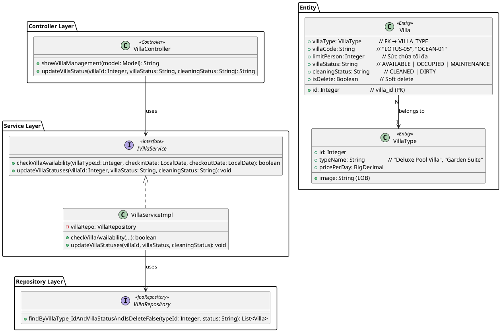
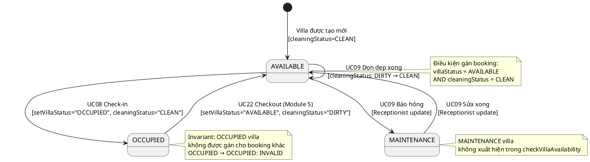
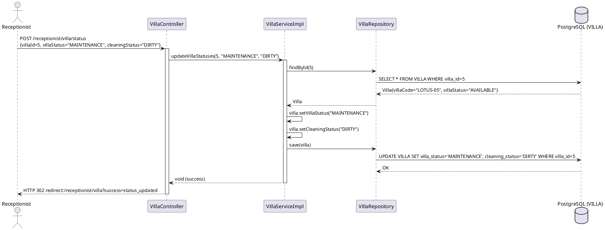
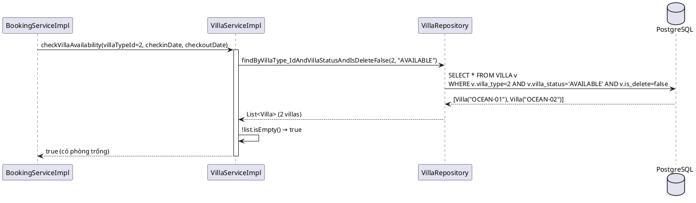
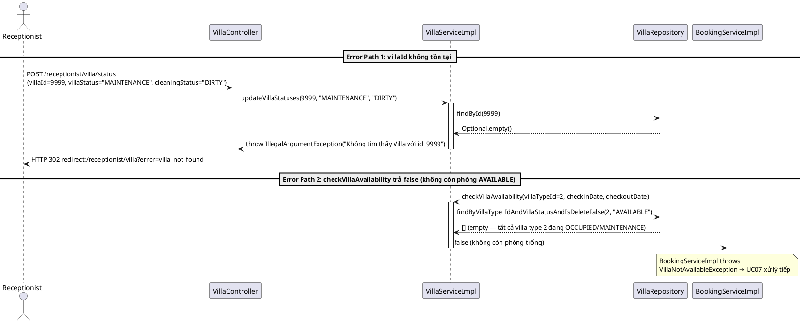
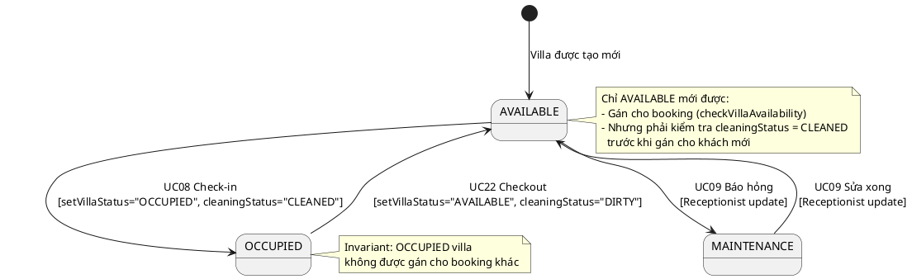

# ENGINEERING DESIGN SPECIFICATION (EDS) v2.0

# UC09 — Manage Villa Status

| Field                    | Value                                |
| ------------------------ | ------------------------------------ |
| **Document ID**    | `AURAMOON-BOOKING-EDS-UC09`        |
| **Version**        | 1.0                                  |
| **Date**           | 2026-06-19                           |
| **Status**         | Approved                             |
| **Document Owner** | Lê Trà My — Module 2 Lead        |
| **Author**         | Lê Trà My — Full-stack Developer |
| **Reviewed by**    | Phùng Giang Hải                    |
| **DPO Sign-off**   | N/A — Không xử lý PII            |
| **Approved by**    | Phùng Giang Hải — Tech Lead        |
| **Last Review**    | 2026-06-20                           |
| **Based on EDS**   | v2.0                                 |

# CHANGELOG

| Ngày      | Người thực hiện | Nội dung thay đổi                                   |
| ---------- | ------------------- | ------------------------------------------------------ |
| 2026-06-19 | Student 2           | Tạo tài liệu lần đầu — UC09 Manage Villa Status |

---

# 1. Tổng quan UC

> **UC09** cho phép Receptionist cập nhật trạng thái biệt thự (Villa Status) theo vòng đời vận hành: AVAILABLE → OCCUPIED → NEEDS_CLEANING → AVAILABLE / MAINTENANCE. Đây là UC quan trọng để đảm bảo inventory villa luôn phản ánh đúng thực tế.

| Field                           | Value                                                                                      |
| ------------------------------- | ------------------------------------------------------------------------------------------ |
| **UC ID**                 | `UC09`                                                                                   |
| **UC Name**               | Manage Villa Status                                                                        |
| **Module**                | `booking`                                                                                |
| **Bounded Context**       | `booking`                                                                                |
| **Data Classification**   | `Internal` — Không có PII                                                             |
| **Compliance Scope**      | N/A                                                                                        |
| **Upstream Dependencies** | UC08 (Check-in tự động set OCCUPIED), Module 5 (Checkout tự động set NEEDS_CLEANING) |
| **Downstream Consumers**  | UC07 (`checkVillaAvailability` phụ thuộc villa status)                                 |

---

# 2. Ma trận Truy vết

| Requirement ID       | Loại          | Mô tả yêu cầu                                                | Thành phần Code                                                      | Compliance Target | ADR liên quan |
| -------------------- | ------------- | --------------------------------------------------------------- | --------------------------------------------------------------------- | ----------------- | -------------- |
| **UC09**       | User Story    | Receptionist cập nhật villa status                             | `VillaServiceImpl.updateVillaStatuses()`                             | Hotel Operations  | —             |
| **BR-03**      | Business Rule | MAINTENANCE hoặc OCCUPIED không được gán cho booking mới  | `VillaServiceImpl.checkVillaAvailability()` lọc theo `AVAILABLE`  | Hotel Operations  | —             |
| **BR-STATE-01** | Business Rule | Transition OCCUPIED → OCCUPIED không được phép             | `VillaServiceImpl.updateVillaStatuses()` — State Machine validation | Hotel Operations  | ADR-UC09-001  |
| **BR-STATE-02** | Business Rule | Chỉ AVAILABLE → MAINTENANCE hợp lệ khi báo hỏng          | `VillaStatusController.updateVillaStatus()`                          | Hotel Operations  | ADR-UC09-001  |
| **BR-RBAC-01**  | Security Rule | Chỉ RECEPTIONIST và ADMIN được cập nhật villa status        | `SecurityConfig` restrict `/receptionist/**`                         | OWASP API-01      | —             |

---

# 3. Architecture Decision Records (ADR)

## ADR-UC09-001 — Villa có 2 trường trạng thái độc lập: villaStatus + cleaningStatus

| Field            | Value      |
| ---------------- | ---------- |
| **Status** | Accepted   |
| **Date**   | 2026-06-19 |

**Bối cảnh:**
Trong nghiệp vụ khách sạn, trạng thái phòng có 2 chiều độc lập: trạng thái chiếm dụng (Occupied/Available) và trạng thái vệ sinh (Clean/Dirty). Một phòng có thể vừa AVAILABLE (khách đã trả) nhưng vẫn DIRTY (chưa dọn).

**Quyết định:** Dùng 2 trường riêng:

- `villaStatus`: `AVAILABLE | OCCUPIED | MAINTENANCE`
- `cleaningStatus`: `CLEANED | DIRTY`

**Implementation trong VillaServiceImpl:**

```java
// updateVillaStatuses(villaId, villaStatus, cleaningStatus)
// Gọi tại UC08: updateVillaStatuses(id, "OCCUPIED", "CLEANED")
// Gọi tại UC09: updateVillaStatuses(id, "AVAILABLE", "CLEANED") sau dọn dẹp
// Gọi tại Module 5 checkout: updateVillaStatuses(id, "AVAILABLE", "DIRTY")
```

---

# 4. Non-Functional Requirements & SLA

## 4.1. Performance

| Category     | Requirement               | Target SLA  | Measurement Method       | Compliance Basis  |
| ------------ | ------------------------- | ----------- | ------------------------ | ----------------- |
| Latency      | `updateVillaStatuses()` | `< 200ms` | Stopwatch logging / k6   | Hotel Operations  |
| Availability | Villa Management endpoint | `99.9%`   | Uptime monitor (Pingdom) | Hotel Operations  |
| Throughput   | Concurrent update requests | 100 req/s  | k6 load test             | Hotel Operations  |

## 4.2. Security

| Category      | Requirement                                                           | Target                   | Verification Method           | Compliance Basis |
| ------------- | --------------------------------------------------------------------- | ------------------------ | ----------------------------- | ---------------- |
| RBAC          | Chỉ RECEPTIONIST mới cập nhật được villa status                | 403 nếu sai role         | Security test (§13.3)         | OWASP API-01     |
| State machine | Chỉ cho phép transition hợp lệ (không set OCCUPIED → OCCUPIED)  | Reject invalid state     | Unit test (§13.1)             | Hotel SOP        |
| Audit log     | Mọi thay đổi villa status phải được ghi log                    | 100% coverage            | Log inspection (§14)          | Hotel Operations |

---

# 5. Static Modeling

## 5.1. Class Diagram



## 5.2. Data Structure (JPA Entity)

```java
// Villa.java — bảng VILLA
@Entity
@Table(name = "VILLA")
public class Villa {
    @Id
    @GeneratedValue(strategy = GenerationType.IDENTITY)
    @Column(name = "villa_id")
    private Integer id;

    @ManyToOne(fetch = FetchType.LAZY)
    @JoinColumn(name = "villa_type", nullable = false)
    private VillaType villaType;          // FK → VILLA_TYPE

    @Column(name = "villa_code", nullable = false, unique = true, length = 10)
    private String villaCode;             // VD: "LOTUS-05", "OCEAN-01"

    @Column(name = "limit_person")
    private Integer limitPerson;          // Sức chứa tối đa

    @Column(name = "villa_status", length = 10)
    private String villaStatus;           // AVAILABLE | OCCUPIED | MAINTENANCE

    @Column(name = "cleaning_status", length = 10)
    private String cleaningStatus;        // CLEANED | DIRTY

    @Column(name = "is_delete")
    @Builder.Default
    private Boolean isDelete = false;     // Soft delete
}

// VillaType.java — bảng VILLA_TYPE
@Entity
@Table(name = "VILLA_TYPE")
public class VillaType {
    @Id
    @GeneratedValue(strategy = GenerationType.IDENTITY)
    @Column(name = "type_id")
    private Integer id;

    @Column(name = "type_name", nullable = false, length = 50)
    private String typeName;              // VD: "Deluxe Pool Villa", "Garden Suite"

    @Lob
    @Column(name = "image")
    private String image;                 // URL hoặc base64 ảnh đại diện

    @Column(name = "price_per_day")
    private BigDecimal pricePerDay;       // Giá mỗi đêm (VNĐ)

    @Column(name = "is_delete")
    @Builder.Default
    private Boolean isDelete = false;
}
```

## 5.3. Villa Status State Machine



**Bảng Transition hợp lệ:**

| Trạng thái hiện tại | Trạng thái mới | Hành động kích hoạt       | Hợp lệ? |
| -------------------- | -------------- | ------------------------- | ------- |
| AVAILABLE            | OCCUPIED       | UC08 Check-in              | ✅       |
| AVAILABLE            | MAINTENANCE    | UC09 báo hỏng             | ✅       |
| OCCUPIED             | AVAILABLE      | UC22 Checkout              | ✅       |
| MAINTENANCE          | AVAILABLE      | UC09 sửa xong             | ✅       |
| OCCUPIED             | OCCUPIED       | Bất kỳ                    | ❌       |
| OCCUPIED             | MAINTENANCE    | Bất kỳ                    | ❌       |
| MAINTENANCE          | OCCUPIED       | Bất kỳ                    | ❌       |

---

# 6. Dynamic Modeling

## 6.1. Sequence Diagram — updateVillaStatus



## 6.2. Sequence Diagram — checkVillaAvailability (Happy Path)



## 6.3. Sequence Diagram — updateVillaStatus Error Paths



## 6.4. State Machine — Full Villa Lifecycle



---

# 7. Domain Event Catalog

## 7.1. Events Published

| Event Name             | Trigger                   | Publisher            | Subscriber(s)    | Async? |
| ---------------------- | ------------------------- | -------------------- | ---------------- | ------ |
| `VillaStatusUpdated` | `updateVillaStatuses()` | `VillaServiceImpl` | Analytics, Audit | No     |

## 7.2. Events Consumed

| Event Name          | Source          | Handler              | Action                                     |
| ------------------- | --------------- | -------------------- | ------------------------------------------ |
| `GuestCheckedIn`  | UC08            | `VillaServiceImpl` | `updateVillaStatuses(OCCUPIED, CLEAN)`   |
| `GuestCheckedOut` | Module 5 (UC22) | `VillaServiceImpl` | `updateVillaStatuses(AVAILABLE, DIRTY)`  |

## 7.3. Payload Schema

```java
// VillaStatusUpdated — Audit event (Java logging format)
// Phát ra mỗi khi villa status thay đổi
public class VillaStatusUpdatedEvent {
    String eventId;          // UUID — dùng để deduplicate
    String eventType;        // "VillaStatusUpdated"
    String occurredAt;       // ISO 8601 — Instant.now().toString()
    String version;          // "1.0"

    // Payload
    Integer villaId;         // ID của villa
    String  villaCode;       // VD: "LOTUS-05"
    String  oldVillaStatus;  // Trạng thái trước khi update
    String  newVillaStatus;  // Trạng thái sau khi update
    String  newCleaningStatus; // CLEAN | DIRTY | CLEANING

    // Metadata
    String  performedBy;     // Username của Receptionist (từ SecurityContext)
    String  correlationId;   // RequestId để trace
}
```

---

# 8. Interface Specification

## 8.1. Service Interface

```java
// VillaService.java
// @version 1.0
public interface VillaService {
    /**
     * Kiểm tra còn phòng trống của VillaType trong khoảng ngày không.
     * Hiện tại chỉ check villaStatus = AVAILABLE (không check date overlap).
     * TODO: Nâng cấp kiểm tra date overlap thực sự.
     */
    boolean checkVillaAvailability(Integer villaTypeId, LocalDate checkinDate, LocalDate checkoutDate);

    /**
     * Cập nhật trạng thái villa.
     * Gọi bởi: UC08 (Check-in), UC09 (Receptionist manual), Module 5 (Checkout)
     * @param villaId        ID của villa
     * @param villaStatus    AVAILABLE | OCCUPIED | MAINTENANCE
     * @param cleaningStatus CLEAN | DIRTY | CLEANING
     * @throws IllegalArgumentException nếu villaId không tồn tại (VILLA-001)
     */
    void updateVillaStatuses(Integer villaId, String villaStatus, String cleaningStatus);
}
```

## 8.2. Repository Interface

```java
// VillaRepository.java
// @version 1.0
public interface VillaRepository extends JpaRepository<Villa, Integer> {

    /**
     * Tìm tất cả villa thuộc loại villaTypeId đang ở trạng thái status và chưa bị xóa.
     * Dùng bởi: checkVillaAvailability() để lọc phòng còn trống.
     * @param villaTypeId  ID loại villa
     * @param villaStatus  Trạng thái cần lọc (thường là "AVAILABLE")
     */
    List<Villa> findByVillaType_IdAndVillaStatusAndIsDeleteFalse(
        Integer villaTypeId,
        String villaStatus
    );

    /**
     * Tìm tất cả villa theo trạng thái.
     * Dùng bởi: Hiển thị sơ đồ villa trên giao diện (VillaStatusController).
     */
    List<Villa> findByVillaStatusAndIsDeleteFalse(String villaStatus);
}
```

---

# 9. API Specification

## 9.1. Endpoints Table

| Method | Path                           | Auth Level | Required Roles   | Idempotent? |
| ------ | ------------------------------ | ---------- | ---------------- | ----------- |
| GET    | `/receptionist/villa`        | JWT Bearer | `RECEPTIONIST` | Yes         |
| POST   | `/receptionist/villa/status` | JWT Bearer | `RECEPTIONIST` | Yes         |

## 9.2. Request / Response

### POST `/receptionist/villa/status`

**Request Body (form-data):**

```json
{
  "villaId": 5,
  "villaStatus": "MAINTENANCE",
  "cleaningStatus": "DIRTY"
}
```

**Response — 302 Redirect (Success):**

```
Location: /receptionist/villa?success=status_updated
```

**Response — 302 Redirect (Error — Villa Not Found):**

```
Location: /receptionist/villa?error=villa_not_found
```

---

# 10. Bảng mã lỗi

| Code          | HTTP Status | Message (VI)                 | Trigger Condition                                            |
| ------------- | ----------- | ---------------------------- | ------------------------------------------------------------ |
| `VILLA-001` | 404         | Không tìm thấy biệt thự | villaId không tồn tại                                     |
| `VILLA-002` | 400         | Trạng thái không hợp lệ | villaStatus không thuộc {AVAILABLE, OCCUPIED, MAINTENANCE} |
| `VILLA-403` | 403         | Không đủ quyền           | Không phải RECEPTIONIST                                    |

---

# 11. Quy trình Triển khai

## 11.1. Prerequisites

- [X] Bảng `VILLA` có trường `villa_status` và `cleaning_status`
- [X] `VillaRepository.findByVillaType_IdAndVillaStatusAndIsDeleteFalse()` đã implement
- [X] SecurityConfig restrict `/receptionist/**` chỉ cho RECEPTIONIST
- [X] `VillaStatusController` đã map đúng URL `/receptionist/villa/**`
- [ ] ADR-UC09-001 đã được Tech Lead review và Accepted

## 11.2. Pre-Migration Checklist

- [X] Bảng VILLA đã tồn tại trong schema (không cần migration mới)
- [X] CHECK Constraint `CK_BOOKING__villa_status` đã apply đúng giá trị: `AVAILABLE`, `OCCUPIED`, `MAINTENANCE`
- [X] CHECK Constraint `CK_BOOKING__cleaning_status` đã apply đúng giá trị: `CLEAN`, `DIRTY`, `CLEANING`
- [ ] Kiểm tra dữ liệu mock đang có giá trị status hợp lệ:

```sql
-- Verify không có giá trị invalid
SELECT villa_id, villa_status, cleaning_status FROM VILLA
WHERE villa_status NOT IN ('AVAILABLE', 'OCCUPIED', 'MAINTENANCE')
   OR cleaning_status NOT IN ('CLEAN', 'DIRTY', 'CLEANING');
-- Expected: 0 rows
```

## 11.3. Implementation

### VillaServiceImpl hiện tại (đã implement)

```java
@Override
public boolean checkVillaAvailability(Integer villaTypeId, LocalDate checkinDate, LocalDate checkoutDate) {
    List<Villa> availableVillas = villaRepository
        .findByVillaType_IdAndVillaStatusAndIsDeleteFalse(villaTypeId, "AVAILABLE");
    return !availableVillas.isEmpty();
}

@Override
public void updateVillaStatuses(Integer villaId, String villaStatus, String cleaningStatus) {
    Villa villa = villaRepository.findById(villaId)
        .orElseThrow(() -> new IllegalArgumentException("Không tìm thấy Villa: " + villaId));
    villa.setVillaStatus(villaStatus);
    villa.setCleaningStatus(cleaningStatus);
    villaRepository.save(villa);
}
```

### ⚠️ Cải tiến cần thiết — checkVillaAvailability date-aware

```java
// TODO: Nâng cấp để kiểm tra date overlap thực sự
// SELECT COUNT(*) FROM VILLA v
// WHERE v.villa_type = :villaTypeId
//   AND v.villa_status = 'AVAILABLE'
//   AND v.is_delete = false
//   AND v.villa_id NOT IN (
//     SELECT b.assigned_villa_id FROM BOOKING b
//     WHERE b.assigned_villa_id IS NOT NULL
//       AND b.checkin_date < :checkoutDate
//       AND b.checkout_date > :checkinDate
//   )
```

## 11.4. Deployment Checklist

- [ ] `VillaStatusController` mapping đúng `/receptionist/villa/**`
- [ ] `villas.html` form action trỏ đúng endpoint
- [ ] Giá trị `cleaningStatus` trong form: `CLEAN`, `DIRTY`, `CLEANING` (không phải `CLEANED`)
- [ ] Health check endpoint trả về 200 sau deploy
- [ ] Test RBAC: Guest gọi POST `/receptionist/villa/{id}/status` nhận 403
- [ ] Test Happy Path: Update villa AVAILABLE → MAINTENANCE thành công

---

# 12. Rollback & Incident Runbook

## 12.1. Điều kiện kích hoạt Rollback

| Điều kiện                        | Ngưỡng            | Người quyết định   |
| -------------------------------- | ----------------- | ------------------- |
| CHECK Constraint lỗi liên tục   | > 3 lần/phút      | On-call Engineer    |
| Villa status sai thực tế        | Bất kỳ case nào   | Receptionist + Lead |
| Giao diện không phản ánh đúng DB | > 5 phút lệch     | On-call Engineer    |

## 12.2. Rollback Procedure

#### Bước 1: Khôi phục villa status thủ công
```sql
-- Rollback villa cụ thể về trạng thái an toàn
UPDATE VILLA
SET villa_status = 'AVAILABLE', cleaning_status = 'CLEAN'
WHERE villa_id = [villaId];

-- Verify sau rollback
SELECT villa_id, villa_code, villa_status, cleaning_status
FROM VILLA WHERE villa_id = [villaId];
```

#### Bước 2: Re-deploy version cũ (nếu cần)
```bash
# Với Maven Spring Boot
git checkout [previous-tag]
mvn spring-boot:run
```

#### Bước 3: Verify sau rollback
```bash
curl -X GET http://localhost:8080/receptionist/villa -H "Cookie: JSESSIONID=[session]"
# Expected: 200 — Danh sách villa với status chính xác
```

## 12.3. Notification Protocol

| Thời điểm          | Người nhận       | Kênh  | Nội dung                                      |
| ------------------- | ---------------- | ----- | --------------------------------------------- |
| Ngay khi phát hiện | Nhóm phát triển  | Zalo  | "🚨 Villa Status bị sai: [villaCode]=[status]" |
| Trong 30 phút      | Module 2 Lead    | Email | Báo cáo nguyên nhân + bước xử lý             |

## 12.4. Post-Incident Review (PIR)

- **Timeline**: Ghi lại thời điểm phát hiện, nguyên nhân, cách xử lý
- **Root Cause**: Giá trị `cleaningStatus` sai constraint? URL sai? Security bypass?
- **Impact**: Bao nhiêu villa bị sai status? Có ảnh hưởng Check-in không?
- **Prevention**: Thêm validation trong Service trước khi save

---

# 13. Kịch bản Kiểm thử

### TC-UC09-001 — Update villa status thành công

```text
  Scenario: Receptionist đánh dấu MAINTENANCE
    Given Villa(id=5, villaStatus=AVAILABLE) tồn tại
    When updateVillaStatuses(5, "MAINTENANCE", "DIRTY")
    Then villa.villaStatus = "MAINTENANCE"
    And villa.cleaningStatus = "DIRTY"
    And villaRepository.save() được gọi

  Scenario: checkVillaAvailability trả false khi villa MAINTENANCE
    Given Villa(villaTypeId=2, villaStatus=MAINTENANCE)
    When checkVillaAvailability(2, ...)
    Then trả về false
```

### TC-UC09-002 — RBAC enforcement

```text
  Scenario: Guest cố update villa status
    Given user role = GUEST
    When POST /receptionist/villa/status được gọi
    Then response 403 Forbidden
    And VillaServiceImpl.updateVillaStatuses() KHÔNG được gọi
```

---

## 13.2. Integration Tests

### TC-INT-UC09-001 — updateVillaStatuses tích hợp Repository

```text
  Scenario: Service gọi Repository đúng
    Given test data classification: SYNTHETIC
    And Villa(id=5, villaStatus="AVAILABLE", cleaningStatus="CLEAN") tồn tại trong DB test
    When VillaServiceImpl.updateVillaStatuses(5, "MAINTENANCE", "DIRTY") được gọi
    Then VillaRepository.findById(5) được gọi đúng 1 lần
    And VillaRepository.save(villa) được gọi đúng 1 lần
    And DB chứa Villa(id=5, villaStatus="MAINTENANCE", cleaningStatus="DIRTY")

  External dependencies: H2 in-memory DB (test scope)
  Mock strategy: @DataJpaTest + H2
```

### TC-INT-UC09-002 — checkVillaAvailability tích hợp Repository

```text
  Scenario: Không còn phòng AVAILABLE trả false
    Given test data classification: SYNTHETIC
    And Tất cả Villa(villaTypeId=2) đang có villaStatus="OCCUPIED"
    When VillaServiceImpl.checkVillaAvailability(2, date, date) được gọi
    Then trả về false
    And VillaRepository.findByVillaType_IdAndVillaStatusAndIsDeleteFalse(2, "AVAILABLE") được gọi 1 lần
    And kết quả là list rỗng → return false
```

---

## 13.3. E2E / Security Tests

### TC-E2E-UC09-001 — Luồng hoàn chỉnh qua giao diện

```text
  Scenario: Receptionist cập nhật villa sang MAINTENANCE
    Given test data classification: SYNTHETIC
    And user RECEPTIONIST đã đăng nhập, có session hợp lệ
    When POST /receptionist/villa/5/status được gọi với:
      | Param          | Value         |
      | villaStatus    | MAINTENANCE   |
      | cleaningStatus | DIRTY         |
    Then response là 302 redirect đến /receptionist/villa
    And redirect URL chứa param success=status_updated
    And DB: VILLA(id=5).villa_status = "MAINTENANCE"
    And DB: VILLA(id=5).cleaning_status = "DIRTY"

  Scenario: Guest bị từ chối
    Given user GUEST đã đăng nhập
    When POST /receptionist/villa/5/status được gọi
    Then response là 403 Forbidden
    And DB không thay đổi

  Scenario: Giá trị status không hợp lệ bị DB từ chối
    Given user RECEPTIONIST đã đăng nhập
    When POST /receptionist/villa/5/status với villaStatus="INVALID_VALUE"
    Then hệ thống redirect về /receptionist/villa với error message
    And DB không thay đổi (transaction rollback)
```

---

# 14. Phương pháp Xác minh

```sql
-- Verify villa status sau update
SELECT villa_id, villa_code, villa_status, cleaning_status
FROM VILLA
WHERE villa_id = [villaId];

-- Verify checkVillaAvailability hoạt động đúng
SELECT villa_id, villa_code FROM VILLA
WHERE villa_type = [villaTypeId]
  AND villa_status = 'AVAILABLE'
  AND is_delete = false;
```

---

# 15. Mẫu thử thực tế

```bash
# Update villa status sang MAINTENANCE
curl -X POST http://localhost:8080/receptionist/villa/status \
  -H "Cookie: JSESSIONID=[receptionist-session]" \
  -d "villaId=5&villaStatus=MAINTENANCE&cleaningStatus=DIRTY"
# Expected: 302 redirect to /receptionist/villa?success=status_updated

# Verify
# psql -c "SELECT villa_code, villa_status, cleaning_status FROM VILLA WHERE villa_id=5;"
```

---

# 16. Bảng tổng hợp phân quyền

| Endpoint                            | GUEST | RECEPTIONIST | THERAPIST | CHEF | ADMIN |
| ----------------------------------- | ----- | ------------ | --------- | ---- | ----- |
| `GET /receptionist/villa`         | ❌    | ✅           | ❌        | ❌   | ✅    |
| `POST /receptionist/villa/status` | ❌    | ✅           | ❌        | ❌   | ✅    |

---

# PHỤ LỤC

## A. Glossary

| Thuật ngữ        | Định nghĩa                                                 |
| ------------------ | ------------------------------------------------------------- |
| `villaStatus`    | Trạng thái chiếm dụng: AVAILABLE / OCCUPIED / MAINTENANCE |
| `cleaningStatus` | Trạng thái vệ sinh: CLEANED / DIRTY                        |
| `limitPerson`    | Sức chứa tối đa của villa (người)                      |

## B. Tài liệu tham chiếu

| Document         | Path                                                              |
| ---------------- | ----------------------------------------------------------------- |
| VillaServiceImpl | `05_Development/.../booking/service/impl/VillaServiceImpl.java` |
| Villa Entity     | `05_Development/.../booking/entity/Villa.java`                  |
| VillaType Entity | `05_Development/.../booking/entity/VillaType.java`              |
