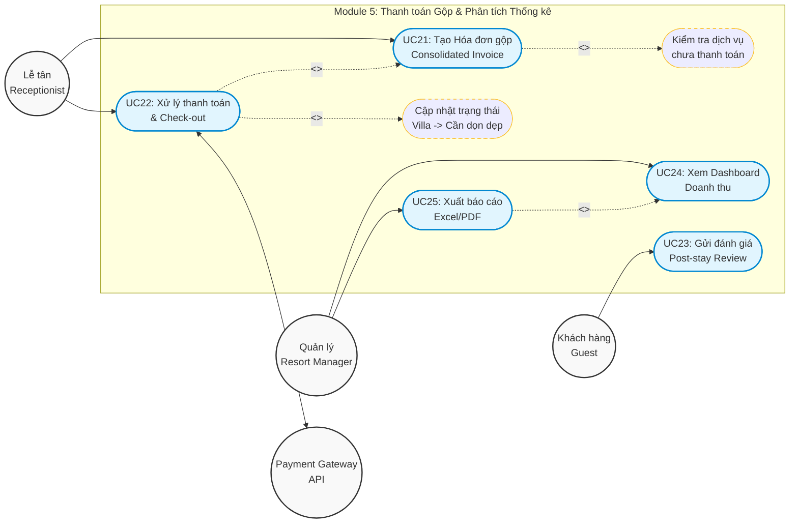

# Sơ đồ Use Case - Module 5: Thanh toán Gộp & Phân tích Thống kê

## 1. Sơ đồ Use Case (Mermaid)

## 2. Phân tích Chi tiết Nghiệp vụ

Module 5 là điểm nối cuối cùng của hệ thống, đóng vai trò như một cơ chế **Kiểm toán đêm (Night Audit)** và **Sổ cái khách hàng (Guest Folio)** theo chuẩn AHLEI.

### A. Khai báo Tác nhân (Actors)
1. **Lễ tân (Receptionist - Primary):** Người thực hiện luồng Check-out và xác nhận thanh toán.
2. **Khách hàng (Guest - Primary):** Trải qua bước Check-out (bị động) và chủ động gửi Feedback sau kỳ nghỉ.
3. **Quản lý (Manager - Primary):** Người có quyền truy cập vào bảng phân tích tài chính.
4. **Payment Gateway API (Secondary):** Hệ thống bên ngoài (Stripe/VNPay) xử lý thanh toán online/thẻ.

### B. Phân tách Use Case & Ràng buộc (Business Rules)
*   **UC21: Tạo Hóa đơn gộp (Generate Consolidated Invoice)**
    *   *Nghiệp vụ cốt lõi:* Gom tất cả các khoản nợ từ 3 nơi: Tiền gói Retreat còn lại, Tiền Spa gọi thêm (Module 3) và Tiền thức ăn A-la-carte (Module 4) dựa trên `Room_Booking_ID`.
    *   *Ràng buộc (Constraint):* `<include> Kiểm tra dịch vụ chưa thanh toán`. Hệ thống PHẢI scan xem có đơn F&B hay Spa nào đang ở trạng thái Pending không. Nếu có, KHÔNG cho phép check-out.
*   **UC22: Xử lý thanh toán cuối cùng & Check-out**
    *   *Nghiệp vụ cốt lõi:* Khấu trừ tiền cọc (Deposit) đã đóng ở Module 2, tính ra số tiền cuối cùng cần thanh toán. Gửi request đến Cổng thanh toán.
    *   *Trigger Side-effect:* `<include> Cập nhật trạng thái Villa`. Ngay khi thanh toán thành công, đổi trạng thái của Guest từ `Checked-in` sang `Completed`, và đổi trạng thái của Villa vật lý về `Needs Cleaning / Trống` để trả lại quỹ phòng.
*   **UC23: Gửi đánh giá và xếp hạng (Submit Review)**
    *   *Ràng buộc:* Khách chỉ có thể thực hiện UC này NẾU trạng thái Booking đã là `Completed`.
*   **UC24: Xem Bảng điều khiển Doanh thu (Revenue Dashboard)**
    *   *Nghiệp vụ:* Lọc và render biểu đồ Pie/Bar chart tỷ trọng doanh thu (Retreat vs Spa vs F&B).
*   **UC25: Xuất báo cáo (Export Reports)**
    *   *Nghiệp vụ:* `<extend> từ UC24` (tính năng phụ trợ từ Dashboard). Xuất file CSV/Excel cho "Tỷ lệ Lấp đầy (Occupancy)" và "Mức độ sử dụng Chuyên viên (Therapist Utilization)".

### C. Các Thực thể Database (Entities) tham gia
Để thực hiện các Use Case trên, hệ thống sẽ thực hiện truy vấn trên các thực thể chính sau:
- **`Guest_Folio`, `Folio_Item`, `Payment`**: Bảng lõi để quản lý hóa đơn.
- **`Booking` & `Retreat_Package`**: Để lấy thông tin tiền cọc và giá gói nghỉ dưỡng.
- **`Spa_Booking` & `Meal_Order`**: Để rà soát và cộng thêm các nợ phụ phí.
- **`Villa`**: Để thay đổi trạng thái dọn dẹp sau khi trả phòng.
