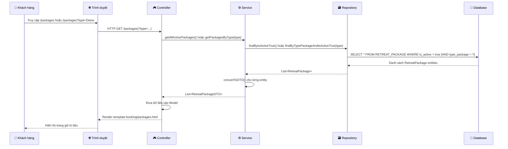
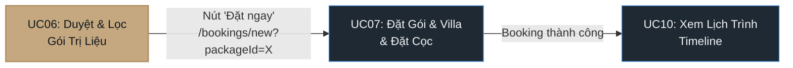

# PHÂN TÍCH CHI TIẾT UC06: DUYỆT VÀ LỌC GÓI TRỊ LIỆU

> **Use Case:** UC06 – Browse and Filter Retreat Packages  
> **Module:** Module 2 – Đặt Gói Trị Liệu & Phòng Ở  
> **Tác nhân chính:** Khách hàng (Guest)

---

## I. Tổng Quan Kiến Trúc

UC06 được triển khai theo mô hình kiến trúc **MVC phân tầng (Layered MVC)** chuẩn của Spring Boot, bao gồm 5 tầng:

```
┌─────────────────────────────────────────────────────────────────┐
│                        View (Thymeleaf)                        │
│                 booking/packages.html                           │
├─────────────────────────────────────────────────────────────────┤
│                      Controller Layer                          │
│                 RetreatPackageController.java                  │
├─────────────────────────────────────────────────────────────────┤
│                       Service Layer                            │
│     RetreatPackageService.java (Interface)                     │
│     RetreatPackageServiceImpl.java (Implementation)            │
├─────────────────────────────────────────────────────────────────┤
│                      Repository Layer                          │
│               RetreatPackageRepository.java                    │
├─────────────────────────────────────────────────────────────────┤
│                       Entity / DTO Layer                       │
│         RetreatPackage.java    RetreatPackageDTO.java           │
│         BaseEntity.java (lớp cha trừu tượng)                  │
└─────────────────────────────────────────────────────────────────┘
```

**Luồng xử lý tổng quát khi người dùng truy cập `/packages`:**



---

## II. Phân Tích Chi Tiết Từng Tầng

---

### 1. Entity Layer – Tầng Thực Thể

#### 1.1. BaseEntity.java (Lớp cha trừu tượng)

📁 **File:** [`BaseEntity.java`](file:///d:/su26-swp391-se2023-g6/auramoon/src/main/java/com/AuraMoon/auramoon/common/entity/BaseEntity.java)

```java
@Data
@MappedSuperclass
@EntityListeners(AuditingEntityListener.class)
public abstract class BaseEntity {

    @CreatedDate
    @Column(name = "created_at", updatable = false)
    private LocalDateTime createdAt;

    @LastModifiedDate
    @Column(name = "update_at")
    private LocalDateTime updatedAt;

    @Column(name = "is_delete")
    private Boolean isDelete = false;
}
```

**Giải thích từng phần:**

| Thành phần | Giải thích |
|---|---|
| `@MappedSuperclass` | Đánh dấu đây là lớp cha **không phải bảng riêng** trong DB, nhưng các trường (field) của nó sẽ được **kế thừa** vào bảng của lớp con. |
| `@EntityListeners(AuditingEntityListener.class)` | Kích hoạt cơ chế **tự động ghi thời gian** (Auditing) của Spring Data JPA. Mỗi khi tạo hoặc cập nhật entity, Spring sẽ tự động điền `createdAt` và `updatedAt`. |
| `@CreatedDate` | Tự động gán thời điểm hiện tại khi entity được lưu **lần đầu tiên**. |
| `@LastModifiedDate` | Tự động cập nhật thời điểm mỗi khi entity được **sửa đổi**. |
| `isDelete` | Cờ **xóa mềm (Soft Delete)**. Thay vì xóa hẳng dữ liệu khỏi DB, ta đánh dấu `isDelete = true` để giữ lại lịch sử. |

> [!NOTE]
> **Tại sao dùng Soft Delete?** Trong ngành khách sạn/resort, dữ liệu lịch sử đặt phòng, gói trị liệu cũ phải được bảo lưu để phục vụ kiểm toán (audit trail) theo tiêu chuẩn AHLEI.

---

#### 1.2. RetreatPackage.java (Entity chính của UC06)

📁 **File:** [`RetreatPackage.java`](file:///d:/su26-swp391-se2023-g6/auramoon/src/main/java/com/AuraMoon/auramoon/booking/entity/RetreatPackage.java)

```java
@Entity
@Table(name = "RETREAT_PACKAGE")
@Data
@EqualsAndHashCode(callSuper = true)
@NoArgsConstructor
@AllArgsConstructor
@Builder
public class RetreatPackage extends BaseEntity {

    @Id
    @GeneratedValue(strategy = GenerationType.IDENTITY)
    @Column(name = "package_id")
    private Integer id;

    @Column(name = "type_package", length = 50)
    private String typePackage;

    @Column(name = "package_name", length = 50)
    private String packageName;

    @Column(name = "duration_days")
    private Integer durationDays;

    @Lob
    @Column(name = "services")
    private String services;

    @Lob
    @Column(name = "description")
    private String description;

    @Column(name = "is_active")
    @Builder.Default
    private Boolean isActive = true;

    @Column(name = "price")
    private BigDecimal price;
}
```

**Giải thích chi tiết từng trường:**

| Trường | Cột DB | Kiểu | Mục đích |
|---|---|---|---|
| `id` | `package_id` | `Integer` | **Khóa chính**, tự tăng. Định danh duy nhất cho mỗi gói trị liệu. |
| `typePackage` | `type_package` | `String(50)` | **Phân loại gói** theo mục tiêu sức khỏe (GWI). Ví dụ: `"Detox"`, `"Yoga"`, `"Weight Loss"`, `"Stress Relief"`. Đây là trường **chủ chốt** cho chức năng lọc của UC06. |
| `packageName` | `package_name` | `String(50)` | Tên hiển thị của gói trị liệu. Ví dụ: `"Mindfulness Retreat 5 Days"`. |
| `durationDays` | `duration_days` | `Integer` | Số ngày lưu trú của gói. Dùng ở UC07 để tính ngày check-out tự động. |
| `services` | `services` | `TEXT (@Lob)` | Danh sách dịch vụ đi kèm, lưu dạng chuỗi phân cách bằng dấu phẩy. Ví dụ: `"Spa, Yoga, Meditation, Detox Meal"`. |
| `description` | `description` | `TEXT (@Lob)` | Mô tả chi tiết về gói trị liệu, hiển thị trên card UI. |
| `isActive` | `is_active` | `Boolean` | Trạng thái kích hoạt. Chỉ các gói `isActive = true` mới hiển thị cho khách hàng. Mặc định là `true` nhờ `@Builder.Default`. |
| `price` | `price` | `BigDecimal` | Giá trọn gói (VNĐ). Sử dụng `BigDecimal` thay vì `Double` để **đảm bảo độ chính xác tài chính** (tránh lỗi làm tròn số thập phân). |

**Giải thích các Annotation Lombok:**

| Annotation | Tác dụng |
|---|---|
| `@Data` | Tự động sinh tất cả getter, setter, `toString()`, `equals()`, `hashCode()`. |
| `@EqualsAndHashCode(callSuper = true)` | Khi so sánh 2 đối tượng `RetreatPackage`, **bao gồm cả** các trường kế thừa từ `BaseEntity` (`createdAt`, `updatedAt`, `isDelete`). |
| `@NoArgsConstructor` | Sinh constructor không tham số (JPA bắt buộc). |
| `@AllArgsConstructor` | Sinh constructor đầy đủ tham số. |
| `@Builder` | Cho phép tạo đối tượng theo **Builder Pattern** — code sạch, dễ đọc hơn. |
| `@Builder.Default` | Đặt giá trị mặc định khi sử dụng Builder (nếu không có `@Builder.Default`, Builder sẽ bỏ qua giá trị mặc định `= true`). |

> [!IMPORTANT]
> **`@Lob` (Large Object):** Các trường `services` và `description` sử dụng `@Lob` để lưu trữ văn bản dài hơn giới hạn 255 ký tự mặc định của `VARCHAR`. Trong MySQL, nó sẽ ánh xạ thành kiểu `TEXT`.

---

### 2. DTO Layer – Tầng Truyền Tải Dữ Liệu

📁 **File:** [`RetreatPackageDTO.java`](file:///d:/su26-swp391-se2023-g6/auramoon/src/main/java/com/AuraMoon/auramoon/booking/dto/RetreatPackageDTO.java)

```java
@Data
@NoArgsConstructor
@AllArgsConstructor
@Builder
public class RetreatPackageDTO {
    private Integer id;
    private String typePackage;
    private String packageName;
    private Integer durationDays;
    private String services;
    private String description;
    private BigDecimal price;
}
```

**Tại sao cần DTO thay vì trả Entity trực tiếp?**

```
Entity (RetreatPackage)              DTO (RetreatPackageDTO)
┌──────────────────────┐             ┌──────────────────────┐
│ id                   │             │ id                   │
│ typePackage          │    ──►      │ typePackage          │
│ packageName          │  chuyển     │ packageName          │
│ durationDays         │  đổi qua   │ durationDays         │
│ services             │  Service    │ services             │
│ description          │             │ description          │
│ isActive             │             │ price                │
│ price                │             └──────────────────────┘
│ ─── Kế thừa ───      │
│ createdAt            │   ✗ Ẩn đi: isActive, createdAt,
│ updatedAt            │             updatedAt, isDelete
│ isDelete             │   → Không lộ dữ liệu nội bộ
└──────────────────────┘     cho tầng View/Client
```

| Lý do | Giải thích |
|---|---|
| **Bảo mật** | Ẩn các trường nội bộ (`isActive`, `isDelete`, `createdAt`, `updatedAt`) khỏi tầng View, không để lộ cấu trúc DB. |
| **Linh hoạt** | Có thể thêm/bớt trường hiển thị mà không ảnh hưởng cấu trúc Entity gốc. |
| **Tách biệt** | Entity gắn chặt với DB (JPA), DTO gắn với giao diện người dùng — hai lớp này thay đổi vì các lý do khác nhau (**Single Responsibility Principle**). |

---

### 3. Repository Layer – Tầng Truy Vấn Dữ Liệu

📁 **File:** [`RetreatPackageRepository.java`](file:///d:/su26-swp391-se2023-g6/auramoon/src/main/java/com/AuraMoon/auramoon/booking/repository/RetreatPackageRepository.java)

```java
@Repository
public interface RetreatPackageRepository extends JpaRepository<RetreatPackage, Integer> {
    List<RetreatPackage> findByIsActiveTrue();
    List<RetreatPackage> findByTypePackageAndIsActiveTrue(String typePackage);

    @Query("SELECT DISTINCT r.typePackage FROM RetreatPackage r WHERE r.isActive = true")
    List<String> findDistinctTypePackageByIsActiveTrue();
}
```

**Giải thích từng phương thức:**

#### 3.1. `findByIsActiveTrue()`

| Thuộc tính | Chi tiết |
|---|---|
| **Mục đích** | Lấy **tất cả** gói trị liệu đang hoạt động |
| **Khi nào được gọi** | Khi khách truy cập `/packages` **không có** tham số `type` (xem tất cả) |
| **Cơ chế** | **Spring Data JPA Derived Query** — Spring tự động sinh SQL từ tên phương thức |
| **SQL tương đương** | `SELECT * FROM RETREAT_PACKAGE WHERE is_active = TRUE` |

**Cách Spring Data phân tích tên phương thức:**

```
findBy   IsActive   True
  │         │         │
  ▼         ▼         ▼
SELECT   WHERE     = TRUE
  *    is_active
```

#### 3.2. `findByTypePackageAndIsActiveTrue(String typePackage)`

| Thuộc tính | Chi tiết |
|---|---|
| **Mục đích** | Lọc gói trị liệu theo **mục tiêu sức khỏe** cụ thể |
| **Khi nào được gọi** | Khi khách truy cập `/packages?type=Detox` (có tham số lọc) |
| **SQL tương đương** | `SELECT * FROM RETREAT_PACKAGE WHERE type_package = ? AND is_active = TRUE` |

**Phân tích tên phương thức:**

```
findBy   TypePackage   And   IsActive   True
  │          │          │       │         │
  ▼          ▼          ▼       ▼         ▼
SELECT   type_package  AND   is_active  = TRUE
  *        = ?
```

#### 3.3. `findDistinctTypePackageByIsActiveTrue()`

| Thuộc tính | Chi tiết |
|---|---|
| **Mục đích** | Lấy danh sách **các loại gói duy nhất** (không trùng lặp) để hiển thị trên Sidebar lọc |
| **Khi nào được gọi** | Mỗi khi tải trang `/packages` — để render danh sách bộ lọc bên trái |
| **Cơ chế** | Sử dụng `@Query` với **JPQL** (Java Persistence Query Language) vì Derived Query không hỗ trợ tốt `DISTINCT` trên một trường cụ thể |
| **SQL tương đương** | `SELECT DISTINCT type_package FROM RETREAT_PACKAGE WHERE is_active = TRUE` |

**Ví dụ kết quả trả về:**
```
["Detox", "Yoga", "Weight Loss", "Stress Relief", "Ayurveda"]
```

> [!TIP]
> **Tại sao dùng `@Query` thay vì Derived Query?** Với Derived Query, `findDistinctTypePackageByIsActiveTrue()` sẽ trả về `List<RetreatPackage>` (toàn bộ entity, loại bỏ trùng theo entity), không phải `List<String>` (chỉ trả về tên loại). `@Query` JPQL cho phép chọn chính xác trường cần lấy.

---

### 4. Service Layer – Tầng Nghiệp Vụ

#### 4.1. Interface: RetreatPackageService.java

📁 **File:** [`RetreatPackageService.java`](file:///d:/su26-swp391-se2023-g6/auramoon/src/main/java/com/AuraMoon/auramoon/booking/service/RetreatPackageService.java)

```java
public interface RetreatPackageService {
    List<RetreatPackageDTO> getAllActivePackages();
    List<RetreatPackageDTO> getPackagesByType(String typePackage);
    List<String> getAllActivePackageTypes();
}
```

**Tại sao tách Interface và Implementation?**

| Nguyên tắc | Giải thích |
|---|---|
| **Dependency Inversion Principle (DIP)** | Controller phụ thuộc vào **abstraction** (interface), không phụ thuộc vào implementation cụ thể. Nếu sau này cần đổi logic (ví dụ: thêm cache, đổi nguồn dữ liệu), chỉ cần tạo implementation mới mà không sửa Controller. |
| **Testability** | Dễ dàng tạo Mock implementation khi viết Unit Test cho Controller. |

#### 4.2. Implementation: RetreatPackageServiceImpl.java

📁 **File:** [`RetreatPackageServiceImpl.java`](file:///d:/su26-swp391-se2023-g6/auramoon/src/main/java/com/AuraMoon/auramoon/booking/service/impl/RetreatPackageServiceImpl.java)

```java
@Service
@RequiredArgsConstructor
public class RetreatPackageServiceImpl implements RetreatPackageService {

    private final RetreatPackageRepository retreatPackageRepository;

    @Override
    public List<RetreatPackageDTO> getAllActivePackages() {
        return retreatPackageRepository.findByIsActiveTrue()
                .stream()
                .map(this::convertToDTO)
                .collect(Collectors.toList());
    }

    @Override
    public List<RetreatPackageDTO> getPackagesByType(String typePackage) {
        return retreatPackageRepository.findByTypePackageAndIsActiveTrue(typePackage)
                .stream()
                .map(this::convertToDTO)
                .collect(Collectors.toList());
    }

    @Override
    public List<String> getAllActivePackageTypes() {
        return retreatPackageRepository.findDistinctTypePackageByIsActiveTrue();
    }

    private RetreatPackageDTO convertToDTO(RetreatPackage retreatPackage) {
        return RetreatPackageDTO.builder()
                .id(retreatPackage.getId())
                .typePackage(retreatPackage.getTypePackage())
                .packageName(retreatPackage.getPackageName())
                .durationDays(retreatPackage.getDurationDays())
                .services(retreatPackage.getServices())
                .description(retreatPackage.getDescription())
                .price(retreatPackage.getPrice())
                .build();
    }
}
```

**Giải thích từng phương thức:**

#### `getAllActivePackages()` — Lấy tất cả gói đang hoạt động

```
retreatPackageRepository.findByIsActiveTrue()   →  List<RetreatPackage>
        .stream()                                →  Stream<RetreatPackage>
        .map(this::convertToDTO)                 →  Stream<RetreatPackageDTO>
        .collect(Collectors.toList())            →  List<RetreatPackageDTO>
```

- **Bước 1:** Gọi Repository lấy danh sách Entity từ DB (chỉ lấy gói `isActive = true`).
- **Bước 2:** Chuyển thành Stream để xử lý dạng pipeline (functional programming).
- **Bước 3:** Áp dụng `convertToDTO()` cho **từng phần tử** — chuyển Entity → DTO.
- **Bước 4:** Thu thập kết quả lại thành `List`.

#### `getPackagesByType(String typePackage)` — Lọc gói theo loại

Logic tương tự `getAllActivePackages()`, nhưng gọi `findByTypePackageAndIsActiveTrue(typePackage)` để thêm điều kiện lọc theo `typePackage`.

#### `getAllActivePackageTypes()` — Lấy danh sách loại gói

Gọi trực tiếp Repository, trả về `List<String>` — không cần chuyển đổi DTO vì dữ liệu chỉ là danh sách chuỗi đơn giản.

#### `convertToDTO()` — Hàm chuyển đổi Entity → DTO

```java
private RetreatPackageDTO convertToDTO(RetreatPackage retreatPackage) {
    return RetreatPackageDTO.builder()
            .id(retreatPackage.getId())
            .typePackage(retreatPackage.getTypePackage())
            .packageName(retreatPackage.getPackageName())
            .durationDays(retreatPackage.getDurationDays())
            .services(retreatPackage.getServices())
            .description(retreatPackage.getDescription())
            .price(retreatPackage.getPrice())
            .build();
}
```

- Sử dụng **Builder Pattern** để tạo DTO.
- Sao chép **có chọn lọc** các trường từ Entity sang DTO — loại bỏ `isActive`, `createdAt`, `updatedAt`, `isDelete`.
- Phương thức `private` — chỉ dùng nội bộ trong Service.

> [!NOTE]
> **`@RequiredArgsConstructor` (Lombok):** Tự động sinh constructor với tất cả trường `final`. Kết hợp với `private final RetreatPackageRepository`, Spring Boot sẽ tự động **Dependency Injection** repository vào service qua constructor (đây là cách DI được khuyến nghị thay vì `@Autowired` trên field).

---

### 5. Controller Layer – Tầng Điều Khiển

📁 **File:** [`RetreatPackageController.java`](file:///d:/su26-swp391-se2023-g6/auramoon/src/main/java/com/AuraMoon/auramoon/booking/controller/RetreatPackageController.java)

```java
@Controller
@RequestMapping("/packages")
@RequiredArgsConstructor
public class RetreatPackageController {

    private final RetreatPackageService retreatPackageService;

    @GetMapping
    public String listPackages(@RequestParam(value = "type", required = false) String type, Model model) {
        List<RetreatPackageDTO> packages;
        if (type != null && !type.trim().isEmpty()) {
            packages = retreatPackageService.getPackagesByType(type);
            model.addAttribute("selectedType", type);
        } else {
            packages = retreatPackageService.getAllActivePackages();
            model.addAttribute("selectedType", "All");
        }

        model.addAttribute("packages", packages);
        model.addAttribute("types", retreatPackageService.getAllActivePackageTypes());
        return "booking/packages";
    }
}
```

**Giải thích từng thành phần:**

| Annotation / Thành phần | Giải thích |
|---|---|
| `@Controller` | Đánh dấu lớp này là **MVC Controller** (trả về tên View, không phải JSON như `@RestController`). |
| `@RequestMapping("/packages")` | Mọi URL trong controller này đều bắt đầu bằng `/packages`. |
| `@GetMapping` | Xử lý request **HTTP GET** tới `/packages`. |
| `@RequestParam(value = "type", required = false)` | Đọc tham số `type` từ URL. `required = false` nghĩa là tham số này **không bắt buộc** — nếu không có thì `type = null`. |
| `Model model` | Đối tượng của Spring MVC dùng để **truyền dữ liệu** từ Controller xuống View (Thymeleaf). |
| `return "booking/packages"` | Trả về tên **template Thymeleaf** tại `templates/booking/packages.html`. |

**Luồng logic chi tiết của `listPackages()`:**

```
                    ┌──────────────────┐
                    │  GET /packages   │
                    │  ?type=Detox     │
                    └────────┬─────────┘
                             │
                    ┌────────▼─────────┐
                    │ type != null &&   │
                    │ !type.isEmpty()?  │
                    └────┬────────┬────┘
                    CÓ   │        │  KHÔNG
                 ┌───────▼──┐  ┌──▼──────────┐
                 │getPackages│  │getAllActive  │
                 │ByType()   │  │Packages()   │
                 └───────┬──┘  └──┬──────────┘
                         │        │
                 selectedType  selectedType
                  = "Detox"     = "All"
                         │        │
                    ┌────▼────────▼────┐
                    │ model.addAttribute│
                    │ "packages"        │
                    │ "types"           │
                    │ "selectedType"    │
                    └────────┬─────────┘
                             │
                    ┌────────▼──────────┐
                    │ return             │
                    │ "booking/packages" │
                    └───────────────────┘
```

**Dữ liệu truyền sang View:**

| Key trong Model | Kiểu dữ liệu | Mục đích |
|---|---|---|
| `packages` | `List<RetreatPackageDTO>` | Danh sách gói trị liệu để hiển thị dạng Card |
| `types` | `List<String>` | Danh sách loại gói để render Sidebar bộ lọc |
| `selectedType` | `String` | Loại đang được chọn, dùng để highlight mục lọc đang active |

---

### 6. View Layer – Tầng Giao Diện (Thymeleaf Template)

📁 **File:** [`packages.html`](file:///d:/su26-swp391-se2023-g6/auramoon/src/main/resources/templates/booking/packages.html)

#### 6.1. Thiết kế CSS – Glassmorphism & Dark Luxury Theme

Template sử dụng **Vanilla CSS** thuần với phong cách thiết kế cao cấp:

| Đặc điểm thiết kế | CSS Property / Kỹ thuật |
|---|---|
| **Dark Luxury Theme** | `--bg-dark: #0f171e` — tông màu tối sang trọng |
| **Glassmorphism** | `backdrop-filter: blur(12px)` + `background: rgba(...)` — hiệu ứng kính mờ |
| **Gold Accent** | `--primary: #c5a880` — màu vàng gold ấm làm điểm nhấn |
| **Gradient Text** | `background: linear-gradient(...)` + `-webkit-background-clip: text` — chữ gradient |
| **Hover Animation** | `transform: translateY(-8px)` — card nổi lên khi hover |
| **Responsive Grid** | `grid-template-columns: repeat(auto-fill, minmax(320px, 1fr))` — tự điều chỉnh số cột |
| **Google Fonts** | Font **Outfit** (headings) + **Inter** (body text) |

#### 6.2. Cấu trúc HTML chính

**Sidebar — Bộ lọc mục tiêu sức khỏe:**

```html
<aside class="sidebar">
    <h3>Mục tiêu sức khỏe</h3>
    <ul class="filter-list">
        <!-- Nút "Tất cả gói" -->
        <li class="filter-item" th:classappend="${selectedType == 'All'} ? 'active' : ''">
            <a th:href="@{/packages}">Tất cả gói</a>
        </li>
        <!-- Duyệt qua từng loại gói -->
        <li class="filter-item" th:each="type : ${types}" 
            th:classappend="${selectedType == type} ? 'active' : ''">
            <a th:href="@{/packages(type=${type})}" th:text="${type}">Type</a>
        </li>
    </ul>
</aside>
```

| Cú pháp Thymeleaf | Giải thích |
|---|---|
| `th:classappend` | **Thêm class CSS có điều kiện** — nếu `selectedType == type` thì thêm class `active` (highlight mục đang chọn). |
| `th:each="type : ${types}"` | **Vòng lặp** — duyệt qua danh sách `types` (từ Controller), tạo một `<li>` cho mỗi loại gói. |
| `th:href="@{/packages(type=${type})}"` | Tạo URL `/packages?type=Detox` — khi click sẽ gửi GET request với tham số lọc. |
| `th:text="${type}"` | Hiển thị nội dung text của loại gói (thay thế text mặc định `Type`). |

**Package Cards — Hiển thị danh sách gói trị liệu:**

```html
<div class="package-card" th:each="pkg : ${packages}">
    <div class="card-header">
        <span class="goal-tag" th:text="${pkg.typePackage}">Detox</span>
        <h2 class="package-name" th:text="${pkg.packageName}">Detox Journey</h2>
        <div class="duration-badge">
            <!-- SVG icon đồng hồ -->
            <span th:text="${pkg.durationDays} + ' ngày ' + (${pkg.durationDays} - 1) + ' đêm'">
                3 ngày 2 đêm
            </span>
        </div>
    </div>
    <div class="card-body">
        <p class="description" th:text="${pkg.description}">Mô tả...</p>
        
        <!-- Danh sách dịch vụ -->
        <div class="services-included" th:if="${pkg.services != null && !#strings.isEmpty(pkg.services)}">
            <h4 class="services-title">Dịch vụ bao gồm</h4>
            <ul class="service-list">
                <li class="service-tag" 
                    th:each="service : ${#strings.arraySplit(pkg.services, ',')}" 
                    th:text="${#strings.trim(service)}">Spa</li>
            </ul>
        </div>
    </div>
    <div class="card-footer">
        <div class="price-section">
            <span class="price-label">Giá trọn gói</span>
            <span class="price-value" 
                  th:text="${#numbers.formatDecimal(pkg.price, 0, 'COMMA', 0, 'POINT')} + ' VNĐ'">
                10,000,000 VNĐ
            </span>
        </div>
        <a th:href="@{/bookings/new(packageId=${pkg.id})}" class="btn-book">Đặt ngay</a>
    </div>
</div>
```

**Các kỹ thuật Thymeleaf đáng chú ý:**

| Kỹ thuật | Code | Giải thích |
|---|---|---|
| **Biểu thức tính toán** | `${pkg.durationDays} + ' ngày ' + (${pkg.durationDays} - 1) + ' đêm'` | Tự động tính: 3 ngày → "3 ngày 2 đêm" |
| **Điều kiện hiển thị** | `th:if="${pkg.services != null && !#strings.isEmpty(...)}"` | Chỉ hiển thị phần dịch vụ nếu có dữ liệu |
| **Tách chuỗi** | `#strings.arraySplit(pkg.services, ',')` | Tách chuỗi `"Spa, Yoga, Meal"` thành mảng `["Spa", "Yoga", "Meal"]` |
| **Trim khoảng trắng** | `#strings.trim(service)` | Loại bỏ khoảng trắng thừa sau khi tách chuỗi |
| **Format số** | `#numbers.formatDecimal(pkg.price, 0, 'COMMA', 0, 'POINT')` | Format giá: `10000000` → `10,000,000` |
| **Liên kết UC07** | `th:href="@{/bookings/new(packageId=${pkg.id})}"` | Nút "Đặt ngay" chuyển hướng sang UC07 với `packageId` |

**Empty State — Xử lý khi không có kết quả:**

```html
<div class="empty-state" th:if="${packages == null || #lists.isEmpty(packages)}">
    <h3>Không tìm thấy gói trị liệu nào</h3>
    <p>Vui lòng chọn mục tiêu sức khỏe khác hoặc quay lại sau.</p>
</div>
```

Đây là phần xử lý **luồng ngoại lệ** của UC06 — khi bộ lọc không khớp gói nào.

#### 6.3. Responsive Design (Thiết kế đáp ứng)

```css
/* Tablet: chuyển sidebar thành horizontal */
@media (max-width: 1024px) {
    .main-content { grid-template-columns: 1fr; }
    .sidebar { position: static; width: 100%; }
    .filter-list { flex-direction: row; flex-wrap: wrap; }
}

/* Mobile: chuyển card footer thành vertical */
@media (max-width: 640px) {
    header h1 { font-size: 2.2rem; }
    .app-container { padding: 1rem; }
    .card-footer { flex-direction: column; gap: 1rem; }
    .btn-book { width: 100%; }
}
```

| Breakpoint | Thay đổi |
|---|---|
| **≤ 1024px** (Tablet) | Sidebar chuyển từ cột bên sang nằm trên cùng, các bộ lọc xếp ngang |
| **≤ 640px** (Mobile) | Font size thu nhỏ, nút "Đặt ngay" chiếm full width |

---

## III. Bảng Tổng Hợp Tất Cả Các Hàm Trong UC06

| # | Tầng | Tên hàm | Kiểu trả về | Mô tả chức năng |
|---|---|---|---|---|
| 1 | Repository | `findByIsActiveTrue()` | `List<RetreatPackage>` | Truy vấn tất cả gói trị liệu đang kích hoạt |
| 2 | Repository | `findByTypePackageAndIsActiveTrue(String)` | `List<RetreatPackage>` | Truy vấn gói theo loại + đang kích hoạt |
| 3 | Repository | `findDistinctTypePackageByIsActiveTrue()` | `List<String>` | Lấy danh sách loại gói không trùng lặp |
| 4 | Service (Interface) | `getAllActivePackages()` | `List<RetreatPackageDTO>` | Định nghĩa hợp đồng lấy tất cả gói |
| 5 | Service (Interface) | `getPackagesByType(String)` | `List<RetreatPackageDTO>` | Định nghĩa hợp đồng lọc gói theo loại |
| 6 | Service (Interface) | `getAllActivePackageTypes()` | `List<String>` | Định nghĩa hợp đồng lấy danh sách loại |
| 7 | Service (Impl) | `getAllActivePackages()` | `List<RetreatPackageDTO>` | Triển khai: gọi repo → stream → map DTO |
| 8 | Service (Impl) | `getPackagesByType(String)` | `List<RetreatPackageDTO>` | Triển khai: gọi repo theo type → stream → map DTO |
| 9 | Service (Impl) | `getAllActivePackageTypes()` | `List<String>` | Triển khai: gọi thẳng repo |
| 10 | Service (Impl) | `convertToDTO(RetreatPackage)` | `RetreatPackageDTO` | Chuyển đổi Entity → DTO (private helper) |
| 11 | Controller | `listPackages(String, Model)` | `String` (tên View) | Điều phối: nhận request → gọi service → trả view |

---

## IV. Liên Kết Với Các Use Case Khác



- **UC06 → UC07:** Nút "Đặt ngay" trên mỗi card gói trị liệu liên kết tới URL `/bookings/new?packageId={id}`, chuyển sang luồng đặt gói của UC07.
- **UC07 → UC10:** Sau khi đặt gói thành công, khách có thể xem lịch trình chi tiết tại UC10.

---

## V. Tiêu Chuẩn Ngành Áp Dụng

| Tiêu chuẩn | Áp dụng trong UC06 |
|---|---|
| **GWI (Global Wellness Institute)** | Phân loại gói trị liệu theo thuật ngữ chuyên ngành wellness: Detox, Mindfulness, Ayurveda thay vì thuật ngữ khách sạn thông thường. Trường `typePackage` phải tuân thủ bộ thuật ngữ này. |
| **BigDecimal cho tài chính** | Sử dụng `BigDecimal` (không dùng `Double`) để đảm bảo không xảy ra lỗi làm tròn khi hiển thị và tính toán giá trị tài chính. |
