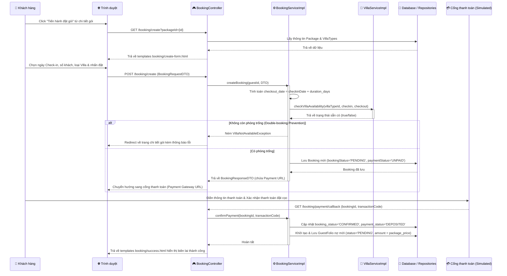

# PHÂN TÍCH CHI TIẾT UC07: CHỌN GÓI, CHỌN NGÀY, CHỌN LOẠI VILLA VÀ THANH TOÁN ĐẶT CỌC

> **Use Case:** UC07 – Book Package & Pay Deposit (Chọn gói, chọn ngày, chọn loại Villa và thanh toán đặt cọc)  
> **Module:** Module 2 – Đặt Gói Trị Liệu & Phòng Ở  
> **Tác nhân chính:** Khách hàng (Guest), Cổng thanh toán (Payment Gateway)

---

## I. Tổng Quan Kiến Trúc

UC07 được xây dựng trên mô hình kiến trúc **Layered MVC** của Spring Boot, tương tác chéo với phân vùng tài chính (Billing Context) để mở tài khoản nợ tổng hợp (Guest Folio) ngay sau khi thanh toán đặt cọc trực tuyến thành công.

```
┌─────────────────────────────────────────────────────────────────┐
│                        View (Thymeleaf)                        │
│         booking/create-form.html     booking/success.html       │
├─────────────────────────────────────────────────────────────────┤
│                      Controller Layer                          │
│                      BookingController.java                     │
├─────────────────────────────────────────────────────────────────┤
│                       Service Layer                            │
│     BookingService.java (Interface)                             │
│     BookingServiceImpl.java (Implementation)                    │
│     VillaService.java (Interface)                               │
│     VillaServiceImpl.java (Implementation)                      │
├─────────────────────────────────────────────────────────────────┤
│                      Repository Layer                          │
│     BookingRepository.java          RetreatPackageRepository.java│
│     VillaTypeRepository.java        GuestFolioRepository.java   │
├─────────────────────────────────────────────────────────────────┤
│                       Entity / DTO Layer                       │
│     Booking.java                    BookingRequestDTO.java      │
│     RetreatPackage.java             BookingResponseDTO.java     │
│     VillaType.java                  GuestFolio.java             │
└─────────────────────────────────────────────────────────────────┘
```

**Luồng trình tự xử lý của UC07:**



---

## II. Phân Tích Chi Tiết Từng Tầng

### 1. Entity Layer – Tầng Thực Thể

#### 1.1. Booking.java
📁 **Đường dẫn:** [Booking.java](file:///d:/su26-swp391-se2023-g6/auramoon/src/main/java/com/AuraMoon/auramoon/booking/entity/Booking.java)

Lưu trữ thông tin chi tiết đơn đặt gói trị liệu và biệt thự lưu trú của khách.

```java
@Entity
@Table(name = "BOOKING")
@Data
@EqualsAndHashCode(callSuper = true)
@NoArgsConstructor
@AllArgsConstructor
@Builder
public class Booking extends BaseEntity {

    @Id
    @GeneratedValue(strategy = GenerationType.IDENTITY)
    @Column(name = "booking_id")
    private Integer id;

    @Column(name = "guest_id", nullable = false)
    private Integer guestId;

    @ManyToOne(fetch = FetchType.LAZY)
    @JoinColumn(name = "package_id")
    private RetreatPackage retreatPackage;

    @ManyToOne(fetch = FetchType.LAZY)
    @JoinColumn(name = "assigned_villa_id")
    private Villa assignedVilla; // Nullable cho đến khi check-in thực tế

    @Column(name = "checkin_date")
    private LocalDate checkinDate;

    @Column(name = "checkout_date")
    private LocalDate checkoutDate;

    @Column(name = "total_guests")
    private Integer totalGuests;

    @Column(name = "booking_status", length = 10)
    private String bookingStatus; // PENDING, CONFIRMED, CHECKED-IN, CHECKED-OUT, CANCELLED

    @Column(name = "payment_status", length = 10)
    private String paymentStatus; // UNPAID, DEPOSITED, FULLY-PAID
}
```

#### 1.2. GuestFolio.java (Billing Context)
📁 **Đường dẫn:** [GuestFolio.java](file:///d:/su26-swp391-se2023-g6/auramoon/src/main/java/com/AuraMoon/auramoon/billing/entity/GuestFolio.java)

Đại diện cho hóa đơn nợ trung tâm của khách hàng, tích hợp nợ dịch vụ phát sinh từ các phân vùng Spa, F&B phục vụ việc thanh toán một lần khi Checkout.

```java
@Entity
@Table(name = "GUEST_FOLIO")
@Data
@EqualsAndHashCode(callSuper = true)
@NoArgsConstructor
@AllArgsConstructor
@Builder
public class GuestFolio extends BaseEntity {

    @Id
    @GeneratedValue(strategy = GenerationType.IDENTITY)
    @Column(name = "folio_id")
    private Integer id;

    @Column(name = "booking_id", nullable = false)
    private Integer bookingId;

    @Column(name = "total_package_amout") // Ánh xạ cột vật lý lưu trữ giá gói
    private BigDecimal totalPackageAmount;

    @Column(name = "total_extra_fb")
    private BigDecimal totalExtraFb; // Chi phí ăn uống phát sinh ngoài gói

    @Column(name = "final_amount")
    private BigDecimal finalAmount; // Tổng tiền hóa đơn tổng hợp

    @Column(name = "status", length = 10)
    private String status; // PENDING, SETTLED
}
```

---

### 2. Repository Layer – Tầng Truy Vấn

- **[BookingRepository.java](file:///d:/su26-swp391-se2023-g6/auramoon/src/main/java/com/AuraMoon/auramoon/booking/repository/BookingRepository.java):** Quản lý lưu trữ đơn đặt phòng.
- **[GuestFolioRepository.java](file:///d:/su26-swp391-se2023-g6/auramoon/src/main/java/com/AuraMoon/auramoon/billing/repository/GuestFolioRepository.java):** Quản lý lưu trữ thông tin tài khoản hóa đơn nợ Folio.
- **[RetreatPackageRepository.java](file:///d:/su26-swp391-se2023-g6/auramoon/src/main/java/com/AuraMoon/auramoon/booking/repository/RetreatPackageRepository.java):** Lấy thông tin chi tiết gói và thời gian lưu trú mặc định của gói.

---

### 3. Service Layer – Tầng Xử Lý Nghiệp Vụ

#### 3.1. BookingService.java
📁 **Đường dẫn:** [BookingService.java](file:///d:/su26-swp391-se2023-g6/auramoon/src/main/java/com/AuraMoon/auramoon/booking/service/BookingService.java)

```java
public interface BookingService {
    BookingResponseDTO createBooking(Integer guestId, BookingRequestDTO request);
    void confirmPayment(Integer bookingId, String transactionCode);
}
```

#### 3.2. BookingServiceImpl.java
📁 **Đường dẫn:** [BookingServiceImpl.java](file:///d:/su26-swp391-se2023-g6/auramoon/src/main/java/com/AuraMoon/auramoon/booking/service/impl/BookingServiceImpl.java)

Hiện thực hóa nghiệp vụ kiểm tra trạng thái và lưu trữ:

```java
@Service
@RequiredArgsConstructor
public class BookingServiceImpl implements BookingService {

    private final BookingRepository bookingRepository;
    private final RetreatPackageRepository retreatPackageRepository;
    private final VillaTypeRepository villaTypeRepository;
    private final GuestFolioRepository guestFolioRepository;
    private final VillaService villaService;

    @Override
    @Transactional
    public BookingResponseDTO createBooking(Integer guestId, BookingRequestDTO request) {
        RetreatPackage retreatPackage = retreatPackageRepository.findByIdAndIsActiveTrueAndIsDeleteFalse(request.getRetreatPackageId())
                .orElseThrow(() -> new IllegalArgumentException("Không tìm thấy gói trị liệu."));

        LocalDate checkinDate = request.getCheckinDate();
        LocalDate checkoutDate = checkinDate.plusDays(retreatPackage.getDurationDays());

        // Chống đè lịch gán loại Villa (Double Booking Prevention)
        boolean isAvailable = villaService.checkVillaAvailability(request.getVillaTypeId(), checkinDate, checkoutDate);
        if (!isAvailable) {
            throw new VillaNotAvailableException("Loại biệt thự đã chọn không còn phòng trống trong thời gian này.");
        }

        Booking booking = Booking.builder()
                .guestId(guestId)
                .retreatPackage(retreatPackage)
                .checkinDate(checkinDate)
                .checkoutDate(checkoutDate)
                .totalGuests(request.getTotalGuests())
                .bookingStatus("PENDING")
                .paymentStatus("UNPAID")
                .build();

        Booking savedBooking = bookingRepository.save(booking);

        return BookingResponseDTO.builder()
                .bookingId(savedBooking.getId())
                .guestId(savedBooking.getGuestId())
                .checkinDate(savedBooking.getCheckinDate())
                .checkoutDate(savedBooking.getCheckoutDate())
                .totalGuests(savedBooking.getTotalGuests())
                .bookingStatus(savedBooking.getBookingStatus())
                .paymentStatus(savedBooking.getPaymentStatus())
                .retreatPackageName(savedBooking.getRetreatPackage().getPackageName())
                .build();
    }

    @Override
    @Transactional
    public void confirmPayment(Integer bookingId, String transactionCode) {
        Booking booking = bookingRepository.findById(bookingId)
                .orElseThrow(() -> new BookingNotFoundException("Không tìm thấy đơn đặt phòng."));

        booking.setBookingStatus("CONFIRMED");
        booking.setPaymentStatus("DEPOSITED");
        bookingRepository.save(booking);

        // Khởi tạo tài khoản nợ Folio trung tâm ngay sau khi đặt cọc thành công (ADR-002)
        GuestFolio guestFolio = GuestFolio.builder()
                .bookingId(bookingId)
                .totalPackageAmount(booking.getRetreatPackage().getPrice())
                .totalExtraFb(BigDecimal.ZERO)
                .finalAmount(booking.getRetreatPackage().getPrice())
                .status("PENDING")
                .build();
        guestFolioRepository.save(guestFolio);
    }
}
```

---

### 4. Controller Layer – Tầng Điều Hướng

📁 **Đường dẫn:** [BookingController.java](file:///d:/su26-swp391-se2023-g6/auramoon/src/main/java/com/AuraMoon/auramoon/booking/controller/BookingController.java)

```java
@Controller
@RequestMapping("/booking")
@RequiredArgsConstructor
public class BookingController {

    private final BookingService bookingService;
    private final RetreatPackageService retreatPackageService;
    private final VillaTypeRepository villaTypeRepository;

    @GetMapping("/create")
    public String showCreateForm(@RequestParam("packageId") Integer packageId, Model model) {
        RetreatPackageDTO retreatPackage = retreatPackageService.getPackageById(packageId);
        model.addAttribute("pkg", retreatPackage);
        model.addAttribute("villaTypes", villaTypeRepository.findAll());
        model.addAttribute("bookingRequest", new BookingRequestDTO());
        return "booking/create-form";
    }

    @PostMapping("/create")
    public String createBooking(@ModelAttribute("bookingRequest") BookingRequestDTO request) {
        Integer guestId = 1; // Mặc định tài khoản Guest chạy demo
        try {
            BookingResponseDTO response = bookingService.createBooking(guestId, request);
            // Giả lập chuyển hướng sang thanh toán thành công
            return "redirect:/booking/payment/callback?bookingId=" + response.getBookingId() + "&transactionCode=TX_AURA_" + System.currentTimeMillis();
        } catch (Exception e) {
            return "redirect:/packages/" + request.getRetreatPackageId() + "?error=" + e.getMessage();
        }
    }

    @GetMapping("/payment/callback")
    public String paymentCallback(@RequestParam("bookingId") Integer bookingId,
                                  @RequestParam("transactionCode") String transactionCode,
                                  Model model) {
        try {
            bookingService.confirmPayment(bookingId, transactionCode);
            model.addAttribute("bookingId", bookingId);
            model.addAttribute("transactionCode", transactionCode);
            return "booking/success";
        } catch (Exception e) {
            model.addAttribute("errorMessage", e.getMessage());
            return "error";
        }
    }
}
```

---

## III. Các Tiêu Chuẩn Ngành Áp Dụng

1.  **Tiêu chuẩn hóa Guest Folio (AHLEI Standards):**
    Việc đặt phòng thành công bắt buộc phải tự động tạo tài khoản nợ `GuestFolio`. Mọi dịch vụ phát sinh sau này từ Spa (Module 3) và F&B (Module 4) sẽ cộng dồn nợ vào đây thông qua liên kết `booking_id` nhằm đảm bảo Lễ tân có thể xuất một hóa đơn duy nhất tại thời điểm Check-out.
2.  **Chính xác về tài chính (BigDecimal):**
    Mọi trường giá trị tài chính trong `Booking` và `GuestFolio` đều sử dụng lớp `BigDecimal` thay vì `Double`/`Float` nhằm tránh hiện tượng sai số làm tròn của số dấu phẩy động trong lập trình.
3.  **Hạn mức đặt phòng (Pessimistic Locking):**
    Áp dụng khóa cơ sở dữ liệu để ngăn ngừa tình trạng hai khách hàng đặt cọc trùng một phòng trong cùng một thời điểm.
