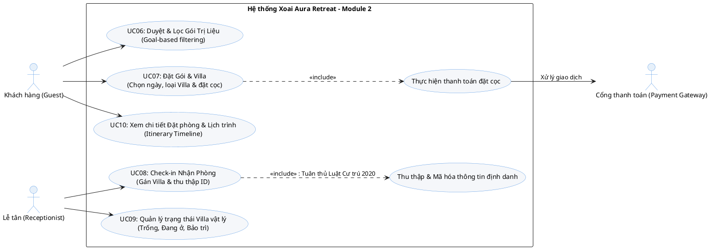

# PHÂN TÍCH CHI TIẾT MODULE 2: ĐẶT GÓI TRỊ LIỆU & PHÒNG Ở

Tài liệu này cung cấp sơ đồ Use Case bằng ngôn ngữ PlantUML và các đặc tả Use Case (Use Case Specifications) chi tiết cho Module 2, dành cho Sinh viên 2 phụ trách.

---

## I. Sơ đồ Use Case (Use Case Diagram in PlantUML)

Dưới đây là mã PlantUML mô tả mối quan hệ giữa các tác nhân (Actors) và các Use Cases của Module 2. 

> [!NOTE]
> Bạn có thể sao chép đoạn mã trên và dán vào [PlantText](https://www.planttext.com/) hoặc sử dụng plugin PlantUML trong IDE để hiển thị sơ đồ trực quan.

---

## II. Đặc tả Chi tiết các Use Case (Use Case Specifications)

### 1. UC06: Duyệt và lọc các "Gói trị liệu" (Browse and Filter Retreat Packages)
* **Tóm tắt:** Cho phép khách hàng tìm kiếm, xem danh sách và lọc các gói trị liệu chăm sóc sức khỏe theo nhu cầu/mục tiêu cá nhân.
* **Tác nhân chính (Actor):** Khách hàng (Guest).
* **Điều kiện tiên quyết (Pre-conditions):** Không có.
* **Điều kiện sau khi thực hiện (Post-conditions):** Khách hàng tìm thấy gói trị liệu phù hợp và có thể tiến hành đặt gói.
* **Luồng xử lý chính (Basic Flow):**
  1. Khách hàng truy cập vào trang "Gói Trị Liệu" trên website.
  2. Hệ thống tải và hiển thị danh sách tất cả các Gói trị liệu đang hoạt động.
  3. Khách hàng chọn bộ lọc dựa trên **Mục tiêu sức khỏe** (ví dụ: Giảm cân/Weight Loss, Giảm Stress/Stress Relief, Yoga, Thải độc/Detox...).
  4. Hệ thống thực hiện lọc và cập nhật danh sách các gói trị liệu tương ứng ngay lập tức.
  5. Khách hàng nhấp vào một gói cụ thể để xem chi tiết (bao gồm thời gian, mô tả lịch trình mẫu, các dịch vụ spa đi kèm, và thực đơn dinh dưỡng áp dụng).
* **Luồng ngoại lệ / Thay thế (Alternative/Exception Flows):**
  * *Không tìm thấy kết quả:* Nếu bộ lọc không khớp với gói nào, hệ thống hiển thị thông báo "Không tìm thấy gói phù hợp, gợi ý các gói phổ biến dưới đây" và hiển thị các gói nổi bật.
* **Ràng buộc & Tiêu chuẩn ngành:**
  * **Tiêu chuẩn GWI (Global Wellness Institute):** Tên các gói trị liệu và phân loại mục tiêu phải sử dụng đúng thuật ngữ chuyên ngành (Ví dụ: *Mindfulness Retreat*, *Detoxification*, *Ayurveda*) thay vì các thuật ngữ khách sạn thông thường.

---

### 2. UC07: Chọn gói, chọn ngày, chọn loại Villa và thanh toán đặt cọc (Book Package & Pay Deposit)
* **Tóm tắt:** Khách hàng tiến hành đặt gói trị liệu đã chọn, thiết lập thời gian lưu trú, chọn loại biệt thự (Villa) mong muốn và thanh toán đặt cọc trực tuyến.
* **Tác nhân chính (Actor):** Khách hàng (Guest), Cổng thanh toán (Payment Gateway).
* **Điều kiện tiên quyết (Pre-conditions):** Khách hàng đã đăng nhập tài khoản (UC01).
* **Điều kiện sau khi thực hiện (Post-conditions):** 
  * Một bản ghi Đặt phòng (`Room_Booking`) được tạo với trạng thái ban đầu là `Đã đặt cọc` (Deposited).
  * Mã hóa đơn tổng hợp (`Room_Booking_ID` / Folio) được khởi tạo để liên kết các chi phí phát sinh sau này.
* **Luồng xử lý chính (Basic Flow):**
  1. Từ trang chi tiết gói trị liệu, Khách hàng nhấn nút **"Đặt ngay"**.
  2. Khách hàng chọn ngày bắt đầu (Check-in). Ngày kết thúc (Check-out) được hệ thống tự động tính toán dựa trên thời lượng cố định của gói trị liệu.
  3. Hệ thống kiểm tra tính sẵn có của các danh mục Villa (`Villa_Category`) trong thời gian đó và hiển thị danh sách các loại Villa còn trống kèm phụ thu (nếu có).
  4. Khách hàng chọn loại Villa mong muốn.
  5. Hệ thống tính toán tổng chi phí và hiển thị số tiền đặt cọc cần thanh toán trước (ví dụ: 30% hoặc 50% tổng giá trị).
  6. Khách hàng chọn phương thức thanh toán (Stripe, VNPay, PayPal) và nhấn **"Thanh toán đặt cọc"**.
  7. Hệ thống chuyển hướng khách hàng sang cổng thanh toán tương ứng.
  8. Khách hàng nhập thông tin thanh toán thành công.
  9. Cổng thanh toán phản hồi trạng thái giao dịch thành công về hệ thống.
  10. Hệ thống tạo mã đặt phòng `Room_Booking_ID`, đổi trạng thái đặt phòng thành `Đã đặt cọc`, hiển thị màn hình chúc mừng và gửi email xác nhận kèm lịch trình dự kiến.
* **Luồng ngoại lệ / Thay thế (Alternative/Exception Flows):**
  * *Hết phòng Villa:* Nếu loại Villa khách hàng chọn đã hết phòng vào thời gian đó, hệ thống sẽ gợi ý khách hàng đổi loại Villa khác hoặc chọn ngày Check-in khác.
  * *Thanh toán thất bại:* Nếu giao dịch bị hủy hoặc thất bại, hệ thống lưu đơn đặt phòng ở trạng thái tạm thời (Pending) trong 15 phút, hiển thị thông báo lỗi và cho phép khách hàng thử thanh toán lại trước khi tự động hủy đơn.
* **Ràng buộc & Tiêu chuẩn ngành:**
  * **Mã hóa đơn Folio (AHLEI Standards):** Việc đặt phòng thành công phải khởi tạo một tài khoản thanh toán trung tâm (Folio) liên kết trực tiếp với `Room_Booking_ID`. Đây là khóa chính để các module khác (Module 3 - Spa, Module 4 - F&B) đẩy nợ dịch vụ phát sinh vào.

---

### 3. UC08: Lễ tân thực hiện Check-In và gán phòng vật lý (Receptionist Check-In)
* **Tóm tắt:** Lễ tân thực hiện check-in cho khách đến nhận phòng, gán số phòng Villa vật lý cụ thể, đồng thời thu thập và mã hóa thông tin định danh cá nhân phục vụ khai báo tạm trú.
* **Tác nhân chính (Actor):** Lễ tân (Receptionist).
* **Điều kiện tiên quyết (Pre-conditions):** Khách hàng đã có đặt phòng hợp lệ ở trạng thái `Đã đặt cọc` và ngày Check-in là ngày hôm nay.
* **Điều kiện sau khi thực hiện (Post-conditions):** Trạng thái đặt phòng chuyển sang `Đã nhận phòng` (Checked-In), phòng Villa vật lý tương ứng chuyển từ `Trống` sang `Có khách ở` (Occupied).
* **Luồng xử lý chính (Basic Flow):**
  1. Lễ tân truy cập bảng điều khiển (Dashboard) danh sách khách dự kiến đến trong ngày.
  2. Lễ tân tìm kiếm đặt phòng của khách theo Tên hoặc Số điện thoại/Mã đặt phòng.
  3. Lễ tân yêu cầu khách xuất trình giấy tờ tùy thân (CCCD, Hộ chiếu).
  4. Lễ tân nhập các thông tin định danh bắt buộc (Số định danh, Ngày sinh, Quốc tịch...) vào hệ thống.
  5. Hệ thống tự động mã hóa thông tin định danh cá nhân này trước khi lưu xuống cơ sở dữ liệu.
  6. Hệ thống hiển thị danh sách các phòng vật lý đang ở trạng thái `Sẵn sàng` (Available) thuộc loại Villa mà khách đã đặt trước.
  7. Lễ tân chọn và gán một số phòng Villa cụ thể (ví dụ: Villa 102).
  8. Lễ tân nhấn **"Xác nhận Check-In"**.
  9. Hệ thống chuyển trạng thái đặt phòng thành `Checked-In`, đổi trạng thái Villa vật lý sang `Occupied`.
* **Luồng ngoại lệ / Thay thế (Alternative/Exception Flows):**
  * *Khách muốn nâng hạng phòng:* Nếu khách yêu cầu đổi sang loại Villa cao cấp hơn lúc check-in, lễ tân kiểm tra phòng trống, thực hiện nâng hạng (Upgrade) trên hệ thống và ghi nhận khoản phụ thu phát sinh vào Folio phòng.
* **Ràng buộc pháp lý:**
  * **Luật Cư trú 2020 (Bắt buộc):** Quy trình check-in phải thu thập đủ dữ liệu để phục vụ việc xuất báo cáo khai báo tạm trú cho công an địa phương.
  * **Mã hóa dữ liệu nhạy cảm:** Toàn bộ thông tin định danh (ID/Passport) thu thập tại bước này phải được mã hóa trước khi ghi vào cơ sở dữ liệu (`encryption at rest`) để đảm bảo an toàn thông tin.

---

### 4. UC09: Quản lý trạng thái Villa vật lý (Manage Physical Villa Statuses)
* **Tóm tắt:** Lễ tân hoặc Bộ phận Buồng phòng quản lý và cập nhật trạng thái thời gian thực của các biệt thự vật lý.
* **Tác nhân chính (Actor):** Lễ tân (Receptionist).
* **Điều kiện tiên quyết (Pre-conditions):** Lễ tân đã đăng nhập vào hệ thống quản lý.
* **Điều kiện sau khi thực hiện (Post-conditions):** Trạng thái Villa vật lý được cập nhật chính xác trên toàn hệ thống.
* **Luồng xử lý chính (Basic Flow):**
  1. Lễ tân truy cập tính năng **"Sơ đồ phòng"** hoặc **"Quản lý Villa"**.
  2. Hệ thống hiển thị trực quan sơ đồ các phòng Villa hiện tại kèm màu sắc phân biệt trạng thái:
     * **Trống/Sẵn sàng** (Available - Màu xanh).
     * **Có khách** (Occupied - Màu đỏ).
     * **Đang bảo trì/Dọn dẹp** (Maintenance/Cleaning - Màu vàng).
  3. Lễ tân chọn một phòng Villa cụ thể để cập nhật.
  4. Lễ tân thay đổi trạng thái (Ví dụ: Từ `Maintenance` sang `Available` sau khi bộ phận buồng phòng báo cáo đã dọn dẹp xong).
  5. Hệ thống lưu thay đổi và cập nhật sơ đồ thời gian thực.
* **Luồng ngoại lệ / Thay thế (Alternative/Exception Flows):**
  * *Khóa thay đổi trạng thái bất hợp lý:* Nếu lễ tân cố tình chuyển một phòng đang có khách ở (`Occupied`) sang `Available` hoặc `Maintenance` mà không thực hiện check-out hoặc chuyển phòng cho khách trên hệ thống, hệ thống sẽ ngăn chặn hành động và hiển thị cảnh báo lỗi.

---

### 5. UC10: Xem chi tiết đặt phòng và dòng thời gian lịch trình (View Itinerary Timeline)
* **Tóm tắt:** Khách hàng xem lại thông tin chi tiết về gói trị liệu đã đặt và theo dõi toàn bộ lịch trình trải nghiệm được sắp xếp theo trình tự thời gian (Check-in, lịch Spa, thực đơn ăn uống, hoạt động Yoga, Check-out).
* **Tác nhân chính (Actor):** Khách hàng (Guest).
* **Điều kiện tiên quyết (Pre-conditions):** Khách hàng đã đăng nhập và có ít nhất một đơn đặt phòng thành công hoặc đang lưu trú.
* **Điều kiện sau khi thực hiện (Post-conditions):** Khách hàng nắm bắt được lịch trình cụ thể của mình.
* **Luồng xử lý chính (Basic Flow):**
  1. Khách hàng đăng nhập, truy cập vào mục **"Lịch trình của tôi"** (My Itinerary).
  2. Hệ thống truy vấn thông tin đặt phòng đang hoạt động của khách hàng.
  3. Hệ thống tổng hợp dữ liệu từ các module liên kết khác để dựng lên một **Dòng thời gian (Timeline) trực quan**:
     * **Ngày 1:** Thời gian Check-in -> Thực đơn ăn trưa (Lấy từ Module 4) -> Suất trị liệu Spa chiều (Lấy từ Module 3) -> Thực đơn ăn tối (Module 4).
     * **Ngày 2:** Lịch tập Yoga sáng -> Thực đơn ăn sáng -> Lịch trị liệu 2...
     * **Ngày cuối:** Check-out.
  4. Khách hàng có thể nhấn vào từng sự kiện trên dòng thời gian để xem chi tiết (Ví dụ: xem Kỹ thuật viên phụ trách Spa là ai, phòng trị liệu số mấy, món ăn gồm những nguyên liệu gì để tránh dị ứng).
* **Thiết kế giao diện:** Giao diện dòng thời gian phải tương thích tốt trên các thiết bị di động (Responsive UI) dạng timeline cuộn dọc tiện lợi cho khách hàng theo dõi trực tiếp trong quá trình lưu trú tại resort.
