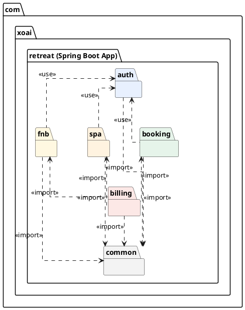

# Sơ đồ gói (Package Diagram) - com.xoai.retreat

Tài liệu này mô tả cấu trúc phân rã các gói (packages) và mối quan hệ phụ thuộc trong ứng dụng Spring Boot **`com.xoai.retreat`**.

## 1. Sơ đồ PlantUML

Bạn có thể sử dụng mã PlantUML dưới đây để hiển thị sơ đồ:

## 2. Phân tích chi tiết các Gói (Packages)

Hệ thống được chia thành 6 gói chức năng/module chính:

*   **`auth` (Màu xanh dương - #E8F0FE):** Quản lý xác thực và phân quyền (Authentication & Authorization).
*   **`booking` (Màu xanh lá - #E6F4EA):** Quản lý việc đặt phòng/đặt chỗ nghỉ dưỡng.
*   **`spa` (Màu cam nhạt - #FFF3E0):** Quản lý các dịch vụ Spa, trị liệu, chăm sóc sức khỏe.
*   **`fnb` (Food and Beverage - Màu vàng nhạt - #FFF8E1):** Quản lý dịch vụ ăn uống, nhà hàng.
*   **`billing` (Màu đỏ/hồng nhạt - #FCE8E6):** Quản lý hóa đơn, thanh toán và tính tổng tiền.
*   **`common` (Màu xám nhạt - #F3F3F3):** Chứa các thư viện, tiện ích dùng chung (Utilities, DTOs, Exceptions, Constants, Configurations). **LƯU Ý THIẾT KẾ (DDD):** Hệ thống được cấu trúc theo Domain-Driven Design (Package by Feature). Do đó, `Entity` của module nào sẽ được đặt trực tiếp bên trong package `entity` của module đó. Với các quan hệ khóa ngoại (Foreign Key) xuyên module, chúng ta sử dụng **Loose Coupling** (chỉ lưu ID dưới dạng `Integer`) thay vì ánh xạ object (`@ManyToOne`) để bảo đảm tính độc lập và tránh lỗi vòng lặp phụ thuộc (Circular Dependency).

---

## 3. Mối quan hệ và luồng phụ thuộc (Dependencies)

### A. Gói dùng chung `common`
*   **Mối quan hệ:** Tất cả các gói khác (`auth`, `booking`, `spa`, `fnb`, `billing`) đều có quan hệ phụ thuộc kiểu `<<import>>` hướng về `common`.
*   **Ý nghĩa:** `common` hoạt động như một thư viện dùng chung cho toàn bộ dự án. Các gói khác sử dụng các class dùng chung như định dạng ngày tháng, Helper, Exception toàn cục, hoặc Base Response DTO từ gói này để đảm bảo tính đồng bộ và tái sử dụng mã nguồn.

### B. Gói xác thực và phân quyền `auth`
*   **Mối quan hệ:** Các gói dịch vụ chính bao gồm `booking`, `spa`, và `fnb` đều sử dụng gói `auth` thông qua quan hệ `<<use>>`.
*   **Ý nghĩa:** Khi người dùng thực hiện đặt chỗ, đặt lịch spa hoặc gọi món ăn, hệ thống cần xác định danh tính và quyền hạn. Do đó, các gói này phải phụ thuộc vào gói `auth` để kiểm tra phân quyền bảo mật (Role-Based Access Control - RBAC) hoặc lấy thông tin người dùng hiện tại từ Security Context.

### C. Gói tính tiền và hóa đơn `billing`
*   **Mối quan hệ:** `billing` phụ thuộc kiểu `<<import>>` vào cả 3 gói dịch vụ: `booking`, `spa`, và `fnb`.
*   **Ý nghĩa:** Hóa đơn thanh toán cuối cùng của khách hàng tại khu nghỉ dưỡng bao gồm tổng chi phí từ tiền phòng (`booking`), chi phí dịch vụ spa (`spa`), và hóa đơn ăn uống (`fnb`). Gói `billing` cần truy xuất thông tin chi tiết về các giao dịch, trạng thái đặt phòng/dịch vụ từ các module này để tổng hợp dữ liệu và tính toán tổng số tiền cần thanh toán.

---

## 4. Đánh giá Kiến trúc

*   **Tính gắn kết cao & Khớp nối lỏng (High Cohesion & Low Coupling):** Các nghiệp vụ cốt lõi (Spa, F&B, Booking) được tách biệt hoàn toàn thành các gói riêng biệt, không có phụ thuộc lẫn nhau. Giúp lập trình viên có thể thay đổi hoặc bảo trì độc lập từng module.
*   **Tránh phụ thuộc xoay vòng (No Circular Dependency):** Luồng phụ thuộc một chiều rõ ràng giúp hệ thống tránh được lỗi vòng lặp phụ thuộc (Circular Dependency) khi khởi tạo Bean trong Spring Boot.
