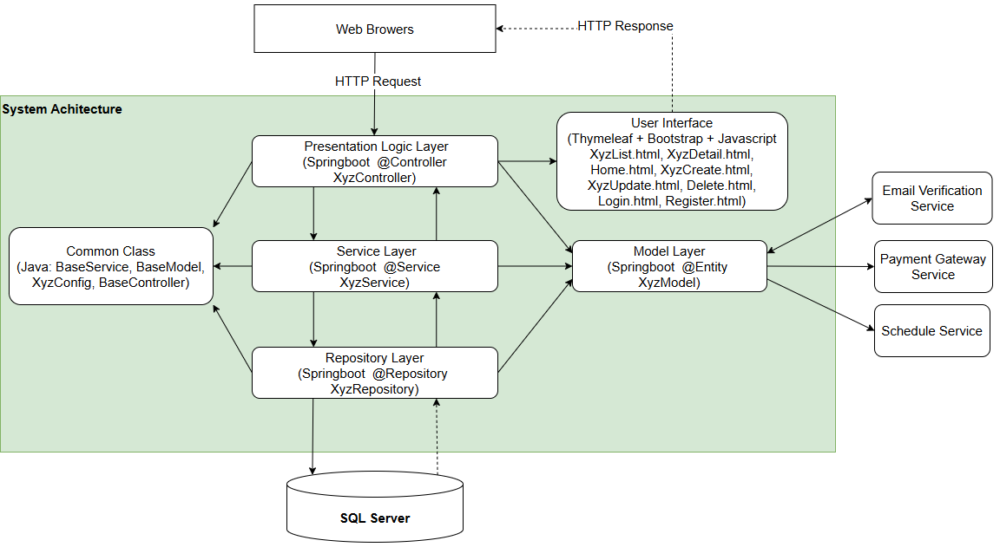
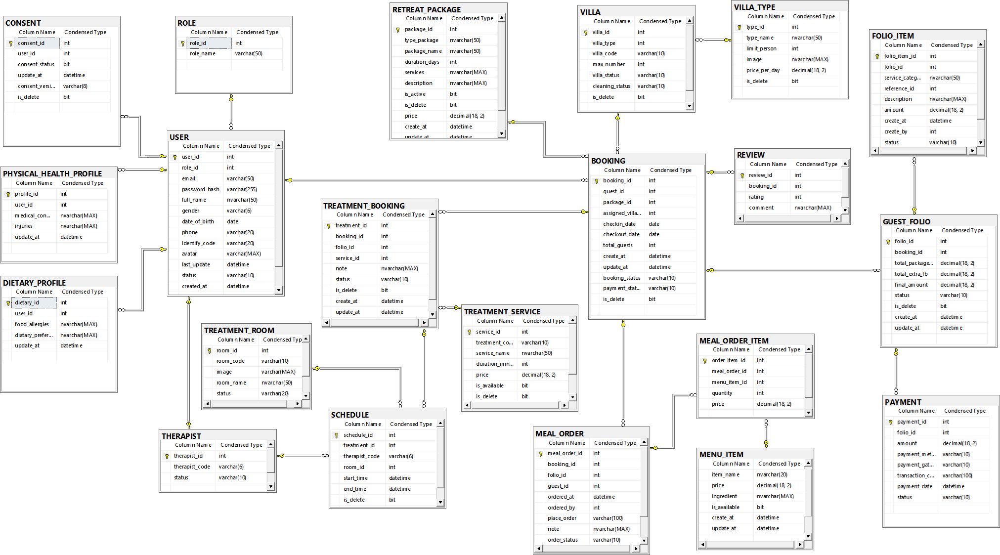
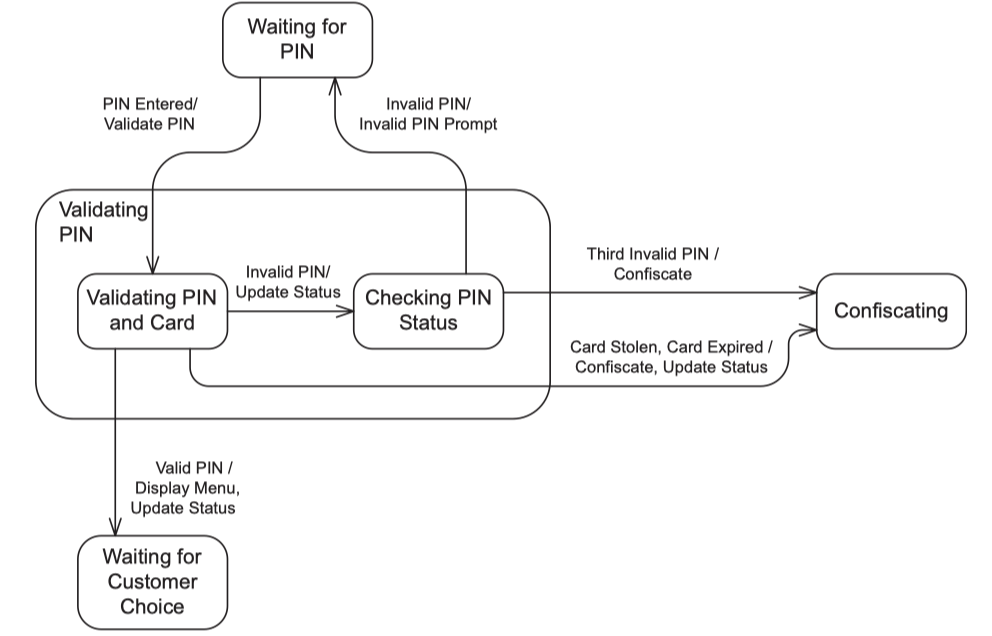
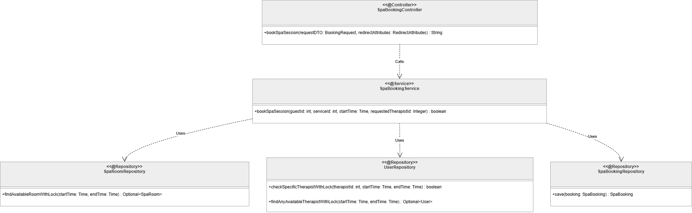
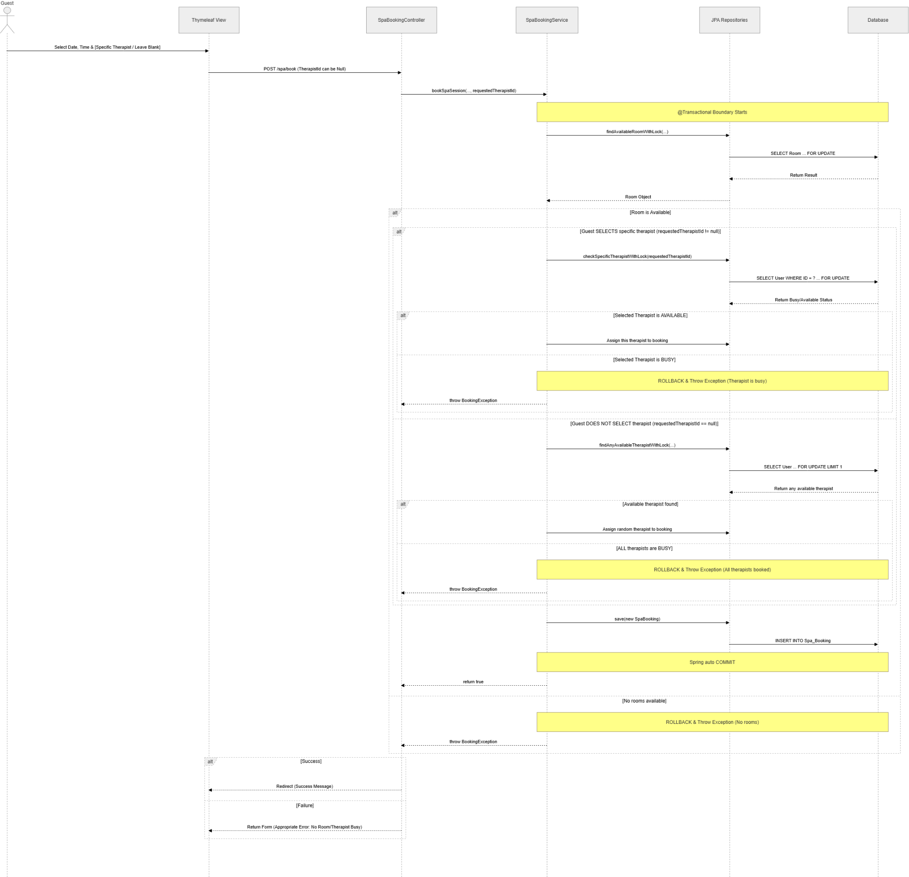
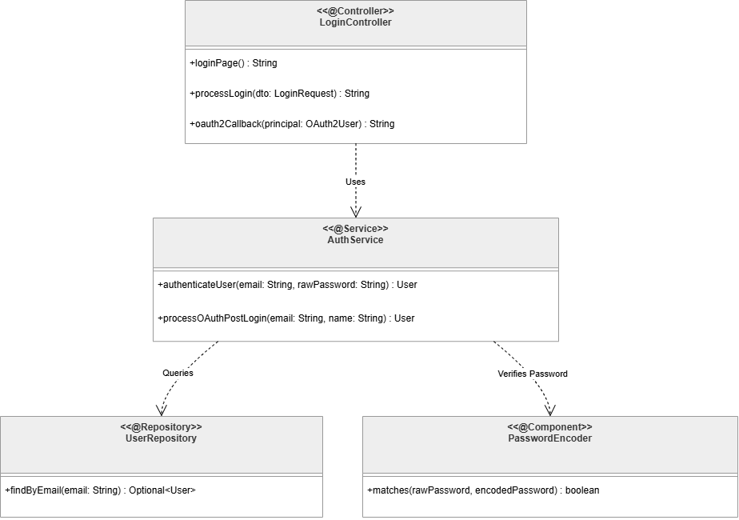
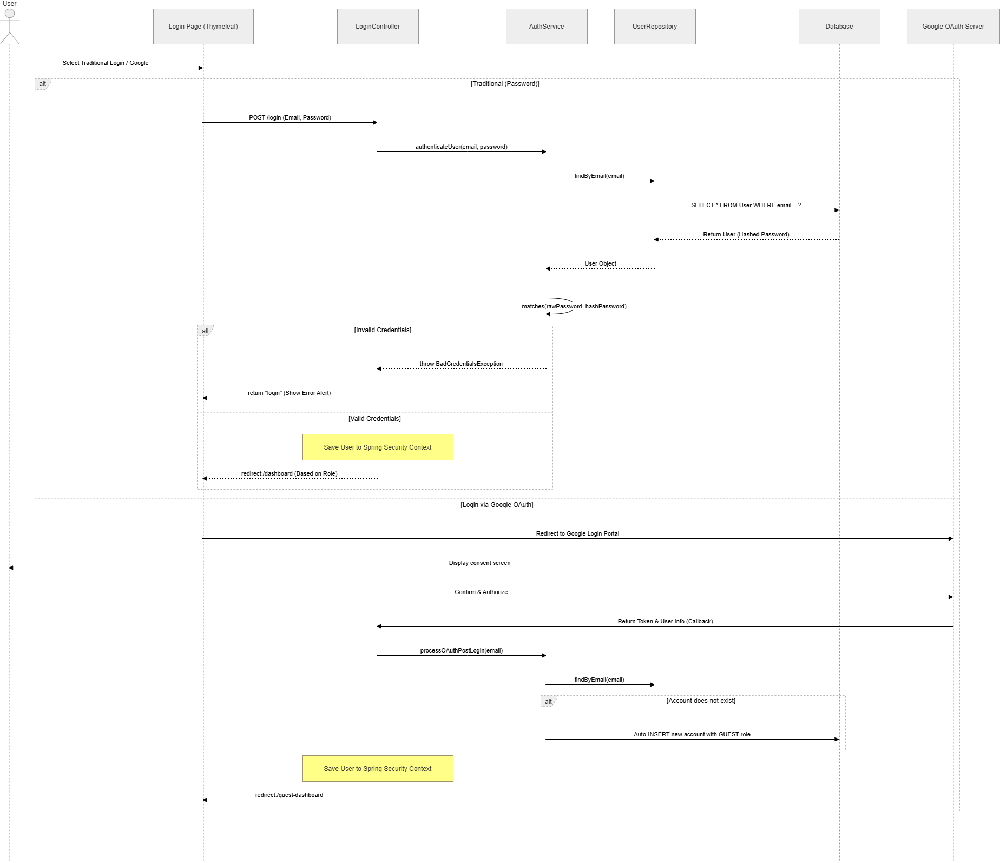
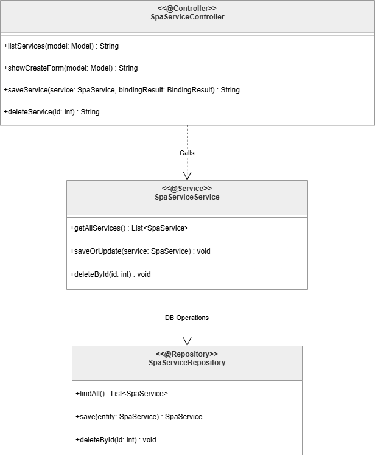
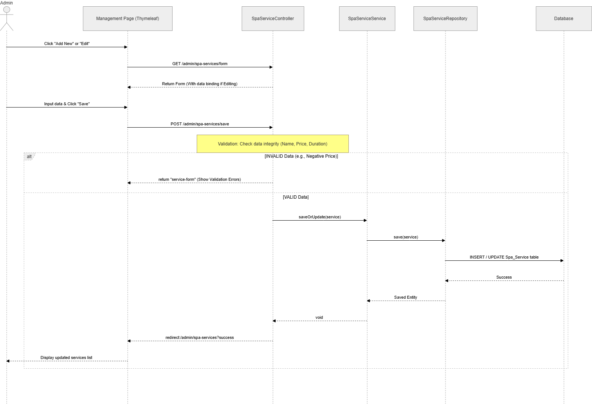



**SOFTWARE DESIGN SPECIFICATION**

**Project Name (Code)**

> – Hanoi, Sep 2025 –

**Table of Contents**

[I. Record of Changes 3](#i.-record-of-changes)

[II. Software Design Document 4](#ii.-software-design-document)

> [1. High Level Design 4](#high-level-design)
>
> [1.1 Software Architecture 4](#software-architecture---ngọc)
>
> [1.2 Package Diagram 4](#package-diagram---hải)
>
> [1.3 Database Design 5](#database-design---ngọc)
>
> [2. State Transition Diagrams 7](#state-transition-diagrams---hải)
>
> [2.1 PIN Validation 7](#pin-validation)
>
> [2.2 … 7](#section-1)
>
> [3. Detailed Design 8](#detailed-design---dương)
>
> [3.1 \<Feature/Function Name1\> 8](#_heading=h.sgmf6yhq7gop)
>
> [3.2 \<Feature/Function Name2\> 9](#_heading=h.5wd7pjb36ekz)

# I. Record of Changes

<table style="width:94%;">
<colgroup>
<col style="width: 10%" />
<col style="width: 8%" />
<col style="width: 13%" />
<col style="width: 61%" />
</colgroup>
<tbody>
<tr>
<td style="text-align: center;"><strong>Date</strong></td>
<td style="text-align: center;"><strong>A* 
M, D</strong></td>
<td style="text-align: center;"><strong>In charge</strong></td>
<td style="text-align: center;"><strong>Change Description</strong></td>
</tr>
<tr>
<td style="text-align: left;"></td>
<td style="text-align: left;"></td>
<td style="text-align: left;"></td>
<td style="text-align: left;"></td>
</tr>
<tr>
<td style="text-align: left;"></td>
<td style="text-align: left;"></td>
<td style="text-align: left;"></td>
<td style="text-align: left;"></td>
</tr>
<tr>
<td style="text-align: left;"></td>
<td style="text-align: left;"></td>
<td style="text-align: left;"></td>
<td style="text-align: left;"></td>
</tr>
<tr>
<td style="text-align: left;"></td>
<td style="text-align: left;"></td>
<td style="text-align: left;"></td>
<td style="text-align: left;"></td>
</tr>
<tr>
<td style="text-align: left;"></td>
<td style="text-align: left;"></td>
<td style="text-align: left;"></td>
<td style="text-align: left;"></td>
</tr>
<tr>
<td style="text-align: left;"></td>
<td style="text-align: left;"></td>
<td style="text-align: left;"></td>
<td style="text-align: left;"></td>
</tr>
<tr>
<td style="text-align: left;"></td>
<td style="text-align: left;"></td>
<td style="text-align: left;"></td>
<td style="text-align: left;"></td>
</tr>
<tr>
<td style="text-align: left;"></td>
<td style="text-align: left;"></td>
<td style="text-align: left;"></td>
<td style="text-align: left;"></td>
</tr>
<tr>
<td style="text-align: left;"></td>
<td style="text-align: left;"></td>
<td style="text-align: left;"></td>
<td style="text-align: left;"></td>
</tr>
<tr>
<td style="text-align: left;"></td>
<td style="text-align: left;"></td>
<td style="text-align: left;"></td>
<td style="text-align: left;"></td>
</tr>
<tr>
<td style="text-align: left;"></td>
<td style="text-align: left;"></td>
<td style="text-align: left;"></td>
<td style="text-align: left;"></td>
</tr>
<tr>
<td style="text-align: left;"></td>
<td style="text-align: left;"></td>
<td style="text-align: left;"></td>
<td style="text-align: left;"></td>
</tr>
<tr>
<td style="text-align: left;"></td>
<td style="text-align: left;"></td>
<td style="text-align: left;"></td>
<td style="text-align: left;"></td>
</tr>
</tbody>
</table>

\*A - Added M - Modified D - Deleted

# II. Software Design Document

## 1. High Level Design

### 1.1 Software Architecture - Ngọc

*\[The content of this section includes the overall architectural
diagram which includes the sub-systems and/or components, the external
systems (if any), and the relationships (communication messages) among
them. You need also provide the explanation for each of the diagram
components (modules, sub-systems, external systems, etc.)\].*

[<u>Figure X - Software
Architecture</u>](https://app.diagrams.net/#G1nYppNahTHsDyff4ABh4xfEVTmDvZ9q0X#%7B%22pageId%22%3A%22IRs-SEGyqOjkAyR8Oi1K%22%7D)

### 1.2 Package Diagram

*[Provide the package diagram for each sub-system. The content of this section including the overall package diagram, the explanation, package and class naming conventions in each package. Please see the sample & description table format below]*

`plantuml
@startuml
skinparam packageStyle folder
skinparam linetype ortho
skinparam nodesep 60
skinparam ranksep 60

package "com.xoai.retreat (Spring Boot App)" {
    
    package "auth" as auth #E8F0FE {
    }
    
    package "booking" as booking #E6F4EA {
    }
    
    package "spa" as spa #FFF3E0 {
    }
    
    package "fnb" as fnb #FFF8E1 {
    }
    
    package "billing" as billing #FCE8E6 {
    }
    
    package "common" as common #F3F3F3 {
    }
}

' Module 5 (Billing) depends on other modules to calculate the total amount
billing .up.> booking : <<import>>
billing .up.> spa : <<import>>
billing .up.> fnb : <<import>>

' Service modules depend on Auth to get authentication/authorization information
spa .up.> auth : <<use>>
fnb .up.> auth : <<use>>
booking .up.> auth : <<use>>

' All modules share utilities from the Common package
auth ..> common : <<import>>
booking ..> common : <<import>>
spa ..> common : <<import>>
fnb ..> common : <<import>>
billing ..> common : <<import>>

@enduml
`

***Package descriptions***

| **No** | **Package** | **Description** |
|--------|-------------|-----------------|
| 01 | auth | Manages authentication and authorization. Provides Role-Based Access Control (RBAC) and user information from the Security Context to other modules. |
| 02 | booking | Manages resort room booking and reservations. |
| 03 | spa | Manages Spa services, therapies, and wellness care. |
| 04 | fnb | Manages dining and restaurant services (Food and Beverage). |
| 05 | billing | Manages billing, payments, and total calculation by retrieving and consolidating transaction details from booking, spa, and fnb. |
| 06 | common | Contains shared libraries and utilities (Utilities, DTOs, Exceptions, Constants, Configurations) for the entire project. The system is structured according to Domain-Driven Design (Loose Coupling). |

***Architecture Evaluation***

* **High Cohesion & Low Coupling:** Core business domains (Spa, F&B, Booking) are completely separated into distinct packages without cross-dependencies. This allows developers to modify or maintain each module independently.
* **No Circular Dependency:** A clear uni-directional dependency flow prevents circular dependency errors during Spring Boot Bean initialization.
### 1.3 Database Design - Ngọc

*\[Provide the files description, database table relationship & table
descriptions like example below\]*

[<u>Figure X - Database Design
Diagram</u>](https://drive.google.com/file/d/1ZJ7tXirFLBp5_qo8BCYYA1ZVyBzUI62m/view?usp=drive_link)

#### 1.3.1 ROLE

|  |  |  |  |  |  |  |
|----|----|----|----|----|----|----|
| **No** | **Field** | **PK** | **FK** | **UN** | **NN** | **Description** |
| 1 | role_id | X |  |  | X | Identify code (auto-increment) |
| 2 | rple_name |  |  |  | X | Names of the roles in the system (Guest, Receptionist, Therapist, Chef, Admin) |

#### 1.3.2 USER

|  |  |  |  |  |  |  |
|:---|:---|:---|:---|:---|:---|:---|
| **No** | **Field** | **PK** | **FK** | **UN** | **NN** | **Description** |
| 1 | user_id | X |  |  | X | Unique User Identifier (Auto-incrementing) |
| 2 | role_id |  | X |  | X | Code associated with the ROLE table to identify data access rights according to the RBAC model |
| 3 | email |  |  |  | X | Unique email address used to log in and authenticate the SSO account |
| 4 | password_hash |  |  |  | X | User account password (securely hashed) |
| 5 | full_name |  |  |  |  | Full name of the user or customer. |
| 6 | gender |  |  |  |  | User's gender (Male / Female / Other). |
| 7 | date_of_birth |  |  |  |  | User's date of birth. |
| 8 | phone |  |  |  |  | User's contact phone number. |
| 9 | Identify_code |  |  |  |  | Personal identification number (Citizen Identification Card/Passport).Encryption at rest is mandatory for residence declaration purposes according to the Residence Law 2020 |
| 10 | avatar |  |  |  |  | User's profile picture link. |
| 11 | last_update |  |  |  |  | Last account information update time (Default current time). |
| 12 | status |  |  |  |  | User account status (Active / Inactive). |
| 13 | created_at |  |  |  |  | Account creation time in the system. |
| 14 | last_login |  |  |  |  | User's last login time to the system. |

#### 1.3.3 THERAPIST

|  |  |  |  |  |  |  |
|:---|:---|:---|:---|:---|:---|:---|
| **No** | **Field** | **PK** | **FK** | **UN** | **NN** | **Description** |
| 1 | therapist_id | X | X |  | X | Specialist identifier, also a foreign key associated with USER(user_id) |
| 2 | therapist_code |  |  |  | X | Unique identifier code for each specialist |
| 3 | status |  |  |  |  | Current work status of the specialist (Available / Busy / Leave). |

#### 1.3.4 CONSENT

|  |  |  |  |  |  |  |
|:---|:---|:---|:---|:---|:---|:---|
| **No** | **Field** | **PK** | **FK** | **UN** | **NN** | **Description** |
| 1 | consent_id | X |  |  | X | Unique identifier of the consent history record (Auto-incrementing). |
| 2 | user_id |  | X |  | X | Code associated with the customer account USER(user_id) |
| 3 | consent_status |  |  |  |  | Customer consent status (1: Accepted, 0: Not accepted) |
| 4 | update_at |  |  |  |  | Time of the most recent consent status update. |
| 5 | consent_version |  |  |  |  | Version of the sensitive personal data consent terms. |
| 6 | is_delete |  |  |  |  | Mark up consent is deleted |

#### 1.3.5 DIETARY_PROFILE

|  |  |  |  |  |  |  |
|:---|:---|:---|:---|:---|:---|:---|
| **No** | **Field** | **PK** | **FK** | **UN** | **NN** | **Description** |
| 1 | dietary_id | X |  |  | X | Unique identifier of the nutrition profile (Auto-incrementing). |
| 2 | user_id |  | X |  | X | Customer account link code USER(user_id), to manage the private record |
| 3 | food_allergies |  |  |  |  | Food allergy information (e.g., peanut allergy, seafood allergy) |
| 4 | dietary_preference |  |  |  |  | Customer's personal dietary preferences (e.g., vegan) |
| 5 | update_at |  |  |  |  | Last updated nutrition profile date. |

#### 1.3.6 PHYSICAL_HEALTH_PROFILE

|  |  |  |  |  |  |  |
|:---|:---|:---|:---|:---|:---|:---|
| **No** | **Field** | **PK** | **FK** | **UN** | **NN** | **Description** |
| 1 | profile_id | X |  |  | X | Unique identifier of the physical health record (Auto-incrementing). |
| 2 | user_id |  | X |  | X | Code linked to the customer account USER(user_id) to manage the private record |
| 3 | medical_conditions |  |  |  |  | Underlying medical conditions, medical history (e.g., back pain, cardiovascular). |
| 4 | injuries |  |  |  |  | Customer injury information. Spa therapists use this for pre-treatment checks |
| 5 | update_at |  |  |  |  | Last updated physical health record time. |

#### 1.3.7 TREATMENT_SERVICE

|  |  |  |  |  |  |  |
|:---|:---|:---|:---|:---|:---|:---|
| **No** | **Field** | **PK** | **FK** | **UN** | **NN** | **Description** |
| 1 | service_id | X |  |  | X | Unique identifier for the treatment service (Auto-incrementing). |
| 2 | treatment_code |  |  |  | X | Unique abbreviation for the treatment service (maximum 10 characters). |
| 3 | service_name |  |  |  |  | Display name of the treatment/Spa service (e.g., Swedish Massage). |
| 4 | duration_minutes |  |  |  |  | Service duration in minutes (e.g., 60 minutes, 90 minutes). |
| 5 | price |  |  |  |  | Listed price of the treatment service (VND/USD) |
| 6 | is_available |  |  |  |  | Service availability status (1: Available, 0: Temporarily suspended). |
| 7 | is_delete |  |  |  |  | Flag to remove service logic from the catalog management system |

#### 1.3.8 TREATMENT_ROOM

|  |  |  |  |  |  |  |
|:---|:---|:---|:---|:---|:---|:---|
| **No** | **Field** | **PK** | **FK** | **UN** | **NN** | **Description** |
| 1 | room_id | X |  |  | X | Unique identifier for the treatment room (Auto-incrementing). |
| 2 | room_code |  |  |  | X | Unique identification code for the treatment room |
| 3 | image |  |  |  |  | Path to a real-life photo of the treatment room's facilities. |
| 4 | room_name |  |  |  |  | Name or display number of the Spa treatment room. |
| 5 | status |  |  |  |  | Treatment room status (Available / Occupied / Maintenance). |
| 6 | is_delete |  |  |  |  | Flag to remove the treatment room logic from the system. |

#### 1.3.9 VILA_TYPE

|  |  |  |  |  |  |  |
|:---|:---|:---|:---|:---|:---|:---|
| **No** | **Field** | **PK** | **FK** | **UN** | **NN** | **Description** |
| 1 | type_id | X |  |  | X | Unique identifier for the Villa type (Auto-incrementing). |
| 2 | type_name |  |  |  |  | Villa category name (e.g., Ocean View Villa) |
| 4 | image |  |  |  |  | Path to save the perspective image of the Villa type. |
| 5 | price_per_day |  |  |  |  | Villa rental price per day |
| 6 | is_delete |  |  |  |  | Flag to remove the Villa type logic from the system management catalog |

#### 1.3.10 VILA

|  |  |  |  |  |  |  |
|:---|:---|:---|:---|:---|:---|:---|
| **No** | **Field** | **PK** | **FK** | **UN** | **NN** | **Description** |
| 1 | villa_id | X |  |  | X | The unique identifier of the physical Villa (Auto-incrementing). |
| 2 | villa_type |  | X |  | X | Foreign key linking to the room type category VILLA_TYPE(type_id) |
| 3 | villa_code |  |  |  | X | Unique villa room number used in operation (e.g., VIL-101) |
| 4 | max_number |  |  |  |  | Maximum number of guests that can actually be accommodated at this Villa. |
| 5 | villa_status |  |  |  |  | Current booking status of the Villa (Available / Occupied / Reserved) |
| 6 | cleaning_status |  |  |  |  | Room cleaning status for check-in/out (Cleaned / Dirty / Needs Cleaning) |
| 7 | is_delete |  |  |  |  | Flag to remove the Villa entity logic from the system. |

#### 1.3.11 RETREAT_PACKAGE

|  |  |  |  |  |  |  |
|:---|:---|:---|:---|:---|:---|:---|
| **No** | **Field** | **PK** | **FK** | **UN** | **NN** | **Description** |
| 1 | package_id | X |  |  | X | Unique identifier of the all-inclusive wellness retreat package (Automatically incrementing). |
| 2 | type_package |  |  |  |  | Treatment package goal classification |
| 3 | package_name |  |  |  |  | Name of the GWI standard wellness retreat package |
| 4 | duration_days |  |  |  |  | Total number of days of stay for the treatment package |
| 5 | services |  |  |  |  | Description of the list of included treatment services in this all-inclusive package. |
| 6 | description |  |  |  |  | Detailed description of the itinerary and health benefits of the package. |
| 7 | is_active |  |  |  |  | Activation status allowing customers to search and purchase the package (1: Yes) |
| 8 | is_delete |  |  |  |  | Flag to remove the treatment package logic from the system catalog. |
| 9 | price |  |  |  |  | Total package price including accommodation |
| 10 | create_at |  |  |  |  | Time of creation of the treatment package in the system. |
| 11 | update_at |  |  |  |  | Time of last package information update. |

#### 1.3.12 BOOKING

|  |  |  |  |  |  |  |
|:---|:---|:---|:---|:---|:---|:---|
| **No** | **Field** | **PK** | **FK** | **UN** | **NN** | **Description** |
| 1 | booking_id | X |  |  | X | Unique identifier of the resort reservation (Auto-incrementing). |
| 2 | guest_id |  | X |  | X | Foreign key associated with USER(user_id) representing the customer who made the reservation |
| 3 | package_id |  | X |  |  | Foreign key associated with the RETREAT_PACKAGE(package_id) the customer selected |
| 4 | assigned_villa_id |  | X |  |  | Foreign key associated with the actual VILLA(villa_id) assigned by the Reception during Check-In |
| 5 | checkin_date |  |  |  |  | Actual or expected check-in date. |
| 6 | checkout_date |  |  |  |  | Actual or expected check-out date. |
| 7 | total_guests |  |  |  |  | Total number of guests staying in this reservation. |
| 8 | create_at |  |  |  |  | Time the customer created the online reservation. |
| 9 | update_at |  |  |  |  | Time the reservation information was last updated. |
| 10 | booking_status |  |  |  |  | Processing status of the reservation (Pending / Confirmed / Checked-In / Checked-Out / Cancelled). |
| 11 | payment_status |  |  |  |  | Payment status for deposit or room rate (Unpaid / Deposited / Fully-Paid) |
| 12 | is_delete |  |  |  |  | Flag indicating cancellation or deletion of booking logic. |

#### 1.3.13 GUEST_FOLIO

|  |  |  |  |  |  |  |
|:---|:---|:---|:---|:---|:---|:---|
| No | Field | PK | FK | UN | NN | Description |
| 1 | folio_id | X |  |  | X | Unique identifier of the room debt record (Auto-incrementing). |
| 2 | booking_id |  | X |  | X | Main foreign key linked to BOOKING (booking_id) to consolidate all incurred costs into the room account |
| 3 | total_package_amout |  |  |  |  | Total cost of room and initial fixed package treatment. |
| 4 | total_extra_fb |  |  |  |  | Total of additional costs outside the package from à la carte dining services |
| 5 | final_amount |  |  |  |  | Total final cost to be paid before departure |
| 6 | status |  |  |  |  | Room debt record status (Pending / Settled). Constraint to prevent Check-out if there is outstanding debt |
| 7 | is_delete |  |  |  |  | Flag to mark the logical deletion of the debt record. |
| 8 | create_at |  |  |  |  | Time the debt account was opened |
| 9 | update_at |  |  |  |  | Time of the most recent financial data update. |

#### 1.3.14 TREATMENT_BOOKING

|  |  |  |  |  |  |  |
|:---|:---|:---|:---|:---|:---|:---|
| **No** | **Field** | **PK** | **FK** | **UN** | **NN** | **Description** |
| 1 | treatment_id | X |  |  | X | Unique identifier for the Spa treatment appointment (Auto-incrementing). |
| 2 | booking_id |  | X |  | X | Foreign key linked to the original booking BOOKING(booking_id) to verify the stay |
| 3 | folio_id |  | X |  |  | Foreign key linked to the debt record GUEST_FOLIO to charge for additional services purchased outside the package |
| 4 | service_id |  | X |  | X | Foreign key linked to the treatment service category TREATMENT_SERVICE(service_id) |
| 5 | note |  |  |  |  | Special notes from the client or instructions from the doctor/specialist for the treatment session. |
| 6 | status |  |  |  |  | Spa appointment status (Scheduled / Completed / No-Show / Cancelled) |
| 7 | is_delete |  |  |  |  | Flag to mark the logical deletion of the Spa appointment. |
| 8 | create_at |  |  |  |  | Time of appointment booking. |
| 9 | update_at |  |  |  |  | Time of the most recent update of the treatment schedule information. |

#### 1.3.15 SCHEDULE

|  |  |  |  |  |  |  |
|:---|:---|:---|:---|:---|:---|:---|
| **No** | **Field** | **PK** | **FK** | **UN** | **NN** | **Description** |
| 1 | schedule_id | X |  |  | X | Unique identifier for the detailed resource allocation schedule (Auto-incrementing). |
| 2 | treatment_id |  | X |  | X | Foreign key linked to the original treatment appointment schedule TREATMENT_BOOKING(treatment_id). |
| 3 | therapist_code |  | X |  |  | Foreign key linked to the therapist code THERAPIST(therapist_code). |
| 4 | room_id |  | X |  |  | Constraint to prevent double-booking, Foreign key linked to the Spa room TREATMENT_ROOM(room_id). |
| 5 | start_time |  |  |  |  | Actual Spa treatment start time |
| 6 | end_time |  |  |  |  | Estimated treatment end time based on service duration. |
| 7 | is_delete |  |  |  |  | Flag to clear resource allocation schedule logic. |

#### 1.3.16 MENU_ITEM

|  |  |  |  |  |  |  |
|:---|:---|:---|:---|:---|:---|:---|
| **No** | **Field** | **PK** | **FK** | **UN** | **NN** | **Description** |
| 1 | menu_item_id | X |  |  | X | Unique identifier for the dish/drink on the menu (Automatically incremented). |
| 2 | item_name |  |  |  |  | Display name of the dish or drink on the menu |
| 3 | price |  |  |  |  | Retail price of the dish served as an add-on outside of the nutritional package |
| 4 | ingredient |  |  |  |  | Detailed ingredient list of the dish.Used for the system to automatically check customer allergy filters |
| 5 | is_available |  |  |  |  | Status of the dish available in the kitchen on that day (1: Available 0: Out of stock). |
| 6 | create_at |  |  |  |  | The time dish was created on the F&B management system. |
| 7 | update_at |  |  |  |  | Time of the last update of the dish's menu ingredient information. |

#### 

#### 1.3.17 MEAL_ORDER

|  |  |  |  |  |  |  |
|:---|:---|:---|:---|:---|:---|:---|
| **No** | **Field** | **PK** | **FK** | **UN** | **NN** | **Description** |
| 1 | meal_order_id | X |  |  | X | Unique identifier of the food order (Auto-incrementing). |
| 2 | booking_id |  | X |  | X | Foreign key associated with the BOOKING(booking_id) resort booking to identify the room receiving the food |
| 3 | folio_id |  |  |  |  | Foreign key associated with the room payment record for accounting if additional costs are incurred |
| 4 | guest_id |  |  |  |  | Identifier of the customer making the food request or enjoying the food service. |
| 5 | ordered_at |  |  |  |  | Time of food order placement (Default current time). |
| 6 | ordered_by |  |  |  |  | User ID of the person creating the order (Customer places the order themselves or F&B staff places it on their behalf). |
| 7 | place_order |  |  |  |  | Delivery location |
| 8 | note |  |  |  |  | Customer's special dish note |
| 9 | order_status |  |  |  |  | Processing status of the meal order updated by the Chef (Preparing -\> Ready for Delivery) |

#### 1.3.18 MEAL_ORDER_ITEM

|  |  |  |  |  |  |  |
|:---|:---|:---|:---|:---|:---|:---|
| **No** | **Field** | **PK** | **FK** | **UN** | **NN** | **Description** |
| 1 | order_item_id | X |  |  | X | Unique identifier for the item details line in the order (Auto-incrementing). |
| 2 | meal_order_id |  | X |  | X | Foreign key directly linked to the overall food order invoice MEAL_ORDER(meal_order_id). |
| 3 | menu_item_id |  | X |  | X | Foreign key linked to the specific item called in MENU_ITEM(menu_item_id). |
| 4 | quantity |  |  |  |  | Quantity of servings of the specific item requested in the order. |
| 5 | price |  |  |  |  | Unit price applicable at the time of placing the order (Used to fix the financial price). |

#### 1.3.19 FOLIO_ITEM

|  |  |  |  |  |  |  |
|:---|:---|:---|:---|:---|:---|:---|
| **No** | **Field** | **PK** | **FK** | **UN** | **NN** | **Description** |
| 1 | folio_item_id | X |  |  | X | Unique identifier for the service charge line (Automatically increments). |
| 2 | folio_id |  | X |  | X | Foreign key directly linked to the customer's aggregated debt account GUEST_FOLIO(folio_id) |
| 3 | service_category |  |  |  |  | Classification of the generated service group for revenue analysis reporting (e.g., Extra Spa, Extra F&B) |
| 4 | reference_id |  |  |  |  | Reference ID of the generated original order |
| 5 | description |  |  |  |  | Detailed explanation of the incurred debt item for customer verification upon check-out |
| 6 | amount |  |  |  |  | Value of the generated service charge (Will be automatically added to the aggregated debt Folio) |
| 7 | create_at |  |  |  |  | Time of this individual charge transaction to be added to the room account. |
| 8 | create_by |  |  |  |  | Identifier of the employee who pushed this charge to the guest's room system. |
| 9 | status |  |  |  |  | Payment processing status for additional charges |

#### 1.3.20 REVIEW

|  |  |  |  |  |  |  |
|:---|:---|:---|:---|:---|:---|:---|
| **No** | **Field** | **PK** | **FK** | **UN** | **NN** | **Description** |
| 1 | review_id | X |  |  | X | Unique identifier of the feedback record (Auto-incrementing). |
| 2 | booking_id |  | X |  | X | Foreign key associated with the BOOKING(booking_id) resort reservation after check-out |
| 3 | rating |  |  |  |  | Quantitative service quality rating (Constraint value from 1 to 5 stars) |
| 4 | comment |  |  |  |  | Content of the customer's free-form text feedback about the resort |

#### 1.3.21 PAYMENT

|  |  |  |  |  |  |  |
|:---|:---|:---|:---|:---|:---|:---|
| **No** | **Field** | **PK** | **FK** | **UN** | **NN** | **Description** |
| 1 | payment_id | X |  |  | X | Unique identifier for the financial payment transaction record (Auto-incrementing). |
| 2 | folio_id |  | X |  |  | Foreign key directly linked to the aggregated debt account record GUEST_FOLIO(folio_id) |
| 3 | amount |  |  |  |  | Actual amount of the payment transaction |
| 4 | payment_method |  |  |  |  | Applicable payment method |
| 5 | payment_gateway |  |  |  |  | Name of the third-party online payment gateway API processing the transaction (Stripe / VNPay / PayPal) |
| 6 | transaction_code |  |  |  | X | Transaction tracking code returned from the bank system or partner payment gateway for reconciliation |
| 7 | payment_date |  |  |  |  | Time the payment transaction was successfully recorded |
| 8 | status |  |  |  |  | Status of the financial payment transaction processing (Success / Failed / Processing). |

## 2. State Transition Diagrams - Hải

*\[Specify and draw state charts (state transition diagrams) for the
data and system like below sample. In the diagrams, beside the states,
you are required to provide suitable events, actions on the state
transitions, entry actions, or exit actions\]*

### 2.1 PIN Validation

*\[Provide state chart with extra explanations if needed\]*

### 2.2 …

### 

## 3. Detailed Design - Dương

### **3.1 Auto-Matching Spa Scheduling & Specific Therapist Selection (UC12)** This feature allows guests to book a Spa session with two options: assigning a specific Therapist, or letting the system automatically assign any available therapist. The system ensures data locking (FOR UPDATE) and automatic Rollback via @Transactional to prevent room and personnel resource collisions (double-booking). 

#### 3.1.1 Class Diagram The main difference here is that the requestedTherapistId parameter is passed to the Service as a reference type (Nullable) to identify whether the guest has specified a therapist or not. 

[<u>Link</u>](https://drive.google.com/file/d/1khxPhkMoomYv-64p0A7yzhxoGx_lAupE/view?usp=sharing)

#### **3.1.2 Sequence Diagram: Spa Booking Branch Processing** This sequence diagram includes an additional condition block (Alt) to branch the therapist search algorithm based on the guest's selection. 

[<u>Link</u>](https://drive.google.com/file/d/1JnNhsqr098-j9KGxlx1AxeJDhn7D4KU9/view?usp=sharing)

### **3.2 Login & Authentication (UC01)** The system supports user authentication via two methods: traditional login (Email/Password) utilizing BCrypt encryption, and single sign-on via Google OAuth2. Upon successful authentication, the system leverages Spring Security to manage user sessions and assign corresponding roles (Guest, Admin, Therapist, etc.). 

#### **3.2.1 Class Diagram** This diagram illustrates the Spring Security components and the Service layer handling the authentication logic. 

[<u>Link</u>](https://drive.google.com/file/d/1V1KX1fAm_9VthNuziEYgg5OGLATj2x_0/view?usp=sharing)

#### **3.2.2 Sequence Diagram: Authentication Processing** The sequence diagram below covers both the traditional login flow and the branching logic for the Google OAuth API integration. 

[<u>Link</u>](https://drive.google.com/file/d/1PihdFMZ0rEh_svzLuK0CXimMVwr8YnIm/view?usp=sharing)

### **3.3 Manage Spa Services (Standard CRUD Template)** This feature allows the Admin to manage the master data for Spa services (Create, Read, Update, Delete). The update process uses Server-Side Rendering to bind data to forms and handles persistence via Spring Data JPA. *(Note: This class structure and data flow serve as the standard reference architecture for all other master data management features, such as Manage Staff, Manage Rooms, etc.).* 

#### 3.3.1 Class Diagram 

[<u>Link</u>](https://drive.google.com/file/d/1mzzR3kfi7y8or0As3C5A2SAlUP6wIv-3/view?usp=sharing)

#### **3.3.2 Sequence Diagram: Create/Update Service** This diagram illustrates the flow for adding a new Spa service or updating an existing one. The Read and Delete flows follow a structurally identical execution path. 

[<u>Link</u>](https://drive.google.com/file/d/1wSW6l8DWsNzzyyQzyKsONrnA4CSqcB1M/view?usp=sharing)
