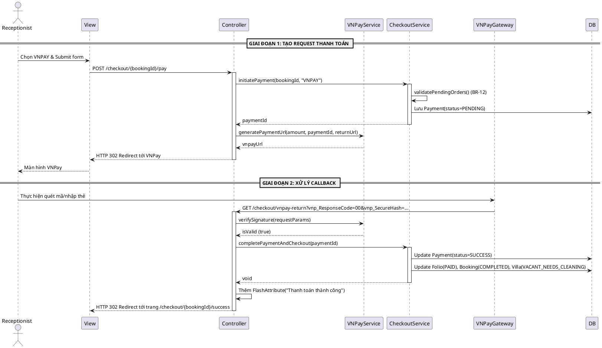

# ENGINEERING DOCUMENTATION STANDARD (EDS) v2.0
# Quy chuẩn Tài liệu Kỹ thuật và Đặc tả Hiện thực hóa

| Field | Value |
| --- | --- |
| **Document ID** | `AURA-BILLING-IMP-022` |
| **Version** | 1.2 |
| **Date** | `2026-06-09` |
| **Status** | Draft |
| **Document Owner** | Sinh viên 5 |
| **Author** | AI Assistant |
| **Reviewed by** | [Tech Lead] |
| **DPO Sign-off** | `[ ] Pending` |
| **Approved by** | `[Principal Architect]` |
| **Last Review** | `2026-06-09` |
| **Based on EDS** | v2.0 |

# CHANGELOG
> **Policy 4.4 — Immutable History:** Không bao giờ xóa thông tin cũ. Mọi thay đổi phải ghi vào bảng này.

| Ngày       | Người thực hiện | Nội dung thay đổi                                                                |
| ------------| -----------------| ----------------------------------------------------------------------------------|
| 2026-06-08 | AI Assistant    | Tạo tài liệu lần đầu cho UC22 - Process Final Payment                            |
| 2026-06-09 | AI Assistant    | Refactor sang kiến trúc Spring Boot MVC (Controller trả về View)                 |
| 2026-06-09 | AI Assistant    | Cập nhật cấu trúc Entity Payment ở phần 5.2 để khớp với mã nguồn thực tế         |
| 2026-06-09 | AI Assistant    | Thiết kế lại luồng thanh toán VNPay thành quy trình 2 bước (Redirect & Callback) |

# MỤC LỤC
1. Tổng quan Module
2. Ma trận Truy vết (Traceability Matrix)
3. Architecture Decision Records (ADR)
4. Non-Functional Requirements & SLA
5. Static Modeling (Mô hình Tĩnh)
6. Dynamic Modeling (Mô hình Động)
8. Interface Specification (Đặc tả Giao diện)
9. Web MVC Specification (Đặc tả MVC)
10. Bảng mã lỗi (Error Codes)
16. Bảng tổng hợp phân quyền (Authorization Matrix)

# 1. Tổng quan Module

> Xử lý thanh toán cuối cùng và Check-out. Hệ thống phân chia 2 luồng: Tiền mặt (Xử lý đồng bộ) và Cổng thanh toán VNPay (Xử lý bất đồng bộ qua Callback).

| Field | Value |
| --- | --- |
| **Module Name** | `Module 5: Consolidated Billing & Statistical Analysis` |
| **Bounded Context** | `Billing / Checkout` |
| **Data Classification** | `Internal / Confidential` |
| **Compliance Scope** | `N/A` |
| **Upstream Dependencies** | `Booking Module, Spa Module, F&B Module` |
| **Downstream Consumers** | `Analytics Module` |

# 2. Ma trận Truy vết (Traceability Matrix)

| Requirement ID | Loại (BR/ADR/US) | Mô tả yêu cầu | Thành phần Code | Compliance Target | ADR liên quan |
| --- | --- | --- | --- | --- | --- |
| BR-12 | Business Rule | Checkout Constraint (Không thể check-out nếu còn order Spa/F&B đang chờ) | `CheckoutService.validatePendingOrders()` | — | — |
| BR-15 | Business Rule | Audit Trail (Ghi log các hoạt động giao dịch) | `AuditLogRepository` | — | — |
| UC22 | User Story | Xử lý thanh toán cuối cùng và check-out | `CheckoutController.processPayment()` | — | ADR-001 |

# 3. Architecture Decision Records (ADR)

## ADR-001 — Phương thức tích hợp cổng thanh toán (Payment Gateway Integration)

| Field | Value |
| --- | --- |
| **Status** | Accepted |
| **Deciders** | AI Assistant, Team Lead |
| **Date** | 2026-06-09 |

**Bối cảnh (Context)**
> Tích hợp thanh toán qua VNPay. Luồng thanh toán của VNPay yêu cầu redirect người dùng sang trang của họ, sau đó gọi lại hệ thống thông qua Return URL (Callback).

**Các phương án đã xem xét (Options Considered)**

| Phương án | Mô tả | Ưu điểm | Nhược điểm |
| --- | --- | --- | --- |
| A | Sinh URL nhưng xử lý chốt đơn ngay (Synchronous giả cầy) | + Nhanh, dễ code | - Rủi ro mất tiền: Khách chưa trả tiền trên VNPay nhưng hệ thống đã Check-out. |
| B | MVC Redirect + 2-Step Asynchronous Callback | + Chặt chẽ, chuẩn xác bảo mật, chỉ Check-out khi VNPay xác nhận `vnp_ResponseCode == "00"` | - Phải code thêm endpoint xử lý Return URL, Verify Chữ ký. |

**Quyết định (Decision)**
> Chọn **Phương án B**. Phân tách Endpoint khởi tạo URL và Endpoint nhận Callback riêng biệt. Trạng thái các thực thể (GuestFolio, Booking, Villa) chỉ được cập nhật khi thanh toán thực sự thành công.

# 4. Non-Functional Requirements & SLA

| Category | Requirement | Target SLA | Measurement Method | Compliance Basis |
| --- | --- | --- | --- | --- |
| Security | Hash Verification | Bắt buộc mã hóa HMAC-SHA512 để sinh và kiểm tra `vnp_SecureHash` | Code Review | VNPay Security Standard |
| Security | API Key Protection | Cấu hình `vnp_TmnCode` và `vnp_HashSecret` phải nằm trong `application-secret.properties` và bị loại trừ bởi `.gitignore`. File chính nạp qua `spring.config.import` | Code Review | OWASP Secret Management |
| Configuration | Reverse Proxy Support | Endpoint tạo URL phải xử lý đúng `X-Forwarded-Host` và `X-Forwarded-Proto` để chạy qua Ngrok / Nginx | Integration Test | Deployment Standards |
| Consistency | Invoice & Payment sync | 100% | Database Transaction | — |

# 5. Static Modeling (Mô hình Tĩnh)

## 5.2. Data Structure (Java JPA Entity)

```java
// === BILLING ENTITY (Java JPA) ===

@Entity
@Table(name = "PAYMENT")
@Data
@NoArgsConstructor
@AllArgsConstructor
@Builder
public class Payment {

    @Id
    @GeneratedValue(strategy = GenerationType.IDENTITY)
    @Column(name = "payment_id")
    private Integer id;

    @ManyToOne(fetch = FetchType.LAZY)
    @JoinColumn(name = "folio_id")
    private GuestFolio guestFolio;

    @Column(name = "amount")
    private BigDecimal amount;

    @Column(name = "payment_method", length = 10)
    private String paymentMethod; // e.g., 'VNPAY', 'CASH'

    @Column(name = "payment_gateway", length = 10)
    private String paymentGateway; 

    @Column(name = "transaction_code", length = 100)
    private String transactionCode; // vnp_TransactionNo

    @Column(name = "payment_date")
    private LocalDateTime paymentDate;

    @Column(name = "status", length = 10)
    private String status; // 'PENDING', 'SUCCESS', 'FAILED'
}
```

# 6. Dynamic Modeling (Mô hình Động)

## 6.1. Sequence Diagram — VNPay Asynchronous Flow (PlantUML)



# 8. Interface Specification (Đặc tả Giao diện)

## 8.1. Service Interface

```java
public interface ICheckoutService {
    /**
     * Khởi tạo giao dịch (Giai đoạn 1)
     * @throws PendingOrdersExistException nếu vi phạm BR-12
     * @return Payment ID vừa được tạo với trạng thái PENDING
     */
    Integer initiatePayment(Integer bookingId, String paymentMethod, String paymentGateway);

    /**
     * Chốt giao dịch và hoàn tất Check-out (Giai đoạn 2)
     * Hàm này được @Transactional bảo vệ.
     */
    void completePaymentAndCheckout(Integer paymentId, String transactionCode);
    
    /**
     * Đánh dấu giao dịch thất bại
     */
    void markPaymentAsFailed(Integer paymentId);
}

public interface IVNPayService {
    /**
     * Tạo URL thanh toán VNPay bằng cách ghép tối thiểu 12 tham số bắt buộc (vnp_Version, vnp_Command, vnp_TmnCode, vnp_Amount...)
     * sau đó sắp xếp theo Alphabet và mã hóa HMAC-SHA512 để sinh ra vnp_SecureHash.
     */
    String createPaymentUrl(BigDecimal amount, Integer paymentId, String returnUrl);
    
    /**
     * Tách vnp_SecureHash từ request, tái mã hóa HMAC-SHA512 các tham số còn lại và so sánh.
     */
    boolean verifySignature(Map<String, String> requestParams);
}

public class VNPayConfig {
    // Chứa hàm hmacSHA512(String key, String data) và các util như hashAllFields(Map fields)
}
```

# 9. Web MVC Specification (Đặc tả MVC)

## 9.1. Endpoints Table

| Method | Path | Return Type | Chức năng |
| --- | --- | --- | --- |
| POST | `/checkout/:bookingId/pay` | `String` (Redirect) | Kiểm tra BR-12, sinh URL VNPay hoặc chốt luôn nếu CASH |
| GET | `/checkout/vnpay-return` | `String` (Redirect) | Nhận Callback từ VNPay, chốt DB và Redirect hiển thị kết quả |

## 9.2. Data Transfer (Model & Forms)

**Submit Form (Giai đoạn 1):**
```java
@PostMapping("/{bookingId}/pay")
public String processPayment(@PathVariable Integer bookingId, @RequestParam String paymentMethod, HttpServletRequest request) {
    Integer paymentId = checkoutService.initiatePayment(bookingId, paymentMethod, paymentMethod); // e.g. "VNPAY"
    
    if ("CASH".equals(paymentMethod)) {
        checkoutService.completePaymentAndCheckout(paymentId, null);
        return "redirect:/checkout/" + bookingId + "/success";
    } else if ("VNPAY".equals(paymentMethod)) {
        // Hỗ trợ Reverse Proxy (Ngrok / Nginx)
        String scheme = request.getHeader("X-Forwarded-Proto") != null ? request.getHeader("X-Forwarded-Proto") : request.getScheme();
        String host = request.getHeader("X-Forwarded-Host") != null ? request.getHeader("X-Forwarded-Host") : request.getServerName();
        String port = "";
        if (request.getHeader("X-Forwarded-Host") == null && request.getServerPort() != 80 && request.getServerPort() != 443) {
            port = ":" + request.getServerPort();
        }
        String baseUrl = scheme + "://" + host + port;
        String returnUrl = baseUrl + "/checkout/vnpay-return";
        String vnpayUrl = vnpayService.createPaymentUrl(amount, paymentId, returnUrl);
        return "redirect:" + vnpayUrl;
    }
    return "redirect:/checkout/" + bookingId;
}
```

**Callback (Giai đoạn 2):**
```java
@GetMapping("/vnpay-return")
public String vnpayReturn(@RequestParam Map<String, String> params, RedirectAttributes redirectAttributes) {
    if (vnpayService.verifySignature(params)) {
        Integer paymentId = Integer.parseInt(params.get("vnp_TxnRef"));
        if ("00".equals(params.get("vnp_ResponseCode"))) {
            checkoutService.completePaymentAndCheckout(paymentId, params.get("vnp_TransactionNo"));
            redirectAttributes.addFlashAttribute("successMessage", "Thanh toán VNPay thành công!");
            return "redirect:/checkout/success"; // Route về trang thành công
        } else {
            checkoutService.markPaymentAsFailed(paymentId);
            redirectAttributes.addFlashAttribute("errorMessage", "Thanh toán VNPay thất bại hoặc bị hủy.");
        }
    } else {
        redirectAttributes.addFlashAttribute("errorMessage", "Sai chữ ký bảo mật VNPay.");
    }
    return "redirect:/checkout/error";
}
```

# 10. Bảng mã lỗi (Error Codes)

| Tên Exception | Flash Attribute Key | Thông báo hiển thị (UI Message) | Trigger Condition |
| --- | --- | --- | --- |
| `PendingOrdersExistException` | `errorMessage` | Khách không thể check-out vì còn đơn Spa/F&B đang chờ xử lý. | Bị chặn ở Giai đoạn 1 (BR-12) |
| (VNPay Failed) | `errorMessage` | Thanh toán VNPay thất bại hoặc khách hàng hủy giao dịch. | Giai đoạn 2: `vnp_ResponseCode != 00` |
| (VNPay Signature Invalid) | `errorMessage` | Chữ ký bảo mật VNPay không hợp lệ. Giao dịch bị từ chối. | Giai đoạn 2: `verifySignature == false` |
