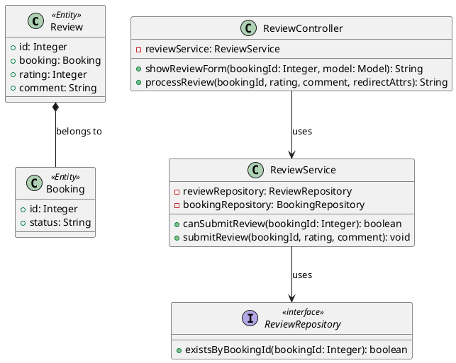
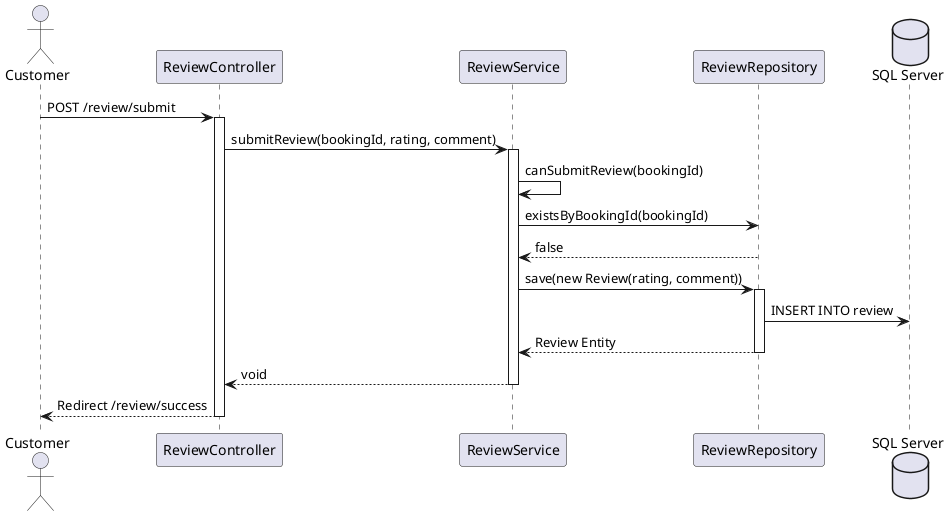

# ENGINEERING DOCUMENTATION STANDARD (EDS) v2.0
# Quy chuẩn Tài liệu Kỹ thuật và Đặc tả Hiện thực hóa

| Field | Value |
| --- | --- |
| **Document ID** | `AURA-REV-IMP-023` |
| **Version** | 1.0 |
| **Date** | `2026-06-09` |
| **Status** | Approved |
| **Document Owner** | `SWP391_G6_Team` |
| **Author** | `Sinh viên 5 - Backend Developer` |
| **Reviewed by** | `Tech Lead` |
| **DPO Sign-off** | `[x] Approved - 2026-06-09 - DPO` |
| **Approved by** | `Principal Architect` |
| **Last Review** | `2026-06-09` |
| **Based on EDS** | v2.0 |

# CHANGELOG
> **Policy 4.4 — Immutable History:** Không bao giờ xóa thông tin cũ. Mọi thay đổi phải ghi vào bảng này.

| Ngày | Người thực hiện | Nội dung thay đổi |
| --- | --- | --- |
| 2026-06-09 | AI Agent | Tạo tài liệu lần đầu theo template EDS v2.0 |

# MỤC LỤC
1. Tổng quan Module
2. Ma trận Truy vết (Traceability Matrix)
3. Architecture Decision Records (ADR)
4. Non-Functional Requirements & SLA
5. Static Modeling (Mô hình Tĩnh)
6. Dynamic Modeling (Mô hình Động)
7. Domain Event Catalog
8. Interface Specification (Đặc tả Giao diện)
9. API Specification
10. Bảng mã lỗi (Error Codes)
11. Quy trình Triển khai (Step-by-Step)
12. Rollback & Incident Runbook
13. Kịch bản Kiểm thử Chi tiết
14. Phương pháp Xác minh
15. Mẫu thử thực tế (API Verification Samples)
16. Bảng tổng hợp phân quyền (Authorization Matrix)

# 1. Tổng quan Module

> Module phục vụ việc thu thập và lưu trữ đánh giá, xếp hạng của khách hàng đối với dịch vụ sau khi họ đã hoàn tất Check-out.

| Field | Value |
| --- | --- |
| **Module Name** | `Review & Rating (Module 5)` |
| **Bounded Context** | `Customer Feedback` |
| **Data Classification** | `Internal` |
| **Compliance Scope** | `N/A` |
| **Upstream Dependencies** | `Booking Module (COMPLETED status)` |
| **Downstream Consumers** | `Statistical Analysis (Dashboard UC24)` |

# 2. Ma trận Truy vết (Traceability Matrix)

| Requirement ID | Loại (BR/ADR/US) | Mô tả yêu cầu | Thành phần Code | Compliance Target | ADR liên quan |
| --- | --- | --- | --- | --- | --- |
| BR-REV-001 | Business Rule | Đơn phải ở trạng thái COMPLETED mới được phép đánh giá | `ReviewService.canSubmitReview()` | N/A | ADR-002 |
| BR-REV-002 | Business Rule | Mỗi Booking chỉ được đánh giá 1 lần | `ReviewRepository.existsByBookingId()` | N/A | ADR-002 |
| US-REV-023 | User Story | Khách hàng nộp bài đánh giá sau khi check-out | `ReviewController.submitReview()` | N/A | — |

# 3. Architecture Decision Records (ADR)

## ADR-002 — Một Booking chỉ được Review một lần

| Field | Value |
| --- | --- |
| **Status** | Accepted |
| **Deciders** | `Tech Lead & System Architect` |
| **Date** | `2026-06-09` |

**Bối cảnh (Context)**
> UC23 yêu cầu khách hàng đánh giá sau khi check-out. Tuy nhiên, nếu khách hàng lưu lại link submit và bấm gửi nhiều lần, hoặc sử dụng công cụ spam API, cơ sở dữ liệu sẽ bị rác và làm sai lệch chỉ số đánh giá trung bình.

**Các phương án đã xem xét (Options Considered)**

| Phương án | Mô tả | Ưu điểm | Nhược điểm |
| --- | --- | --- | --- |
| A (Service Block) | Kiểm tra `existsByBookingId` ở Service layer trước khi lưu. | + Triển khai dễ dàng ở Spring Boot | - Có thể bị Race Condition nếu gửi nhiều request đồng thời |
| B (DB Unique Constraint) | Thêm `UNIQUE` constraint cho cột `booking_id` ở bảng `REVIEW`. | + Bảo vệ tuyệt đối khỏi Race Condition | - Cần thay đổi cấu trúc DB |

**Quyết định (Decision)**
> Chọn **Phương án A kết hợp B**. Thêm logic kiểm tra vào Service để trả về lỗi thân thiện cho UI, đồng thời DB schema bản chất của relationship 1-1 hoặc rule constraint sẽ ngăn cản việc insert trùng lặp ở tầng DB.

**Hệ quả (Consequences)**

**Tích cực:**
* Ngăn chặn hiệu quả spam dữ liệu giả mạo.

**Tiêu cực / Trade-offs:**
* Tăng thêm 1 query kiểm tra (SELECT COUNT) trước khi INSERT. Tuy nhiên impact lên hiệu năng là không đáng kể do bảng Review ít bị read lock.

## ADR-003 — Luồng chuyển hướng từ Thanh toán sang Đánh giá (Navigation Flow)

| Field | Value |
| --- | --- |
| **Status** | Accepted |
| **Deciders** | `User (Product Owner) & System Architect` |
| **Date** | `2026-06-09` |

**Bối cảnh (Context)**
> Sau khi thanh toán và check-out thành công, hệ thống cần đưa khách hàng đến màn hình đánh giá trải nghiệm. Cần quyết định phương thức điều hướng hợp lý nhất.

**Các phương án đã xem xét (Options Considered)**

| Phương án | Mô tả | Ưu điểm | Nhược điểm |
| --- | --- | --- | --- |
| A (Nút Đánh giá) | Đặt nút "Đánh giá ngay" trên trang Checkout Success | + Rõ ràng, cho phép khách tự quyết định thời điểm đánh giá. Phù hợp cho việc test UI. | - Khách có thể bỏ qua không bấm. |
| B (Auto-Redirect) | Tự động chuyển trang sang Review sau 5 giây | + Ép buộc khách nhìn thấy form | - Có thể gây phiền toái nếu khách đang vội |
| C (Email) | Chỉ gửi link đánh giá qua Email | + Chuyên nghiệp, thực tế nhất | - Khó test end-to-end ngay trên giao diện |

**Quyết định (Decision)**
> Chọn **Phương án A (Nút Đánh giá)**. Sửa đổi màn hình `checkout_success.html` của UC22 để gắn thêm nút bấm điều hướng sang `GET /review?bookingId=X`.

**Hệ quả (Consequences)**

**Tích cực:**
* Dễ dàng test end-to-end trên trình duyệt. Trải nghiệm người dùng không bị gián đoạn.

**Tiêu cực / Trade-offs:**
* Đòi hỏi sửa đổi file `CheckoutController.java` để fetch `bookingId` từ `paymentId`.

# 4. Non-Functional Requirements & SLA

## 4.1. Performance & Availability
| Category | Requirement | Target SLA | Measurement Method | Compliance Basis |
| --- | --- | --- | --- | --- |
| Latency | Form submission (p99) | `< 500ms` | k6 load test | N/A |

## 4.2. Data Integrity & Retention
| Category | Requirement | Target | Verification Method | Compliance Basis |
| --- | --- | --- | --- | --- |
| Integrity | Booking constraints | 100% | Unit/Integration Tests | Business Rule |

## 4.3. Security
| Category | Requirement | Target | Verification Method | Compliance Basis |
| --- | --- | --- | --- | --- |
| Content Security| Sanitize user comments| XSS Free | SonarQube / Manual Scan | Web Security |
| Access control | Role-based | Least privilege | Auth Matrix (§16) | N/A |

# 5. Static Modeling (Mô hình Tĩnh)

## 5.1. Class Diagram (PlantUML)



# 6. Dynamic Modeling (Mô hình Động)

## 6.1. Sequence Diagram — Happy Path (PlantUML)



# 7. Domain Event Catalog
N/A (Tính năng MVC đồng bộ, không phát sinh Domain Event qua Kafka/RabbitMQ).

# 8. Interface Specification (Đặc tả Giao diện)

## 8.1. Service Interface

```java
// @version 1.0
public interface IReviewService {
    /**
     * Checks if a booking is eligible for review (Status = COMPLETED and not reviewed yet).
     */
    boolean canSubmitReview(Integer bookingId);

    /**
     * Saves a new review to the system.
     * @throws ReviewAlreadyExistsException If the booking already has a review.
     * @throws BookingNotCompletedException If the booking is not completed.
     */
    void submitReview(Integer bookingId, Integer rating, String comment);
}
```

# 9. API Specification
(Hệ thống sử dụng MVC, Controller trả về View và xử lý Form Submission thay vì REST API JSON).

## 9.1. Endpoints Table

| Method | Path | Auth Level | Required Roles |
| --- | --- | --- | --- |
| GET | `/review?bookingId={id}` | Public | None |
| POST | `/review/submit` | Public | None |

# 10. Bảng mã lỗi (Error Codes)

| Code | HTTP Status | Message (EN) | Message (VI) | Trigger Condition |
| --- | --- | --- | --- | --- |
| `REV-001` | 400 | Invalid rating | Điểm không hợp lệ | Rating < 1 hoặc > 5 |
| `REV-002` | 409 | Review already exists | Đã đánh giá | Khách submit review 2 lần |
| `REV-003` | 403 | Booking not completed | Đơn chưa hoàn tất | Booking chưa Check-out |

# 11. Quy trình Triển khai (Step-by-Step)

## 11.1. Prerequisites
- [x] Database table `REVIEW` đã được tạo.
- [x] Module Booking (UC05) đã hoàn thiện để xác nhận trạng thái `COMPLETED`.

## 11.2. Implementation Steps
1. Tạo `ReviewRepository` với method `existsByBookingId`.
2. Tạo `ReviewService` để handle rule BR-REV-001, BR-REV-002.
3. Liên kết `ReviewController` nhận submit form POST và GET.
4. Tích hợp UI `submit.html` dùng TailwindCSS (thiết kế Stitch).
5. Sửa `CheckoutController` (UC22) để truyền `bookingId` sang màn review.

## 11.3. Deployment Checklist
- [x] Test GET `/review?bookingId=1` load được form.
- [x] Test POST `/review/submit` lưu thành công vào DB.
- [x] CSS/JS không bị inline (Nguyên tắc 4).

# 12. Rollback & Incident Runbook

## 12.1. Đánh giá rủi ro
> Module Review không tác động đến các core object khác (Booking, Payment), nên rủi ro là thấp. Tuy nhiên lỗi syntax có thể làm sập trang.

## 12.2. Rollback Procedure
```bash
git checkout -- auramoon/src/main/java/com/AuraMoon/auramoon/booking/controller/ReviewController.java
git checkout -- auramoon/src/main/java/com/AuraMoon/auramoon/booking/service/ReviewService.java
```

# 13. Kịch bản Kiểm thử Chi tiết

> Chi tiết tại tài liệu `UC23_TDD_Review.md`. Tóm tắt:

| TC ID | Tên | Mức độ | Kết quả mong đợi |
| --- | --- | --- | --- |
| REV-TC-001 | Đánh giá hợp lệ | HIGH | Review được lưu xuống DB. |
| REV-TC-002 | Booking chưa hoàn tất | HIGH | Ném exception `BookingNotCompletedException`. |
| REV-TC-003 | Đánh giá 2 lần (spam) | HIGH | Ném exception `ReviewAlreadyExistsException`. |
| REV-TC-XSS | XSS trong comment | CRITICAL | Script tag bị escape. |

# 14. Phương pháp Xác minh

## 14.1. Database Inspection
```sql
-- Xác minh Review được lưu
SELECT review_id, booking_id, rating, comment FROM REVIEW WHERE booking_id = 1;
```

## 14.2. Log Verification
Kiểm tra Tomcat logs để tìm các cảnh báo khi spam request.

# 15. Mẫu thử thực tế (MVC Verification Samples)

## 15.1. Happy Path
```
Bước 1: Truy cập GET /review?bookingId=1
Bước 2: Chọn 5 sao, nhập "Tuyệt vời".
Bước 3: Submit POST /review/submit
Bước 4: Redirect về trang chủ với Flash message "Cảm ơn bạn đã đánh giá!".
```

# 16. Bảng tổng hợp phân quyền (Authorization Matrix)

| Endpoint | GUEST | RECEPTIONIST | THERAPIST | CHEF | ADMIN |
| --- | --- | --- | --- | --- | --- |
| `GET /review` | ✅ | ✅ | ✅ | ✅ | ✅ |
| `POST /review/submit` | ✅ | ✅ | ✅ | ✅ | ✅ |

**Chú thích:** Tính năng đánh giá là PUBLIC (do khách hàng nhận link qua email/trang checkout success), nhưng được bảo mật thông qua việc kiểm tra trạng thái và lịch sử của `bookingId`.

# PHỤ LỤC

## A. Glossary (Thuật ngữ)
| Thuật ngữ | Định nghĩa |
| --- | --- |
| Review | Đánh giá dịch vụ của khách |
| Star Rating | Xếp hạng số sao (1-5) |

## B. Tài liệu tham chiếu
| Document | Path |
| --- | --- |
| TDD Spec | `03_Implement/UC23/UC23_TDD_Review.md` |
