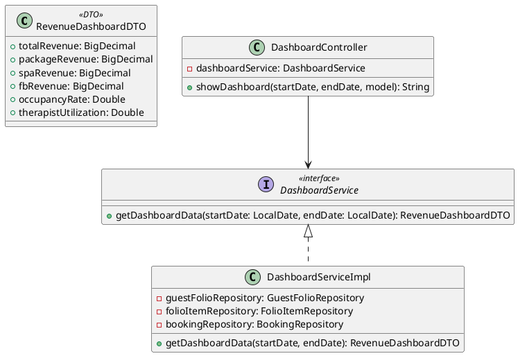

# ENGINEERING DOCUMENTATION STANDARD (EDS) v2.0
# Quy chuẩn Tài liệu Kỹ thuật và Đặc tả Hiện thực hóa

| Field | Value |
| --- | --- |
| **Document ID** | `AURA-DASH-IMP-024` |
| **Version** | 1.0 |
| **Date** | `2026-06-10` |
| **Status** | Approved |
| **Document Owner** | `SWP391 - Group 6` |
| **Author** | `AI Assistant - Backend Developer` |
| **Reviewed by** | `User Tech Lead` |
| **DPO Sign-off** | `[x] Approved - N/A (No PII)` |
| **Approved by** | `User Principal Architect` |
| **Last Review** | `2026-06-10` |
| **Based on EDS** | v2.0 |

# CHANGELOG

| Ngày | Người thực hiện | Nội dung thay đổi |
| --- | --- | --- |
| 2026-06-10 | AI Assistant | Tạo tài liệu lần đầu - Đặc tả UC24 Dashboard |

# 1. Tổng quan Module

> Bảng điều khiển Doanh thu (Revenue Dashboard) cung cấp cái nhìn toàn cảnh về tình hình kinh doanh của khu nghỉ dưỡng. Module tổng hợp dữ liệu từ Hệ thống đặt phòng (Booking) và Hóa đơn (Billing) để hiển thị doanh thu theo các mảng: Gói Retreat, Spa, và F&B.

| Field | Value |
| --- | --- |
| **Module Name** | `Dashboard & Analytics` |
| **Bounded Context** | `Reporting` |
| **Data Classification** | `Internal / Confidential` |
| **Compliance Scope** | `N/A` |
| **Upstream Dependencies** | `Billing Module, Booking Module` |
| **Downstream Consumers** | `Manager UI` |

# 2. Ma trận Truy vết (Traceability Matrix)

| Requirement ID | Loại (BR/ADR/US) | Mô tả yêu cầu | Thành phần Code | Compliance Target |
| --- | --- | --- | --- | --- |
| UC24 | User Story | Manager muốn xem Revenue Dashboard chia theo Retreat, Spa, F&B | `DashboardController.java` | — |
| BR-13 | Business Rule | Chỉ lấy doanh thu từ các giao dịch đã hoàn tất (COMPLETED/PAID) | `DashboardServiceImpl.java` | Báo cáo tài chính |

# 3. Architecture Decision Records (ADR)

## ADR-024 — Tách biệt DTO cho Dashboard

| Field | Value |
| --- | --- |
| **Status** | Accepted |
| **Deciders** | `Tech Lead, AI Assistant` |
| **Date** | `2026-06-10` |

**Bối cảnh (Context)**
Trang Dashboard cần hiển thị rất nhiều chỉ số tổng hợp. Việc ném nguyên Entity ra ngoài view là sai nguyên tắc và làm lộ cấu trúc DB, đồng thời khó serialize thành dạng chuẩn bị cho biểu đồ.

**Quyết định (Decision)**
Tạo mới class `RevenueDashboardDTO` chuyên biệt chỉ chứa các field: totalRevenue, spaRevenue, fbRevenue, packageRevenue, occupancyRate, therapistUtilization.

**Hệ quả (Consequences)**
**Tích cực:** View (Thymeleaf) chỉ cần đọc dữ liệu chuẩn bị sẵn, không chứa logic tính toán.

# 4. Non-Functional Requirements & SLA

| Category | Requirement | Target SLA | Measurement Method | Compliance Basis |
| --- | --- | --- | --- | --- |
| Latency | Báo cáo load nhanh | `< 1000ms` | APM / Browser logs | — |
| Security | Chỉ Manager được truy cập | RBAC (Manager Role) | Auth Interceptor | An toàn thông tin |

# 5. Static Modeling (Mô hình Tĩnh)

## 5.1. Class Diagram



# 8. Interface Specification (Đặc tả Giao diện)

## 8.1. Service Interface

```java
package com.AuraMoon.auramoon.dashboard.service;

import com.AuraMoon.auramoon.dashboard.dto.RevenueDashboardDTO;
import java.time.LocalDate;

public interface DashboardService {
    /**
     * Tổng hợp dữ liệu doanh thu và hiệu suất cho Manager Dashboard
     * Chỉ tính các hóa đơn có trạng thái PAID (BR-13)
     */
    RevenueDashboardDTO getDashboardData(LocalDate startDate, LocalDate endDate);
}
```

# 16. Bảng tổng hợp phân quyền (Authorization Matrix)

| Endpoint | GUEST | RECEPTIONIST | SPA_THERAPIST | MANAGER |
| --- | --- | --- | --- | --- |
| `GET /manager/dashboard` | ❌ | ❌ | ❌ | ✅ All |
