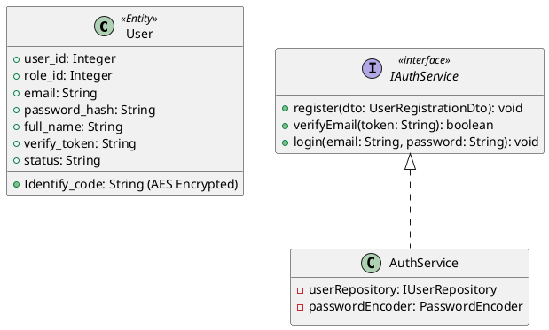
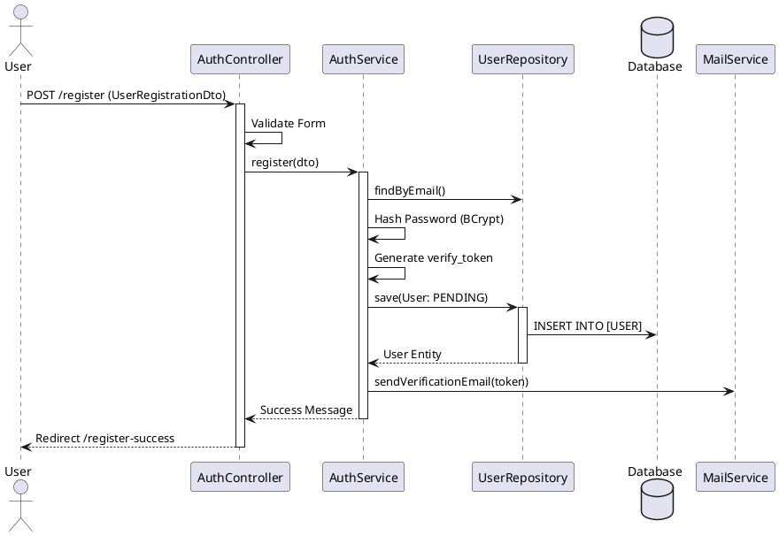

# ENGINEERING DOCUMENTATION STANDARD (EDS) v2.0

# Quy chuẩn Tài liệu Kỹ thuật và Đặc tả Hiện thực hóa - UC1 Đăng ký & Đăng nhập

| Field                    | Value                     |
| ------------------------ | ------------------------- |
| **Document ID**    | `SWP391-MOD1-IMP-UC01`  |
| **Version**        | 1.0                       |
| **Date**           | `2026-06-14`            |
| **Status**         | Approve                   |
| **Document Owner** | `Nhóm Phát Triển G6` |
| **Author**         | NgocNM                    |
| **Reviewed by**    | `[Tech Lead]`           |
| **DPO Sign-off**   | `[ ] Pending`           |
| **Approved by**    | `[Principal Architect]` |
| **Last Review**    | `2026-06-14`            |
| **Based on EDS**   | v2.0                      |

# CHANGELOG

> **Policy 4.4 — Immutable History:** Không bao giờ xóa thông tin cũ. Mọi thay đổi phải ghi vào bảng này.

| Ngày      | Người thực hiện      | Nội dung thay đổi                      |
| ---------- | ------------------------ | ----------------------------------------- |
| 2026-06-14 | Senior Software Engineer | Tạo tài liệu lần đầu, đặc tả UC1 |

# MỤC LỤC

1. Tổng quan Module
2. Ma trận Truy vết (Traceability Matrix)
3. Architecture Decision Records (ADR)
4. Non-Functional Requirements & SLA
5. Static Modeling (Mô hình Tĩnh)
6. Dynamic Modeling (Mô hình Động)
7. Domain Event Catalog
8. Interface Specification (Đặc tả Giao diện)
9. Endpoints & View Specification
10. Bảng mã lỗi (Error Codes)
11. Quy trình Triển khai (Step-by-Step)
12. Rollback & Incident Runbook
13. Kịch bản Kiểm thử Chi tiết
14. Phương pháp Xác minh
15. Mẫu thử thực tế (API Verification Samples)
16. Bảng tổng hợp phân quyền (Authorization Matrix)

# 1. Tổng quan Module

> Mô tả ngắn gọn mục đích của module, phạm vi nghiệp vụ và lý do tồn tại.

| Field                           | Value                                                      |
| ------------------------------- | ---------------------------------------------------------- |
| **Module Name**           | `Authentication & Sensitive Health Profile`              |
| **Bounded Context**       | `Identity & Access Management (IAM)`                     |
| **Data Classification**   | `PII / Sensitive-PII`                                    |
| **Compliance Scope**      | `Nghị định 356/2025/NĐ-CP, Luật Cư trú năm 2020` |
| **Upstream Dependencies** | `N/A`                                                    |
| **Downstream Consumers**  | `Toàn bộ các module khác của hệ thống`            |

# 2. Ma trận Truy vết (Traceability Matrix)

| Requirement ID | Loại (BR/ADR/US) | Mô tả yêu cầu                                                               | Thành phần Code             | Compliance Target              | ADR liên quan |
| -------------- | ----------------- | ------------------------------------------------------------------------------- | ----------------------------- | ------------------------------ | -------------- |
| BR-UC1-001     | Business Rule     | Đăng ký truyền thống (Email, Tên, Mật khẩu), băm BCrypt.               | `AuthService.register()`    | Bảo vệ thông tin danh tính | ADR-001        |
| BR-UC1-002     | Business Rule     | Sinh `verify_token`, gửi email xác thực, kích hoạt (Active) tài khoản. | `AuthService.verifyEmail()` | Xác minh email sở hữu       | -              |
| BR-UC1-003     | Business Rule     | Đăng nhập Google SSO (auto tạo TK với role GUEST nếu email mới).         | `OAuth2LoginSuccessHandler` | -                              | ADR-002        |

# 3. Architecture Decision Records (ADR)

## ADR-001 — Sử dụng thuật toán BCrypt để băm mật khẩu

| Field              | Value          |
| ------------------ | -------------- |
| **Status**   | Accepted       |
| **Deciders** | NgocNM         |
| **Date**     | `2026-06-14` |

**Bối cảnh (Context)**

> Cần một cơ chế an toàn để lưu trữ mật khẩu người dùng, không thể giải mã ngược lại, chống lại các cuộc tấn công Brute-force và Rainbow Table.

**Quyết định (Decision)**

> Chọn **BCrypt** thông qua `BCryptPasswordEncoder` của Spring Security vì thuật toán này tích hợp sẵn Work Factor (salt ngẫu nhiên và chi phí băm), giúp tăng độ trễ để chống Brute-force hiệu quả.

**Hệ quả (Consequences)**
**Tích cực:** Tích hợp tốt với Spring Security, độ an toàn cao.
**Tiêu cực:** Mất một chút chi phí CPU khi người dùng đăng nhập.

## ADR-002 — Sử dụng Spring MVC + Thymeleaf thay vì REST API thuần

| Field              | Value          |
| ------------------ | -------------- |
| **Status**   | Accepted       |
| **Deciders** | NgocNM         |
| **Date**     | `2026-06-14` |

**Bối cảnh (Context)**

> Theo yêu cầu hệ thống thiết kế dạng Spring Boot MVC với Thymeleaf HTML trực tiếp, không chia rẽ hoàn toàn backend API và frontend riêng biệt.

**Quyết định (Decision)**

> Hệ thống Auth sẽ sử dụng MVC Controllers trả về HTML views thay vì REST API JSON. Form submission truyền thống qua POST.

**Hệ quả (Consequences)**
**Tích cực:** Render nhanh phía server, dễ quản lý session truyền thống. SEO tốt hơn.
**Tiêu cực:** Tương tác phía client (UI UX) sẽ theo dạng tải lại trang (reload) thay vì SPA (Single Page Application).

# 4. Non-Functional Requirements & SLA

## 4.1. Performance & Availability

| Category     | Requirement              | Target SLA  | Measurement Method | Compliance Basis |
| ------------ | ------------------------ | ----------- | ------------------ | ---------------- |
| Latency      | Form submission response | `< 500ms` | APM / Logs         | —               |
| Availability | Uptime (monthly)         | `99.9%`   | Uptime monitor     | —               |

## 4.2. Security

| Category              | Requirement     | Target   | Verification Method | Compliance Basis    |
| --------------------- | --------------- | -------- | ------------------- | ------------------- |
| Password Storage      | Băm mật khẩu | BCrypt   | Kiểm tra Database  | Best Practice       |
| Identify Storage      | CCCD/Hộ chiếu | AES-256  | JPA Converter Check | NĐ 356/2025/NĐ-CP |
| Encryption in transit | All endpoints   | TLS 1.2+ | SSL Labs scan       | Best Practice       |

# 5. Static Modeling (Mô hình Tĩnh)

## 5.1. Class Diagram (PlantUML)



## 5.2. Data Structure (JPA Entity Mapping)

```java
@Entity
@Table(name = "[USER]")
@Data
public class User {
    @Id
    @GeneratedValue(strategy = GenerationType.IDENTITY)
    @Column(name = "user_id")
    private Integer userId;

    @Column(name = "role_id")
    private Integer roleId;

    @Column(name = "email", unique = true, nullable = false)
    private String email;

    @Column(name = "password_hash")
    private String passwordHash;

    @Column(name = "full_name")
    private String fullName;

    // CCCD/Hộ chiếu - Thông tin PII cần mã hóa
    @Convert(converter = AesDataEncryptor.class)
    @Column(name = "Identify_code")
    private String identifyCode;

    @Column(name = "verify_token")
    private String verifyToken;

    // Trạng thái: PENDING, ACTIVE
    @Column(name = "status")
    private String status;
}
```

# 6. Dynamic Modeling (Mô hình Động)

## 6.1. Sequence Diagram — Đăng ký (Happy Path)



# 7. Domain Event Catalog

## 7.1. Events Published (Phát ra)

| Event Name              | Trigger                               | Publisher       | Subscriber(s)       | Payload Schema            | Async? |
| ----------------------- | ------------------------------------- | --------------- | ------------------- | ------------------------- | ------ |
| `UserRegisteredEvent` | Khi user mới đăng ký thành công | `AuthService` | `MailService`     | `{email, verify_token}` | Yes    |
| `UserActivatedEvent`  | Khi user click link xác thực email  | `AuthService` | `AuditLogService` | `{user_id, email}`      | Yes    |

# 8. Interface Specification (Đặc tả Giao diện)

## 8.1. Service Interface

```java
// IAuthService.java
// @version 1.0

public interface IAuthService {
    /**
     * Xử lý đăng ký tài khoản mới truyền thống
     * @throws UserAlreadyExistsException nếu email đã tồn tại
     */
    void register(UserRegistrationDto dto);

    /**
     * Xác thực email thông qua token
     * @return true nếu thành công, false nếu token sai hoặc hết hạn
     */
    boolean verifyEmail(String token);
}
```

# 9. Endpoints & View Specification

Thay vì API thuần túy, hệ thống sử dụng Spring MVC trả về view:

| Method | Path                             | Auth Level | Role               | Action                            | Trả về (View / Redirect)                |
| ------ | -------------------------------- | ---------- | ------------------ | --------------------------------- | ----------------------------------------- |
| GET    | `/login`                       | Public     | Mọi đối tượng | Hiển thị form đăng nhập      | View:`auth/login.html`                  |
| POST   | `/login`                       | Public     | Mọi đối tượng | Xử lý đăng nhập (Spring Sec) | Redirect `/home` hoặc `/login?error` |
| GET    | `/register`                    | Public     | Mọi đối tượng | Hiển thị form đăng ký        | View:`auth/register.html`               |
| POST   | `/register`                    | Public     | Mọi đối tượng | Xử lý đăng ký                | Redirect `/login?registered=true`       |
| GET    | `/verify-email`                | Public     | Mọi đối tượng | Xử lý kích hoạt tài khoản   | Redirect `/login?verified=true`         |
| GET    | `/oauth2/authorization/google` | Public     | Mọi đối tượng | Kích hoạt Google SSO            | Redirect Google Login                     |

# 10. Bảng mã lỗi (Error Codes)

| Code         | HTTP / View Error  | Message (EN)         | Message (VI)                 | Trigger Condition                       |
| ------------ | ------------------ | -------------------- | ---------------------------- | --------------------------------------- |
| `AUTH-001` | Form Binding Error | Validation failed    | Dữ liệu không hợp lệ    | Email sai định dạng, Pass quá ngắn |
| `AUTH-002` | Custom Error       | Email already exists | Email đã tồn tại         | Đăng ký với email cũ               |
| `AUTH-003` | Spring Sec Error   | Bad credentials      | Sai thông tin đăng nhập  | Login sai email / pass                  |
| `AUTH-004` | Custom Error       | Account is pending   | Tài khoản chưa xác thực | Chưa click link email                  |

# 11. Quy trình Triển khai (Step-by-Step)

## 11.1. Prerequisites

- [X] Đã cấu hình Oauth2 Client ID và Secret trong `application.properties`
- [X] Đã thiết lập Mail Server (SMTP) để gửi email xác thực

# 12. Rollback & Incident Runbook

## 12.1. Điều kiện kích hoạt Rollback

| Điều kiện                | Ngưỡng                             | Người quyết định |
| --------------------------- | ------------------------------------ | --------------------- |
| Lỗi gửi email hàng loạt | > 10% đăng ký bị fail gửi email | On-call Engineer      |
| Login Google SSO sập       | Liên tục báo lỗi 500 từ Google  | On-call Engineer      |

# 13. Kịch bản Kiểm thử Chi tiết

## 13.1. E2E / Security Tests

### TC-E2E-001 — Đăng ký và Kích hoạt

```text
Feature: Đăng ký thành viên
  Scenario: Đăng ký luồng truyền thống
    Given form đăng ký được điền đầy đủ thông tin hợp lệ
    When submit form POST /register
    Then hệ thống tạo record trong bảng [USER] với status=PENDING
    And hệ thống gửi email kèm verify_token
    When truy cập link GET /verify-email?token=...
    Then status trong database cập nhật thành ACTIVE
```

# 14. Phương pháp Xác minh

## 14.1. Database Inspection

```sql
-- Verify user được tạo với status Pending và password bị mã hóa BCrypt
SELECT user_id, email, password_hash, status, verify_token 
FROM [USER] WHERE email = 'test@example.com';
```

# 15. Bảng tổng hợp phân quyền (Authorization Matrix)

| Endpoint                                        | GUEST | USER | ADMIN | DPO |
| ----------------------------------------------- | ----- | ---- | ----- | --- |
| `GET /login`, `/register`                   | ✅    | ❌   | ❌    | ❌  |
| `POST /register`                              | ✅    | ❌   | ❌    | ❌  |
| Truy cập trang được bảo vệ (`/profile`) | ❌    | ✅   | ✅    | ✅  |

> Tài liệu đặc tả hiện thực hóa dành riêng cho UC1 - Phân hệ Authentication.
