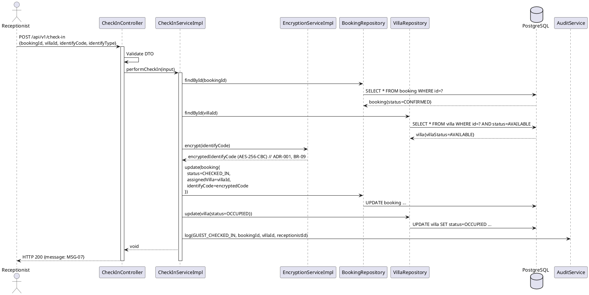
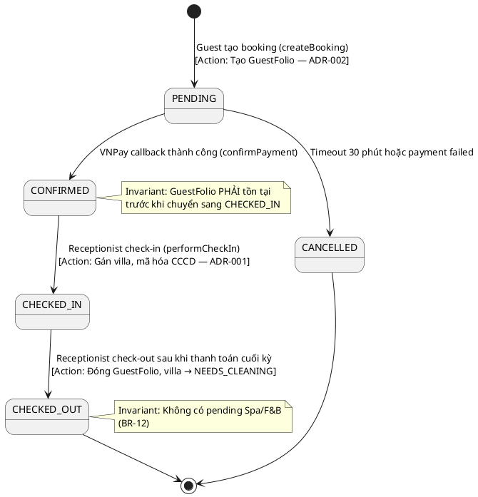

# ENGINEERING DOCUMENTATION STANDARD (EDS) v2.0
# Quy chuẩn Tài liệu Kỹ thuật và Đặc tả Hiện thực hóa

| Field | Value |
| --- | --- |
| **Document ID** | `AURAMOON-BOOKING-IMP-002` |
| **Version** | 2.0 |
| **Date** | `2026-06-15` |
| **Status** | Approved |
| **Document Owner** | `Lê Trà My — Module 2 Lead` |
| **Author** | `Lê Trà My + Phùng Giang Hải` |
| **Reviewed by** | `Phùng Giang Hải — Tech Lead` |
| **DPO Sign-off** | `[x] Approved - 2026-06-15 - Phùng Giang Hải` *(bắt buộc với module PII)* |
| **Approved by** | `Principal Architect` |
| **Last Review** | `2026-06-15` |
| **Based on EDS** | v2.0 |

# CHANGELOG
> **Policy 4.4 — Immutable History:** Không bao giờ xóa thông tin cũ. Mọi thay đổi phải ghi vào bảng này.

| Ngày | Người thực hiện | Nội dung thay đổi |
| --- | --- | --- |
| 2026-06-15 | Lê Trà My — Module 2 Lead | Tạo tài liệu lần đầu (EDS v1.0) |
| 2026-06-15 | Lê Trà My — Module 2 Lead | Refactor theo EDS v2.0: Bổ sung ADR, NFR/SLA, Domain Event Catalog, Rollback Runbook, mở rộng Test Scenarios và Authorization Matrix |

# MỤC LỤC
1. Tổng quan Module
2. Ma trận Truy vết (Traceability Matrix)
3. Architecture Decision Records (ADR) ⭐️ *Mới*
4. Non-Functional Requirements & SLA ⭐️ *Mới*
5. Static Modeling (Mô hình Tĩnh)
6. Dynamic Modeling (Mô hình Động)
7. Domain Event Catalog ⭐️ *Mới*
8. Interface Specification (Đặc tả Giao diện)
9. API Specification
10. Bảng mã lỗi (Error Codes)
11. Quy trình Triển khai (Step-by-Step)
12. Rollback & Incident Runbook ⭐️ *Mới*
13. Kịch bản Kiểm thử Chi tiết
14. Phương pháp Xác minh
15. Mẫu thử thực tế (API Verification Samples)
16. Bảng tổng hợp phân quyền (Authorization Matrix)

# 1. Tổng quan Module

> Module 2 xử lý toàn bộ luồng nghiệp vụ cốt lõi của hệ thống **Xoai Aura Retreat**: từ khi khách duyệt và đặt gói nghỉ dưỡng, thanh toán đặt cọc qua cổng VNPay, đến khi lễ tân thực hiện check-in và gán phòng biệt thự, cũng như quản lý lộ trình (Itinerary) và trạng thái villa trong suốt kỳ lưu trú.

| Field | Value |
| --- | --- |
| **Module Name** | `Retreat Package & Accommodation Booking` |
| **Bounded Context** | `booking` |
| **Data Classification** | `PII / Sensitive-PII` (Thông tin định danh CCCD/Passport là Sensitive-PII) |
| **Compliance Scope** | `Luật Cư trú 2020 (Việt Nam) / Nghị định 356/2025/NĐ-CP (Bảo vệ dữ liệu cá nhân)` |
| **Upstream Dependencies** | `auth` (Xác thực tài khoản và phân quyền — Module 1) |
| **Downstream Consumers** | `spa` (Lên lịch trị liệu — Module 3), `fnb` (Lọc thực đơn dị ứng — Module 4), `billing` (Hóa đơn phòng — Guest Folio) |

# 2. Ma trận Truy vết (Traceability Matrix)

> Ánh xạ trực tiếp: [Mã yêu cầu] → [Thành phần Code] → [Mục tiêu Tuân thủ].
> **Policy:** Không viết code nếu không biết code đó phục vụ Rule nào.

| Requirement ID | Loại (BR/ADR/US) | Mô tả yêu cầu | Thành phần Code | Compliance Target | ADR liên quan |
| --- | --- | --- | --- | --- | --- |
| **UC-06** | User Story | Khách duyệt và lọc gói nghỉ dưỡng theo mục tiêu (Detox, Yoga, Stress Relief, Weight Loss) | `RetreatPackageController.GET /packages` → `RetreatPackageServiceImpl.getPackages()` | GWI Wellness Taxonomy | — |
| **UC-07** | User Story | Đặt gói trị liệu trực tuyến, chọn VillaType, thanh toán đặt cọc qua VNPay | `BookingController.POST /bookings` → `BookingServiceImpl.createBooking()` | VNPay Sandbox integration | ADR-002 |
| **UC-08** | User Story | Check-in: gán phòng biệt thự vật lý, thu thập và mã hóa CCCD/Passport cho khai báo tạm trú | `CheckInController.POST /check-in` → `CheckInServiceImpl.performCheckIn()` | Luật Cư trú 2020 | ADR-001 |
| **UC-09** | User Story | Quản lý trạng thái biệt thự vật lý (Available, Occupied, Needs Cleaning, Maintenance) | `VillaController.PATCH /villas/{id}/status` → `VillaServiceImpl.updateVillaStatus()` | PMS operational tracking | — |
| **UC-10** | User Story | Hiển thị lộ trình Itinerary tổng hợp (Spa, F&B, Yoga) theo từng ngày | `ItineraryController.GET /bookings/{id}/itinerary` → `ItineraryServiceImpl.getItinerary()` | Guest experience mapping | — |
| **UC-23** | User Story | Khách gửi đánh giá và xếp hạng sau khi hoàn thành kỳ nghỉ (chỉ khi booking đã Completed) | `ReviewController.POST /reviews` → `ReviewServiceImpl.submitReview()` | BR-13 (Reporting & Review Logic) | — |
| **BR-01** | Business Rule | Booking chỉ được xác nhận sau khi hệ thống nhận kết quả thanh toán đặt cọc thành công từ VNPay | `BookingServiceImpl.confirmPayment()` | VNPay payment callback | ADR-002 |
| **BR-02** | Business Rule | Khách chỉ chọn VillaType khi đặt phòng; Villa cụ thể được Receptionist gán lúc check-in | `BookingServiceImpl.createBooking()`, `CheckInServiceImpl.performCheckIn()` | Hotel PMS best practice | ADR-002 |
| **BR-03** | Business Rule | Villa không được gán cho >1 booking cùng thời điểm; Villa Maintenance không được phân bổ | `VillaServiceImpl.checkAvailability()` | Hotel operations constraint | — |
| **BR-09** | Business Rule | Mã hóa AES-256 thông tin CCCD/Passport trước khi lưu vào database | `EncryptionServiceImpl.encrypt(identifyCode)` | Nghị định 356/2025/NĐ-CP | ADR-001 |
| **BR-13** | Business Rule | Chỉ booking đã hoàn thành (CHECKED_OUT) mới được gửi review; mỗi booking chỉ 1 review | `ReviewServiceImpl.canSubmitReview()` | Revenue & Review integrity | — |
| **BR-14** | Business Rule | Thu thập và lưu trữ thông tin định danh khách (CCCD/Passport) khi check-in để khai báo tạm trú | `CheckInServiceImpl.recordIdentification()` | Luật Cư trú 2020, Điều 32 | ADR-001 |
| **BR-15** | Business Rule | Ghi audit log cho mọi hành động quan trọng: booking, payment, check-in, check-out | `AuditServiceImpl.log()` | Nghị định 356/2025/NĐ-CP | — |

# 3. Architecture Decision Records (ADR)

> ⭐️ **Section mới — EDS v2.0**
> Ghi lại lý do đằng sau mỗi quyết định kiến trúc quan trọng. DPO và Auditor cần section này để hiểu tại sao hệ thống được thiết kế như vậy.

## ADR-001 — Mã hóa AES-256 thông tin CCCD/Passport phục vụ khai báo tạm trú

| Field | Value |
| --- | --- |
| **Status** | Accepted |
| **Deciders** | `Lê Trà My — Module Lead` + `Phùng Giang Hải — Tech Lead` + `DPO` |
| **Date** | `2026-06-15` |
| **Supersedes** | N/A |

**Bối cảnh (Context)**
> Luật Cư trú 2020 yêu cầu resort phải khai báo tạm trú cho khách lưu trú qua đêm — Receptionist phải thu thập số CCCD/Passport. Tuy nhiên, số định danh cá nhân (CCCD/Passport) là dữ liệu nhạy cảm loại `Sensitive-PII`, cần được bảo vệ theo Nghị định 356/2025/NĐ-CP. Lưu plaintext trong database tạo rủi ro rò rỉ nghiêm trọng khi DB bị xâm phạm.

**Các phương án đã xem xét (Options Considered)**

| Phương án | Mô tả | Ưu điểm | Nhược điểm |
| --- | --- | --- | --- |
| A | Lưu plaintext + chỉ phân quyền DB-level | + Đơn giản, không overhead | - Không bảo vệ nếu DB bị dump trực tiếp |
| B | Mã hóa đối xứng AES-256-CBC trước khi lưu | + Dữ liệu luôn an toàn dưới dạng ciphertext | - Cần quản lý encryption key an toàn |
| C | Tokenization (thay thế bằng token tham chiếu) | + Rất an toàn, không lưu PII thật | - Phức tạp, cần external Vault service |

**Quyết định (Decision)**
> Chọn **Phương án B — AES-256-CBC** vì đảm bảo bảo mật dữ liệu tại tầng database, tuân thủ Nghị định 356/2025, và phù hợp với năng lực hiện tại của nhóm. Key được quản lý tập trung qua environment variable `ENCRYPTION_SECRET`.

**Hệ quả (Consequences)**

**Tích cực:**
* Dữ liệu CCCD/Passport luôn ở dạng ciphertext trong DB — không thể đọc nếu không có key.
* Tuân thủ đầy đủ Nghị định 356/2025/NĐ-CP về bảo vệ dữ liệu cá nhân nhạy cảm.

**Tiêu cực / Trade-offs:**
* Không thể thực hiện SQL `LIKE` search trên field đã mã hóa — giảm thiểu bằng cách chỉ tìm kiếm theo Booking ID.
* Tăng ~5-10ms overhead per request — chấp nhận được với tần suất check-in thực tế.

**Compliance Impact:**
* Đáp ứng Nghị định 356/2025/NĐ-CP Điều X về bảo vệ dữ liệu cá nhân nhạy cảm.
* Đáp ứng Luật Cư trú 2020 về lưu trữ thông tin tạm trú an toàn.

---

## ADR-002 — Khởi tạo GuestFolio ngay tại bước createBooking()

| Field | Value |
| --- | --- |
| **Status** | Accepted |
| **Deciders** | `Lê Trà My — Module Lead` + `Phùng Giang Hải — Tech Lead` |
| **Date** | `2026-06-15` |
| **Supersedes** | N/A |

**Bối cảnh (Context)**
> Thiết kế ban đầu định chờ thanh toán VNPay thành công mới tạo GuestFolio. Tuy nhiên, GuestFolio cần được khởi tạo ngay để lưu trữ các khoản phí dự kiến (Package Amount) và làm tham chiếu cho các giao dịch Deposit.

**Các phương án đã xem xét (Options Considered)**

| Phương án | Mô tả | Ưu điểm | Nhược điểm |
| --- | --- | --- | --- |
| A | Tạo Folio ngay tại `createBooking()` | + Dữ liệu đồng bộ ngay từ đầu | - Tạo Folio rác cho booking chưa thanh toán |
| B | Tạo Folio tại `confirmPayment()` (sau callback VNPay thành công) | + Folio chỉ tồn tại cho booking thực sự hoạt động | - Logic phức tạp hơn, cần xử lý callback |

**Quyết định (Decision)**
> Chọn **Phương án B**: `GuestFolio` được khởi tạo ngay trong `createBooking()` với status `PENDING`. Điều này giúp chuẩn hóa quy trình thanh toán và có ngay mã Folio để đối chiếu.

**Hệ quả (Consequences)**

**Tích cực:**
* GuestFolio được theo dõi ngay từ đầu, đảm bảo tính nhất quán dữ liệu trước và sau thanh toán.
* Báo cáo tài chính chính xác hơn.

**Tiêu cực / Trade-offs:**
* Cần xử lý idempotent callback (VNPay có thể gửi callback nhiều lần) — giảm thiểu bằng kiểm tra `paymentStatus` trước khi tạo Folio.

**Compliance Impact:**
* Tuân thủ BR-01 — Booking chỉ được xác nhận sau khi nhận kết quả thanh toán đặt cọc thành công.

*(Thêm ADR mới bên dưới, không xóa ADR cũ. Nếu ADR bị thay thế, đánh dấu `Superseded by ADR-[NNN]`)*

## ADR-003 — Tách bảng BookingGuest để quản lý thành viên đoàn và cá nhân hóa lịch Spa

| Field | Value |
| --- | --- |
| **Status** | Accepted (Chờ Implement) |
| **Deciders** | `Lê Trà My — Module Lead` + `Phùng Giang Hải — Tech Lead` |
| **Date** | `2026-06-18` |
| **Supersedes** | N/A |

**Bối cảnh (Context)**
> Module 2 chỉ lưu `totalGuests` (Tổng số khách). Tuy nhiên, Module 3 (Spa) yêu cầu lịch trình cá nhân hóa cho từng khách trong cùng một booking. Nếu chỉ dùng `booking_id`, Kỹ thuật viên không thể xếp lịch riêng cho từng người (gây quá tải / overbooking).

**Các phương án đã xem xét (Options Considered)**

| Phương án | Mô tả | Ưu điểm | Nhược điểm |
| --- | --- | --- | --- |
| A | Dùng chung 1 booking_id cho tất cả | + Dễ code, không đổi DB | - Spa bị xung đột lịch, không cá nhân hóa được |
| B | Tách bảng `BookingGuest` | + Giải quyết triệt để bài toán xếp lịch Spa | - Phức tạp hóa DB và API createBooking |

**Quyết định (Decision)**
> Chọn **Phương án B**: Thêm Entity `BookingGuest` tham chiếu đến `Booking`. Khi `createBooking` chạy, hệ thống sẽ tự động sinh ra `N` bản ghi `BookingGuest` tương ứng với `totalGuests`. Các lịch hẹn Spa sau này sẽ tham chiếu trực tiếp đến `BookingGuest` (bảng `SpaSchedule`).

**Hệ quả (Consequences)**
**Tích cực:** Tách biệt rõ Người đặt phòng và Người thụ hưởng; giải quyết bài toán xếp lịch cá nhân ở Spa.
**Tiêu cực:** API `createBooking` phải thêm logic vòng lặp để insert danh sách khách.

# 4. Non-Functional Requirements & SLA

> ⭐️ **Section mới — EDS v2.0**
> Với module xử lý PII (CCCD/Passport), NFR không chỉ là yêu cầu kỹ thuật — đây là nghĩa vụ pháp lý (Nghị định 356/2025/NĐ-CP).

## 4.1. Performance & Availability

| Category | Requirement | Target SLA | Measurement Method | Compliance Basis |
| --- | --- | --- | --- | --- |
| Latency — Booking | API response (p99) cho POST /bookings | `< 10 giây` | JMeter load test | SRS PF-03 |
| Latency — Check-in | API response (p99) cho POST /check-in | `< 300ms` | k6 load test | SRS PF-01 |
| Latency — Payment | Xác nhận thanh toán cuối kỳ | `< 15 giây` | JMeter load test | SRS PF-04 |
| Availability | Uptime hệ thống hàng tháng | `≥ 99.5%` | Uptime monitor | SRS PF-17 |
| Throughput | Booking requests đồng thời | `30 req/phút` | Load test | SRS PF-07 |
| Capacity | Tổng booking records hệ thống hỗ trợ | `50,000 records` | DB benchmark | SRS PF-10 |

## 4.2. Data Integrity & Retention

| Category | Requirement | Target | Verification Method | Compliance Basis |
| --- | --- | --- | --- | --- |
| Durability | Không mất dữ liệu transaction | RPO = 0 | Transaction log audit | Nghị định 356/2025 |
| Retention | Audit log tối thiểu | 7 năm | DB backup policy | BR-15 |
| Consistency | Booking ↔ Folio ↔ Payment đồng bộ | 100% | Reconciliation job | ADR-002 |
| Idempotency | VNPay callback xử lý đúng khi gửi lại | 100% | Integration test | BR-01 |

## 4.3. Security

| Category | Requirement | Target | Verification Method | Compliance Basis |
| --- | --- | --- | --- | --- |
| Encryption at rest | CCCD/Passport field | AES-256-CBC | `openssl` CLI check | Nghị định 356/2025, ADR-001 |
| Encryption in transit | Tất cả API endpoints | TLS 1.3+ | SSL Labs scan | Nghị định 356/2025 |
| Access control — RBAC | Receptionist không xem health records | Least privilege | Auth Matrix (§16) | BR-07 |
| Audit logging | Mọi hành động với PII | 100% coverage | Log audit | BR-15 |

## 4.4. Scalability & Capacity Planning

> Dự kiến tải: 100,000 guest accounts, 50,000 bookings, 30 req/phút booking. Giải pháp scale: horizontal scaling (stateless services), connection pool cho PostgreSQL, Redis cache cho villa availability check.

# 5. Static Modeling (Mô hình Tĩnh)

## 5.1. Class Diagram (Spring Boot Java — PlantUML)

```plantuml
@startuml
package "Controller Layer" {
  class BookingController <<Controller>> {
    +createBooking(req: CreateBookingRequest): ResponseEntity
    +confirmPayment(req: ConfirmPaymentRequest): ResponseEntity
    +getBookingDetail(bookingId: Long): ResponseEntity
  }
  class CheckInController <<Controller>> {
    +performCheckIn(req: CheckInRequest): ResponseEntity
  }
  class VillaController <<Controller>> {
    +updateVillaStatus(villaId: Long, status: VillaStatus): ResponseEntity
    +getAvailableVillas(villaTypeId: Long, from: LocalDate, to: LocalDate): ResponseEntity
  }
  class ReviewController <<Controller>> {
    +submitReview(req: SubmitReviewRequest): ResponseEntity
  }
}

package "Service Layer" {
  interface IBookingService <<interface>> {
    +createBooking(input: CreateBookingInput): BookingOutput
    +confirmPayment(input: ConfirmPaymentInput): void
  }
  class BookingServiceImpl {
    -bookingRepo: IBookingRepository
    -villaService: IVillaService
    -folioRepo: IGuestFolioRepository
    -encryptionService: IEncryptionService
    -auditService: IAuditService
    +createBooking(input): BookingOutput
    +confirmPayment(input): void
  }
  interface ICheckInService <<interface>> {
    +performCheckIn(input: CheckInInput): void
  }
  class CheckInServiceImpl {
    -bookingRepo: IBookingRepository
    -villaRepo: IVillaRepository
    -encryptionService: IEncryptionService
    -auditService: IAuditService
    +performCheckIn(input): void
  }
  interface IReviewService <<interface>> {
    +submitReview(input: SubmitReviewInput): void
    +canSubmitReview(bookingId: Long): boolean
  }
  class ReviewServiceImpl {
    -reviewRepo: IReviewRepository
    -bookingRepo: IBookingRepository
    -sanitizer: IHtmlSanitizer
    +submitReview(input): void
    +canSubmitReview(bookingId): boolean
  }
}

package "Repository Layer" {
  interface IBookingRepository <<interface>> {
    +findById(id: Long): Optional<Booking>
    +save(booking: Booking): Booking
    +findByGuestAndDate(guestId: Long, date: LocalDate): List<Booking>
  }
  interface IVillaRepository <<interface>> {
    +findAvailableVillas(typeId: Long, from: LocalDate, to: LocalDate): List<Villa>
    +findById(id: Long): Optional<Villa>
    +save(villa: Villa): Villa
  }
  interface IGuestFolioRepository <<interface>> {
    +findByBookingId(bookingId: Long): Optional<GuestFolio>
    +save(folio: GuestFolio): GuestFolio
  }
  interface IReviewRepository <<interface>> {
    +findByBookingId(bookingId: Long): Optional<Review>
    +save(review: Review): Review
  }
}

IBookingService <|.. BookingServiceImpl
ICheckInService <|.. CheckInServiceImpl
IReviewService <|.. ReviewServiceImpl
BookingServiceImpl --> IBookingRepository : uses
BookingServiceImpl --> IVillaRepository : uses
BookingServiceImpl --> IGuestFolioRepository : uses
CheckInServiceImpl --> IBookingRepository : uses
CheckInServiceImpl --> IVillaRepository : uses
ReviewServiceImpl --> IReviewRepository : uses
ReviewServiceImpl --> IBookingRepository : uses
@enduml
```



## 5.2. Data Structure (JPA Entity — Java Spring Boot)

```java
// === MODULE 2: BOOKING SCHEMA ===

@Entity
@Table(name = "booking")
public class Booking {
    @Id @GeneratedValue(strategy = GenerationType.IDENTITY)
    private Long bookingId;

    @ManyToOne private User guest;             // FK → user(user_id)
    @ManyToOne private RetreatPackage pkg;     // FK → retreat_package(package_id)
    // villaType được truyền qua DTO để tạo Folio, không lưu ở Booking
    private Integer totalGuests;               // Số lượng khách
    private String bookingStatus;              // PENDING | CONFIRMED
    private String paymentStatus;              // UNPAID | DEPOSITED
    @ManyToOne private Villa assignedVilla;    // FK → villa(villa_id) — gán khi check-in (BR-02)

    private LocalDate checkinDate;
    private LocalDate checkoutDate;
    private Integer totalGuests;

    @Enumerated(EnumType.STRING)
    private BookingStatus bookingStatus;       // PENDING | CONFIRMED | CHECKED_IN | CHECKED_OUT | CANCELLED

    @Enumerated(EnumType.STRING)
    private PaymentStatus paymentStatus;       // UNPAID | DEPOSITED | PAID

    // Audit fields — bắt buộc với PII module (BR-15)
    private LocalDateTime createdAt;
    private LocalDateTime updatedAt;
    private Long createdBy;                    // userId thực hiện thao tác
}

@Entity
@Table(name = "booking_guest")
public class BookingGuest {
    @Id @GeneratedValue(strategy = GenerationType.IDENTITY)
    private Long id;

    @ManyToOne private Booking booking;        // FK → booking(booking_id)
    private Integer guestIndex;                // Số thứ tự (1, 2, 3...)
    private String fullName;                   // Tên thành viên đoàn (Mặc định: Khách 1, Khách 2...)
    private String phone;                      // Số điện thoại (Tùy chọn)
}

@Entity
@Table(name = "villa")
public class Villa {
    @Id @GeneratedValue(strategy = GenerationType.IDENTITY)
    private Long villaId;
    private String villaCode;                  // Mã phòng vật lý (e.g., V01, LOTUS-02)
    @ManyToOne private VillaType villaType;

    @Enumerated(EnumType.STRING)
    private VillaStatus villaStatus;           // AVAILABLE | OCCUPIED | NEEDS_CLEANING | MAINTENANCE

    private LocalDateTime updatedAt;
    private Long updatedBy;
}

@Entity
@Table(name = "guest_folio")
public class GuestFolio {
    @Id @GeneratedValue(strategy = GenerationType.IDENTITY)
    private Long folioId;
    private Integer bookingId;
    private BigDecimal totalPackageAmount;
    private BigDecimal totalExtraFb;
    private BigDecimal finalAmount;
    private String status; // PENDING | OPEN

    private LocalDateTime createdAt;           // Tạo tại confirmPayment() — ADR-002
    private LocalDateTime updatedAt;
}

@Entity
@Table(name = "review")
public class Review {
    @Id @GeneratedValue(strategy = GenerationType.IDENTITY)
    private Long reviewId;
    @OneToOne private Booking booking;         // FK → booking(booking_id), UNIQUE constraint
    private Integer ratingScore;               // 1–5
    @Column(columnDefinition = "TEXT")
    private String comment;                    // Đã XSS-sanitized trước khi lưu
    private LocalDateTime createdAt;
    private Long createdBy;
}
```

# 6. Dynamic Modeling (Mô hình Động)

## 6.1. Sequence Diagram — UC-07: Đặt gói & Xác nhận thanh toán (Happy Path)

```plantuml
@startuml
actor "Guest" as Guest
participant "BookingController" as Controller
participant "BookingServiceImpl" as Service
participant "VillaServiceImpl" as VillaService
participant "BookingRepository" as Repo
participant "GuestFolioRepository" as FolioRepo
database "PostgreSQL" as DB
participant "VNPay Gateway" as VNPay
participant "AuditService" as Audit

== Bước 1: Tạo Booking ==
Guest -> Controller: POST /api/v1/bookings\n{packageId, villaTypeId, checkinDate, checkoutDate}
activate Controller
Controller -> Controller: Validate DTO (dates, packageId)
Controller -> Service: createBooking(input)
activate Service
Service -> VillaService: checkAvailability(villaTypeId, from, to)
VillaService -> DB: SELECT villa WHERE type=? AND status=AVAILABLE\nAND NOT booked in [from, to]
DB --> VillaService: availableCount
alt availableCount == 0
  VillaService --> Service: throw VillaNotAvailableException
  Service --> Controller: exception
  Controller --> Guest: HTTP 400 {code: "BOOK-002"}
else availableCount > 0
  Service -> Repo: save(Booking{status=PENDING, paymentStatus=UNPAID})
  Repo -> DB: INSERT INTO booking ...
  DB --> Repo: booking{bookingId}
  Service -> FolioRepo: save(GuestFolio{bookingId, status=PENDING})
  FolioRepo -> DB: INSERT INTO guest_folio ...
  loop totalGuests times
      Service -> BookingGuestRepo: save(BookingGuest{bookingId, guestIndex})
      BookingGuestRepo -> DB: INSERT INTO booking_guest ...
  end
  Service -> Audit: log(BOOKING_CREATED, bookingId, guestId)
  Service --> Controller: BookingOutput{bookingId, depositAmount}
  Controller --> Guest: HTTP 201 {bookingId, vnpayRedirectUrl}
end
deactivate Service
deactivate Controller

== Bước 2: Xác nhận thanh toán (VNPay Callback) ==
VNPay -> Controller: POST /api/v1/bookings/confirm\n{bookingId, transactionCode, vnpayStatus}
activate Controller
Controller -> Service: confirmPayment(input)
activate Service
Service -> Repo: findById(bookingId)
Repo -> DB: SELECT * FROM booking WHERE id=?
DB --> Repo: booking{status=PENDING}
Service -> Service: Validate vnpayStatus == SUCCESS\nKiểm tra paymentStatus != DEPOSITED (idempotent)
Service -> Repo: update(booking{status=CONFIRMED, paymentStatus=DEPOSITED})
Repo -> DB: UPDATE booking SET status=CONFIRMED...
// GuestFolio đã được tạo ở bước 1
Service -> Audit: log(PAYMENT_CONFIRMED, bookingId, transactionCode)
Service --> Controller: void
Controller --> VNPay: HTTP 200 {status: "SUCCESS"}
deactivate Service
deactivate Controller
@enduml
```

## 6.2. Sequence Diagram — UC-08: Check-in & Mã hóa CCCD (Happy Path)



## 6.3. State Machine — Booking Status



> ⚠️ **Invariant bất biến:**
> - Không được chuyển từ `PENDING` → `CONFIRMED` nếu không có callback VNPay thành công.
> - Không được chuyển sang `CHECKED_OUT` nếu còn outstanding Spa/F&B charges (BR-12).
> - Villa ở trạng thái `MAINTENANCE` không bao giờ được gán cho booking (BR-03).

# 7. Domain Event Catalog

> ⭐️ **Section mới — EDS v2.0**
> Liệt kê tất cả domain events mà module này phát ra (publish) và tiêu thụ (consume).

## 7.1. Events Published (Phát ra)

| Event Name | Trigger | Publisher | Subscriber(s) | Payload Schema | Async? |
| --- | --- | --- | --- | --- | --- |
| `BookingConfirmed` | VNPay callback thành công | `BookingServiceImpl` | `SpaModule`, `FnbModule`, `BillingModule` | `BookingConfirmed.java` | Yes |
| `GuestCheckedIn` | Receptionist hoàn thành check-in | `CheckInServiceImpl` | `VillaModule`, `AuditService` | `GuestCheckedIn.java` | Yes |
| `GuestCheckedOut` | Receptionist hoàn thành check-out & thanh toán | `CheckoutServiceImpl` | `VillaModule`, `AuditService`, `ReviewModule` | `GuestCheckedOut.java` | Yes |
| `VillaStatusUpdated` | Receptionist/Housekeeping cập nhật villa status | `VillaServiceImpl` | `BookingModule` (unlock availability) | `VillaStatusUpdated.java` | Yes |

## 7.2. Events Consumed (Tiêu thụ)

| Event Name | Source | Handler | Action thực hiện |
| --- | --- | --- | --- |
| `SpaBookingCompleted` | `SpaModule` | `FolioItemHandler` | Ghi charge vào GuestFolio theo bookingId |
| `FnbOrderCompleted` | `FnbModule` | `FolioItemHandler` | Ghi a-la-carte charge vào GuestFolio |

## 7.3. Payload Schema

```java
// BookingConfirmed.java
public class BookingConfirmedEvent {
    private String eventId;           // UUID — dùng để deduplicate
    private String eventType = "BookingConfirmed";
    private Instant occurredAt;       // ISO 8601
    private String version = "1.0";  // Schema version

    // Payload
    private Long bookingId;
    private Long guestId;
    private Long villaTypeId;
    private LocalDate checkinDate;
    private LocalDate checkoutDate;
    private BigDecimal depositAmount;

    // Metadata
    private String correlationId;    // Dùng để trace request xuyên suốt
    private String causedBy;         // userId hoặc "SYSTEM"
}
```

# 8. Interface Specification (Đặc tả Giao diện)

> **Policy (EDS v2.0):** Mỗi interface phải khai báo `@version`. Mọi breaking change phải tạo ADR mới.

## 8.1. Service Interface

```java
// IBookingService.java
// @version 1.0

public interface CreateBookingInput {
    Long packageId;       // ID gói nghỉ dưỡng — Required
    Long villaTypeId;     // ID loại villa — Required (BR-02: chỉ chọn type, không chọn số phòng)
    LocalDate checkinDate;  // Ngày check-in — Required, không được là ngày quá khứ
    LocalDate checkoutDate; // Ngày check-out — Required, phải sau checkinDate
    Integer totalGuests;    // Số lượng khách — Required, ≥ 1
}

public interface CreateBookingOutput {
    Long bookingId;
    BigDecimal depositAmount;      // 30% tổng giá trị package (SRS Field #4)
    BigDecimal totalPackagePrice;
    String vnpayRedirectUrl;       // URL redirect sang VNPay để thanh toán
}

public interface IBookingService {
    /**
     * Tạo booking mới cho khách đã xác thực.
     * @throws VillaNotAvailableException (BOOK-002) Khi không còn phòng trống
     * @throws PackageNotFoundException (BOOK-404) Khi packageId không hợp lệ
     */
    CreateBookingOutput createBooking(CreateBookingInput input);

    /**
     * Xác nhận thanh toán sau khi nhận callback VNPay thành công.
     * Khởi tạo GuestFolio ngay tại bước này (ADR-002).
     * Method này phải idempotent — safe khi VNPay gửi callback lại.
     */
    void confirmPayment(ConfirmPaymentInput input);
}

// ICheckInService.java
// @version 1.0

public interface CheckInInput {
    Long bookingId;          // Required
    Long villaId;            // ID phòng vật lý cụ thể — Required (BR-02)
    String identifyCode;     // Số CCCD/Passport — Required, sẽ được mã hóa (BR-09, ADR-001)
    IdentifyType identifyType; // CCCD | PASSPORT — Required
}

public interface ICheckInService {
    /**
     * Thực hiện check-in: gán phòng vật lý, mã hóa và lưu CCCD.
     * @throws BookingNotFoundException (BOOK-404)
     * @throws VillaNotAvailableException (BOOK-002)
     * @throws IllegalStateException Khi booking.status != CONFIRMED
     */
    void performCheckIn(CheckInInput input);
}
```

## 8.2. Repository Interface

```java
// IBookingRepository.java
// @version 1.0

public interface IBookingRepository {
    Optional<Booking> findById(Long id);
    List<Booking> findByCheckinDate(LocalDate date);          // Dùng cho Expected Arrivals dashboard (UC-08)
    List<Booking> findByGuestIdAndStatus(Long guestId, BookingStatus status);
    Booking save(Booking entity);
    // Lưu ý: Không có delete() — Booking là append-only, chỉ cập nhật status
}

// IVillaRepository.java
// @version 1.0

public interface IVillaRepository {
    Optional<Villa> findById(Long id);
    List<Villa> findAvailableByTypeAndDateRange(Long typeId, LocalDate from, LocalDate to);
    Villa save(Villa entity);
}
```

# 9. API Specification

## 9.1. Endpoints Table

| Method | Path | Auth Level | Required Roles | Rate Limit | Idempotent? |
| --- | --- | --- | --- | --- | --- |
| POST | `/api/v1/bookings` | JWT Bearer | `GUEST` | 10/min | No |
| POST | `/api/v1/bookings/confirm` | JWT Bearer | `GUEST, RECEPTIONIST, SYSTEM` | 30/min | **Yes** |
| GET | `/api/v1/bookings/{id}` | JWT Bearer | `GUEST (own), RECEPTIONIST, ADMIN` | 100/min | Yes |
| GET | `/api/v1/bookings/arrivals` | JWT Bearer | `RECEPTIONIST` | 60/min | Yes |
| POST | `/api/v1/check-in` | JWT Bearer | `RECEPTIONIST` | 20/min | No |
| GET | `/api/v1/villas/available` | JWT Bearer | `RECEPTIONIST` | 60/min | Yes |
| PATCH | `/api/v1/villas/{id}/status` | JWT Bearer | `RECEPTIONIST` | 60/min | Yes |
| GET | `/api/v1/bookings/{id}/itinerary` | JWT Bearer | `GUEST (own)` | 100/min | Yes |
| POST | `/api/v1/reviews` | JWT Bearer | `GUEST` | 5/min | No |

## 9.2. Request / Response Schemas

### POST `/api/v1/bookings` — Tạo booking mới (UC-07)

**Request Body:**
```json
{
  "packageId": 1,
  "villaTypeId": 2,
  "checkinDate": "2026-07-01",
  "checkoutDate": "2026-07-08",
  "totalGuests": 2
}
```

**Response — 201 Created (Happy Path):**
```json
{
  "bookingId": 1001,
  "depositAmount": 3500000,
  "totalPackagePrice": 11666667,
  "vnpayRedirectUrl": "https://sandbox.vnpayment.vn/paymentv2/vpcpay.html?vnp_TxnRef=1001&...",
  "bookingStatus": "PENDING",
  "createdAt": "2026-06-15T09:00:00.000Z"
}
```

**Response — 400 Bad Request (Hết phòng trống — BR-02):**
```json
{
  "error": {
    "code": "BOOK-002",
    "message": "Biệt thự loại này đã hết phòng trống",
    "details": [
      { "field": "villaTypeId", "message": "No available villa of type 2 in requested period" }
    ]
  }
}
```

### POST `/api/v1/check-in` — Thực hiện check-in (UC-08)

**Request Body:**
```json
{
  "bookingId": 1001,
  "villaId": 5,
  "identifyCode": "079123456789",
  "identifyType": "CCCD"
}
```

**Response — 200 OK:**
```json
{
  "status": "SUCCESS",
  "message": "Check-in hoàn thành thành công.",
  "assignedVilla": "LOTUS-05",
  "checkinTime": "2026-07-01T14:30:00.000Z"
}
```

# 10. Bảng mã lỗi (Error Codes)

> Tiền tố mã lỗi cho Module 2: `BOOK-`

| Code | HTTP Status | Message (EN) | Message (VI) | Trigger Condition |
| --- | --- | --- | --- | --- |
| `BOOK-001` | 400 | Validation failed | Dữ liệu đầu vào không hợp lệ | Thiếu ngày, packageId, hoặc dữ liệu sai định dạng |
| `BOOK-002` | 400 | Villa type unavailable | Biệt thự loại này đã hết phòng trống | Không còn phòng trống trong khoảng thời gian yêu cầu (BR-02) |
| `BOOK-003` | 400 | Booking state conflict | Trạng thái booking không hợp lệ cho thao tác này | Ví dụ: check-in booking chưa CONFIRMED |
| `BOOK-004` | 400 | Outstanding charges exist | Còn khoản phí chưa thanh toán | Cố check-out khi còn pending Spa/F&B (BR-12) |
| `BOOK-005` | 400 | Review not allowed | Chưa đủ điều kiện gửi đánh giá | Booking chưa CHECKED_OUT (BR-13) |
| `BOOK-006` | 409 | Duplicate review | Đánh giá đã tồn tại | Booking đã có review, không thể gửi lại (BR-13) |
| `BOOK-404` | 404 | Booking not found | Không tìm thấy đơn đặt phòng | Truy vấn sai bookingId |
| `BOOK-403` | 403 | Insufficient permissions | Không đủ quyền truy cập | Receptionist cố xem health records (BR-07) |
| `BOOK-500` | 500 | Internal error | Lỗi hệ thống | Lỗi database hoặc encryption service |

# 11. Quy trình Triển khai (Step-by-Step)

## 11.1. Prerequisites
- [ ] ADR-001 và ADR-002 đã được Tech Lead Accepted (xem §3)
- [ ] DPO đã sign-off (module xử lý Sensitive-PII — CCCD/Passport)
- [ ] `ENCRYPTION_SECRET` environment variable đã được cấu hình trên tất cả environments
- [ ] VNPay Sandbox credentials đã được cấu hình
- [ ] Môi trường staging đã sẵn sàng với PostgreSQL

## 11.2. Pre-Migration Checklist *(bắt buộc tick trước khi chạy migration)*
- [ ] Đã backup DB production trước khi migrate
- [ ] Migration script đã chạy thành công trên staging ≥ 24 giờ
- [ ] Rollback script đã được test trên staging (xem §12)
- [ ] DPO đã sign-off (migration thêm field `identify_code` — PII)

## 11.3. Implementation Steps

### Chặng 1 — Tạo và chạy database migration

```bash
# Chạy migration tạo bảng booking, villa, guest_folio, review
mvn flyway:migrate

# Verify migration thành công
mvn flyway:info
```

> ⚠️ **Chú ý:** Field `identify_code` trong bảng `booking` phải được khai báo với kiểu `TEXT` để chứa ciphertext AES-256. KHÔNG dùng VARCHAR với độ dài cố định.

### Chặng 2 — Cấu hình EncryptionService

```java
// application.properties (staging/production)
// KHÔNG commit key vào git — dùng environment variable
encryption.secret=${ENCRYPTION_SECRET}  // 32-byte key cho AES-256

// EncryptionServiceImpl.java — Verify encryption hoạt động
@Test
void testEncryptionRoundTrip() {
    String original = "079123456789";
    String encrypted = encryptionService.encrypt(original);
    String decrypted = encryptionService.decrypt(encrypted);
    assertThat(decrypted).isEqualTo(original);
    assertThat(encrypted).isNotEqualTo(original); // Phải khác plaintext
}
```

### Chặng 3 — Verification sau deploy

```bash
# Kiểm tra health check
curl -X GET https://[host]/api/v1/health
# Expected: {"status": "UP", "db": "UP"}

# Verify encryption_secret được load (không expose value)
curl -X GET https://[host]/api/v1/actuator/env/encryption.secret
# Expected: {"property": {"source": "ENVIRONMENT_VARIABLE"}}
```

## 11.4. Deployment Checklist
- [ ] Migration chạy thành công trên production
- [ ] Health check endpoint trả về 200
- [ ] Error rate < 1% trong 10 phút đầu sau deploy
- [ ] Audit log đang sinh ra đúng format (kiểm tra §14.2)
- [ ] VNPay callback endpoint nhận được test transaction
- [ ] Thông báo DPO sau khi deploy thành công (xử lý PII)

# 12. Rollback & Incident Runbook

> ⭐️ **Section mới — EDS v2.0**
> Section này là **bắt buộc**. Một deploy thiếu rollback plan là deploy chưa hoàn chỉnh.

## 12.1. Điều kiện kích hoạt Rollback (Trigger Conditions)

| Điều kiện | Ngưỡng | Người quyết định |
| --- | --- | --- |
| Error rate tăng đột biến | > 5% trong 5 phút | On-call Engineer |
| Latency p99 vượt ngưỡng | > 2x baseline (>600ms) | On-call Engineer |
| VNPay callback không được xử lý | > 1 phút không response | On-call Engineer |
| Audit log ngừng hoạt động | > 1 phút | Tech Lead + DPO |
| Dữ liệu CCCD bị lưu plaintext | Bất kỳ case nào | Tech Lead + DPO |

## 12.2. Rollback Procedure

```bash
# Bước 1: Revert application về version cũ
kubectl rollout undo deployment/booking-service

# Bước 2: Verify rollback thành công
kubectl rollout status deployment/booking-service

# Bước 3: Revert database migration (nếu có schema change)
mvn flyway:undo -Dflyway.target=[previous_version]

# Bước 4: Verify health check
curl -X GET https://[host]/api/v1/health
# Expected: {"status": "UP"}

# Bước 5: Chạy smoke test
curl -X GET https://[host]/api/v1/bookings/arrivals \
  -H "Authorization: Bearer [RECEPTIONIST_JWT]"
# Expected: HTTP 200
```

## 12.3. Notification Protocol

| Thời điểm | Người nhận | Kênh | Template |
| --- | --- | --- | --- |
| Ngay khi phát hiện | On-call team | Slack `#incident` | `🚨 [BOOKING-SERVICE] incident detected: [mô tả]` |
| Trong 30 phút | DPO | Email | *(Bắt buộc nếu PII bị ảnh hưởng — Nghị định 356/2025)* |
| Trong 72 giờ | Cơ quan BVDLCN | Email | *(Bắt buộc nếu có data breach — Nghị định 356/2025 Điều X)* |

## 12.4. Post-Incident Review (PIR)

> Bắt buộc hoàn thành PIR document trong vòng **48 giờ** sau khi incident được resolve.

**PIR Template:**
* **Timeline:** Diễn biến từng bước theo thứ tự thời gian
* **Root Cause:** Nguyên nhân gốc rễ (5 Whys)
* **Impact:** Số booking ảnh hưởng, thời gian downtime, PII exposure?
* **Remediation:** Các bước đã thực hiện để khắc phục
* **Prevention:** Action items để tránh tái diễn

# 13. Kịch bản Kiểm thử Chi tiết

> **Policy (EDS v2.0 — Test Data):** Mọi test scenario phải dùng dữ liệu `SYNTHETIC`.
> ❌ **TUYỆT ĐỐI KHÔNG** dùng CCCD thật, số thẻ ngân hàng thật trong test cases.

## 13.1. Unit Tests

### TC-UNIT-001 — createBooking thành công khi còn phòng trống

```text
Feature: Tạo booking gói nghỉ dưỡng
  Background:
    Given test data classification: SYNTHETIC
    And RetreatPackage(id=1, isActive=true) tồn tại
    And VillaType(id=2) có phòng trống trong khoảng [2026-07-01, 2026-07-08]
    And Guest đã xác thực (JWT hợp lệ)

  Scenario: Tạo booking thành công
    Given VillaService.checkAvailability() trả về availableCount = 3
    When createBooking({packageId=1, villaTypeId=2, checkin=2026-07-01, checkout=2026-07-08})
    Then Booking được lưu với status=PENDING và paymentStatus=UNPAID
    And AuditService.log(BOOKING_CREATED) được gọi đúng 1 lần
    And GuestFolioRepository.save() được gọi đúng 1 lần với status=PENDING
    And Response chứa vnpayRedirectUrl hợp lệ
```

**Hàm được test:** `BookingServiceImpl.createBooking()`
**Invariant kiểm tra:** `GuestFolio được tạo ngay tại bước này với status=PENDING — ADR-002`

---

### TC-UNIT-002 — createBooking thất bại khi hết phòng

```text
  Scenario: Không còn phòng trống
    Given VillaService.checkAvailability() trả về availableCount = 0
    When createBooking({packageId=1, villaTypeId=2, ...})
    Then VillaNotAvailableException được ném ra
    And Error code là "BOOK-002"
    And Không có Booking nào được lưu vào DB
```

---

### TC-UNIT-003 — confirmPayment tạo GuestFolio sau VNPay thành công

```text
  Scenario: Xác nhận thanh toán thành công
    Given Booking(id=1001, status=PENDING, paymentStatus=UNPAID) tồn tại
    And VNPay callback {status=SUCCESS, transactionCode=TXN-001}
    When confirmPayment({bookingId=1001, transactionCode=TXN-001})
    Then booking.status = CONFIRMED
    And booking.paymentStatus = DEPOSITED
    And Không tạo thêm GuestFolio mới (chỉ update trạng thái Booking)
    And AuditService.log(PAYMENT_CONFIRMED) được gọi
```

---

### TC-UNIT-004 — confirmPayment idempotent (VNPay gửi callback 2 lần)

```text
  Scenario: Idempotency — Callback gửi lại
    Given Booking(id=1001, status=CONFIRMED, paymentStatus=DEPOSITED) đã tồn tại
    And GuestFolio đã được tạo
    When confirmPayment({bookingId=1001, transactionCode=TXN-001}) được gọi lần 2
    Then Không tạo thêm GuestFolio mới
    And Response vẫn trả về 200 OK
    And Không có exception
```

---

### TC-UNIT-005 — performCheckIn mã hóa CCCD thành công

```text
  Scenario: Check-in và mã hóa CCCD
    Given Booking(id=1001, status=CONFIRMED) tồn tại
    And Villa(id=5, status=AVAILABLE, villaType matches booking)
    When performCheckIn({bookingId=1001, villaId=5, identifyCode="079123456789"})
    Then EncryptionService.encrypt("079123456789") được gọi
    And Booking được lưu với identifyCode = ciphertext (NOT "079123456789")
    And booking.status = CHECKED_IN
    And villa.status = OCCUPIED
    And AuditService.log(GUEST_CHECKED_IN) được gọi
```

**CWE:** `CWE-312 — Cleartext Storage of Sensitive Information`

## 13.2. Integration Tests

### TC-INT-001 — Luồng Booking → Payment → GuestFolio end-to-end

```text
Scenario: Luồng hoàn chỉnh tạo booking và xác nhận thanh toán
  Given test data classification: SYNTHETIC
  And Database đang chạy với seed data: Package(1), VillaType(2), Guest(100)
  When POST /api/v1/bookings được gọi với input hợp lệ
  Then response.status = 201
  And booking được tạo với status=PENDING trong DB
  When POST /api/v1/bookings/confirm được gọi với {bookingId, transactionCode}
  Then booking.status = CONFIRMED trong DB
  And GuestFolio mới tồn tại với status=OPEN và bookingId đúng
  And audit_log chứa events: BOOKING_CREATED, PAYMENT_CONFIRMED
```

**External dependencies:** PostgreSQL (Testcontainers)
**Mock strategy:** VNPay Gateway mock với WireMock

## 13.3. E2E / Security Tests

### TC-E2E-001 — RBAC: Receptionist không thể xem health records của Guest

```text
Scenario: RBAC enforcement — Data Minimization (BR-07)
  Given test data classification: SYNTHETIC
  And User(role=RECEPTIONIST) đã đăng nhập, có JWT hợp lệ
  When GET /api/v1/guests/{guestId}/health-profile được gọi với:
    | Header        | Value            |
    | Authorization | Bearer [RECEP_JWT]|
  Then response status là 403
  And response body chứa error code "BOOK-403"
  And Không có health data nào trong response body
```

### TC-E2E-002 — SQL Injection prevention trên booking input

```text
Scenario: SQL Injection attempt
  Given payload độc hại: packageId = "1 OR 1=1; DROP TABLE booking;--"
  When POST /api/v1/bookings được gọi với payload đó
  Then response status là 400 (Validation error)
  And Bảng booking vẫn còn nguyên vẹn trong DB
  And Không có unauthorized data access
```

# 14. Phương pháp Xác minh

## 14.1. Database Inspection

```sql
-- Verify booking được tạo với status đúng
SELECT booking_id, booking_status, payment_status, created_at, created_by
FROM booking
WHERE booking_id = 1001;
-- Expected: PENDING, UNPAID

-- Verify GuestFolio chỉ được tạo sau confirmPayment (ADR-002)
SELECT f.folio_id, f.status, f.created_at, b.payment_status
FROM guest_folio f
JOIN booking b ON f.booking_id = b.booking_id
WHERE b.booking_id = 1001;
-- Expected: folio chỉ tồn tại khi booking.payment_status = DEPOSITED

-- Verify CCCD được mã hóa (KHÔNG phải plaintext)
SELECT identify_code
FROM booking
WHERE booking_id = 1001;
-- Expected: ciphertext (NOT "079123456789" hoặc bất kỳ dạng số CCCD thật nào)

-- Verify audit log đầy đủ
SELECT event_type, entity_id, actor_id, occurred_at
FROM audit_log
WHERE entity_id = 1001
ORDER BY occurred_at DESC;
-- Expected: BOOKING_CREATED, PAYMENT_CONFIRMED, GUEST_CHECKED_IN
```

## 14.2. Log / Audit Verification

```bash
# Kiểm tra audit log format
kubectl logs -l app=booking-service | grep '"eventType":"BOOKING_CREATED"' | head -5

# Verify log chứa đủ fields bắt buộc
kubectl logs -l app=booking-service | \
  jq 'select(.eventType == "GUEST_CHECKED_IN") | {eventId, occurredAt, correlationId, bookingId}'

# Kiểm tra KHÔNG có PII trong log (CCCD/Passport KHÔNG được log plaintext — BR-15, ADR-001)
kubectl logs -l app=booking-service | grep -E "079[0-9]{9}|identify_code"
# Expected: No output — PII KHÔNG được xuất hiện trong log
```

## 14.3. Tool-based Verification

```bash
# Verify CCCD được mã hóa đúng định dạng AES-256
# Lấy ciphertext từ DB và decrypt thử
echo "[CIPHERTEXT_FROM_DB]" | \
  openssl enc -d -aes-256-cbc -base64 -k "${ENCRYPTION_SECRET}" -pbkdf2
# Expected: "079123456789" (hoặc CCCD test tương ứng)

# Verify TLS 1.3 được enforce
openssl s_client -connect [host]:443 -tls1_3 2>&1 | grep "Protocol"
# Expected: Protocol  : TLSv1.3

# Verify JWT claims đúng role
echo "[RECEPTIONIST_JWT]" | cut -d'.' -f2 | base64 -d | jq '.role'
# Expected: "RECEPTIONIST"
```

# 15. Mẫu thử thực tế (API Verification Samples)

## 15.1. Happy Path — Tạo Booking

```bash
# [POST] Tạo booking mới (UC-07)
curl -X POST https://[host]/api/v1/bookings \
  -H "Authorization: Bearer [GUEST_JWT]" \
  -H "Content-Type: application/json" \
  -H "X-Correlation-Id: $(uuidgen)" \
  -d '{
    "packageId": 1,
    "villaTypeId": 2,
    "checkinDate": "2026-07-01",
    "checkoutDate": "2026-07-08",
    "totalGuests": 2
  }'
```

**Expected Response (201):**
```json
{
  "bookingId": 1001,
  "depositAmount": 3500000,
  "totalPackagePrice": 11666667,
  "vnpayRedirectUrl": "https://sandbox.vnpayment.vn/paymentv2/vpcpay.html?...",
  "bookingStatus": "PENDING",
  "createdAt": "2026-06-15T09:00:00.000Z"
}
```

## 15.2. Happy Path — Check-in

```bash
# [POST] Thực hiện check-in (UC-08) — chỉ Receptionist
curl -X POST https://[host]/api/v1/check-in \
  -H "Authorization: Bearer [RECEPTIONIST_JWT]" \
  -H "Content-Type: application/json" \
  -H "X-Correlation-Id: $(uuidgen)" \
  -d '{
    "bookingId": 1001,
    "villaId": 5,
    "identifyCode": "079-TEST-SYNTHETIC",
    "identifyType": "CCCD"
  }'
```

**Expected Response (200):**
```json
{
  "status": "SUCCESS",
  "message": "Check-in hoàn thành thành công.",
  "assignedVilla": "LOTUS-05",
  "checkinTime": "2026-07-01T14:30:00.000Z"
}
```

## 15.3. Error Paths

```bash
# [POST] Không có JWT -> 401
curl -X POST https://[host]/api/v1/bookings \
  -H "Content-Type: application/json" \
  -d '{"packageId": 1, "villaTypeId": 2}'
```

**Expected Response (401):**
```json
{
  "error": {
    "code": "IAM-001",
    "message": "Authentication required"
  }
}
```

```bash
# [POST] RBAC violation: Guest cố gắng check-in -> 403
curl -X POST https://[host]/api/v1/check-in \
  -H "Authorization: Bearer [GUEST_JWT]" \
  -H "Content-Type: application/json" \
  -d '{"bookingId": 1001, "villaId": 5}'
```

**Expected Response (403):**
```json
{
  "error": {
    "code": "BOOK-403",
    "message": "Không đủ quyền truy cập"
  }
}
```

# 16. Bảng tổng hợp phân quyền (Authorization Matrix)

> Nguyên tắc Least Privilege (BR-07): Mỗi Role chỉ có quyền tối thiểu cần thiết.

| Endpoint | GUEST | RECEPTIONIST | THERAPIST | CHEF | ADMIN |
| --- | --- | --- | --- | --- | --- |
| `POST /api/v1/bookings` | ✅ Own | ❌ | ❌ | ❌ | ✅ |
| `POST /api/v1/bookings/confirm` | ✅ Own | ✅ | ❌ | ❌ | ✅ |
| `GET /api/v1/bookings/{id}` | ✅ Own | ✅ All | ❌ | ❌ | ✅ All |
| `GET /api/v1/bookings/arrivals` | ❌ | ✅ | ❌ | ❌ | ✅ |
| `POST /api/v1/check-in` | ❌ | ✅ | ❌ | ❌ | ✅ |
| `GET /api/v1/villas/available` | ❌ | ✅ | ❌ | ❌ | ✅ |
| `PATCH /api/v1/villas/{id}/status` | ❌ | ✅ | ❌ | ❌ | ✅ |
| `GET /api/v1/bookings/{id}/itinerary` | ✅ Own | ✅ | ❌ | ❌ | ✅ |
| `POST /api/v1/reviews` | ✅ Own (completed only) | ❌ | ❌ | ❌ | ✅ |
| `GET /api/v1/guests/{id}/health-profile` | ❌ | ❌ | ✅ (physical only) | ✅ (allergy only) | ✅ |
| `GET /api/v1/audit-logs` | ❌ | ❌ | ❌ | ❌ | ✅ |

**Chú thích:**
* ✅ = Được phép
* ❌ = Bị từ chối (403 Forbidden)
* `Own` = Chỉ được phép với resource của chính mình
* `physical only` = Chỉ xem thông tin về thể chất, không xem dị ứng thực phẩm (BR-07)
* `allergy only` = Chỉ xem thông tin dị ứng thực phẩm, không xem hồ sơ bệnh lý (BR-07)

# PHỤ LỤC

## A. Glossary (Thuật ngữ)

| Thuật ngữ | Định nghĩa |
| --- | --- |
| `GuestFolio` | Hóa đơn tổng hợp theo dõi tất cả chi phí của khách trong một kỳ lưu trú (phòng + spa + F&B) |
| `VillaType` | Loại biệt thự (Standard, Deluxe, Suite...) — khách chọn khi booking |
| `Villa` | Phòng biệt thự vật lý cụ thể (e.g., LOTUS-05) — lễ tân gán khi check-in |
| `Retreat Package` | Gói nghỉ dưỡng trị liệu bao gồm phòng, spa và F&B theo chương trình định sẵn |
| `Sensitive-PII` | Dữ liệu nhận dạng cá nhân đặc biệt nhạy cảm (CCCD, Passport, thông tin y tế) |
| `AES-256-CBC` | Thuật toán mã hóa đối xứng 256-bit — tiêu chuẩn bảo mật cho PII |
| `Idempotent` | Tính chất của một operation: gọi nhiều lần cho cùng kết quả như gọi 1 lần |
| `DPO` | Data Protection Officer — người chịu trách nhiệm tuân thủ bảo vệ dữ liệu |
| `BR-XX` | Business Rule — Quy tắc nghiệp vụ được định nghĩa trong SRS §5.1 |

## B. Tài liệu tham chiếu

| Document | Link / Path |
| --- | --- |
| SRS — Software Requirements Specification | `02_Requirement/SRS_Document.md` |
| EDS Template v2.0 | `04_Implement/EDS_TEMPLATE_V2.0.md` |
| TDD Module 2 | `07_Reports/TDD_Module_2.md` |
| Nghị định 356/2025/NĐ-CP (Bảo vệ dữ liệu cá nhân) | `[Link văn bản pháp luật]` |
| Luật Cư trú 2020 | `[Link văn bản pháp luật]` |
| VNPay Sandbox Integration Guide | `[Link VNPay developer docs]` |

> *EDS v2.0 — Áp dụng cho Module 2: Retreat Package & Accommodation Booking.*
> *Các sections đánh dấu ⭐️ là bổ sung mới so với EDS v1.0.*
