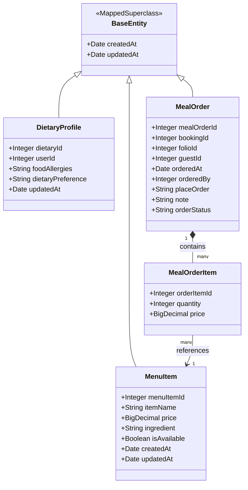
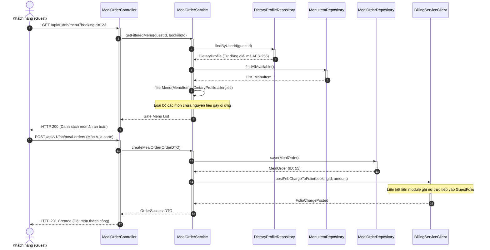
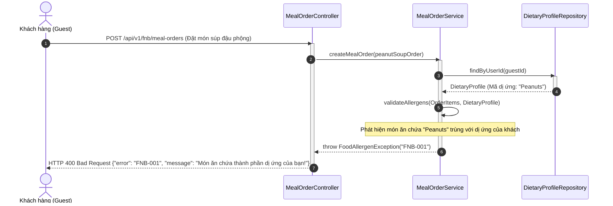
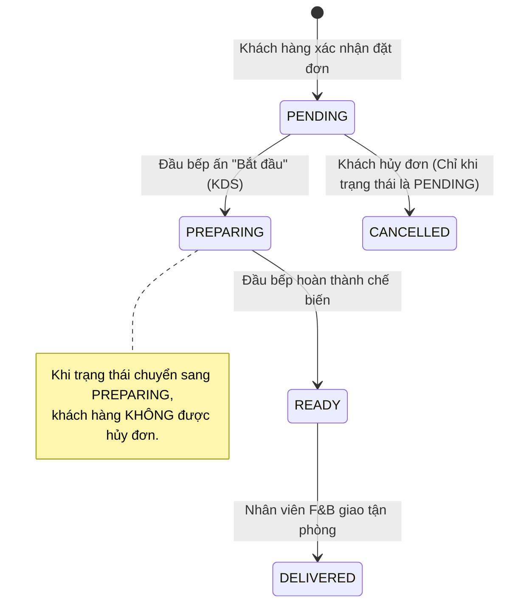

# ENGINEERING DOCUMENTATION STANDARD (EDS) v2.0

## Đặc tả Thiết kế Thực thể - Module 4: Dietary F&B Management

| Field                    | Value                                                      |
| :----------------------- | :--------------------------------------------------------- |
| **Document ID**    | `HOS-FNB-IMP-001`                                        |
| **Version**        | 1.0                                                        |
| **Date**           | 2026-06-14                                                 |
| **Status**         | Approved                                                   |
| **Document Owner** | DacHD                                                      |
| **Author**         | DacHD                                                      |
| **Reviewed by**    | DuongLD                                                    |
| **DPO Sign-off**   | [x] Approved — 2026-06-14 — Hoang Danh Dac (DPO Officer) |
| **Approved by**    | Principal Architect                                        |
| **Last Review**    | 2026-06-14                                                 |
| **Based on EDS**   | v2.0                                                       |

---

## CHANGELOG

> [!IMPORTANT]
> **Policy 4.4 — Immutable History**: Không bao giờ xóa thông tin cũ. Mọi thay đổi phải ghi vào bảng này.

| Ngày      | Người thực hiện | Nội dung thay đổi                                                   |
| :--------- | :------------------ | :--------------------------------------------------------------------- |
| 2026-06-14 | DacHD               | Khởi tạo tài liệu đặc tả thiết kế kỹ thuật EDS cho Module 4 |

---

## MỤC LỤC

1. [Tổng quan Module](#1-tổng-quan-module)
2. [Ma trận Truy vết (Traceability Matrix)](#2-ma-trận-truy-vết-traceability-matrix)
3. [Architecture Decision Records (ADR)](#3-architecture-decision-records-adr)
4. [Non-Functional Requirements &amp; SLA](#4-non-functional-requirements--sla)
5. [Static Modeling (Mô hình Tĩnh)](#5-static-modeling-mô-hình-tĩnh)
6. [Dynamic Modeling (Mô hình Hướng Động)](#6-dynamic-modeling-mô-hình-hướng-động)
7. [Domain Event Catalog](#7-domain-event-catalog)
8. [Interface Specification (Đặc tả Giao diện)](#8-interface-specification-đặc-tả-giao-diện)
9. [API Specification](#9-api-specification)
10. [Bảng mã lỗi (Error Codes)](#10-bảng-mã-lỗi-error-codes)
11. [Quy trình Triển khai (Step-by-Step)](#11-quy-trình-triển-khai-step-by-step)
12. [Rollback &amp; Incident Runbook](#12-rollback--incident-runbook)
13. [Kịch bản Kiểm thử Chi tiết](#13-kịch-bản-kiểm-thử-chi-tiết)
14. [Phương pháp Xác minh](#14-phương-pháp-xác-minh)
15. [Mẫu thử thực tế (API Verification Samples)](#15-mẫu-thử-thực-tế-api-verification-samples)
16. [Bảng tổng hợp phân quyền (Authorization Matrix)](#16-bảng-tổng-hợp-phân-quyền-authorization-matrix)

---

## 1. Tổng quan Module

Module 4 (Dietary F&B Management) đảm nhận việc thiết lập thực đơn, quản lý lựa chọn bữa ăn dinh dưỡng hàng ngày của khách lưu trú, tính toán chi phí dịch vụ F&B phát sinh (a-la-carte), tích hợp chuyển giao hóa đơn về Folio trung tâm, và kiểm soát dữ liệu dị ứng ẩm thực của khách hàng. Module này chứa các thông tin nhạy cảm liên quan đến sức khỏe dinh dưỡng và dị ứng, do đó phải tuân thủ nghiêm ngặt các quy định bảo mật dữ liệu cá nhân.

| Field                           | Value                                                                       |
| :------------------------------ | :-------------------------------------------------------------------------- |
| **Module Name**           | Dietary F&B Management (Module 4)                                           |
| **Bounded Context**       | Food & Beverage (Dinh dưỡng & Ẩm thực)                                  |
| **Data Classification**   | Sensitive-PII (Dietary Profile, Food Allergies)                             |
| **Compliance Scope**      | Nghị định 356/2025/NĐ-CP (Luật bảo vệ dữ liệu cá nhân Việt Nam) |
| **Upstream Dependencies** | `auth` (User), `booking` (Booking)                                      |
| **Downstream Consumers**  | `billing` (GuestFolio)                                                    |

---

## 2. Ma trận Truy vết (Traceability Matrix)

| Requirement ID | Loại (BR/ADR/US) | Mô tả yêu cầu                                                                   | Thành phần Code                          | Compliance Target                                              | ADR liên quan |
| :------------- | :---------------- | :---------------------------------------------------------------------------------- | :----------------------------------------- | :------------------------------------------------------------- | :------------- |
| UC16           | User Story        | Khách chọn trước bữa ăn dựa trên thực đơn đã lọc dị ứng             | `MealOrderService.preSelectMeals()`      | Nghị định 356/2025 Art. 6 (Sự đồng thuận)               | ADR-003        |
| UC17           | User Story        | Đầu bếp xem Dashboard chuẩn bị món ăn kèm cảnh báo dị ứng               | `ChefController.getDailyMealPrep()`      | Nghị định 356/2025 Art. 4 (Bảo mật thông tin sức khỏe) | ADR-001        |
| UC18           | User Story        | Đầu bếp cập nhật trạng thái đơn hàng (Preparing -> Ready)                 | `MealOrder.updateStatus()`               | Quy trình vận hành bếp tiêu chuẩn                        | —             |
| UC19           | User Story        | Khách gọi món a-la-carte ngoài gói và ghi nợ vào Villa folio                | `MealOrderService.createAlacarteOrder()` | AHLEI Standards (Guest Folio posting)                          | ADR-002        |
| UC20           | User Story        | Ẩn toàn bộ bệnh lý vật lý khỏi Đầu bếp (Chỉ hiện dị ứng thực phẩm) | `DietaryProfileRepository`               | Nghị định 356/2025 (Hạn chế tối thiểu hóa dữ liệu)   | ADR-001        |
| BR-06          | Business Rule     | Tự động lọc thực đơn không chứa chất dị ứng của khách                 | `MenuItemMatcher.filterSafeMenu()`       | Bảo vệ sức khỏe thực khách                               | ADR-003        |
| BR-07          | Business Rule     | Phân quyền RBAC và tối thiểu hóa dữ liệu                                    | `AuthAspect` / `@PreAuthorize`         | Nghị định 356/2025 Art. 32                                  | ADR-001        |
| BR-11          | Business Rule     | Tích hợp phí a-la-carte vào Folio trung tâm qua Room_Booking_ID                | `FolioServiceClient.postCharge()`        | AHLEI Guest Folio Standards                                    | ADR-002        |

---

## 3. Architecture Decision Records (ADR)

### `ADR-001` — Mã hóa dữ liệu dị ứng và thông tin ăn kiêng nhạy cảm ở mức Ứng dụng (AES-256-GCM)

| Field                | Value      |
| :------------------- | :--------- |
| **Status**     | Accepted   |
| **Deciders**   | DacHD      |
| **Date**       | 2026-06-14 |
| **Supersedes** | N/A        |

#### Bối cảnh (Context)

Nghị định 356/2025/NĐ-CP quy định thông tin y tế, bệnh lý, và dị ứng thực phẩm nghiêm trọng là dữ liệu cá nhân nhạy cảm (Sensitive PII). Dữ liệu này phải được bảo vệ chống lại việc truy cập trái phép ngay cả khi cơ sở dữ liệu vật lý bị rò rỉ hoặc nhân viên quản trị cơ sở dữ liệu (DBA) cố tình xem trực tiếp.

#### Các phương án đã xem xét (Options Considered)

| Phương án                                                         | Mô tả                                                                  | Ưu điểm                                                                                                                                               | Nhược điểm                                                                                                        |
| :------------------------------------------------------------------- | :----------------------------------------------------------------------- | :------------------------------------------------------------------------------------------------------------------------------------------------------- | :-------------------------------------------------------------------------------------------------------------------- |
| **A: TDE (Transparent Data Encryption)**                       | Mã hóa toàn bộ ổ đĩa ở tầng Database.                           | Cấu hình nhanh, không cần chỉnh sửa code Java.                                                                                                     | DBA vẫn xem được plaintext qua SQL query; Phụ thuộc vào công nghệ DB cụ thể.                               |
| **B: Application-level JPA Attribute Converter (AES-256-GCM)** | Mã hóa các trường nhạy cảm trong Java trước khi ghi xuống SQL. | DBA chỉ thấy dữ liệu đã mã hóa dạng chuỗi Base64; Bảo mật độc lập với DB engine; Tuân thủ tuyệt đối chuẩn mã hóa mã nguồn mở. | Tốn tài nguyên CPU để mã hóa/giải mã; Không thể tìm kiếm trực tiếp bằng câu lệnh `LIKE` trên DB. |

#### Quyết định (Decision)

Chọn **Phương án B** (Application-level JPA Attribute Converter với thuật toán AES-256-GCM). Chúng tôi sử dụng khóa mã hóa được lưu giữ trong HSM (Hardware Security Module) hoặc HashiCorp Vault. Việc lọc dữ liệu sẽ thực hiện qua so khớp ở ứng dụng hoặc thông qua bảng băm định danh giả lập (Deterministic Anonymized Hash).

#### Hệ quả (Consequences)

**Tích cực**:

- Tuân thủ đầy đủ Điều 32 Nghị định 356/2025/NĐ-CP.
- Bảo mật thông tin ngay cả khi tệp sao lưu dữ liệu SQL bị đánh cắp.

**Tiêu cực / Trade-offs**:

- Không thể chạy SQL `SELECT * FROM DIETARY_PROFILE WHERE food_allergies LIKE '%Peanuts%'` trực tiếp trên database. Ứng dụng phải giải mã trước khi xử lý logic.

**Compliance Impact**:

- Báo cáo kiểm toán DPO được đánh dấu Đạt yêu cầu cao nhất về bảo mật dữ liệu y tế nhạy cảm.

---

### `ADR-002` — Cắt đứt liên kết JPA Object giữa các Module (Inter-Module Coupling Elimination)

| Field                | Value      |
| :------------------- | :--------- |
| **Status**     | Accepted   |
| **Deciders**   | DacHD      |
| **Date**       | 2026-06-14 |
| **Supersedes** | N/A        |

#### Bối cảnh (Context)

Dự án được xây dựng theo mô hình Modular Monolith. Việc sử dụng các liên kết JPA truyền thống như `@ManyToOne` hoặc `@OneToMany` chéo qua lại giữa các package (ví dụ: `MealOrder` tham chiếu trực tiếp đến `User` của module `auth`, `Booking` của module `booking`, `GuestFolio` của module `billing`) dẫn đến sự phụ thuộc vòng và phá vỡ cấu trúc độc lập của module, ngăn cản khả năng tách thành Microservices trong tương lai.

#### Các phương án đã xem xét (Options Considered)

| Phương án                                                         | Mô tả                                                                                                        | Ưu điểm                                                                   | Nhược điểm                                                                             |
| :------------------------------------------------------------------- | :------------------------------------------------------------------------------------------------------------- | :--------------------------------------------------------------------------- | :----------------------------------------------------------------------------------------- |
| **A: Khai báo Entity mối quan hệ chéo**                    | Sử dụng `@ManyToOne` trỏ thẳng sang Entity module khác.                                                 | JPA xử lý truy vấn JOIN tự động, dễ code ban đầu.                   | Chặt chẽ về mặt phụ thuộc code, không thể compile độc lập từng module.         |
| **B: Sử dụng kiểu dữ liệu nguyên thủy (Primitive IDs)** | Chỉ lưu ID kiểu `Integer` (ví dụ: `bookingId`, `folioId`, `guestId`) để trỏ sang module khác. | Loose coupling hoàn toàn, dễ compile độc lập, tách service dễ dàng. | Phải tự thực hiện ghép dữ liệu (JOIN) ở tầng dịch vụ (Service) hoặc qua Event. |

#### Quyết định (Decision)

Chọn **Phương án B**. Toàn bộ các liên kết khóa ngoại trỏ sang module khác đều được mô hình hóa dưới dạng `Integer` thay vì đối tượng Java. Chỉ sử dụng `@ManyToOne` trong các quan hệ nội bộ module (Intra-module như `MealOrderItem` -> `MealOrder`).

#### Hệ quả (Consequences)

**Tích cực**:

- Độc lập hoàn toàn về mặt biên dịch giữa các module `fnb`, `auth`, `booking`, `billing`.
- Sẵn sàng nâng cấp lên kiến trúc Microservices bất cứ lúc nào.

**Tiêu cực / Trade-offs**:

- Cần viết thêm Service helper để gom thông tin chi tiết từ các Module khác qua API cục bộ hoặc Domain Event.

---

## 4. Non-Functional Requirements & SLA

### 4.1. Performance & Availability

| Category     | Requirement                           | Target SLA    | Measurement Method | Compliance Basis           |
| :----------- | :------------------------------------ | :------------ | :----------------- | :------------------------- |
| Latency      | Lọc thực đơn & kiểm tra dị ứng | < 150ms (p99) | k6 load test       | Trải nghiệm khách hàng |
| Availability | Uptime của hệ thống đặt ăn      | 99.9%         | Health check probe | SLA vận hành             |
| Throughput   | Xử lý tải giờ cao điểm          | 200 req/s     | Load test          | Kế hoạch quy mô lớn    |

### 4.2. Data Integrity & Retention

| Category         | Requirement                            | Target                                      | Verification Method   | Compliance Basis              |
| :--------------- | :------------------------------------- | :------------------------------------------ | :-------------------- | :---------------------------- |
| Durability       | Ghi nhận đơn đặt món ăn         | RPO = 0                                     | SQL Transaction Log   | Tránh thất thoát tiền     |
| Retention        | Lưu trữ lịch sử đặt món         | 5 năm                                      | DB archiving policy   | Luật Kế toán & Thuế       |
| Right to Erasure | Xóa thông tin nhạy cảm của khách | Trong vòng 24 giờ từ khi nhận yêu cầu | Automated Cleanup Job | Nghị định 356/2025 Art. 10 |

### 4.3. Security

| Category           | Requirement                                | Target                                  | Verification Method       | Compliance Basis                        |
| :----------------- | :----------------------------------------- | :-------------------------------------- | :------------------------ | :-------------------------------------- |
| Encryption at rest | Dữ liệu dị ứng ẩm thực               | AES-256-GCM                             | DBA data inspection check | Nghị định 356/2025                   |
| Access control     | Quyền xem dữ liệu dị ứng              | Chỉ Chef & Guest                       | RBAC Matrix check (§16)  | Nguyên tắc Tối thiểu hóa dữ liệu |
| Audit Trail        | Ghi nhật ký truy cập dữ liệu dị ứng | 100% lượt truy cập phải được log | Audit log parser          | Nghị định 356/2025 Art. 15           |

---

## 5. Static Modeling (Mô hình Tĩnh)

### 5.1. Class Diagram (Mermaid)



### 5.2. Data Structure (Java JPA Entities Mapping)

Dưới đây là định nghĩa các JPA Java Entity cho Module 4, được ánh xạ khớp 100% với cấu trúc bảng trong [DB.sql](file:///d:/SWP301/su26-swp391-se2023-g6/03_Design/SQL/DB.sql):

#### `DietaryProfile.java`

```java
package com.xoai.retreat.fnb.entity;

import jakarta.persistence.*;
import lombok.*;
import java.time.LocalDateTime;

@Entity
@Table(name = "DIETARY_PROFILE")
@Data
@NoArgsConstructor
@AllArgsConstructor
@Builder
public class DietaryProfile {

    @Id
    @GeneratedValue(strategy = GenerationType.IDENTITY)
    @Column(name = "dietary_id")
    private Integer id;

    // Liên kết liên module: Chỉ lưu userId dạng Integer
    @Column(name = "user_id", nullable = false)
    private Integer userId;

    // Trường thông tin nhạy cảm: Áp dụng JPA Converter mã hóa AES-256
    @Convert(converter = AesEncryptor.class)
    @Column(name = "food_allergies", columnDefinition = "NVARCHAR(MAX)")
    private String foodAllergies;

    // Trường sở thích ăn uống: Áp dụng JPA Converter mã hóa AES-256
    @Convert(converter = AesEncryptor.class)
    @Column(name = "diatary_preference", columnDefinition = "NVARCHAR(MAX)")
    private String dietaryPreference;

    @Column(name = "update_at")
    @Builder.Default
    private LocalDateTime updatedAt = LocalDateTime.now();

    @PreUpdate
    protected void onUpdate() {
        updatedAt = LocalDateTime.now();
    }
}
```

#### `MenuItem.java`

```java
package com.xoai.retreat.fnb.entity;

import jakarta.persistence.*;
import lombok.*;
import java.math.BigDecimal;
import java.time.LocalDateTime;

@Entity
@Table(name = "MENU_ITEM")
@Data
@NoArgsConstructor
@AllArgsConstructor
@Builder
public class MenuItem {

    @Id
    @GeneratedValue(strategy = GenerationType.IDENTITY)
    @Column(name = "menu_item_id")
    private Integer id;

    @Column(name = "item_name", length = 20, nullable = false)
    private String itemName;

    @Column(name = "price", precision = 18, scale = 2)
    private BigDecimal price;

    @Column(name = "ingredient", columnDefinition = "NVARCHAR(MAX)")
    private String ingredient;

    @Column(name = "is_available")
    @Builder.Default
    private Boolean isAvailable = true;

    @Column(name = "create_at")
    @Builder.Default
    private LocalDateTime createdAt = LocalDateTime.now();

    @Column(name = "update_at")
    @Builder.Default
    private LocalDateTime updatedAt = LocalDateTime.now();

    @PreUpdate
    protected void onUpdate() {
        updatedAt = LocalDateTime.now();
    }
}
```

#### `MealOrder.java`

```java
package com.xoai.retreat.fnb.entity;

import jakarta.persistence.*;
import lombok.*;
import java.time.LocalDateTime;
import java.util.ArrayList;
import java.util.List;

@Entity
@Table(name = "MEAL_ORDER")
@Data
@NoArgsConstructor
@AllArgsConstructor
@Builder
public class MealOrder {

    @Id
    @GeneratedValue(strategy = GenerationType.IDENTITY)
    @Column(name = "meal_order_id")
    private Integer id;

    // Liên kết liên module: Chỉ lưu ID dạng Integer, không map Object
    @Column(name = "booking_id", nullable = false)
    private Integer bookingId;

    @Column(name = "folio_id", nullable = false)
    private Integer folioId;

    @Column(name = "guest_id", nullable = false)
    private Integer guestId;

    @Column(name = "ordered_at")
    @Builder.Default
    private LocalDateTime orderedAt = LocalDateTime.now();

    @Column(name = "ordered_by")
    private Integer orderedBy;

    @Column(name = "place_order", length = 100)
    private String placeOrder;

    @Column(name = "note", columnDefinition = "NVARCHAR(MAX)")
    private String note;

    @Column(name = "order_status", length = 10)
    private String orderStatus;

    @OneToMany(mappedBy = "mealOrder", cascade = CascadeType.ALL, orphanRemoval = true, fetch = FetchType.LAZY)
    @Builder.Default
    private List<MealOrderItem> items = new ArrayList<>();
}
```

#### `MealOrderItem.java`

```java
package com.xoai.retreat.fnb.entity;

import jakarta.persistence.*;
import lombok.*;
import java.math.BigDecimal;

@Entity
@Table(name = "MEAL_ORDER_ITEM")
@Data
@NoArgsConstructor
@AllArgsConstructor
@Builder
public class MealOrderItem {

    @Id
    @GeneratedValue(strategy = GenerationType.IDENTITY)
    @Column(name = "order_item_id")
    private Integer id;

    @ManyToOne(fetch = FetchType.LAZY)
    @JoinColumn(name = "meal_order_id", nullable = false)
    private MealOrder mealOrder;

    @ManyToOne(fetch = FetchType.LAZY)
    @JoinColumn(name = "menu_item_id", nullable = false)
    private MenuItem menuItem;

    @Column(name = "quantity")
    private Integer quantity;

    @Column(name = "price", precision = 18, scale = 2)
    private BigDecimal price;
}
```

#### Class Mã hóa Dữ liệu Nhạy cảm `AesEncryptor.java`

```java
package com.xoai.retreat.fnb.entity;

import jakarta.persistence.AttributeConverter;
import jakarta.persistence.Converter;
import javax.crypto.Cipher;
import javax.crypto.spec.GCMParameterSpec;
import javax.crypto.spec.SecretKeySpec;
import java.security.SecureRandom;
import java.util.Base64;

@Converter
public class AesEncryptor implements AttributeConverter<String, String> {

    private static final String ALGORITHM = "AES/GCM/NoPadding";
    private static final int GCM_TAG_LENGTH = 128;
    private static final int IV_SIZE = 12; // 96 bits cho GCM
  
    // Khóa mã hóa (Trong thực tế phải đọc từ biến môi trường/Vault bảo mật)
    private static final byte[] KEY = Base64.getDecoder().decode("c3VwZXJzZWNyZXRrZXkyNTZiaXRzc3VwZXJzZWNyZXQ="); 
    private final SecretKeySpec keySpec = new SecretKeySpec(KEY, "AES");

    @Override
    public String convertToDatabaseColumn(String attribute) {
        if (attribute == null) return null;
        try {
            byte[] iv = new byte[IV_SIZE];
            new SecureRandom().nextBytes(iv);
          
            Cipher cipher = Cipher.getInstance(ALGORITHM);
            GCMParameterSpec parameterSpec = new GCMParameterSpec(GCM_TAG_LENGTH, iv);
            cipher.init(Cipher.ENCRYPT_MODE, keySpec, parameterSpec);
          
            byte[] encrypted = cipher.doFinal(attribute.getBytes());
          
            // Gộp IV và Ciphertext vào chung một mảng để lưu xuống DB
            byte[] encryptedWithIv = new byte[IV_SIZE + encrypted.length];
            System.arraycopy(iv, 0, encryptedWithIv, 0, IV_SIZE);
            System.arraycopy(encrypted, 0, encryptedWithIv, IV_SIZE, encrypted.length);
          
            return Base64.getEncoder().encodeToString(encryptedWithIv);
        } catch (Exception e) {
            throw new IllegalStateException("Lỗi mã hóa dữ liệu nhạy cảm: " + e.getMessage(), e);
        }
    }

    @Override
    public String convertToEntityAttribute(String dbData) {
        if (dbData == null) return null;
        try {
            byte[] encryptedWithIv = Base64.getDecoder().decode(dbData);
          
            byte[] iv = new byte[IV_SIZE];
            System.arraycopy(encryptedWithIv, 0, iv, 0, IV_SIZE);
          
            int encryptedSize = encryptedWithIv.length - IV_SIZE;
            byte[] encrypted = new byte[encryptedSize];
            System.arraycopy(encryptedWithIv, IV_SIZE, encrypted, 0, encryptedSize);
          
            Cipher cipher = Cipher.getInstance(ALGORITHM);
            GCMParameterSpec parameterSpec = new GCMParameterSpec(GCM_TAG_LENGTH, iv);
            cipher.init(Cipher.DECRYPT_MODE, keySpec, parameterSpec);
          
            return new String(cipher.doFinal(encrypted));
        } catch (Exception e) {
            throw new IllegalStateException("Lỗi giải mã dữ liệu nhạy cảm: " + e.getMessage(), e);
        }
    }
}
```

---

## 6. Dynamic Modeling (Mô hình Hướng Động)

### 6.1. Sequence Diagram — Happy Path (Khách đặt món lọc dị ứng tự động)



### 6.2. Sequence Diagram — Error Path (Cố gắng đặt món ăn chứa dị ứng)



### 6.3. State Machine (Trạng thái đơn món ăn - MealOrder Status)



---

## 7. Domain Event Catalog

### 7.1. Events Published (Phát ra)

| Event Name            | Trigger                                          | Publisher            | Subscriber(s)                                          | Payload Schema                | Async? |
| :-------------------- | :----------------------------------------------- | :------------------- | :----------------------------------------------------- | :---------------------------- | :----- |
| `MealOrderPlaced`   | Đơn hàng a-la-carte được tạo thành công | `MealOrderService` | `billing-service` (để ghi nhận hóa đơn nháp)  | `MealOrderPlacedEvent.ts`   | Yes    |
| `MealOrderPrepared` | Đầu bếp nhấn hoàn thành chế biến         | `MealOrderService` | `notification-service` (để báo khách nhận món) | `MealOrderPreparedEvent.ts` | Yes    |

### 7.2. Events Consumed (Tiêu thụ)

| Event Name          | Source              | Handler                     | Action thực hiện                                             |
| :------------------ | :------------------ | :-------------------------- | :------------------------------------------------------------- |
| `GuestCheckedIn`  | `booking-service` | `DietaryProfileHandler`   | Kích hoạt bộ lọc món ăn cho phòng được gán          |
| `GuestCheckedOut` | `booking-service` | `MealOrderCleanupHandler` | Kích hoạt lệnh xóa dữ liệu nhạy cảm nếu có yêu cầu |

---

## 8. Interface Specification (Đặc tả Giao diện)

### 8.1. Service Interface

```java
package com.xoai.retreat.fnb.service;

import com.xoai.retreat.fnb.dto.MealOrderRequest;
import com.xoai.retreat.fnb.dto.MealOrderResponse;
import com.xoai.retreat.fnb.dto.MenuItemResponse;
import java.util.List;

/**
 * Interface nghiệp vụ quản lý ăn uống F&B
 * @version 1.0
 */
public interface IMealOrderService {

    /**
     * Lấy danh sách thực đơn an toàn đã lọc bỏ chất gây dị ứng của khách hàng
     * @param userId ID của khách hàng
     * @param bookingId ID lượt đặt phòng
     * @return Danh sách món ăn an toàn
     */
    List<MenuItemResponse> getFilteredMenu(Integer userId, Integer bookingId);

    /**
     * Tạo mới đơn đặt đồ ăn (Hỗ trợ cả món trong gói và a-la-carte)
     * @param request DTO chứa thông tin món đặt
     * @return Kết quả đặt món
     * @throws FoodAllergenException (FNB-001) nếu món ăn chứa chất dị ứng của khách
     * @throws BookingNotActiveException (FNB-002) nếu khách chưa check-in
     */
    MealOrderResponse createMealOrder(MealOrderRequest request);

    /**
     * Cập nhật trạng thái chuẩn bị đơn hàng của bếp
     * @param orderId ID đơn đặt món
     * @param status Trạng thái mới (PREPARING, READY, DELIVERED)
     */
    void updatePrepStatus(Integer orderId, String status);
}
```

### 8.2. Repository Interface

```java
package com.xoai.retreat.fnb.repository;

import com.xoai.retreat.fnb.entity.DietaryProfile;
import org.springframework.data.jpa.repository.JpaRepository;
import java.util.Optional;

public interface IDietaryProfileRepository extends JpaRepository<DietaryProfile, Integer> {
  
    // Truy vấn hồ sơ dị ứng theo ID người dùng
    Optional<DietaryProfile> findByUserId(Integer userId);
  
    // Lưu ý: Không hỗ trợ hard delete bừa bãi ngoại trừ trường hợp Guest yêu cầu xóa PII
}
```

---

## 9. API Specification

### 9.1. Endpoints Table

| Method | Path                                   | Auth Level | Required Roles              | Rate Limit | Idempotent? |
| :----- | :------------------------------------- | :--------- | :-------------------------- | :--------- | :---------- |
| GET    | `/api/v1/fnb/menu`                   | JWT Bearer | `GUEST`                   | 100/min    | Yes         |
| POST   | `/api/v1/fnb/meal-orders`            | JWT Bearer | `GUEST`, `RECEPTIONIST` | 60/min     | No          |
| GET    | `/api/v1/fnb/chef/dashboard`         | JWT Bearer | `CHEF`                    | 120/min    | Yes         |
| PATCH  | `/api/v1/fnb/chef/orders/:id/status` | JWT Bearer | `CHEF`                    | 60/min     | Yes         |

### 9.2. Request / Response Schemas

#### POST `/api/v1/fnb/meal-orders`

**Request Body**:

```json
{
  "bookingId": 123,
  "guestId": 456,
  "placeOrder": "VILLA_V01",
  "note": "Ít gia vị",
  "items": [
    {
      "menuItemId": 2,
      "quantity": 1
    }
  ]
}
```

**Response — 201 Created**:

```json
{
  "mealOrderId": 55,
  "bookingId": 123,
  "guestId": 456,
  "placeOrder": "VILLA_V01",
  "totalAmount": 150000.00,
  "orderStatus": "PENDING",
  "orderedAt": "2026-06-14T02:05:00.000Z"
}
```

**Response — 400 Bad Request (Dị ứng phát hiện)**:

```json
{
  "error": {
    "code": "FNB-001",
    "message": "Không thể gọi món: 'Súp đậu phộng' có chứa nguyên liệu gây dị ứng trong hồ sơ sức khỏe của bạn.",
    "details": [
      { "field": "menuItemId", "rejectedValue": 2, "allergenMatched": "Peanuts" }
    ]
  }
}
```

---

## 10. Bảng mã lỗi (Error Codes)

| Code        | HTTP Status | Message (EN)             | Message (VI)                                                                     | Trigger Condition                                                                  |
| :---------- | :---------- | :----------------------- | :------------------------------------------------------------------------------- | :--------------------------------------------------------------------------------- |
| `FNB-001` | 400         | Food allergen conflict   | Phát hiện thành phần dị ứng trong món ăn đối với hồ sơ khách hàng | Khách cố tình gọi món nằm ngoài danh sách bộ lọc an toàn                |
| `FNB-002` | 403         | Guest not checked in     | Khách hàng chưa làm thủ tục nhận phòng                                   | Lượt đặt phòng không ở trạng thái ACTIVE tại thời điểm gọi món      |
| `FNB-003` | 404         | Menu item unavailable    | Món ăn hiện đã hết hoặc ngừng phục vụ                                  | `is_available` của MenuItem bằng 0                                             |
| `FNB-004` | 403         | Insufficient permissions | Không đủ quyền hạn                                                          | Receptionist cố truy cập hồ sơ bệnh lý vật lý ngoài thực đơn ăn uống |

---

## 11. Quy trình Triển khai (Step-by-Step)

### 11.1. Prerequisites

- [X] ADR-001 và ADR-002 đã được duyệt
- [X] DPO đã ký duyệt cấu hình mã hóa thông tin nhạy cảm
- [X] Khóa mã hóa AES-256 đã được đẩy vào AWS Parameter Store/HashiCorp Vault của môi trường Staging

### 11.2. Pre-Migration Checklist

- [X] Sao lưu DB hiện tại: `pg_dump` / SQL Server Backup
- [X] Test giải thuật chuyển đổi mã hóa `AesEncryptor` trên môi trường local của QA

### 11.3. Implementation Steps

#### Chặng 1 — Tạo cấu trúc bảng

- Chạy cập nhật database schema:

```sql
ALTER TABLE DIETARY_PROFILE ALTER COLUMN food_allergies NVARCHAR(MAX) NULL;
ALTER TABLE DIETARY_PROFILE ALTER COLUMN diatary_preference NVARCHAR(MAX) NULL;
```

#### Chặng 2 — Triển khai mã nguồn

- Deploy dịch vụ `fnb-service` lên cụm Kubernetes/App Server.
- Cấu hình khóa bí mật của `AesEncryptor` trong JVM Options:

```bash
-Dencrypt.db.key=c3VwZXJzZWNyZXRrZXkyNTZiaXRzc3VwZXJzZWNyZXQ=
```

---

## 12. Rollback & Incident Runbook

### 12.1. Điều kiện kích hoạt Rollback (Trigger Conditions)

- Tỷ lệ lỗi API đặt món `/meal-orders` > 3% trong 5 phút.
- Gặp lỗi giải mã `IllegalStateException` hàng loạt trong log hệ thống khi khách truy cập thực đơn.

### 12.2. Rollback Procedure

1. Re-deploy phiên bản cũ của ứng dụng để tắt tính năng mã hóa ứng dụng tự động.
2. Nếu database đã lưu các bản ghi dạng mã hóa Base64 mới, chạy tool script `RollbackDecryptor` để quét giải mã ngược lại các hàng dữ liệu cũ về plaintext nhằm tương thích với ứng dụng cũ.

---

## 13. Kịch bản Kiểm thử Chi tiết

### 13.1. Unit Tests

#### `TC-FNB-UNIT-001` — Kiểm tra tự động lọc dị ứng thực đơn

- **Feature**: Auto menu filtering
- **Background**:
  - **Given** test data classification: `SYNTHETIC`
- **Scenario**: Khách có dị ứng Đậu Phộng vào xem thực đơn
  - **Given** Khách hàng có `DietaryProfile` chứa dị ứng `"Peanuts"`
  - **And** Thực đơn có 2 món: "Món xào tỏi" (nguyên liệu: tỏi, dầu) và "Gỏi khô bò" (nguyên liệu: đậu phộng, bò)
  - **When** `MenuItemMatcher.filterSafeMenu()` được gọi
  - **Then** Kết quả trả về chỉ chứa "Món xào tỏi"
  - **And** Món "Gỏi khô bò" bị đánh dấu ẩn hoặc không cho chọn

#### `TC-FNB-UNIT-002` — Kiểm tra cơ chế mã hóa AES-256

- **Feature**: Application level encryption
- **Background**:
  - **Given** test data classification: `SYNTHETIC`
- **Scenario**: Ghi nhận và lưu thông tin dị ứng mới
  - **When** Lưu thực thể `DietaryProfile` với dị ứng `"Shellfish"` vào database
  - **Then** Cột `food_allergies` trong bảng phải lưu chuỗi mã hóa dạng Base64
  - **And** Không chứa từ khóa `"Shellfish"` dưới dạng plaintext trong dữ liệu SQL thô

---

## 14. Phương pháp Xác minh

### 14.1. Database Inspection

- Chạy câu lệnh SQL kiểm chứng dữ liệu nhạy cảm đã được mã hóa:

```sql
SELECT user_id, food_allergies, diatary_preference 
FROM DIETARY_PROFILE;
```

*Kết quả kỳ vọng: Các cột `food_allergies` và `diatary_preference` hiển thị các ký tự mã hóa Base64 ngẫu nhiên, không đọc được bằng mắt thường.*

### 14.2. Log / Audit Verification

- Đảm bảo log không ghi lại plaintext của dữ liệu nhạy cảm:

```bash
grep -i "shellfish\|peanut" /var/log/app/fnb-service.log
```

*Kết quả kỳ vọng: Không có dòng log nào được trả về.*

---

## 15. Mẫu thử thực tế (API Verification Samples)

### 15.1. Happy Path (Đặt món hợp lệ)

```bash
curl -X POST https://localhost:8080/api/v1/fnb/meal-orders \
  -H "Authorization: Bearer <GUEST_JWT>" \
  -H "Content-Type: application/json" \
  -d '{
    "bookingId": 1,
    "guestId": 10,
    "placeOrder": "VILLA_V101",
    "items": [{"menuItemId": 1, "quantity": 2}]
  }'
```

*Expected: Response 201 Created với trạng thái PENDING.*

---

## 16. Bảng tổng hợp phân quyền (Authorization Matrix)

| Endpoint / Action                            | GUEST | CHEF / F&B | RECEPTIONIST | THERAPIST | ADMIN |
| :------------------------------------------- | :----: | :---------: | :----------: | :-------: | :----: |
| GET `/api/v1/fnb/menu`                     | ✅ Own |     ❌     |    ✅ All    |    ❌    | ✅ All |
| POST `/api/v1/fnb/meal-orders`             | ✅ Own |     ❌     |    ✅ All    |    ❌    |   ❌   |
| GET `/api/v1/fnb/chef/dashboard`           |   ❌   |   ✅ All   |      ❌      |    ❌    | ✅ All |
| PATCH `/api/v1/fnb/chef/orders/:id/status` |   ❌   |   ✅ All   |      ❌      |    ❌    |   ❌   |
| GET `/api/v1/fnb/dietary-profile/:uid`     | ✅ Own |   ✅ All   |      ❌      |    ❌    | ✅ All |
| GET `/api/v1/spa/physical-health/:uid`     | ✅ Own | ❌ (Masked) | ❌ (Masked) |  ✅ All  | ✅ All |

**Chú thích**:

- ✅ = Được phép
- ❌ = Bị từ chối (403 Forbidden)
- `Own` = Chỉ được phép truy cập/thao tác dữ liệu của chính mình
- `Masked` = Bị hệ thống ẩn thông tin/trả về null không có lỗi
