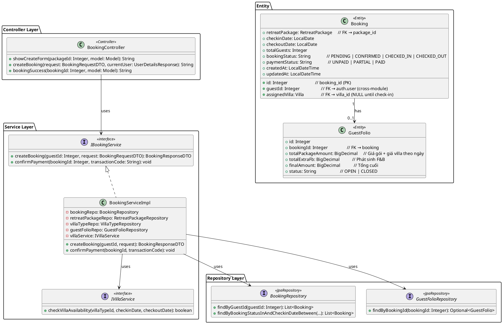
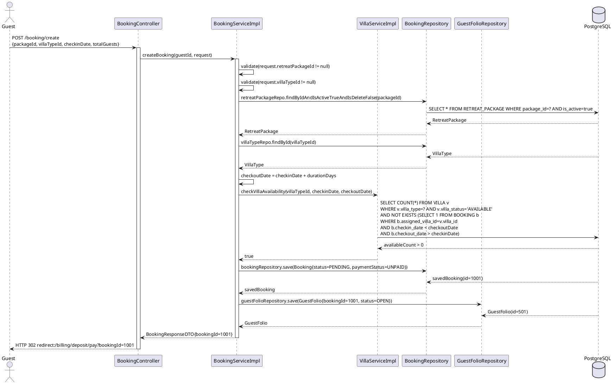
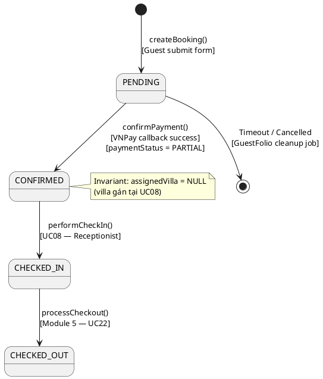

# ENGINEERING DESIGN SPECIFICATION (EDS) v2.0

# UC07 — Book Wellness Package & Pay Deposit

| Field                    | Value                                                          |
| ------------------------ | -------------------------------------------------------------- |
| **Document ID**    | `AURAMOON-BOOKING-EDS-UC07`                                  |
| **Version**        | 1.0                                                            |
| **Date**           | 2026-06-19                                                     |
| **Status**         | In Review                                                      |
| **Document Owner** | Lê Trà My — Module 2 Lead                                  |
| **Author**         | Phùng Giang Hải                                            |
| **Reviewed by**    | Phùng Giang Hải                                              |
| **DPO Sign-off**   | `[x] Approved — 2026-06-19` (xử lý PII cơ bản: guestId) |
| **Approved by**    | Phùng Giang Hải — Tech Lead                               |
| **Last Review**    | 2026-06-23                                                  |
| **Based on EDS**   | v2.0                                                           |

# CHANGELOG

| Ngày      | Người thực hiện | Nội dung thay đổi                                          |
| ---------- | ------------------- | ------------------------------------------------------------- |
| 2026-06-19 | Student 2           | Tạo tài liệu lần đầu — UC07 Book Package & Pay Deposit |
| 2026-06-23 | Phùng Giang Hải     | Cập nhật logic sinh N vé Spa theo durationDays (N-1) |
| 2026-06-23 | Phùng Giang Hải     | Thêm BR-24: Chặn Guest đặt nhiều gói (Max 1 Active Booking) |
| 2026-06-23 | Phùng Giang Hải     | Cập nhật BR-15 để checkoutDate là null cho đến khi Check-in |

---

# 1. Tổng quan UC

> **UC07** là use case trung tâm của Module 2. Guest đã xác thực chọn gói nghỉ dưỡng, ngày check-in, loại biệt thự và thanh toán tiền đặt cọc qua VNPay. Sau khi VNPay callback thành công, Booking được CONFIRMED và GuestFolio được cập nhật OPEN.

| Field                           | Value                                                                    |
| ------------------------------- | ------------------------------------------------------------------------ |
| **UC ID**                 | `UC07`                                                                 |
| **UC Name**               | Book Wellness Package & Pay Deposit                                      |
| **Priority**              | 🔴 P0 — Core Business Feature                                           |
| **Module**                | `booking`                                                              |
| **Bounded Context**       | `booking`                                                              |
| **Data Classification**   | `PII` (guestId, booking details)                                       |
| **Compliance Scope**      | Nghị định 356/2025/NĐ-CP, VNPay Integration                          |
| **Upstream Dependencies** | `auth` (JWT, guestId), Module 1 (RetreatPackage, VillaType catalog)    |
| **Downstream Consumers**  | Module 5 (billing — GuestFolio), Module 3 (Spa scheduling — bookingId) |

---

# 2. Ma trận Truy vết

| Requirement ID  | Loại         | Mô tả yêu cầu                                                          | Thành phần Code                                                                    | Compliance Target       | ADR liên quan |
| --------------- | ------------- | -------------------------------------------------------------------------- | ------------------------------------------------------------------------------------ | ----------------------- | -------------- |
| **UC07**  | User Story    | Guest chọn gói, ngày, villaType và thanh toán deposit                 | `BookingController.POST /booking/create` → `BookingServiceImpl.createBooking()` | VNPay Sandbox           | ADR-001        |
| **BR-01** | Business Rule | Booking chỉ CONFIRMED sau khi deposit payment thành công                | `BookingServiceImpl.confirmPayment()`                                              | VNPay callback          | ADR-001        |
| **BR-02** | Business Rule | Guest chỉ chọn VillaType; Receptionist gán villa cụ thể lúc check-in | `BookingRequestDTO.villaTypeId` (không có `villaId`)                           | Hotel PMS Best Practice | —             |
| **BR-03** | Business Rule | Hệ thống tự động tạo N bản ghi `TreatmentBooking` (N = durationDays của Gói Retreat) với trạng thái `PENDING` khi thanh toán cọc thành công | `BookingServiceImpl.confirmPayment()`                                              | Spa Integration         | —             |
| **BR-14** | Business Rule | Gán User (Guest) vào Booking | `booking.setGuestId(userId)` | System Design | — |
| **BR-15** | Business Rule | `checkoutDate` tạm tính khi check logic nhưng lưu là NULL lúc Booking | `checkoutDate` chỉ được xác định lại thực tế lúc Check-in. | System Design | — |
| **BR-16** | Notification | Khách hàng phải nhận được email xác nhận | (Out of scope M2, trigger qua MQ/Event) | UX/Communication | — |
| **BR-15** | Business Rule | Audit log bắt buộc cho mọi hành động tạo booking                    | `AuditService.log(BOOKING_CREATED, bookingId)`                                     | Nghị định 356/2025   | —             |

## 2.1.2 Business Rules liên quan đến UC07

| ID | Tên Business Rule | Mô tả |
| :--- | :--- | :--- |
| **BR-02** | Chọn loại biệt thự | Khách hàng chỉ chọn `VillaType` trực tuyến. Số phòng vật lý cụ thể chỉ được gán tại quầy lễ tân khi Check-in. |
| **BR-24** | Giới hạn số lượng Booking Active | Mỗi khách hàng (Guest) tại một thời điểm chỉ được phép có TỐI ĐA 1 Booking ở trạng thái `PENDING`, `CONFIRMED` hoặc `CHECKED_IN`. Khách phải hoàn thành hoặc hủy Booking hiện tại trước khi được đặt gói mới. |

---

# 3. Architecture Decision Records (ADR)

## ADR-UC07-001 — GuestFolio được tạo ngay tại createBooking(), không phải confirmPayment()

| Field              | Value                |
| ------------------ | -------------------- |
| **Status**   | Accepted             |
| **Deciders** | Student 2, Tech Lead |
| **Date**     | 2026-06-19           |

**Bối cảnh:**
Deposit payment cần một `GuestFolio` để tham chiếu khi tạo Payment record. Nếu Folio chỉ được tạo sau khi confirm, sẽ không có nơi lưu thông tin deposit.

**Các phương án đã xem xét:**

| Phương án | Mô tả                                                   | Ưu điểm                                   | Nhược điểm                                |
| ------------ | --------------------------------------------------------- | -------------------------------------------- | --------------------------------------------- |
| A            | Tạo GuestFolio tại `createBooking()` với status=OPEN | + Deposit có nơi tham chiếu ngay          | - Có thể tạo Folio cho booking bị abandon |
| B            | Tạo GuestFolio tại `confirmPayment()`                 | + Chỉ tạo khi đã chắc chắn thanh toán | - VNPay callback không có Folio để update |

**Quyết định:** Chọn **Phương án A** — GuestFolio tạo ngay tại `createBooking()`.

**Hệ quả tích cực:**

- Deposit payment luôn có GuestFolio hợp lệ để tham chiếu
- Folio phản ánh chi phí ngay từ khi booking tạo

**Tiêu cực / Trade-offs:**

- Có thể tạo Folio cho booking bị hủy → cần cleanup job định kỳ cho PENDING bookings quá hạn

---

## ADR-UC07-002 — Booking Status Flow: PENDING → CONFIRMED

| Field            | Value      |
| ---------------- | ---------- |
| **Status** | Accepted   |
| **Date**   | 2026-06-19 |

**Quyết định:** Booking khởi tạo là `PENDING` + `UNPAID`. Sau khi VNPay callback thành công → `CONFIRMED` + `PARTIAL` (đã đặt cọc, chưa thanh toán toàn bộ).

**State Transition:**

```
[Initial] → PENDING/UNPAID (createBooking)
PENDING   → CONFIRMED/PARTIAL (confirmPayment - VNPay callback)
CONFIRMED → CHECKED_IN (CheckInService - UC08)
CHECKED_IN → CHECKED_OUT (Checkout - Module 5)
```

---

# 4. Non-Functional Requirements & SLA

## 4.1. Performance & Availability

| Category     | Requirement                         | Target SLA  | Measurement Method     | Compliance Basis  |
| ------------ | ----------------------------------- | ----------- | ---------------------- | ----------------- |
| Latency      | `createBooking()` API response    | `< 300ms` | Stopwatch logging / k6 | Hotel Operations  |
| Latency      | `confirmPayment()` VNPay callback | `< 500ms` | k6 + VNPay sandbox     | VNPay SLA         |
| Availability | Uptime                              | `99.9%`   | Uptime monitor         | Hotel Operations  |

## 4.2. Data Integrity

| Category    | Requirement                                            | Target         | Measurement Method        | Compliance Basis  |
| ----------- | ------------------------------------------------------ | -------------- | ------------------------- | ----------------- |
| Idempotency | VNPay callback gửi 2 lần không tạo 2 GuestFolio    | 100%           | Unit test (§13.1)          | Hotel Operations  |
| Transaction | createBooking + GuestFolio save trong 1 DB transaction | @Transactional | Integration test (§13.2)  | Hotel Operations  |
| Durability  | Zero booking record loss                               | RPO = 0        | Transaction log check     | Nghị định 356/2025 |

## 4.3. Security

| Category        | Requirement                                                                         | Target              | Verification Method     | Compliance Basis        |
| --------------- | ----------------------------------------------------------------------------------- | ------------------- | ----------------------- | ----------------------- |
| Authentication  | `POST /booking/create` yêu cầu JWT hợp lệ (role=GUEST)                        | 403 nếu sai role    | Security test (§13.3)    | OWASP API-01            |
| VNPay callback  | Verify chữ ký HMAC từ VNPay trước khi confirmPayment                           | 0 forged callbacks  | Penetration test        | VNPay Integration Guide |
| IDOR prevention | Guest chỉ tạo booking cho chính mình (guestId từ JWT, không từ request body) | 0 IDOR incidents    | Security test (§13.3)    | OWASP API-01            |

---

# 5. Static Modeling

## 5.1. Class Diagram



## 5.2. Data Structure (JPA Entity)

```java
// Booking.java — bảng BOOKING
@Entity @Table(name = "BOOKING")
public class Booking extends BaseEntity {
    @Id @GeneratedValue(strategy = GenerationType.IDENTITY)
    @Column(name = "booking_id")
    private Integer id;

    @Column(name = "guest_id", nullable = false)
    private Integer guestId;               // Cross-module FK → auth.User

    @ManyToOne(fetch = FetchType.LAZY)
    @JoinColumn(name = "package_id")
    private RetreatPackage retreatPackage; // FK → RETREAT_PACKAGE

    @ManyToOne(fetch = FetchType.LAZY)
    @JoinColumn(name = "assigned_villa_id")
    private Villa assignedVilla;           // NULL until Check-in (UC08)

    @Column(name = "checkin_date")
    private LocalDate checkinDate;

    @Column(name = "checkout_date")
    private LocalDate checkoutDate;        // = checkinDate + durationDays

    @Column(name = "total_guests")
    private Integer totalGuests;

    @Column(name = "booking_status", length = 10)
    private String bookingStatus;          // PENDING | CONFIRMED | CHECKED_IN | CHECKED_OUT

    @Column(name = "payment_status", length = 10)
    private String paymentStatus;          // UNPAID | PARTIAL | PAID
}

// GuestFolio.java — bảng GUEST_FOLIO (billing module, cross-reference)
@Entity @Table(name = "GUEST_FOLIO")
public class GuestFolio {
    @Id @GeneratedValue(strategy = GenerationType.IDENTITY)
    private Integer id;

    @Column(name = "booking_id", nullable = false, unique = true)
    private Integer bookingId;             // FK → BOOKING(booking_id)

    @Column(name = "total_package_amount")
    private BigDecimal totalPackageAmount; // Package price + (durationDays × villaType.pricePerDay)

    @Column(name = "total_extra_fb")
    private BigDecimal totalExtraFb;       // 0 tại thời điểm tạo, cập nhật bởi Module 4

    @Column(name = "final_amount")
    private BigDecimal finalAmount;        // = totalPackageAmount + totalExtraFb - deposit

    @Column(name = "status", length = 10)
    private String status;                 // OPEN | CLOSED
}
```

---

# 6. Dynamic Modeling

## 6.1. Sequence Diagram — Happy Path (createBooking)



## 6.2. Sequence Diagram — confirmPayment (VNPay Callback)

```plantuml
@startuml
participant "BillingController (VNPay Callback)" as CB
participant "BookingServiceImpl" as Svc
participant "BookingRepository" as BookRepo
participant "GuestFolioRepository" as FolioRepo
database "PostgreSQL" as DB

CB -> Svc: confirmPayment(bookingId=1001, transactionCode="TXN-001")
activate Svc

Svc -> BookRepo: findById(1001)
DB --> BookRepo: Booking{status=PENDING}
BookRepo --> Svc: Booking

Svc -> Svc: booking.setBookingStatus("CONFIRMED")
Svc -> Svc: booking.setPaymentStatus("PARTIAL")
Svc -> BookRepo: save(booking)
DB --> BookRepo: Booking{status=CONFIRMED, paymentStatus=PARTIAL}

Svc -> FolioRepo: findByBookingId(1001)
DB --> FolioRepo: GuestFolio{status=OPEN}
FolioRepo --> Svc: GuestFolio

note over Svc: GuestFolio đã OPEN từ createBooking()\nchỉ cần verify, không tạo lại

Svc -> Svc: get active TreatmentService\nloop durationDays times
Svc -> DB: save TreatmentBooking{status=PENDING}
DB --> Svc: TreatmentBooking
end

Svc --> CB: void (success)
deactivate Svc
@enduml
```

## 6.3. State Machine — Booking Status



---

# 7. Domain Event Catalog

## 7.1. Events Published

| Event Name           | Trigger                             | Publisher              | Subscriber(s)                    | Async? |
| -------------------- | ----------------------------------- | ---------------------- | -------------------------------- | ------ |
| `BookingCreated`   | `createBooking()` thành công    | `BookingServiceImpl` | Module 5 (GuestFolio), Audit     | No     |
| `PaymentConfirmed` | `confirmPayment()` VNPay callback | `BookingServiceImpl` | Module 5 (Billing), Notification | No     |

## 7.2. Events Consumed

| Event Name           | Source              | Handler                | Action thực hiện                               |
| -------------------- | ------------------- | ---------------------- | -------------------------------------------------- |
| `PackageSelected`  | UC06 (Guest action) | `BookingController`  | Hiển thị form tạo booking với packageId đã chọn |
| `VNPayCallbackOK`  | VNPay Sandbox       | `BillingController`  | Gọi `confirmPayment(bookingId, txnCode)`        |
| `VNPayCallbackFail`| VNPay Sandbox       | `BillingController`  | Log lỗi, giữ booking ở PENDING                    |

## 7.3. Payload Schema

```java
// BookingCreatedEvent
class BookingCreatedEvent {
    Integer bookingId;
    Integer guestId;
    Integer packageId;
    LocalDate checkinDate;
    LocalDate checkoutDate;
    BigDecimal folioAmount;
    LocalDateTime occurredAt;
}
```

---

# 8. Interface Specification

## 8.1. Service Interface

```java
// BookingService.java
// @version 1.0
public interface BookingService {

    /**
     * Tạo booking mới cho guest
     * @param guestId ID của guest (từ JWT, không từ request body)
     * @param request Thông tin booking (packageId, villaTypeId, checkinDate, totalGuests)
     * @throws IllegalArgumentException nếu packageId hoặc villaTypeId null/không tồn tại
     * @throws VillaNotAvailableException nếu không còn phòng trống
     * @return BookingResponseDTO chứa bookingId để redirect VNPay
     */
    BookingResponseDTO createBooking(Integer guestId, BookingRequestDTO request);

    /**
     * Xác nhận thanh toán deposit từ VNPay callback
     * @param bookingId ID của booking cần confirm
     * @param transactionCode Mã giao dịch VNPay
     * @throws BookingNotFoundException nếu bookingId không tồn tại
     */
    void confirmPayment(Integer bookingId, String transactionCode);
}
```

## 8.2. Repository Interface

```java
// BookingRepository.java
// @version 1.0
public interface BookingRepository extends JpaRepository<Booking, Integer> {

    /**
     * Lấy tất cả booking của một Guest.
     * Dùng bởi: UC10 (Itinerary), UC08 (danh sách độn) 
     */
    List<Booking> findByGuestId(Integer guestId);

    /**
     * Lấy booking theo trạng thái và ngày check-in (cho dashboard Receptionist)
     */
    List<Booking> findByBookingStatusInAndCheckinDateBetween(
        List<String> statuses, LocalDate from, LocalDate to
    );
}

// GuestFolioRepository.java
// @version 1.0
public interface GuestFolioRepository extends JpaRepository<GuestFolio, Integer> {
    /**
     * Tìm GuestFolio theo bookingId.
     * Dùng bởi: confirmPayment() để verify Folio đã OPEN.
     * Unique constraint: 1 booking → 1 folio
     */
    Optional<GuestFolio> findByBookingId(Integer bookingId);
}
```

## 8.3. DTO Structure

```java
// BookingRequestDTO.java
public class BookingRequestDTO {
    private Integer retreatPackageId; // Required
    private Integer villaTypeId;       // Required — chỉ chọn Type, không phải villa cụ thể (BR-02)
    private LocalDate checkinDate;     // Required
    private Integer totalGuests;       // Optional, default = 1
}

// BookingResponseDTO.java
public class BookingResponseDTO {
    private Integer bookingId;
    private Integer guestId;
    private LocalDate checkinDate;
    private LocalDate checkoutDate;
    private Integer totalGuests;
    private String bookingStatus;        // PENDING | CONFIRMED
    private String paymentStatus;        // UNPAID | PARTIAL
    private String retreatPackageName;
    private String assignedVillaCode;    // NULL until check-in
}
```

---

# 9. API Specification

## 9.1. Endpoints Table

| Method | Path                                | Auth Level     | Required Roles | Rate Limit | Idempotent? |
| ------ | ----------------------------------- | -------------- | -------------- | ---------- | ----------- |
| GET    | `/booking/create?packageId={id}`  | JWT Bearer     | `GUEST`      | 100/min    | Yes         |
| POST   | `/booking/create`                 | JWT Bearer     | `GUEST`      | 20/min     | No          |
| GET    | `/booking/success?bookingId={id}` | JWT Bearer     | `GUEST`      | 100/min    | Yes         |
| POST   | `/billing/deposit/confirm`        | System (VNPay) | SYSTEM         | 200/min    | Yes         |

## 9.2. Request / Response

### POST `/booking/create` — Tạo Booking

**Request Body (form-data hoặc JSON):**

```json
{
  "retreatPackageId": 1,
  "villaTypeId": 2,
  "checkinDate": "2026-07-01",
  "totalGuests": 2
}
```

**Response — 302 Redirect (Success):**

```
Location: /billing/deposit/pay?bookingId=1001
```

**Response — 302 Redirect (Error — Villa Not Available):**

```
Location: /packages/1?error=Lo%E1%BA%A1i+bi%E1%BB%87t+th%E1%BB%B1+%C4%91%C3%A3+ch%E1%BB%8Dn+kh%E1%B4%B4ng+c%C3%B2n+ph%C3%B2ng+tr%E1%BB%91ng
```

### POST `/billing/deposit/confirm` — VNPay Callback

**Request (từ VNPay):**

```json
{
  "bookingId": 1001,
  "transactionCode": "TXN-VNPAY-20260701",
  "status": "SUCCESS"
}
```

**Response — 200 OK:**

```json
{ "result": "CONFIRMED", "bookingId": 1001 }
```

---

# 10. Bảng mã lỗi

| Code         | HTTP Status | Message (EN)                  | Message (VI)                                          | Trigger Condition                                |
| ------------ | ----------- | ----------------------------- | ----------------------------------------------------- | ------------------------------------------------ |
| `BOOK-001` | 400         | Package or VillaType required | Thiếu thông tin gói hoặc loại biệt thự         | retreatPackageId hoặc villaTypeId null          |
| `BOOK-002` | 400         | Villa type unavailable        | Loại biệt thự đã hết phòng trong khoảng ngày | checkVillaAvailability() trả về false          |
| `BOOK-003` | 404         | Package not found             | Gói nghỉ dưỡng không tồn tại                   | findByIdAndIsActiveTrueAndIsDeleteFalse() empty  |
| `BOOK-404` | 404         | Booking not found             | Không tìm thấy booking                             | confirmPayment() với bookingId không tồn tại |
| `BOOK-500` | 500         | Internal error                | Lỗi hệ thống                                       | DB error hoặc VNPay integration error           |

---

# 11. Quy trình Triển khai

## 11.1. Prerequisites

- [X] Bảng `BOOKING` và `GUEST_FOLIO` đã tồn tại trong DB
- [X] `VillaService.checkVillaAvailability()` đã implement
- [X] VNPay Sandbox credentials đã cấu hình trong `application.properties`
- [X] `SecurityConfig` restrict `POST /booking/create` chỉ cho GUEST
- [ ] ADR-UC07-001 và ADR-UC07-002 đã được Tech Lead review và Accepted

## 11.2. Pre-Migration Checklist

- [X] Bảng `BOOKING`: có các cột `booking_status`, `payment_status`, `guest_id`, `package_id`, `assigned_villa_id`
- [X] CHECK Constraint `booking_status`: chỉ chấp nhận `PENDING`, `CONFIRMED`, `CHECKED_IN`, `CHECKED_OUT`
- [X] CHECK Constraint `payment_status`: chỉ chấp nhận `UNPAID`, `PARTIAL`, `PAID`
- [X] Bảng `GUEST_FOLIO`: có UNIQUE constraint trên `booking_id` (đảm bảo 1 booking = 1 folio)
- [ ] Kiểm tra không có booking PENDING quá 24h chưa có folio:

```sql
-- Verify tính nhất quán: mọi booking phải có ít nhất 1 folio
SELECT b.booking_id FROM BOOKING b
LEFT JOIN GUEST_FOLIO f ON b.booking_id = f.booking_id
WHERE f.booking_id IS NULL;
-- Expected: 0 rows (mọi booking phải có folio ngay khi tạo)
```

## 11.3. Implementation Steps

### Chặng 1 — createBooking()

```java
@Override
@Transactional
public BookingResponseDTO createBooking(Integer guestId, BookingRequestDTO request) {
    // 1. Validate input
    if (request.getRetreatPackageId() == null) throw new IllegalArgumentException("...");
    if (request.getVillaTypeId() == null) throw new IllegalArgumentException("...");

    // 2. Load entities
    RetreatPackage pkg = retreatPackageRepository
        .findByIdAndIsActiveTrueAndIsDeleteFalse(request.getRetreatPackageId())
        .orElseThrow(...);
    VillaType villaType = villaTypeRepository.findById(request.getVillaTypeId()).orElseThrow(...);

    // 3. Compute checkout date
    LocalDate checkoutDate = request.getCheckinDate().plusDays(pkg.getDurationDays());

    // 4. Check availability
    if (!villaService.checkVillaAvailability(request.getVillaTypeId(), request.getCheckinDate(), checkoutDate)) {
        throw new VillaNotAvailableException("...");
    }

    // 5. Save Booking
    Booking booking = Booking.builder()
        .guestId(guestId).retreatPackage(pkg)
        .checkinDate(request.getCheckinDate()).checkoutDate(checkoutDate)
        .totalGuests(request.getTotalGuests())
        .bookingStatus("PENDING").paymentStatus("UNPAID").build();
    Booking saved = bookingRepository.save(booking);

    // 6. Create GuestFolio immediately (ADR-UC07-001)
    BigDecimal folioAmount = pkg.getPrice().add(
        BigDecimal.valueOf(pkg.getDurationDays()).multiply(villaType.getPricePerDay()));
    GuestFolio folio = GuestFolio.builder()
        .bookingId(saved.getId()).totalPackageAmount(folioAmount)
        .totalExtraFb(BigDecimal.ZERO).finalAmount(folioAmount).status("OPEN").build();
    guestFolioRepository.save(folio);

    return BookingResponseDTO.builder().bookingId(saved.getId())...build();
}
```

### Chặng 2 — confirmPayment() với Idempotency

```java
@Override
@Transactional
public void confirmPayment(Integer bookingId, String transactionCode) {
    Booking booking = bookingRepository.findById(bookingId)
        .orElseThrow(() -> new BookingNotFoundException("..."));

    // Idempotency check — tránh xử lý 2 lần
    if ("CONFIRMED".equals(booking.getBookingStatus())) return;

    booking.setBookingStatus("CONFIRMED");
    booking.setPaymentStatus("PARTIAL");
    bookingRepository.save(booking);

    // GuestFolio đã OPEN, không tạo lại
    guestFolioRepository.findByBookingId(bookingId)
        .orElseThrow(() -> new RuntimeException("GuestFolio not found"));
    // status vẫn OPEN — không thay đổi

    // Auto create TreatmentBooking (Spa Ticket)
    int durationDays = booking.getRetreatPackage().getDurationDays() != null 
            ? booking.getRetreatPackage().getDurationDays() : 1;
            
    treatmentServiceRepository.findAll().stream()
        .filter(s -> Boolean.TRUE.equals(s.getIsAvailable()) && Boolean.FALSE.equals(s.getIsDelete()))
        .findFirst()
        .ifPresent(service -> {
            for (int i = 0; i < durationDays; i++) {
                TreatmentBooking tb = new TreatmentBooking();
                tb.setBookingId(bookingId);
                tb.setTreatmentService(service);
                tb.setStatus("PENDING");
                tb.setIsDelete(false);
                treatmentBookingRepository.save(tb);
            }
        });
}
```

## 11.4. Deployment Checklist

- [ ] `BookingController` mapping đúng `POST /booking/create` và `GET /booking/create`
- [ ] `SecurityConfig` chỉ cho GUEST gọi `POST /booking/create`
- [ ] VNPay Sandbox credentials được load đúng từ env var (không hardcode)
- [ ] UNIQUE constraint trên `GUEST_FOLIO.booking_id` được áp dụng
- [ ] Test Idempotency: gọi `confirmPayment()` 2 lần với cùng bookingId → không tạo thêm folio
- [ ] Test IDOR: Guest A không thể xem/xử lý booking của Guest B
- [ ] Health check endpoint trả về 200 sau deploy

---

# 12. Rollback & Incident Runbook

## 12.1. Điều kiện kích hoạt Rollback

| Điều kiện                        | Ngưỡng                  | Người quyết định |
| ----------------------------------- | ------------------------- | --------------------- |
| VNPay callback không được nhận | > 5 phút sau khi payment | Developer             |
| GuestFolio không được tạo      | Bất kỳ booking nào     | Tech Lead             |
| Duplicate GuestFolio                | 1 booking có > 1 folio   | Tech Lead + DPO       |

## 12.2. Rollback Procedure

```sql
-- Nếu cần rollback booking và folio lỗi
BEGIN;
-- Soft rollback: đưa booking về trạng thái an toàn
UPDATE BOOKING SET booking_status='PENDING', payment_status='UNPAID'
WHERE booking_id = [bookingId];

-- Nếu folio bị duplicate, xóa folio thừa:
DELETE FROM GUEST_FOLIO
WHERE id NOT IN (
    SELECT MIN(id) FROM GUEST_FOLIO GROUP BY booking_id
);
COMMIT;

-- Verify sau rollback:
SELECT booking_id, COUNT(*) as folio_count
FROM GUEST_FOLIO GROUP BY booking_id HAVING COUNT(*) > 1;
-- Expected: 0 rows
```

## 12.3. Notification Protocol

| Thời điểm          | Người nhận       | Kênh  | Nội dung                                                     |
| ------------------- | ---------------- | ----- | ------------------------------------------------------------- |
| Ngay khi phát hiện | Nhóm phát triển  | Zalo  | "🚨 Booking lỗi: GuestFolio không tạo được cho booking [id]" |
| Trong 30 phút      | Module 2 Lead    | Email | Báo cáo và bước xử lý                                       |
| Trong 72 giờ       | DPO              | Email | Nếu có PII bị ảnh hưởng (guestId, bookingId lộ ra log)      |

## 12.4. Post-Incident Review (PIR)

> Bắt buộc hoàn thành PIR document trong vòng **48 giờ** sau khi incident được resolve.

- **Timeline**: Diễn biến từng bước theo thứ tự thời gian
- **Root Cause**: VNPay callback không nhận được? Transaction rollback? Duplicate folio do race condition?
- **Impact**: Bao nhiêu booking bị ảnh hưởng? Khách mất tiền mà booking không CONFIRMED?
- **Remediation**: Bước đã thực hiện (rollback, re-confirm, hoàn tiền)
- **Prevention**: Thêm idempotency check chặt hơn? Thêm distributed lock cho callback?

---

# 13. Kịch bản Kiểm thử

## 13.1. Unit Tests

### TC-UC07-001 — createBooking thành công

```text
Scenario: createBooking thành công khi villa còn phòng
  Given test data classification: SYNTHETIC
  And RetreatPackage(id=1, durationDays=5, price=10000000) tồn tại
  And VillaType(id=2, pricePerDay=2000000) tồn tại
  And villaService.checkVillaAvailability(2, ...) trả về true
  When createBooking(guestId=100, {packageId=1, villaTypeId=2, checkinDate=2026-07-01, totalGuests=2})
  Then bookingRepository.save() được gọi với status=PENDING, paymentStatus=UNPAID
  And guestFolioRepository.save() được gọi với totalPackageAmount=20000000
  And response.bookingId không null
```

### TC-UC07-002 — createBooking thất bại khi villa hết phòng

```text
Scenario: Villa không còn phòng
  Given villaService.checkVillaAvailability() trả về false
  When createBooking() được gọi
  Then throw VillaNotAvailableException("BOOK-002")
  And bookingRepository.save() KHÔNG được gọi
  And guestFolioRepository.save() KHÔNG được gọi
```

### TC-UC07-003 — confirmPayment thành công (idempotent)

```text
Scenario: confirmPayment lần 1
  Given Booking(id=1001, status=PENDING) tồn tại
  When confirmPayment(1001, "TXN-001")
  Then booking.status = CONFIRMED, booking.paymentStatus = PARTIAL

Scenario: confirmPayment lần 2 (idempotency)
  Given Booking(id=1001, status=CONFIRMED) đã tồn tại
  When confirmPayment(1001, "TXN-001") gọi lần 2
  Then method return bình thường, không tạo thêm folio
  And guestFolioRepository.save() KHÔNG được gọi thêm
```

---

## 13.2. Integration Tests

### TC-INT-UC07-001 — createBooking tích hợp đầy đủ DB Transaction

```text
  Scenario: createBooking lưu đồng thời Booking + GuestFolio trong 1 transaction
    Given test data classification: SYNTHETIC
    And RetreatPackage(id=1, durationDays=5, price=10000000) tồn tại
    And VillaType(id=2, pricePerDay=2000000) tồn tại
    And checkVillaAvailability(2, ...) = true
    When createBooking(guestId=100, {packageId=1, villaTypeId=2, checkinDate=2026-07-01, totalGuests=2})
    Then DB: tồn tại Booking(guestId=100, status="PENDING", paymentStatus="UNPAID")
    And  DB: tồn tại GuestFolio(bookingId=?, totalPackageAmount=20000000, status="OPEN")
    And  DB: chỉ có đúng 1 folio cho booking này (UNIQUE check)

  External dependencies: H2 in-memory DB
  Mock strategy: @SpringBootTest + @Transactional (rollback sau mỗi test)
```

### TC-INT-UC07-002 — Transaction Rollback khi lỗi

```text
  Scenario: Nếu GuestFolio save thất bại, Booking cũng không được lưu (@Transactional)
    Given guestFolioRepository.save() throws DataIntegrityViolationException
    When createBooking() được gọi
    Then DB: BOOKING không có record mới (rollback)
    And  DB: GUEST_FOLIO không có record mới
```

---

## 13.3. E2E / Security Tests

### TC-E2E-UC07-001 — Luồng hoàn chỉnh tạo Booking

```text
  Scenario: Guest tạo booking thành công
    Given test data classification: SYNTHETIC
    And user GUEST đã đăng nhập với JWT hợp lệ
    And RetreatPackage(id=1) và VillaType(id=2) tồn tại
    When POST /booking/create với:
      | Param            | Value      |
      | retreatPackageId | 1          |
      | villaTypeId      | 2          |
      | checkinDate      | 2026-07-01 |
      | totalGuests      | 2          |
    Then response là 302 redirect
    And Location header chứa "/billing/deposit/pay?bookingId="
    And DB: Booking mới có status="PENDING"
    And DB: GuestFolio mới có status="OPEN" gắn với booking

  Scenario: Anonymous user bị chặn
    Given user KHÔNG đã đăng nhập
    When POST /booking/create được gọi
    Then response là 302 redirect đến /login
    And DB không có booking mới

  Scenario: IDOR — guestId chỉ lấy từ JWT
    Given Guest A (guestId=100) gọi POST /booking/create
    Then Booking được tạo với guestId=100 (từ JWT)
    And guestId trong request body nếu có bị ignore
    And Không thể tạo booking cho guestId=200 (Guest B)

  Scenario: Villa hết phòng bị chặn (BOOK-002)
    Given checkVillaAvailability() = false
    When POST /booking/create
    Then response redirect với error=BOOK-002
    And DB không có booking mới
    And DB không có folio mới
```

---

# 14. Phương pháp Xác minh

## 14.1. Database Inspection

```sql
-- Verify booking được tạo
SELECT booking_id, guest_id, booking_status, payment_status, checkin_date, checkout_date
FROM BOOKING WHERE booking_id = 1001;

-- Verify GuestFolio được tạo cùng lúc
SELECT * FROM GUEST_FOLIO WHERE booking_id = 1001;

-- Verify không có duplicate folio
SELECT booking_id, COUNT(*) FROM GUEST_FOLIO
GROUP BY booking_id HAVING COUNT(*) > 1;
-- Expected: 0 rows
```

## 14.2. Audit Log Verification

```bash
# Verify audit log tồn tại sau khi tạo booking
grep "BOOKING_CREATED.*bookingId=" logs/application.log | tail -5
# Expected: Có log entry với bookingId, guestId, checkinDate

# Verify guestId KHÔNG bị log dưới dạng PII đầy đủ
# (chỉ log ID, không log điện thoại, email, CCCD)
grep -E "phone|email|cccd|passport" logs/application.log
# Expected: No output

# Verify VNPay callback được xử lý
grep "PAYMENT_CONFIRMED.*bookingId=1001" logs/application.log
# Expected: Có log entry sau khi callback
```

---

# 15. Mẫu thử thực tế

```bash
# Tạo Booking (dùng browser form hoặc curl)
curl -X POST http://localhost:8080/booking/create \
  -H "Cookie: JSESSIONID=[session]" \
  -d "retreatPackageId=1&villaTypeId=2&checkinDate=2026-07-01&totalGuests=2"
# Expected: 302 redirect to /billing/deposit/pay?bookingId=XXXX

# Kiểm tra DB sau khi tạo
# SELECT * FROM BOOKING ORDER BY booking_id DESC LIMIT 1;
# SELECT * FROM GUEST_FOLIO ORDER BY id DESC LIMIT 1;
```

---

# 16. Bảng tổng hợp phân quyền

| Endpoint                          | GUEST  | RECEPTIONIST | THERAPIST | CHEF | ADMIN | SYSTEM |
| --------------------------------- | ------ | ------------ | --------- | ---- | ----- | ------ |
| `GET /booking/create`           | ✅ Own | ❌           | ❌        | ❌   | ❌    | ❌     |
| `POST /booking/create`          | ✅ Own | ❌           | ❌        | ❌   | ❌    | ❌     |
| `POST /billing/deposit/confirm` | ❌     | ❌           | ❌        | ❌   | ❌    | ✅     |
| `GET /booking/success`          | ✅ Own | ❌           | ❌        | ❌   | ❌    | ❌     |

---

# PHỤ LỤC

## A. Glossary

| Thuật ngữ    | Định nghĩa                                                   |
| -------------- | --------------------------------------------------------------- |
| `Booking`    | Bản ghi đặt phòng của guest                                |
| `GuestFolio` | Tài khoản thanh toán của booking — ghi nhận tất cả phí |
| `PENDING`    | Booking vừa tạo, chưa thanh toán deposit                    |
| `CONFIRMED`  | Booking đã thanh toán deposit thành công                   |
| `PARTIAL`    | paymentStatus — đã đặt cọc, chưa thanh toán toàn bộ   |
| VNPay          | Cổng thanh toán trực tuyến tích hợp                       |

## B. Tài liệu tham chiếu

| Document              | Path                                                                |
| --------------------- | ------------------------------------------------------------------- |
| SRS Module 2 Analysis | `01_Planning/Module 2/SRS_Module2_Analysis.md`                    |
| BookingServiceImpl    | `05_Development/.../booking/service/impl/BookingServiceImpl.java` |
| BookingController     | `05_Development/.../booking/controller/BookingController.java`    |
| Booking Entity        | `05_Development/.../booking/entity/Booking.java`                  |
