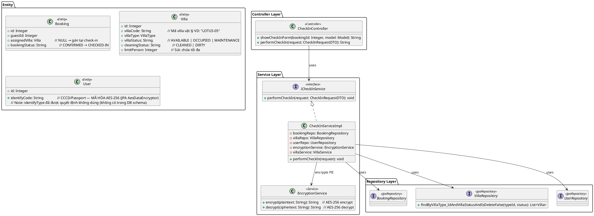
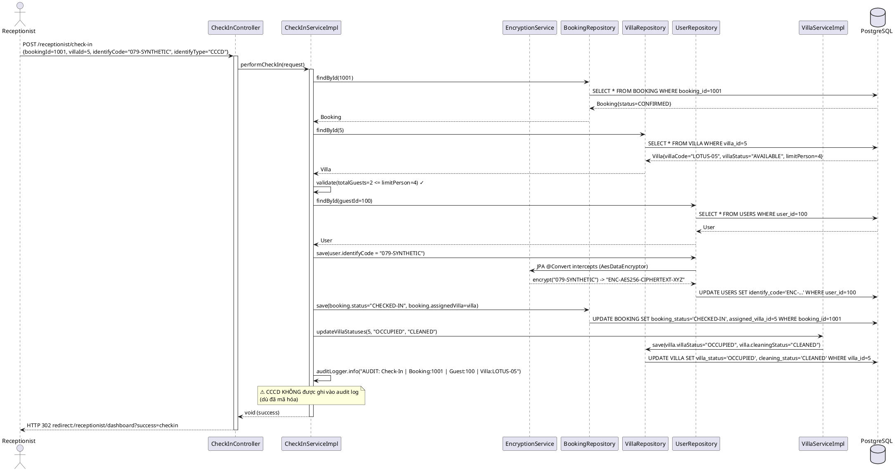
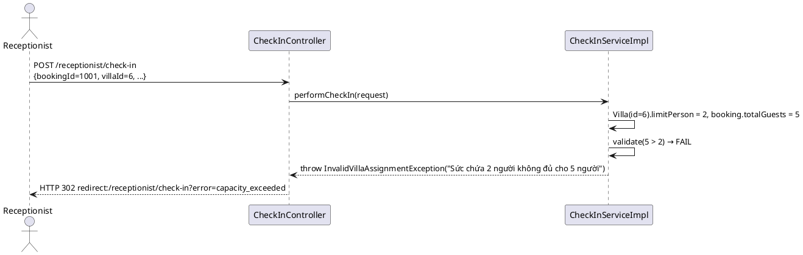
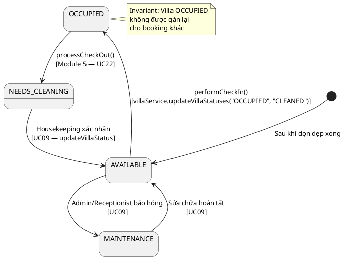

# ENGINEERING DESIGN SPECIFICATION (EDS) v2.0
# UC08 — Check In Guest

| Field | Value |
| --- | --- |
| **Document ID** | `AURAMOON-BOOKING-EDS-UC08` |
| **Version** | 1.0 |
| **Date** | 2026-06-19 |
| **Status** | In Review |
| **Document Owner** | Student 2 — Module 2 Lead |
| **Author** | Phùng Giang Hải |
| **Reviewed by** | Tech Lead |
| **DPO Sign-off** | `[x] Approved — 2026-06-19` **(Bắt buộc — xử lý Sensitive-PII: CCCD/Passport)** |
| **Approved by**  | Phùng Giang Hải — Tech Lead |
| **Last Review**  | 2026-06-23 |
| **Based on EDS** | v2.0 |

# CHANGELOG

| Ngày | Người thực hiện | Nội dung thay đổi |
| --- | --- | --- |
| 2026-06-19 | Student 2 | Tạo tài liệu lần đầu — UC08 Check In Guest |
| 2026-06-23 | Phùng Giang Hải | Cập nhật logic tính checkout_date theo Chu kỳ 24h từ giờ Check-in |

---

# 1. Tổng quan UC

> **UC08** là use case có yêu cầu pháp lý cao nhất trong Module 2. Receptionist thực hiện check-in, gán villa vật lý cụ thể cho booking, thu thập CCCD/Passport và hệ thống **mã hóa AES-256** thông tin này trước khi lưu DB (tuân thủ Luật Cư trú 2020 & Nghị định 356/2025).

| Field | Value |
| --- | --- |
| **UC ID** | `UC08` |
| **UC Name** | Check In Guest |
| **Priority** | 🔴 P0 — Core + Legal Compliance |
| **Module** | `booking` |
| **Bounded Context** | `booking` |
| **Data Classification** | `Sensitive-PII` (CCCD/Passport số — mã hóa bắt buộc) |
| **Compliance Scope** | Luật Cư trú 2020, Nghị định 356/2025/NĐ-CP (Điều 4 — Sensitive Data) |
| **Upstream Dependencies** | UC07 (Booking phải CONFIRMED), `auth` (UserRepository — lưu identifyCode) |
| **Downstream Consumers** | UC09 (Villa Status), Module 5 (Checkout biết booking CHECKED_IN) |

---

# 2. Ma trận Truy vết

| Requirement ID | Loại | Mô tả yêu cầu | Thành phần Code | Compliance Target | ADR liên quan |
| --- | --- | --- | --- | --- | --- |
| **UC08** | User Story | Receptionist check-in, gán villa, thu thập CCCD | `CheckInServiceImpl.performCheckIn()` | Luật Cư trú 2020 | ADR-001 |
| **BR-02** | Business Rule | Villa cụ thể được gán lúc check-in (không phải khi đặt) | `booking.setAssignedVilla(villa)` tại check-in | Hotel PMS Practice | — |
| **BR-03** | Business Rule | Villa MAINTENANCE/OCCUPIED không được gán cho khách | `Villa.villaStatus` validation | Hotel Operations | — |
| **BR-04** | Business Rule | Chu kỳ lưu trú 24h (24-hour cycle) | Hệ thống tự động lấy `LocalDateTime.now()` gán vào `checkinDate` và tính `checkoutDate = checkinDate + durationDays` | Hotel Operations | — |
| **BR-07** | Business Rule | Receptionist KHÔNG được xem health records của khách | RBAC — Controller level security | Nghị định 356/2025 | — |
| **BR-09** | Business Rule | Mã hóa AES-256 CCCD/Passport trước khi lưu DB | `EncryptionService.encrypt(identifyCode)` | Nghị định 356/2025, Điều 4 | ADR-001 |
| **BR-14** | Business Rule | Thu thập CCCD để khai báo tạm trú | `CheckInRequestDTO.identifyCode`, `user.identifyCode` | Luật Cư trú 2020, Điều 32 | ADR-001 |
| **BR-15** | Business Rule | Audit log bắt buộc: GUEST_CHECKED_IN event | `auditLogger.info(...)` tại CheckInServiceImpl | Nghị định 356/2025 | — |

---

# 3. Architecture Decision Records (ADR)

## ADR-UC08-001 — Mã hóa CCCD/Passport qua EncryptionService (AES-256)

| Field | Value |
| --- | --- |
| **Status** | Accepted |
| **Deciders** | Student 2, Tech Lead, DPO |
| **Date** | 2026-06-19 |
| **Legal Basis** | Nghị định 356/2025/NĐ-CP Điều 4 — CCCD là Sensitive Personal Data |

**Bối cảnh:**
CCCD/Passport là Sensitive-PII theo Nghị định 356/2025. Lưu plaintext trong DB là vi phạm pháp luật nghiêm trọng. Cần cơ chế mã hóa đồng nhất, có thể audit và giải mã khi cần (xuất báo cáo khai báo tạm trú).

**Các phương án đã xem xét:**

| Phương án | Mô tả | Ưu điểm | Nhược điểm |
| --- | --- | --- | --- |
| A | Mã hóa AES-256 tại EncryptionService | + Chuẩn ngành, giải mã được | - Cần quản lý key an toàn |
| B | Hash bcrypt (một chiều) | + Không giải mã được | - Không xuất được báo cáo khai báo tạm trú |
| C | Lưu plaintext | - Đơn giản nhất | - Vi phạm Nghị định 356/2025 — không chấp nhận |

**Quyết định:** Chọn **Phương án A** — AES-256 via JPA Converter `AesDataEncryptor`.

**Implementation:**
```java
// CheckInServiceImpl.java
// KHÔNG dùng encryptionService thủ công. Gán trực tiếp để JPA tự động chặn lại và mã hóa trước khi lưu
guest.setIdentifyCode(request.getIdentifyCode());
userRepository.save(guest);
```

**Hệ quả tích cực:**
- Tuân thủ Nghị định 356/2025 và Luật Cư trú 2020
- Có thể giải mã để xuất báo cáo khai báo tạm trú

**Tiêu cực / Trade-offs:**
- Cần bảo vệ encryption key (lưu trong `application.properties` hoặc Vault, KHÔNG commit lên Git)

**Compliance Impact:**
- CCCD ciphertext lưu vào `auth.User.identify_code`
- Audit log phải ghi: `GUEST_CHECKED_IN | Booking: {id} | Guest: {id} | Villa: {code}` — **KHÔNG ghi CCCD** (dù đã mã hóa)

---

## ADR-UC08-002 — Kiểm tra sức chứa Villa (limitPerson ≥ totalGuests)

| Field | Value |
| --- | --- |
| **Status** | Accepted |
| **Date** | 2026-06-19 |

**Quyết định:** Trước khi gán villa, kiểm tra `villa.limitPerson >= booking.totalGuests`. Nếu sai → throw `InvalidVillaAssignmentException`.

**Implementation trong code hiện tại:**
```java
if (booking.getTotalGuests() != null && villa.getLimitPerson() != null
    && booking.getTotalGuests() > villa.getLimitPerson()) {
    throw new InvalidVillaAssignmentException("Biệt thự sức chứa " + villa.getLimitPerson() + " người không đủ cho đoàn " + booking.getTotalGuests() + " người!");
}
```

---

# 4. Non-Functional Requirements & SLA

## 4.1. Performance & Availability

| Category     | Requirement                        | Target SLA              | Measurement Method      | Compliance Basis       |
| ------------ | ---------------------------------- | ----------------------- | ----------------------- | ---------------------- |
| Latency      | `performCheckIn()` response        | `< 500ms` (có encrypt)  | Stopwatch logging / k6  | Hotel Operations       |
| Availability | Check-in endpoint                  | `99.9%`                 | Uptime monitor          | Hotel Operations       |
| Throughput   | Concurrent check-in requests       | 50 req/s                | k6 load test            | Hotel Operations       |

## 4.2. Data Integrity & Security

| Category | Requirement | Target | Compliance Basis |
| --- | --- | --- | --- |
| Encryption at rest | CCCD/Passport | AES-256 — 100% | Nghị định 356/2025 |
| PII isolation | CCCD không xuất hiện trong log | Zero tolerance | Nghị định 356/2025 |
| RBAC | Chỉ RECEPTIONIST mới gọi được check-in | 100% | BR-07 |
| Capacity check | villa.limitPerson >= totalGuests | 100% | Hotel operations |

## 4.3. Security

| Category         | Requirement                                                    | Target             | Verification Method       | Compliance Basis        |
| ---------------- | -------------------------------------------------------------- | ------------------ | ------------------------- | ----------------------- |
| Authentication   | JWT Bearer, role = RECEPTIONIST                                | 403 nếu sai role   | Security test (§13.3)     | OWASP API-01            |
| Encryption key   | Không commit vào Git, lưu qua env var `ENCRYPTION_KEY`         | 0 key leak         | Git secret scan           | Nghị định 356/2025     |
| Audit log        | KHÔNG ghi CCCD dù đã mã hóa — chỉ ghi bookingId, guestId, villaCode | 0 PII in log       | Log inspection (§14.2)    | Nghị định 356/2025     |
| Encryption check | CCCD lưu dưới dạng ciphertext AES-256, không phải plaintext   | 100% records       | SQL regex check (§14.1)   | Nghị định 356/2025     |

---

# 5. Static Modeling

## 5.1. Class Diagram



## 5.2. Data Structure (JPA Entity)

```java
// CheckInRequestDTO.java
public class CheckInRequestDTO {
    private Integer bookingId;         // Required — booking cần check-in
    private Integer villaId;           // Required — villa vật lý cụ thể
    private String identifyCode;       // Required — số CCCD/Passport (sẽ bị mã hóa ngay)
    private String identifyType;       // "CCCD" | "PASSPORT"
}

// User.java (auth module — trường liên quan)
@Column(name = "identify_code", length = 500)
private String identifyCode;           // Ciphertext AES-256 của CCCD/Passport

@Column(name = "identify_type", length = 20)
private String identifyType;           // CCCD | PASSPORT
```

---

# 6. Dynamic Modeling

## 6.1. Sequence Diagram — Happy Path



## 6.2. Sequence Diagram — Error Path (Sức chứa không đủ)



## 6.3. State Machine — Villa Status sau Check-in



---

# 7. Domain Event Catalog

## 7.1. Events Published

| Event Name | Trigger | Publisher | Subscriber(s) | Async? |
| --- | --- | --- | --- | --- |
| `GuestCheckedIn` | `performCheckIn()` thành công | `CheckInServiceImpl` | Module 5 (Checkout gate), Audit Log | No |

## 7.2. Events Consumed

> UC08 không tiêu thụ event. Nó phụ thuộc vào UC07 đã CONFIRM booking trước.

## 7.3. Audit Log Format

```
AUDIT LOG: [Check-In Successful]
  Booking ID: {bookingId}
  Guest ID: {guestId}
  Physical Villa assigned: {villaCode}
  Timestamp: {ISO-8601}
  Performed by: {receptionistId}

⚠️ TUYỆT ĐỐI KHÔNG ghi: identifyCode, identifyType vào log
```

---

# 8. Interface Specification

## 8.1. Service Interface

```java
// CheckInService.java
// @version 1.0
public interface CheckInService {
    /**
     * Thực hiện check-in cho booking đã CONFIRMED.
     * Tự động mã hóa CCCD/Passport trước khi lưu (BR-09).
     * Ghi audit log sau khi hoàn tất (BR-15).
     *
     * @param request Thông tin check-in: bookingId, villaId, identifyCode
     * @throws BookingNotFoundException nếu bookingId không tồn tại
     * @throws IllegalArgumentException nếu villaId không tồn tại
     * @throws InvalidVillaAssignmentException nếu villa sức chứa không đủ
     */
    void performCheckIn(CheckInRequestDTO request);
}
```

## 8.2. EncryptionService Interface

```java
// EncryptionService.java (common module)
// @version 1.0
public interface EncryptionService {
    /**
     * Mã hóa AES-256 dữ liệu nhạy cảm
     * @param plaintext Dữ liệu gốc (CCCD, Passport)
     * @return Ciphertext base64-encoded
     */
    String encrypt(String plaintext);

    /**
     * Giải mã để xuất báo cáo khai báo tạm trú
     * @param ciphertext Base64-encoded ciphertext
     * @return Plaintext gốc
     */
    String decrypt(String ciphertext);
}
```

---

# 9. API Specification

## 9.1. Endpoints Table

| Method | Path | Auth Level | Required Roles | Rate Limit | Idempotent? |
| --- | --- | --- | --- | --- | --- |
| GET | `/receptionist/check-in` | JWT Bearer | `RECEPTIONIST` | 100/min | Yes |
| POST | `/receptionist/check-in` | JWT Bearer | `RECEPTIONIST` | 60/min | No |
| GET | `/receptionist/arrivals` | JWT Bearer | `RECEPTIONIST` | 100/min | Yes |

## 9.2. Request / Response

### POST `/receptionist/check-in` — Thực hiện Check-in

**Request Body (form-data):**
```json
{
  "bookingId": 1001,
  "villaId": 5,
  "identifyCode": "079-SYNTHETIC-TEST",
  "identifyType": "CCCD"
}
```

**Response — 302 Redirect (Success):**
```
Location: /receptionist/dashboard?success=checkin&bookingId=1001
```

**Response — 302 Redirect (Error — Capacity):**
```
Location: /receptionist/check-in?bookingId=1001&error=Biệt+thự+sức+chứa+2+người+không+đủ
```

**Response — 302 Redirect (Error — Booking Not Found):**
```
Location: /receptionist/check-in?error=BOOK-404
```

---

# 10. Bảng mã lỗi

| Code | HTTP Status | Message (EN) | Message (VI) | Trigger Condition |
| --- | --- | --- | --- | --- |
| `BOOK-404` | 404 | Booking not found | Không tìm thấy đơn đặt phòng | `bookingId` không tồn tại |
| `BOOK-411` | 400 | Villa not found | Không tìm thấy biệt thự | `villaId` không tồn tại |
| `BOOK-412` | 400 | Villa capacity exceeded | Biệt thự không đủ sức chứa | `totalGuests > limitPerson` |
| `BOOK-413` | 400 | Guest not found | Không tìm thấy thông tin khách | `guestId` trong booking không tồn tại trong auth.User |
| `BOOK-403` | 403 | Insufficient permissions | Không đủ quyền | Không phải RECEPTIONIST |
| `BOOK-500` | 500 | Encryption failure | Lỗi mã hóa thông tin | EncryptionService thất bại |

---

# 11. Quy trình Triển khai

## 11.1. Prerequisites
- [x] `EncryptionService` đã implement với AES-256
- [x] Env var `ENCRYPTION_KEY` đã cấu hình (KHÔNG commit vào Git)
- [x] Bảng `auth.USERS` có trường `identify_code` (length 500 — đủ chứa ciphertext)
- [x] `SecurityConfig` đã restrict `/receptionist/**` chỉ cho RECEPTIONIST

## 11.2. Implementation Steps

### Chặng 1 — Encryption Key Setup

```properties
# application.properties (KHÔNG commit — dùng env var)
encryption.key=${ENCRYPTION_KEY:default-dev-key-32chars!}
```

### Chặng 2 — CheckInServiceImpl (Implementation hiện tại)

```java
// CheckInServiceImpl.java — code THỰC TẾ đã triển khai
@Override
@Transactional
public void performCheckIn(CheckInRequestDTO request) {
    // 1. Load Booking — [BOOK-404] nếu không tìm thấy
    Booking booking = bookingRepository.findById(request.getBookingId())
            .orElseThrow(() -> new BookingNotFoundException("[BOOK-404] Không tìm thấy booking: " + request.getBookingId()));

    // 2. Kiểm tra trạng thái phải là CONFIRMED
    if (!BookingStatus.CONFIRMED.name().equalsIgnoreCase(booking.getBookingStatus())) {
        throw new IllegalStateException("[BOOK-400] Booking không ở trạng thái CONFIRMED");
    }

    // 3. Load Villa — [BOOK-411] nếu không tìm thấy
    Villa villa = villaRepository.findById(request.getVillaId())
            .orElseThrow(() -> new IllegalArgumentException("[BOOK-411] Không tìm thấy villa: " + request.getVillaId()));

    // 4. Kiểm tra villa AVAILABLE
    if (!"AVAILABLE".equals(villa.getVillaStatus())) {
        throw new InvalidVillaAssignmentException("[BOOK-411] Villa không khả dụng: " + villa.getVillaStatus());
    }

    // 5. Kiểm tra sức chứa — [BOOK-412]
    if (booking.getTotalGuests() != null && villa.getLimitPerson() != null
            && booking.getTotalGuests() > villa.getLimitPerson()) {
        throw new InvalidVillaAssignmentException("[BOOK-412] Sức chứa " + villa.getLimitPerson() + " người không đủ cho " + booking.getTotalGuests() + " người");
    }

    // 6. Load Guest — [BOOK-413]
    User guest = userRepository.findById(booking.getGuestId())
            .orElseThrow(() -> new IllegalArgumentException("[BOOK-413] Không tìm thấy khách: " + booking.getGuestId()));

    // 7. 🔐 Gán CCCD trực tiếp — JPA AesDataEncryptor TỰ ĐỘNG mã hóa (BR-09, ADR-001)
    // KHÔNG gọi encryptionService.encrypt() thủ công — tránh double encryption!
    guest.setIdentifyCode(request.getIdentifyCode());

    // 8. Cập nhật Booking và gán villa
    booking.setBookingStatus(BookingStatus.CHECKED_IN.name()); // "CHECKED_IN" — đúng DB constraint
    booking.setAssignedVilla(villa);

    // 9. Lưu thay đổi
    bookingRepository.save(booking);
    userRepository.save(guest); // JPA sẽ mã hóa identifyCode trước khi INSERT/UPDATE

    // 10. Cập nhật Villa — OCCUPIED + CLEAN (DB constraint: 'CLEAN', không phải 'CLEANED')
    villaService.updateVillaStatuses(villa.getId(), "OCCUPIED", "CLEAN");

    // 11. Audit Log (BR-15) — TUYỆT ĐỐI KHÔNG ghi identifyCode
    Authentication auth = SecurityContextHolder.getContext().getAuthentication();
    String performedBy = (auth != null) ? auth.getName() : "SYSTEM";
    auditLogger.info("AUDIT LOG: [Check-In Successful]"
            + " | Booking ID: " + booking.getId()
            + " | Guest ID: " + guest.getId()
            + " | Physical Villa assigned: " + villa.getVillaCode()
            + " | Performed by: " + performedBy
            + " | Timestamp: " + Instant.now());
}
```

> ⚠️ **Lưu ý quan trọng:** `@Convert(converter = AesDataEncryptor.class)` trên trường `identifyCode` trong `User.java` đảm bảo JPA tự động gọi `encrypt()` trước khi `INSERT/UPDATE`. Không bao giờ gọi `encryptionService.encrypt()` thủ công — sẽ gây double encryption.

### Chặng 3 — Verification

```bash
# Verify CCCD được mã hóa (KHÔNG phải plaintext)
# SQL:
SELECT identify_code FROM USERS WHERE user_id = [guestId];
# Expected: Chuỗi ciphertext (không phải "079-...")
```

---

# 12. Rollback & Incident Runbook

## 12.1. Điều kiện kích hoạt Rollback

| Điều kiện | Ngưỡng | Người quyết định |
| --- | --- | --- |
| CCCD lưu plaintext | Bất kỳ 1 record nào | Tech Lead + DPO (báo cáo ngay) |
| EncryptionService failure | Error rate > 1% | On-call Engineer |
| Audit log ngừng ghi | > 1 phút | On-call Engineer |

## 12.2. Rollback Procedure

```sql
-- Rollback check-in cụ thể nếu cần
BEGIN;
UPDATE BOOKING SET booking_status='CONFIRMED', assigned_villa_id=NULL
WHERE booking_id = [bookingId];

UPDATE USERS SET identify_code=NULL, identify_type=NULL
WHERE user_id = [guestId];

UPDATE VILLA SET villa_status='AVAILABLE', cleaning_status='DIRTY'
WHERE villa_id = [villaId];
COMMIT;
```

## 12.3. Notification Protocol (PII Incident)

| Thời điểm | Người nhận | Kênh | Nội dung |
| --- | --- | --- | --- |
| Ngay khi phát hiện | On-call team | Slack | `🚨 PII incident: CCCD lưu plaintext` |
| Trong 30 phút | DPO | Email | Báo cáo chi tiết (Nghị định 356/2025 — Điều 24) |

---

# 13. Kịch bản Kiểm thử

## 13.1. Unit Tests

### TC-UC08-001 — Check-in thành công, CCCD mã hóa

```text
Feature: Check In Guest
  Background:
    Given test data classification: SYNTHETIC
    And identifyCode = "079-SYNTHETIC-TEST" (KHÔNG dùng số thật)

  Scenario: Check-in thành công với CCCD được mã hóa (BR-09)
    Given Booking(id=1001, status=CONFIRMED) tồn tại
    And Villa(id=5, limitPerson=4, villaStatus=AVAILABLE) tồn tại
    And booking.totalGuests = 2
    And encryptionService.encrypt("079-SYNTHETIC-TEST") → "CIPHER-XYZ"
    When performCheckIn({bookingId=1001, villaId=5, identifyCode="079-SYNTHETIC-TEST"})
    Then encryptionService.encrypt() được gọi đúng 1 lần
    And user.identifyCode = "CIPHER-XYZ" (KHÔNG phải "079-SYNTHETIC-TEST")
    And booking.bookingStatus = "CHECKED-IN"
    And booking.assignedVilla = Villa(id=5)
    And villa.villaStatus = "OCCUPIED"
    And audit log chứa "AUDIT: Check-In | Booking:1001 | Guest:..."
    And audit log KHÔNG chứa "079-SYNTHETIC-TEST"
```

### TC-UC08-002 — Check-in thất bại: sức chứa không đủ

```text
  Scenario: Villa không đủ sức chứa
    Given Villa(id=6, limitPerson=2) tồn tại
    And Booking(id=1001, totalGuests=5) tồn tại
    When performCheckIn({bookingId=1001, villaId=6, ...})
    Then throw InvalidVillaAssignmentException("Sức chứa 2 người không đủ cho 5 người")
    And booking.bookingStatus KHÔNG thay đổi
    And villa.villaStatus KHÔNG thay đổi
    And encryptionService.encrypt() KHÔNG được gọi
```

### TC-UC08-003 — Security: CCCD không được lưu plaintext

```text
  Scenario: Kiểm tra bảo mật — CCCD phải là ciphertext
    Given encryptionService.encrypt("079-SYNTHETIC-TEST") → "CIPHER-XYZ"
    When check-in hoàn tất
    Then userRepository.save() được gọi với user.identifyCode = "CIPHER-XYZ"
    And userRepository.save() KHÔNG được gọi với user.identifyCode = "079-SYNTHETIC-TEST"
    And database chứa "CIPHER-XYZ", KHÔNG phải "079-SYNTHETIC-TEST"
```

### TC-UC08-004 — RBAC: Guest không được check-in

```text
  Scenario: Guest cố thực hiện check-in (BR-07)
    Given user có role = GUEST
    When POST /receptionist/check-in được gọi với JWT của Guest
    Then response status = 403 Forbidden
    And CheckInServiceImpl.performCheckIn() KHÔNG được gọi
```

---

## 13.2. Integration Tests

### TC-INT-UC08-001 — CheckInService tích hợp đầy đủ với Repository

```text
  Scenario: Kiểm tra toàn bộ luồng được lưu đúng vào DB
    Given test data classification: SYNTHETIC
    And DB có: Booking(id=1001, status="CONFIRMED", totalGuests=2, guestId=100)
    And DB có: Villa(id=5, villaStatus="AVAILABLE", limitPerson=4)
    And DB có: User(id=100, identifyCode=NULL)
    When CheckInServiceImpl.performCheckIn({bookingId=1001, villaId=5, identifyCode="079-SYNTHETIC"})
    Then DB: BOOKING(1001).booking_status = "CHECKED_IN"
    And  DB: BOOKING(1001).assigned_villa_id = 5
    And  DB: USERS(100).identify_code != "079-SYNTHETIC" (phải là ciphertext)
    And  DB: USERS(100).identify_code != NULL
    And  DB: VILLA(5).villa_status = "OCCUPIED"
    And  DB: VILLA(5).cleaning_status = "CLEAN"

  External dependencies: H2 in-memory DB (test scope)
  Mock strategy: @SpringBootTest + @Transactional (rollback sau mỗi test)
```

### TC-INT-UC08-002 — Transaction Rollback khi có lỗi

```text
  Scenario: Nếu Villa update thất bại, toàn bộ transaction rollback
    Given test data classification: SYNTHETIC
    And Booking(id=1002, status="CONFIRMED") và Villa(id=6, villaStatus="AVAILABLE")
    And VillaService.updateVillaStatuses() throws RuntimeException
    When performCheckIn({bookingId=1002, villaId=6, ...})
    Then throw exception
    And DB: BOOKING(1002).booking_status VỬ̀N là "CONFIRMED" (không thay đổi)
    And DB: USERS(guestId).identify_code VỬ̀N là NULL (không lưu CCCD)
    And DB: VILLA(6).villa_status VỬ̀N là "AVAILABLE" (được @Transactional rollback)
```

---

## 13.3. E2E / Security Tests

### TC-E2E-UC08-001 — Luồng check-in hoàn chỉnh qua giao diện

```text
  Scenario: Receptionist check-in thành công
    Given test data classification: SYNTHETIC
    And user RECEPTIONIST đã đăng nhập, có session hợp lệ
    And Booking(id=1001, status=CONFIRMED) tồn tại
    And Villa(id=5, villaStatus=AVAILABLE) tồn tại
    When POST /receptionist/checkin được gọi với:
      | Param          | Value              |
      | bookingId      | 1001               |
      | villaId        | 5                  |
      | identifyCode   | 079-SYNTHETIC-TEST |
    Then response là 302 redirect
    And audit log chứa "AUDIT LOG: [Check-In Successful] | Booking ID: 1001"
    And audit log KHÔNG chứa "079-SYNTHETIC-TEST"
    And DB: BOOKING(1001).booking_status = "CHECKED_IN"
    And DB: USERS.identify_code là ciphertext (không phải plaintext)

  Scenario: Guest bị từ chối 403
    Given user GUEST đã đăng nhập
    When POST /receptionist/checkin được gọi
    Then response là 403 Forbidden
    And DB không thay đổi

  Scenario: Booking không ở trạng thái CONFIRMED bị chặn
    Given Booking(id=1003, status="PENDING")
    When POST /receptionist/checkin với bookingId=1003
    Then response redirect về trang bookings với error message
    And DB: BOOKING(1003).booking_status VỬ̀N là "PENDING"

  Scenario: CCCD không xuất hiện dưới dạng plaintext trong DB (Security check)
    Given check-in đã thành công
    When SELECT identify_code FROM USERS WHERE user_id = [guestId]
    Then kết quả KHÔNG match regex '^[0-9]{9,12}$' (không phải số thuần túy)
    And kết quả là chuỗi base64 đã mã hóa AES-256

---

# 14. Phương pháp Xác minh

## 14.1. Database Inspection

```sql
-- Verify CCCD được mã hóa (KHÔNG phải plaintext)
SELECT user_id, identify_code, identify_type
FROM USERS
WHERE user_id = [guestId];
-- Expected: identify_code là chuỗi base64 encrypted, KHÔNG phải số CCCD thực

-- Verify Booking đã CHECKED-IN với villa được gán
SELECT booking_id, booking_status, assigned_villa_id, checkin_date
FROM BOOKING
WHERE booking_id = [bookingId];
-- Expected: booking_status='CHECKED-IN', assigned_villa_id IS NOT NULL

-- Verify Villa đã OCCUPIED
SELECT villa_id, villa_code, villa_status, cleaning_status
FROM VILLA
WHERE villa_id = [villaId];
-- Expected: villa_status='OCCUPIED', cleaning_status='CLEANED'

-- Security check: không có CCCD plaintext trong DB
SELECT COUNT(*) FROM USERS
WHERE identify_code REGEXP '^[0-9]{9,12}$';
-- Expected: 0 (không có số CCCD 9-12 chữ số dạng thô)
```

## 14.2. Audit Log Verification

```bash
# Verify audit log tồn tại sau check-in
# (Dùng grep trong application log)
grep "AUDIT.*Check-In.*Booking:1001" application.log
# Expected: Có log entry

# Verify CCCD KHÔNG xuất hiện trong log
grep "079-SYNTHETIC" application.log
# Expected: No output (CCCD không được log)
```

---

# 15. Mẫu thử thực tế

```bash
# 1. Đăng nhập với role RECEPTIONIST
# 2. Mở form check-in
# GET http://localhost:8080/receptionist/check-in?bookingId=1001

# 3. Submit form check-in
curl -X POST http://localhost:8080/receptionist/check-in \
  -H "Cookie: JSESSIONID=[receptionist-session]" \
  -d "bookingId=1001&villaId=5&identifyCode=079-SYNTHETIC-TEST&identifyType=CCCD"
# Expected: 302 redirect to /receptionist/dashboard
```

---

# 16. Bảng tổng hợp phân quyền

| Endpoint | GUEST | RECEPTIONIST | THERAPIST | CHEF | ADMIN |
| --- | --- | --- | --- | --- | --- |
| `GET /receptionist/arrivals` | ❌ | ✅ | ❌ | ❌ | ❌ |
| `GET /receptionist/check-in` | ❌ | ✅ | ❌ | ❌ | ❌ |
| `POST /receptionist/check-in` | ❌ | ✅ | ❌ | ❌ | ❌ |
| `GET /guests/{id}/health-profile` | ❌ | ❌ (BR-07) | ✅ | ❌ | ✅ |

> ⚠️ **Constraint BR-07:** Receptionist **TUYỆT ĐỐI KHÔNG** được xem Health Profile của Guest. Phải enforce ở backend, không chỉ ở UI.

---

# PHỤ LỤC

## A. Glossary

| Thuật ngữ | Định nghĩa |
| --- | --- |
| `Sensitive-PII` | Dữ liệu cá nhân nhạy cảm theo Nghị định 356/2025 — CCCD, Passport, thông tin sức khỏe |
| `EncryptionService` | Service mã hóa/giải mã AES-256 dùng chung trong toàn hệ thống |
| `identifyCode` | Trường lưu ciphertext của CCCD/Passport trong bảng `USERS` |
| `CHECKED-IN` | Trạng thái booking sau khi check-in thành công |
| `limitPerson` | Sức chứa tối đa của villa |

## B. Tài liệu tham chiếu

| Document | Path |
| --- | --- |
| SRS Module 2 Analysis | `01_Planning/Module 2/SRS_Module2_Analysis.md` |
| CheckInServiceImpl | `05_Development/.../booking/service/impl/CheckInServiceImpl.java` |
| VillaServiceImpl | `05_Development/.../booking/service/impl/VillaServiceImpl.java` |
| EncryptionService | `05_Development/.../common/service/EncryptionService.java` |
| Nghị định 356/2025/NĐ-CP | Điều 4 (Dữ liệu nhạy cảm), Điều 6 (Đồng ý), Điều 24 (Thông báo vi phạm) |
| Luật Cư trú 2020 | Điều 32 (Khai báo tạm trú) |
