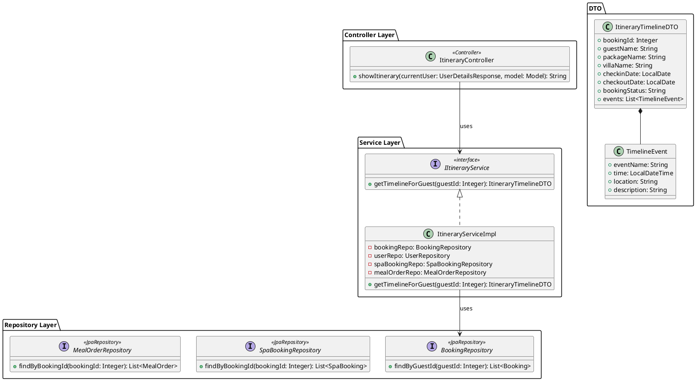
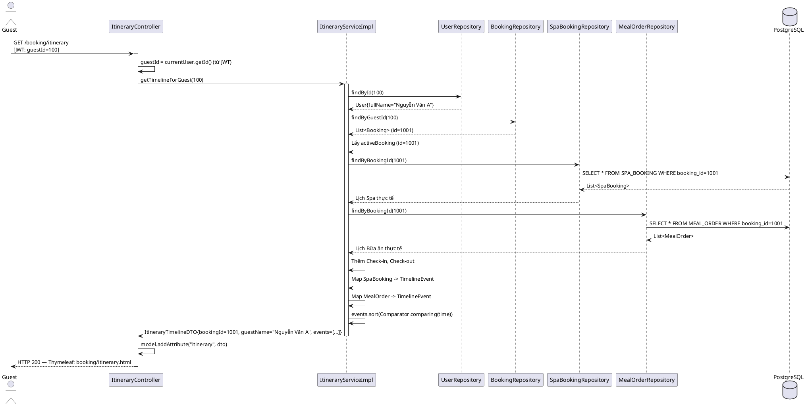
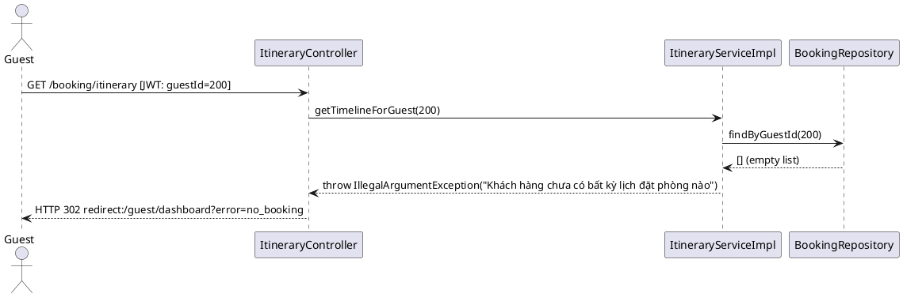
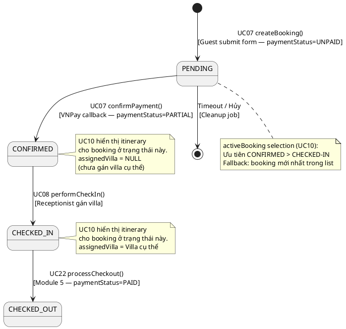

# ENGINEERING DESIGN SPECIFICATION (EDS) v2.0

# UC10 — View Booking Details & Itinerary Timeline

| Field                    | Value                                                                       |
| ------------------------ | --------------------------------------------------------------------------- |
| **Document ID**    | `AURAMOON-BOOKING-EDS-UC10`                                               |
| **Version**        | 1.0                                                                         |
| **Date**           | 2026-06-19                                                                  |
| **Status**         | In Review                                                      |
| **Document Owner** | Lê Trà My — Module 2 Lead                                  |
| **Author**         | Phùng Giang Hải                                            |
| **Reviewed by**    | Phùng Giang Hải                                              |
| **DPO Sign-off**   | `[x] Approved` — Chỉ hiển thị dữ liệu của chính Guest (IDOR-safe) |
| **Approved by**    | Phùng Giang Hải — Tech Lead                               |
| **Last Review**    | 2026-06-23                                                  |
| **Based on EDS**   | v2.0                                                                        |

# CHANGELOG

| Ngày      | Người thực hiện | Nội dung thay đổi                                                         |
| ---------- | ------------------- | ---------------------------------------------------------------------------- |
| 2026-06-19 | Student 2           | Tạo tài liệu lần đầu — UC10 View Booking Details & Itinerary Timeline |
| 2026-06-23 | Phùng Giang Hải     | Cập nhật chỉ hiển thị Check-out nếu checkoutDate không null |

---

# 1. Tổng quan UC

> **UC10** cho phép Guest xem toàn bộ thông tin booking của mình và lịch trình kỳ nghỉ (Itinerary Timeline). Timeline này được tổng hợp **động (dynamic)** dựa trên các dữ liệu thực tế do Guest đã đặt bao gồm: Check-in, Check-out (từ bảng `Booking`), các lịch hẹn Spa (từ bảng `Spa_Booking`), và các bữa ăn đã chọn (từ bảng `Meal_Order`).

| Field                           | Value                                                                     |
| ------------------------------- | ------------------------------------------------------------------------- |
| **UC ID**                 | `UC10`                                                                  |
| **UC Name**               | View Booking Details & Itinerary Timeline                                 |
| **Module**                | `booking`                                                               |
| **Bounded Context**       | `booking`                                                               |
| **Data Classification**   | `PII` (guestName, bookingId — của chính Guest)                       |
| **Compliance Scope**      | IDOR Prevention — Guest chỉ xem booking của chính mình               |
| **Upstream Dependencies** | UC07 (Booking), UC11 (Spa_Booking), UC16 (Meal_Order)                     |
| **Downstream Consumers**  | Không có downstream — Read-only view                                   |

---

# 2. Ma trận Truy vết

| Requirement ID    | Loại      | Mô tả yêu cầu                        | Thành phần Code                                   | Compliance Target | ADR liên quan |
| ----------------- | ---------- | ---------------------------------------- | --------------------------------------------------- | ----------------- | -------------- |
| **UC10**    | User Story | Guest xem booking và itinerary timeline động | `ItineraryServiceImpl.getTimelineForGuest()`      | IDOR Prevention   | ADR-UC10-001   |
| **BR-IDOR** | Security   | Guest chỉ xem booking của chính mình | Controller lấy guestId từ JWT, không từ request | OWASP API-01      | ADR-UC10-002   |

---

# 3. Architecture Decision Records (ADR)

## ADR-UC10-001 — Itinerary được tổng hợp động từ các thực thể thực tế (Spa, Meal)

| Field            | Value      |
| ---------------- | ---------- |
| **Status** | Accepted   |
| **Date**   | 2026-06-22 |

**Bối cảnh:**
Timeline của khách hàng cần phải phản ánh đúng thực tế những gì khách hàng đã đặt (VD: Khách tự chọn món ăn qua UC16, tự chọn giờ Spa qua UC11). Thiết kế cũ "generate tĩnh" từ template theo loại Package (Yoga, Detox) sẽ làm mất đi tính cá nhân hóa và sai lệch hoàn toàn với hệ thống.

**Quyết định:** 
Không dùng template tĩnh. `ItineraryServiceImpl` sẽ tổng hợp Timeline Event bằng cách:
1. Truy vấn `Booking` để tạo sự kiện Check-in, Check-out.
2. Truy vấn `SpaBookingRepository` để tạo các sự kiện đi Spa theo đúng giờ khách đã chọn.
3. Truy vấn `MealOrderRepository` để tạo các sự kiện bữa ăn theo đúng lịch khách chọn.
4. Gộp tất cả các sự kiện trên thành 1 danh sách, sau đó sắp xếp tăng dần theo thời gian (ASC).

**Hệ quả:**
- **Tích cực:** Phản ánh chính xác lịch trình cá nhân hóa của Guest (Code chuẩn động).
- **Tiêu cực:** Tăng số lượng queries xuống DB (cần query bảng `Spa_Booking` và `Meal_Order`). Cần đánh index trên `booking_id` của các bảng này.

---

## ADR-UC10-002 — IDOR Prevention: guestId từ JWT, không từ request param

| Field            | Value      |
| ---------------- | ---------- |
| **Status** | Accepted   |
| **Date**   | 2026-06-19 |

**Quyết định:** Controller lấy `guestId` từ `@AuthenticationPrincipal` (JWT), không nhận `guestId` từ query param hay request body. Điều này ngăn Guest A xem itinerary của Guest B.

```java
// Controller:
@GetMapping("/itinerary")
public String showItinerary(@AuthenticationPrincipal UserDetailsResponse currentUser, Model model) {
    Integer guestId = currentUser.getId(); // Từ JWT — không phải từ request param
    ItineraryTimelineDTO dto = itineraryService.getTimelineForGuest(guestId);
    model.addAttribute("itinerary", dto);
    return "booking/itinerary";
}
```

---

# 4. Non-Functional Requirements & SLA

## 4.1. Performance

| Category       | Requirement                  | Target SLA                              | Measurement Method            | Compliance Basis  |
| ------------- | ---------------------------- | --------------------------------------- | ----------------------------- | ----------------- |
| Latency       | `getTimelineForGuest()`    | `< 300ms` (bao gồm event generation) | Stopwatch / k6                | Hotel Operations  |
| Timeline size | Số events cho 7-day package | ~28 events (4 events/day × 7 ngày)    | Unit test đếm events          | Hotel Operations  |

## 4.2. Security

| Category       | Requirement                                                | Target                 | Verification Method     | Compliance Basis |
| -------------- | ---------------------------------------------------------- | ---------------------- | ----------------------- | ---------------- |
| IDOR           | guestId từ JWT — không từ request param (ADR-UC10-002) | 0 IDOR incidents       | Security test (§13.3)   | OWASP API-01     |
| Authentication | JWT Bearer, role = GUEST                                   | 403 nếu sai role       | Security test (§13.3)   | Hotel SOP        |
| PII isolation  | Không hiển thị CCCD, Health Profile trong itinerary     | 0 PII leak             | Manual review (§14.1)   | PDPA Art. 26     |

---

# 5. Static Modeling

## 5.1. Class Diagram



## 5.2. DTO Structure

```java
// ItineraryTimelineDTO.java
@Data @Builder
public class ItineraryTimelineDTO {
    private Integer bookingId;
    private String guestName;
    private String packageName;
    private String villaName;
    private LocalDate checkinDate;
    private LocalDate checkoutDate;
    private String bookingStatus;
    private List<TimelineEvent> events; // Sorted by time ASC

    @Data @Builder
    public static class TimelineEvent {
        private String eventName;           // Tên sự kiện
        private LocalDateTime time;         // Thời điểm (ngày + giờ)
        private String location;            // Địa điểm diễn ra
        private String description;         // Mô tả chi tiết
    }
}
```

---

# 6. Dynamic Modeling

## 6.1. Sequence Diagram — Happy Path



## 6.2. Sequence Diagram — Error Path (Không có booking)



## 6.3. State Machine — Booking Status Lifecycle (dùng bởi UC10)



**Quy tắc chọn `activeBooking` trong `ItineraryServiceImpl`:**

| Ưu tiên    | Điều kiện                       | Kết quả                           |
| ------------ | ---------------------------------- | ----------------------------------- |
| 1            | Có booking status =`CHECKED-IN` | Lấy booking đó                   |
| 2            | Có booking status =`CONFIRMED`  | Lấy booking đó                   |
| 3 (fallback) | Không có booking active          | Lấy booking cuối cùng trong list |

## 6.4. Logic Tổng hợp Event

Quy trình gom sự kiện:
1. **Check-in/Check-out**: Tạo 2 event tĩnh mặc định. 
   - Check-in: `checkinDate` lúc 14:00.
   - Check-out: `checkoutDate` lúc 12:00.
2. **Spa Events**: Lấy từ `Spa_Booking` có `status` khác `CANCELLED`.
   - Thời gian: `Spa_Booking.appointmentTime`
   - Tiêu đề: Tên `Spa_Service`
3. **Meal Events**: Lấy từ `Meal_Order` có `status` khác `CANCELLED`.
   - Thời gian: `Meal_Order.deliveryTime` hoặc `mealDate` kết hợp với loại bữa (Sáng/Trưa/Tối).
   - Tiêu đề: "Bữa ăn cá nhân hóa".

---

# 7. Domain Event Catalog

## 7.1. Events Published

> UC10 là **read-only**. Không phát ra event nào.

## 7.2. Events Consumed

> UC10 không tiêu thụ event. Nó đọc trực tiếp từ BookingRepository và UserRepository.

---

# 8. Interface Specification

## 8.1. Service Interface

```java
// ItineraryService.java
// @version 1.0
public interface ItineraryService {
    /**
     * Lấy Itinerary Timeline của Guest.
     * Tự động chọn booking active (CONFIRMED hoặc CHECKED-IN).
     * Generate events dựa trên packageType.
     *
     * @param guestId ID của Guest (từ JWT — IDOR-safe)
     * @throws IllegalArgumentException nếu guestId không tồn tại
     * @throws IllegalArgumentException nếu Guest chưa có booking nào
     * @return ItineraryTimelineDTO với danh sách events sắp xếp theo thời gian
     */
    ItineraryTimelineDTO getTimelineForGuest(Integer guestId);
}
```

## 8.2. Repository Interface

```java
// BookingRepository.java (mở rộng liên quan UC10)
public interface BookingRepository extends JpaRepository<Booking, Integer> {
    List<Booking> findByGuestId(Integer guestId);
}

// SpaBookingRepository.java
public interface SpaBookingRepository extends JpaRepository<SpaBooking, Integer> {
    List<SpaBooking> findByBookingId(Integer bookingId);
}

// MealOrderRepository.java
public interface MealOrderRepository extends JpaRepository<MealOrder, Integer> {
    List<MealOrder> findByBookingId(Integer bookingId);
}

// UserRepository.java
public interface UserRepository extends JpaRepository<User, Integer> {
    Optional<User> findById(Integer id);
}
```

---

# 9. API Specification

## 9.1. Endpoints Table

| Method | Path                   | Auth Level | Required Roles | Rate Limit | Idempotent? |
| ------ | ---------------------- | ---------- | -------------- | ---------- | ----------- |
| GET    | `/booking/itinerary` | JWT Bearer | `GUEST`      | 100/min    | Yes         |
| GET    | `/guest/dashboard`   | JWT Bearer | `GUEST`      | 100/min    | Yes         |

## 9.2. Response Schema

### GET `/booking/itinerary` — Itinerary Timeline

**Response — 200 OK (Thymeleaf Model):**

```json
{
  "itinerary": {
    "bookingId": 1001,
    "guestName": "Nguyễn Văn A",
    "packageName": "Detox Retreat 7 Days",
    "villaName": "Lotus Suite 01",
    "checkinDate": "2026-07-01",
    "checkoutDate": "2026-07-06",
    "bookingStatus": "CHECKED-IN",
    "events": [
      {
        "eventName": "Nhận phòng (Check-in)",
        "time": "2026-07-01T14:00:00",
        "location": "Sảnh Lễ tân",
        "description": "Nhận Villa và bắt đầu kỳ nghỉ dưỡng."
      },
      {
        "eventName": "Vận động Cardio nhẹ nhàng",
        "time": "2026-07-02T06:30:00",
        "location": "Bãi biển",
        "description": "Hoạt động đi bộ nhanh hoặc các bài tập vận động..."
      },
      {
        "eventName": "Bữa trưa Detox & Ít calorie",
        "time": "2026-07-02T12:00:00",
        "location": "Nhà hàng Thực dưỡng",
        "description": "Bữa trưa dinh dưỡng chuyên biệt..."
      },
      "...",
      {
        "eventName": "Trả phòng (Check-out)",
        "time": "2026-07-06T12:00:00",
        "location": "Sảnh Lễ tân",
        "description": "Hoàn tất thủ tục thanh toán Folio và check-out phòng."
      }
    ]
  }
}
```

**Response — 302 Redirect (No booking):**

```
Location: /guest/dashboard?error=no_booking
```

---

# 10. Bảng mã lỗi

| Code         | HTTP Status | Message (VI)                  | Trigger Condition                             |
| ------------ | ----------- | ----------------------------- | --------------------------------------------- |
| `ITIN-001` | 404         | Khách hàng không tồn tại | guestId từ JWT không tìm thấy trong DB    |
| `ITIN-002` | 404         | Chưa có đặt phòng nào   | guestId có trong DB nhưng chưa có booking |
| `ITIN-403` | 403         | Không đủ quyền            | Không phải GUEST role                       |

---

# 11. Quy trình Triển khai

## 11.1. Prerequisites

- [X] `ItineraryServiceImpl` đã implement
- [X] `BookingRepository.findByGuestId()` đã implement
- [X] Booking có `retreatPackage.typePackage` được set đúng
- [X] `ItineraryController` lấy `guestId` từ `@AuthenticationPrincipal` (ADR-UC10-002)
- [ ] ADR-UC10-001 và ADR-UC10-002 đã được Tech Lead review và Accepted

## 11.2. Pre-Migration Checklist

> UC10 là **read-only** — không có migration schema. Kiểm tra dữ liệu trước khi chạy:

- [X] Bảng `BOOKING` có cột `guest_id`, `package_id`, `booking_status`, `checkin_date`, `checkout_date`
- [X] Bảng `RETREAT_PACKAGE` có cột `type_package`
- [ ] Kiểm tra dữ liệu test có nhật giá trị `type_package` hợp lệ:

```sql
-- Verify các typePackage hiện tại trong DB
SELECT DISTINCT type_package FROM RETREAT_PACKAGE;
-- Expected: các giá trị như 'Stress Relief', 'Detox', 'Yoga', ...
```

## 11.2. Core Implementation (Cần sửa đổi)

```java
// ItineraryServiceImpl.getTimelineForGuest()
@Transactional(readOnly = true)
public ItineraryTimelineDTO getTimelineForGuest(Integer guestId) {
    // 1. Load user & booking active
    User guest = userRepository.findById(guestId).orElseThrow(...);
    List<Booking> bookings = bookingRepository.findByGuestId(guestId);
    if (bookings.isEmpty()) throw new IllegalArgumentException("Chưa có đặt phòng");

    Booking activeBooking = bookings.stream()
        .filter(b -> "CHECKED-IN".equals(b.getBookingStatus()) || "CONFIRMED".equals(b.getBookingStatus()))
        .findFirst()
        .orElse(bookings.get(bookings.size() - 1));

    List<TimelineEvent> events = new ArrayList<>();

    // 2. Add Check-in / Check-out events
    events.add(TimelineEvent.builder()
        .eventName("Nhận phòng (Check-in)")
        .time(activeBooking.getCheckinDate().atStartOfDay().plusHours(14))
        .location("Sảnh Lễ tân")
        .description("Nhận Villa và bắt đầu kỳ nghỉ dưỡng.")
        .build());
    events.add(TimelineEvent.builder()
        .eventName("Trả phòng (Check-out)")
        .time(activeBooking.getCheckoutDate().atStartOfDay().plusHours(12))
        .location("Sảnh Lễ tân")
        .description("Thanh toán và kết thúc kỳ nghỉ.")
        .build());

    // 3. Lấy dữ liệu Spa thực tế
    List<SpaBooking> spaBookings = spaBookingRepository.findByBookingId(activeBooking.getId());
    for (SpaBooking spa : spaBookings) {
        String roomName = (spa.getTreatmentRoom() != null) ? spa.getTreatmentRoom().getRoomName() : "Aura Spa";
        events.add(TimelineEvent.builder()
            .eventName("Spa: " + spa.getSpaService().getServiceName())
            .time(spa.getAppointmentTime())
            .location(roomName)
            .description("Trị liệu Spa.")
            .build());
    }

    // 4. Lấy dữ liệu Bữa ăn thực tế
    List<MealOrder> mealOrders = mealOrderRepository.findByBookingId(activeBooking.getId());
    for (MealOrder meal : mealOrders) {
        events.add(TimelineEvent.builder()
            .eventName("Bữa ăn: " + meal.getMealType())
            .time(meal.getDeliveryTime() != null ? meal.getDeliveryTime() : meal.getMealDate().atTime(12, 0))
            .location("Nhà hàng Thực dưỡng")
            .description("Bữa ăn cá nhân hóa theo Dietary Profile.")
            .build());
    }

    // 5. Sort theo thời gian
    events.sort(Comparator.comparing(TimelineEvent::getTime));

    String packageName = (activeBooking.getRetreatPackage() != null) ? activeBooking.getRetreatPackage().getPackageName() : "";
    String villaName = (activeBooking.getVilla() != null) ? activeBooking.getVilla().getVillaName() : "Chưa xếp phòng";

    return ItineraryTimelineDTO.builder()
        .bookingId(activeBooking.getId())
        .guestName(guest.getFullName())
        .packageName(packageName)
        .villaName(villaName)
        .checkinDate(activeBooking.getCheckinDate())
        .checkoutDate(activeBooking.getCheckoutDate())
        .bookingStatus(activeBooking.getBookingStatus())
        .events(events)
        .build();
}
```

## 11.3. IDOR-Safe Controller Pattern

```java
// ItineraryController.java
@GetMapping("/booking/itinerary")
public String showItinerary(
    @AuthenticationPrincipal UserDetailsResponse currentUser,
    Model model
) {
    if (currentUser == null) return "redirect:/login";
    // ✅ guestId từ JWT — không từ request param (ADR-UC10-002)
    Integer guestId = currentUser.getId();
    try {
        ItineraryTimelineDTO dto = itineraryService.getTimelineForGuest(guestId);
        model.addAttribute("itinerary", dto);
        return "booking/itinerary";
    } catch (IllegalArgumentException e) {
        return "redirect:/guest/dashboard?error=no_booking";
    }
}
```

## 11.4. Deployment Checklist

- [ ] `ItineraryController` mapping đúng `/booking/itinerary`
- [ ] `booking/itinerary.html` Thymeleaf template tồn tại và render đúng
- [ ] SecurityConfig cho phép `GUEST` access `/booking/itinerary`
- [ ] Test IDOR: Guest A không xem được itinerary của Guest B
- [ ] Test No-Booking: Guest chưa đặt phòng nhận redirect đúng
- [ ] Kiểm tra các packageType khác nhau generate đúng template event

---


# 12. Rollback & Incident Runbook

## 12.1. Điều kiện kích hoạt Rollback
| Điều kiện                        | Ngưỡng            | Người quyết định   |
| -------------------------------- | ----------------- | ------------------- |
| Timeline query lỗi liên tục     | > 5 lần/phút      | On-call Engineer    |
| Giao diện Crash do Null data     | Bất kỳ            | On-call Engineer    |

## 12.2. Rollback Procedure
- **Bước 1**: Giới hạn lại số lượng query nếu database bị quá tải (Rate limit qua API Gateway).
- **Bước 2**: Revert Code về bản release trước nếu có exception nghiêm trọng do entity `SpaBooking` hoặc `MealOrder` bị thay đổi.
- **Bước 3**: `kubectl rollout undo deployment/booking-service` (nếu deploy k8s).

## 12.3. Notification Protocol
- Nếu `Timeline` bị downtime quá 10 phút, tự động gửi cảnh báo lên kênh Slack `#incident-booking`.

---

# 13. Kịch bản Kiểm thử

## 13.1. Unit Tests

### TC-UC10-001 — getTimelineForGuest lấy dữ liệu động thành công

```text
Feature: View Itinerary Timeline
  Background:
    Given test data classification: SYNTHETIC

  Scenario: Guest có booking và các hoạt động thực tế
    Given Booking(guestId=100, status=CONFIRMED, checkinDate=2026-07-01, checkoutDate=2026-07-06)
    And SpaBookingRepository trả về 1 SpaBooking lúc 2026-07-02T15:00
    And MealOrderRepository trả về 1 MealOrder lúc 2026-07-02T12:00
    When getTimelineForGuest(100)
    Then kết quả có bookingId = 1001
    And guestName = "Nguyễn Văn A"
    And events có item đầu tiên là "Nhận phòng (Check-in)" lúc 14:00 ngày 2026-07-01
    And events có item cuối là "Trả phòng (Check-out)" lúc 12:00 ngày 2026-07-06
    And events chứa item Spa vào lúc 2026-07-02T15:00
    And events chứa item Bữa ăn vào lúc 2026-07-02T12:00
    And events được sắp xếp tăng dần theo time
```

### TC-UC10-002 — IDOR Prevention

```text
  Scenario: Guest A không thể xem itinerary của Guest B
    Given GuestA (id=100) và GuestB (id=200)
    And Booking(guestId=200, id=9999) tồn tại
    When GuestA gọi getTimelineForGuest(100)
    Then kết quả chỉ trả về booking của GuestA (guestId=100)
    And bookingId=9999 KHÔNG xuất hiện trong kết quả
```

### TC-UC10-003 — No booking

```text
  Scenario: Guest chưa có booking
    Given bookingRepository.findByGuestId(300) trả về []
    When getTimelineForGuest(300)
    Then throw IllegalArgumentException("Khách hàng chưa có bất kỳ lịch đặt phòng nào")
```

### TC-UC10-004 — Active booking selection

```text
  Scenario: Chọn booking active khi có nhiều booking
    Given Guest có 2 bookings: Booking-A(CHECKED_OUT) và Booking-B(CONFIRMED)
    When getTimelineForGuest(guestId)
    Then activeBooking = Booking-B (CONFIRMED)
    And itinerary dựa trên Booking-B
```

---

# 14. Phương pháp Xác minh

## 14.1. Manual UI Verification

1. Đăng nhập với account Guest đã có booking CONFIRMED
2. Mở `http://localhost:8080/booking/itinerary`
3. Kiểm tra:
   - ✅ Hiển thị đúng tên Guest
   - ✅ Sự kiện đầu tiên: "Nhận phòng" lúc 14:00 ngày check-in
   - ✅ Sự kiện cuối: "Trả phòng" lúc 12:00 ngày checkout
   - ✅ Events được sắp xếp tăng dần theo thời gian
   - ✅ Template đúng với packageType (Detox/Stress/Default)

## 14.2. IDOR Test

```bash
# Đăng nhập với Guest A (guestId=100)
# Thử xem itinerary (phải chỉ thấy booking của mình)
curl -X GET "http://localhost:8080/booking/itinerary" \
  -H "Cookie: JSESSIONID=[guestA-session]"
# Expected: Itinerary của guestId=100, không phải 200
```

## 14.3. Log / Audit Verification

```bash
# Kiểm tra không có PII (CCCD, healthProfile) trong log
grep -i "identifyCode\|cccd\|health" logs/application.log
# Expected: No output — UC10 không được ghi PII ra log

# Kiểm tra request log có guestId hợp lệ
grep "GET /booking/itinerary" logs/access.log | tail -20
# Expected: chỉ có GUEST role mới thành công (200), các role khác nhận 403
```

## 14.4. Tool-based Verification

```bash
# Kiểm tra JWT claim có guestId đúng
# Decode JWT token:
echo "[JWT_TOKEN]" | cut -d'.' -f2 | base64 -d
# Expected: { "sub": "[email]", "id": 100, "role": "GUEST" }

# Kiểm tra IDOR bằng Burp Suite / OWASP ZAP:
# 1. Đăng nhập GuestA → lấy session cookie
# 2. Intercept request GET /booking/itinerary
# 3. Thay session cookie của GuestB vào
# Expected: Trả về itinerary của GuestB (nếu có lỗi IDOR)
#           Hoặc trả về itinerary của GuestA (nếu bảo mật đúng)
```

---

# 15. Mẫu thử thực tế

```bash
# Xem itinerary của Guest đã đăng nhập
curl -X GET http://localhost:8080/booking/itinerary \
  -H "Cookie: JSESSIONID=[guest-session]"
# Expected: 200 — Thymeleaf render itinerary timeline

# Xem guest dashboard
curl -X GET http://localhost:8080/guest/dashboard \
  -H "Cookie: JSESSIONID=[guest-session]"
# Expected: 200 — Danh sách bookings của Guest
```

---

# 16. Bảng tổng hợp phân quyền

| Endpoint                   | GUEST       | RECEPTIONIST | THERAPIST | CHEF | ADMIN |
| -------------------------- | ----------- | ------------ | --------- | ---- | ----- |
| `GET /booking/itinerary` | ✅ Own only | ❌           | ❌        | ❌   | ❌    |
| `GET /guest/dashboard`   | ✅ Own only | ❌           | ❌        | ❌   | ❌    |

> ⚠️ **IDOR Constraint:** `Own only` nghĩa là Guest A chỉ được xem data của guestId bằng chính mình (lấy từ JWT). Không bao giờ nhận guestId từ URL param hay request body.

---

# PHỤ LỤC

## A. Glossary

| Thuật ngữ       | Định nghĩa                                                                           |
| ----------------- | --------------------------------------------------------------------------------------- |
| `Itinerary`     | Lịch trình kỳ nghỉ — danh sách sự kiện theo thứ tự thời gian                 |
| `TimelineEvent` | Một sự kiện trong itinerary: tên, thời điểm, mô tả                             |
| `IDOR`          | Insecure Direct Object Reference — lỗ hổng cho phép xem resource của người khác |
| `packageType`   | Loại gói: Yoga, Stress Relief, Detox, Weight Loss, Ayurveda...                        |
| `activeBooking` | Booking có status CONFIRMED hoặc CHECKED-IN                                           |

## B. Tài liệu tham chiếu

| Document                                 | Path                                                                                    |
| ---------------------------------------- | --------------------------------------------------------------------------------------- |
| SRS Module 2 Analysis                    | `01_Planning/Module 2/SRS_Module2_Analysis.md`                                        |
| ItineraryServiceImpl                     | `05_Development/.../booking/service/impl/ItineraryServiceImpl.java`                   |
| ItineraryService Interface               | `05_Development/.../booking/service/ItineraryService.java`                            |
| BookingRepository                        | `05_Development/.../booking/repository/BookingRepository.java`                        |
| OWASP API Security Top 10 — API-01 IDOR | https://owasp.org/API-Security/editions/2023/en/0xa1-broken-object-level-authorization/ |
