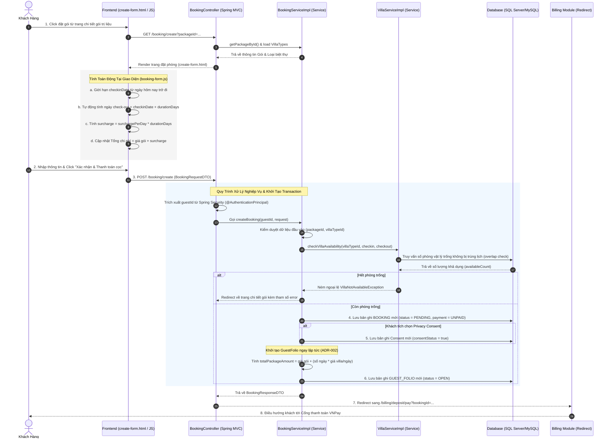

# BÁO CÁO PHÂN TÍCH TIẾN TRÌNH NGHIỆP VỤ (ACTIVITY WORKFLOW) ĐẶT GÓI TRỊ LIỆU & BIỆT THỰ
## Hệ Thống Quản Lý Nghỉ Dưỡng Xoai Aura Retreat (Module 2)

Tài liệu này phân tích chi tiết tiến trình nghiệp vụ đặt gói trị liệu và loại biệt thự lưu trú (**Booking Creation**) của khách hàng từ giao diện người dùng (Frontend), truyền tải qua các tầng xử lý logic và tính toán giá trị hóa đơn (Backend), kiểm duyệt số lượng phòng vật lý khả dụng (Availability Check) và lưu trữ dữ liệu xuống cơ sở dữ liệu (Database).

---

## 1. Sơ Đồ Tổng Quan Luồng Nghiệp Vụ (Booking Creation Workflow)

Dưới đây là sơ đồ chi tiết biểu diễn sự tương tác giữa các thành phần từ trình duyệt của Khách hàng đến cơ sở dữ liệu khi thực hiện nghiệp vụ Đặt gói:

---

## 2. Chi Tiết Từng Hoạt Động Cụ Thể (Step-by-step Actions)

### 2.1 Tầng Giao Diện (Frontend - HTML/JS)
* **Tệp tin nguồn:**
  * HTML: [create-form.html](file:///d:/su26-swp391-se2023-g6/05_Development/auramoon/src/main/resources/templates/booking/create-form.html)
  * JavaScript: [booking-form.js](file:///d:/su26-swp391-se2023-g6/05_Development/auramoon/src/main/resources/static/js/booking/booking-form.js)

* **Hành động 1: Kết xuất dữ liệu gói và loại biệt thự nghỉ dưỡng**
  * Trang giao diện hiển thị thông tin gói trị liệu hiện hành (`${pkg}`) bao gồm: Tên gói, loại gói, số ngày trị liệu (`durationDays`), đơn giá gói trị liệu.
  * Hiển thị danh sách các phân hạng biệt thự có sẵn trong hệ thống qua thẻ `th:each="vt : ${villaTypes}"`. Mỗi phân hạng hiển thị dạng nút radio ẩn, tích hợp nhãn mô tả đẹp mắt và phụ thu tương ứng (`vt.pricePerDay`).

* **Hành động 2: Tính toán tự động tại giao diện (Client-side dynamic update)**
  * Sau khi trang tải xong, tệp tin script [booking-form.js](file:///d:/su26-swp391-se2023-g6/05_Development/auramoon/src/main/resources/static/js/booking/booking-form.js) thực thi các tác vụ sau:
    1. Thiết lập thuộc tính `min` cho ô chọn ngày `#checkinDate` bằng ngày hiện tại của hệ thống để tránh trường hợp khách đặt phòng trong quá khứ.
    2. Gắn sự kiện lắng nghe thay đổi ngày nhận phòng: Khi thay đổi `#checkinDate`, hàm `updateCheckoutDate` tự động lấy ngày check-in cộng với số ngày của gói (`pkg.durationDays`) để kết xuất ngày trả phòng dự kiến hiển thị trên `#checkoutDateDisplay`.
    3. Gắn sự kiện lắng nghe việc chọn loại biệt thự: Khi khách thay đổi lựa chọn biệt thự, hàm `updatePricing` sẽ lấy giá phụ thu ngày tương ứng nhân với số ngày lưu trú (`surchargePerDay * durationDays`), cập nhật tiền phụ thu hiển thị trên `#surchargeDisplay` và tổng tiền thanh toán hiển thị trên `#totalPriceDisplay`.
    4. Thay đổi giao diện trực quan (thêm viền, màu nền và hiệu ứng) khi thẻ biệt thự được click chọn.

* **Hành động 3: Đăng ký yêu cầu đặt gói**
  * Khách hàng tích chọn đồng ý điều khoản bảo mật cá nhân (bắt buộc) và nhấn nút "Xác nhận & Thanh toán cọc".
  * Yêu cầu được gửi bằng phương thức POST tới endpoint `/booking/create` đi kèm dữ liệu gồm: `retreatPackageId`, `checkinDate`, `totalGuests`, `villaTypeId`, và `privacyConsent`.

---

### 2.2 Tầng Điều Hướng (Backend Controller)
* **Tệp tin nguồn:** [BookingController.java](file:///d:/su26-swp391-se2023-g6/05_Development/auramoon/src/main/java/com/AuraMoon/auramoon/booking/controller/BookingController.java)

* **Hành động 4: Tiếp nhận thông tin và kiểm tra xác thực người dùng**
  * Nhận yêu cầu và ánh xạ dữ liệu trực tiếp vào đối tượng DTO [BookingRequestDTO](file:///d:/su26-swp391-se2023-g6/05_Development/auramoon/src/main/java/com/AuraMoon/auramoon/booking/dto/BookingRequestDTO.java).
  * Lấy thông tin tài khoản người dùng đăng nhập hiện tại bằng Annotation bảo mật `@AuthenticationPrincipal UserDetailsResponse currentUser`.
  * Nếu người dùng đã đăng nhập, hệ thống sẽ trích xuất ID khách hàng (`currentUser.getId()`), ngược lại trường `guestId` sẽ nhận giá trị `null` (cho phép khách tạo đặt phòng ẩn danh hoặc hệ thống xử lý sau).
  * Controller gọi tầng nghiệp vụ để xử lý tiếp: `bookingService.createBooking(guestId, request)`.
  * Nếu tạo đơn thành công, Controller điều hướng (Redirect) khách sang trang thanh toán đặt cọc của Module Billing: `/billing/deposit/pay?bookingId={bookingId}`.
  * Nếu gặp bất kỳ lỗi nghiệp vụ nào (ví dụ: hết phòng), Controller bắt ngoại lệ `Exception`, mã hóa thông điệp lỗi và chuyển hướng khách quay trở lại trang chi tiết gói trị liệu `/packages/{packageId}?error={errorMsg}` để thông báo lỗi trực quan cho người dùng.

---

### 2.3 Tầng Nghiệp Vụ (Backend Service)
* **Tệp tin nguồn:**
  * Interface: [BookingService.java](file:///d:/su26-swp391-se2023-g6/05_Development/auramoon/src/main/java/com/AuraMoon/auramoon/booking/service/BookingService.java)
  * Implementation: [BookingServiceImpl.java](file:///d:/su26-swp391-se2023-g6/05_Development/auramoon/src/main/java/com/AuraMoon/auramoon/booking/service/impl/BookingServiceImpl.java)

* **Hành động 5: Xử lý quy tắc nghiệp vụ lưu trú (Business Rules)**
  Phương thức `createBooking` hoạt động dưới cơ chế quản lý giao dịch `@Transactional`:

  1. **Kiểm tra thông số bắt buộc:** Yêu cầu phải có thông tin gói trị liệu và hạng biệt thự lựa chọn.
  2. **Truy vấn thông tin gói (`RetreatPackage`) và phân hạng phòng (`VillaType`):**
     * Tìm kiếm thông tin gói trị liệu đang hoạt động và không bị xóa. Nếu không tìm thấy, trả lỗi `IllegalArgumentException`.
     * Tìm kiếm thông tin phân hạng phòng biệt thự. Nếu không tìm thấy, trả lỗi `IllegalArgumentException`.
  3. **Tính toán lịch trình:** Ngày trả phòng (`checkoutDate`) = `checkinDate` + `retreatPackage.getDurationDays()`.
  4. **Kiểm tra quỹ phòng trống khả dụng thực tế:**
     * Gọi tới `villaService.checkVillaAvailability(villaTypeId, checkinDate, checkoutDate)`.
     * Trong lớp `VillaServiceImpl`, hệ thống kiểm tra sự trùng khớp và chồng lấn lịch (Overlap Check) bằng truy vấn đếm số lượng phòng vật lý trống thuộc loại `villaTypeId` trong khoảng thời gian từ ngày check-in đến ngày check-out dự kiến.
     * Nếu không có phòng nào trống thỏa mãn điều kiện, hệ thống ném ngoại lệ `VillaNotAvailableException`.
  5. **Khởi tạo và lưu thông tin đơn đặt phòng (`Booking`):**
     * Thiết lập trạng thái đơn đặt là `PENDING` (chờ thanh toán cọc).
     * Thiết lập trạng thái thanh toán là `UNPAID` (chưa thanh toán).
     * Gọi `bookingRepository.save(booking)`.
  6. **Lưu trữ cam kết đồng ý bảo mật (Privacy Consent):**
     * Nếu người dùng đã đăng nhập và đồng ý cam kết bảo mật quyền riêng tư trên Form đặt phòng, một thực thể `Consent` mới sẽ được tạo lập ở trạng thái `consentStatus = true` liên kết với khách hàng và lưu trữ vào DB.
  7. **Khởi tạo hóa đơn chi tiết khách hàng ngay lập tức (GuestFolio - ADR-002):**
     * Thay vì đợi thanh toán xong mới tạo Folio, hệ thống khởi tạo thực thể `GuestFolio` ngay lập tức.
     * Tính toán tổng giá trị gói đặt phòng (`totalPackageAmount`) = `Giá gói trị liệu` + (`Số ngày lưu trú` * `Đơn giá phòng/ngày`).
     * Thiết lập trạng thái của Folio là `"OPEN"` và lưu trữ bằng cách gọi `guestFolioRepository.save(guestFolio)`.
  8. **Trả về kết quả:** Đóng gói thông tin trong đối tượng `BookingResponseDTO` và chuyển tiếp lên Controller.

---

### 2.4 Tầng Cơ Sở Dữ Liệu (Database Layer)
Khi hoàn thành giao dịch (Transaction Commit), JPA/Hibernate sẽ sinh ra các truy vấn SQL để lưu trữ xuống cơ sở dữ liệu:

* **Hành động 6: Ghi nhận thông tin xuống các bảng dữ liệu**
  1. **Bảng `BOOKING`:** Ghi mới bản ghi đặt phòng ở trạng thái `'PENDING'`, trường `assigned_villa_id` có giá trị `NULL` (vì phòng cụ thể chỉ được gán lúc check-in thực tế).
  2. **Bảng `CONSENT`:** Ghi mới bản ghi chấp thuận chính sách quyền riêng tư dữ liệu cá nhân của khách hàng.
  3. **Bảng `GUEST_FOLIO`:** Ghi mới bản ghi hóa đơn chi tiết của đơn đặt phòng phục vụ cho việc đối chiếu thanh toán tiền đặt cọc VNPay tiếp theo.
