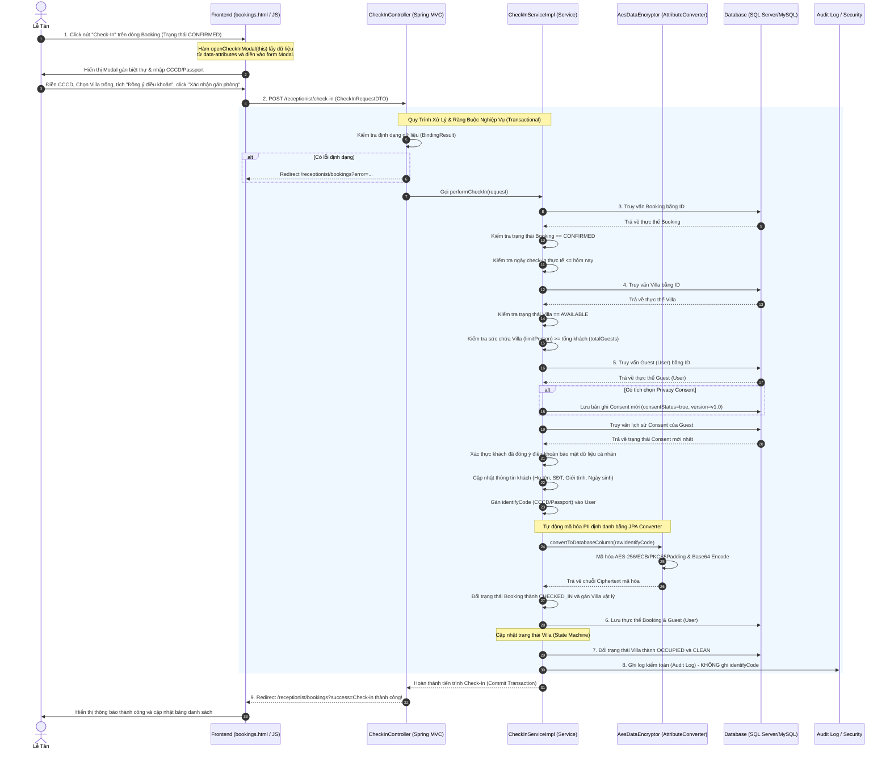

# BÁO CÁO PHÂN TÍCH TIẾN TRÌNH NGHIỆP VỤ (ACTIVITY WORKFLOW) CHECK-IN
## Hệ Thống Quản Lý Nghỉ Dưỡng Xoai Aura Retreat (Module 2)

Tài liệu này phân tích chi tiết tiến trình nghiệp vụ gán phòng vật lý và xác nhận nhận phòng (**Check-In**) cho khách hàng từ giao diện người dùng (Frontend), truyền tải qua các tầng xử lý logic (Backend), thực hiện các quy trình bảo mật thông tin định danh (PII Encryption), cập nhật trạng thái phòng vật lý (State Machine) và lưu trữ dữ liệu xuống cơ sở dữ liệu (Database).

---

## 1. Sơ Đồ Tổng Quan Luồng Nghiệp Vụ (Activity & Sequence Workflow)

Dưới đây là sơ đồ chi tiết biểu diễn sự tương tác giữa các thành phần từ trình duyệt của Lễ tân đến cơ sở dữ liệu khi thực hiện nghiệp vụ Check-In:



---

## 2. Chi Tiết Từng Action và Thành Phần Tham Gia

### 2.1 Tầng Giao Diện (Frontend - HTML/JS)
* **Tệp tin nguồn:**
  * HTML: [bookings.html](file:///d:/su26-swp391-se2023-g6/05_Development/auramoon/src/main/resources/templates/reception/bookings.html)
  * JavaScript: [reception.js](file:///d:/su26-swp391-se2023-g6/05_Development/auramoon/src/main/resources/static/js/reception/reception.js)

* **Hành động 1: Kết xuất dữ liệu Thymeleaf trên bảng danh sách**
  * Danh sách booking đến nhận phòng được duyệt qua biến `${bookings}` bằng chỉ thị `th:each="b : ${bookings}"`.
  * Điều kiện hiển thị nút **Check-In**: Chỉ hiển thị cho các đơn hàng có trạng thái `CONFIRMED` và ngày nhận phòng không nằm trong tương lai:
    ```html
    th:if="${b.bookingStatus == 'CONFIRMED' and not b.checkinDate.isAfter(T(java.time.LocalDate).now())}"
    ```
  * Các thông tin định danh sẵn có của khách hàng được gắn vào các thẻ thuộc tính `data-*` để chuyển tiếp vào JavaScript:
    * `th:data-booking-id="${b.id}"`
    * `th:data-guest-name="${b.guestName}"`
    * `th:data-guest-phone="${b.guestPhone}"`
    * `th:data-guest-gender="${b.guestGender}"`
    * `th:data-guest-dob="${b.guestDateOfBirth}"`

* **Hành động 2: Kích hoạt Modal nhận phòng vật lý**
  * Khi Lễ tân bấm nút **Check-In**, sự kiện `onclick="openCheckInModal(this)"` được kích hoạt.
  * Hàm `openCheckInModal(button)` trong tệp tin `reception.js` sẽ trích xuất dữ liệu từ các thuộc tính `data-*` của thẻ nút được click, thực hiện điền sẵn (pre-fill) thông tin vào các trường tương ứng trong form Modal (`#modalBookingId`, `#fullName`, `#phone`, `#gender`, `#dateOfBirth`).
  * Gỡ bỏ class CSS `hidden` khỏi phần tử chứa Modal `#checkInModal` để hiển thị hộp thoại lên màn hình.
  * Danh sách các biệt thự trống có trạng thái khả dụng (`AVAILABLE`) được render động từ danh sách biệt thự trống truyền từ controller:
    ```html
    <option th:each="v : ${allVillas}" th:if="${v.villaStatus == 'AVAILABLE'}" th:value="${v.id}" ...>
    ```

* **Hành động 3: Gửi form dữ liệu đăng ký**
  * Lễ tân thực hiện điền mã CCCD/Passport của khách vào ô nhập liệu `#identifyCode` (bắt buộc) và tích chọn xác nhận bảo mật quyền riêng tư `#privacyConsent`.
  * Sau khi bấm "Xác nhận gán phòng", form gửi yêu cầu qua giao thức HTTP POST tới endpoint `/receptionist/check-in`.

---

### 2.2 Tầng Điều Hướng (Backend Controller)
* **Tệp tin nguồn:** [CheckInController.java](file:///d:/su26-swp391-se2023-g6/05_Development/auramoon/src/main/java/com/AuraMoon/auramoon/booking/controller/CheckInController.java)

* **Hành động 4: Tiếp nhận và kiểm định dữ liệu đầu vào**
  * Dữ liệu form POST được tự động ánh xạ vào đối tượng [CheckInRequestDTO](file:///d:/su26-swp391-se2023-g6/05_Development/auramoon/src/main/java/com/AuraMoon/auramoon/booking/dto/CheckInRequestDTO.java) nhờ cơ chế Data Binding của Spring MVC.
  * Đối tượng `BindingResult` được sử dụng để kiểm tra lỗi định dạng đầu vào (ví dụ: ngày sinh của khách có hợp lệ hay không).
  * Nếu phát hiện lỗi định dạng, Controller sẽ thực hiện redirect ngược về trang `/receptionist/bookings` đi kèm thông số lỗi `error` được mã hóa.
  * Nếu dữ liệu hợp lệ, Controller chuyển tiếp đối tượng DTO xuống tầng nghiệp vụ: `checkInService.performCheckIn(request)`.

---

### 2.3 Tầng Nghiệp Vụ (Backend Service)
* **Tệp tin nguồn:**
  * Interface: [CheckInService.java](file:///d:/su26-swp391-se2023-g6/05_Development/auramoon/src/main/java/com/AuraMoon/auramoon/booking/service/CheckInService.java)
  * Implementation: [CheckInServiceImpl.java](file:///d:/su26-swp391-se2023-g6/05_Development/auramoon/src/main/java/com/AuraMoon/auramoon/booking/service/impl/CheckInServiceImpl.java)

* **Hành động 5: Thực thi nghiệp vụ và kiểm tra ràng buộc quy định (Business Rules - BR)**
  Luồng xử lý nghiệp vụ chạy dưới môi trường `@Transactional` đảm bảo tính toàn vẹn dữ liệu (Atomic):

  1. **Tải dữ liệu đơn đặt phòng (Booking):**
     * Tìm kiếm thực thể `Booking` thông qua ID. Nếu không tìm thấy, ném ngoại lệ lỗi `[BOOK-404]`.
  2. **Xác thực trạng thái Booking (BR Upstream):**
     * Đơn đặt phòng phải đang ở trạng thái `CONFIRMED` mới được phép làm thủ tục check-in. Nếu không hợp lệ, ném ngoại lệ `[BOOK-400]`.
  3. **Kiểm tra ngày nhận phòng thực tế:**
     * Không cho phép check-in trước ngày đăng ký nhận phòng (`checkinDate.isAfter(LocalDate.now())`). Nếu vi phạm, ném lỗi `[BOOK-400]`.
  4. **Tải và kiểm tra trạng thái Villa vật lý (BR-03):**
     * Tìm kiếm thực thể `Villa` được chọn gán qua ID. Nếu không tìm thấy, trả lỗi `[BOOK-411]`.
     * Biệt thự được gán phải có trạng thái trống (`AVAILABLE`). Nếu đang bảo trì hoặc có khách khác lưu trú, trả lỗi `[BOOK-411]`.
  5. **Kiểm duyệt sức chứa tối đa của phòng (ADR-UC08-002):**
     * Kiểm tra số lượng khách đi cùng của đơn hàng (`booking.getTotalGuests()`) có vượt quá giới hạn sức chứa tối đa của biệt thự (`villa.getLimitPerson()`) hay không. Nếu vượt quá, ném lỗi `[BOOK-412]` để ngăn chặn tình trạng quá tải.
  6. **Đồng ý điều khoản quyền riêng tư (Privacy Consent Check):**
     * Nếu Lễ tân tích chọn đồng ý quyền riêng tư, hệ thống tiến hành tạo mới một thực thể `Consent` liên kết với tài khoản khách hàng (`User`) với trạng thái `consentStatus = true`, phiên bản điều khoản `"v1.0"`, sau đó lưu vào bảng `CONSENT` bằng `consentRepository.save()`.
     * Hệ thống kiểm tra bản ghi Consent mới nhất của khách hàng từ cơ sở dữ liệu. Nếu chưa có hoặc trạng thái đồng ý là `false`, hệ thống sẽ ném ngoại lệ từ chối thực hiện thủ tục để bảo vệ an toàn PII dữ liệu cá nhân.
  7. **Cập nhật thông tin nhận dạng cá nhân của khách hàng:**
     * Thực hiện cập nhật bổ sung các thông tin khách hàng nếu lễ tân chỉnh sửa (Họ tên, SĐT, Giới tính, Ngày sinh).
     * Thiết lập số định danh CCCD/Passport `identifyCode` cho thực thể `User`.
  8. **Đổi trạng thái Booking:**
     * Đổi trạng thái `bookingStatus` từ `CONFIRMED` sang `CHECKED_IN`.
     * Gán liên kết biệt thự vật lý bằng cách gọi `booking.setAssignedVilla(villa)`.
  9. **Lưu trữ thay đổi thực thể:**
     * Gọi `bookingRepository.save(booking)` và `userRepository.save(guest)` để cập nhật thông tin.
  10. **Cập nhật trạng thái Villa vật lý thông qua VillaService (State Machine):**
      * Chuyển trạng thái hoạt động của Villa: Gọi `villaService.updateVillaStatuses(villaId, "OCCUPIED", "CLEAN")`.
      * Tại đây, hệ thống kiểm duyệt máy trạng thái (State Machine): Ngăn các chuyển đổi sai luật (ví dụ: đang ở phòng có khách `OCCUPIED` sang bảo trì `MAINTENANCE` khi chưa check-out, hoặc phòng bảo trì `MAINTENANCE` sang `OCCUPIED` trực tiếp không thông qua quy trình nhận phòng).
  11. **Ghi nhật ký kiểm toán hệ thống (Audit Trail - BR-15):**
      * Hệ thống lấy tên nhân viên thực hiện từ ngữ cảnh bảo mật Spring Security: `SecurityContextHolder.getContext().getAuthentication()`.
      * Ghi nhận log kiểm toán thành công bao gồm: Booking ID, Guest ID, Villa Code, Người thực hiện và thời gian nhận phòng thực tế.
      * **Nguyên tắc an toàn thông tin:** Tuyệt đối không ghi thông tin mã CCCD/Passport (cả dạng thô lẫn mã hóa) vào tệp tin Log để phòng tránh rò rỉ thông tin cá nhân.

---

### 2.4 Tầng Mã Hóa PII (PII Encryption & Decryption Layer)
* **Tệp tin nguồn:** [AesDataEncryptor.java](file:///d:/su26-swp391-se2023-g6/05_Development/auramoon/src/main/java/com/AuraMoon/auramoon/auth/config/AesDataEncryptor.java)

* **Hành động 6: Mã hóa thuộc tính định danh tự động bằng JPA Converter**
  * Trong thực thể `User.java`, trường `identifyCode` được chỉ định bộ chuyển đổi thuộc tính:
    ```java
    @Convert(converter = AesDataEncryptor.class)
    @Column(name = "Identify_code", length = 255)
    private String identifyCode;
    ```
  * Khi JPA thực hiện lưu dữ liệu khách hàng (`userRepository.save(guest)`), hàm `convertToDatabaseColumn(String attribute)` trong bộ mã hóa sẽ tự động được triệu gọi:
    1. Trích xuất khóa bí mật đối xứng `secretKey` (mặc định lấy từ cấu hình ứng dụng `app.encryption.key`).
    2. Khởi tạo thuật toán mã hóa đối xứng mã nguồn mở: **AES (Kích thước khóa 256 bits, chế độ ECB, đệm PKCS5Padding)**.
    3. Thực hiện mã hóa dữ liệu văn bản thuần (Plaintext CCCD/Passport) thành dạng nhị phân mã hóa.
    4. Mã hóa mảng byte kết quả thành dạng chuỗi văn bản Base64 để lưu trữ an toàn trong cột cơ sở dữ liệu `Identify_code`.
  * Ngược lại, khi truy vấn thực thể `User` từ database lên đối tượng Java, hàm `convertToEntityAttribute(String dbData)` tự động chạy để giải mã dữ liệu Base64 về dạng văn bản thô nhằm phục vụ quá trình hiển thị dữ liệu nếu cần, đảm bảo tính minh bạch dữ liệu trong ứng dụng.

---

### 2.5 Tầng Cơ Sở Dữ Liệu (Database Layer)
Khi giao dịch (`Transaction`) hoàn tất và commit, Hibernate sẽ tạo ra các truy vấn SQL tương ứng để ghi xuống cơ sở dữ liệu vật lý:

* **Hành động 7: Lưu trữ bản ghi thay đổi xuống các bảng**
  1. **Bảng `CONSENT`:** Thêm mới bản ghi ghi nhận thời điểm và trạng thái đồng ý bảo mật thông tin cá nhân của khách hàng.
  2. **Bảng `[USER]`:** Thực hiện câu lệnh `UPDATE` cập nhật thông tin cá nhân (`full_name`, `phone`, `gender`, `date_of_birth`) và lưu chuỗi Base64 đã được mã hóa AES vào cột `Identify_code`.
  3. **Bảng `BOOKING`:** Cập nhật cột `booking_status` thành `'CHECKED_IN'` và cập nhật cột `assigned_villa_id` bằng ID của biệt thự vật lý được gán.
  4. **Bảng `VILLA`:** Cập nhật cột trạng thái `villa_status` thành `'OCCUPIED'` và cột trạng thái dọn dẹp `cleaning_status` thành `'CLEAN'`.

---

## 3. Tổng Kết Các Điểm Nổi Bật Về Bảo Mật & Ràng Buộc (Key Takeaways)

| Ràng buộc/Quy tắc bảo mật | Cách thức triển khai chi tiết | Lợi ích mang lại |
| :--- | :--- | :--- |
| **Bảo mật dữ liệu cá nhân nhạy cảm (PII)** | Mã hóa tự động mức trường dữ liệu bằng **AES-256** thông qua `AesDataEncryptor` kế thừa `AttributeConverter` của JPA. | Đảm bảo nếu cơ sở dữ liệu bị rò rỉ, mã định danh CCCD/Passport vẫn hoàn toàn an toàn dưới dạng Ciphertext. |
| **Kiểm soát đồng ý bảo mật (Consent)** | Yêu cầu kiểm tra lịch sử đồng ý trong bảng `CONSENT` trước khi gán CCCD. | Tuân thủ nghị định bảo vệ dữ liệu cá nhân (GDPR / Nghị định 13/2023/NĐ-CP). |
| **Bảo vệ rò rỉ log nghiệp vụ** | Loại bỏ hoàn toàn mã định danh CCCD (`identifyCode`) khỏi chuỗi thông tin của `auditLogger`. | Tránh việc dữ liệu nhạy cảm xuất hiện dưới dạng Plaintext trong các tệp tin log hệ thống hoặc công cụ theo dõi log. |
| **Quản lý trạng thái Villa chặt chẽ** | Kiểm soát trạng thái phòng bằng State Machine trong `VillaServiceImpl` (Ngăn chuyển đổi từ OCCUPIED sang MAINTENANCE trực tiếp). | Tránh lỗi nghiệp vụ khi phòng đang có khách bị điều phối đi bảo trì hoặc dọn dẹp sai quy trình. |
| **Kiểm duyệt sức chứa phòng nghỉ** | Đối chiếu thông tin `limitPerson` của biệt thự với số lượng `totalGuests` trong booking. | Tránh việc lễ tân xếp khách quá số lượng quy định của phòng nghỉ dưỡng. |
