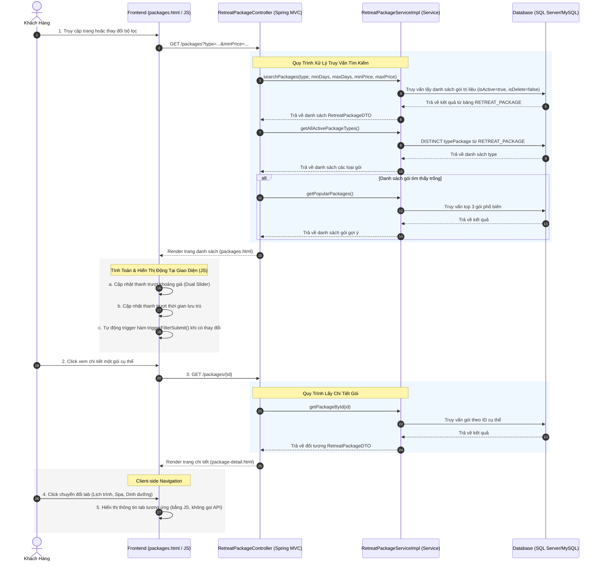

# BÁO CÁO PHÂN TÍCH TIẾN TRÌNH NGHIỆP VỤ (ACTIVITY WORKFLOW) TÌM KIẾM VÀ XEM CHI TIẾT GÓI TRỊ LIỆU

## Hệ Thống Quản Lý Nghỉ Dưỡng Xoai Aura Retreat (Module 2)

Tài liệu này phân tích chi tiết tiến trình nghiệp vụ tìm kiếm, lọc danh sách và xem chi tiết các gói trị liệu (**Browse Wellness Packages**) của khách hàng từ giao diện người dùng (Frontend), truyền tải qua các tầng xử lý điều hướng, logic (Backend) để truy xuất dữ liệu từ cơ sở dữ liệu (Database).

---

## 1. Sơ Đồ Tổng Quan Luồng Nghiệp Vụ (Browse Packages Workflow)

Dưới đây là sơ đồ chi tiết biểu diễn sự tương tác giữa các thành phần từ trình duyệt của Khách hàng đến cơ sở dữ liệu khi thực hiện nghiệp vụ tìm kiếm và xem chi tiết gói:

---

## 2. Chi Tiết Từng Action và Thành Phần Tham Gia

### 2.1 Tầng Giao Diện (Frontend - HTML/JS)

* **Tệp tin nguồn:**
  * HTML: [packages.html](file:///d:/su26-swp391-se2023-g6/05_Development/auramoon/src/main/resources/templates/booking/packages.html), [package-detail.html](file:///d:/su26-swp391-se2023-g6/05_Development/auramoon/src/main/resources/templates/booking/package-detail.html)
  * JavaScript: Mã kịch bản nhúng trực tiếp trong tệp HTML.

* **Hành động 1: Tương tác bộ lọc tìm kiếm (Browse Packages - packages.html)**
  * Trang `packages.html` kết xuất giao diện bao gồm danh sách các thẻ gói trị liệu và thanh bên (sidebar) tích hợp bộ lọc tìm kiếm nâng cao: Mục tiêu sức khỏe (Radio buttons), Thời lượng lưu trú (Dual Range Slider) và Khoảng giá (Dual Range Slider).
  * Mã JavaScript nội bộ thực thi khởi tạo thanh trượt kép bằng hàm `initDualSlider`. Khi khách hàng điều chỉnh điểm kéo thanh trượt, hoặc nhấp vào các nút gán sẵn cấu hình nhanh (Quick selects), hàm `updateTrack` lập tức tính toán giao diện trực quan thanh trượt, định dạng lại nhãn số ngày và tiền tệ định dạng Việt Nam (`formatVND`).
  * Khi phát sinh sự thay đổi dữ liệu trên bất kỳ trường form nào (`change` event), hàm `triggerFilterSubmit()` tự động được gọi nhằm kích hoạt yêu cầu `GET` lên server qua `#filterForm`.

* **Hành động 2: Tương tác hiển thị chi tiết (View Details - package-detail.html)**
  * Việc nhấp vào nút "Chi tiết" sẽ chuyển hướng người dùng sang `package-detail.html`.
  * Trang này tổ chức một khối lượng lớn thông tin dữ liệu (`${pkg}`) thành ba bảng tính năng nâng cao (Tab components) để tăng thẩm mỹ: Lịch trình mẫu (Itinerary), Dịch vụ spa đi kèm (Spa), và Thực đơn dinh dưỡng (Nutrition).
  * Hành động luân chuyển giữa các tab nội dung được hàm `switchTab(tabId)` đảm nhận xử lý ở client-side. Hệ thống sẽ thay đổi kiểu dáng CSS (border/color) của tab đang được chọn và hiện khối `div` chứa nội dung tương ứng (ẩn các khối khác) rất mượt mà mà không làm gián đoạn tải lại trang hay gọi thêm dữ liệu xuống Backend.

---

### 2.2 Tầng Điều Hướng (Backend Controller)

* **Tệp tin nguồn:** [RetreatPackageController.java](file:///d:/su26-swp391-se2023-g6/05_Development/auramoon/src/main/java/com/AuraMoon/auramoon/booking/controller/RetreatPackageController.java)

* **Hành động 3: Tiếp nhận bộ lọc và phân luồng tìm kiếm**
  * Phương thức `listPackages` nhận yêu cầu HTTP `GET /packages` kèm tập tham số Query Parameters mở rộng: `type`, `minDays`, `maxDays`, `minPrice`, `maxPrice`.
  * Khởi tạo giá trị gán sẵn cho các tham số bị khuyết nhằm đảm bảo truy vấn hoạt động bình thường (Ví dụ: `minDays = 2`, `minPrice = 10,000,000`).
  * Đẩy tác vụ truy vấn danh sách gói sang tầng nghiệp vụ `searchPackages`.
  * Kéo danh sách thể loại gói bằng hàm `getAllActivePackageTypes` để nhúng vào thẻ tùy chọn giao diện.
  * *Xử lý Fallback:* Trong trường hợp bộ lọc của khách trả về mảng danh sách gói rỗng (`packages.isEmpty()`), hệ thống sẽ chủ động lấy danh sách gói tiêu biểu `getPopularPackages()` để đề xuất, tránh trường hợp UI trả về khoảng trắng gây hụt hẫng.
  * Tích hợp toàn bộ tập đối tượng vào Spring `Model` và xuất trang (Render) view `booking/packages`.

* **Hành động 4: Tiếp nhận lấy thông tin chi tiết**
  * Phương thức `packageDetail` tiếp nhận yêu cầu `GET /packages/{id}` qua trích xuất tham số ID từ `@PathVariable`.
  * Yêu cầu tầng nghiệp vụ gọi hàm `getPackageById(id)` lấy chi tiết dữ liệu.
  * Kết nối tập dữ liệu vào Spring `Model` dưới biến đại diện là `pkg`, sau đó xuất trang View `booking/package-detail`.

---

### 2.3 Tầng Nghiệp Vụ (Backend Service)

* **Tệp tin nguồn:**
  * Interface: [RetreatPackageService.java](file:///d:/su26-swp391-se2023-g6/05_Development/auramoon/src/main/java/com/AuraMoon/auramoon/booking/service/RetreatPackageService.java)
  * Implementation: [RetreatPackageServiceImpl.java](file:///d:/su26-swp391-se2023-g6/05_Development/auramoon/src/main/java/com/AuraMoon/auramoon/booking/service/impl/RetreatPackageServiceImpl.java)

* **Hành động 5: Xử lý Business Rule của Danh sách tìm kiếm**
  * Hàm `searchPackages`: Đóng vai trò cầu nối đẩy yêu cầu trực tiếp cho Repository. Kết quả trả về lập tức được đưa qua cơ chế Java Stream API sử dụng `.map(this::convertToDTO)` nhằm ánh xạ thực thể cơ sở dữ liệu gốc `RetreatPackage` sang phiên bản an toàn `RetreatPackageDTO`. Việc này ngăn chặn hiển thị cấu trúc dữ liệu nhạy cảm ra API.
  * Hàm `getAllActivePackageTypes`: Yêu cầu Repository trả về mảng chuỗi (`List<String>`) riêng biệt chứa các cấu trúc danh mục, loại bỏ cách thức gán cứng danh mục cũ kỹ tại UI frontend.

* **Hành động 6: Xử lý Business Rule của Chi tiết gói**
  * Hàm `getPackageById`: Truyền ID xuống Repository. Do hàm trả về đối tượng `Optional`, ứng dụng lập tức triển khai hành động `orElseThrow` ném một ngoại lệ Runtime (`"Retreat package not found"`) nếu thông tin gói không còn khả dụng hoặc đã bị loại bỏ, bảo vệ tiến trình hệ thống khỏi Null Pointer Exception (NPE).

---

### 2.4 Tầng Cơ Sở Dữ Liệu (Database Layer)

* **Tệp tin nguồn:** [RetreatPackageRepository.java](file:///d:/su26-swp391-se2023-g6/05_Development/auramoon/src/main/java/com/AuraMoon/auramoon/booking/repository/RetreatPackageRepository.java)

Spring Data JPA sẽ tự động thông dịch và tối ưu các hàm truy vấn nội bộ thành ngôn ngữ truy vấn SQL tương ứng thi hành trong Hệ Quản Trị Cơ Sở Dữ Liệu:

* **Hành động 7: Thi hành câu lệnh truy vấn tới cơ sở dữ liệu**
  1. **Lệnh JPQL Dynamic Search (`searchPackages`):** Do đặc thù bộ lọc rất nhiều thuộc tính tùy chọn, mã nguồn dùng `@Query` khai báo một câu lệnh JPQL. Câu lệnh linh hoạt này dùng biểu thức `(:typePackage IS NULL OR r.typePackage = :typePackage)` để phớt lờ điều kiện khi tham số truyền vào trống. Tích hợp chặt chẽ việc quét thông số `r.price >= :minPrice AND r.price <= :maxPrice`. Chốt chặn luôn luôn yêu cầu `r.isActive = true` và `r.isDelete = false`.
  2. **Lệnh Lọc Loại Gói Khả Dụng (`findDistinctTypePackageByIsActiveTrue`):** JPA tạo lệnh `SELECT DISTINCT` chỉ lọc duy nhất các loại gói không trùng lặp đối với bản ghi của các gói trị liệu đang hoạt động hiệu lực.
  3. **Lệnh Tìm Theo ID (`findByIdAndIsActiveTrueAndIsDeleteFalse`):** Ánh xạ thành câu lệnh truy vấn `SELECT * FROM RETREAT_PACKAGE WHERE id = ? AND is_active = 1 AND is_delete = 0`.
  4. **Lệnh Lấy Dữ Liệu Gợi Ý Phổ Biến (`findTop3ByIsActiveTrueAndIsDeleteFalseOrderByIdAsc`):** Khi kích hoạt Fallback, JPA tạo lệnh giới hạn bản ghi (ví dụ `LIMIT 3` hoặc `TOP 3`), và sắp xếp theo ID `ORDER BY id ASC` làm thước đo truy vấn.

---

## 3. Tổng Kết Các Điểm Nổi Bật Về Bảo Mật & Ràng Buộc (Key Takeaways)

| Ràng buộc/Quy tắc bảo mật | Cách thức triển khai chi tiết | Lợi ích mang lại |
| :--- | :--- | :--- |
| **Bảo vệ dữ liệu gói đã xóa** | Mệnh đề `isDelete = false` và `isActive = true` trong JPQL Repository | Không làm rò rỉ các gói đã gỡ khỏi hệ thống ra giao diện khách hàng. |
| **Chống Null Pointer (NPE)** | Bắt buộc dùng `Optional.orElseThrow` ở Service khi truy vấn ID cụ thể | Ngăn chặn hệ thống bị crash khi khách hàng cố ý nhập ID ảo vào URL. |
| **Fallback UX (Gợi ý)** | Chủ động gọi `getPopularPackages` khi bộ lọc quá khắt khe trả về rỗng | Tránh trang trắng (Blank Page), tối ưu trải nghiệm và giữ chân khách hàng. |
| **Ngăn chặn SQL Injection** | Sử dụng Spring Data JPA `@Query` với Parameter Binding | Loại bỏ hoàn toàn rủi ro SQL Injection qua Form Filter. |
