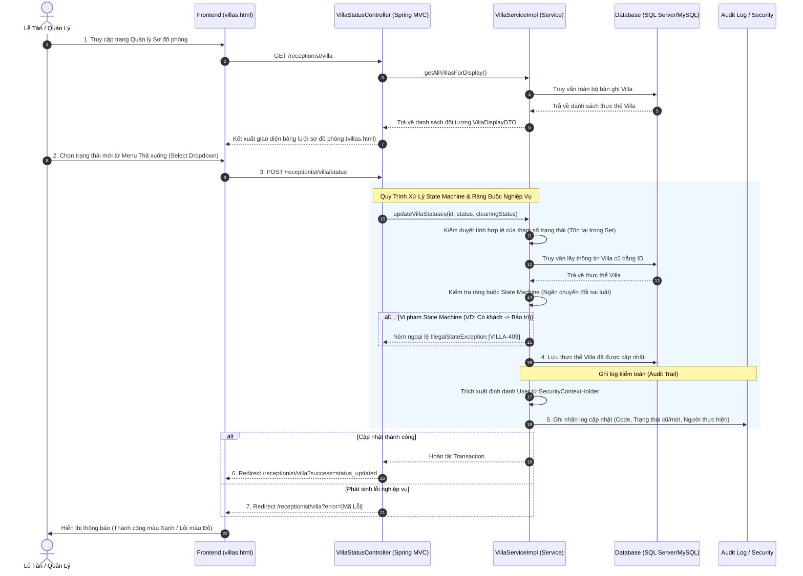

# BÁO CÁO PHÂN TÍCH TIẾN TRÌNH NGHIỆP VỤ (ACTIVITY WORKFLOW) QUẢN LÝ TRẠNG THÁI BIỆT THỰ

## Hệ Thống Quản Lý Nghỉ Dưỡng Xoai Aura Retreat (Module 2 - UC09)

Tài liệu này phân tích chi tiết tiến trình nghiệp vụ Xem và Cập nhật trạng thái Biệt thự (**Manage Villa Status**) của bộ phận Lễ tân. Quá trình này bao gồm việc kiểm soát sơ đồ phòng vật lý theo thời gian thực (Real-time View), kiểm soát máy trạng thái (State Machine) để ngăn chặn các sai sót quy trình vận hành và tự động ghi nhận nhật ký kiểm toán (Audit Log) để theo dõi trách nhiệm cá nhân.

---

## 1. Sơ Đồ Tổng Quan Luồng Nghiệp Vụ (Manage Villa Status Workflow)

Dưới đây là sơ đồ chi tiết biểu diễn sự tương tác giữa các thành phần từ trình duyệt của Lễ tân đến cơ sở dữ liệu khi thực hiện nghiệp vụ Quản lý trạng thái biệt thự:

---

## 2. Chi Tiết Từng Action và Thành Phần Tham Gia

### 2.1 Tầng Giao Diện (Frontend - HTML/JS)

* **Tệp tin nguồn:** Giao diện sơ đồ phòng `reception/villas.html` (Thymeleaf, TailwindCSS).
* **Hành động 1: Kết xuất dữ liệu Sơ đồ phòng (Grid View)**
  * Trang `villas.html` hiển thị toàn bộ biệt thự vật lý của hệ thống dưới dạng lưới thẻ (Grid Cards) với cú pháp vòng lặp `th:each="v : ${villas}"`.
  * Hiển thị cảnh báo trực quan bằng các nhãn màu sắc CSS Tailwind:
    * **Trạng thái lưu trú:** `AVAILABLE` (Trống) mang màu Xanh lá, `OCCUPIED` (Đang ở) mang màu Đỏ, `MAINTENANCE` (Bảo trì) mang màu Vàng.
    * **Trạng thái dọn dẹp:** `CLEAN` (Sạch) mang chữ Xanh, `DIRTY` (Bẩn) mang chữ Đỏ.
  * Hiển thị thông số bổ sung: Mã phòng (VD: VIL-101), Hạng phòng (Ocean View), Sức chứa tối đa (`limitPerson`).
* **Hành động 2: Thao tác cập nhật trạng thái**
  * Tích hợp trực tiếp vào mỗi thẻ biệt thự là một thẻ Form `<form th:action="@{/receptionist/villa/status}" method="post">`.
  * Form chứa 2 thẻ chọn (Dropdown `select`): Một thẻ cho trạng thái phòng (`villaStatus`) và một thẻ cho trạng thái dọn dẹp (`cleaningStatus`).
  * Trạng thái hiện tại của phòng được tự động chọn sẵn (`th:selected`).
  * Khi Lễ tân ấn nút "Cập nhật", dữ liệu bao gồm `villaId`, `villaStatus`, `cleaningStatus` được gửi lên Controller qua giao thức POST.

### 2.2 Tầng Điều Hướng (Backend Controller)

* **Tệp tin nguồn:** `VillaStatusController.java`
* **Hành động 3: Đón nhận và Điều phối dữ liệu**
  * Phương thức `showVillaDiagram` (GET `/receptionist/villa`): Trực tiếp gọi `villaService.getAllVillasForDisplay()` để lấy mảng dữ liệu DTO an toàn và đính kèm vào Spring Model trước khi kết xuất View.
  * Phương thức `updateVillaStatus` (POST `/receptionist/villa/status`): 
    * Nhận tham số qua `@RequestParam`. 
    * Toàn bộ tiến trình gọi `villaService.updateVillaStatuses()` được bảo vệ trong khối `try-catch`.
    * Nếu bắt được lỗi (`IllegalArgumentException` hoặc `IllegalStateException` từ tầng nghiệp vụ), Controller lập tức trả tham số `error` qua đối tượng `RedirectAttributes` và điều hướng về trang chủ sơ đồ phòng để bật thông báo lỗi cảnh báo màu đỏ (`Toast`).
    * Nếu thành công, trả tham số `success=status_updated`.

### 2.3 Tầng Nghiệp Vụ (Backend Service)

* **Tệp tin nguồn:** `VillaServiceImpl.java`
* **Hành động 4: Đánh giá Máy Trạng Thái (State Machine) & Cập nhật Dữ liệu**
  Quy trình tại hàm `updateVillaStatuses` diễn ra vô cùng chặt chẽ dưới sự giám sát của Transaction (`@Transactional`):
  1. **Validation Input (Kiểm tra Hợp lệ):** 
     * Hệ thống kiểm tra chuỗi trạng thái đầu vào có tồn tại trong bộ giá trị hằng số bảo mật tĩnh `VALID_VILLA_STATUSES` và `VALID_CLEANING_STATUSES` không. Nếu giả mạo gửi mã không hợp lệ, ứng dụng ném ngoại lệ `[VILLA-400]`.
  2. **Load Entity (Truy xuất Dữ liệu Cũ):** 
     * Tải dữ liệu phòng cũ từ Database qua ID. Ném lỗi `[VILLA-404]` nếu ID không tồn tại.
  3. **State Machine Evaluation (Kiểm duyệt Luồng Trạng Thái UC09):**
     * **Luật 1:** Ngăn chuyển đổi trực tiếp từ `OCCUPIED` (Có khách) sang `MAINTENANCE` (Bảo trì). Bắt buộc khách phải Check-out và trả phòng trống trước khi được khóa để bảo trì. Ném lỗi `[VILLA-409]`.
     * **Luật 2:** Ngăn chuyển đổi trực tiếp từ `MAINTENANCE` (Bảo trì) sang `OCCUPIED` (Có khách). Biệt thự bảo trì xong phải chuyển qua Trống (`AVAILABLE`), rồi trải qua quy trình Check-in hợp quy chuẩn mới được ghi nhận là Đang ở. Ném lỗi `[VILLA-409]`.
     * **Luật 3:** Ngăn chuyển đổi từ `OCCUPIED` sang thẳng `AVAILABLE` (Trống) + `CLEAN` (Sạch sẽ). Biệt thự ngay sau khi khách check-out bắt buộc mang trạng thái `DIRTY` (Bẩn) để điều phối bộ phận buồng phòng dọn dẹp. Ném lỗi `[VILLA-409]`.
  4. **Lưu Trữ:** Qua được các vòng kiểm duyệt, thông tin mới được gán bằng hàm `.set()` và lưu thay đổi qua `villaRepository.save(villa)`.
* **Hành động 5: Ghi Nhật Ký (Audit Log - BR-15)**
  * Gọi chức năng lấy định danh User bảo mật: `SecurityContextHolder.getContext().getAuthentication()`.
  * Ghi chú ra file Logger (hoặc console) một bản log kiểm toán cực kỳ chi tiết bao gồm: 
    * Cụm từ nhận diện `AUDIT LOG: [Villa Status Updated]`
    * Mã phòng (`VillaCode`)
    * Theo dõi thay đổi trạng thái (Từ `oldVillaStatus` thành `villaStatus`)
    * Theo dõi thay đổi dọn dẹp (Từ `oldCleaningStatus` thành `cleaningStatus`)
    * Tên tài khoản người thực hiện (`Performed by: ...`)
    * Dấu thời gian chuẩn xác (`Instant.now()`). Việc này đảm bảo truy vết trách nhiệm tuyệt đối trong quá trình vận hành.

### 2.4 Tầng Cơ Sở Dữ Liệu (Database Layer)

* **Tệp tin nguồn:** `VillaRepository.java`
* **Hành động 6: Truy vấn cơ sở dữ liệu**
  * Thông qua kiến trúc Spring Data JPA, Hibernate sẽ tự động sinh mã SQL thao tác với bảng vật lý `VILLA`.
  * Việc kết xuất giao diện dùng truy vấn lấy tất cả dữ liệu qua hàm `findAll()` (tương đương `SELECT * FROM VILLA`).
  * Hàm lưu trạng thái dịch thành một câu lệnh cập nhật dòng cụ thể: `UPDATE VILLA SET villa_status = ?, cleaning_status = ? WHERE id = ?`.

---

## 3. Tổng Kết Các Điểm Nổi Bật Về Bảo Mật & Ràng Buộc (Key Takeaways)

| Ràng buộc/Quy tắc bảo mật | Cách thức triển khai chi tiết | Lợi ích mang lại |
| :--- | :--- | :--- |
| **Quản lý State Machine** | Kiểm soát trực tiếp bằng cấu trúc Java `if-else` trong hàm `updateVillaStatuses` (Service) so khớp trạng thái cũ-mới. | Chặn đứng 100% lỗi logic vận hành do con người (Lễ tân) vô ý thao tác sai, tránh mất đồng bộ dữ liệu. |
| **Truy vết trách nhiệm (Audit Trail)** | Ghi log bằng thông tin định danh lấy qua thư viện `SecurityContextHolder.getContext().getAuthentication().getName()`. | Lưu vết chính xác ai đã ra quyết định đổi trạng thái phòng (bảo trì hay dọn dẹp xong) lúc mấy giờ. |
| **Xử lý vi phạm nghiệp vụ an toàn** | Ném ngoại lệ `IllegalStateException` (với mã code rõ ràng `[VILLA-409]`) và bắt tại Controller trả về UI qua `RedirectAttributes`. | Cảnh báo trực tiếp cho người dùng bằng Tiếng Việt trên giao diện mà không gây sập nền tảng hay văng lỗi 500 ra màn hình chính. |
