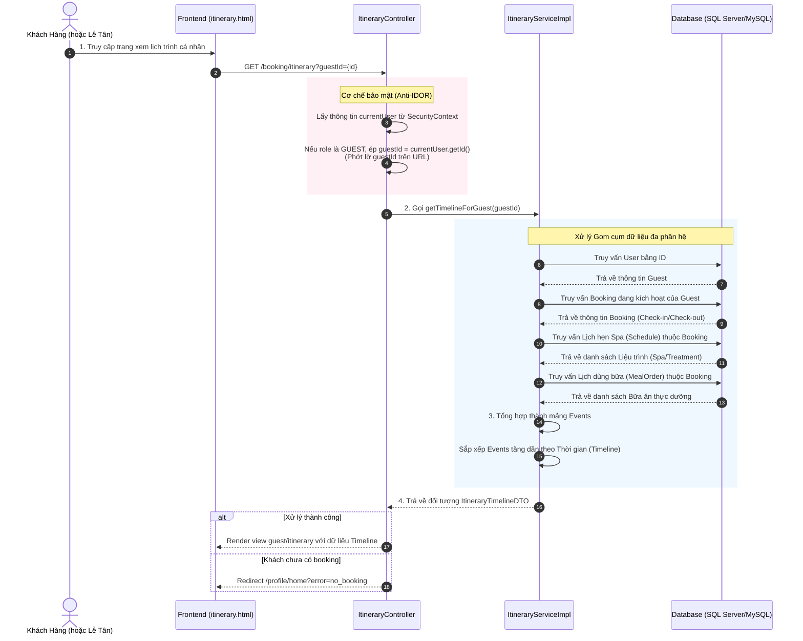

# BÁO CÁO PHÂN TÍCH TIẾN TRÌNH NGHIỆP VỤ (ACTIVITY WORKFLOW) XEM TIMELINE LỊCH TRÌNH

## Hệ Thống Quản Lý Nghỉ Dưỡng Xoai Aura Retreat (Module 2 - UC10)

Tài liệu này phân tích chi tiết luồng nghiệp vụ tạo lập Dòng thời gian Lịch trình cá nhân hóa (**Itinerary Timeline**) cho khách hàng. Chức năng này thu thập và tổng hợp dữ liệu từ nhiều phân hệ (Lưu trú, Dịch vụ Spa, Nhà hàng F&B) để tạo ra một cái nhìn thống nhất, đồng thời tích hợp cơ chế bảo mật Anti-IDOR để chống lộ lọt thông tin lịch trình giữa các khách hàng.

---

## 1. Sơ Đồ Tổng Quan Luồng Nghiệp Vụ (View Itinerary Timeline Workflow)

---

### 2.1 Tầng Giao Diện (Frontend - HTML/JS)

* **Tệp tin nguồn:** Giao diện xem lịch trình `guest/itinerary.html`
* **Hành động 1: Hiển thị Dòng thời gian**
  * Dữ liệu sau khi kết xuất sẽ được ném vào Spring Model và hiển thị trên View `guest/itinerary`.
  * Sử dụng các thẻ HTML/CSS chuyên dụng để vẽ trục thời gian dọc (Vertical Timeline), hiển thị chi tiết các sự kiện: Check-in, Spa, Ăn uống, Check-out theo thứ tự từ trên xuống dưới.

### 2.2 Tầng Điều Hướng (Backend Controller)

* **Tệp tin nguồn:** `ItineraryController.java`
* **Hành động 2: Ràng buộc bảo mật (Anti Insecure Direct Object Reference)**
  * Endpoint `GET /booking/itinerary` có thể nhận tham số tùy chọn `guestId`.
  * **Cơ chế xử lý:** Hệ thống lấy `currentUser` từ Spring Security. Nếu người truy cập có vai trò (Role) là `GUEST`, hệ thống sẽ **bỏ qua hoàn toàn** tham số `guestId` truyền vào từ URL và ép buộc dùng `currentUser.getId()`. Điều này đảm bảo Khách hàng A không thể tự ý đổi tham số trên URL để xem trộm lịch trình riêng tư của Khách hàng B.
  * Chỉ các tài khoản có quyền `ROLE_RECEPTIONIST` hoặc `ROLE_ADMIN` mới được phép tra cứu lịch trình thông qua biến `guestId`.
* **Hành động 3: Bắt ngoại lệ**
  * Nếu khách hàng truy cập nhưng chưa từng đặt phòng, Service sẽ ném ngoại lệ `IllegalArgumentException`.
  * Controller sẽ bắt ngoại lệ này và chuyển hướng (Redirect) một cách mượt mà về trang màn hình chính (Dashboard) `redirect:/profile/home?error=no_booking`.

### 2.3 Tầng Nghiệp Vụ (Backend Service)

* **Tệp tin nguồn:** `ItineraryServiceImpl.java`
* **Hành động 4: Gom cụm dữ liệu phân tán (Data Aggregation)**
  Hàm `getTimelineForGuest(guestId)` đóng vai trò trọng tâm trong việc thu thập dữ liệu:
  1. **Lấy Booking Hiện Tại:** Truy vấn các Booking của khách. Hệ thống ưu tiên chọn các Booking đang chạy (`CHECKED_IN`, `CONFIRMED`) làm nguồn mốc thời gian (Anchor).
  2. **Khởi tạo mốc mỏ neo (Anchors):** Tạo Event *Nhận phòng (Check-in)* vào mảng với mốc thời gian bắt đầu. Tạo Event *Trả phòng (Check-out)* với mốc thời gian kết thúc.
  3. **Tích hợp Dịch vụ Spa:** Gọi sang `scheduleRepository` của phân hệ Spa để lấy danh sách thời gian trị liệu. Mỗi dịch vụ được đóng gói thành một Event chứa tên Liệu trình, Thời gian (`startTime`), Địa điểm (Phòng Spa), và ghép vào mảng.
  4. **Tích hợp Dịch vụ F&B:** Gọi sang `mealOrderRepository` của phân hệ Nhà hàng. Đóng gói các sự kiện dùng bữa (Theo Nutritional Profile) vào mảng Event.
* **Hành động 5: Sắp xếp dòng thời gian**
  * Sử dụng Java Stream `Comparator.comparing(ItineraryTimelineDTO.TimelineEvent::getTime)` để sắp xếp toàn bộ các sự kiện lẫn lộn (Check-in, Spa, Ăn uống, Check-out) theo trật tự tăng dần của thời gian.
  * Đóng gói tất cả vào đối tượng cha `ItineraryTimelineDTO` (Chứa GuestName, VillaName, PackageName) và trả về.

### 2.4 Tầng Cơ Sở Dữ Liệu (Database Layer)
* **Hành động 6: Truy vấn dữ liệu đa bảng**
  * Tầng CSDL thi hành 4 truy vấn rời rạc lên các bảng: `[USER]`, `BOOKING`, `SCHEDULE` (Spa), `MEAL_ORDER` (F&B). Việc kết hợp dữ liệu được thực hiện tại tầng Service (Application Level Join) để giảm tải các câu lệnh SQL phức tạp đa bảng.

---

## 3. Tổng Kết Các Điểm Nổi Bật Về Bảo Mật & Ràng Buộc (Key Takeaways)

| Ràng buộc/Quy tắc bảo mật | Cách thức triển khai chi tiết | Lợi ích mang lại |
| :--- | :--- | :--- |
| **Chống IDOR (Anti-IDOR)** | Ép giá trị `guestId = currentUser.getId()` nếu user có Role là GUEST | Ngăn chặn tuyệt đối việc khách đổi URL để rình mò lịch trình/phòng của khách khác. |
| **Giảm tải Database** | Lấy dữ liệu độc lập từ 3 Repositories và Join bằng Stream API (Service level) | Tránh các câu lệnh SQL JOIN đa bảng phức tạp, dễ gây Lock table. |
| **Bắt ngoại lệ mượt mà** | Controller bắt `IllegalArgumentException` và chuyển về Dashboard thay vì ném ra màn hình trắng | Cải thiện UX, định hướng khách hàng tiếp tục tương tác thay vì kẹt ở trang báo lỗi. |
