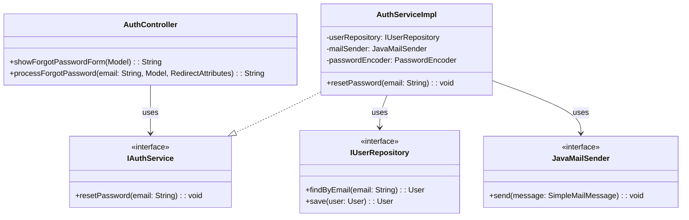
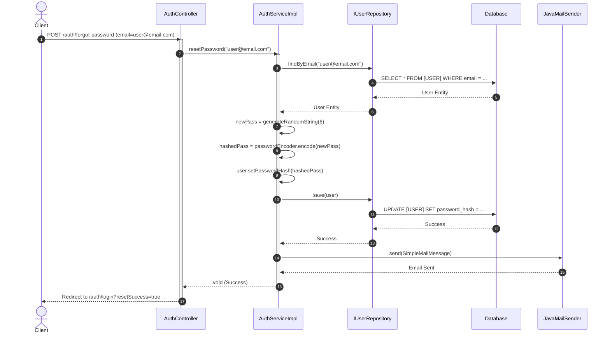

# ENGINEERING DOCUMENTATION STANDARD (EDS) v2.0

## Quy chuẩn Tài liệu Kỹ thuật và Đặc tả Hiện thực hóa

| Field                    | Value                             |
| :----------------------- | :-------------------------------- |
| **Document ID**    | `AURAMOON-AUTH-IMP-002`         |
| **Version**        | 1.1                               |
| **Date**           | 2026-06-29                        |
| **Status**         | Draft                             |
| **Document Owner** | Dev Team                          |
| **Author**         | Antigravity AI                    |
| **Reviewed by**    | Tech Lead                         |
| **DPO Sign-off**   | [x] Approved — 2026-06-29 — DPO |
| **Approved by**    | Principal Architect               |
| **Last Review**    | 2026-06-29                        |
| **Based on EDS**   | v2.0                              |

---

## CHANGELOG

> [!IMPORTANT]
> **Policy 4.4 — Immutable History**: Không bao giờ xóa thông tin cũ. Mọi thay đổi phải ghi vào bảng này.

| Ngày      | Người thực hiện | Nội dung thay đổi                                                                                                                                |
| :--------- | :------------------ | :-------------------------------------------------------------------------------------------------------------------------------------------------- |
| 2026-06-29 | NgocNM              | Tạo tài liệu hiện thực hóa lần đầu cho tính năng Quên mật khẩu.                                                                       |
| 2026-06-29 | NgocNM              | Cập nhật tài liệu khớp với kiến trúc thực tế của hệ thống (Java Spring Boot MVC, JPA, Thymeleaf) dựa trên UC_Forgot_Password_Spec.md |

---

## MỤC LỤC

1. [Tổng quan Module](#1-tổng-quan-module)
2. [Ma trận Truy vết (Traceability Matrix)](#2-ma-trận-truy-vết-traceability-matrix)
3. [Architecture Decision Records (ADR)](#3-architecture-decision-records-adr)
4. [Non-Functional Requirements &amp; SLA](#4-non-functional-requirements--sla)
5. [Static Modeling (Mô hình Tĩnh)](#5-static-modeling-mô-hình-tĩnh)
6. [Dynamic Modeling (Mô hình Hướng Động)](#6-dynamic-modeling-mô-hình-hướng-động)
7. [Domain Event Catalog](#7-domain-event-catalog)
8. [Interface Specification (Đặc tả Giao diện)](#8-interface-specification-đặc-tả-giao-diện)
9. [API Specification](#9-api-specification)
10. [Bảng mã lỗi (Error Codes)](#10-bảng-mã-lỗi-error-codes)
11. [Quy trình Triển khai (Step-by-Step)](#11-quy-trình-triển-khai-step-by-step)
12. [Rollback &amp; Incident Runbook](#12-rollback--incident-runbook)
13. [Kịch bản Kiểm thử Chi tiết](#13-kịch-bản-kiểm-thử-chi-tiết)
14. [Phương pháp Xác minh](#14-phương-pháp-xác-minh)
15. [Mẫu thử thực tế (API Verification Samples)](#15-mẫu-thử-thực-tế-api-verification-samples)
16. [Bảng tổng hợp phân quyền (Authorization Matrix)](#16-bảng-tổng-hợp-phân-quyền-authorization-matrix)

---

## 1. Tổng quan Module

> [!NOTE]
> Tài liệu này mô tả chi tiết kỹ thuật cho tính năng "Quên mật khẩu" trong module Authentication (Auth). Cho phép người dùng lấy lại quyền truy cập bằng cách nhận một mật khẩu tự động sinh 6 ký tự qua email. Hệ thống hiện tại sử dụng kiến trúc Spring MVC kết xuất HTML bằng Thymeleaf.

| Field                           | Value                                     |
| :------------------------------ | :---------------------------------------- |
| **Module Name**           | Authentication (Auth) - Forgot Password   |
| **Bounded Context**       | Identity and Access Management (IAM)      |
| **Data Classification**   | Confidential / PII (Email, Password Hash) |
| **Compliance Scope**      | InfoSec Standards / PDPA                  |
| **Upstream Dependencies** | `JavaMailSender` (SMTP)                 |
| **Downstream Consumers**  | Web Browser (Thymeleaf UI)                |

---

## 2. Ma trận Truy vết (Traceability Matrix)

| Requirement ID | Loại (BR/ADR/US) | Mô tả yêu cầu                                 | Thành phần Code                         | Compliance Target      | ADR liên quan |
| :------------- | :---------------- | :------------------------------------------------ | :---------------------------------------- | :--------------------- | :------------- |
| BR-FP-001      | Business Rule     | Sinh mật khẩu ngẫu nhiên 6 ký tự            | `AuthServiceImpl.resetPassword()`       | —                     | ADR-FP-001     |
| BR-FP-002      | Business Rule     | Cảnh báo đổi mật khẩu sau đăng nhập      | Nội dung thư gửi từ`JavaMailSender` | Security Best Practice | —             |
| BR-FP-003      | Business Rule     | Mật khẩu phải được hash trước khi lưu DB | `PasswordEncoder.encode()`              | Data Protection        | —             |
| US-FP-001      | User Story        | Yêu cầu quên mật khẩu bằng email            | `AuthController.forgotPassword()`       | —                     | —             |

---

## 3. Architecture Decision Records (ADR)

### `ADR-FP-001` — Chuyển đổi luồng khôi phục mật khẩu từ Magic Link sang Auto-generated Password

| Field                | Value         |
| :------------------- | :------------ |
| **Status**     | Accepted      |
| **Deciders**   | PO, Tech Lead |
| **Date**       | 2026-06-29    |
| **Supersedes** | N/A           |

#### Bối cảnh (Context)

Yêu cầu ban đầu sử dụng Token/Magic Link mất thời gian triển khai UI cho trang "Đặt lại mật khẩu" và quản lý state/token hết hạn. Sản phẩm cần một giải pháp nhanh gọn và trực tiếp hơn qua email.

#### Các phương án đã xem xét (Options Considered)

| Phương án      | Mô tả                                       | Ưu điểm                | Nhược điểm                                           |
| :---------------- | :-------------------------------------------- | :------------------------ | :------------------------------------------------------- |
| A (Token Link)    | Gửi link có token hết hạn 15p             | + An toàn cao            | - Phải làm thêm UI quản lý Token                    |
| B (Auto-Password) | Tạo random password 6 ký tự gửi qua email | + Nhanh, flow đơn giản | - Kém an toàn nếu email bị lộ (Plain-text in email) |

#### Quyết định (Decision)

Chọn Phương án `[B]` theo yêu cầu trực tiếp từ stakeholder để rút ngắn flow người dùng.

#### Hệ quả (Consequences)

**Tích cực**: Giảm effort code (không cần thêm bảng Token DB, không cần View xác nhận Token).
**Tiêu cực / Trade-offs**: Gửi mật khẩu rõ qua email. Phải thêm text cảnh báo đổi pass trong email. Mật khẩu không nên ghi ra file Log.

---

## 4. Non-Functional Requirements & SLA

### 4.1. Performance & Availability

| Category     | Requirement          | Target SLA | Measurement Method | Compliance Basis                 |
| :----------- | :------------------- | :--------- | :----------------- | :------------------------------- |
| Latency      | Form Submit response | < 3000ms   | APM                | Đợi SMTP response (đồng bộ) |
| Availability | Uptime (monthly)     | 99.9%      | Uptime monitor     | —                               |

### 4.2. Security

| Category           | Requirement           | Target             | Verification Method      | Compliance Basis |
| :----------------- | :-------------------- | :----------------- | :----------------------- | :--------------- |
| Encryption at rest | Password Hash         | BCrypt             | Source code review       | InfoSec Policy   |
| Logging            | No Plaintext Password | Zero leakage       | Log inspection           | GDPR / PDPA      |
| Rate Limit         | Chống Spam Email     | 3 reqs / giờ / IP | Security Config / Filter | Anti-DDoS        |

---

## 5. Static Modeling (Mô hình Tĩnh)

### 5.1. Class Diagram (PlantUML)



---

## 6. Dynamic Modeling (Mô hình Hướng Động)

### 6.1. Sequence Diagram — Happy Path



---

## 7. Domain Event Catalog

### 7.1. Events Published (Phát ra)

| Event Name                | Trigger                                         | Publisher           | Subscriber(s)           | Payload Schema         | Async? |
| :------------------------ | :---------------------------------------------- | :------------------ | :---------------------- | :--------------------- | :----- |
| `PasswordResetViaEmail` | Khi lưu mật khẩu và gửi email thành công | `AuthServiceImpl` | (Optional) Audit Logger | `User ID, Timestamp` | Không |

---

## 8. Interface Specification (Đặc tả Giao diện)

### 8.1. Service Interface

```java
package com.AuraMoon.auramoon.auth.service;

public interface IAuthService {
    // ... các phương thức khác ...

    /**
     * Khôi phục mật khẩu. Sinh tự động 6 ký tự, mã hóa BCrypt lưu DB và gửi qua Email.
     * 
     * @param email Địa chỉ email của người dùng
     * @throws IllegalArgumentException nếu không tìm thấy email trong hệ thống
     * @throws IllegalStateException nếu lỗi khi gửi email qua JavaMailSender
     */
    void resetPassword(String email);
}
```

---

## 9. API Specification

*(Do hệ thống dùng Spring MVC thay vì RESTful JSON API, endpoint tương tác bằng HTML Form)*

| Method | Path                      | Auth Level | Giao diện tương ứng                               |
| :----- | :------------------------ | :--------- | :---------------------------------------------------- |
| GET    | `/auth/forgot-password` | Public     | Trả về`auth/forgot-password.html`                 |
| POST   | `/auth/forgot-password` | Public     | Nhận tham số`email`, thực thi logic và Redirect |

**Trường hợp Thành công:**
Hệ thống Redirect về `GET /auth/login?resetSuccess=true`. Giao diện hiển thị Flash Message: *"Mật khẩu mới đã được gửi đến email của bạn. Vui lòng kiểm tra hộp thư."*

**Trường hợp Lỗi (Email không tồn tại):**
Hệ thống reload lại View `auth/forgot-password` kèm theo Model attribute `error`: *"Email không tồn tại trong hệ thống, vui lòng kiểm tra lại."*

---

## 10. Bảng mã lỗi (Error Handling)

Hệ thống sử dụng các Exception tiêu chuẩn của Java để biểu diễn lỗi logic và xử lý thông báo tại View:

| Exception                    | Nguyên nhân                                          | Phản hồi tại View (Thymeleaf)                                                                         |
| :--------------------------- | :----------------------------------------------------- | :------------------------------------------------------------------------------------------------------- |
| `IllegalArgumentException` | Email không tồn tại (`findByEmail` trả về null) | Gán`error` attribute: *"Email không tồn tại trong hệ thống, vui lòng kiểm tra lại."*        |
| `IllegalStateException`    | Có lỗi từ`JavaMailSender` (SMTP sập)             | Gán`error` attribute: *"Đã xảy ra sự cố khi gửi email khôi phục. Vui lòng thử lại sau."* |

---

## 11. Quy trình Triển khai (Step-by-Step)

### 11.1. Implementation Steps

1. **View:** Tạo hoặc bổ sung file HTML cho trang quên mật khẩu `src/main/resources/templates/auth/forgot-password.html`.
2. **Controller:** Cập nhật 2 endpoints `GET` và `POST /auth/forgot-password` trong `AuthController.java`.
3. **Logic sinh mật khẩu:** Sử dụng lớp `SecureRandom` trong Java để tạo 6 ký tự ngẫu nhiên và an toàn.
4. **Service:** Bổ sung logic hàm `resetPassword` trong `AuthServiceImpl`, áp dụng `@Transactional` để rollback cập nhật mật khẩu nếu quá trình gửi Mail gặp sự cố.
5. **Config:** Đảm bảo `SecurityConfig.java` cho phép truy cập public đường dẫn `/auth/forgot-password` (Hiện tại đã có cấu hình `permitAll()` cho endpoint này).

---

## 12. Rollback & Incident Runbook

### 12.1. Điều kiện kích hoạt Rollback (Trigger Conditions)

| Điều kiện                                                         | Ngưỡng                    | Người quyết định |
| :------------------------------------------------------------------- | :-------------------------- | :-------------------- |
| Lỗi gửi Email (JavaMailSender Exception) dẫn tới treo ứng dụng | Liên tục cho mọi request | On-call Engineer      |

### 12.2. Rollback Procedure

- Xóa bỏ hoặc Revert lại commit thay đổi logic trong `AuthServiceImpl`.
- Ứng dụng chạy trên máy chủ nguyên khối (Monolith), cần khởi động lại tiến trình Java (Restart Spring Boot).

---

## 13. Kịch bản Kiểm thử Chi tiết

### 13.1. Unit & Integration Tests

#### `TC-001` — Random Password Length

- **Feature**: Sinh mật khẩu 6 ký tự
- **Scenario**: Đảm bảo mật khẩu sinh ra luôn luôn đúng 6 ký tự.
  - **Given** Hàm `generateRandomString(6)`
  - **When** Chạy vòng lặp 1000 lần
  - **Then** Độ dài `length == 6` ở mọi lượt.

#### `TC-002` — Transaction Rollback khi Email cấu hình sai

- **Feature**: Reset Password Logic
- **Scenario**: Không lưu mật khẩu DB nếu `JavaMailSender` lỗi.
  - **Given** Mock `mailSender.send()` ném ra `MailException`
  - **When** Gọi hàm `resetPassword(email)`
  - **Then** Mật khẩu trong DB không bị thay đổi (Transactional rollback kích hoạt).

---

## 14. Phương pháp Xác minh

### 14.1. Database Inspection

- *Verify mật khẩu đã bị hash bằng BCrypt chứ không lưu plaintext (6 ký tự) trong DB*:

```sql
SELECT password_hash FROM [USER] WHERE email = 'test@example.com';
-- Expected result: Bắt đầu bằng $2a$10$ và có độ dài 60 chars.
```

### 14.2. Log Inspection

- *Kiểm tra log của Spring Boot*:
  Đảm bảo console log không vô tình in ra `log.info("New password is: " + newPass)` trên Server Production.

---

## 15. Mẫu thử thực tế (API Verification Samples)

*(Sử dụng Postman hoặc cURL form-data để test Controller độc lập)*

```bash
curl -X POST http://localhost:8080/auth/forgot-password \
  -H "Content-Type: application/x-www-form-urlencoded" \
  -d "email=valid.user@email.com&_csrf=YOUR_CSRF_TOKEN"
```

**Expected Response:** `HTTP 302` Redirect về `/auth/login?resetSuccess=true` nếu thành công.

---

## 16. Bảng tổng hợp phân quyền (Authorization Matrix)

| Endpoint                      | GUEST | USER (Đã đăng nhập) |
| :---------------------------- | :---: | :----------------------: |
| GET`/auth/forgot-password`  |  ✅  |            ❌            |
| POST`/auth/forgot-password` |  ✅  |            ❌            |

**Chú thích**: Chức năng này ưu tiên dành riêng cho đối tượng chưa đăng nhập (GUEST). User đang có phiên đăng nhập nếu muốn đổi mật khẩu thì dùng chức năng "Đổi mật khẩu" thay vì "Quên mật khẩu".