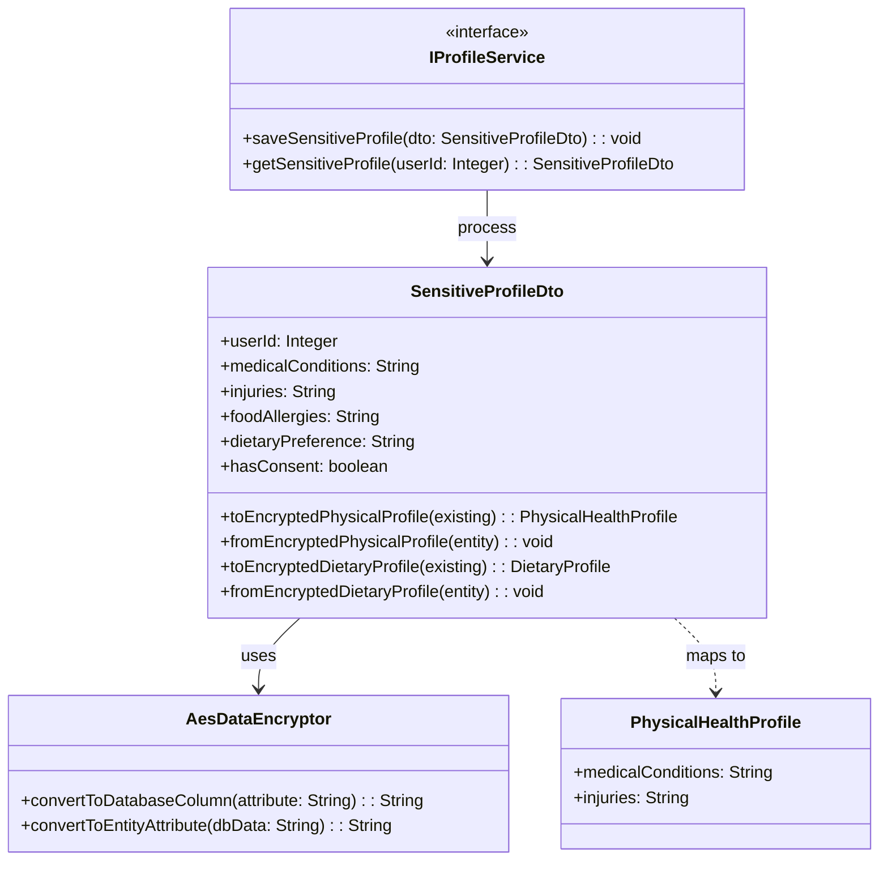
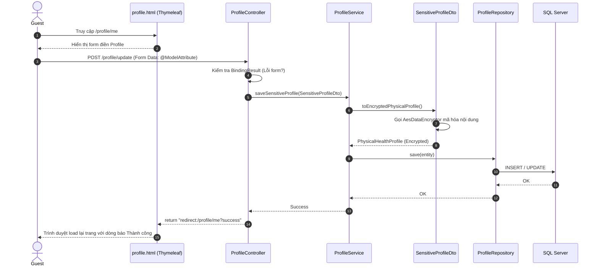

# ENGINEERING DOCUMENTATION STANDARD (EDS) v2.0
## Đặc tả Hiện thực hóa: UC02 - Complete Health & Dietary Profile

| Field | Value |
| :--- | :--- |
| **Document ID** | `HOS03-MOD1-IMP-002` |
| **Version** | 1.1 (Cập nhật chuẩn Spring MVC) |
| **Date** | 2026-06-21 |
| **Status** | Draft |
| **Document Owner** | Sinh viên 1 (Module 1) |
| **Author** | Antigravity AI |
| **Reviewed by** | [Tech Lead] |
| **DPO Sign-off** | [ ] Pending — Bắt buộc do xử lý Sensitive PII |
| **Approved by** | [Principal Architect] |
| **Based on EDS** | v2.0 |

---

## CHANGELOG

| Ngày | Người thực hiện | Nội dung thay đổi |
| :--- | :--- | :--- |
| 2026-06-21 | Antigravity AI | Tạo tài liệu thiết kế đặc tả cho UC02 |
| 2026-06-21 | Antigravity AI | Sửa đổi kiến trúc từ RESTful API sang chuẩn Spring Boot MVC (Model-View-Controller) theo đúng Policy. |

---

## MỤC LỤC
1. [Tổng quan Module](#1-tổng-quan-module)
2. [Ma trận Truy vết (Traceability Matrix)](#2-ma-trận-truy-vết-traceability-matrix)
3. [Architecture Decision Records (ADR)](#3-architecture-decision-records-adr)
4. [Non-Functional Requirements & SLA](#4-non-functional-requirements--sla)
5. [Static Modeling (Mô hình Tĩnh)](#5-static-modeling-mô-hình-tĩnh)
6. [Dynamic Modeling (Mô hình Hướng Động)](#6-dynamic-modeling-mô-hình-hướng-động)
7. [Domain Event Catalog](#7-domain-event-catalog)
8. [Interface Specification (Đặc tả Giao diện)](#8-interface-specification-đặc-tả-giao-diện)
9. [Controller & View Specification](#9-controller--view-specification)
10. [Bảng mã lỗi (Error Handling)](#10-bảng-mã-lỗi-error-handling)
11. [Quy trình Triển khai (Step-by-Step)](#11-quy-trình-triển-khai-step-by-step)
12. [Rollback & Incident Runbook](#12-rollback--incident-runbook)
13. [Kịch bản Kiểm thử Chi tiết](#13-kịch-bản-kiểm-thử-chi-tiết)
14. [Phương pháp Xác minh](#14-phương-pháp-xác-minh)
15. [Mẫu thử thực tế (Form Submission Samples)](#15-mẫu-thử-thực-tế-form-submission-samples)
16. [Bảng tổng hợp phân quyền (Authorization Matrix)](#16-bảng-tổng-hợp-phân-quyền-authorization-matrix)

---

## 1. Tổng quan Module

Mô tả: Đặc tả kỹ thuật cho tính năng tạo và cập nhật Hồ sơ Sức khỏe & Dinh dưỡng. Tính năng này được xây dựng trên nền tảng **Spring Boot MVC**, trả về giao diện Thymeleaf cho người dùng nhập liệu trực tiếp trên web thay vì dùng API JSON. Đảm bảo thu thập, mã hóa, bảo vệ thông tin y tế nhạy cảm của khách hàng tuân thủ Nghị định 356/2025/NĐ-CP.

| Field | Value |
| :--- | :--- |
| **Module Name** | Authentication & Sensitive Health Profile |
| **Bounded Context** | Guest Profile & Privacy Management |
| **Data Classification** | Sensitive-PII (Health & Medical Data) |
| **Compliance Scope** | Nghị định 356/2025/NĐ-CP (Vietnam PDPD) |
| **Upstream Dependencies** | Identity / Auth Module (Form Login / OAuth2) |
| **Downstream Consumers** | Spa Module, F&B Module |

---

## 2. Ma trận Truy vết (Traceability Matrix)

| Requirement ID | Loại | Mô tả yêu cầu | Thành phần Code | Compliance Target | ADR liên quan |
| :--- | :--- | :--- | :--- | :--- | :--- |
| BR-08 | Business Rule | Yêu cầu sự đồng ý (Explicit consent) không check sẵn | View (`profile.html`) & Controller | NĐ 356/2025 Art. 6 | — |
| BR-09 | Business Rule | Mã hóa dữ liệu nhạy cảm tại DB | `AesDataEncryptor`, `SensitiveProfileDto` | NĐ 356/2025 Art. 4 | ADR-001 |
| BR-07 | Business Rule | Phân quyền RBAC & Data Minimization | `ProfileController.getProfile()` | Nguyên tắc Data Minimization | — |
| PR-01 | Policy Rule | Sử dụng Spring MVC, không dùng REST API | `ProfileController` trả về Thymeleaf view | Architecture Guidelines | — |

---

## 3. Architecture Decision Records (ADR)

### `ADR-001` — Tách biệt logic Mã hóa vào DTO thay vì JPA @Convert trên Entity

| Field | Value |
| :--- | :--- |
| **Status** | Accepted |
| **Deciders** | Backend Team |
| **Date** | 2026-06-21 |

#### Bối cảnh (Context)
Các bảng `PHYSICAL_HEALTH_PROFILE` và `DIETARY_PROFILE` được thiết kế chung và có thể dùng bởi các team khác (Spa, F&B). Việc áp dụng trực tiếp `@Convert(converter = AesDataEncryptor.class)` vào các Entity này có thể gây ra conflict code hoặc phá vỡ cấu trúc của các module khác nếu họ load Entity lên mà không xử lý được luồng giải mã theo cách của Module 1.

#### Quyết định (Decision)
Tạo một lớp trung gian `SensitiveProfileDto` nằm trong Module 1. DTO này sẽ trực tiếp gọi `AesDataEncryptor` để mã hóa/giải mã. Trong Controller, dữ liệu submit từ Form sẽ map vào DTO này.

#### Hệ quả (Consequences)
**Tích cực**: Không gây ảnh hưởng (Zero-impact) tới code JPA Entity của các team khác. Đáp ứng hoàn toàn mô hình MVC (Dùng DTO làm ModelAttribute form).
**Tiêu cực**: Cần mapping thủ công giữa DTO và Entity.
**Compliance Impact**: Vẫn đảm bảo GDPR / NĐ 356/2025 về Encryption at rest.

---

## 4. Non-Functional Requirements & SLA

### 4.1. Performance & Availability
| Category | Requirement | Target SLA | Measurement Method |
| :--- | :--- | :--- | :--- |
| Latency | Form Submission Overhead (Mã hóa AES) | < 50ms | Spring Boot Actuator |

### 4.2. Security
| Category | Requirement | Target | Verification Method | Compliance Basis |
| :--- | :--- | :--- | :--- | :--- |
| Encryption at rest | PII fields | AES-128/ECB | DB Query trực tiếp | NĐ 356/2025 |
| Access control | Chỉ truy cập qua form UI với role GUEST | Chặn qua `SecurityConfig` | Auth Matrix (§16) | NĐ 356/2025 |

---

## 5. Static Modeling (Mô hình Tĩnh)

### 5.1. Class Diagram (PlantUML)



---

## 6. Dynamic Modeling (Mô hình Hướng Động)

### 6.1. Sequence Diagram — Update Health Profile MVC (PlantUML)



---

## 7. Domain Event Catalog

### 7.1. Events Published (Phát ra)
| Event Name | Trigger | Publisher | Subscriber(s) | Payload Schema | Async? |
| :--- | :--- | :--- | :--- | :--- | :--- |
| `HealthProfileUpdated` | Sau khi save profile thành công | ProfileService | AuditService, SpaService | `ProfileUpdated.java` | Yes |
| `ConsentGranted` | Phát hiện `hasConsent = true` khi lưu form | ProfileService | AuditService | `ConsentGranted.java` | Yes |

---

## 8. Interface Specification (Đặc tả Giao diện)

### 8.1. Service Interface

```java
// IProfileService.java
// @version 1.0

public interface IProfileService {
  /**
   * Lưu hoặc cập nhật hồ sơ nhạy cảm. Quá trình mã hóa được thực hiện tại DTO.
   * Nếu user chưa có consent (hasConsent = false) sẽ ném ngoại lệ IllegalArgumentException.
   */
  void saveSensitiveProfile(SensitiveProfileDto inputDto);

  /**
   * Lấy hồ sơ và giải mã thành plain text để đưa lên View.
   */
  SensitiveProfileDto getSensitiveProfile(Integer userId);
}
```

---

## 9. Controller & View Specification

### 9.1. Controller Mappings

| Method | Path | Auth Level | View Trả Về / Điều Hướng | Input Type |
| :--- | :--- | :--- | :--- | :--- |
| GET | `/profile/me` | JWT / Session | `auth/profile` (Thymeleaf) | N/A |
| POST | `/profile/update` | JWT / Session | `redirect:/profile/me?success` | `application/x-www-form-urlencoded` |

### 9.2. Form Data Handling

#### GET `/profile/me` — Hiển thị trang Profile
- **Logic**: Controller gọi `profileService.getSensitiveProfile(userId)`. Truyền object nhận được vào Model: `model.addAttribute("profileDto", dto)`.
- **View (`profile.html`)**: Render form, tự động điền các trường dữ liệu sức khỏe đã giải mã. **Checkbox Consent mặc định bỏ trống**.

#### POST `/profile/update` — Submit cập nhật hồ sơ
- **Request Parameters**:
  - `medicalConditions` (String)
  - `injuries` (String)
  - `foodAllergies` (String)
  - `dietaryPreference` (String)
  - `hasConsent` (boolean - Gửi dưới dạng "on" hoặc "true")
- **Xử lý Controller**:
  ```java
  @PostMapping("/update")
  public String updateProfile(@Valid @ModelAttribute("profileDto") SensitiveProfileDto dto, 
                              BindingResult result, Model model) {
      if (!dto.isHasConsent()) {
          model.addAttribute("error", "Bạn phải đồng ý với điều khoản thu thập dữ liệu y tế.");
          return "auth/profile"; // Trả lại view hiện tại kèm báo lỗi
      }
      profileService.saveSensitiveProfile(dto);
      return "redirect:/profile/me?success=true";
  }
  ```

---

## 10. Bảng mã lỗi (Error Handling)

Trong kiến trúc Spring MVC, lỗi được trả thẳng lên giao diện qua thuộc tính Model.

| Lỗi | Nguyên nhân | Trải nghiệm người dùng (View hiển thị) |
| :--- | :--- | :--- |
| Validation Error | Điền sai định dạng trường dữ liệu | Trả về trang `auth/profile.html` kèm dòng text màu đỏ ở dưới input (`BindingResult`). |
| Missing Consent | Guest không tick vào checkbox đồng ý | Trả về trang `auth/profile.html` kèm alert đỏ báo: "Bạn chưa đồng ý điều khoản". |
| Access Denied | Thử POST vào form mà không có quyền | Trình duyệt văng ra trang báo `403 Forbidden` mặc định. |

---

## 11. Quy trình Triển khai (Step-by-Step)

### 11.1. Prerequisites
- [x] Đảm bảo cấu trúc code tuân thủ Principle 1: Trả về Thymeleaf, không có annotation `@RestController`.
- [ ] Khởi tạo 2 bảng `PHYSICAL_HEALTH_PROFILE` và `DIETARY_PROFILE` trong DB.

---

## 12. Rollback & Incident Runbook

### 12.1. Điều kiện kích hoạt Rollback (Trigger Conditions)
- Dữ liệu trả ra giao diện Thymeleaf hiển thị dạng mã hóa Base64 thay vì text thường (Lỗi giải mã). Kích hoạt Rollback về logic cũ.

---

## 13. Kịch bản Kiểm thử Chi tiết

### 13.1. Controller & UI Test

#### `TC-MVC-001` — Chặn gửi form nếu không có Consent
- **Scenario**: Form chặn lưu dữ liệu y tế khi guest từ chối.
  - **Given** user truy cập `/profile/me`.
  - **When** user điền `medicalConditions = Đau dạ dày` nhưng **không** tick checkbox `hasConsent`. Bấm Submit.
  - **Then** trình duyệt trả về giao diện form đó, hiển thị thẻ `<div class="alert alert-danger">` có dòng chữ "Bạn phải đồng ý với điều khoản...".

---

## 14. Phương pháp Xác minh

### 14.1. Database Inspection

- *Verify dữ liệu trên SQL Server thực tế bị mã hóa (Ciphertext)*:
```sql
SELECT medical_conditions, injuries 
FROM PHYSICAL_HEALTH_PROFILE 
WHERE user_id = 123;
-- Expected Output: Một đoạn text vô nghĩa dạng Base64. Không có từ khóa rõ nghĩa.
```

---

## 15. Mẫu thử thực tế (Form Submission Samples)

### 15.1. Form Submit qua cURL (Mô phỏng trình duyệt)
```bash
curl -X POST http://localhost:8080/profile/update \
  -H "Cookie: JSESSIONID=abc123def456" \
  -H "Content-Type: application/x-www-form-urlencoded" \
  -d "medicalConditions=Viêm xoang&injuries=Gãy tay&hasConsent=on"
```
*Expected*: Trả về header `HTTP/1.1 302 Found` và `Location: /profile/me?success=true`.

---

## 16. Bảng tổng hợp phân quyền (Authorization Matrix)

| Endpoint MVC | GUEST | THERAPIST | CHEF / F&B | ADMIN |
| :--- | :---: | :---: | :---: | :---: |
| GET `/profile/me` | ✅ Own | ❌ | ❌ | ❌ |
| POST `/profile/update` | ✅ Own | ❌ | ❌ | ❌ |
