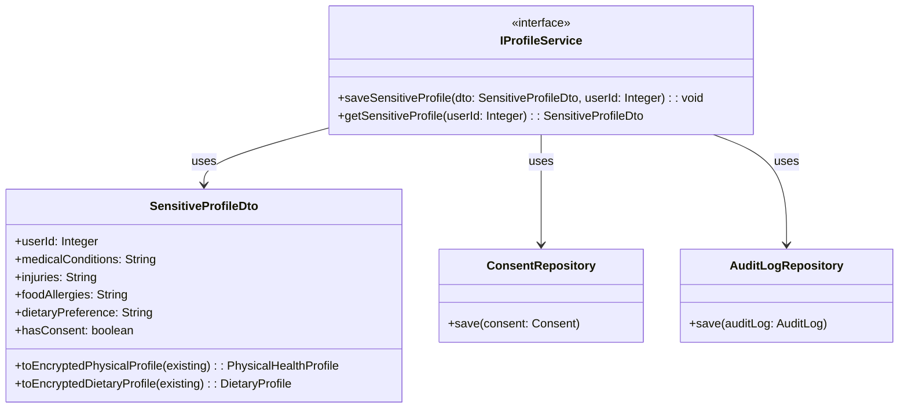
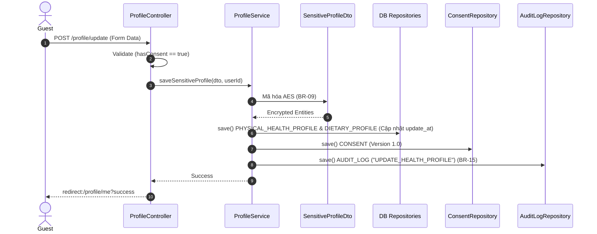

# ENGINEERING DOCUMENTATION STANDARD (EDS) v2.0
## Đặc tả Hiện thực hóa: UC02 - Complete Health & Dietary Profile

| Field | Value |
| :--- | :--- |
| **Document ID** | `HOS03-MOD1-IMP-002` |
| **Version** | 1.3 (Hoàn thiện theo UC02_Specification cập nhật) |
| **Date** | 2026-06-23 |
| **Status** | Approved |
| **Document Owner** | Sinh viên 1 (Module 1) |
| **Author** | Antigravity AI |
| **Reviewed by** | [Tech Lead] |
| **DPO Sign-off** | [x] Approved |
| **Based on EDS** | v2.0 |

---

## CHANGELOG

| Ngày | Người thực hiện | Nội dung thay đổi |
| :--- | :--- | :--- |
| 2026-06-21 | Antigravity AI | Tạo tài liệu thiết kế đặc tả cho UC02 |
| 2026-06-21 | Antigravity AI | Sửa đổi kiến trúc sang chuẩn Spring Boot MVC. |
| 2026-06-23 | Antigravity AI | Khớp 100% với file Spec: Tích hợp `AuditLog` entity, `Consent` entity, và lưu vết `update_at`. Bổ sung Traceability BR-10, BR-15. |

---

## MỤC LỤC
1. [Tổng quan Module](#1-tổng-quan-module)
2. [Ma trận Truy vết (Traceability Matrix)](#2-ma-trận-truy-vết-traceability-matrix)
3. [Architecture Decision Records (ADR)](#3-architecture-decision-records-adr)
4. [Non-Functional Requirements & SLA](#4-non-functional-requirements--sla)
5. [Static Modeling (Mô hình Tĩnh)](#5-static-modeling-mô-hình-tĩnh)
6. [Dynamic Modeling (Mô hình Hướng Động)](#6-dynamic-modeling-mô-hình-hướng-động)
7. [Domain Event Catalog](#7-domain-event-catalog)
8. [Interface Specification (Đặc tả Giao diện)](#8-interface-specification-đặc-tả-giao-diện)
9. [Controller & View Specification](#9-controller--view-specification)
10. [Bảng mã lỗi (Error Handling)](#10-bảng-mã-lỗi-error-handling)
11. [Quy trình Triển khai (Step-by-Step)](#11-quy-trình-triển-khai-step-by-step)
12. [Kịch bản Kiểm thử Chi tiết](#12-kịch-bản-kiểm-thử-chi-tiết)
13. [Phương pháp Xác minh](#13-phương-pháp-xác-minh)
14. [Bảng tổng hợp phân quyền (Authorization Matrix)](#14-bảng-tổng-hợp-phân-quyền-authorization-matrix)

---

## 1. Tổng quan Module

Mô tả: Đặc tả kỹ thuật cho tính năng tạo và cập nhật Hồ sơ Sức khỏe & Dinh dưỡng. Tính năng được xây dựng trên **Spring Boot MVC**, trả về giao diện Thymeleaf. Đảm bảo thu thập, mã hóa (AES-128), ghi log (Audit) và bảo vệ thông tin y tế nhạy cảm của khách hàng tuân thủ Nghị định 356/2025/NĐ-CP.

---

## 2. Ma trận Truy vết (Traceability Matrix)

| Requirement ID | Loại | Mô tả yêu cầu | Thành phần Code | Compliance Target | ADR liên quan |
| :--- | :--- | :--- | :--- | :--- | :--- |
| BR-08 | Business Rule | Yêu cầu sự đồng ý không check sẵn | View (`profile.html`), `ConsentRepository` | NĐ 356/2025 Art. 6 | — |
| BR-09 | Business Rule | Mã hóa dữ liệu nhạy cảm tại DB | `AesDataEncryptor`, `SensitiveProfileDto` | NĐ 356/2025 Art. 4 | ADR-001 |
| BR-07 | Business Rule | Phân quyền RBAC & Data Minimization | `SecurityConfig`, View Controller | Nguyên tắc Data Minimization | — |
| BR-10 | Business Rule | Quyền được xóa vĩnh viễn (Right to Deletion) | `DELETE /profile/me` (Tương lai) | GDPR / NĐ 356 | — |
| BR-15 | Business Rule | Mọi hành động lưu/cập nhật phải lưu Audit log | `AuditLogRepository` | Logging Compliance | — |

---

## 3. Architecture Decision Records (ADR)

### `ADR-001` — Tách biệt logic Mã hóa vào DTO thay vì JPA @Convert trên Entity

**Status**: Accepted

**Quyết định**: Tạo một lớp trung gian `SensitiveProfileDto` nằm trong Module 1. DTO này sẽ trực tiếp gọi `AesDataEncryptor` để mã hóa/giải mã. Controller chỉ làm việc với DTO. Entity của các team khác sẽ không bị ảnh hưởng.

---

## 5. Static Modeling (Mô hình Tĩnh)

### 5.1. Class Diagram (PlantUML)



---

## 6. Dynamic Modeling (Mô hình Hướng Động)

### 6.1. Sequence Diagram — Update Health Profile MVC (PlantUML)



---

## 8. Interface Specification (Đặc tả Giao diện)

### 8.1. Service Interface

```java
public interface IProfileService {
  void saveSensitiveProfile(SensitiveProfileDto inputDto, Integer userId);
  SensitiveProfileDto getSensitiveProfile(Integer userId);
}
```

---

## 9. Controller & View Specification

### 9.1. Controller Mappings

| Method | Path | Auth Level | View Trả Về / Điều Hướng |
| :--- | :--- | :--- | :--- |
| GET | `/profile/me` | JWT / Session (GUEST) | `auth/profile` (Thymeleaf) |
| POST | `/profile/update` | JWT / Session (GUEST) | `redirect:/profile/me?success` |

---

## 10. Bảng mã lỗi (Error Handling)

| Mã lỗi (Nội bộ) | Trải nghiệm người dùng (View hiển thị) | Trigger |
| :--- | :--- | :--- |
| MSG-03 | "Bạn phải đồng ý với các điều khoản bảo mật dữ liệu y tế để tiếp tục" | Nhấn Submit nhưng bỏ tick checkbox `hasConsent` (Ngoại lệ E1). |
| MSG-15 | "Đã xảy ra lỗi hệ thống. Vui lòng thử lại sau" | Lỗi DB, lỗi mã hóa AES (Ngoại lệ E2). |

---

## 12. Kịch bản Kiểm thử Chi tiết
#### `TC-MVC-001` — Chặn form khi thiếu Consent (Luồng E1)
- **Scenario**: Guest điền form nhưng không tick Consent.
- **Expected**: Controller bắt lỗi `hasConsent == false`, reload form và báo `MSG-03`.

#### `TC-MVC-002` — Kiểm tra Audit Log (BR-15)
- **Scenario**: Khi Guest lưu hồ sơ thành công.
- **Expected**: Data lưu vào bảng `AUDIT_LOG` với `action_type = 'UPDATE_HEALTH_PROFILE'`.

---

## 13. Phương pháp Xác minh
### 13.1. Database Inspection
```sql
SELECT medical_conditions, update_at FROM PHYSICAL_HEALTH_PROFILE WHERE user_id = 123;
-- Expected: medical_conditions là Base64. update_at phải khớp với thời điểm Submit.

SELECT consent_status FROM CONSENT WHERE user_id = 123;
-- Expected: Giá trị là 1 (True).

SELECT action_type, timestamp FROM AUDIT_LOG WHERE actor_id = 123 ORDER BY timestamp DESC;
-- Expected: Có dòng UPDATE_HEALTH_PROFILE vừa tạo.
```
