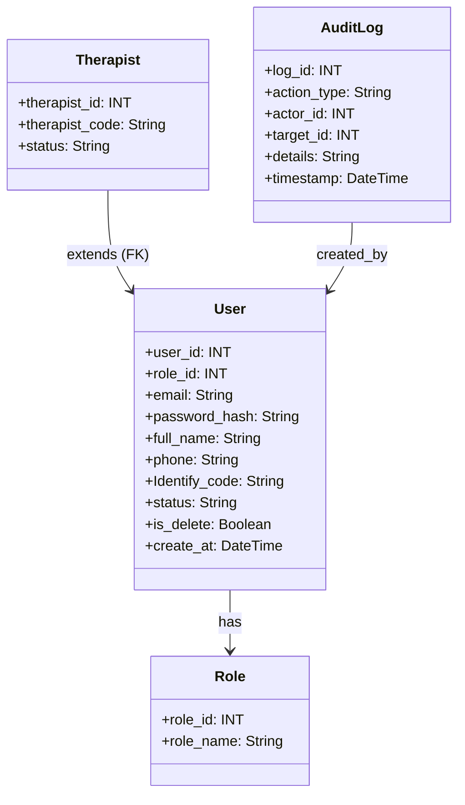
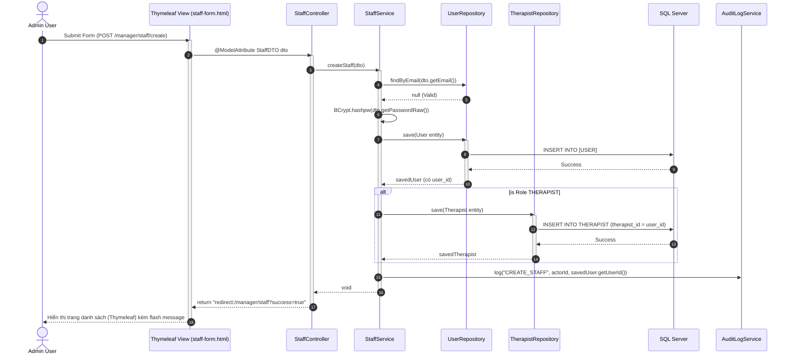

# ENGINEERING DOCUMENTATION STANDARD (EDS) v2.0

## Quy chuẩn Tài liệu Kỹ thuật và Đặc tả Hiện thực hóa - UC03

| Field                    | Value                    |
| :----------------------- | :----------------------- |
| **Document ID**    | `HOS03-MOD1-IMP-003`   |
| **Version**        | 1.2                      |
| **Date**           | 2026-06-28               |
| **Status**         | Draft                    |
| **Document Owner** | System Admin Team        |
| **Author**         | NgocNM                   |
| **Reviewed by**    | [NgocNM]                 |
| **DPO Sign-off**   | [ ] Pending - YYYY-06-28 |
| **Approved by**    | [Approve]                |
| **Last Review**    | 2026-06-28               |
| **Based on EDS**   | v2.0                     |

---

## CHANGELOG

| Ngày      | Người thực hiện      | Nội dung thay đổi                                                                  |
| :--------- | :----------------------- | :------------------------------------------------------------------------------------ |
| 2026-06-28 | Senior Software Engineer | Tạo tài liệu lần đầu cho UC03 (Manage Staff Accounts)                           |
| 2026-06-28 | Senior Software Engineer | Cập nhật thiết kế (v1.1) để đồng bộ cấu trúc với`DB.sql` hiện hành    |
| 2026-06-28 | Senior Software Engineer | Cập nhật thiết kế (v1.2) chuẩn hóa theo Kiến trúc Spring Boot MVC (Thymeleaf) |

---

## 1. Tổng quan Module

Tài liệu này đặc tả kỹ thuật (Implementation) cho chức năng Quản lý Tài khoản & Phân quyền Nhân viên (UC03). Tính năng này thiết lập định danh và phân quyền chặt chẽ (RBAC) để thực thi nguyên tắc Thu hẹp dữ liệu (Data Minimization) bảo vệ dữ liệu sức khỏe nhạy cảm của khách hàng.

| Field                           | Value                                                             |
| :------------------------------ | :---------------------------------------------------------------- |
| **Module Name**           | Module 1: Authentication & Sensitive Health Profile               |
| **Bounded Context**       | Identity & Access Management (IAM)                                |
| **Data Classification**   | Internal / Confidential (PII của Nhân viên)                    |
| **Compliance Scope**      | Vietnam Decree 356/2025/ND-CP (Data Minimization)                 |
| **Upstream Dependencies** | N/A                                                               |
| **Downstream Consumers**  | Module 2 (Booking), Module 3 (Spa Engine), Module 4 (Dietary F&B) |

---

## 2. Ma trận Truy vết (Traceability Matrix)

| Requirement ID | Loại (BR/ADR/US) | Mô tả yêu cầu                       | Thành phần Code            | Compliance Target       | ADR liên quan |
| :------------- | :---------------- | :-------------------------------------- | :--------------------------- | :---------------------- | :------------- |
| BR-01          | Business Rule     | Strict Role Binding (RBAC)              | `UserService.assignRole()` | Decree 356/2025 Art. 6  | ADR-001        |
| BR-02          | Business Rule     | Historical Data Integrity (Soft Delete) | `UserService.deactivate()` | Data Integrity          | ADR-002        |
| BR-03          | Business Rule     | Mọi thao tác cần lưu Audit Trail    | `AuditLogService`          | Security Auditing       | —             |
| BR-04          | Business Rule     | Credential Security (Mật khẩu hash)   | `PasswordEncoder.encode()` | GDPR Art. 32 / Security | —             |

---

## 3. Architecture Decision Records (ADR)

### `ADR-001` — RBAC System (Role-Based Access Control)

| Field              | Value      |
| :----------------- | :--------- |
| **Status**   | Accepted   |
| **Deciders** | NgocNM     |
| **Date**     | 2026-06-28 |

#### Bối cảnh (Context)

Hệ thống cần chặn F&B/Chef xem bệnh án vật lý của khách, và chặn Therapist xem thông tin dị ứng thức ăn (Data Minimization). Cần phân chia vai trò rõ ràng.

#### Phương án

Dùng bảng độc lập `ROLE` và liên kết khóa ngoại `role_id` vào bảng `USER`.

#### Quyết định

Sử dụng mô hình chuẩn hóa (Normalized): bảng `[ROLE]` và khóa ngoại `role_id` tại bảng `[USER]`. Các nhân sự có nghiệp vụ lập lịch đặc thù (Therapist, Yoga Instructor) sẽ có thêm 1 bảng con mở rộng (`THERAPIST`, `YOGA_INSTRUCTOR`) kế thừa từ bảng `[USER]` để lưu các thuộc tính riêng (VD: `therapist_code`, `status`).

### `ADR-002` — Soft Delete thay vì Hard Delete cho Staff

| Field              | Value      |
| :----------------- | :--------- |
| **Status**   | Accepted   |
| **Deciders** | NgocNM     |
| **Date**     | 2026-06-28 |

#### Bối cảnh (Context)

Nếu xóa cứng 1 Therapist, toàn bộ Appointment và Invoice cũ của họ trong Module 3, Module 5 sẽ bị mất liên kết (Lỗi khóa ngoại FK).

#### Quyết định

Sử dụng cờ `status = 'INACTIVE'` (trạng thái hoạt động) kết hợp `is_delete = 1` thay vì lệnh `DELETE`. Bảng `USER` của SQL Server đã hỗ trợ sẵn hai trường này.

---

## 4. Non-Functional Requirements & SLA

### 4.1. Performance & Availability

| Category     | Requirement    | Target SLA | Measurement Method | Compliance Basis |
| :----------- | :------------- | :--------- | :----------------- | :--------------- |
| Latency      | Response (p99) | < 300ms    | Load Test          | —               |
| Availability | Uptime         | 99.9%      | Uptime monitor     | —               |

### 4.2. Data Integrity & Retention

| Category   | Requirement         | Target  | Verification Method | Compliance Basis   |
| :--------- | :------------------ | :------ | :------------------ | :----------------- |
| Retention  | Audit log retention | 7 năm  | DB backup policy    | Auditing Standards |
| Durability | Zero record loss    | RPO = 0 | Transaction log     | —                 |

### 4.3. Security

| Category       | Requirement          | Target     | Verification Method | Compliance Basis       |
| :------------- | :------------------- | :--------- | :------------------ | :--------------------- |
| Password Hash  | Tất cả Staff       | BCrypt     | Source code check   | Security Best Practice |
| Access control | Chỉ Admin quản lý | Role=ADMIN | Auth Matrix         | RBAC Policy            |

---

## 5. Static Modeling (Mô hình Tĩnh)

### 5.1. Class Diagram (PlantUML)



### 5.2. Data Structure (Mapped from DB.sql)

```sql
-- Các bảng cốt lõi (Trích xuất từ DB.sql)

CREATE TABLE [ROLE] (
    role_id INT IDENTITY(1,1) PRIMARY KEY,
    role_name VARCHAR(50) NOT NULL
);

CREATE TABLE [USER] (
    user_id INT IDENTITY(1,1) PRIMARY KEY,
    role_id INT NOT NULL,
    email VARCHAR(50) NOT NULL UNIQUE,
    password_hash VARCHAR(255) NOT NULL,
    full_name NVARCHAR(50),
    phone VARCHAR(20),
    Identify_code VARCHAR(255),
    status VARCHAR(10) CHECK (status IN ('ACTIVE', 'INACTIVE', 'BANNED')),
    is_delete BIT DEFAULT 0,
    -- (Các trường khác tham khảo DB.sql)
    CONSTRAINT FK_USER_ROLE FOREIGN KEY (role_id) REFERENCES [ROLE](role_id)
);

CREATE TABLE THERAPIST (
    therapist_id INT PRIMARY KEY,
    therapist_code VARCHAR(6) NOT NULL UNIQUE,
    status VARCHAR(10) CHECK (status IN ('AVAILABLE', 'BUSY', 'OFF_DUTY')),
    CONSTRAINT FK_THERAPIST_USER FOREIGN KEY (therapist_id) REFERENCES [USER](user_id)
);

CREATE TABLE AUDIT_LOG (
    log_id INT IDENTITY(1,1) PRIMARY KEY,
    action_type VARCHAR(50) NOT NULL,
    actor_id INT NOT NULL,
    target_id INT,
    details NVARCHAR(MAX),
    timestamp DATETIME DEFAULT GETDATE(),
    CONSTRAINT FK_AUDIT_ACTOR FOREIGN KEY (actor_id) REFERENCES [USER](user_id)
);
```

---

## 6. Dynamic Modeling (Mô hình Hướng Động)

### 6.1. Sequence Diagram — Create Staff (Spring MVC Flow)



---

## 7. Domain Event Catalog

### 7.1. Events Published (Phát ra)

| Event Name           | Trigger               | Publisher        | Subscriber(s)       | Payload Schema                        | Async? |
| :------------------- | :-------------------- | :--------------- | :------------------ | :------------------------------------ | :----- |
| `StaffCreated`     | Tạo NV thành công  | `StaffService` | `AuditLogService` | `StaffEvent(userId, email, roleId)` | Yes    |
| `StaffDeactivated` | Đổi status=INACTIVE | `StaffService` | `SessionRegistry` | `StaffEvent(userId)`                | Yes    |

---

## 8. Interface Specification (Đặc tả Java Interface)

### 8.1. Service Interface & DTOs

```java
// StaffDTO.java
@Data
public class StaffDTO {
    @NotBlank(message = "Họ tên không được để trống")
    private String fullName;

    @Email(message = "Email không đúng định dạng")
    private String email;

    @NotBlank(message = "Mật khẩu không được để trống")
    private String passwordRaw;

    @NotNull(message = "Chưa chọn chức vụ")
    private Integer roleId;

    private String phone;
    private String identifyCode;
}

// StaffService.java
public interface StaffService {
    void createStaff(StaffDTO input, Integer actorId);
    void deactivateStaff(Integer userId, Integer actorId);
    List<User> getAllStaffs();
}
```

---

## 9. Controller / MVC Routing Specification

### 9.1. Routing Table

| HTTP Method | URL Path                           | Controller Method       | Security Role        | Trả về (View / Redirect)                             |
| :---------- | :--------------------------------- | :---------------------- | :------------------- | :----------------------------------------------------- |
| GET         | `/manager/staff`                 | `listStaffs()`        | `hasRole('ADMIN')` | `manager/staff-list`                                 |
| GET         | `/manager/staff/create`          | `showCreateForm()`    | `hasRole('ADMIN')` | `manager/staff-form`                                 |
| POST        | `/manager/staff/create`          | `processCreateForm()` | `hasRole('ADMIN')` | `redirect:/manager/staff` (Hoặc về form nếu lỗi) |
| POST        | `/manager/staff/{id}/deactivate` | `deactivateStaff()`   | `hasRole('ADMIN')` | `redirect:/manager/staff`                            |

### 9.2. Luồng xử lý Model & View

#### `POST /manager/staff/create` — Xử lý Form Thêm Mới

**Tham số đầu vào (Form Data / @ModelAttribute)**:

* `fullName`, `email`, `passwordRaw`, `roleId`, `phone`, `identifyCode`.

**Kịch bản Thành công (Happy Path)**:

* Hệ thống lưu User vào database thành công.
* Controller sử dụng `RedirectAttributes.addFlashAttribute("successMsg", "Thêm nhân viên thành công!")`.
* **Return**: `redirect:/manager/staff`.

**Kịch bản Lỗi Validate (Validation Error)**:

* `BindingResult` báo lỗi (VD: thiếu thông tin, email sai định dạng).
* Controller đẩy danh sách lỗi vào `Model`.
* **Return**: `manager/staff-form` (hiển thị lại form kèm text đỏ báo lỗi Thymeleaf `#fields.hasErrors()`).

---

## 10. Bảng thông báo lỗi (Validation & Business Errors)

| Code        | Loại Lỗi                        | Message hiển thị trên UI (Thymeleaf)            | Trigger Condition                                   |
| :---------- | :----------------------------------- | :---------------------------------------------------- | :-------------------------------------------------- |
| `VAL-001` | Validation Error (`BindingResult`) | Vui lòng điền đầy đủ các trường bắt buộc! | Form thiếu required fields                         |
| `BIZ-001` | Business Logic Error                 | Email đã tồn tại trên hệ thống!                | Email truyền vào đã có trong DB                |
| `SEC-001` | Spring Security Error                | Truy cập bị từ chối (403 Forbidden)               | URL mapping chỉ dành cho ADMIN, role khác gọi   |
| `BIZ-002` | Business Logic Error                 | Không thể vô hiệu hóa Admin cuối cùng!         | Cố tình POST tới`/deactivate` của Admin cuối |

---

## 16. Bảng tổng hợp phân quyền (Spring Security Route Matchers)

| URL Pattern           | GUEST | THERAPIST | CHEF | RECEPTIONIST | ADMIN |
| :-------------------- | :---: | :-------: | :--: | :----------: | :---: |
| `/manager/staff/**` |  ❌  |    ❌    |  ❌  |      ❌      |  ✅  |

*(Toàn bộ các URL thuộc path `/manager/staff` sẽ được cấu hình trong `SecurityConfig.java` với `requestMatchers("/manager/staff/**").hasRole("ADMIN")`)*
