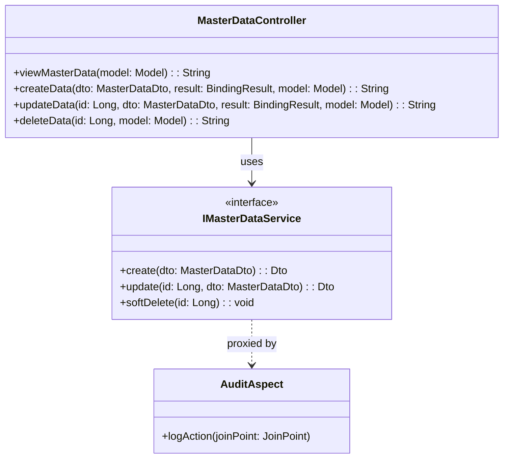
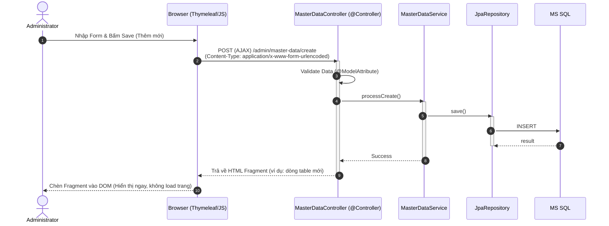

# ENGINEERING DOCUMENTATION STANDARD (EDS) v2.0

## Quy chuẩn Tài liệu Kỹ thuật và Đặc tả Hiện thực hóa

| Field                    | Value                                                                                              |
| :----------------------- | :------------------------------------------------------------------------------------------------- |
| **Document ID**    | `XOA-MOD1-IMP-004`                                                                               |
| **Version**        | 1.1                                                                                                |
| **Date**           | 2026-06-25                                                                                         |
| **Status**         | Approve                                                                                            |
| **Document Owner** | System Administrator                                                                               |
| **Author**         | Antigravity AI (Senior Software Engineer)                                                          |
| **Reviewed by**    | Tech Lead                                                                                          |
| **DPO Sign-off**   | N/A (Dữ liệu danh mục không chứa PII của khách hàng, chỉ chứa thông tin Staff nội bộ) |
| **Approved by**    | Principal Architect                                                                                |
| **Last Review**    | 2026-06-25                                                                                         |
| **Based on EDS**   | v2.0                                                                                               |

---

## CHANGELOG

> [!IMPORTANT]
> **Policy 4.4 — Immutable History**: Không bao giờ xóa thông tin cũ. Mọi thay đổi phải ghi vào bảng này.

| Ngày      | Người thực hiện | Nội dung thay đổi                                                             |
| :--------- | :------------------ | :------------------------------------------------------------------------------- |
| 2026-06-25 | NgocNM              | Tạo tài liệu lần đầu dựa trên đặc tả UC04                             |
| 2026-06-25 | NgocNM              | Chỉnh sửa kiến trúc hoàn toàn sang Spring Boot MVC (Thymeleaf) theo Policy |

---

## MỤC LỤC

1. [Tổng quan Module](#1-tổng-quan-module)
2. [Ma trận Truy vết (Traceability Matrix)](#2-ma-trận-truy-vết-traceability-matrix)
3. [Architecture Decision Records (ADR)](#3-architecture-decision-records-adr)
4. [Non-Functional Requirements &amp; SLA](#4-non-functional-requirements--sla)
5. [Static Modeling (Mô hình Tĩnh)](#5-static-modeling-mô-hình-tĩnh)
6. [Dynamic Modeling (Mô hình Hướng Động)](#6-dynamic-modeling-mô-hình-hướng-động)
7. [Domain Event Catalog](#7-domain-event-catalog)
8. [Interface Specification (Đặc tả Giao diện)](#8-interface-specification-đặc-tả-giao-diện)
9. [API Specification](#9-api-specification)
10. [Bảng mã lỗi (Error Codes)](#10-bảng-mã-lỗi-error-codes)
11. [Quy trình Triển khai (Step-by-Step)](#11-quy-trình-triển-khai-step-by-step)
12. [Rollback &amp; Incident Runbook](#12-rollback--incident-runbook)
13. [Kịch bản Kiểm thử Chi tiết](#13-kịch-bản-kiểm-thử-chi-tiết)
14. [Phương pháp Xác minh](#14-phương-pháp-xác-minh)
15. [Mẫu thử thực tế (API Verification Samples)](#15-mẫu-thử-thực-tế-api-verification-samples)
16. [Bảng tổng hợp phân quyền (Authorization Matrix)](#16-bảng-tổng-hợp-phân-quyền-authorization-matrix)

---

## 1. Tổng quan Module

> [!NOTE]
> Mô tả ngắn gọn mục đích của module, phạm vi nghiệp vụ và lý do tồn tại.

| Field                           | Value                                                                                |
| :------------------------------ | :----------------------------------------------------------------------------------- |
| **Module Name**           | Master Data Management (UC04)                                                        |
| **Bounded Context**       | Core Configuration & System Setup                                                    |
| **Data Classification**   | Internal / Confidential (Đối với thông tin Staff)                                |
| **Compliance Scope**      | Internal Auditing                                                                    |
| **Upstream Dependencies** | Identity & Access Management (Module 1 - Admin Auth)                                 |
| **Downstream Consumers**  | Booking (Module 2), Spa Schedule (Module 3), F&B Menu (Module 4), Reports (Module 5) |

---

## 2. Ma trận Truy vết (Traceability Matrix)

> [!NOTE]
> Ánh xạ trực tiếp: `[Mã yêu cầu]` → `[Thành phần Code]` → `[Mục tiêu Tuân thủ]`.

| Requirement ID | Loại (BR/ADR/US) | Mô tả yêu cầu                                            | Thành phần Code                  | Compliance Target | ADR liên quan |
| :------------- | :---------------- | :----------------------------------------------------------- | :--------------------------------- | :---------------- | :------------- |
| BR-13          | Business Rule     | Yêu cầu sử dụng Soft Delete thay vì xóa cứng vật lý | `MasterDataService.softDelete()` | Data Integrity    | ADR-001        |
| BR-15          | Business Rule     | Ghi lại toàn bộ thao tác CRUD vào`AUDIT_LOG`          | `AuditLogAspect`                 | Accountability    | —             |
| BR-16          | Business Rule     | Ràng buộc validation (giá >= 0, code duy nhất)           | `@Valid` trên `MasterDataDto` | Data Consistency  | —             |
| BR-17          | Business Rule     | Áp dụng chuẩn GWI cho Retreat Packages                    | `RetreatPackageService`          | GWI Taxonomy      | —             |

---

## 3. Architecture Decision Records (ADR)

### `ADR-001` — Áp dụng Cơ chế Soft Delete cho toàn bộ Master Data

| Field              | Value                       |
| :----------------- | :-------------------------- |
| **Status**   | Accepted                    |
| **Deciders** | System Architect, Tech Lead |
| **Date**     | 2026-06-25                  |

#### Bối cảnh (Context)

> [!NOTE]
> Master Data (Hạng phòng, Dịch vụ, Nhân sự) được liên kết chặt chẽ với các giao dịch vận hành như Booking, Hóa đơn. Việc xóa vật lý sẽ làm đứt gãy khóa ngoại và thất thoát dữ liệu thống kê lịch sử (Guest Folio).

#### Các phương án đã xem xét (Options Considered)

| Phương án | Mô tả                                    | Ưu điểm                                        | Nhược điểm                                                         |
| :----------- | :----------------------------------------- | :------------------------------------------------ | :--------------------------------------------------------------------- |
| A            | Xóa cứng (Hard Delete)                   | CSDL sạch sẽ, nhỏ gọn.                        | Lỗi rác dữ liệu, vi phạm báo cáo tài chính.                   |
| B            | Cờ đánh dấu`is_delete` (Soft Delete) | Dữ liệu lịch sử an toàn, dễ dàng rollback. | Câu lệnh SQL lấy dữ liệu phải luôn gắn`WHERE is_delete = 0`. |

#### Quyết định (Decision)

> [!NOTE]
> Chọn Phương án `[B]` vì đảm bảo tính toàn vẹn của dữ liệu Booking và kế toán lịch sử. Đối với bảng `USER` khi xóa mềm Staff, sẽ cập nhật đồng thời `status = 'INACTIVE'` và `is_delete = 1`.

#### Hệ quả (Consequences)

**Tích cực**: Báo cáo tài chính và Guest Folio luôn khớp số liệu và thông tin dịch vụ.
**Tiêu cực / Trade-offs**: Các Repository layer phải tự động lọc bản ghi có `is_delete = 0` bằng annotation Hibernate `@SQLRestriction`.

---

### `ADR-002` — Spring Boot MVC kết hợp AJAX trả về Thymeleaf Fragment

| Field              | Value          |
| :----------------- | :------------- |
| **Status**   | Accepted       |
| **Deciders** | Front-end Lead |
| **Date**     | 2026-06-25     |

#### Bối cảnh (Context)

> [!NOTE]
> Giao diện có 4 tab danh mục. Để đảm bảo mượt mà (không load lại toàn trang) như yêu cầu của UC04 nhưng vẫn tuân thủ nguyên tắc Spring Boot MVC (Không dùng REST API trả JSON). Phải dùng MVC, không được REST API, không trả JSON

#### Quyết định (Decision)

> [!NOTE]
> Sử dụng các AJAX Requests (ví dụ thông qua Fetch API) gửi dữ liệu Form data (`@ModelAttribute`) về `@Controller`. Controller sẽ xử lý nghiệp vụ và trả về các file mẫu **HTML Fragment (Thymeleaf)** để Javascript tự động hoán đổi (swap) phần DOM thay vì phải render lại toàn trang.

---

## 4. Non-Functional Requirements & SLA

### 4.1. Performance & Availability

| Category     | Requirement                    | Target SLA | Measurement Method | Compliance Basis |
| :----------- | :----------------------------- | :--------- | :----------------- | :--------------- |
| Latency      | Page load time / Fragment load | < 500ms    | k6 load test       | UX Standard      |
| Availability | Uptime (monthly)               | 99.9%      | Uptime monitor     | Core Setup Req   |

### 4.2. Data Integrity & Retention

| Category   | Requirement         | Target  | Verification Method | Compliance Basis |
| :--------- | :------------------ | :------ | :------------------ | :--------------- |
| Durability | Zero record loss    | RPO = 0 | Transaction log     | Financial Audit  |
| Retention  | Audit log retention | 5 năm  | DB backup policy    | Internal Policy  |

### 4.3. Security

| Category       | Requirement                  | Target               | Verification Method  | Compliance Basis |
| :------------- | :--------------------------- | :------------------- | :------------------- | :--------------- |
| Access control | Chỉ Admin được thao tác | `hasRole('ADMIN')` | Spring Security Test | RBAC (HOS-03)    |

---

## 5. Static Modeling (Mô hình Tĩnh)

### 5.1. Class Diagram (PlantUML)



### 5.2. Data Structure (JPA Entities)

```java
// === [VILLA_TYPE] SCHEMA ===
@Entity
@Table(name = "villa_type")
@SQLRestriction("is_delete = 0")
public class VillaType {
    @Id @GeneratedValue(strategy = GenerationType.IDENTITY)
    private Long id;
    private String typeName;
    private String image;
    private BigDecimal pricePerDay;
    private boolean isDelete = false;
}
```

---

## 6. Dynamic Modeling (Mô hình Hướng Động)

### 6.1. Sequence Diagram — Happy Path (PlantUML)



---

## 7. Domain Event Catalog

### 7.1. Events Published (Phát ra)

| Event Name            | Trigger                       | Publisher             | Subscriber(s)       | Payload Schema    | Async? |
| :-------------------- | :---------------------------- | :-------------------- | :------------------ | :---------------- | :----- |
| `MasterDataUpdated` | Thêm, Sửa, Xóa Master Data | `MasterDataService` | `AuditLogService` | `AuditLogEvent` | Yes    |

---

## 8. Interface Specification (Đặc tả Giao diện)

### 8.1. Service Interface

```java
public interface IMasterDataService<T, ID> {
  /**
   * Cập nhật danh mục
   * @throws IllegalArgumentException Khi ID không tồn tại
   */
  T update(ID id, T dto);

  /**
   * Xóa mềm danh mục.
   */
  void softDelete(ID id);
}
```

---

## 9. API Specification (Spring MVC Endpoints)

### 9.1. Endpoints Table

| Method | Path                                          | Auth Level | Required Roles | Rate Limit | Return Type                                           |
| :----- | :-------------------------------------------- | :--------- | :------------- | :--------- | :---------------------------------------------------- |
| GET    | `/admin/master-data`                        | Session    | `ADMIN`      | 100/min    | View (`master-data/index.html`)                     |
| GET    | `/admin/master-data/{category}`             | Session    | `ADMIN`      | 100/min    | Fragment (`master-data/fragments :: tabContent`)    |
| POST   | `/admin/master-data/{category}/create`      | Session    | `ADMIN`      | 60/min     | Fragment (`master-data/fragments :: dataRow`)       |
| POST   | `/admin/master-data/{category}/{id}/update` | Session    | `ADMIN`      | 60/min     | Fragment (`master-data/fragments :: dataRow`)       |
| POST   | `/admin/master-data/{category}/{id}/delete` | Session    | `ADMIN`      | 60/min     | Fragment (`master-data/fragments :: emptyResponse`) |

### 9.2. Request / Response Schemas (Spring MVC)

#### POST `/admin/master-data/spa-services/create`

**Request Body (`application/x-www-form-urlencoded`)**:

```text
treatmentCode=SWD-001&serviceName=Swedish+Massage&durationMinutes=60&price=500000&isAvailable=true
```

**Response — 200 OK (Thymeleaf HTML Fragment)**:

```html
<tr id="row-1">
  <td>SWD-001</td>
  <td>Swedish Massage</td>
  <td>60 phút</td>
  <td>500,000 VND</td>
  <td><span class="badge bg-success">Active</span></td>
  <td>
      <button class="btn btn-sm btn-primary" onclick="editData(1)">Sửa</button>
      <button class="btn btn-sm btn-danger" onclick="deleteData(1)">Xóa</button>
  </td>
</tr>
```

---

## 10. Bảng mã lỗi (Error Codes)

| Code            | HTTP Status | Message (VI)                              | Trigger Condition                      |
| :-------------- | :---------- | :---------------------------------------- | :------------------------------------- |
| `MST-001`     | 400         | Dữ liệu Form không hợp lệ            | `BindingResult.hasErrors()`          |
| `MST-002`     | 409         | Mã định danh đã tồn tại            | Trùng lặp`treatmentCode`           |
| `MST-003`     | 404         | Không tìm thấy                         | Sửa/Xóa ID không tồn tại          |
| `MST-WARN-01` | 200         | Cảnh báo: Danh mục đang được dùng | Xóa mềm danh mục đang hoạt động |

*Ghi chú: Trong Spring MVC, lỗi thường được đưa trực tiếp vào `Model` để render ra câu thông báo lỗi trên file HTML thay vì trả về cấu trúc Error JSON.*

---

## 11. Quy trình Triển khai (Step-by-Step)

### 11.1. Prerequisites

- [X] Đã thiết kế xong Database Schema (`DB.sql`) với cờ `is_delete` đầy đủ.
- [X] Đã tạo thư mục `static/js/module1` và `static/css/module1` theo đúng Layout Principle.

### 11.2. Implementation Steps

- **Bước 1:** Khởi tạo `MasterDataController` với annotation `@Controller`.
- **Bước 2:** Cấu hình `@SQLRestriction("is_delete = 0")` trên các JPA Entity.
- **Bước 3:** Tách toàn bộ Javascript (xử lý gọi AJAX hoán đổi nội dung Fragment) ra file riêng: `static/js/module1/master-data.js`.
- **Bước 4:** Thiết kế giao diện Thymeleaf bao gồm 1 file tổng (`index.html`) và 1 file chứa các components (`fragments.html`).

---

## 12. Rollback & Incident Runbook

### 12.1. Điều kiện kích hoạt Rollback (Trigger Conditions)

| Điều kiện                             | Ngưỡng                        | Người quyết định |
| :--------------------------------------- | :------------------------------ | :-------------------- |
| Exception liên tục khi render template | > 5 lỗi TemplateInputException | Tech Lead             |

### 12.2. Rollback Procedure

- Git Revert commit gần nhất, redeploy ứng dụng. Không cần thao tác Database.

---

## 13. Kịch bản Kiểm thử Chi tiết

### 13.1. Unit Tests

#### `TC-MST-001` — Test validate MVC Form

- **Feature**: `MasterData Validation`
- **Scenario**: Nhập giá trị âm cho đơn giá.
  - **Given** Form data truyền vào `price = -100`
  - **When** POST tới `/admin/master-data/...`
  - **Then** Hàm xử lý trả về Fragment chứa div `<div class="error">Giá tiền phải lớn hơn 0</div>`

---

## 14. Phương pháp Xác minh

### 14.1. Database Inspection

- *Verify Soft Delete hoạt động*:

```sql
SELECT status, is_delete FROM "user" WHERE id = 5;
-- Expected: INACTIVE, 1
```

### 14.2. Javascript/CSS Asset Verification

- *Kiểm tra không có Script/Style rác trên HTML file*:

```bash
grep -n "<script>" d:\Learning\SWP391\...\master-data\index.html
# Expected: Trống rỗng (Tất cả script phải nằm ở file JS riêng).
```

---

## 15. Bảng tổng hợp phân quyền (Authorization Matrix)

| Endpoint                            | GUEST | RECEPTIONIST | THERAPIST | CHEF | ADMIN |
| :---------------------------------- | :---: | :----------: | :-------: | :--: | :---: |
| GET`/admin/master-data/*`         |  ❌  |      ✅      |    ✅    |  ✅  |  ✅  |
| POST`/admin/master-data/*/create` |  ❌  |      ❌      |    ❌    |  ❌  |  ✅  |
| POST`/admin/master-data/*/update` |  ❌  |      ❌      |    ❌    |  ❌  |  ✅  |
| POST`/admin/master-data/*/delete` |  ❌  |      ❌      |    ❌    |  ❌  |  ✅  |

**Chú thích**:

- ✅ = Được phép xem và sử dụng tính năng.
- ❌ = Bị từ chối, chuyển hướng tới trang 403.
