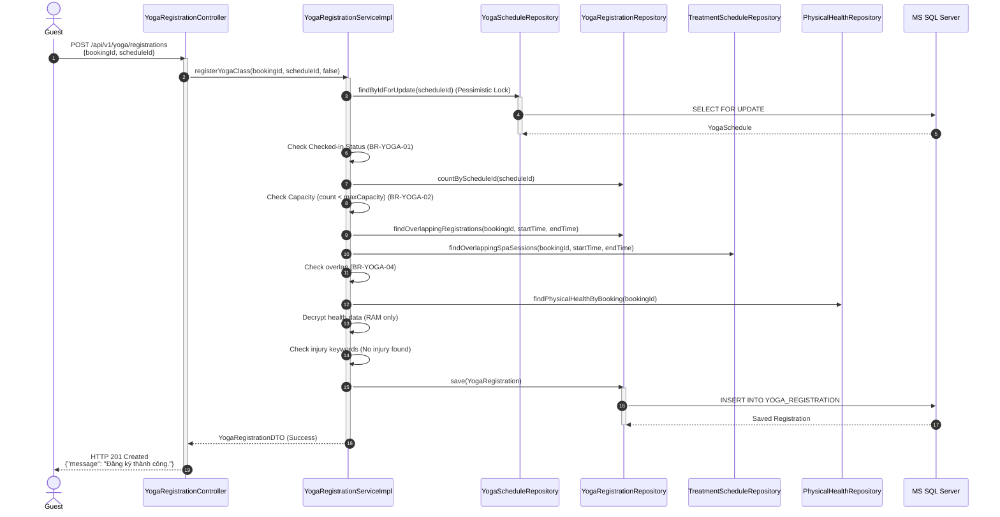
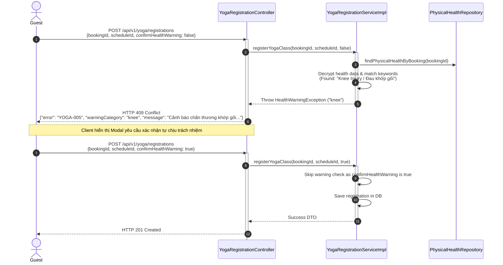

# ENGINEERING DOCUMENTATION STANDARD (EDS) v2.0
# Quy chuẩn Tài liệu Kỹ thuật và Đặc tả Hiện thực hóa: UC01 - Đăng ký tham gia lớp học Yoga

| Field | Value |
|---|---|
| **Document ID** | `HOS-YOGA-IMP-001` |
| **Version** | 1.0 |
| **Date** | 2026-06-26 |
| **Status** | Draft |
| **Document Owner** | Lê Đức Dương |
| **Author** | Lê Đức Dương - Backend Developer |
| **Reviewed by** | Tech Lead |
| **DPO Sign-off** | [ ] Pending *(bắt buộc — xử lý Physical Health Profile)* |
| **Approved by** | Principal Architect |
| **Based on EDS** | v2.0 |

---

## CHANGELOG
> **Policy 4.4 — Immutable History:** Không bao giờ xóa thông tin cũ. Mọi thay đổi phải ghi vào bảng này.

| Ngày | Người thực hiện | Nội dung thay đổi |
|---|---|---|
| 2026-06-26 | Lê Đức Dương | Tạo tài liệu lần đầu, thiết kế đặc tả chi tiết cho UC01 |

---

## MỤC LỤC
1. [Tổng quan Module](#1-tổng-quan-module)
2. [Ma trận Truy vết (Traceability Matrix)](#2-ma-trận-truy-vết-traceability-matrix)
3. [Architecture Decision Records (ADR)](#3-architecture-decision-records-adr)
4. [Non-Functional Requirements & SLA](#4-non-functional-requirements--sla)
5. [Static Modeling (Mô hình Tĩnh)](#5-static-modeling-mô-hình-tĩnh)
6. [Dynamic Modeling (Mô hình Động)](#6-dynamic-modeling-mô-hình-động)
7. [Domain Event Catalog](#7-domain-event-catalog)
8. [Interface Specification (Đặc tả Giao diện)](#8-interface-specification-đặc-tả-giao-diện)
9. [API Specification](#9-api-specification)
10. [Bảng mã lỗi (Error Codes)](#10-bảng-mã-lỗi-error-codes)
11. [Quy trình Triển khai (Step-by-Step)](#11-quy-trình-triển-khai-step-by-step)
12. [Rollback & Incident Runbook](#12-rollback--incident-runbook)
13. [Kịch bản Kiểm thử Chi tiết](#13-kịch-bản-kiểm-thử-chi-tiết)
14. [Phương pháp Xác minh](#14-phương-pháp-xác-minh)
15. [Mẫu thử thực tế (API Verification Samples)](#15-mẫu-thử-thực-tế-api-verification-samples)
16. [Bảng tổng hợp phân quyền (Authorization Matrix)](#16-bảng-tổng-hợp-phân-quyền-authorization-matrix)

---

## 1. Tổng quan Module
> Lớp học Yoga là mô hình nhóm (1 chuyên viên - nhiều khách hàng) diễn ra theo khung giờ cố định. Yêu cầu quan trọng nhất của UC01 là cho phép Khách hàng đã Checked-In xem lịch học, đăng ký tham gia lớp, đảm bảo sĩ số không vượt quá sức chứa tối đa, không trùng lịch hoạt động cá nhân khác (Spa, Yoga khác) và xử lý cảnh báo sức khỏe từ `PHYSICAL_HEALTH_PROFILE` theo chính sách bảo mật dữ liệu nhạy cảm (PII).

| Field | Value |
|---|---|
| **Module Name** | `Yoga & Mindfulness Scheduling Engine` |
| **Bounded Context** | `yoga` |
| **Data Classification** | Sensitive-PII (Physical Health Profiles - injuries, medical conditions) |
| **Compliance Scope** | Decree 356/2025 - Personal Data Protection (VN GDPR equivalent) |
| **Upstream Dependencies** | `auth` (RBAC/JWT), `booking` (Guest check-in status) |
| **Downstream Consumers** | `notification` (Reminder API), `audit` (Activity Log) |

---

## 2. Ma trận Truy vết (Traceability Matrix)

| Requirement ID | Loại (BR/ADR/US) | Mô tả yêu cầu | Thành phần Code | Compliance Target | ADR liên quan |
|---|---|---|---|---|---|
| BR-YOGA-01 | Business Rule | Checked-In Requirement: Chỉ cho phép khách hàng có đơn đặt phòng trạng thái `Checked-In` đăng ký. | `YogaRegistrationService.registerClass()` | Business Control | — |
| BR-YOGA-02 | Business Rule | Class Capacity Limit: Không vượt quá `max_capacity` của lịch học. | `YogaRegistrationService.registerClass()` | Database Integrity | ADR-YOGA-001 |
| BR-YOGA-04 | Business Rule | No Overlap Booking: Không đăng ký trùng giờ các lớp Yoga khác hoặc lịch Spa. | `YogaRegistrationService.checkOverlappingActivities()` | Business Control | — |
| US-YOGA-01 | User Story | Khách xem lịch và đăng ký lớp Yoga | `YogaRegistrationController.POST /api/v1/yoga/registrations` | — | — |
| SEC-PII-01 | Security Rule | Xử lý dữ liệu sức khỏe nhạy cảm bảo mật. Cảnh báo tự chịu trách nhiệm khi đăng ký. | `YogaRegistrationService.checkPhysicalHealthProfile()` | Decree 356/2025 | ADR-YOGA-002 |

---

## 3. Architecture Decision Records (ADR)

### ADR-YOGA-001 — Cơ chế chống Over-Capacity khi đăng ký đồng thời (Concurrency Control)

| Field | Value |
|---|---|
| **Status** | Proposed |
| **Deciders** | Lead Backend Engineer, Tech Lead |
| **Date** | 2026-06-26 |

**Bối cảnh (Context)**
> Khi một lớp học Yoga hấp dẫn sắp đến giờ (ví dụ: Sunset Yoga ở bãi biển), có thể có rất nhiều khách hàng cùng nhấn "Đăng ký" đồng thời. Nếu không khóa giao dịch hoặc quản lý đồng thời, sĩ số thực tế sẽ vượt quá giới hạn thiết lập (`max_capacity`), gây ảnh hưởng xấu tới chất lượng dịch vụ của resort.

**Các phương án đã xem xét (Options Considered)**
1. **Phương án A: Optimistic Locking (`@Version` trên bảng `YOGA_SCHEDULE`)**:
   - Thêm cột `version` vào bảng `YOGA_SCHEDULE`. Mỗi khi có đăng ký mới, cập nhật số chỗ đã đặt và tăng `version`.
   - *Ưu điểm:* Không khóa dòng DB lâu, throughput cao khi ít xung đột.
   - *Nhược điểm:* Trả về exception cho user khi bị trùng và yêu cầu cơ chế retry phức tạp từ Client.
2. **Phương án B: Pessimistic Write Lock (`PESSIMISTIC_WRITE`) trên `YOGA_SCHEDULE`**:
   - Khóa dòng của lịch học (`YOGA_SCHEDULE`) bằng `SELECT ... FOR UPDATE` khi bắt đầu quá trình đăng ký.
   - *Ưu điểm:* Đảm bảo kiểm tra số lượng đăng ký thực tế tuyệt đối chính xác trước khi insert bản ghi `YOGA_REGISTRATION`.
   - *Nhược điểm:* Chậm hơn một chút do khóa dòng, nhưng vì giới hạn của resort tối đa là 15-20 người/lớp nên lock contention không đáng kể.

**Quyết định (Decision)**
> Chọn **Phương án B**. Sử dụng **Pessimistic Write Lock** trên `YOGA_SCHEDULE` khi thực hiện đăng ký nhằm ngăn chặn race-condition tuyệt đối. Thứ tự thực thi trong transaction:
> 1. Load `YOGA_SCHEDULE` có `FOR UPDATE` lock.
> 2. Đếm số lượng `YOGA_REGISTRATION` ở trạng thái `REGISTERED` thuộc về lịch đó.
> 3. Kiểm tra nếu `count >= max_capacity` thì throw lỗi ngay lập tức.
> 4. Insert `YOGA_REGISTRATION` và commit.

---

### ADR-YOGA-002 — Bảo mật thông tin chấn thương/bệnh lý (Decree 356/2025)

| Field | Value |
|---|---|
| **Status** | Proposed |
| **Deciders** | Security Architect, DPO |
| **Date** | 2026-06-26 |

**Bối cảnh (Context)**
> Hồ sơ sức khỏe của khách chứa dữ liệu PII cực kỳ nhạy cảm (Sensistive-PII). Hệ thống cần quét để cảnh báo chấn thương phù hợp với bài tập lớp Yoga nhưng phải tuân thủ Decree 356/2025.

**Quyết định (Decision)**
> 1. Dữ liệu chỉ được giải mã trên RAM và kiểm tra từ khóa (ví dụ: "knee", "spine", "heart", "cardio", "khớp gối", "cột sống", "tim mạch").
> 2. Tuyệt đối không log thông tin bệnh lý dạng plaintext ra file logs của hệ thống.
> 3. API đăng ký Yoga sẽ trả về cờ cảnh báo sức khỏe trước (`health_warning: true` kèm danh mục cảnh báo) để Client hiển thị popup xác nhận tự chịu trách nhiệm. Nếu khách ấn đồng ý, Client sẽ gửi request kèm cờ xác nhận `confirm_health_warning: true`.

---

## 4. Non-Functional Requirements & SLA

| Category | Requirement | Target SLA | Measurement Method | Compliance Basis |
|---|---|---|---|---|
| **Latency** | Thời gian phản hồi API đăng ký | < 400ms (p99) | JMeter / k6 Load Test | Trải nghiệm khách hàng |
| **Security** | Giải mã thông tin PII nhạy cảm | Giải mã tại RAM, không lưu log thô | Code review / static scan | Decree 356/2025 |
| **Data Integrity**| Không vượt sĩ số (Over-capacity) | 0% vượt giới hạn | Concurrency integration test | BR-YOGA-02 |
| **Audit Trail** | Ghi log đăng ký / hủy đăng ký | 100% các sự kiện | `AUDIT_LOG` table check | Decree 356/2025 |

---

## 5. Static Modeling (Mô hình Tĩnh)

### 5.1. Entity Schema (JPA Java)

```java
// com.AuraMoon.auramoon.yoga.entity.YogaClass
@Entity
@Table(name = "YOGA_CLASS")
public class YogaClass {
    @Id
    @GeneratedValue(strategy = GenerationType.IDENTITY)
    private Integer classId;
    private String className;
    private String description;
    private Integer durationMinutes;
    private String imageUrl;
    private Boolean isDelete = false;
}

// com.AuraMoon.auramoon.yoga.entity.YogaInstructor
@Entity
@Table(name = "YOGA_INSTRUCTOR")
public class YogaInstructor {
    @Id
    private Integer instructorId; // Maps to User.userId
    private String instructorCode;
    private String status = "AVAILABLE";
    private Boolean isDelete = false;
}

// com.AuraMoon.auramoon.yoga.entity.YogaSchedule
@Entity
@Table(name = "YOGA_SCHEDULE")
public class YogaSchedule {
    @Id
    @GeneratedValue(strategy = GenerationType.IDENTITY)
    private Integer scheduleId;
    
    @ManyToOne(fetch = FetchType.LAZY)
    @JoinColumn(name = "class_id")
    private YogaClass yogaClass;
    
    @ManyToOne(fetch = FetchType.LAZY)
    @JoinColumn(name = "instructor_id")
    private YogaInstructor instructor;
    
    private String location;
    private LocalDateTime startTime;
    private LocalDateTime endTime;
    private Integer maxCapacity;
    private Boolean isDelete = false;
}

// com.AuraMoon.auramoon.yoga.entity.YogaRegistration
@Entity
@Table(name = "YOGA_REGISTRATION")
public class YogaRegistration {
    @Id
    @GeneratedValue(strategy = GenerationType.IDENTITY)
    private Integer registrationId;
    
    private Integer bookingId; // Reference to BOOKING table
    
    @ManyToOne(fetch = FetchType.LAZY)
    @JoinColumn(name = "yoga_schedule_id")
    private YogaSchedule schedule;
    
    private LocalDateTime registeredAt = LocalDateTime.now();
    private String status = "REGISTERED"; // REGISTERED, CANCELLED
}
```

---

## 6. Dynamic Modeling (Mô hình Động)

### 6.1. Sequence Diagram — Đăng ký thành công (Happy Path)



### 6.2. Sequence Diagram — Cảnh báo sức khỏe (Alternative Flow A1)



---

## 7. Domain Event Catalog

| Event Name | Trigger | Publisher | Subscriber(s) | Async? |
|---|---|---|---|---|
| `YogaClassRegistered` | Đăng ký thành công lớp Yoga | `YogaRegistrationServiceImpl` | `NotificationService`, `AuditService` | Yes |

---

## 8. Interface Specification (Đặc tả Giao diện)

### 8.1. Service Interface

```java
package com.AuraMoon.auramoon.yoga.service;

import com.AuraMoon.auramoon.yoga.dto.YogaRegistrationRequest;
import com.AuraMoon.auramoon.yoga.dto.YogaRegistrationResponse;

public interface IYogaRegistrationService {
    /**
     * Thực hiện đăng ký tham gia lớp học Yoga cho khách.
     * @param request thông tin đăng ký chứa bookingId, scheduleId và xác nhận cảnh báo.
     * @return YogaRegistrationResponse thông tin đăng ký thành công.
     * @throws ResourceConflictException khi lớp đầy (YOGA-002) hoặc trùng lịch (YOGA-003).
     * @throws HealthWarningException khi phát hiện chấn thương cần popup xác nhận (YOGA-005).
     * @throws ValidationException khi vi phạm quy tắc Checked-In (YOGA-006).
     */
    YogaRegistrationResponse registerYogaClass(YogaRegistrationRequest request);
}
```

### 8.2. Repository Interface

```java
package com.AuraMoon.auramoon.yoga.repository;

import com.AuraMoon.auramoon.yoga.entity.YogaSchedule;
import org.springframework.data.jpa.repository.JpaRepository;
import org.springframework.data.jpa.repository.Lock;
import org.springframework.data.jpa.repository.Query;
import org.springframework.data.repository.query.Param;
import jakarta.persistence.LockModeType;
import java.util.Optional;

public interface YogaScheduleRepository extends JpaRepository<YogaSchedule, Integer> {
    
    @Lock(LockModeType.PESSIMISTIC_WRITE)
    @Query("SELECT s FROM YogaSchedule s WHERE s.scheduleId = :id AND s.isDelete = false")
    Optional<YogaSchedule> findByIdForUpdate(@Param("id") Integer id);
}
```

---

## 9. API Specification

### 9.1. Endpoints Table

| Method | Path | Auth Level | Required Roles | Rate Limit | Idempotent? |
|---|---|---|---|---|---|
| POST | `/api/v1/yoga/registrations` | JWT Bearer | `GUEST` | 15/min | No |

### 9.2. Request / Response Schemas

**Request Body (`POST /api/v1/yoga/registrations`):**
```json
{
  "bookingId": 12,
  "yogaScheduleId": 5,
  "confirmHealthWarning": false
}
```

**Response — 201 Created (Happy Path):**
```json
{
  "message": "Đăng ký tham gia lớp học Yoga thành công.",
  "data": {
    "registrationId": 101,
    "bookingId": 12,
    "yogaScheduleId": 5,
    "className": "Vinyasa Flow Trị Liệu",
    "location": "Yoga Studio ngoài trời",
    "startTime": "2026-06-27T08:00:00",
    "status": "REGISTERED"
  }
}
```

**Response — 409 Conflict (Cảnh báo Sức khỏe - YOGA-005):**
```json
{
  "error": {
    "code": "YOGA-005",
    "message": "Hệ thống ghi nhận bạn đang có tình trạng chấn thương hoặc bệnh lý khớp gối. Bạn có chắc chắn thể chất phù hợp không?",
    "warningCategory": "KNEE"
  }
}
```

---

## 10. Bảng mã lỗi (Error Codes)

| Code | HTTP Status | Message (VI) | Trigger Condition |
|---|---|---|---|
| `YOGA-001` | 400 | Dữ liệu đầu vào không hợp lệ | Thiếu bookingId hoặc yogaScheduleId |
| `YOGA-002` | 409 | Lớp học đã đủ sĩ số tối đa | Đăng ký khi `count_registered >= max_capacity` |
| `YOGA-003` | 409 | Bạn đã đăng ký một hoạt động khác trùng vào khung giờ này | Khách đã có lịch Yoga khác hoặc Spa trùng giờ |
| `YOGA-005` | 409 | Cảnh báo chấn thương/bệnh lý cần xác nhận | Phát hiện chấn thương khớp/tim mạch trong hồ sơ và confirmHealthWarning = false |
| `YOGA-006` | 403 | Chỉ cho phép khách hàng Checked-In đăng ký | Trạng thái phòng không khớp `Checked-In` |

---

## 11. Quy trình Triển khai (Step-by-Step)
- **Pre-Migration:** Xác minh các bảng `YOGA_CLASS`, `YOGA_INSTRUCTOR`, `YOGA_SCHEDULE`, và `YOGA_REGISTRATION` đã được tạo trong SQL Server.
- **Index Optimization:** Đảm bảo đánh Index cho `booking_id` trên bảng `YOGA_REGISTRATION` và `start_time`, `end_time` trên `YOGA_SCHEDULE` để tối ưu hóa kiểm tra trùng lịch.

---

## 12. Rollback & Incident Runbook
- **Trigger:** Phát hiện lỗi deadlock cơ sở dữ liệu trên bảng `YOGA_SCHEDULE` hoặc lỗi không kiểm tra được trùng lịch (cho phép khách book trùng giờ).
- **Rollback Procedure:** Khôi phục code backend về trạng thái ổn định trước đó.
```bash
git checkout -- src/main/java/com/AuraMoon/auramoon/yoga/
```

---

## 13. Kịch bản Kiểm thử Chi tiết (TDD Focus)
Chi tiết các test case unit và integration được thiết kế cụ thể trong tài liệu [TDD_UC01.md](file:///c:/Workspace/SWP391/04_Implement/Module3.5/UC01/TDD_UC01.md).

---

## 16. Bảng tổng hợp phân quyền (Authorization Matrix)

| Endpoint | GUEST | INSTRUCTOR | MANAGER | ADMIN |
|---|---|---|---|---|
| POST `/api/v1/yoga/registrations` | ✅ Own | ❌ | ❌ | ✅ All |
