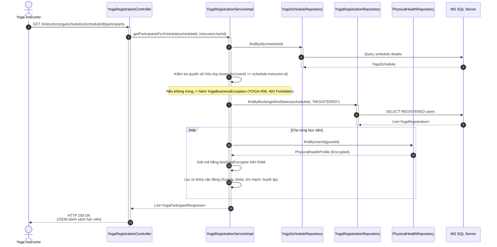

# ENGINEERING DOCUMENTATION STANDARD (EDS) v2.0
## Quy chuẩn Tài liệu Kỹ thuật và Đặc tả Hiện thực hóa: UC03 - Xem danh sách học viên & Ghi chú sức khỏe (Huấn luyện viên)

| Field | Value |
| :--- | :--- |
| **Document ID** | `HOS-YOGA-IMP-003` |
| **Version** | 1.0 |
| **Date** | 2026-06-26 |
| **Status** | Draft |
| **Document Owner** | Lê Đức Dương |
| **Author** | Lê Đức Dương - Backend Developer |
| **Reviewed by** | Tech Lead |
| **DPO Sign-off** | [ ] Pending *(bắt buộc — xử lý Physical Health Profile)* |
| **Approved by** | Principal Architect |
| **Based on EDS** | v2.0 |

---

## CHANGELOG

> [!IMPORTANT]
> **Policy 4.4 — Immutable History**: Không bao giờ xóa thông tin cũ. Mọi thay đổi phải ghi vào bảng này.

| Ngày | Người thực hiện | Nội dung thay đổi |
| :--- | :--- | :--- |
| 2026-06-26 | Lê Đức Dương | Tạo tài liệu lần đầu, đặc tả thiết kế chi tiết cho UC03 |

---

## MỤC LỤC
1. [Tổng quan Module](#1-tổng-quan-module)
2. [Ma trận Truy vết (Traceability Matrix)](#2-ma-trận-truy-vết-traceability-matrix)
3. [Architecture Decision Records (ADR)](#3-architecture-decision-records-adr)
4. [Non-Functional Requirements & SLA](#4-non-functional-requirements--sla)
5. [Static Modeling (Mô hình Tĩnh)](#5-static-modeling-mô-hình-tĩnh)
6. [Dynamic Modeling (Mô hình Động)](#6-dynamic-modeling-mô-hình-động)
7. [Domain Event Catalog](#7-domain-event-catalog)
8. [Interface Specification (Đặc tả Giao diện)](#8-interface-specification-đặc-tả-giao-diện)
9. [API Specification](#9-api-specification)
10. [Bảng mã lỗi (Error Codes)](#10-bảng-mã-lỗi-error-codes)
11. [Quy trình Triển khai (Step-by-Step)](#11-quy-trình-triển-khai-step-by-step)
12. [Rollback & Incident Runbook](#12-rollback--incident-runbook)
13. [Kịch bản Kiểm thử Chi tiết](#13-kịch-bản-kiểm-thử-chi-tiết)
14. [Phương pháp Xác minh](#14-phương-pháp-xác-minh)
15. [Mẫu thử thực tế (API Verification Samples)](#15-mẫu-thử-thực-tế-api-verification-samples)
16. [Bảng tổng hợp phân quyền (Authorization Matrix)](#16-bảng-tổng-hợp-phân-quyền-authorization-matrix)

---

## 1. Tổng quan Module

> [!NOTE]
> Huấn luyện viên Yoga (Instructor) cần chuẩn bị giáo án và lưu ý điều chỉnh tư thế (adjustment) phù hợp cho từng học viên. UC03 cho phép Huấn luyện viên xem danh sách các khách hàng đã đăng ký thành công lớp của mình, đồng thời đọc các ghi chú về bệnh lý/chấn thương của họ để bảo đảm an toàn tập luyện, tuân thủ chặt chẽ các chính sách bảo mật dữ liệu PII và Data Minimization theo Nghị định 356/2025.

| Field | Value |
| :--- | :--- |
| **Module Name** | `Yoga & Mindfulness Scheduling Engine` |
| **Bounded Context** | `yoga` |
| **Data Classification** | **Sensitive-PII** (Physical Health Profile — injuries, medical notes) |
| **Compliance Scope** | Decree 356/2025 — Personal Data Protection (VN GDPR equivalent) |
| **Upstream Dependencies** | `auth` (User/Instructor info), `spa` (PhysicalHealthProfile) |
| **Downstream Consumers** | Huấn luyện viên Yoga (Giao diện hiển thị trực tiếp) |

---

## 2. Ma trận Truy vết (Traceability Matrix)

| Requirement ID | Loại (BR/ADR/US) | Mô tả yêu cầu | Thành phần Code | Compliance Target | ADR liên quan |
| :--- | :--- | :--- | :--- | :--- | :--- |
| US-YOGA-03 | User Story | Huấn luyện viên xem danh sách học viên lớp học mình dạy. | `YogaRegistrationController.GET /instructor/yoga/schedules/{scheduleId}/participants` | Business Process | — |
| SEC-PII-02 | Security Rule | Tối thiểu hóa thông tin nhạy cảm (Data Minimization): Chỉ giải mã và hiển thị bệnh lý liên quan đến vận động. Cấm hiển thị dữ liệu thanh toán hay dị ứng thức ăn. | `YogaRegistrationServiceImpl.getParticipantsForSchedule()` | Decree 356/2025 | ADR-YOGA-003 |
| AUTH-YOGA-01 | Auth Rule | Chặn IDOR: Huấn luyện viên chỉ được truy cập danh sách của lớp học được gán cho chính mình. | `YogaRegistrationServiceImpl.getParticipantsForSchedule()` | Access Control | — |

---

## 3. Architecture Decision Records (ADR)

### ADR-YOGA-003 — Áp dụng nguyên tắc Data Minimization cho Dữ liệu Sức khỏe hiển thị cho Giáo viên

| Field | Value |
| :--- | :--- |
| **Status** | Proposed |
| **Deciders** | Lead Backend Engineer, Security Architect, DPO |
| **Date** | 2026-06-26 |

**Bối cảnh (Context)**
> Hồ sơ sức khỏe của khách hàng (`PHYSICAL_HEALTH_PROFILE`) chứa nhiều thông tin cực kỳ nhạy cảm bao gồm cả tiền sử bệnh lý chung, dị ứng thực phẩm, chấn thương xương khớp. Nếu hiển thị toàn bộ cho giáo viên Yoga, hệ thống sẽ vi phạm nguyên tắc Tối thiểu hóa dữ liệu (Data Minimization) của Nghị định 356/2025 vì giáo viên Yoga chỉ cần biết chấn thương liên quan vận động để điều chỉnh tư thế.

**Các phương án đã xem xét (Options Considered)**
1. **Phương án A: Hiển thị toàn bộ plaintext chấn thương và bệnh lý**:
   - *Ưu điểm:* Dễ triển khai, không cần bộ lọc.
   - *Nhược điểm:* Vi phạm nghiêm trọng Decree 356/2025 do chia sẻ thông tin PII không đúng mục đích.
2. **Phương án B: Chỉ hiển thị các bệnh lý/chấn thương liên quan vận động (Xương khớp, tim mạch, cột sống)**:
   - Sử dụng bộ lọc từ khóa trên RAM sau khi giải mã thông tin.
   - *Ưu điểm:* Đảm bảo tính tuân thủ pháp lý tối đa, chỉ cung cấp dữ liệu phục vụ vận động.
   - *Nhược điểm:* Tốn thêm tài nguyên xử lý văn bản trên RAM, nhưng chấp nhận được do danh sách học viên nhỏ (<= 15 người).

**Quyết định (Decision)**
> Chọn **Phương án B**. Hệ thống sẽ lọc và chỉ hiển thị các dòng chấn thương/bệnh lý chứa từ khóa vận động (ví dụ: khớp gối, cột sống, vai, tim mạch, huyết áp, lưng...). Các thông tin nhạy cảm khác không liên quan vận động sẽ không được hiển thị.

---

## 4. Non-Functional Requirements & SLA

### 4.1. Performance & Availability
| Category | Requirement | Target SLA | Measurement Method | Compliance Basis |
| :--- | :--- | :--- | :--- | :--- |
| Latency | Thời gian phản hồi API lấy danh sách | < 300ms | Load Test | Trải nghiệm người dùng |
| Security | Giải mã PII trong RAM | Thực hiện tại RAM, không ghi log plaintext | Code Review / Static scan | Decree 356/2025 |

---

## 5. Static Modeling (Mô hình Tĩnh)

### 5.1. DTO Structure (Java DTOs)

```java
package com.AuraMoon.auramoon.yoga.dto;

import lombok.Builder;
import lombok.Data;

@Data
@Builder
public class YogaParticipantResponse {
    private Integer registrationId;
    private Integer bookingId;
    private String guestName;
    private String villaName;
    private String injuriesNote;       // Đã giải mã & lọc (chỉ liên quan vận động)
    private String medicalConditionsNote; // Đã giải mã & lọc (chỉ liên quan vận động)
}
```

---

## 6. Dynamic Modeling (Mô hình Động)

### 6.1. Sequence Diagram — Luồng lấy danh sách học viên thành công (Happy Path)



---

## 7. Domain Event Catalog

| Event Name | Trigger | Publisher | Subscriber(s) | Async? |
| :--- | :--- | :--- | :--- | :--- |
| `YogaParticipantListAccessed` | Giáo viên truy cập xem thông tin danh sách học viên | `YogaRegistrationServiceImpl` | `AuditService` | Yes |

---

## 8. Interface Specification (Đặc tả Giao diện)

### 8.1. Service Interface

```java
// IYogaRegistrationService.java
package com.AuraMoon.auramoon.yoga.service;

import com.AuraMoon.auramoon.yoga.dto.YogaParticipantResponse;
import java.util.List;

public interface IYogaRegistrationService {
    // ... các hàm cũ
    
    /**
     * Lấy danh sách học viên đăng ký của lớp học chỉ định (dành cho Giáo viên).
     * @param scheduleId mã lịch học
     * @param instructorUserId userId của giáo viên đang đăng nhập
     * @throws YogaBusinessException khi không tìm thấy lịch (YOGA-001) hoặc truy cập chéo lớp người khác (YOGA-008)
     */
    List<YogaParticipantResponse> getParticipantsForSchedule(Integer scheduleId, Integer instructorUserId);
}
```

---

## 9. API Specification

### 9.1. Endpoints Table

| Method | Path | Auth Level | Required Roles | Rate Limit | Idempotent? |
| :--- | :--- | :--- | :--- | :--- | :--- |
| GET | `/instructor/yoga/schedules/{scheduleId}/participants` | JWT Bearer | `YOGA_INSTRUCTOR` | 60/min | Yes |

### 9.2. Request / Response Schemas

**Response — 200 OK (Happy Path)**:
```json
[
  {
    "registrationId": 101,
    "bookingId": 12,
    "guestName": "Nguyễn Văn Khách",
    "villaName": "GV01",
    "injuriesNote": "Đau khớp gối trái",
    "medicalConditionsNote": "Không"
  },
  {
    "registrationId": 105,
    "bookingId": 15,
    "guestName": "Trần Thị Khách",
    "villaName": "GV02",
    "injuriesNote": "Chấn thương cột sống lưng",
    "medicalConditionsNote": "Huyết áp thấp"
  }
]
```

**Response — 403 Forbidden (Chặn IDOR - YOGA-008)**:
```json
{
  "error": {
    "code": "YOGA-008",
    "message": "Bạn không có quyền truy cập danh sách học viên của lớp học này."
  }
}
```

---

## 10. Bảng mã lỗi (Error Codes)

| Code | HTTP Status | Message (VI) | Trigger Condition |
| :--- | :--- | :--- | :--- |
| `YOGA-008` | 403 | Bạn không có quyền truy cập danh sách học viên của lớp học này | Giáo viên cố ý xem lớp của giáo viên khác |

---

## 11. Quy trình Triển khai (Step-by-Step)
- Bổ sung vai trò `ROLE_YOGA_INSTRUCTOR` (hoặc cấu hình thủ công trong UserDetails check).
- Cập nhật tầng Service, Controller và xây dựng trang giao diện chi tiết lớp học dành cho giáo viên.

---

## 12. Rollback & Incident Runbook
- Nếu phát hiện rò rỉ dữ liệu PII ngoài vận động, lập tức thu hồi quyền truy cập API bằng cách rollback code.
```bash
git checkout -- src/main/java/com/AuraMoon/auramoon/yoga/
```

---

## 16. Bảng tổng hợp phân quyền (Authorization Matrix)

| Endpoint | GUEST | YOGA_INSTRUCTOR | MANAGER | ADMIN |
| :--- | :---: | :---: | :---: | :---: |
| GET `/instructor/yoga/schedules/{id}/participants` | ❌ | ✅ Own Class | ❌ | ✅ All |
