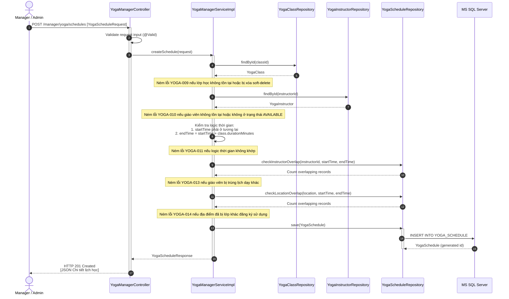

# ENGINEERING DOCUMENTATION STANDARD (EDS) v2.0
## Quy chuẩn Tài liệu Kỹ thuật và Đặc tả Hiện thực hóa: UC04 - Quản lý danh mục lớp và lịch học (Quản lý)

| Field | Value |
| :--- | :--- |
| **Document ID** | `HOS-YOGA-IMP-004` |
| **Version** | 1.0 |
| **Date** | 2026-06-26 |
| **Status** | Draft |
| **Document Owner** | Lê Đức Dương |
| **Author** | Lê Đức Dương - Backend Developer |
| **Reviewed by** | Tech Lead |
| **DPO Sign-off** | N/A *(UC04 không xử lý trực tiếp thông tin sức khỏe nhạy cảm)* |
| **Approved by** | Principal Architect |
| **Based on EDS** | v2.0 |

---

## CHANGELOG

> [!IMPORTANT]
> **Policy 4.4 — Immutable History**: Không bao giờ xóa thông tin cũ. Mọi thay đổi phải ghi vào bảng này.

| Ngày | Người thực hiện | Nội dung thay đổi |
| :--- | :--- | :--- |
| 2026-06-26 | SE2023-G6 / AI | Tạo tài liệu lần đầu, đặc tả thiết kế chi tiết cho UC04 |

---

## MỤC LỤC
1. [Tổng quan Module](#1-tổng-quan-module)
2. [Ma trận Truy vết (Traceability Matrix)](#2-ma-trận-truy-vết-traceability-matrix)
3. [Architecture Decision Records (ADR)](#3-architecture-decision-records-adr)
4. [Non-Functional Requirements & SLA](#4-non-functional-requirements--sla)
5. [Static Modeling (Mô hình Tĩnh)](#5-static-modeling-mô-hình-tĩnh)
6. [Dynamic Modeling (Mô hình Động)](#6-dynamic-modeling-mô-hình-hướng-động)
7. [Domain Event Catalog](#7-domain-event-catalog)
8. [Interface Specification (Đặc tả Giao diện)](#8-interface-specification-đặc-tả-giao-diện)
9. [API Specification](#9-api-specification)
10. [Bảng mã lỗi (Error Codes)](#10-bảng-mã-lỗi-error-codes)
11. [Quy trình Triển khai (Step-by-Step)](#11-quy-trình-triển-khai-step-by-step)
12. [Rollback & Incident Runbook](#12-rollback--incident-runbook)
13. [Kịch bản Kiểm thử Chi tiết](#13-kịch-bản-kiểm-thử-chi-tiết)
14. [Phương pháp Xác minh](#14-phương-pháp-xác-minh)
15. [Mẫu thử thực tế (API Verification Samples)](#15-mẫu-thử-thực-tế-api-verification-samples)
16. [Bảng tổng hợp phân quyền (Authorization Matrix)](#16-bảng-tổng-hợp-phân-quyền-authorization-matrix)

---

## 1. Tổng quan Module

> [!NOTE]
> Để vận hành hoạt động Yoga của resort, Quản lý (Manager) cần thiết lập danh mục các lớp học Yoga (ví dụ: Hatha Yoga, Vinyasa Flow) và lên lịch học Yoga hàng tuần (Yoga Schedule). Lịch học này sẽ gán lớp học, thời gian, địa điểm, giáo viên đảm nhận và giới hạn sĩ số tối đa của lớp. 
> UC04 cung cấp các API CRUD cho cả lớp học (YogaClass) và lịch học (YogaSchedule), đồng thời thực hiện các ràng buộc kiểm tra trùng lịch giáo viên và phòng học.

| Field | Value |
| :--- | :--- |
| **Module Name** | `Yoga & Mindfulness Scheduling Engine` |
| **Bounded Context** | `yoga` |
| **Data Classification** | **Internal** (Thông tin vận hành nội bộ của resort) |
| **Compliance Scope** | N/A |
| **Upstream Dependencies** | `auth` (Xác thực quyền MANAGER/ADMIN), `yoga` (YOGA_INSTRUCTOR) |
| **Downstream Consumers** | `GUEST` (Xem và đăng ký học), `YOGA_INSTRUCTOR` (Xem lịch dạy) |

---

## 2. Ma trận Truy vết (Traceability Matrix)

| Requirement ID | Loại (BR/ADR/US) | Mô tả yêu cầu | Thành phần Code | Compliance Target | ADR liên quan |
| :--- | :--- | :--- | :--- | :--- | :--- |
| US-YOGA-04 | User Story | Manager thực hiện CRUD danh mục lớp học & xếp lịch học. | `YogaManagerController` | Business Process | — |
| BR-YOGA-05 | Business Rule | Không cho phép xóa/hủy lịch học nếu đã có học viên đăng ký hoạt động (`count_registered > 0`). | `YogaManagerServiceImpl.deleteSchedule()` | Business Consistency | — |
| BR-YOGA-06 | Business Rule | Chặn trùng lịch giáo viên: Một giáo viên không thể đứng lớp ở 2 lịch học chồng chéo thời gian. | `YogaManagerServiceImpl.createSchedule()` | Resource Constraint | — |
| BR-YOGA-07 | Business Rule | Chặn trùng phòng học: Một địa điểm không thể diễn ra 2 lớp học chồng chéo thời gian. | `YogaManagerServiceImpl.createSchedule()` | Resource Constraint | — |
| BR-YOGA-08 | Business Rule | Thời gian kết thúc lịch học phải bằng thời gian bắt đầu cộng thêm thời lượng của lớp học (`duration_minutes`). | `YogaManagerServiceImpl.createSchedule()` | Data Integrity | — |
| AUTH-YOGA-02 | Auth Rule | Chỉ tài khoản có Role `MANAGER` hoặc `ADMIN` mới được gọi các API quản lý này. | `YogaManagerController` | Access Control | — |

---

## 3. Architecture Decision Records (ADR)

### ADR-YOGA-004 — Phương pháp ngăn chặn xung đột trùng lịch (Double-Booking) cho Giáo viên và Địa điểm

| Field | Value |
| :--- | :--- |
| **Status** | Accepted |
| **Deciders** | Lead Backend Engineer, Principal Architect |
| **Date** | 2026-06-26 |

**Bối cảnh (Context)**
> Khi Manager lập lịch học Yoga (`YogaSchedule`), hệ thống cần đảm bảo không xảy ra xung đột:
> 1. Một giáo viên đứng lớp 2 nơi cùng lúc.
> 2. Một địa điểm phòng học tổ chức 2 lớp học song song.
> Cần có giải pháp kiểm tra tối ưu để tránh race condition khi nhiều Manager cùng xếp lịch đồng thời.

**Các phương án đã xem xét (Options Considered)**
1. **Phương án A: Kiểm tra tại tầng Application bằng cách truy vấn và so sánh trong RAM**:
   - *Ưu điểm:* Dễ viết code Java.
   - *Nhược điểm:* Dễ bị lỗi Race Condition nếu có 2 luồng cùng xếp lịch đồng thời cho một giáo viên.
2. **Phương án B: Sử dụng khóa bi quan (Pessimistic Lock) hoặc truy vấn kiểm tra trực tiếp trong DB kết hợp transaction isolation**:
   - Truy vấn DB bằng câu lệnh kiểm tra giao thoa khoảng thời gian: `start_time < :newEndTime AND end_time > :newStartTime` với điều kiện `is_delete = 0`.
   - *Ưu điểm:* Tuyệt đối an toàn về dữ liệu, tránh được race condition.
   - *Nhược điểm:* Tăng tải truy vấn DB một chút nhưng không đáng kể vì thao tác xếp lịch của Manager không diễn ra với tần suất cao.

**Quyết định (Decision)**
> Chọn **Phương án B**. Triển khai các phương thức truy vấn chuyên biệt trong `YogaScheduleRepository` để tìm lịch chồng lấp của giáo viên hoặc địa điểm trước khi lưu bản ghi lịch học mới.

---

## 4. Non-Functional Requirements & SLA

### 4.1. Performance & Availability
| Category | Requirement | Target SLA | Measurement Method | Compliance Basis |
| :--- | :--- | :--- | :--- | :--- |
| Latency | Thời gian phản hồi các API tạo/sửa | < 400ms (p99) | Load Test | Trải nghiệm vận hành |
| Latency | Thời gian phản hồi API lấy danh mục | < 200ms (p99) | Load Test | Trải nghiệm vận hành |

---

## 5. Static Modeling (Mô hình Tĩnh)

### 5.1. DTO Structure (Java DTOs)

```java
package com.AuraMoon.auramoon.yoga.dto;

import jakarta.validation.constraints.*;
import lombok.Builder;
import lombok.Data;
import java.time.LocalDateTime;

public class YogaManagerDto {

    @Data
    @Builder
    public static class YogaClassRequest {
        @NotBlank(message = "Tên lớp học không được để trống")
        @Size(max = 100, message = "Tên lớp học không vượt quá 100 ký tự")
        private String className;

        private String description;

        @NotNull(message = "Thời lượng lớp học không được để trống")
        @Min(value = 15, message = "Thời lượng lớp học tối thiểu phải là 15 phút")
        private Integer durationMinutes;

        @Size(max = 255, message = "Đường dẫn ảnh không vượt quá 255 ký tự")
        private String imageUrl;
    }

    @Data
    @Builder
    public static class YogaClassResponse {
        private Integer classId;
        private String className;
        private String description;
        private Integer durationMinutes;
        private String imageUrl;
    }

    @Data
    @Builder
    public static class YogaScheduleRequest {
        @NotNull(message = "Lớp học không được để trống")
        private Integer classId;

        @NotNull(message = "Huấn luyện viên không được để trống")
        private Integer instructorId;

        @NotBlank(message = "Địa điểm không được để trống")
        @Size(max = 100, message = "Địa điểm không vượt quá 100 ký tự")
        private String location;

        @NotNull(message = "Thời gian bắt đầu không được để trống")
        private LocalDateTime startTime;

        @NotNull(message = "Thời gian kết thúc không được để trống")
        private LocalDateTime endTime;

        @NotNull(message = "Sĩ số tối đa không được để trống")
        @Min(value = 1, message = "Sĩ số tối đa phải ít nhất là 1 học viên")
        private Integer maxCapacity;
    }

    @Data
    @Builder
    public static class YogaScheduleResponse {
        private Integer scheduleId;
        private Integer classId;
        private String className;
        private Integer durationMinutes;
        private Integer instructorId;
        private String instructorName;
        private String location;
        private LocalDateTime startTime;
        private LocalDateTime endTime;
        private Integer maxCapacity;
        private Integer countRegistered;
    }
}
```

---

## 6. Dynamic Modeling (Mô hình Hướng Động)

### 6.1. Sequence Diagram — Luồng tạo Lịch học mới thành công (Happy Path)



---

## 7. Domain Event Catalog

| Event Name | Trigger | Publisher | Subscriber(s) | Async? |
| :--- | :--- | :--- | :--- | :--- |
| `YogaClassCreated` | Lớp học mới được định nghĩa thành công | `YogaManagerServiceImpl` | `AuditService` | Yes |
| `YogaScheduleCreated` | Lịch học mới được xếp thành công | `YogaManagerServiceImpl` | `AuditService`, `NotificationService` | Yes |
| `YogaScheduleCancelled` | Lịch học bị hủy bỏ bởi Manager | `YogaManagerServiceImpl` | `NotificationService` (báo cho học viên đăng ký) | Yes |

---

## 8. Interface Specification (Đặc tả Giao diện)

### 8.1. Service Interface

```java
package com.AuraMoon.auramoon.yoga.service;

import com.AuraMoon.auramoon.yoga.dto.YogaManagerDto.*;
import java.time.LocalDate;
import java.util.List;

public interface IYogaManagerService {
    
    // --- LỚP HỌC (YOGA_CLASS) ---
    YogaClassResponse createClass(YogaClassRequest request);
    YogaClassResponse updateClass(Integer classId, YogaClassRequest request);
    void deleteClass(Integer classId);
    List<YogaClassResponse> getAllActiveClasses();
    
    // --- LỊCH HỌC (YOGA_SCHEDULE) ---
    YogaScheduleResponse createSchedule(YogaScheduleRequest request);
    YogaScheduleResponse updateSchedule(Integer scheduleId, YogaScheduleRequest request);
    void deleteSchedule(Integer scheduleId);
    List<YogaScheduleResponse> getSchedulesByDate(LocalDate date);
}
```

---

## 9. API Specification

### 9.1. Endpoints Table

| Method | Path | Auth Level | Required Roles | Rate Limit | Idempotent? |
| :--- | :--- | :--- | :--- | :--- | :--- |
| POST | `/manager/yoga/classes` | JWT Bearer | `MANAGER`, `ADMIN` | 60/min | No |
| PUT | `/manager/yoga/classes/{id}` | JWT Bearer | `MANAGER`, `ADMIN` | 60/min | Yes |
| DELETE | `/manager/yoga/classes/{id}` | JWT Bearer | `MANAGER`, `ADMIN` | 60/min | Yes |
| GET | `/manager/yoga/classes` | JWT Bearer | `MANAGER`, `ADMIN` | 120/min | Yes |
| POST | `/manager/yoga/schedules` | JWT Bearer | `MANAGER`, `ADMIN` | 60/min | No |
| PUT | `/manager/yoga/schedules/{id}` | JWT Bearer | `MANAGER`, `ADMIN` | 60/min | Yes |
| DELETE | `/manager/yoga/schedules/{id}` | JWT Bearer | `MANAGER`, `ADMIN` | 60/min | Yes |
| GET | `/manager/yoga/schedules` | JWT Bearer | `MANAGER`, `ADMIN`, `RECEPTIONIST` | 120/min | Yes |

---

## 10. Bảng mã lỗi (Error Codes)

| Code | HTTP Status | Message (VI) | Trigger Condition |
| :--- | :--- | :--- | :--- |
| `YOGA-009` | 404 | Lớp học không tồn tại hoặc đã bị xóa | `classId` truyền vào không tìm thấy trong DB |
| `YOGA-010` | 400 | Huấn luyện viên không tồn tại hoặc không ở trạng thái sẵn sàng | `instructorId` không tồn tại hoặc status != 'AVAILABLE' |
| `YOGA-011` | 400 | Logic thời gian học không hợp lệ | Thời gian bắt đầu trong quá khứ hoặc `endTime` không bằng `startTime` + `duration_minutes` |
| `YOGA-012` | 409 | Không thể xóa lịch học đã có học viên đăng ký | Xóa lịch học có `count_registered > 0` |
| `YOGA-013` | 409 | Giáo viên đã bị trùng lịch dạy vào khung giờ này | Giáo viên đã được xếp đứng lớp lớp khác có thời gian chồng chéo |
| `YOGA-014` | 409 | Địa điểm đã bị trùng lịch sử dụng vào khung giờ này | Địa điểm (phòng học) đã gán cho lớp khác vào khung giờ chồng chéo |

---

## 11. Quy trình Triển khai (Step-by-Step)
- Tạo mới controller `YogaManagerController.java`.
- Tạo mới service `IYogaManagerService` và file hiện thực `YogaManagerServiceImpl.java`.
- Bổ sung các phương thức truy vấn kiểm tra chồng chéo lịch trong `YogaScheduleRepository.java`.

---

## 12. Rollback & Incident Runbook
- Nếu API xảy ra lỗi logic hàng loạt làm sai lịch học của resort, revert code về phiên bản ổn định trước đó:
```bash
git checkout -- src/main/java/com/AuraMoon/auramoon/yoga/
```

---

## 16. Bảng tổng hợp phân quyền (Authorization Matrix)

| Endpoint | GUEST | YOGA_INSTRUCTOR | MANAGER | ADMIN |
| :--- | :---: | :---: | :---: | :---: |
| GET `/manager/yoga/classes` | ❌ | ❌ | ✅ | ✅ |
| POST `/manager/yoga/classes` | ❌ | ❌ | ✅ | ✅ |
| PUT `/manager/yoga/classes/{id}` | ❌ | ❌ | ✅ | ✅ |
| DELETE `/manager/yoga/classes/{id}` | ❌ | ❌ | ✅ | ✅ |
| GET `/manager/yoga/schedules` | ❌ | ❌ | ✅ | ✅ |
| POST `/manager/yoga/schedules` | ❌ | ❌ | ✅ | ✅ |
| PUT `/manager/yoga/schedules/{id}` | ❌ | ❌ | ✅ | ✅ |
| DELETE `/manager/yoga/schedules/{id}` | ❌ | ❌ | ✅ | ✅ |
