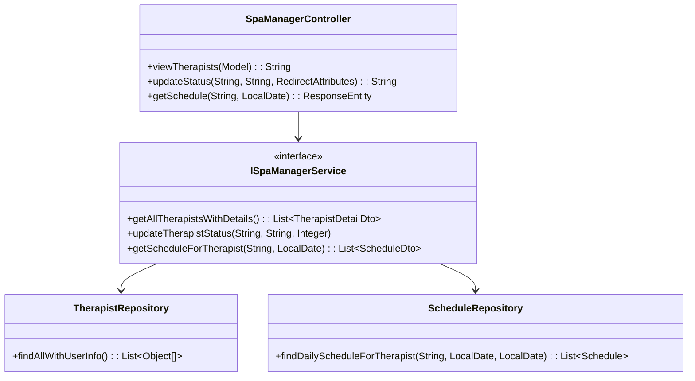
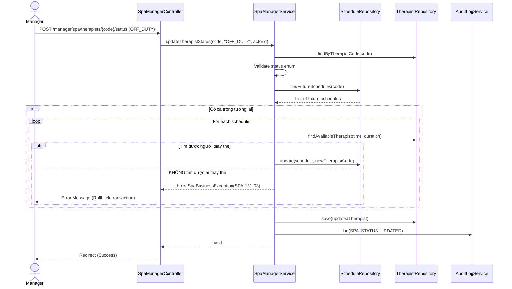

# ENGINEERING DOCUMENTATION STANDARD (EDS) v2.0
## Quy chuẩn Tài liệu Kỹ thuật và Đặc tả Hiện thực hóa

| Field | Value |
| :--- | :--- |
| **Document ID** | `SWP391-MODULE3-IMP-131` |
| **Version** | 1.0 |
| **Date** | 2026-06-21 |
| **Status** | Approved |
| **Document Owner** | Nhóm phát triển SE2023-G6 |
| **Author** | Lê Đức Dương |
| **Reviewed by** | Tech Lead |
| **DPO Sign-off** | [x] Approved — 2026-06-21 — Lê Đức Dương |
| **Approved by** | Lê Đức Dương |
| **Last Review** | 2026-06-21 |
| **Based on EDS** | v2.0 |

---

## CHANGELOG

> [!IMPORTANT]
> **Policy 4.4 — Immutable History**: Không bao giờ xóa thông tin cũ. Mọi thay đổi phải ghi vào bảng này.

| Ngày | Người thực hiện | Nội dung thay đổi |
| :--- | :--- | :--- |
| 2026-06-21 | Lê Đức Dương | Tạo tài liệu lần đầu cho UC13.1 (Manager Spa Staff Management) |
| 2026-06-21 | Lê Đức Dương | Phê duyệt tài liệu EDS để triển khai |

---

## MỤC LỤC
1. [Tổng quan Module](#1-tổng-quan-module)
2. [Ma trận Truy vết (Traceability Matrix)](#2-ma-trận-truy-vết-traceability-matrix)
3. [Architecture Decision Records (ADR)](#3-architecture-decision-records-adr)
4. [Non-Functional Requirements & SLA](#4-non-functional-requirements--sla)
5. [Static Modeling (Mô hình Tĩnh)](#5-static-modeling-mô-hình-tĩnh)
6. [Dynamic Modeling (Mô hình Hướng Động)](#6-dynamic-modeling-mô-hình-hướng-động)
7. [Domain Event Catalog](#7-domain-event-catalog)
8. [Interface Specification (Đặc tả Giao diện)](#8-interface-specification-đặc-tả-giao-diện)
9. [API Specification](#9-api-specification)
10. [Bảng mã lỗi (Error Codes)](#10-bảng-mã-lỗi-error-codes)
11. [Quy trình Triển khai (Step-by-Step)](#11-quy-trình-triển-khai-step-by-step)
12. [Rollback & Incident Runbook](#12-rollback--incident-runbook)
13. [Kịch bản Kiểm thử Chi tiết](#13-kịch-bản-kiểm-thử-chi-tiết)
14. [Phương pháp Xác minh](#14-phương-pháp-xác-minh)
15. [Mẫu thử thực tế (API Verification Samples)](#15-mẫu-thử-thực-tế-api-verification-samples)
16. [Bảng tổng hợp phân quyền (Authorization Matrix)](#16-bảng-tổng-hợp-phân-quyền-authorization-matrix)

---

## 1. Tổng quan Module

> [!NOTE]
> Mô tả ngắn gọn mục đích của module, phạm vi nghiệp vụ và lý do tồn tại.

| Field | Value |
| :--- | :--- |
| **Module Name** | Spa & Therapy Scheduling Engine (Mở rộng UC13.1) |
| **Bounded Context** | `spa` |
| **Data Classification** | Internal / PII (Tên nhân viên, Mã nhân viên) |
| **Compliance Scope** | N/A |
| **Upstream Dependencies** | `auth` (RBAC) |
| **Downstream Consumers** | `spa` (Therapist Schedule) |

Mục đích: Cho phép Manager quản lý danh sách Spa Therapist, thay đổi trạng thái làm việc (AVAILABLE, BUSY, OFF_DUTY) và xem lịch trình làm việc chi tiết của từng nhân viên để điều phối tài nguyên hiệu quả.

---

## 2. Ma trận Truy vết (Traceability Matrix)

| Requirement ID | Loại (BR/ADR/US) | Mô tả yêu cầu | Thành phần Code | Compliance Target | ADR liên quan |
| :--- | :--- | :--- | :--- | :--- | :--- |
| UC13.1-001 | User Story | Manager xem danh sách Therapist | `SpaManagerController.java`, `SpaManagerService.getAllTherapistsWithDetails()` | — | — |
| UC13.1-002 | User Story | Manager cập nhật trạng thái Therapist | `SpaManagerController.java`, `SpaManagerService.updateTherapistStatus()` | — | ADR-131-01 |
| UC13.1-003 | User Story | Manager xem lịch làm việc của Therapist | `SpaManagerController.java`, `SpaManagerService.getScheduleForTherapist()` | — | ADR-131-02 |
| BR-15 | Business Rule | Audit Trail Management | `AuditLogService` integration | — | — |

---

## 3. Architecture Decision Records (ADR)

### `ADR-131-01` — Cho phép thay đổi trạng thái Therapist mà không ảnh hưởng tới lịch đã đặt

| Field | Value |
| :--- | :--- |
| **Status** | Accepted |
| **Deciders** | Antigravity AI |
| **Date** | 2026-06-21 |
| **Supersedes** | N/A |

#### Bối cảnh (Context)
Khi Manager chuyển trạng thái của một Therapist từ `AVAILABLE` sang `OFF_DUTY` (Nghỉ/Hết ca) hoặc `BUSY`, câu hỏi đặt ra là các lịch (`SCHEDULE`) đã được phân công trong tương lai cho Therapist này sẽ được xử lý như thế nào.

#### Các phương án đã xem xét (Options Considered)
| Phương án | Mô tả | Ưu điểm | Nhược điểm |
| :--- | :--- | :--- | :--- |
| A | Tự động chuyển ca (Auto-Reassignment) | Đảm bảo khách hàng không bị bỏ lỡ lịch, UX tốt nhất | Logic phức tạp, cần dùng lại thuật toán của UC12 |
| B | Chặn cứng (Validation Block) | An toàn tuyệt đối, không có ca bị bỏ rơi | Trải nghiệm quản lý cứng nhắc |
| C | Chỉ cảnh báo (Soft Warning) | Dễ triển khai | Rủi ro quên sót cao, lỗi dịch vụ |

#### Quyết định (Decision)
Chọn Phương án `[A] (Tự động chuyển ca)`.
Khi Manager chuyển một Therapist sang trạng thái `OFF_DUTY` (Nghỉ/Hết ca), hệ thống sẽ:
1. Tìm tất cả các lịch (`SCHEDULE`) trong tương lai (từ thời điểm hiện tại trở đi) có trạng thái `Scheduled` của nhân viên này.
2. Với mỗi lịch, hệ thống tự động chạy thuật toán tìm kiếm Therapist khác đang rảnh (dùng chung logic UC12).
3. Nếu tìm được, hệ thống tự động đổi `therapist_code` sang người mới.
4. **Nếu có BẤT KỲ lịch nào KHÔNG tìm được người thay thế**, toàn bộ Transaction bị Rollback. Hệ thống báo lỗi cho Manager biết để tự xử lý bằng tay (ví dụ: gọi cho khách đổi giờ).

#### Hệ quả (Consequences)
**Tích cực**:
- Tự động hóa cao, giảm tải cho Manager.
- Đảm bảo 100% không có khách đến mà không có nhân viên.

**Tiêu cực / Trade-offs**:
- Logic Transaction phức tạp hơn do phải lock nhiều tài nguyên.

---

### `ADR-131-02` — Tích hợp xem lịch trên cùng một màn hình (Single Page UX)

| Field | Value |
| :--- | :--- |
| **Status** | Accepted |
| **Deciders** | Antigravity AI |
| **Date** | 2026-06-21 |

#### Bối cảnh (Context)
Cần hiển thị thông tin chi tiết lịch làm việc khi Manager click vào một Therapist.

#### Quyết định (Decision)
Sử dụng mô hình Single Page (tích hợp bằng AJAX/Fragments hoặc ẩn hiện Panel) thay vì chuyển sang một URL hoàn toàn mới để tối ưu UX.

---

## 4. Non-Functional Requirements & SLA

### 4.1. Performance & Availability
| Category | Requirement | Target SLA | Measurement Method | Compliance Basis |
| :--- | :--- | :--- | :--- | :--- |
| Latency | Xem danh sách Therapist (p99) | < 500ms | APM | — |
| Latency | Lấy lịch làm việc của 1 Therapist | < 500ms | APM | — |

### 4.3. Security
| Category | Requirement | Target | Verification Method | Compliance Basis |
| :--- | :--- | :--- | :--- | :--- |
| Access control | Role-based | Role `MANAGER`, `ADMIN` | Auth Matrix | — |
| Audit Logging | Mọi thao tác đổi trạng thái | 100% logs | Database query | BR-15 |

---

## 5. Static Modeling (Mô hình Tĩnh)

### 5.1. Class Diagram (PlantUML)



---

## 6. Dynamic Modeling (Mô hình Hướng Động)

### 6.1. Sequence Diagram — Thay đổi trạng thái



---

## 8. Interface Specification (Đặc tả Giao diện)

### 8.1. Service Interface

```java
public interface SpaManagerService {
    /**
     * Lấy danh sách toàn bộ Therapist kèm thông tin chi tiết (tên, trạng thái, số ca hôm nay)
     */
    List<TherapistDetailDto> getAllTherapistsWithDetails();

    /**
     * Cập nhật trạng thái của Therapist
     * @param therapistCode Mã therapist
     * @param newStatus Trạng thái mới (AVAILABLE, BUSY, OFF_DUTY)
     * @param actorId ID của manager thực hiện thay đổi để log
     * @throws SpaBusinessException Nếu mã không tồn tại hoặc trạng thái không hợp lệ
     */
    void updateTherapistStatus(String therapistCode, String newStatus, Integer actorId);

    /**
     * Lấy lịch làm việc của một Therapist trong một ngày cụ thể
     */
    List<ScheduleDto> getScheduleForTherapist(String therapistCode, LocalDate date);
}
```

---

## 9. API Specification

### 9.1. Endpoints Table

| Method | Path | Auth Level | Required Roles | Rate Limit | Idempotent? |
| :--- | :--- | :--- | :--- | :--- | :--- |
| GET | `/manager/spa/therapists` | Session | `MANAGER`, `ADMIN` | — | Yes |
| POST | `/manager/spa/therapists/status` | Session | `MANAGER`, `ADMIN` | — | No |
| GET | `/manager/spa/therapists/{code}/schedule` | Session | `MANAGER`, `ADMIN` | — | Yes |

---

## 10. Bảng mã lỗi (Error Codes)

| Code | HTTP Status | Message (EN) | Message (VI) | Trigger Condition |
| :--- | :--- | :--- | :--- | :--- |
| `SPA-131-01` | 400 | Invalid Status | Trạng thái không hợp lệ | Status không thuộc AVAILABLE, BUSY, OFF_DUTY |
| `SPA-131-02` | 404 | Therapist Not Found | Không tìm thấy nhân viên | Truyền mã therapist_code không tồn tại |
| `SPA-131-03` | 409 | Reassignment Failed | Không thể chuyển ca tự động | Khi đổi sang OFF_DUTY nhưng có ca tương lai không tìm được người thay thế |

---

## 16. Bảng tổng hợp phân quyền (Authorization Matrix)

| Endpoint | GUEST | RECEPTIONIST | THERAPIST | MANAGER | ADMIN |
| :--- | :---: | :---: | :---: | :---: | :---: |
| GET `/manager/spa/therapists` | ❌ | ❌ | ❌ | ✅ | ✅ |
| POST `/manager/spa/therapists/status`| ❌ | ❌ | ❌ | ✅ | ✅ |
| GET `/manager/spa/therapists/*/schedule` | ❌ | ❌ | ❌ | ✅ | ✅ |

---
*EDS v2.0 cho UC13.1 — Spa Staff Management*
