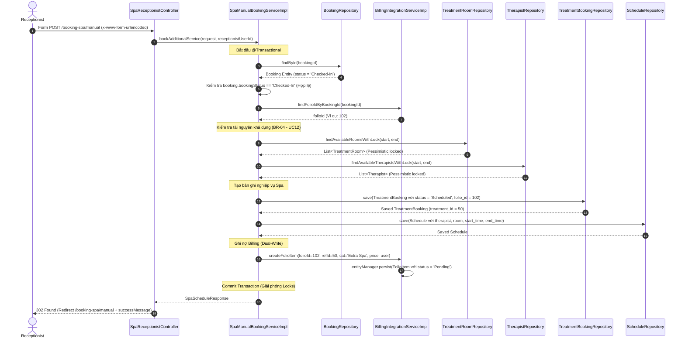
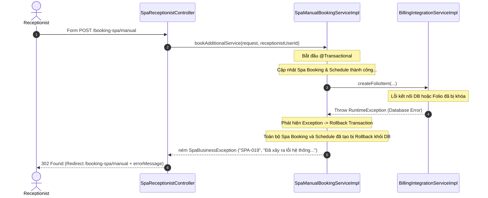

# ENGINEERING DOCUMENTATION STANDARD (EDS) v2.0

## Module 3: Spa & Therapy Scheduling Engine — UC15: Book Additional Spa Service

| Field          | Value                           |
| -------------- | ------------------------------- |
| Document ID    | `HOS-SPA-IMP-015`             |
| Version        | 1.0                             |
| Date           | 2026-06-14                      |
| Status         | Approved                        |
| Document Owner | DuongLD                         |
| Author         | DuongLD - Senior Java Developer |
| Reviewed by    | Tech Lead                       |
| DPO Sign-off   | [ ] Pending                     |
| Approved by    | Principal Architect             |
| Last Review    | 2026-06-14                      |
| Based on EDS   | v2.0                            |

---

## CHANGELOG

| Ngày      | Người thực hiện | Nội dung thay đổi                           |
| ---------- | ------------------- | ---------------------------------------------- |
| 2026-06-14 | DuongLD             | Tạo tài liệu thiết kế lần đầu cho UC15 |

---

## MỤC LỤC

1. Tổng quan Module
2. Ma trận Truy vết (Traceability Matrix)
3. Architecture Decision Records (ADR)
4. Non-Functional Requirements & SLA
5. Static Modeling (Mô hình Tĩnh)
6. Dynamic Modeling (Mô hình Động)
7. Domain Event Catalog
8. Interface Specification
9. API Specification
10. Bảng mã lỗi (Error Codes)
11. Quy trình Triển khai (Step-by-Step)
12. Rollback & Incident Runbook
13. Kịch bản Kiểm thử Chi tiết
14. Phương pháp Xác minh
15. Mẫu thử thực tế (API Verification Samples)
16. Bảng tổng hợp phân quyền (Authorization Matrix)

---

## 1. Tổng quan Module

| Field                 | Value                                                                         |
| --------------------- | ----------------------------------------------------------------------------- |
| Module Name           | Spa & Therapy Scheduling Engine                                               |
| Bounded Context       | `spa`                                                                       |
| UI Architecture       | Spring MVC + Thymeleaf (AJAX Fetch for API communication)                     |
| Data Classification   | Sensitive-PII (Physical Health Notes + Booking/Billing link)                  |
| Compliance Scope      | Decree 356/2025 (Personal Data Protection)                                    |
| Upstream Dependencies | `auth` (Session / User authentication), `booking` (Booking entity/status) |
| Downstream Consumers  | `billing` (Folio Item creation)                                             |

---

## 2. Ma trận Truy vết (Traceability Matrix)

| Requirement ID       | Loại         | Mô tả yêu cầu                                                                                 | Thành phần Code                                                                                                   | Compliance Target                      | ADR liên quan |
| -------------------- | ------------- | ------------------------------------------------------------------------------------------------- | ------------------------------------------------------------------------------------------------------------------- | -------------------------------------- | -------------- |
| **BR-04**      | Business Rule | Phải có đồng thời Therapist + Room trống tại thời điểm đặt (Pessimistic Lock)         | `TherapistRepository.findAvailableTherapistsWithLock()`, `TreatmentRoomRepository.findAvailableRoomsWithLock()` | Tránh double-booking                  | ADR-015-02     |
| **BR-11**      | Business Rule | Đặt dịch vụ ngoài gói phải ghi nợ vào Guest Folio (`FOLIO_ITEM`) dạng `Pending`     | `BillingIntegrationService.createFolioItem()`                                                                     | Consolidated Billing                   | ADR-015-01     |
| **BR-11-CBP**  | Policy        | Luật Vùng Cấm Bay: Tuyệt đối không chạm vào thư mục/repository của module `billing` | `com.AuraMoon.auramoon.spa.service.BillingIntegrationService`                                                     | Clean Architecture & Context Isolation | ADR-015-01     |
| **BR-VAL-01**  | Business Rule | Chỉ cho phép đặt thêm Spa cho Guest có `booking_status = 'Checked-In'`                    | `SpaManualBookingServiceImpl.bookAdditionalService()`                                                             | Booking Validation                     | —             |
| **US-SPA-015** | User Story    | Lễ tân đặt thêm dịch vụ Spa cho khách đang lưu trú                                     | `SpaReceptionistController.createManualBooking()`                                                                 | UX/UI Requirement                      | —             |

---

## 3. Architecture Decision Records (ADR)

### ADR-015-01 — Sử dụng Bridge Interface `BillingIntegrationService` để Cô lập Ranh giới Bounded Context

| Field    | Value               |
| -------- | ------------------- |
| Status   | Accepted            |
| Deciders | DuongLD + Tech Lead |
| Date     | 2026-06-14          |

**Bối cảnh (Context)**
Business Rule **BR-11** bắt buộc phải thực hiện giao dịch ghi kép (Dual-write transaction): Tạo Spa Appointment + Ghi nợ Folio Item. Tuy nhiên, kiến trúc hệ thống áp dụng "Luật Vùng Cấm Bay", cấm nhà phát triển Spa thay đổi bất cứ code, repository hay service nào thuộc folder `com/AuraMoon/auramoon/billing` nhằm giữ tính độc lập giữa các module.

**Các phương án đã xem xét (Options Considered)**

| Phương án                                                   | Mô tả                                                                                                                                                                                                                                                                                  | Ưu điểm                                                                                                                                 | Nhược điểm                                                                                                                                                           |
| -------------------------------------------------------------- | ---------------------------------------------------------------------------------------------------------------------------------------------------------------------------------------------------------------------------------------------------------------------------------------- | ------------------------------------------------------------------------------------------------------------------------------------------ | ------------------------------------------------------------------------------------------------------------------------------------------------------------------------ |
| **A. Gọi trực tiếp Billing Repositories**             | Import và sử dụng `FolioItemRepository` của Billing trực tiếp trong service của Spa.                                                                                                                                                                                            | - Đơn giản, code nhanh.                                                                                                                 | - Vi phạm nghiêm trọng "Luật Vùng Cấm Bay".`<br>`- Tạo sự phụ thuộc chặt chẽ (tight coupling) giữa hai module.                                            |
| **B. Event-Driven (Asynchronous)**                       | Phát đi event `SpaServiceBookedEvent`, module Billing lắng nghe để tạo Folio Item.                                                                                                                                                                                               | - Loose coupling hoàn hảo.`<br>`- Không chạm vào code Billing.                                                                      | - Không đảm bảo tính nhất quán giao dịch (Atomic Transaction). Nếu Billing không ghi được nợ, Spa session vẫn được đặt, gây thất thoát doanh thu. |
| **C. Thiết kế Interface cầu nối (Bridge Interface)** | Khai báo `BillingIntegrationService` trong package `spa`. Việc implement sẽ được thực hiện trong package `spa.service.impl` thông qua JPA `EntityManager` trực tiếp tương tác với các Entity của Billing, không dùng các Repositories/Services của Billing. | - Đảm bảo tính nhất quán (ACID Transaction) chạy chung một DB Transaction.`<br>`- Không chạm/sửa đổi thư mục `billing`. | - Spa vẫn phải import 2 Class Entity của Billing (`GuestFolio`, `FolioItem`), nhưng đây là chấp nhận được trong kiến trúc Modular Monolith.            |

**Quyết định (Decision)**
Chọn **Phương án C** để vừa đảm bảo tính nhất quán dữ liệu vừa tuân thủ ranh giới cấu trúc thư mục.

**Compliance Impact**

- Đảm bảo tính toàn vẹn tài chính (RPO = 0), không xảy ra tình trạng đặt Spa thành công nhưng không ghi nợ vào Folio.

---

### ADR-015-02 — Sử dụng Pessimistic Write Lock cho việc Tái sử dụng matching tài nguyên

| Field    | Value      |
| -------- | ---------- |
| Status   | Accepted   |
| Deciders | DuongLD    |
| Date     | 2026-06-14 |

**Bối cảnh**
Tránh tình trạng race condition khi hai lễ tân cùng đặt một slot giờ cho cùng một Therapist hoặc cùng một Room vào cùng một thời điểm.

**Quyết định**
Tái sử dụng logic của UC12 bằng cách gọi `findAvailableRoomsWithLock` và `findAvailableTherapistsWithLock` sử dụng `@Lock(LockModeType.PESSIMISTIC_WRITE)` của JPA.

---

## 4. Non-Functional Requirements & SLA

### 4.1. Performance & Availability

| Category    | Requirement                                     | Target SLA    | Measurement Method                     |
| ----------- | ----------------------------------------------- | ------------- | -------------------------------------- |
| Latency     | Response time cho API đặt lịch thủ công    | < 1.5s        | APM (Spring Boot Actuator/Micrometer)  |
| Consistency | Nhất quán giao dịch Spa Book + Billing Folio | 100% (Atomic) | Integration Test (Rollback validation) |

---

## 5. Static Modeling (Mô hình Tĩnh)

### 5.1. Class Diagram (UML mô phỏng cấu trúc Package `spa`)

```
+-------------------------------------------------------------+
|                        spa.service                          |
+-------------------------------------------------------------+
| + BillingIntegrationService (Interface)                     |
|   - findFolioIdByBookingId(bookingId: Integer)              |
|   - createFolioItem(folioId, refId, cat, desc, amount, user)|
|                                                             |
| + SpaManualBookingService (Interface)                       |
|   - bookAdditionalService(request, receptionistId)          |
+-------------------------------------------------------------+
                               ^
                               | (Implements)
+-------------------------------------------------------------+
|                      spa.service.impl                       |
+-------------------------------------------------------------+
| + BillingIntegrationServiceImpl                             |
|   - entityManager: EntityManager                            |
|                                                             |
| + SpaManualBookingServiceImpl                               |
|   - bookingRepository: BookingRepository                    |
|   - treatmentBookingRepository: TreatmentBookingRepository  |
|   - scheduleRepository: ScheduleRepository                  |
|   - roomRepository: TreatmentRoomRepository                 |
|   - therapistRepository: TherapistRepository                 |
|   - billingService: BillingIntegrationService               |
+-------------------------------------------------------------+
```

### 5.2. Data Structure (Database Schema liên quan)

Chúng ta sử dụng các bảng sẵn có trong `DB.sql`:

1. `BOOKING` (Kiểm tra `booking_status = 'Checked-In'`).
2. `GUEST_FOLIO` (Lấy `folio_id` tương ứng với `booking_id`).
3. `TREATMENT_SERVICE` (Lấy thông tin giá `price` và thời lượng `duration_minutes`).
4. `TREATMENT_BOOKING` (Lưu thông tin đặt Spa, liên kết `folio_id`).
5. `SCHEDULE` (Lịch làm việc của Therapist và Room được chọn).
6. `FOLIO_ITEM` (Ghi nhận nợ cho Folio: `service_category = 'Extra Spa'`).

---

## 6. Dynamic Modeling (Mô hình Động)

### 6.1. Sequence Diagram — Happy Path



### 6.2. Sequence Diagram — Error Path (Transaction Rollback khi có lỗi nợ Billing)



---

## 7. Domain Event Catalog

Không phát hành async event cho luồng nghiệp vụ này để đảm bảo tính nhất quán mạnh (Strong Consistency).

---

## 8. Interface Specification (Đặc tả Giao diện)

### 8.1. Billing Integration Interface

```java
package com.AuraMoon.auramoon.spa.service;

import java.math.BigDecimal;
import java.util.Optional;

/**
 * Interface đóng vai trò cầu nối sang module Billing.
 * Nằm hoàn toàn trong package 'spa' để không vi phạm Luật Vùng Cấm Bay.
 * 
 * @version 1.0
 */
public interface BillingIntegrationService {

    /**
     * Tìm folioId tương ứng với bookingId của Guest.
     * @param bookingId ID của lượt đặt phòng resort
     * @return Optional chứa folioId nếu tìm thấy
     */
    Optional<Integer> findFolioIdByBookingId(Integer bookingId);

    /**
     * Tạo mới Folio Item để ghi nợ dịch vụ ngoài gói.
     * 
     * @param folioId ID của Guest Folio
     * @param referenceId ID tham chiếu (treatment_id)
     * @param serviceCategory Danh mục dịch vụ (mặc định 'Extra Spa')
     * @param description Mô tả hiển thị trên hóa đơn
     * @param amount Số tiền dịch vụ
     * @param createdBy ID người dùng thực hiện (receptionist)
     */
    void createFolioItem(Integer folioId, Integer referenceId, String serviceCategory, 
                         String description, BigDecimal amount, Integer createdBy);
}
```

### 8.2. Spa Manual Booking Service

```java
package com.AuraMoon.auramoon.spa.service;

import com.AuraMoon.auramoon.spa.dto.SpaScheduleRequest;
import com.AuraMoon.auramoon.spa.dto.SpaScheduleResponse;

/**
 * Service xử lý đặt lịch dịch vụ Spa ngoài gói dành cho Lễ tân.
 * 
 * @version 1.0
 */
public interface SpaManualBookingService {

    /**
     * Thực hiện đặt thêm dịch vụ Spa ngoài gói và ghi nợ Folio.
     * 
     * @param request Thông tin yêu cầu đặt lịch
     * @param receptionistUserId ID của lễ tân thực hiện đặt
     * @return Thông tin phòng, therapist và thời gian được xếp
     * @throws SpaBusinessException nếu validation thất bại hoặc không có tài nguyên
     */
    SpaScheduleResponse bookAdditionalService(SpaScheduleRequest request, Integer receptionistUserId);
}
```

---

## 9. API Specification

### 9.1. Endpoints Table

| Method | Path                          | Auth Level | Required Roles              | Rate Limit | Idempotent? | Description                                            |
| ------ | ----------------------------- | ---------- | --------------------------- | ---------- | ----------- | ------------------------------------------------------ |
| GET    | `/receptionist/spa/booking` | Session    | `RECEPTIONIST`, `ADMIN` | —         | Yes         | Trả về Thymeleaf View `"spa/receptionist-booking"` |
| POST   | `/booking-spa/manual`       | Session    | `RECEPTIONIST`, `ADMIN` | 60/min     | No          | Submit Form đặt lịch thủ công (Spring MVC)        |

### 9.2. Request / Response Schemas

**Request Parameters (application/x-www-form-urlencoded):**

* `bookingId`: `Integer` (bắt buộc) - ID của Resort Booking
* `serviceId`: `Integer` (bắt buộc) - ID của Spa Service
* `startTime`: `String` (bắt buộc, định dạng ISO `yyyy-MM-ddTHH:mm`) - Thời gian bắt đầu
* `note`: `String` (tùy chọn) - Ghi chú

**Response — 302 Found (Happy Path):**

* Header: `Location: /booking-spa/manual` (hoặc view chỉ định)
* Flash Attribute: `successMessage = "Đặt lịch Spa thành công!"`

**Response — 302 Found (Error Path - Ví dụ: Guest chưa checked-in):**

* Header: `Location: /booking-spa/manual`
* Flash Attribute: `errorMessage = "Chỉ cho phép đặt thêm Spa đối với Guest có trạng thái Checked-In."`

**Response — 302 Found (Error Path - Ví dụ: Hết tài nguyên):**

* Header: `Location: /booking-spa/manual`
* Flash Attribute: `errorMessage = "Không tìm thấy Therapist hoặc Phòng điều trị khả dụng. Vui lòng chọn thời gian khác."`

---

## 10. Bảng mã lỗi (Error Codes)

| Code        | HTTP Status | Message (EN)                        | Message (VI)                                                                      | Trigger Condition                                                           |
| ----------- | ----------- | ----------------------------------- | --------------------------------------------------------------------------------- | --------------------------------------------------------------------------- |
| `SPA-001` | 400         | Resort booking or service not found | Không tìm thấy thông tin đặt phòng hoặc dịch vụ                         | `booking_id` hoặc `service_id` truyền vào không khớp bản ghi nào |
| `SPA-002` | 400         | Booking status must be Checked-In   | Trạng thái đặt phòng phải là Checked-In mới được đặt thêm dịch vụ | Guest được chọn chưa check-in hoặc đã checkout                      |
| `SPA-003` | 404         | Guest folio not found               | Không tìm thấy tài khoản Folio của khách hàng                             | Booking tồn tại nhưng chưa được tạo `GUEST_FOLIO`                 |
| `SPA-010` | 409         | No resource available               | Không tìm thấy Therapist hoặc Phòng điều trị khả dụng                   | Toàn bộ Therapist hoặc Room trong khoảng giờ đó đã có Schedule    |
| `SPA-019` | 500         | System error during transaction     | Lỗi hệ thống trong quá trình xử lý giao dịch. Vui lòng thử lại.        | Xảy ra lỗi bất ngờ khi Dual-Write hoặc commit transaction              |

---

## 11. Quy trình Triển khai (Step-by-Step)

### 11.1. Prerequisites

- [X] Database schema sẵn có các bảng `TREATMENT_BOOKING`, `SCHEDULE`, `FOLIO_ITEM`

### 11.2. Implementation Steps

1. Định nghĩa `BillingIntegrationService` trong package `com.AuraMoon.auramoon.spa.service`.
2. Tạo class implement `BillingIntegrationServiceImpl` trong package `com.AuraMoon.auramoon.spa.service.impl` sử dụng `EntityManager` để tương tác trực tiếp với dữ liệu Billing.
3. Tạo `BookingRepository` trong package `com.AuraMoon.auramoon.booking.repository` (nằm ngoài billing, được phép sửa đổi).
4. Thiết kế `SpaManualBookingService` và hiện thực hóa nó trong `SpaManualBookingServiceImpl`.
5. Tạo `SpaReceptionistController` (hoặc tích hợp vào `SpaScheduleController`) để tiếp nhận HTTP request từ Lễ tân.

---

## 12. Rollback & Incident Runbook

### 12.1. Trigger Conditions

- Tỷ lệ lỗi API `/api/v1/spa/bookings/manual` tăng > 5% trong 5 phút.
- Ghi nhận lỗi bất nhất dữ liệu (Spa Book thành công nhưng Folio không tăng item).

### 12.2. Rollback Procedure

- Revert code của đợt deploy này về commit trước đó trên Git.
- Deploy lại bản build cũ lên server.

---

## 13. Kịch bản Kiểm thử Chi tiết

### 13.1. Unit Tests

**TC-UNIT-015-01 — Đặt lịch thành công cho Guest đã Checked-In**

```gherkin
Feature: Book Additional Spa Service
  Background:
    Given test data classification: SYNTHETIC
    And Booking có status = 'Checked-In'
    And Folio tồn tại cho Booking này
    And Có ít nhất 1 Therapist và 1 Room khả dụng

  Scenario: Receptionist đặt lịch Spa thành công
    When Receptionist thực hiện đặt lịch dịch vụ ngoài gói lúc 14:00 ngày mai
    Then Hệ thống lưu TreatmentBooking với status = 'Scheduled' và folio_id khớp
    And Hệ thống lưu Schedule chứa Therapist và Room được chọn
    And Folio Item được ghi nợ thành công với trạng thái 'Pending'
```

**TC-UNIT-015-02 — Đặt lịch thất bại vì Guest chưa Checked-In**

```gherkin
  Scenario: Đặt lịch thất bại do Guest ở trạng thái 'Confirmed'
    Given Booking có status = 'Confirmed'
    When Receptionist thực hiện đặt lịch dịch vụ ngoài gói
    Then Hệ thống từ chối và ném ra SpaBusinessException với mã 'SPA-002'
    And Không có bản ghi TreatmentBooking hay FolioItem nào được tạo
```

---

## 14. Phương pháp Xác minh

### 14.1. Database Inspection

```sql
-- Kiểm tra xem TreatmentBooking và FolioItem có được đồng bộ lưu hay không
SELECT tb.treatment_id, tb.booking_id, tb.folio_id, fi.folio_item_id, fi.amount, fi.status
FROM TREATMENT_BOOKING tb
LEFT JOIN FOLIO_ITEM fi ON fi.reference_id = tb.treatment_id AND fi.service_category = 'Extra Spa'
WHERE tb.booking_id = :bookingId;
```

---

## 15. Mẫu thử thực tế (API Verification Samples)

```bash
# Thao tác đặt dịch vụ ngoài gói bởi Lễ tân (Form urlencoded)
curl -X POST http://localhost:8080/booking-spa/manual \
  -H "Content-Type: application/x-www-form-urlencoded" \
  -d "bookingId=1&serviceId=2&startTime=2026-06-15T15:00:00&note=Extra%20therapy%20session%20request"
```

---

## 16. Bảng tổng hợp phân quyền (Authorization Matrix)

| Endpoint                             | GUEST | RECEPTIONIST | THERAPIST | ADMIN |
| ------------------------------------ | ----- | ------------ | --------- | ----- |
| POST `/api/v1/spa/bookings/manual` | ❌    | ✅           | ❌        | ✅    |
