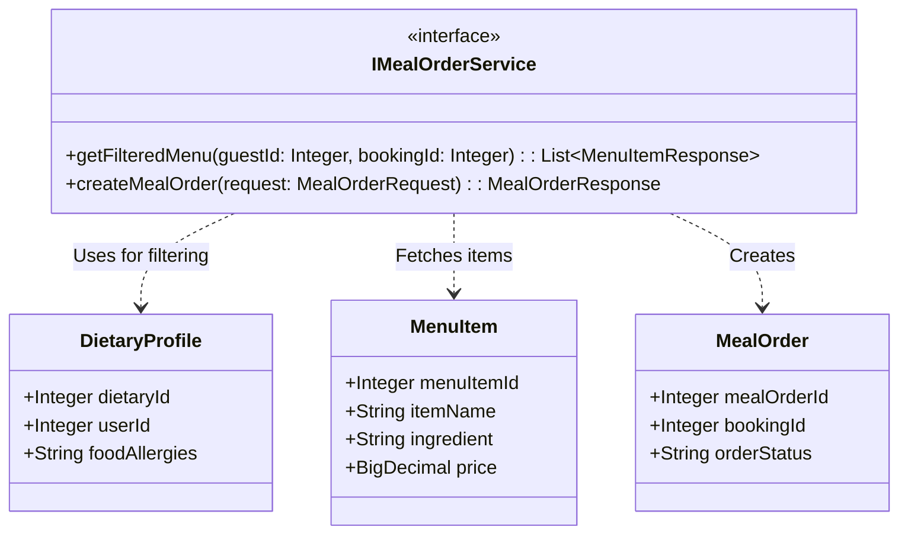
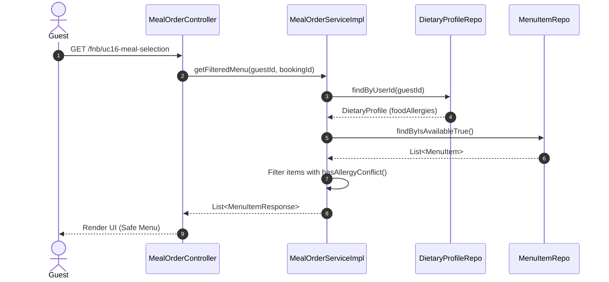

# ENGINEERING DOCUMENTATION STANDARD (EDS) v2.0
## Đặc tả Hiện thực hóa - UC16 Meal Selection

| Field | Value |
| :--- | :--- |
| **Document ID** | `XOAIAURA-FNB-IMP-016` |
| **Version** | 1.0 |
| **Date** | 2026-06-23 |
| **Status** | Approved |
| **Document Owner** | Lê Đức Dương |
| **Author** | Lê Đức Dương - Backend Developer |
| **Reviewed by** | Tech Lead |
| **DPO Sign-off** | [x] Approved — 2026-06-23 — DPO |
| **Approved by** | Principal Architect |
| **Last Review** | 2026-06-23 |
| **Based on EDS** | v2.0 |

---

## CHANGELOG

| Ngày | Người thực hiện | Nội dung thay đổi |
| :--- | :--- | :--- |
| 2026-06-23 | Lê Đức Dương | Tạo tài liệu lần đầu |

---

## 1. Tổng quan Module

> [!NOTE]
> Mô tả ngắn gọn mục đích của module, phạm vi nghiệp vụ và lý do tồn tại.

| Field | Value |
| :--- | :--- |
| **Module Name** | Quản lý Ẩm thực F&B & Ăn kiêng (UC16) |
| **Bounded Context** | F&B / Dietary |
| **Data Classification** | Sensitive-PII (Thông tin dị ứng thức ăn) |
| **Compliance Scope** | Nghị định 356/2025 về Bảo vệ Dữ liệu Cá nhân |
| **Upstream Dependencies** | Auth (lấy User ID), Booking (Kiểm tra Booking) |
| **Downstream Consumers** | Billing (Ghi nhận hóa đơn / Guest Folio) |

---

## 2. Ma trận Truy vết (Traceability Matrix)

| Requirement ID | Loại (BR/ADR/US) | Mô tả yêu cầu | Thành phần Code | Compliance Target | ADR liên quan |
| :--- | :--- | :--- | :--- | :--- | :--- |
| US-FNB-016 | User Story | Khách hàng chọn trước bữa ăn tự động lọc dị ứng | `MealOrderController.getMealSelectionPage()` | NĐ 356 Art. 4 | ADR-FNB-001 |
| BR-FNB-001 | Business Rule | Chặn món ăn chứa nguyên liệu dị ứng của khách | `MealOrderServiceImpl.isSafe()` | Data Minimization | — |

---

## 3. Architecture Decision Records (ADR)

### `ADR-FNB-001` — Lọc thực đơn dựa trên DIETARY_PROFILE

| Field | Value |
| :--- | :--- |
| **Status** | Accepted |
| **Deciders** | Lê Đức Dương |
| **Date** | 2026-06-23 |

#### Bối cảnh (Context)
Hệ thống cần cung cấp thực đơn an toàn cho khách hàng có chế độ ăn kiêng hoặc dị ứng. Việc lọc không nên phụ thuộc vào nhân viên F&B để tránh rủi ro an toàn thực phẩm.

#### Các phương án đã xem xét (Options Considered)
| Phương án | Mô tả | Ưu điểm | Nhược điểm |
| :--- | :--- | :--- | :--- |
| Lọc thủ công bởi Lễ tân | Lễ tân hỏi và ghi chú | Dễ code | Vi phạm Data Minimization (Lễ tân không được biết bệnh lý) |
| Thuật toán so khớp chuỗi | So khớp `food_allergies` và `ingredient` tại tầng Service | Tự động hóa, bảo mật cao | Cần xử lý logic ngôn ngữ linh hoạt (chứa, từ đồng nghĩa) |

#### Quyết định (Decision)
Chọn phương án **Thuật toán so khớp chuỗi** tại tầng Service (`MealOrderServiceImpl.isSafe()`).

#### Hệ quả (Consequences)
**Tích cực**: Bảo mật thông tin dị ứng, đảm bảo tự động 100%.
**Tiêu cực / Trade-offs**: Nếu `ingredient` nhập liệu sai chính tả, thuật toán có thể lọt lưới dị ứng. Cần Admin chuẩn hóa `ingredient`.

---

## 4. Static Modeling (Mô hình Tĩnh)

### 4.1. Class Diagram (Mermaid)

---

## 5. Dynamic Modeling (Mô hình Hướng Động)

### 5.1. Sequence Diagram — Happy Path (PlantUML)

---

## 6. API Specification

### 6.1. Endpoints Table

| Method | Path | Auth Level | Required Roles | Rate Limit | Idempotent? |
| :--- | :--- | :--- | :--- | :--- | :--- |
| GET | `/fnb/uc16-meal-selection` | Session | `GUEST` | 100/min | Yes |
| POST | `/fnb/uc16-meal-selection` | Session | `GUEST` | 60/min | No |

---

## 7. Bảng mã lỗi (Error Codes)

| Code | HTTP Status | Message (EN) | Message (VI) | Trigger Condition |
| :--- | :--- | :--- | :--- | :--- |
| `FNB-001` | 400 | Allergen conflict | Không thể gọi món chứa nguyên liệu gây dị ứng | Khách cố tình submit ID món ăn có trong `foodAllergies` |
| `FNB-002` | 400 | Invalid Parameters | Dữ liệu không hợp lệ | Thiếu `guestId` hoặc `bookingId` |
| `FNB-003` | 404 | Menu not found | Món ăn không tồn tại | `menuItemId` sai |
| `FNB-004` | 403 | Forbidden | Không đủ quyền sở hữu | Đặt món cho `bookingId` của người khác |

---

## 8. Bảng tổng hợp phân quyền (Authorization Matrix)

| Endpoint | GUEST | RECEPTIONIST | CHEF | ADMIN |
| :--- | :---: | :---: | :---: | :---: |
| GET `/fnb/uc16-meal-selection` | ✅ Own | ❌ | ❌ | ✅ |
| POST `/fnb/uc16-meal-selection` | ✅ Own | ❌ | ❌ | ✅ |

*EDS v2.0 — Áp dụng cho Module 4 - Xoai Aura Retreat.*
