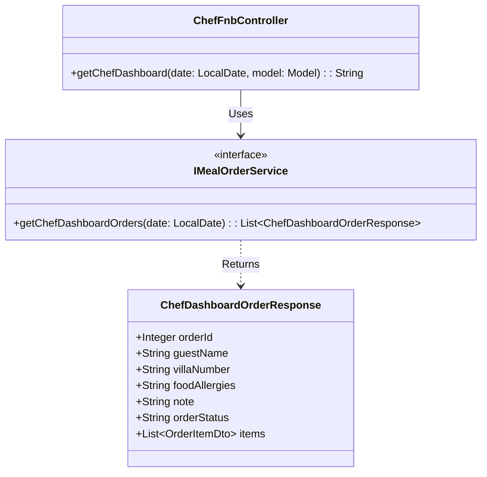
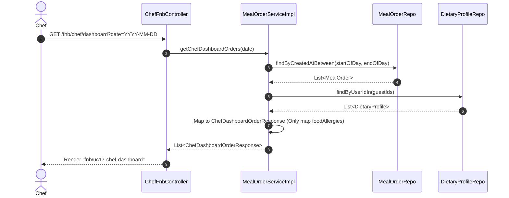

# ENGINEERING DOCUMENTATION STANDARD (EDS) v2.0
## Đặc tả Hiện thực hóa - UC17 Chef Dashboard

| Field | Value |
| :--- | :--- |
| **Document ID** | `XOAIAURA-FNB-IMP-017` |
| **Version** | 1.0 |
| **Date** | 2026-06-23 |
| **Status** | Draft |
| **Document Owner** | Lê Đức Dương |
| **Author** | Lê Đức Dương - Backend Developer |
| **Reviewed by** | Tech Lead |
| **DPO Sign-off** | [x] Approved — 2026-06-23 — DPO |
| **Approved by** | Principal Architect |
| **Last Review** | 2026-06-23 |
| **Based on EDS** | v2.0 |

---

## CHANGELOG

| Ngày | Người thực hiện | Nội dung thay đổi |
| :--- | :--- | :--- |
| 2026-06-23 | Lê Đức Dương | Tạo tài liệu lần đầu |

---

## 1. Tổng quan Module

> [!NOTE]
> Đặc tả bảng điều khiển cho Đầu bếp (Chef Dashboard) xem tổng hợp các đơn đặt món ăn và các cảnh báo dị ứng cụ thể trong ngày (ẩn bệnh lý theo quy định Data Minimization).

| Field | Value |
| :--- | :--- |
| **Module Name** | Quản lý Ẩm thực F&B & Bếp (UC17) |
| **Bounded Context** | F&B / Kitchen |
| **Data Classification** | Sensitive-PII (Chỉ chia sẻ giới hạn: dị ứng thức ăn, che giấu bệnh lý) |
| **Compliance Scope** | Nghị định 356/2025 Điều 4 (Data Minimization) |
| **Upstream Dependencies** | Booking, DietaryProfile, MealOrder |
| **Downstream Consumers** | N/A |

---

## 2. Ma trận Truy vết (Traceability Matrix)

| Requirement ID | Loại (BR/ADR/US) | Mô tả yêu cầu | Thành phần Code | Compliance Target | ADR liên quan |
| :--- | :--- | :--- | :--- | :--- | :--- |
| US-FNB-017 | User Story | Đầu bếp xem Dashboard chuẩn bị món ăn | `ChefFnbController.getChefDashboard()` | NĐ 356 Art. 4 | ADR-FNB-002 |
| BR-FNB-002 | Business Rule | Che giấu bệnh sử, chỉ hiển thị dị ứng | `IMealOrderService.getChefDashboardOrders()` | Data Minimization | — |

---

## 3. Architecture Decision Records (ADR)

### `ADR-FNB-002` — Tổng hợp dữ liệu hiển thị cho Chef Dashboard

| Field | Value |
| :--- | :--- |
| **Status** | Accepted |
| **Deciders** | Lê Đức Dương |
| **Date** | 2026-06-23 |

#### Bối cảnh (Context)
Đầu bếp cần xem danh sách tất cả các đơn đặt món (UC16 và UC19) dự kiến trong ngày kèm theo các cảnh báo dị ứng (từ UC02 Health Profile) để chuẩn bị nguyên liệu. Tuy nhiên, theo yêu cầu Data Minimization, Đầu bếp KHÔNG ĐƯỢC xem các thông tin bệnh lý khác (vd: đau lưng, tiền sử tim mạch).

#### Các phương án đã xem xét (Options Considered)
| Phương án | Mô tả | Ưu điểm | Nhược điểm |
| :--- | :--- | :--- | :--- |
| A. Truy vấn Join DB trực tiếp | Join bảng MealOrder, OrderItem, MenuItem và DietaryProfile ngay trong 1 truy vấn SQL. | Nhanh, không cần xử lý code. | Query phức tạp, dễ leak dữ liệu nếu viết sai SELECT. |
| B. Data Aggregation tại Service | Truy vấn riêng rẽ và gộp dữ liệu bằng Java Code (lọc bỏ các trường nhạy cảm). | Kiểm soát hoàn toàn dữ liệu PII được map vào DTO. | Chậm hơn một chút do N+1 query nếu không optimize. |

#### Quyết định (Decision)
Chọn phương án **B (Data Aggregation tại Service)** thông qua việc sử dụng DTO `ChefDashboardOrderResponse`.

#### Hệ quả (Consequences)
**Tích cực**:
- Ngăn chặn hoàn toàn việc rò rỉ dữ liệu y tế không liên quan (chỉ map trường `foodAllergies` vào DTO).
- Tuân thủ tuyệt đối Nghị định 356/2025.

**Tiêu cực / Trade-offs**:
- Cần tối ưu bằng `IN` clause (e.g. `findByUserIdIn()`) để tránh N+1 Query.

---

## 4. Static Modeling (Mô hình Tĩnh)

### 4.1. Class Diagram (Mermaid)

---

## 5. Dynamic Modeling (Mô hình Hướng Động)

### 5.1. Sequence Diagram — Happy Path (PlantUML)

---

## 6. API Specification

### 6.1. Endpoints Table

| Method | Path | Auth Level | Required Roles | Rate Limit | Idempotent? |
| :--- | :--- | :--- | :--- | :--- | :--- |
| GET | `/fnb/chef/dashboard` | Session | `CHEF`, `ADMIN` | 100/min | Yes |

---

## 7. Bảng mã lỗi (Error Codes)

| Code | HTTP Status | Message (EN) | Message (VI) | Trigger Condition |
| :--- | :--- | :--- | :--- | :--- |
| `FNB-004` | 403 | Forbidden | Không đủ quyền truy cập | Truy cập bằng tài khoản không có Role CHEF |

---

## 8. Bảng tổng hợp phân quyền (Authorization Matrix)

| Endpoint | GUEST | RECEPTIONIST | CHEF | ADMIN |
| :--- | :---: | :---: | :---: | :---: |
| GET `/fnb/chef/dashboard` | ❌ | ❌ | ✅ | ✅ |

*EDS v2.0 — Áp dụng cho Module 4 - Xoai Aura Retreat.*
