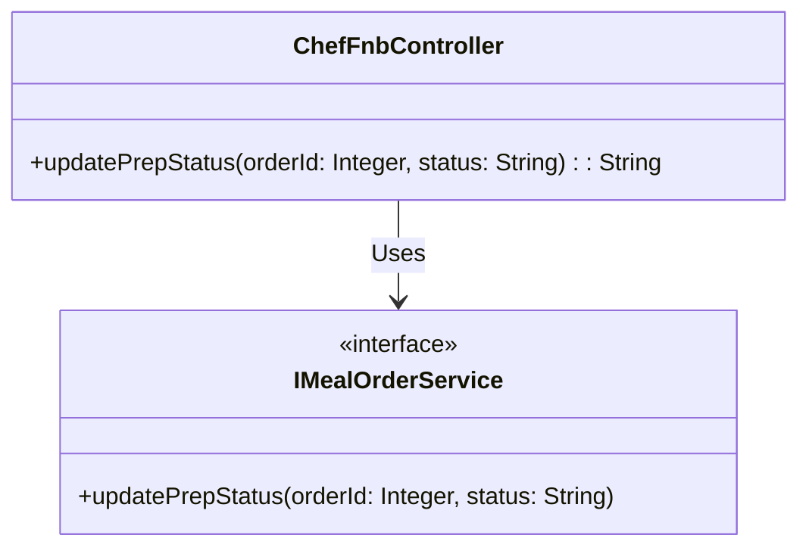
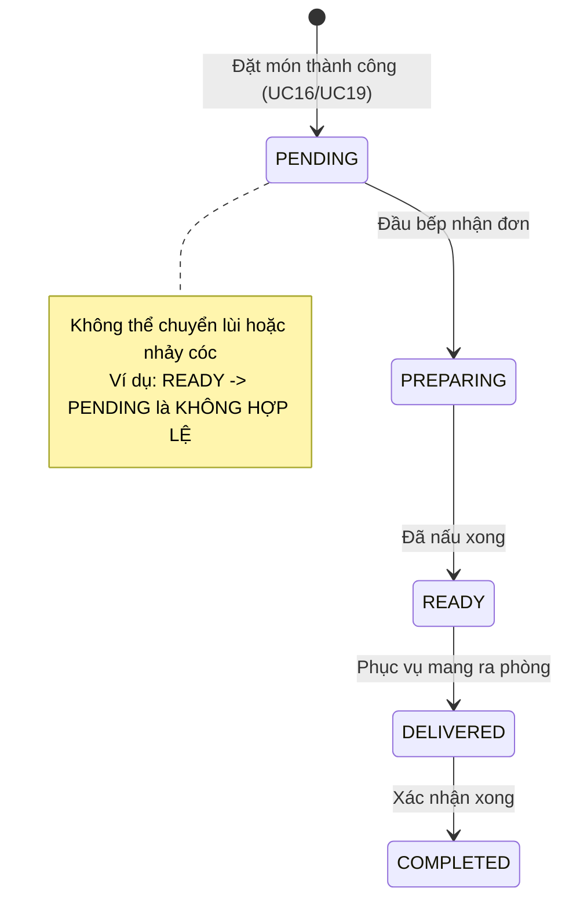

# ENGINEERING DOCUMENTATION STANDARD (EDS) v2.0
## Đặc tả Hiện thực hóa - UC18 Chef Order Status Update

| Field | Value |
| :--- | :--- |
| **Document ID** | `XOAIAURA-FNB-IMP-018` |
| **Version** | 1.0 |
| **Date** | 2026-06-23 |
| **Status** | Approved |
| **Document Owner** | Lê Đức Dương |
| **Author** | Lê Đức Dương - Backend Developer |
| **Reviewed by** | Tech Lead |
| **DPO Sign-off** | [x] N/A — Không xử lý PII |
| **Approved by** | Principal Architect |
| **Last Review** | 2026-06-23 |
| **Based on EDS** | v2.0 |

---

## CHANGELOG

| Ngày | Người thực hiện | Nội dung thay đổi |
| :--- | :--- | :--- |
| 2026-06-23 | Lê Đức Dương | Tạo tài liệu lần đầu |

---

## 1. Tổng quan Module

> [!NOTE]
> Đặc tả tính năng cho phép Đầu bếp/Nhân viên F&B cập nhật trạng thái chuẩn bị của một đơn đặt món ăn, tuân thủ theo State Machine quy định (Tránh cập nhật ngược trạng thái).

| Field | Value |
| :--- | :--- |
| **Module Name** | Quản lý Ẩm thực F&B & Bếp (UC18) |
| **Bounded Context** | F&B / Kitchen |
| **Data Classification** | Internal |
| **Compliance Scope** | N/A |
| **Upstream Dependencies** | MealOrder (UC16, UC19) |
| **Downstream Consumers** | GuestFolio (Chỉ dùng để thanh toán, trạng thái món ăn không tác động trực tiếp đến Folio sau khi đã order) |

---

## 2. Ma trận Truy vết (Traceability Matrix)

| Requirement ID | Loại (BR/ADR/US) | Mô tả yêu cầu | Thành phần Code | Compliance Target | ADR liên quan |
| :--- | :--- | :--- | :--- | :--- | :--- |
| US-FNB-018 | User Story | Đầu bếp cập nhật trạng thái chuẩn bị món | `ChefFnbController.updatePrepStatus()` | N/A | ADR-FNB-003 |
| BR-FNB-003 | Business Rule | Trạng thái món ăn phải đi theo một chiều (One-way State Machine) | `MealOrderServiceImpl.updatePrepStatus()` | N/A | — |

---

## 3. Architecture Decision Records (ADR)

### `ADR-FNB-003` — State Machine cho MealOrder Status

| Field | Value |
| :--- | :--- |
| **Status** | Accepted |
| **Deciders** | Lê Đức Dương |
| **Date** | 2026-06-23 |

#### Bối cảnh (Context)
Đơn đặt món ăn trải qua nhiều quy trình trong bếp. Đầu bếp có thể bấm nhầm khiến trạng thái đơn đang "Sẵn sàng" (READY) bị lùi về "Đang chờ" (PENDING), gây nhầm lẫn trong khâu phục vụ và khiến bếp nấu lại lần 2.

#### Quyết định (Decision)
Ban hành State Machine chặt chẽ trong Backend (`MealOrderServiceImpl`). Trạng thái chỉ được phép tịnh tiến theo chiều: `PENDING` -> `PREPARING` -> `READY` -> `DELIVERED` -> `COMPLETED`. Mọi thao tác cập nhật nhảy cóc hoặc đi lùi đều bị từ chối bằng ngoại lệ `FNB-001`.

#### Hệ quả (Consequences)
**Tích cực**:
- Loại bỏ hoàn toàn lỗi con người trong bếp.

**Tiêu cực / Trade-offs**:
- Nếu thực sự cần lùi trạng thái do lỗi quá trình chuẩn bị, Đầu bếp phải báo Admin hoặc Lễ tân để hủy đơn và đặt lại, không thể tự sửa.

---

## 4. Static Modeling (Mô hình Tĩnh)

### 4.1. Class Diagram (Mermaid)

---

## 5. Dynamic Modeling (Mô hình Hướng Động)

### 5.1. State Machine (Meal Order Status)

---

## 6. API Specification

### 6.1. Endpoints Table

| Method | Path | Auth Level | Required Roles | Rate Limit | Idempotent? |
| :--- | :--- | :--- | :--- | :--- | :--- |
| POST | `/fnb/chef/order/{orderId}/status` | Session | `CHEF`, `ADMIN` | 100/min | Yes |

---

## 7. Bảng mã lỗi (Error Codes)

| Code | HTTP Status | Message (EN) | Message (VI) | Trigger Condition |
| :--- | :--- | :--- | :--- | :--- |
| `FNB-001` | 400 | Validation failed | Trạng thái chuyển đổi không hợp lệ | Cố tình lùi trạng thái món ăn |
| `FNB-003` | 404 | Order not found | Không tìm thấy đơn hàng | orderId không tồn tại |
| `FNB-004` | 403 | Forbidden | Không đủ quyền | Truy cập bằng tài khoản không có Role CHEF |

---

## 8. Bảng tổng hợp phân quyền (Authorization Matrix)

| Endpoint | GUEST | RECEPTIONIST | CHEF | ADMIN |
| :--- | :---: | :---: | :---: | :---: |
| POST `/fnb/chef/order/{id}/status`| ❌ | ❌ | ✅ | ✅ |

*EDS v2.0 — Áp dụng cho Module 4 - Xoai Aura Retreat.*
