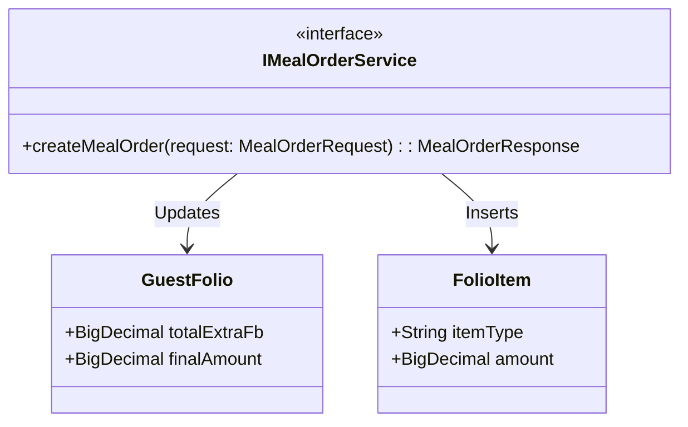
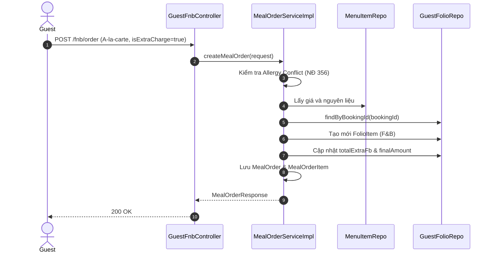

# ENGINEERING DOCUMENTATION STANDARD (EDS) v2.0
## Đặc tả Hiện thực hóa - UC19 A-la-carte Order

| Field | Value |
| :--- | :--- |
| **Document ID** | `XOAIAURA-FNB-IMP-019` |
| **Version** | 1.0 |
| **Date** | 2026-06-23 |
| **Status** | Approved |
| **Document Owner** | Lê Đức Dương |
| **Author** | Lê Đức Dương - Backend Developer |
| **Reviewed by** | Tech Lead |
| **DPO Sign-off** | [x] N/A — Không lưu mới PII |
| **Approved by** | Principal Architect |
| **Last Review** | 2026-06-23 |
| **Based on EDS** | v2.0 |

---

## CHANGELOG

| Ngày | Người thực hiện | Nội dung thay đổi |
| :--- | :--- | :--- |
| 2026-06-23 | Lê Đức Dương | Tạo tài liệu và thiết kế kiến trúc |

---

## 1. Tổng quan Module

> [!NOTE]
> Đặc tả tính năng cho phép Khách hàng (Guest) gọi thêm các món ăn/thức uống ngoài (A-la-carte) không nằm trong tiêu chuẩn gói Retreat ban đầu. Tính năng này yêu cầu đồng bộ tức thời số tiền phụ thu vào tài khoản phòng (Guest Folio) để thanh toán gộp lúc Check-out.

| Field | Value |
| :--- | :--- |
| **Module Name** | Quản lý Ẩm thực F&B (UC19) |
| **Bounded Context** | F&B / Billing |
| **Data Classification** | Internal |
| **Compliance Scope** | Hạn chế gọi món vi phạm an toàn dị ứng (NĐ 356/2025) |
| **Upstream Dependencies** | Booking, DietaryProfile, MenuItem |
| **Downstream Consumers** | GuestFolio, FolioItem |

---

## 2. Ma trận Truy vết (Traceability Matrix)

| Requirement ID | Loại (BR/ADR/US) | Mô tả yêu cầu | Thành phần Code | Compliance Target | ADR liên quan |
| :--- | :--- | :--- | :--- | :--- | :--- |
| US-FNB-019 | User Story | Khách hàng gọi món a-la-carte và tính phí vào Villa | `MealOrderServiceImpl.createMealOrder()` | N/A | ADR-FNB-004 |
| BR-FNB-004 | Business Rule | Chặn món ăn chứa nguyên liệu dị ứng | `MealOrderServiceImpl.isSafe()` | NĐ 356 | — |
| BR-FNB-005 | Business Rule | Tự động cộng dồn tiền vào Folio | `FolioItemRepository.save()`, `GuestFolio.setTotalExtraFb()` | Consolidated Billing Constraint | ADR-FNB-004 |

---

## 3. Architecture Decision Records (ADR)

### `ADR-FNB-004` — Đồng bộ hóa Thanh toán Gộp (Consolidated Billing)

| Field | Value |
| :--- | :--- |
| **Status** | Accepted |
| **Deciders** | Lê Đức Dương |
| **Date** | 2026-06-23 |

#### Bối cảnh (Context)
Yêu cầu hệ thống phải tính phí các món ăn gọi ngoài (A-la-carte) trực tiếp vào phòng (Folio) để phục vụ việc tính hóa đơn gộp (Consolidated Invoice) lúc Check-out.

#### Các phương án đã xem xét (Options Considered)
| Phương án | Mô tả | Ưu điểm | Nhược điểm |
| :--- | :--- | :--- | :--- |
| A. Night Audit tự cộng | Để Night Audit cuối ngày duyệt các đơn F&B và tự tính vào Folio. | Tách biệt hoàn toàn F&B và Billing. | Khách hàng không thể xem hóa đơn realtime. |
| B. Realtime Update | Khi tạo đơn F&B với cờ `isExtraCharge=true`, F&B Service gọi cập nhật Folio ngay lập tức trong cùng 1 Transaction. | Tính tiền realtime, khách hàng xem Folio chính xác 100% tại mọi thời điểm. | Gắn kết chặt (Coupling) F&B và Billing Repo. |

#### Quyết định (Decision)
Chọn phương án **B (Realtime Update)**. Cấu hình cờ `isExtraCharge = true` từ payload, nếu true, hệ thống tự động:
1. Tạo 1 `FolioItem` loại F&B.
2. Cộng tổng tiền món phụ thu vào `GuestFolio.totalExtraFb`.
3. Cộng dồn vào `GuestFolio.finalAmount`.
4. Tạo `MealOrder`.
(Tất cả nằm trong 1 Transaction để đảm bảo tính ACID).

---

## 4. Static Modeling (Mô hình Tĩnh)

### 4.1. Class Diagram (Mermaid)

---

## 5. Dynamic Modeling (Mô hình Hướng Động)

### 5.1. Sequence Diagram — Happy Path (PlantUML)

---

## 6. API Specification

### 6.1. Endpoints Table

| Method | Path | Auth Level | Required Roles | Rate Limit | Idempotent? |
| :--- | :--- | :--- | :--- | :--- | :--- |
| POST | `/fnb/order` | Session | `GUEST` | 30/min | No |

---

## 7. Bảng mã lỗi (Error Codes)

| Code | HTTP Status | Message (EN) | Message (VI) | Trigger Condition |
| :--- | :--- | :--- | :--- | :--- |
| `FNB-001` | 400 | Allergen conflict | Chứa nguyên liệu dị ứng | Cố tình gọi món có thành phần cấm kỵ |
| `FNB-002` | 400 | Invalid quantity | Số lượng sai | Số lượng < 1 |
| `FNB-003` | 404 | Menu Item Not Found | Món ăn không tồn tại | ID món ăn không đúng |

---

## 8. Bảng tổng hợp phân quyền (Authorization Matrix)

| Endpoint | GUEST | RECEPTIONIST | CHEF | ADMIN |
| :--- | :---: | :---: | :---: | :---: |
| POST `/fnb/order` | ✅ Own | ❌ | ❌ | ❌ |

*EDS v2.0 — Áp dụng cho Module 4 - Xoai Aura Retreat.*
