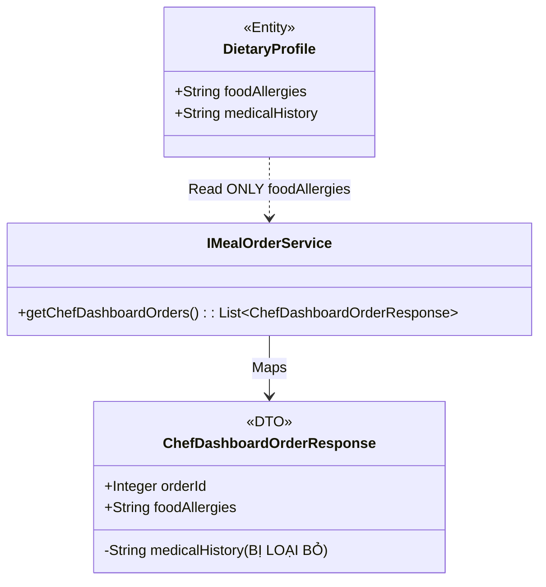

# ENGINEERING DOCUMENTATION STANDARD (EDS) v2.0
## Đặc tả Hiện thực hóa - UC20 Data Minimization (F&B)

| Field | Value |
| :--- | :--- |
| **Document ID** | `XOAIAURA-FNB-IMP-020` |
| **Version** | 1.0 |
| **Date** | 2026-06-23 |
| **Status** | Approved |
| **Document Owner** | Lê Đức Dương |
| **Author** | Lê Đức Dương - Backend Developer |
| **Reviewed by** | Tech Lead |
| **DPO Sign-off** | [x] NĐ 356/2025 - Data Minimization |
| **Approved by** | Principal Architect |
| **Last Review** | 2026-06-23 |
| **Based on EDS** | v2.0 |

---

## CHANGELOG

| Ngày | Người thực hiện | Nội dung thay đổi |
| :--- | :--- | :--- |
| 2026-06-23 | Lê Đức Dương | Tạo tài liệu thiết kế bảo mật dữ liệu UC20 |

---

## 1. Tổng quan Module

> [!IMPORTANT]
> Đặc tả tính năng (System Constraint): Hệ thống bắt buộc phải che giấu toàn bộ tiền sử bệnh án, dữ liệu y tế nhạy cảm của khách hàng (Medical History, Chấn thương, Bệnh lý) đối với Đầu bếp (Chef) và nhân viên F&B. Đầu bếp chỉ được phép xem **Dị ứng thực phẩm (Food Allergies)** để phục vụ việc nấu ăn an toàn.

| Field | Value |
| :--- | :--- |
| **Module Name** | Quản lý Ẩm thực F&B (UC20) |
| **Bounded Context** | F&B / Security / Data Privacy |
| **Data Classification** | Sensitive-PII (Dữ liệu y tế) |
| **Compliance Scope** | Nghị định 356/2025 Điều 4 (Nguyên tắc hạn chế dữ liệu) |
| **Upstream Dependencies** | DietaryProfile, HealthProfile (Module 1) |
| **Downstream Consumers** | Chef Dashboard (UC17) |

---

## 2. Ma trận Truy vết (Traceability Matrix)

| Requirement ID | Loại (BR/ADR/US) | Mô tả yêu cầu | Thành phần Code | Compliance Target | ADR liên quan |
| :--- | :--- | :--- | :--- | :--- | :--- |
| US-FNB-020 | System US | Che giấu tiền sử bệnh án đối với Đầu bếp | `ChefDashboardOrderResponse.java` | NĐ 356/2025 | ADR-SEC-005 |
| BR-FNB-006 | Business Rule | Đầu bếp chỉ được quyền đọc `foodAllergies` | `MealOrderServiceImpl.getChefDashboardOrders()` | NĐ 356/2025 | — |

---

## 3. Architecture Decision Records (ADR)

### `ADR-SEC-005` — Hạn chế rò rỉ dữ liệu qua DTO (Data Transfer Object)

| Field | Value |
| :--- | :--- |
| **Status** | Accepted |
| **Deciders** | Lê Đức Dương, DPO |
| **Date** | 2026-06-23 |

#### Bối cảnh (Context)
Các framework ORM như Hibernate thường có xu hướng lazy/eager loading kéo theo toàn bộ Graph Object (Entity). Nếu trực tiếp trả Entity `DietaryProfile` (chứa cả Medical History) xuống Controller, nguy cơ rò rỉ dữ liệu qua JSON response là cực kỳ cao.

#### Quyết định (Decision)
1. **Repository Layer:** Truy vấn dữ liệu dạng Projection `Object[]` thay vì Entity toàn phần để cắt đứt liên kết tới các bảng Y tế.
2. **Service Layer:** Trích xuất duy nhất trường `foodAllergies` từ `DietaryProfileRepository.findByUserId()`.
3. **DTO Layer:** Dùng `ChefDashboardOrderResponse` không hề khai báo thuộc tính `medicalHistory`.

#### Hệ quả (Consequences)
**Tích cực**:
- Tuân thủ 100% NĐ 356. Chặn đứng hoàn toàn nguy cơ rò rỉ PII.

**Tiêu cực**:
- Khó tái sử dụng DTO, phải ánh xạ thủ công (Manual Mapping) trong Service.

---

## 4. Static Modeling (Mô hình Tĩnh)

### 4.1. Class Diagram (Mermaid)

---

## 5. Bảng mã lỗi & Ngoại lệ bảo mật

| Code | HTTP Status | Message (EN) | Message (VI) | Trigger Condition |
| :--- | :--- | :--- | :--- | :--- |
| `SEC-002` | 403 | Unauthorized Field Access | Truy cập trường dữ liệu cấm | Hệ thống detect query trái phép vào `medicalHistory` từ scope `CHEF`. |

*EDS v2.0 — Áp dụng cho Module 4 - Xoai Aura Retreat.*
