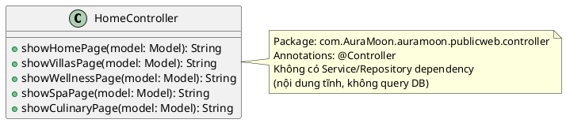
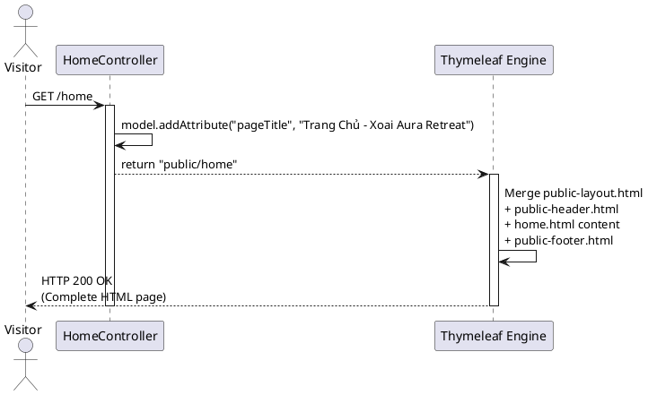

# ENGINEERING DOCUMENTATION STANDARD (EDS) v2.0
# Quy chuẩn Tài liệu Kỹ thuật và Đặc tả Hiện thực hóa

| Field | Value |
| --- | --- |
| **Document ID** | `AURA-PUB-IMP-HOME` |
| **Version** | 1.0 |
| **Date** | `2026-06-12` |
| **Status** | Approved |
| **Document Owner** | `Phùng Giang Hải` |
| **Author** | `Phùng Giang Hải - Fullstack Developer` |
| **Reviewed by** | `Tech Lead` |
| **DPO Sign-off** | `[ ] N/A — Module Public Web không xử lý PII` |
| **Approved by** | `Principal Architect` |
| **Last Review** | `2026-06-12` |
| **Based on EDS** | v2.0 |

# CHANGELOG
> **Policy 4.4 — Immutable History:** Không bao giờ xóa thông tin cũ.

| Ngày | Người thực hiện | Nội dung thay đổi |
| --- | --- | --- |
| 2026-06-12 | Phùng Giang Hải | Tạo tài liệu EDS lần đầu cho Home & Landing Pages |

# MỤC LỤC
1. Tổng quan Module
2. Ma trận Truy vết (Traceability Matrix)
3. Architecture Decision Records (ADR)
4. Non-Functional Requirements & SLA
5. Static Modeling (Mô hình Tĩnh)
6. Dynamic Modeling (Mô hình Động)
7. Domain Event Catalog
8. Interface Specification (Đặc tả Giao diện)
9. Web MVC Specification (Đặc tả MVC)
10. Bảng mã lỗi (Error Codes)
11. Quy trình Triển khai (Step-by-Step)
12. Rollback & Incident Runbook
13. Kịch bản Kiểm thử Chi tiết
14. Phương pháp Xác minh
15. Mẫu thử thực tế (MVC Verification Samples)
16. Bảng tổng hợp phân quyền (Authorization Matrix)

# 1. Tổng quan Module

> Phân hệ Public Web phục vụ giao diện trang chủ và các Landing Pages giới thiệu dịch vụ khu nghỉ dưỡng cho người dùng vãng lai (chưa đăng nhập). Bao gồm 5 trang: Home, Retreat & Wellness, Villas, Spa, Culinary.

| Field | Value |
| --- | --- |
| **Module Name** | `Public Web — Home & Landing Pages` |
| **Bounded Context** | `Public Content / Marketing` |
| **Data Classification** | `Public` |
| **Compliance Scope** | `N/A` |
| **Upstream Dependencies** | `None — Nội dung tĩnh` |
| **Downstream Consumers** | `Login/Register (CTA buttons), Booking Flow` |

# 2. Ma trận Truy vết (Traceability Matrix)

| Requirement ID | Loại (BR/ADR/US) | Mô tả yêu cầu | Thành phần Code | Compliance Target | ADR liên quan |
| --- | --- | --- | --- | --- | --- |
| SRS-Screen-Home | Screen Auth | Home Page accessible by all roles | `HomeController.showHomePage()` | — | ADR-001 |
| SRS-Screen-Packages | Screen Auth | Packages List accessible by all roles | `HomeController.showWellnessPage()` | — | — |
| Rule-04 | Project Rule | Tách CSS/JS theo module, không inline | `static/css/public/`, `static/js/public/` | Nguyên tắc 4 | ADR-002 |

# 3. Architecture Decision Records (ADR)

## ADR-001 — Layout dùng chung cho Public Pages (Thymeleaf Fragments)

| Field | Value |
| --- | --- |
| **Status** | Accepted |
| **Deciders** | Phùng Giang Hải, Tech Lead |
| **Date** | 2026-06-12 |

**Bối cảnh (Context)**
> 5 trang public đều có chung Navbar và Footer. Cần quyết định cách tổ chức code UI.

**Các phương án đã xem xét (Options Considered)**

| Phương án | Mô tả | Ưu điểm | Nhược điểm |
| --- | --- | --- | --- |
| A | Copy-paste Navbar/Footer vào từng file HTML | + Đơn giản | - Code trùng lặp, khó bảo trì |
| B | Dùng Thymeleaf Layout Dialect + Fragments | + DRY, dễ bảo trì, thay đổi 1 chỗ ảnh hưởng 5 trang | - Cần hiểu thêm Thymeleaf Layout Dialect |

**Quyết định (Decision)**
> Chọn **Phương án B**: Tạo `public-layout.html` làm Base Layout, `public-header.html` và `public-footer.html` làm Fragments dùng chung.

**Hệ quả (Consequences)**

**Tích cực:**
* Thay đổi Navbar 1 lần → áp dụng cho cả 5 trang.

**Tiêu cực / Trade-offs:**
* Phụ thuộc vào Thymeleaf Layout Dialect (dependency `thymeleaf-layout-dialect`).

## ADR-002 — Tách CSS/JS theo module (Nguyên tắc 4)

| Field | Value |
| --- | --- |
| **Status** | Accepted |
| **Deciders** | Team |
| **Date** | 2026-06-12 |

**Bối cảnh (Context)**
> Nguyên tắc 4 yêu cầu: không viết CSS/JS inline, tách theo module.

**Quyết định (Decision)**
> Mỗi trang có file CSS/JS riêng: `static/css/public/{page}.css` và `static/js/public/{page}.js`. Navbar scroll effect JS dùng chung nằm trong `public-header.html` fragment hoặc file JS riêng.

# 4. Non-Functional Requirements & SLA

## 4.1. Performance & Availability
| Category | Requirement | Target SLA | Measurement Method | Compliance Basis |
| --- | --- | --- | --- | --- |
| Latency | Page load (p99) | `< 2s` | Lighthouse | PF-01 (SRS) |
| Availability | Uptime | `99.5%` | Monitoring | PF-17 (SRS) |

## 4.2. Data Integrity & Retention
| Category | Requirement | Target | Verification Method | Compliance Basis |
| --- | --- | --- | --- | --- |
| Integrity | Content Delivery | 100% | Manual Test | N/A |

## 4.3. Security
| Category | Requirement | Target | Verification Method | Compliance Basis |
| --- | --- | --- | --- | --- |
| Access control | Public pages | Không cần authentication | Manual test | SRS Screen Auth Matrix |

## 4.4. Scalability & Capacity Planning
> Các trang nội dung tĩnh, có thể cấu hình caching ở cấp độ CDN/Nginx để handle lượng truy cập lớn mà không ảnh hưởng tới DB.

# 5. Static Modeling (Mô hình Tĩnh)

## 5.1. Class Diagram (PlantUML)



## 5.2. View Structure

```text
templates/
├── layout/
│   └── public-layout.html         (Base layout: head, fonts, Tailwind CDN)
├── fragments/
│   ├── public-header.html          (Navbar dùng chung cho 5 trang)
│   └── public-footer.html          (Footer dùng chung cho 5 trang)
└── public/
    ├── home.html                   (Trang chủ - Hero + Features)
    ├── wellness.html               (Retreat & Wellness packages)
    ├── villas.html                 (Villas showcase)
    ├── spa.html                    (Spa & Therapies)
    └── culinary.html               (Culinary & Dining)

static/
├── css/public/
│   ├── home.css
│   ├── wellness.css
│   ├── villas.css
│   ├── spa.css
│   └── culinary.css
└── js/public/
    ├── home.js
    ├── wellness.js
    ├── villas.js
    ├── spa.js
    └── culinary.js
```

# 6. Dynamic Modeling (Mô hình Động)

## 6.1. Sequence Diagram — Happy Path (PlantUML)



# 7. Domain Event Catalog

N/A — Phân hệ Public Web chỉ render nội dung tĩnh, không phát sinh Domain Event.

# 8. Interface Specification (Đặc tả Giao diện)

N/A — `HomeController` không có Service/Repository dependency. Chỉ có Controller trả về View tĩnh.

# 9. Web MVC Specification (Đặc tả MVC)

## 9.1. Endpoints Table

| Method | Path | Return Type | Auth Level | Required Roles | Chức năng |
| --- | --- | --- | --- | --- | --- |
| GET | `/` hoặc `/home` | `String` (View) | Public | None | Trang chủ |
| GET | `/villas` | `String` (View) | Public | None | Giới thiệu Villas |
| GET | `/wellness` | `String` (View) | Public | None | Retreat & Wellness |
| GET | `/spa` | `String` (View) | Public | None | Spa & Therapies |
| GET | `/culinary` | `String` (View) | Public | None | Culinary & Dining |

## 9.2. Controller Implementation

```java
@Controller
public class HomeController {
    @GetMapping({"/", "/home"})
    public String showHomePage(Model model) {
        model.addAttribute("pageTitle", "Trang Chủ - Xoai Aura Retreat");
        return "public/home";
    }

    @GetMapping("/villas")
    public String showVillasPage(Model model) {
        model.addAttribute("pageTitle", "Villas - Xoai Aura Retreat");
        return "public/villas";
    }

    @GetMapping("/wellness")
    public String showWellnessPage(Model model) {
        model.addAttribute("pageTitle", "Retreat & Wellness - Xoai Aura Retreat");
        return "public/wellness";
    }

    @GetMapping("/spa")
    public String showSpaPage(Model model) {
        model.addAttribute("pageTitle", "Aura Spa & Therapies - Xoai Aura Retreat");
        return "public/spa";
    }

    @GetMapping("/culinary")
    public String showCulinaryPage(Model model) {
        model.addAttribute("pageTitle", "Aura Culinary & Dining - Xoai Aura Retreat");
        return "public/culinary";
    }
}
```

# 10. Bảng mã lỗi (Error Codes)

N/A — Public pages chỉ render nội dung tĩnh. Lỗi duy nhất có thể xảy ra là 404 nếu template không tồn tại (do lỗi cấu hình).

# 11. Quy trình Triển khai (Step-by-Step)

## 11.1. Prerequisites
- [x] Thymeleaf Layout Dialect đã có trong `pom.xml`
- [x] TailwindCSS CDN đã được include trong `public-layout.html`
- [x] Các thiết kế Stitch đã sẵn sàng (5 Screen IDs)

## 11.2. Implementation Steps

### Chặng 1 — Layout & Fragments
Tạo `public-layout.html`, `public-header.html`, `public-footer.html`

### Chặng 2 — Controller
Tạo `HomeController.java` với 5 `@GetMapping`

### Chặng 3 — Views
Fetch HTML từ Stitch → tạo 5 file tại `templates/public/`

### Chặng 4 — Static Resources
Bóc tách inline CSS/JS từ HTML → đặt vào `static/css/public/` và `static/js/public/`

### Chặng 5 — Spring Security Config
Cấu hình `.permitAll()` cho các path: `/`, `/home`, `/villas`, `/wellness`, `/spa`, `/culinary`

## 11.3. Deployment Checklist
- [x] Tất cả 5 trang trả về HTTP 200
- [x] Navbar điều hướng đúng giữa 5 trang
- [x] Không có CSS/JS inline trong HTML (Nguyên tắc 4)

# 12. Rollback & Incident Runbook

## 12.1. Đánh giá rủi ro
> Public Web là nội dung tĩnh, không có logic nghiệp vụ hay truy cập DB. Rủi ro cực thấp.

## 12.2. Rollback Procedure
```bash
git checkout -- auramoon/src/main/java/com/AuraMoon/auramoon/publicweb/
git checkout -- auramoon/src/main/resources/templates/public/
git checkout -- auramoon/src/main/resources/templates/layout/public-layout.html
git checkout -- auramoon/src/main/resources/templates/fragments/public-header.html
git checkout -- auramoon/src/main/resources/templates/fragments/public-footer.html
git checkout -- auramoon/src/main/resources/static/css/public/
git checkout -- auramoon/src/main/resources/static/js/public/
```

# 13. Kịch bản Kiểm thử Chi tiết

> Chi tiết tại `Home_TDD_Public_Web.md`. Tóm tắt:

| TC ID | Tên | Mức độ | Kết quả mong đợi |
| --- | --- | --- | --- |
| HOME-TC-001 | Trang chủ load thành công | HIGH | HTTP 200, view = `public/home` |
| HOME-TC-002 | Navbar điều hướng đúng | MEDIUM | Click Villas → /villas trả 200 |
| HOME-TC-003 | 5 trang đều accessible | HIGH | Tất cả 5 endpoints trả 200 |

# 14. Phương pháp Xác minh

## 14.1. UI Verification
1. Truy cập `http://localhost:8080/` — trang chủ hiển thị đúng
2. Click lần lượt các menu trên Navbar: Retreats, Villas, Spa, Culinary
3. Kiểm tra không có `<style>` hoặc `<script>` inline trong HTML source

## 14.2. Structure Verification
```bash
# Kiểm tra tất cả CSS/JS đã tách riêng
find auramoon/src/main/resources/static/css/public/ -name "*.css" | wc -l
# Expected: 5

find auramoon/src/main/resources/static/js/public/ -name "*.js" | wc -l
# Expected: 5
```

# 15. Mẫu thử thực tế (MVC Verification Samples)

## 15.1. Happy Path
```
GET http://localhost:8080/
→ HTTP 200 OK, HTML page with title "Trang Chủ - Xoai Aura Retreat"

GET http://localhost:8080/villas
→ HTTP 200 OK, HTML page with title "Villas - Xoai Aura Retreat"

GET http://localhost:8080/wellness
→ HTTP 200 OK, HTML page with title "Retreat & Wellness - Xoai Aura Retreat"

GET http://localhost:8080/spa
→ HTTP 200 OK, HTML page with title "Aura Spa & Therapies - Xoai Aura Retreat"

GET http://localhost:8080/culinary
→ HTTP 200 OK, HTML page with title "Aura Culinary & Dining - Xoai Aura Retreat"
```

# 16. Bảng tổng hợp phân quyền (Authorization Matrix)

| Endpoint | GUEST (Anonymous) | GUEST (Logged in) | RECEPTIONIST | THERAPIST | CHEF | ADMIN |
| --- | --- | --- | --- | --- | --- | --- |
| `GET /` | ✅ | ✅ | ✅ | ✅ | ✅ | ✅ |
| `GET /home` | ✅ | ✅ | ✅ | ✅ | ✅ | ✅ |
| `GET /villas` | ✅ | ✅ | ✅ | ✅ | ✅ | ✅ |
| `GET /wellness` | ✅ | ✅ | ✅ | ✅ | ✅ | ✅ |
| `GET /spa` | ✅ | ✅ | ✅ | ✅ | ✅ | ✅ |
| `GET /culinary` | ✅ | ✅ | ✅ | ✅ | ✅ | ✅ |

**Chú thích:** Tất cả trang Public đều `.permitAll()` — không cần authentication.

# PHỤ LỤC

## A. Glossary (Thuật ngữ)

| Thuật ngữ | Định nghĩa |
| --- | --- |
| Landing Page | Trang giới thiệu tĩnh, không cần đăng nhập |
| Fragment | Thành phần UI dùng chung (Navbar, Footer) trong Thymeleaf |
| Layout Dialect | Extension của Thymeleaf cho phép kế thừa layout |

## B. Stitch Screen IDs

| Trang | Stitch ID |
| --- | --- |
| Home | `9d69eebce0e14a1785e3ee4b86740c51` |
| Retreat & Wellness | `5c0320f2f8a843a1ae823d4ccd57021e` |
| Villas | `f5ea14e0aebd47b7bc2e2b5596e68c6d` |
| Spa | `746bbe47ddf04a96bb083ac1e0452826` |
| Culinary | `49616f005474494a841eb537c4858f8e` |
