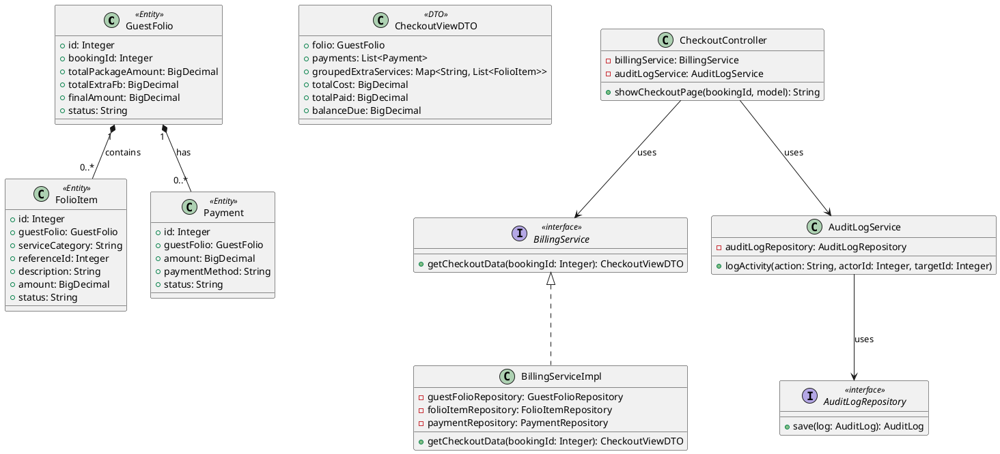
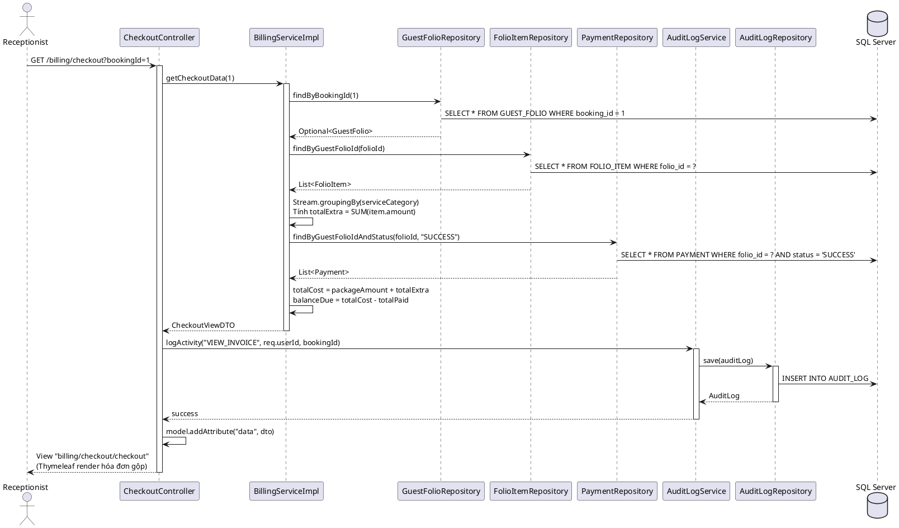
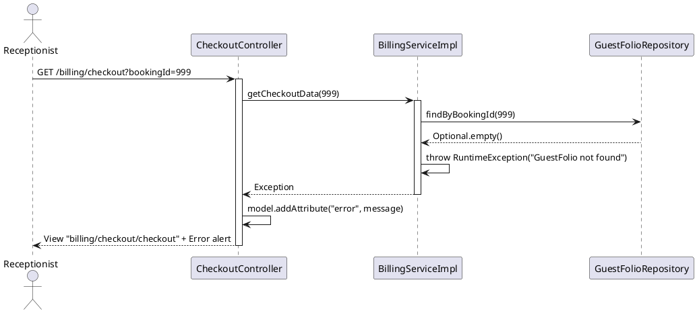
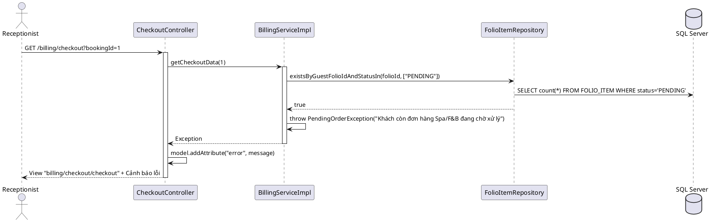

# ENGINEERING DOCUMENTATION STANDARD (EDS) v2.0

# Quy chuẩn Tài liệu Kỹ thuật và Đặc tả Hiện thực hóa

| Field                    | Value                                          |
| ------------------------ | ---------------------------------------------- |
| **Document ID**    | `AURA-BILLING-IMP-021`                       |
| **Version**        | 1.0                                            |
| **Date**           | `2026-06-12`                                 |
| **Status**         | ✅ Approved                                      |
| **Document Owner** | Phùng Giang Hải - Tech Lead & Module 5 Owner |
| **Author**         | Phùng Giang Hải - Tech Lead & Module 5 Owner |
| **Reviewed by**    | Phùng Giang Hải - Tech Lead & Module 5 Owner |
| **DPO Sign-off**   | `[x] Required — Hóa đơn chứa PII (Tên khách, SĐT, Mã phòng)`       |
| **Approved by**    | `Principal Architect`                        |
| **Last Review**    | `2026-06-14`                                 |
| **Based on EDS**   | v2.0                                           |

# CHANGELOG

> **Policy 4.4 — Immutable History:** Không bao giờ xóa thông tin cũ. Mọi thay đổi phải ghi vào bảng này.

| Ngày      | Người thực hiện | Nội dung thay đổi                                           |
| ---------- | ------------------- | -------------------------------------------------------------- |
| 2026-06-12 | Sinh viên 5        | Tạo tài liệu EDS lần đầu cho UC21 - Consolidated Invoice |
| 2026-06-14 | Phùng Giang Hải    | Update Header and Add BR-15 Audit Trail |
| 2026-06-14 | AI Assistant       | Tách AuditLogService và AuditLogRepository chuẩn MVC |                       
| 2026-06-14 | AI Assistant       | Bổ sung sơ đồ Error Path cho vi phạm nghiệp vụ BR-12 |
| 2026-06-14 | AI Assistant       | Cập nhật Interface Spec (throws PendingOrderException) |
| 2026-06-14 | AI Assistant       | Chủ động rà soát & Cập nhật toàn diện các mục 4, 10-15 cho BR-12, BR-15 |
| 2026-06-14 | AI Assistant       | Bổ sung Task tạo AuditLog Service/Repository vào Mục 11.2 |
| 2026-06-14 | AI Assistant       | Chuyển AuditLogService lên Controller xử lý để tránh gọi ngầm 2 lần |
| 2026-06-14 | AI Assistant       | Sửa lỗi thiếu rà soát (Rule 7): Cập nhật Pseudo-code Mục 9.2 để đồng bộ tuyệt đối |
| 2026-06-14 | AI Assistant       | Bổ sung Mục 6.3 State Machine Diagram để tuân thủ chặt chẽ EDS Template |
| 2026-06-14 | AI Assistant       | Sửa đổi Bảng mã lỗi (Mục 10) về đúng chuẩn 5 cột của EDS_TEMPLATE_V2.0 |

# MỤC LỤC

1. Tổng quan Module
2. Ma trận Truy vết (Traceability Matrix)
3. Architecture Decision Records (ADR)
4. Non-Functional Requirements & SLA
5. Static Modeling (Mô hình Tĩnh)
6. Dynamic Modeling (Mô hình Động)
7. Domain Event Catalog
8. Interface Specification (Đặc tả Giao diện)
9. Web MVC Specification (Đặc tả MVC)
10. Bảng mã lỗi (Error Codes)
11. Quy trình Triển khai (Step-by-Step)
12. Rollback & Incident Runbook
13. Kịch bản Kiểm thử Chi tiết
14. Phương pháp Xác minh
15. Mẫu thử thực tế (MVC Verification Samples)
16. Bảng tổng hợp phân quyền (Authorization Matrix)

# 1. Tổng quan Module

> Hiển thị Hóa đơn Gộp (Consolidated Invoice) cho Lễ tân xem trước khi xử lý thanh toán. Hệ thống tự động tổng hợp chi phí từ 3 nguồn: Gói Retreat (Package), Dịch vụ Spa bổ sung, Ẩm thực F&B bổ sung — thông qua cơ chế Guest Folio tập trung.

| Field                           | Value                                                                                                             |
| ------------------------------- | ----------------------------------------------------------------------------------------------------------------- |
| **Module Name**           | `Module 5: Consolidated Billing — Invoice View (UC21)`                                                         |
| **Bounded Context**       | `Billing / Invoice`                                                                                             |
| **Data Classification**   | `Internal / Confidential`                                                                                       |
| **Compliance Scope**      | `N/A`                                                                                                           |
| **Upstream Dependencies** | `Booking Module (BOOKING, GUEST_FOLIO), Spa Module (FOLIO_ITEM: Extra Spa), F&B Module (FOLIO_ITEM: Extra F&B)` |
| **Downstream Consumers**  | `UC22 (Process Final Payment), UC24 (Revenue Dashboard)`                                                        |

# 2. Ma trận Truy vết (Traceability Matrix)

| Requirement ID | Loại (BR/ADR/US) | Mô tả yêu cầu                                                    | Thành phần Code                                         | Compliance Target | ADR liên quan |
| -------------- | ----------------- | -------------------------------------------------------------------- | --------------------------------------------------------- | ----------------- | -------------- |
| BR-11          | Business Rule     | Guest Folio — Mọi Spa/F&B charge đẩy vào tài khoản trung tâm | `BillingServiceImpl.getCheckoutData()`                  | AHLEI Night Audit | ADR-001        |
| BR-12          | Business Rule     | Check-out Constraint — Không check-out nếu còn pending orders    | `FolioItemRepository.existsByGuestFolioIdAndStatusIn()` | —                | —             |
| BR-15          | Business Rule     | Audit Trail Management — Lưu log hoạt động xem hóa đơn       | `AuditLogService.logActivity()`                         | —                | —             |
| UC21           | User Story        | Lễ tân tạo Hóa đơn Gộp tổng hợp Package + Spa + F&B         | `CheckoutController.showCheckoutPage()`                 | —                | ADR-001        |

# 3. Architecture Decision Records (ADR)

## ADR-001 — Cơ chế tổng hợp hóa đơn: Sổ cái kép đơn giản (Simplified Double-Entry)

| Field              | Value                   |
| ------------------ | ----------------------- |
| **Status**   | Accepted                |
| **Deciders** | Sinh viên 5, Tech Lead |
| **Date**     | 2026-06-12              |

**Bối cảnh (Context)**

> Hệ thống cần tổng hợp chi phí từ nhiều module (Booking, Spa, F&B) vào một hóa đơn duy nhất. Câu hỏi đặt ra: Nên query trực tiếp từ bảng gốc của từng module, hay tổng hợp thông qua một bảng trung gian?

**Các phương án đã xem xét (Options Considered)**

| Phương án | Mô tả                                                      | Ưu điểm                                                                             | Nhược điểm                                                                      |
| ------------ | ------------------------------------------------------------ | -------------------------------------------------------------------------------------- | ----------------------------------------------------------------------------------- |
| A            | Query trực tiếp từ `TREATMENT_BOOKING` + `MEAL_ORDER` | + Dữ liệu luôn realtime                                                             | - JOIN phức tạp, khó bảo trì khi thêm module mới                             |
| B            | Dùng `FOLIO_ITEM` làm bảng trung gian ghi nợ           | + Các module khác tự đẩy charge vào, UC21 chỉ cần query 1 bảng. Mở rộng dễ | - Phụ thuộc vào các module Spa/F&B phải chủ động INSERT vào `FOLIO_ITEM` |

**Quyết định (Decision)**

> Chọn **Phương án B** — Sử dụng bảng `FOLIO_ITEM` làm sổ cái trung gian. Đây là mô hình chuẩn "Charge to Room" theo tiêu chuẩn AHLEI. Công thức tính:
>
> - **Tổng chi phí** = `GUEST_FOLIO.total_package_amount` + `SUM(FOLIO_ITEM.amount)`
> - **Đã thanh toán** = `SUM(PAYMENT.amount WHERE status = 'SUCCESS')`
> - **Cần thanh toán** = Tổng chi phí − Đã thanh toán

**Hệ quả (Consequences)**

**Tích cực:**

* UC21 chỉ cần query 1 bảng `FOLIO_ITEM` + `GUEST_FOLIO`, không phụ thuộc cấu trúc bảng Spa/F&B.
* Dễ dàng mở rộng khi thêm dịch vụ mới (Laundry, Minibar...) — chỉ cần INSERT thêm vào `FOLIO_ITEM`.

**Tiêu cực / Trade-offs:**

* Phụ thuộc vào Module 3 (Spa) và Module 4 (F&B) phải chủ động ghi nợ vào `FOLIO_ITEM`.

# 4. Non-Functional Requirements & SLA

## 4.1. Performance & Availability

| Category   | Requirement               | Target SLA    | Measurement Method | Compliance Basis |
| ---------- | ------------------------- | ------------- | ------------------ | ---------------- |
| Latency    | Trang checkout load (p99) | `< 2s`      | Manual test        | PF-01 (SRS)      |
| Throughput | Concurrent requests       | `100 users` | —                 | PF-06 (SRS)      |

## 4.2. Data Integrity & Retention

| Category    | Requirement             | Target | Verification Method     | Compliance Basis |
| ----------- | ----------------------- | ------ | ----------------------- | ---------------- |
| Consistency | Folio ↔ FolioItem sync | 100%   | Java Stream aggregation | BR-11            |
| Consistency | Payment ↔ Folio sync   | 100%   | `@Transactional`      | —               |

## 4.3. Security

| Category       | Requirement | Target            | Verification Method | Compliance Basis |
| -------------- | ----------- | ----------------- | ------------------- | ---------------- |
| Access control | Role-based  | Receptionist Only | Auth Matrix (§16)  | RBAC             |
| Auditing       | Lịch sử    | Log lại mọi thao tác xem Hóa đơn | AuditLogService  | BR-15            |
| Data Masking   | PII         | Che mờ SĐT và thông tin thanh toán nhạy cảm | View Logic | DPO Rule         |

## 4.4. Scalability & Capacity Planning

> Dự kiến tải: ~100 bookings/ngày, mỗi booking trung bình 5 FolioItems. Tổng ~500 records/ngày. Không cần scale đặc biệt trong giai đoạn hiện tại.

# 5. Static Modeling (Mô hình Tĩnh)

## 5.1. Class Diagram (PlantUML)



## 5.2. Data Structure (Java JPA Entity)

```java
// === BILLING ENTITY: GuestFolio ===
@Entity
@Table(name = "GUEST_FOLIO")
public class GuestFolio extends BaseEntity {
    @Id @GeneratedValue(strategy = GenerationType.IDENTITY)
    @Column(name = "folio_id")
    private Integer id;

    @Column(name = "booking_id", nullable = false)
    private Integer bookingId;

    @Column(name = "total_package_amout") // typo giữ nguyên theo DB
    private BigDecimal totalPackageAmount;

    @Column(name = "total_extra_fb")
    private BigDecimal totalExtraFb;

    @Column(name = "final_amount")
    private BigDecimal finalAmount;

    @Column(name = "status", length = 10) // PENDING | PAID
    private String status;
}

// === BILLING ENTITY: FolioItem ===
@Entity
@Table(name = "FOLIO_ITEM")
public class FolioItem {
    @Id @GeneratedValue(strategy = GenerationType.IDENTITY)
    @Column(name = "folio_item_id")
    private Integer id;

    @ManyToOne(fetch = FetchType.LAZY)
    @JoinColumn(name = "folio_id", nullable = false)
    private GuestFolio guestFolio;

    @Column(name = "service_category", length = 50) // "Extra Spa", "Extra F&B"
    private String serviceCategory;

    @Column(name = "reference_id")
    private Integer referenceId;

    @Column(name = "description")
    private String description;

    @Column(name = "amount")
    private BigDecimal amount;

    @Column(name = "status", length = 10) // PENDING | PAID
    private String status;
}

// === AUDIT ENTITY: AuditLog ===
@Entity
@Table(name = "AUDIT_LOG")
public class AuditLog {
    @Id @GeneratedValue(strategy = GenerationType.IDENTITY)
    @Column(name = "log_id")
    private Integer id;

    @Column(name = "action_type", nullable = false, length = 50)
    private String actionType;

    @Column(name = "actor_id", nullable = false)
    private Integer actorId;

    @Column(name = "target_id")
    private Integer targetId;

    @Column(name = "details", columnDefinition = "NVARCHAR(MAX)")
    private String details;

    @Column(name = "timestamp")
    private Date timestamp;
}

// === BILLING DTO: CheckoutViewDTO ===
@Data @Builder
public class CheckoutViewDTO {
    private GuestFolio folio;
    private List<Payment> payments;
    private BigDecimal totalPaid;
    private Map<String, List<FolioItem>> groupedExtraServices;
    private BigDecimal totalCost;   // = packageAmount + totalExtra
    private BigDecimal balanceDue;  // = totalCost - totalPaid
}
```

# 6. Dynamic Modeling (Mô hình Động)

## 6.1. Sequence Diagram — Happy Path (PlantUML)



## 6.2. Sequence Diagram — Error Path (PlantUML)



### Kịch bản 2: Vi phạm BR-12 (Khách còn Pending Orders)



## 6.3. State Machine Diagram

*N/A — UC21 (Xem Hóa Đơn Gộp) là tác vụ **Read-only** (Truy vấn).* 
Hệ thống chỉ thực hiện `SELECT` dữ liệu từ `GuestFolio`, `FolioItem`, `Payment` để tổng hợp và hiển thị, hoàn toàn KHÔNG có bất kỳ thao tác chuyển đổi trạng thái (State Transition) nào đối với vòng đời của các thực thể này. (Sự thay đổi trạng thái sẽ diễn ra ở UC22 - Thanh toán).

# 7. Domain Event Catalog

N/A — UC21 là luồng MVC đồng bộ (đọc dữ liệu và render View). Không phát sinh Domain Event qua message queue.

# 8. Interface Specification (Đặc tả Giao diện)

## 8.1. Service Interface

```java
// BillingService.java — @version 1.0
public interface BillingService {
    /**
     * Tổng hợp toàn bộ dữ liệu hóa đơn gộp cho một Booking.
     * Gom nhóm FolioItem theo serviceCategory, tính tổng tiền, tính số dư cần thanh toán.
     * @param bookingId ID của Booking cần xem hóa đơn
     * @return CheckoutViewDTO chứa folio, payments, grouped services, totalCost, balanceDue
     * @throws RuntimeException nếu không tìm thấy GuestFolio cho bookingId
     * @throws PendingOrderException nếu khách vẫn còn đơn hàng Spa/F&B đang chờ xử lý (Vi phạm BR-12)
     */
    CheckoutViewDTO getCheckoutData(Integer bookingId);
}

// AuditLogService.java — @version 1.0
public interface AuditLogService {
    /**
     * Ghi nhận log kiểm toán bất đồng bộ
     */
    void logActivity(String actionType, Integer actorId, Integer targetId);
}
```

## 8.2. Repository Interface

```java
// GuestFolioRepository.java — @version 1.0
@Repository
public interface GuestFolioRepository extends JpaRepository<GuestFolio, Integer> {
    Optional<GuestFolio> findByBookingId(Integer bookingId);
}

// FolioItemRepository.java — @version 1.0
@Repository
public interface FolioItemRepository extends JpaRepository<FolioItem, Integer> {
    List<FolioItem> findByGuestFolioId(Integer folioId);
    boolean existsByGuestFolioIdAndStatusIn(Integer folioId, List<String> statuses);
}

// PaymentRepository.java — @version 1.0
@Repository
public interface PaymentRepository extends JpaRepository<Payment, Integer> {
    List<Payment> findByGuestFolioIdAndStatus(Integer folioId, String status);
}

// AuditLogRepository.java — @version 1.0
@Repository
public interface AuditLogRepository extends JpaRepository<AuditLog, Integer> {
}
```

# 9. Web MVC Specification (Đặc tả MVC)

## 9.1. Endpoints Table

| Method | Path                                 | Return Type       | Auth Level | Required Roles   | Chức năng                      |
| ------ | ------------------------------------ | ----------------- | ---------- | ---------------- | -------------------------------- |
| GET    | `/billing/checkout?bookingId={id}` | `String` (View) | Session    | `RECEPTIONIST` | Hiển thị trang Hóa đơn Gộp |

## 9.2. Data Transfer (Model & View)

```java
@GetMapping("/checkout")
public String showCheckoutPage(@RequestParam Integer bookingId, Model model) {
    try {
        CheckoutViewDTO data = billingService.getCheckoutData(bookingId);
        
        // Ghi log sự kiện Xem hóa đơn sau khi lấy dữ liệu thành công
        auditLogService.logActivity("VIEW_INVOICE", 1, bookingId); // Lễ tân (ID=1)
        
        model.addAttribute("data", data);
    } catch (Exception e) {
        model.addAttribute("error", e.getMessage());
    }
    model.addAttribute("pageTitle", "Hóa đơn Gộp & Check-out");
    return "billing/checkout/checkout";
}
```

**Thymeleaf Binding:**

- Dịch vụ phát sinh (động): `th:each="entry : ${data.groupedExtraServices}"` → `th:text="${entry.key}"` (tên nhóm) + `th:each="item : ${entry.value}"` (danh sách)
- Tóm tắt: `th:text="${data.totalCost}"`, `th:text="${data.totalPaid}"`, `th:text="${data.balanceDue}"`

# 10. Bảng mã lỗi (Error Codes)

> Tiền tố mã lỗi hệ thống Billing (Consolidated Invoice) sử dụng: `BIL-`. Dù UI trả về dạng HTML, các HTTP Status code và logic xử lý vẫn tuân thủ bảng sau để phục vụ logging và trace.

| Code | HTTP Status | Message (EN) | Message (VI) | Trigger Condition |
| --- | --- | --- | --- | --- |
| `BIL-001` | 404 | Folio not found | Không tìm thấy thông tin Hóa đơn | `GuestFolio` không tồn tại cho `bookingId` truyền vào.<br/>• **Exception:** `RuntimeException`<br/>• **Flash Key:** `error` |
| `BIL-002` | 409 | Pending orders exist | Khách còn đơn hàng Spa/F&B đang chờ xử lý | Có `FolioItem` mang trạng thái `PENDING` (Vi phạm BR-12).<br/>• **Exception:** `PendingOrderException`<br/>• **Flash Key:** `error` |

> **Ghi chú xử lý MVC:** Khi các mã lỗi trên xảy ra, `CheckoutController` sẽ handle Exception và trả về Model `error` kèm thông báo UI tương ứng để hiển thị trực quan cho Lễ tân.

# 11. Quy trình Triển khai (Step-by-Step)

## 11.1. Prerequisites

- [X] Database đã có các bảng: `GUEST_FOLIO`, `FOLIO_ITEM`, `PAYMENT` và bảng mới **`AUDIT_LOG`** (BR-15).
- [X] Các module Spa (Module 3) và F&B (Module 4) đã INSERT dữ liệu vào `FOLIO_ITEM` với các status chuẩn như `PENDING`, `SERVED` (để trigger BR-12).
- [X] Entity `GuestFolio`, `FolioItem`, `Payment`, và `AuditLog` đã mapping đúng với DB.

## 11.2. Implementation Steps

### Chặng 1 — Repository Layer

Tạo 4 interface JPA Repository tại `billing/repository/`:

- `GuestFolioRepository`: `findByBookingId(Integer bookingId)`
- `FolioItemRepository`: `findByGuestFolioId(Integer folioId)`
- `PaymentRepository`: `findByGuestFolioIdAndStatus(Integer folioId, String status)`
- `AuditLogRepository`: Kế thừa `JpaRepository<AuditLog, Integer>` để ghi log bảo mật.

### Chặng 2 — DTO Layer

Tạo `CheckoutViewDTO` tại `billing/dto/` với Builder pattern (Lombok `@Builder`).

### Chặng 3 — Service Layer

Tạo các interface và class triển khai tại `billing/service/`:

- `AuditLogService`: Xử lý ghi nhận log (tách riêng, cấu hình `@Async`).
- `BillingService` & `BillingServiceImpl`: 
  - Lấy GuestFolio → Lấy FolioItems → `Collectors.groupingBy` → Tính tổng.

### Chặng 4 — Controller Layer

Tạo `CheckoutController` với `@GetMapping("/checkout")`:
- Bind data `CheckoutViewDTO` vào Model.
- Gọi `AuditLogService.logActivity` để lưu vết thao tác Xem hóa đơn.

### Chặng 5 — UI Layer (Thymeleaf)

Tạo `billing/checkout/checkout.html` kế thừa `admin-layout.html`, dùng `th:each` để render.

## 11.3. Deployment Checklist

- [X] Entities mapping đúng column name (bao gồm typo `total_package_amout`)
- [X] `@AttributeOverrides` cho `create_at` / `update_at`
- [X] Health check: Truy cập `/billing/checkout?bookingId=1` trả về 200 OK

# 12. Rollback & Incident Runbook

## 12.1. Đánh giá rủi ro

> UC21 về mặt tính toán là chức năng **chỉ đọc** (Read-only). Tuy nhiên có thêm tính năng ghi **Audit Log** xuống bảng `AUDIT_LOG`. Rủi ro thấp nhưng cần cẩn trọng với bảng Audit.

## 12.2. Rollback Procedure

```bash
# B1: Nếu code lỗi, revert source code:
git checkout -- auramoon/src/main/java/com/AuraMoon/auramoon/billing/
git checkout -- auramoon/src/main/resources/templates/billing/checkout/

# B2: Nếu bảng AUDIT_LOG gây lỗi, chạy SQL rollback:
# DROP TABLE AUDIT_LOG;
```

# 13. Kịch bản Kiểm thử Chi tiết

> Chi tiết đầy đủ tại tài liệu `UC21_TDD_Consolidated_Invoice.md`. Tóm tắt:

| TC ID        | Tên                                    | Mức độ | Kết quả mong đợi                                                |
| ------------ | --------------------------------------- | --------- | ------------------------------------------------------------------- |
| BIL21-TC-001 | Hiển thị hóa đơn gộp thành công | HIGH      | DTO chứa đủ folio, payments, grouped services                    |
| BIL21-TC-002 | BookingId không tồn tại              | HIGH      | Throw RuntimeException                                              |
| BIL21-TC-003 | Folio không có FolioItem              | MEDIUM    | DTO trả về groupedExtraServices rỗng, balanceDue = packageAmount |
| BIL21-TC-004 | Bị chặn do vi phạm BR-12 (Pending)  | HIGH      | Throw PendingOrderException và hiển thị cảnh báo UI                 |
| BIL21-TC-005 | Ghi nhận Audit Log (BR-15)            | HIGH      | Có record "VIEW_INVOICE" mới được chèn vào bảng AUDIT_LOG       |

# 14. Phương pháp Xác minh

## 14.1. Database Inspection

```sql
-- Verify GuestFolio tồn tại cho booking
SELECT folio_id, booking_id, total_package_amout, status
FROM GUEST_FOLIO WHERE booking_id = 1;

-- Verify FolioItems đã được ghi nhận
SELECT folio_item_id, service_category, description, amount, status
FROM FOLIO_ITEM WHERE folio_id = 1 ORDER BY create_at DESC;

-- Verify Payments đã thanh toán
SELECT payment_id, amount, payment_method, status
FROM PAYMENT WHERE folio_id = 1 AND status = 'SUCCESS';

-- Verify công thức tính toán
SELECT
    (SELECT ISNULL(total_package_amout, 0) FROM GUEST_FOLIO WHERE folio_id = 1) +
    (SELECT ISNULL(SUM(amount), 0) FROM FOLIO_ITEM WHERE folio_id = 1) AS total_cost,
    (SELECT ISNULL(SUM(amount), 0) FROM PAYMENT WHERE folio_id = 1 AND status = 'SUCCESS') AS total_paid;

-- Verify Audit Log (BR-15)
SELECT TOP 5 * FROM AUDIT_LOG WHERE action_type = 'VIEW_INVOICE' ORDER BY timestamp DESC;
```

## 14.2. UI Verification

1. Truy cập `http://localhost:8080/billing/checkout?bookingId=1`
2. Kiểm tra cột trái hiển thị đúng các nhóm dịch vụ phát sinh (Extra Spa, Extra F&B)
3. Kiểm tra cột phải hiển thị đúng: Tổng chi phí, Đã thanh toán, Cần thanh toán

# 15. Mẫu thử thực tế (MVC Verification Samples)

## 15.1. Happy Path

```
Bước 1: Truy cập URL
  GET http://localhost:8080/billing/checkout?bookingId=1

Bước 2: Kết quả mong đợi
  - HTTP 200 OK
  - Trang HTML hiển thị với tiêu đề "Hóa đơn Gộp & Check-out"
  - Cột trái: Các bảng liệt kê dịch vụ (Extra Spa, Extra F&B...)
  - Cột phải: Tổng chi phí, Đã thanh toán, Còn nợ
```

## 15.2. Error Path

```
Bước 1: Truy cập URL với bookingId không tồn tại
  GET http://localhost:8080/billing/checkout?bookingId=999

Bước 2: Kết quả mong đợi
  - HTTP 200 OK (View vẫn render)
  - Hiển thị thông báo lỗi: "GuestFolio not found for bookingId: 999"
```

## 15.3. Error Path (Vi phạm BR-12)

```
Bước 1: Truy cập URL với bookingId đang có FolioItem = PENDING
  GET http://localhost:8080/billing/checkout?bookingId=2

Bước 2: Kết quả mong đợi
  - HTTP 200 OK (View báo lỗi) hoặc Redirect về trang quản lý
  - Hiển thị thông báo lỗi: "Khách còn đơn hàng Spa/F&B đang chờ xử lý"
```

# 16. Bảng tổng hợp phân quyền (Authorization Matrix)

| Endpoint                  | GUEST | RECEPTIONIST | THERAPIST | CHEF | ADMIN |
| ------------------------- | ----- | ------------ | --------- | ---- | ----- |
| `GET /billing/checkout` | ❌    | ✅           | ❌        | ❌   | ✅    |

**Chú thích:**

* ✅ = Được phép
* ❌ = Bị từ chối (Redirect sang trang login hoặc 403)

# PHỤ LỤC

## A. Glossary (Thuật ngữ)

| Thuật ngữ    | Định nghĩa                                                                 |
| -------------- | ----------------------------------------------------------------------------- |
| Guest Folio    | Tài khoản nợ trung tâm của khách, gắn với 1 Booking                   |
| Folio Item     | Một dòng chi phí phát sinh (Spa, F&B...) được ghi nợ vào Guest Folio |
| Balance Due    | Số tiền khách cần thanh toán = Tổng chi phí - Đã thanh toán         |
| Night Audit    | Cơ chế kế toán khách sạn (AHLEI), tổng hợp nợ cuối ngày            |
| Charge to Room | Mô hình ghi nợ dịch vụ vào tài khoản phòng thay vì thu tiền ngay   |

## B. Tài liệu tham chiếu

| Document                   | Link / Path                                                     |
| -------------------------- | --------------------------------------------------------------- |
| SRS UC21                   | `01_SRS/SRS_Document_SWP391_G6.md` — Section 3.1.12          |
| Database Schema            | `Database/DB.sql` — Tables: GUEST_FOLIO, FOLIO_ITEM, PAYMENT |
| Retreat Requirements       | `Document/Retreat.md` — Section 4, Module 5                  |
| AHLEI Night Audit Standard | Section 6 - Tài liệu Tham khảo trong Retreat.md              |
