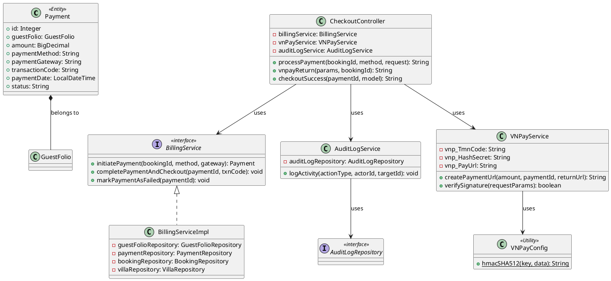
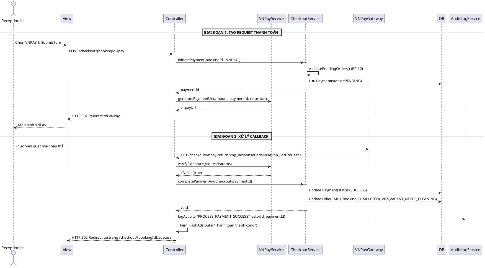
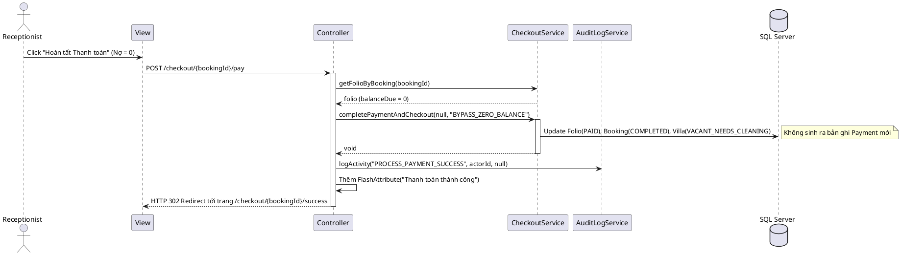
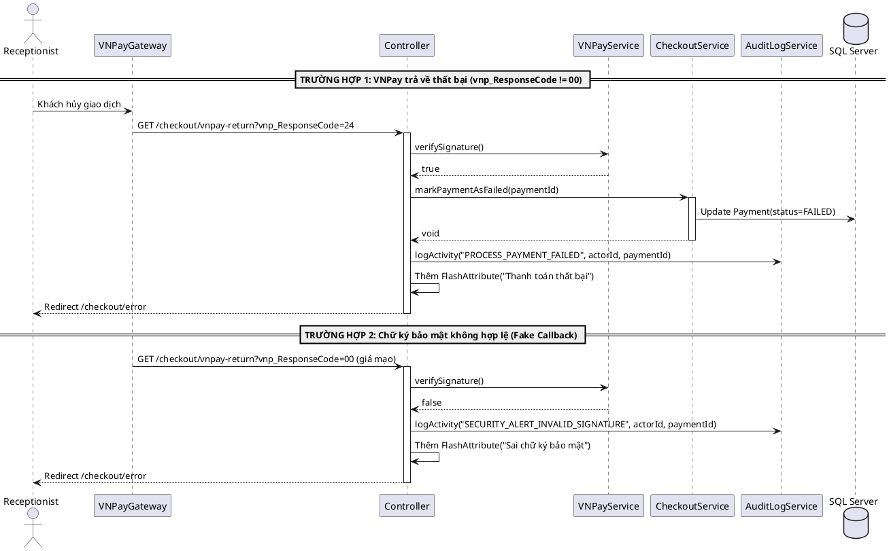
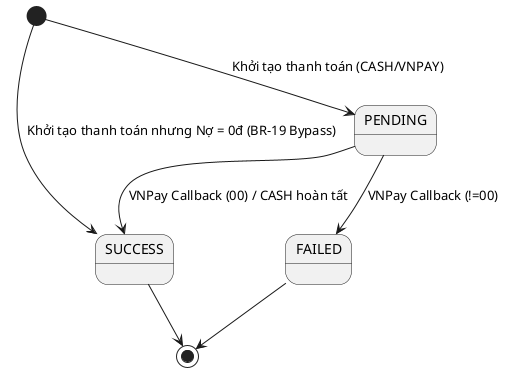

# ENGINEERING DOCUMENTATION STANDARD (EDS) v2.0

# Quy chuẩn Tài liệu Kỹ thuật và Đặc tả Hiện thực hóa

| Field                    | Value                     |
| ------------------------ | ------------------------- |
| **Document ID**    | `AURA-BILLING-IMP-022`  |
| **Version**        | 1.3                       |
| **Date**           | `2026-06-09`            |
| **Status**         | In review               |
| **Document Owner** | Phùng Giang Hải         |
| **Author**         | Phùng Giang Hải         |
| **Reviewed by**    | Phùng Giang Hải         |
| **DPO Sign-off**   | `[ ] Pending`           |
| **Approved by**    | `[Principal Architect]` |
| **Last Review**    | `2026-06-14`            |
| **Based on EDS**   | v2.0                      |

# CHANGELOG

> **Policy 4.4 — Immutable History:** Không bao giờ xóa thông tin cũ. Mọi thay đổi phải ghi vào bảng này.

| Ngày      | Người thực hiện | Nội dung thay đổi                                                                      |
| ---------- | ------------------- | ----------------------------------------------------------------------------------------- |
| 2026-06-08 | AI Assistant        | Tạo tài liệu lần đầu cho UC22 - Process Final Payment                               |
| 2026-06-09 | AI Assistant        | Refactor sang kiến trúc Spring Boot MVC (Controller trả về View)                      |
| 2026-06-09 | AI Assistant        | Cập nhật cấu trúc Entity Payment ở phần 5.2 để khớp với mã nguồn thực tế    |
| 2026-06-09 | AI Assistant        | Thiết kế lại luồng thanh toán VNPay thành quy trình 2 bước (Redirect & Callback) |
| 2026-06-14 | AI Assistant        | Bổ sung AuditLog vào Class Diagram, Data Structure và Sequence Diagram (BR-15) |
| 2026-06-14 | AI Assistant        | Bổ sung AuditLogRepository và AuditLogServiceImpl vào Class Diagram chuẩn kiến trúc |
| 2026-06-14 | AI Assistant        | Đơn giản hóa AuditLogService thành Concrete Class để đồng bộ thiết kế với UC21 |
| 2026-06-14 | AI Assistant        | Chuyển trách nhiệm gọi AuditLogService lên Controller để tránh lặp log (Phương án 1) |
| 2026-06-14 | AI Assistant        | Cập nhật Pseudo-code Section 9.2 để minh bạch vị trí hàm ghi Log trong Controller |
| 2026-06-14 | AI Assistant        | Bổ sung ghi log INITIATE_PAYMENT ở cả chiều đi VNPay theo yêu cầu Tech Lead |
| 2026-06-14 | AI Assistant        | Bổ sung Sequence Diagram (Error Path) và State Machine Diagram vào Mục 6 theo chuẩn EDS |
| 2026-06-14 | AI Assistant        | Bổ sung BR-19 Zero Balance Bypass (Nợ 0 đồng) vào Matrix, State Machine và Pseudo-code |
| 2026-06-14 | AI Assistant        | Xóa Error Code mâu thuẫn, cập nhật Test Summary và Verification Sample cho BR-19 để đồng bộ nội bộ file |
| 2026-06-14 | AI Assistant        | Bổ sung Sequence Diagram cho luồng Zero Balance Bypass (BR-19) vào Mục 6.2 |
| 2026-06-14 | AI Assistant        | Cập nhật Deployment Checklist và Implementation Steps (Mục 11) cho BR-19 để hoàn tất rà soát toàn bộ file |
| 2026-06-14 | AI Assistant        | Sửa đổi Bảng mã lỗi (Mục 10) về đúng chuẩn 5 cột của EDS_TEMPLATE_V2.0 |

# MỤC LỤC

1. Tổng quan Module
2. Ma trận Truy vết (Traceability Matrix)
3. Architecture Decision Records (ADR)
4. Non-Functional Requirements & SLA
5. Static Modeling (Mô hình Tĩnh)
6. Dynamic Modeling (Mô hình Động)
7. Domain Event Catalog
8. Interface Specification (Đặc tả Giao diện)
9. Web MVC Specification (Đặc tả MVC)
10. Bảng mã lỗi (Error Codes)
11. Quy trình Triển khai (Step-by-Step)
12. Rollback & Incident Runbook
13. Kịch bản Kiểm thử Chi tiết
14. Phương pháp Xác minh
15. Mẫu thử thực tế (MVC Verification Samples)
16. Bảng tổng hợp phân quyền (Authorization Matrix)

# 1. Tổng quan Module

> Xử lý thanh toán cuối cùng và Check-out. Hệ thống phân chia 2 luồng: Tiền mặt (Xử lý đồng bộ) và Cổng thanh toán VNPay (Xử lý bất đồng bộ qua Callback).

| Field                           | Value                                                     |
| ------------------------------- | --------------------------------------------------------- |
| **Module Name**           | `Module 5: Consolidated Billing & Statistical Analysis` |
| **Bounded Context**       | `Billing / Checkout`                                    |
| **Data Classification**   | `Internal / Confidential`                               |
| **Compliance Scope**      | `N/A`                                                   |
| **Upstream Dependencies** | `Booking Module, Spa Module, F&B Module`                |
| **Downstream Consumers**  | `Analytics Module`                                      |

# 2. Ma trận Truy vết (Traceability Matrix)

| Requirement ID | Loại (BR/ADR/US) | Mô tả yêu cầu                                                              | Thành phần Code                           | Compliance Target | ADR liên quan |
| -------------- | ----------------- | ------------------------------------------------------------------------------ | ------------------------------------------- | ----------------- | -------------- |
| BR-12          | Business Rule     | Checkout Constraint (Không thể check-out nếu còn order Spa/F&B đang chờ) | `CheckoutService.validatePendingOrders()` | —                | —             |
| BR-15          | Business Rule     | Audit Trail (Ghi log các hoạt động giao dịch)                             | `AuditLogRepository`                      | —                | —             |
| BR-19          | Business Rule     | Zero Balance Bypass (Nợ 0 đồng thì tự động hoàn tất checkout)             | `CheckoutController.processPayment()`     | —                | —             |
| UC22           | User Story        | Xử lý thanh toán cuối cùng và check-out                                  | `CheckoutController.processPayment()`     | —                | ADR-001        |

# 3. Architecture Decision Records (ADR)

## ADR-001 — Phương thức tích hợp cổng thanh toán (Payment Gateway Integration)

| Field              | Value                   |
| ------------------ | ----------------------- |
| **Status**   | Accepted                |
| **Deciders** | AI Assistant, Team Lead |
| **Date**     | 2026-06-09              |

**Bối cảnh (Context)**

> Tích hợp thanh toán qua VNPay. Luồng thanh toán của VNPay yêu cầu redirect người dùng sang trang của họ, sau đó gọi lại hệ thống thông qua Return URL (Callback).

**Các phương án đã xem xét (Options Considered)**

| Phương án | Mô tả                                                          | Ưu điểm                                                                                            | Nhược điểm                                                                              |
| ------------ | ---------------------------------------------------------------- | ----------------------------------------------------------------------------------------------------- | ------------------------------------------------------------------------------------------- |
| A            | Sinh URL nhưng xử lý chốt đơn ngay (Synchronous giả cầy) | + Nhanh, dễ code                                                                                     | - Rủi ro mất tiền: Khách chưa trả tiền trên VNPay nhưng hệ thống đã Check-out. |
| B            | MVC Redirect + 2-Step Asynchronous Callback                      | + Chặt chẽ, chuẩn xác bảo mật, chỉ Check-out khi VNPay xác nhận `vnp_ResponseCode == "00"` | - Phải code thêm endpoint xử lý Return URL, Verify Chữ ký.                            |

**Quyết định (Decision)**

> Chọn **Phương án B**. Phân tách Endpoint khởi tạo URL và Endpoint nhận Callback riêng biệt. Trạng thái các thực thể (GuestFolio, Booking, Villa) chỉ được cập nhật khi thanh toán thực sự thành công.

# 4. Non-Functional Requirements & SLA

## 4.1. Performance & Availability

| Category | Requirement                       | Target SLA | Measurement Method | Compliance Basis |
| -------- | --------------------------------- | ---------- | ------------------ | ---------------- |
| Latency  | Thanh toán VNPay (Giai đoạn 1) | `< 2s`   | Manual Test        | N/A              |
| Latency  | Xử lý Callback (Giai đoạn 2)  | `< 1s`   | Postman            | N/A              |

## 4.2. Data Integrity & Retention

| Category    | Requirement                    | Target | Verification Method   | Compliance Basis |
| ----------- | ------------------------------ | ------ | --------------------- | ---------------- |
| Consistency | Invoice & Payment sync         | 100%   | Database Transaction  | ACID Properties  |
| Constraint  | Chặn check-out pending orders | 100%   | Unit/Integration Test | BR-12            |

## 4.3. Security

| Category     | Requirement           | Target            | Verification Method | Compliance Basis                      |
| ------------ | --------------------- | ----------------- | ------------------- | ------------------------------------- |
| Integrity    | Hash Verification     | 100%              | Code Review         | VNPay Security Standard (HMAC-SHA512) |
| Secret Mgmt  | API Key Protection    | No keys in Git    | Code Review         | OWASP Secret Management               |
| Availability | Reverse Proxy Support | `X-Forwarded-*` | Integration Test    | Deployment Standards                  |

## 4.4. Scalability & Capacity Planning

> Hệ thống thanh toán chỉ xử lý một lượng nhỏ giao dịch mỗi ngày (tương ứng với số lượng Booking check-out). Không yêu cầu scale đặc biệt, sử dụng RDBMS Transaction cục bộ.

# 5. Static Modeling (Mô hình Tĩnh)

## 5.1. Class Diagram (PlantUML)



## 5.2. Data Structure (Java JPA Entity)

```java
// === BILLING ENTITY (Java JPA) ===

@Entity
@Table(name = "PAYMENT")
@Data
@NoArgsConstructor
@AllArgsConstructor
@Builder
public class Payment {

    @Id
    @GeneratedValue(strategy = GenerationType.IDENTITY)
    @Column(name = "payment_id")
    private Integer id;

    @ManyToOne(fetch = FetchType.LAZY)
    @JoinColumn(name = "folio_id")
    private GuestFolio guestFolio;

    @Column(name = "amount")
    private BigDecimal amount;

    @Column(name = "payment_method", length = 10)
    private String paymentMethod; // e.g., 'VNPAY', 'CASH'

    @Column(name = "payment_gateway", length = 10)
    private String paymentGateway; 

    @Column(name = "transaction_code", length = 100)
    private String transactionCode; // vnp_TransactionNo

    @Column(name = "payment_date")
    private LocalDateTime paymentDate;

    @Column(name = "status", length = 10)
    private String status; // 'PENDING', 'SUCCESS', 'FAILED'
}

// === AUDIT LOG ENTITY (BR-15) ===

@Entity
@Table(name = "AUDIT_LOG")
@Data
@NoArgsConstructor
@AllArgsConstructor
@Builder
public class AuditLog {
    @Id
    @GeneratedValue(strategy = GenerationType.IDENTITY)
    @Column(name = "log_id")
    private Integer id;

    @Column(name = "action_type", length = 50, nullable = false)
    private String actionType; // e.g. 'PROCESS_PAYMENT_SUCCESS'

    @Column(name = "actor_id", nullable = false)
    private Integer actorId; // Receptionist User ID

    @Column(name = "target_id")
    private Integer targetId; // Payment ID

    @Column(name = "details", columnDefinition = "NVARCHAR(MAX)")
    private String details;

    @Column(name = "timestamp")
    private LocalDateTime timestamp;
}
```

# 6. Dynamic Modeling (Mô hình Động)

## 6.1. Sequence Diagram — VNPay Asynchronous Flow (PlantUML)



## 6.2. Sequence Diagram — Zero Balance Bypass (BR-19 Happy Path)



## 6.3. Sequence Diagram — Error Path (VNPay Failed / Invalid Signature)



## 6.4. State Machine Diagram (Payment Status)



# 7. Domain Event Catalog

N/A — UC22 là luồng MVC đồng bộ (POST → redirect). Tuy nhiên, hành động `completePaymentAndCheckout()` cập nhật 4 entity (Payment, Folio, Booking, Villa) trong cùng một `@Transactional`. Không sử dụng message queue hay async events.

# 8. Interface Specification (Đặc tả Giao diện)

## 8.1. Service Interface

```java
public interface ICheckoutService {
    /**
     * Khởi tạo giao dịch (Giai đoạn 1)
     * @throws PendingOrdersExistException nếu vi phạm BR-12
     * @return Payment ID vừa được tạo với trạng thái PENDING
     */
    Integer initiatePayment(Integer bookingId, String paymentMethod, String paymentGateway);

    /**
     * Chốt giao dịch và hoàn tất Check-out (Giai đoạn 2)
     * Hàm này được @Transactional bảo vệ.
     */
    void completePaymentAndCheckout(Integer paymentId, String transactionCode);
  
    /**
     * Đánh dấu giao dịch thất bại
     */
    void markPaymentAsFailed(Integer paymentId);
}

public interface IVNPayService {
    /**
     * Tạo URL thanh toán VNPay bằng cách ghép tối thiểu 12 tham số bắt buộc (vnp_Version, vnp_Command, vnp_TmnCode, vnp_Amount...)
     * sau đó sắp xếp theo Alphabet và mã hóa HMAC-SHA512 để sinh ra vnp_SecureHash.
     */
    String createPaymentUrl(BigDecimal amount, Integer paymentId, String returnUrl);
  
    /**
     * Tách vnp_SecureHash từ request, tái mã hóa HMAC-SHA512 các tham số còn lại và so sánh.
     */
    boolean verifySignature(Map<String, String> requestParams);
}

public class VNPayConfig {
    // Chứa hàm hmacSHA512(String key, String data) và các util như hashAllFields(Map fields)
}
```

# 9. Web MVC Specification (Đặc tả MVC)

## 9.1. Endpoints Table

| Method | Path                         | Return Type           | Chức năng                                                          |
| ------ | ---------------------------- | --------------------- | -------------------------------------------------------------------- |
| POST   | `/checkout/:bookingId/pay` | `String` (Redirect) | Kiểm tra BR-12, sinh URL VNPay hoặc chốt luôn nếu CASH          |
| GET    | `/checkout/vnpay-return`   | `String` (Redirect) | Nhận Callback từ VNPay, chốt DB và Redirect hiển thị kết quả |

## 9.2. Data Transfer (Model & Forms)

**Submit Form (Giai đoạn 1):**

```java
@PostMapping("/{bookingId}/pay")
public String processPayment(@PathVariable Integer bookingId, @RequestParam(required=false) String paymentMethod, HttpServletRequest request) {
    // 1. Kiểm tra Bypass (BR-19)
    GuestFolio folio = checkoutService.getFolioByBooking(bookingId);
    if (folio.getBalanceDue().compareTo(BigDecimal.ZERO) == 0) {
        checkoutService.completePaymentAndCheckout(null, "BYPASS_ZERO_BALANCE");
        auditLogService.logActivity("PROCESS_PAYMENT_SUCCESS", 1, null);
        return "redirect:/checkout/" + bookingId + "/success";
    }

    // 2. Khởi tạo thanh toán bình thường
    Integer paymentId = checkoutService.initiatePayment(bookingId, paymentMethod, paymentMethod); // e.g. "VNPAY"
  
    if ("CASH".equals(paymentMethod)) {
        checkoutService.completePaymentAndCheckout(paymentId, null);
        auditLogService.logActivity("PROCESS_PAYMENT_SUCCESS", 1, paymentId); // Lễ tân (ID=1)
        return "redirect:/checkout/" + bookingId + "/success";
    } else if ("VNPAY".equals(paymentMethod)) {
        // Hỗ trợ Reverse Proxy (Ngrok / Nginx)
        String scheme = request.getHeader("X-Forwarded-Proto") != null ? request.getHeader("X-Forwarded-Proto") : request.getScheme();
        String host = request.getHeader("X-Forwarded-Host") != null ? request.getHeader("X-Forwarded-Host") : request.getServerName();
        String port = "";
        if (request.getHeader("X-Forwarded-Host") == null && request.getServerPort() != 80 && request.getServerPort() != 443) {
            port = ":" + request.getServerPort();
        }
        String baseUrl = scheme + "://" + host + port;
        String returnUrl = baseUrl + "/checkout/vnpay-return";
        String vnpayUrl = vnpayService.createPaymentUrl(amount, paymentId, returnUrl);
        auditLogService.logActivity("INITIATE_PAYMENT", 1, paymentId); // Log lúc khởi tạo đẩy sang VNPay
        return "redirect:" + vnpayUrl;
    }
    return "redirect:/checkout/" + bookingId;
}
```

**Callback (Giai đoạn 2):**

```java
@GetMapping("/vnpay-return")
public String vnpayReturn(@RequestParam Map<String, String> params, RedirectAttributes redirectAttributes) {
    if (vnpayService.verifySignature(params)) {
        Integer paymentId = Integer.parseInt(params.get("vnp_TxnRef"));
        if ("00".equals(params.get("vnp_ResponseCode"))) {
            checkoutService.completePaymentAndCheckout(paymentId, params.get("vnp_TransactionNo"));
            auditLogService.logActivity("PROCESS_PAYMENT_SUCCESS", 1, paymentId); // Ghi log sự kiện thanh toán
            redirectAttributes.addFlashAttribute("successMessage", "Thanh toán VNPay thành công!");
            return "redirect:/checkout/success"; // Route về trang thành công
        } else {
            checkoutService.markPaymentAsFailed(paymentId);
            auditLogService.logActivity("PROCESS_PAYMENT_FAILED", 1, paymentId); // Log thất bại
            redirectAttributes.addFlashAttribute("errorMessage", "Thanh toán VNPay thất bại hoặc bị hủy.");
        }
    } else {
        // Fix: Cần lấy paymentId từ params nếu có, giả định vnp_TxnRef luôn có
        Integer pId = params.containsKey("vnp_TxnRef") ? Integer.parseInt(params.get("vnp_TxnRef")) : null;
        auditLogService.logActivity("SECURITY_ALERT_INVALID_SIGNATURE", 1, pId); // Log cảnh báo bảo mật
        redirectAttributes.addFlashAttribute("errorMessage", "Sai chữ ký bảo mật VNPay.");
    }
    return "redirect:/checkout/error";
}
```

# 10. Bảng mã lỗi (Error Codes)

> Tiền tố mã lỗi hệ thống Billing (Payment) sử dụng: `BIL-`. Dù UI trả về dạng HTML, các HTTP Status code và logic xử lý vẫn tuân thủ bảng sau để phục vụ logging và trace.

| Code | HTTP Status | Message (EN) | Message (VI) | Trigger Condition |
| --- | --- | --- | --- | --- |
| `BIL-003` | 409 | Pending orders exist | Khách không thể check-out vì còn đơn Spa/F&B đang chờ xử lý | Bị chặn ở Giai đoạn 1 (BR-12).<br/>• **Exception:** `PendingOrdersExistException`<br/>• **Flash Key:** `errorMessage` |
| `BIL-004` | 400 | Payment failed | Thanh toán VNPay thất bại hoặc khách hàng hủy giao dịch | Giai đoạn 2: `vnp_ResponseCode != 00`<br/>• **Flash Key:** `errorMessage` |
| `BIL-005` | 403 | Invalid signature | Chữ ký bảo mật VNPay không hợp lệ. Giao dịch bị từ chối | Giai đoạn 2: `verifySignature == false`<br/>• **Flash Key:** `errorMessage` |

> **Ghi chú xử lý MVC:** Khi các mã lỗi trên xảy ra, `CheckoutController` sẽ redirect người dùng kèm `FlashAttribute("errorMessage")` để hiển thị trên UI. Log hệ thống bắt buộc phải ghi nhận đầy đủ mã `Code` tương ứng.

# 11. Quy trình Triển khai (Step-by-Step)

## 11.1. Prerequisites

- [X] UC21 (Consolidated Invoice) đã hoàn thành và chạy ổn định
- [X] Tài khoản VNPay Sandbox đã đăng ký (`vnp_TmnCode`, `vnp_HashSecret`)
- [X] Ngrok đã cài đặt để test VNPay callback trên local
- [X] File `application-secret.properties` đã được tạo với mã VNPay

## 11.2. Pre-deployment Checklist

- [X] `application-secret.properties` đã nằm trong `.gitignore`
- [X] VNPay Return URL đã được khai báo trên VNPay Merchant Dashboard

## 11.3. Implementation Steps

### Chặng 1 — VNPay Configuration

1. Tạo `VNPayConfig.java` chứa hàm `hmacSHA512(key, data)`.
2. Tạo `VNPayService.java` chứa `createPaymentUrl()` và `verifySignature()`.
3. Cấu hình `application.properties`:

```properties
spring.config.import=optional:classpath:application-secret.properties
vnp_TmnCode=${vnp_TmnCode_Secret}
vnp_HashSecret=${vnp_HashSecret_Secret}
vnp_PayUrl=https://sandbox.vnpayment.vn/paymentv2/vpcpay.html
```

### Chặng 2 — Service Layer (2 bước thanh toán)

1. `BillingServiceImpl.initiatePayment()` — Tạo Payment PENDING + validate BR-12
2. `BillingServiceImpl.completePaymentAndCheckout()` — Cập nhật Payment → Folio → Booking → Villa (trong `@Transactional`)
3. `BillingServiceImpl.markPaymentAsFailed()` — Đánh dấu thất bại

### Chặng 3 — Controller Layer

1. `POST /billing/checkout/{bookingId}/pay` — Phân luồng BYPASS 0 ĐỒNG (BR-19) vs CASH vs VNPAY
2. `GET /billing/checkout/vnpay-return` — Xử lý callback từ VNPay

### Chặng 4 — UI Integration

1. Bổ sung Flash Messages (success/error alerts) vào `checkout.html`
2. Chuyển khối thanh toán thành `<form>` POST với radio buttons CASH/VNPAY

## 11.4. Deployment Checklist

- [X] CASH: Click thanh toán → redirect thành công
- [X] VNPAY: Click → redirect sang VNPay → quét QR → callback thành công
- [X] BYPASS (BR-19): Nợ 0 đồng → tự động redirect thành công
- [X] BR-12: Nếu có pending orders → flash error message
- [X] VNPay signature verification hoạt động

# 12. Rollback & Incident Runbook

## 12.1. Điều kiện kích hoạt Rollback

| Điều kiện                                          | Ngưỡng           | Người quyết định |
| ----------------------------------------------------- | ------------------ | --------------------- |
| Payment SUCCESS nhưng Booking/Villa chưa cập nhật | Bất kỳ case nào | Tech Lead             |
| VNPay callback trả sai paymentId                     | Bất kỳ case nào | Tech Lead             |
| Secret key bị lộ trên Git                          | Ngay lập tức     | Toàn team            |

## 12.2. Rollback Procedure

```bash
# Bước 1: Revert code
git checkout -- auramoon/src/main/java/com/AuraMoon/auramoon/billing/

# Bước 2: Kiểm tra Payment records bất thường
SELECT payment_id, status, transaction_code
FROM PAYMENT WHERE status = 'PENDING' AND payment_date < DATEADD(HOUR, -1, GETDATE());
-- Nếu có PENDING > 1 giờ → đánh dấu FAILED thủ công

# Bước 3: Nếu secret bị lộ → Đổi mã VNPay ngay trên Dashboard
```

# 13. Kịch bản Kiểm thử Chi tiết

> Chi tiết đầy đủ tại `UC22_TDD_Process_Final_Payment.md`. Tóm tắt:

| TC ID      | Tên                                       | Mức độ | Kết quả mong đợi                      |
| ---------- | ------------------------------------------ | --------- | ----------------------------------------- |
| BIL-TC-001 | Thanh toán CASH thành công              | HIGH      | Redirect → success, Booking = COMPLETED  |
| BIL-TC-002 | Chặn checkout nếu pending orders (BR-12) | CRITICAL  | Flash error message, không thay đổi DB |
| BIL-TC-003 | Sinh URL VNPay & Redirect                  | HIGH      | Redirect tới `sandbox.vnpayment.vn`    |
| BIL-TC-004 | VNPay Callback thành công (00)           | CRITICAL  | Payment = SUCCESS, Booking = COMPLETED    |
| BIL-TC-005 | VNPay Callback thất bại (24)             | HIGH      | Payment = FAILED, Booking không đổi    |
| BIL-TC-006 | VNPay sai chữ ký                         | CRITICAL  | Flash error, Payment không đổi         |
| BIL-TC-007 | Bypass Thanh toán Nợ 0 đồng (BR-19)      | CRITICAL  | Bypass payment, Booking = COMPLETED    |

# 14. Phương pháp Xác minh

## 14.1. Database Inspection

```sql
-- Verify Payment đã chuyển sang SUCCESS sau thanh toán
SELECT payment_id, amount, payment_method, transaction_code, status
FROM PAYMENT WHERE folio_id = 1 ORDER BY payment_date DESC;

-- Verify Booking đã COMPLETED
SELECT booking_id, booking_status, payment_status
FROM BOOKING WHERE booking_id = 1;

-- Verify Villa đã đổi trạng thái
SELECT villa_id, villa_status, cleaning_status
FROM VILLA WHERE villa_id = (SELECT assigned_villa_id FROM BOOKING WHERE booking_id = 1);

-- Verify Folio đã PAID
SELECT folio_id, status FROM GUEST_FOLIO WHERE booking_id = 1;
```

## 14.2. VNPay Signature Verification

```bash
# Kiểm tra trong log server sau khi VNPay callback:
# Expected: verifySignature() trả về true
# Check return params chứa vnp_ResponseCode=00
```

# 15. Mẫu thử thực tế (MVC Verification Samples)

## 15.1. CASH Payment — Happy Path

```
Bước 1: Mở http://localhost:8080/billing/checkout?bookingId=1
Bước 2: Chọn radio "Tiền mặt" → Click "Hoàn tất Thanh toán"
Bước 3: Form submit POST /billing/checkout/1/pay?paymentMethod=CASH
Bước 4: Redirect → /billing/checkout/success?paymentId={id}
Bước 5: Trang hiển thị "Thanh toán thành công. Check-out hoàn tất!"
```

## 15.2. VNPay Payment — Happy Path (qua Ngrok)

```
Bước 1: Chạy Ngrok: ngrok http 8080
Bước 2: Mở https://xxxx.ngrok-free.app/billing/checkout?bookingId=1
Bước 3: Chọn radio "VNPay" → Click "Hoàn tất Thanh toán"
Bước 4: Redirect → https://sandbox.vnpayment.vn/paymentv2/...
Bước 5: Quét QR hoặc nhập thẻ test
Bước 6: VNPay callback → /billing/checkout/vnpay-return?vnp_ResponseCode=00
Bước 7: Redirect → /billing/checkout/success?paymentId={id}
```

## 15.3. Error Path — Pending Orders

```
Bước 1: Tạo FolioItem với status = 'PENDING' cho bookingId=1
Bước 2: Thử thanh toán → POST /billing/checkout/1/pay
Bước 3: Redirect quay lại checkout page
Bước 4: Flash message: "Không thể Check-out: Khách còn đơn hàng Spa/F&B đang thực hiện."
```

## 15.4. Bypass Payment — Zero Balance (BR-19)

```
Bước 1: Khởi tạo dữ liệu khách hàng có Balance Due = 0
Bước 2: Form submit POST /billing/checkout/1/pay (Không truyền paymentMethod)
Bước 3: Hệ thống bypass cổng thanh toán, Redirect → /billing/checkout/1/success
Bước 4: Trang hiển thị "Thanh toán thành công. Check-out hoàn tất!"
```

# 16. Bảng tổng hợp phân quyền (Authorization Matrix)

| Endpoint                               | GUEST | RECEPTIONIST | THERAPIST | CHEF | ADMIN |
| -------------------------------------- | ----- | ------------ | --------- | ---- | ----- |
| `GET /billing/checkout`              | ❌    | ✅           | ❌        | ❌   | ✅    |
| `POST /billing/checkout/{id}/pay`    | ❌    | ✅           | ❌        | ❌   | ✅    |
| `GET /billing/checkout/vnpay-return` | ❌    | ✅ (auto)    | ❌        | ❌   | ❌    |
| `GET /billing/checkout/success`      | ❌    | ✅           | ❌        | ❌   | ✅    |

**Chú thích:**

* ✅ = Được phép
* ❌ = Bị từ chối
* `auto` = Endpoint được VNPay gọi tự động, không cần người dùng truy cập trực tiếp

# PHỤ LỤC

## A. Glossary (Thuật ngữ)

| Thuật ngữ      | Định nghĩa                                                    |
| ---------------- | ---------------------------------------------------------------- |
| VNPay            | Cổng thanh toán trực tuyến phổ biến tại Việt Nam         |
| vnp_SecureHash   | Chữ ký HMAC-SHA512 đảm bảo tính toàn vẹn dữ liệu VNPay |
| vnp_TxnRef       | Mã giao dịch tham chiếu (= Payment ID trong hệ thống)       |
| vnp_ResponseCode | Mã kết quả giao dịch VNPay (00 = thành công)               |
| Ngrok            | Công cụ tạo tunnel để VNPay callback về localhost          |
| Flash Attribute  | Cơ chế Spring MVC truyền message qua redirect                 |
| Balance Due      | Số tiền còn lại cần thanh toán                             |

## B. Tài liệu tham chiếu

| Document               | Link / Path                                            |
| ---------------------- | ------------------------------------------------------ |
| SRS UC22               | `01_SRS/SRS_Document_SWP391_G6.md` — Section 3.1.12 |
| VNPay Integration Docs | `https://sandbox.vnpayment.vn/apis/`                 |
| VNPay Setup Guide      | `03_Implement/UC22/VNPay_Setup_Guide.md`             |
| Database Schema        | `Database/DB.sql` — Table: PAYMENT                  |
