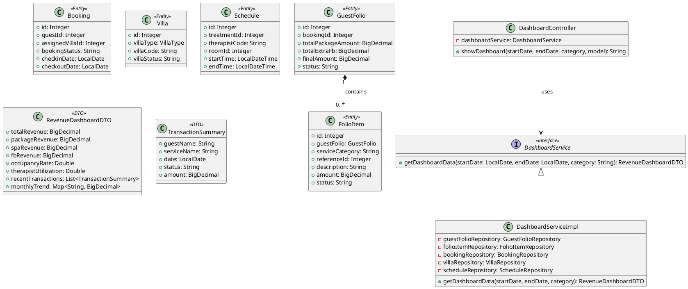
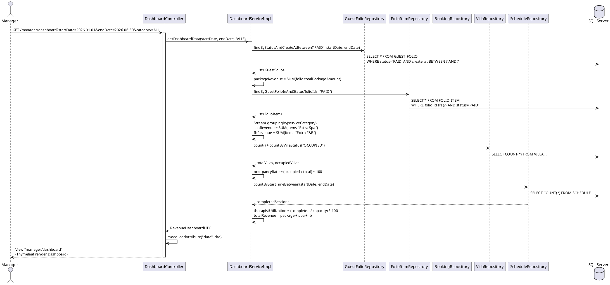
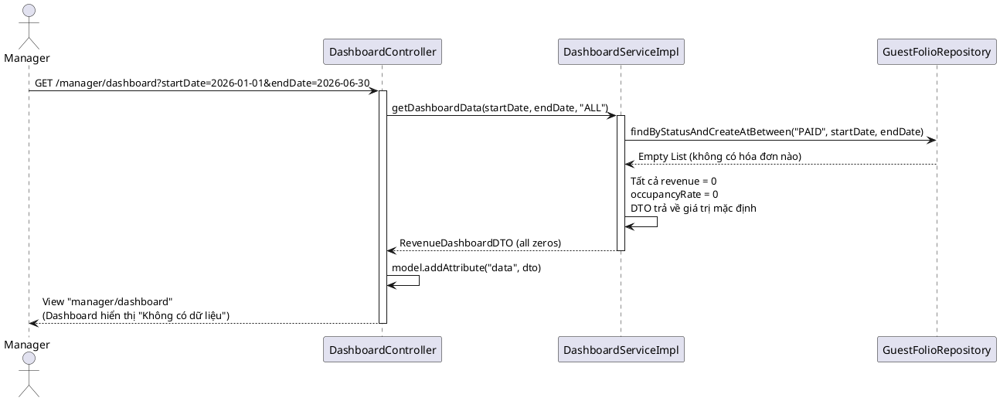

# ENGINEERING DOCUMENTATION STANDARD (EDS) v2.0

# Quy chuẩn Tài liệu Kỹ thuật và Đặc tả Hiện thực hóa

| Field                    | Value                                    |
| ------------------------ | ---------------------------------------- |
| **Document ID**    | `AURA-DASH-IMP-024`                    |
| **Version**        | 2.0                                      |
| **Date**           | `2026-06-14`                           |
| **Status**         | ✅ Approved                                     |
| **Document Owner** | Phùng Giang Hải                        |
| **Author**         | `Phùng Giang Hải- Backend Developer` |
| **Reviewed by**    | Phùng Giang Hải                        |
| **DPO Sign-off**   | `[ ] N/A — Module không xử lý PII` |
| **Approved by**    | `Principal Architect`                  |
| **Last Review**    | `2026-06-14`                           |
| **Based on EDS**   | v2.0                                     |

# CHANGELOG

> **Policy 4.4 — Immutable History:** Không bao giờ xóa thông tin cũ. Mọi thay đổi phải ghi vào bảng này.

| Ngày      | Người thực hiện | Nội dung thay đổi                                                            |
| ---------- | ------------------- | ------------------------------------------------------------------------------- |
| 2026-06-10 | Phùng Giang Hải        | Tạo tài liệu EDS lần đầu — UC24 Revenue Dashboard                        |
| 2026-06-13 | Phùng Giang Hải        | Viết lại hoàn chỉnh theo EDS v2.0 — bổ sung tất cả sections còn thiếu |
| 2026-06-14 | Phùng Giang Hải        | Chuẩn hóa Bảng mã lỗi (Mục 10) về định dạng 5 cột và bảo toàn dữ liệu MVC |

# MỤC LỤC

1. Tổng quan Module
2. Ma trận Truy vết (Traceability Matrix)
3. Architecture Decision Records (ADR)
4. Non-Functional Requirements & SLA
5. Static Modeling (Mô hình Tĩnh)
6. Dynamic Modeling (Mô hình Động)
7. Domain Event Catalog
8. Interface Specification (Đặc tả Giao diện)
9. Web MVC Specification (Đặc tả MVC)
10. Bảng mã lỗi (Error Codes)
11. Quy trình Triển khai (Step-by-Step)
12. Rollback & Incident Runbook
13. Kịch bản Kiểm thử Chi tiết
14. Phương pháp Xác minh
15. Mẫu thử thực tế (MVC Verification Samples)
16. Bảng tổng hợp phân quyền (Authorization Matrix)

# 1. Tổng quan Module

> Bảng điều khiển Doanh thu (Revenue Dashboard) cung cấp cái nhìn toàn cảnh về tình hình kinh doanh của khu nghỉ dưỡng cho Manager. Module tổng hợp dữ liệu từ các hóa đơn đã thanh toán (GUEST_FOLIO status = PAID) và FOLIO_ITEM để hiển thị doanh thu chia theo 3 mảng: Gói Retreat (Package), Spa bổ sung (Extra Spa), và F&B bổ sung (Extra F&B). Đồng thời hiển thị các chỉ số hiệu suất: Tỷ lệ lấp đầy phòng (Occupancy Rate) và Mức độ sử dụng Chuyên viên trị liệu (Therapist Utilization).

| Field                           | Value                                                                                                                    |
| ------------------------------- | ------------------------------------------------------------------------------------------------------------------------ |
| **Module Name**           | `Module 5: Revenue Analytics Dashboard (UC24)`                                                                         |
| **Bounded Context**       | `Reporting / Analytics`                                                                                                |
| **Data Classification**   | `Internal / Confidential`                                                                                              |
| **Compliance Scope**      | `N/A`                                                                                                                  |
| **Upstream Dependencies** | `Billing Module (GUEST_FOLIO, FOLIO_ITEM, PAYMENT), Booking Module (BOOKING, VILLA), Spa Module (SCHEDULE, THERAPIST)` |
| **Downstream Consumers**  | `UC25 (Export Report), Manager UI`                                                                                     |

# 2. Ma trận Truy vết (Traceability Matrix)

| Requirement ID | Loại (BR/ADR/US) | Mô tả yêu cầu                                                                            | Thành phần Code                           | Compliance Target                 | ADR liên quan |
| -------------- | ----------------- | -------------------------------------------------------------------------------------------- | ------------------------------------------- | --------------------------------- | -------------- |
| UC24           | User Story        | Manager muốn xem Revenue Dashboard chia theo Retreat, Spa, F&B                              | `DashboardController.showDashboard()`     | —                                | ADR-024        |
| BR-13          | Business Rule     | Chỉ lấy doanh thu từ các giao dịch đã hoàn tất (PAID/COMPLETED)                     | `DashboardServiceImpl.getDashboardData()` | Báo cáo tài chính chính xác | —             |
| SRS §3.1.13   | Functional Req    | Dashboard có Filter (Time period, Category), Donut Chart, Line/Bar Chart, Transaction Table | `dashboard.html` (Thymeleaf)              | UI/UX Spec                        | —             |
| PF-05          | Non-Functional    | Revenue dashboard loading ≤ 8 giây                                                         | `DashboardServiceImpl`                    | SRS §4.2.2                       | ADR-024        |

# 3. Architecture Decision Records (ADR)

## ADR-024 — Tách biệt DTO và chiến lược tổng hợp doanh thu

| Field              | Value                   |
| ------------------ | ----------------------- |
| **Status**   | Accepted                |
| **Deciders** | Phùng Giang Hải, Tech Lead |
| **Date**     | 2026-06-13              |

**Bối cảnh (Context)**

> Dashboard cần tổng hợp doanh thu từ nhiều bảng (GUEST_FOLIO, FOLIO_ITEM, BOOKING, VILLA, SCHEDULE). Câu hỏi đặt ra: (1) Tính doanh thu từ PAYMENT hay GUEST_FOLIO? (2) Nên dùng Native SQL aggregation hay Java Stream?

**Các phương án đã xem xét (Options Considered)**

| Phương án | Mô tả                                                | Ưu điểm                                                                                           | Nhược điểm                                                                              |
| ------------ | ------------------------------------------------------ | ---------------------------------------------------------------------------------------------------- | ------------------------------------------------------------------------------------------- |
| A            | Query doanh thu trực tiếp từ bảng `PAYMENT`      | + Phản ánh dòng tiền thực tế                                                                   | - Không phân biệt được nguồn doanh thu (Package vs Spa vs F&B)                       |
| B            | Dùng `GUEST_FOLIO` + `FOLIO_ITEM` để tổng hợp | + Phân tách rõ ràng doanh thu theo category. + Nhất quán với mô hình Charge-to-Room (AHLEI) | - Phụ thuộc vào dữ liệu FOLIO_ITEM đã được các module khác ghi nhận đầy đủ |

**Quyết định (Decision)**

> Chọn **Phương án B** — Sử dụng `GUEST_FOLIO` (status = PAID) để lấy doanh thu Package, và `FOLIO_ITEM` (group by `service_category`) để lấy doanh thu Extra Spa và Extra F&B. DTO `RevenueDashboardDTO` được tạo chuyên biệt chỉ chứa dữ liệu cần render, không expose Entity ra View.

**Hệ quả (Consequences)**

**Tích cực:**

* View (Thymeleaf) chỉ cần đọc dữ liệu chuẩn bị sẵn trong DTO, không chứa logic tính toán.
* Phân tách rõ ràng nguồn doanh thu: Package / Spa / F&B.
* Dễ mở rộng khi thêm category mới.

**Tiêu cực / Trade-offs:**

* Nếu Module Spa/F&B chưa ghi nhận vào FOLIO_ITEM, doanh thu sẽ thiếu. → Giảm thiểu bằng cách kiểm tra dữ liệu seed trong test.

# 4. Non-Functional Requirements & SLA

## 4.1. Performance & Availability

| Category     | Requirement                   | Target SLA     | Measurement Method             | Compliance Basis |
| ------------ | ----------------------------- | -------------- | ------------------------------ | ---------------- |
| Latency      | Dashboard load (p99)          | `< 8s`       | Manual test / Browser DevTools | PF-05 (SRS)      |
| Latency      | API response (avg)            | `< 2s`       | Manual test                    | PF-01 (SRS)      |
| Throughput   | Dashboard concurrent requests | `50 req/min` | —                             | PF-08 (SRS)      |
| Availability | Uptime (monthly)              | `99.5%`      | Monitoring                     | PF-17 (SRS)      |

## 4.2. Data Integrity & Retention

| Category    | Requirement                         | Target | Verification Method | Compliance Basis |
| ----------- | ----------------------------------- | ------ | ------------------- | ---------------- |
| Consistency | Revenue = SUM(Package) + SUM(Extra) | 100%   | SQL cross-check     | BR-13            |
| Consistency | Chỉ tính hóa đơn PAID          | 100%   | WHERE clause verify | BR-13            |

## 4.3. Security

| Category       | Requirement         | Target                          | Verification Method | Compliance Basis |
| -------------- | ------------------- | ------------------------------- | ------------------- | ---------------- |
| Access control | Role-based          | Manager / Admin Only            | Auth Matrix (§16)  | RBAC             |
| Data exposure  | Read-only dashboard | Không cho phép sửa dữ liệu | Code review         | —               |

## 4.4. Scalability & Capacity Planning

> Dự kiến tải: ~50 check-outs/ngày, mỗi folio trung bình 5 FolioItems. Dashboard được truy cập chủ yếu bởi 1-2 Manager, tần suất trung bình. Không cần scale đặc biệt trong giai đoạn hiện tại.

# 5. Static Modeling (Mô hình Tĩnh)

## 5.1. Class Diagram (PlantUML)



## 5.2. Data Structure (Java JPA Entity — Reuse)

```java
// === Reuse existing entities từ Billing Module ===
// GuestFolio, FolioItem, Payment — xem UC21_EDS §5.2

// === DASHBOARD DTO: RevenueDashboardDTO ===
@Data @Builder @NoArgsConstructor @AllArgsConstructor
public class RevenueDashboardDTO {
    private BigDecimal totalRevenue;      // = packageRevenue + spaRevenue + fbRevenue
    private BigDecimal packageRevenue;    // SUM(GUEST_FOLIO.total_package_amout) WHERE status = 'PAID'
    private BigDecimal spaRevenue;        // SUM(FOLIO_ITEM.amount) WHERE service_category = 'Extra Spa'
    private BigDecimal fbRevenue;         // SUM(FOLIO_ITEM.amount) WHERE service_category = 'Extra F&B'
    private Double occupancyRate;         // (Occupied Villas / Total Villas) * 100
    private Double therapistUtilization;  // (Completed Sessions / Total Capacity) * 100
    private List<TransactionSummary> recentTransactions; // Danh sách giao dịch gần nhất
    private Map<String, BigDecimal> monthlyTrend;        // Key: "2026-01", Value: revenue
}

// === DASHBOARD DTO: TransactionSummary ===
@Data @Builder @NoArgsConstructor @AllArgsConstructor
public class TransactionSummary {
    private String guestName;
    private String serviceName;     // "Retreat Package" / "Extra Spa" / "Extra F&B"
    private LocalDate date;
    private String status;          // "PAID"
    private BigDecimal amount;
}
```

# 6. Dynamic Modeling (Mô hình Động)

## 6.1. Sequence Diagram — Happy Path (PlantUML)



## 6.2. Sequence Diagram — Error Path (PlantUML)



## 6.3. State Machine

> N/A — UC24 là chức năng chỉ đọc (Read-only), không quản lý trạng thái. Dashboard hiển thị dữ liệu tổng hợp tĩnh theo filter.

# 7. Domain Event Catalog

N/A — UC24 là luồng MVC đồng bộ (đọc dữ liệu và render View). Không phát sinh Domain Event qua message queue.

# 8. Interface Specification (Đặc tả Giao diện)

## 8.1. Service Interface

```java
// DashboardService.java — @version 2.0
package com.AuraMoon.auramoon.dashboard.service;

import com.AuraMoon.auramoon.dashboard.dto.RevenueDashboardDTO;
import java.time.LocalDate;

public interface DashboardService {
    /**
     * Tổng hợp dữ liệu doanh thu và hiệu suất cho Manager Dashboard.
     * Chỉ tính các hóa đơn có trạng thái PAID (BR-13).
     * @param startDate Ngày bắt đầu khoảng lọc
     * @param endDate Ngày kết thúc khoảng lọc
     * @param category Loại dịch vụ lọc ("ALL" | "PACKAGE" | "SPA" | "FB")
     * @return RevenueDashboardDTO chứa revenue breakdown, occupancy, utilization, transactions
     */
    RevenueDashboardDTO getDashboardData(LocalDate startDate, LocalDate endDate, String category);
}
```

## 8.2. Repository Interface

```java
// GuestFolioRepository.java — Reuse từ UC21, bổ sung query cho Dashboard
@Repository
public interface GuestFolioRepository extends JpaRepository<GuestFolio, Integer> {
    Optional<GuestFolio> findByBookingId(Integer bookingId);
    List<GuestFolio> findByStatusAndCreateAtBetween(String status, LocalDateTime start, LocalDateTime end);
}

// FolioItemRepository.java — Reuse từ UC21
@Repository
public interface FolioItemRepository extends JpaRepository<FolioItem, Integer> {
    List<FolioItem> findByGuestFolioId(Integer folioId);
    List<FolioItem> findByGuestFolioIdInAndStatus(List<Integer> folioIds, String status);
}

// BookingRepository.java — Reuse
@Repository
public interface BookingRepository extends JpaRepository<Booking, Integer> {
    long countByBookingStatusAndCheckinDateBetween(String status, LocalDate start, LocalDate end);
}

// VillaRepository.java — Reuse
@Repository
public interface VillaRepository extends JpaRepository<Villa, Integer> {
    long countByVillaStatus(String status);
}
```

# 9. Web MVC Specification (Đặc tả MVC)

## 9.1. Endpoints Table

| Method | Path                                                       | Return Type       | Auth Level | Required Roles         | Chức năng                                      |
| ------ | ---------------------------------------------------------- | ----------------- | ---------- | ---------------------- | ------------------------------------------------ |
| GET    | `/manager/dashboard`                                     | `String` (View) | Session    | `MANAGER`, `ADMIN` | Hiển thị trang Revenue Dashboard               |
| GET    | `/manager/dashboard?startDate={}&endDate={}&category={}` | `String` (View) | Session    | `MANAGER`, `ADMIN` | Dashboard với bộ lọc thời gian và danh mục |

## 9.2. Data Transfer (Model & View)

```java
@Controller
@RequestMapping("/manager")
public class DashboardController {

    @Autowired
    private DashboardService dashboardService;

    @GetMapping("/dashboard")
    public String showDashboard(
            @RequestParam(required = false) @DateTimeFormat(iso = DateTimeFormat.ISO.DATE) LocalDate startDate,
            @RequestParam(required = false) @DateTimeFormat(iso = DateTimeFormat.ISO.DATE) LocalDate endDate,
            @RequestParam(defaultValue = "ALL") String category,
            Model model) {
        try {
            // Mặc định: Tháng hiện tại
            if (startDate == null) startDate = LocalDate.now().withDayOfMonth(1);
            if (endDate == null) endDate = LocalDate.now();

            RevenueDashboardDTO data = dashboardService.getDashboardData(startDate, endDate, category);
            model.addAttribute("data", data);
            model.addAttribute("startDate", startDate);
            model.addAttribute("endDate", endDate);
            model.addAttribute("category", category);
        } catch (Exception e) {
            model.addAttribute("error", e.getMessage());
        }
        model.addAttribute("pageTitle", "Bảng điều khiển Doanh thu");
        return "manager/dashboard";
    }
}
```

**Thymeleaf Binding:**

- Bộ lọc: `th:value="${startDate}"`, `th:value="${endDate}"`, `th:selected="${category == 'ALL'}"`
- Biểu đồ Donut: `th:attr="data-package=${data.packageRevenue}, data-spa=${data.spaRevenue}, data-fb=${data.fbRevenue}"`
- Biểu đồ Trend: `th:each="entry : ${data.monthlyTrend}"` → `th:text="${entry.key}"` (tháng) + `th:text="${entry.value}"` (doanh thu)
- KPI Cards: `th:text="${data.totalRevenue}"`, `th:text="${data.occupancyRate}"`, `th:text="${data.therapistUtilization}"`
- Bảng giao dịch: `th:each="tx : ${data.recentTransactions}"` → `th:text="${tx.guestName}"`, `th:text="${tx.amount}"`

# 10. Bảng mã lỗi (Error Codes)

| Code | HTTP Status | Message (EN) | Message (VI) | Trigger Condition |
| --- | --- | --- | --- | --- |
| `DASH-001` | 500 | Dashboard loading error | Đã xảy ra lỗi khi tải dữ liệu Dashboard. Vui lòng thử lại. | Lỗi tổng hợp doanh thu hoặc kết nối DB.<br/>• **Exception:** `Exception` (generic)<br/>• **Model Key:** `error` |
| `DASH-002` | 200 | No data available | Không có dữ liệu trong khoảng thời gian đã chọn | Không có GuestFolio nào với status PAID trong khoảng lọc.<br/>• **Exception:** `N/A` (empty data)<br/>• **Model Key:** `N/A` (Thymeleaf conditions handle empty list) |

> **Lưu ý:** UC24 là chức năng Read-only, không phát sinh lỗi nghiệp vụ nghiêm trọng. Trường hợp không có dữ liệu, dashboard hiển thị giá trị mặc định (0).

# 11. Quy trình Triển khai (Step-by-Step)

## 11.1. Prerequisites

- [X] Database đã có các bảng: `GUEST_FOLIO`, `FOLIO_ITEM`, `PAYMENT`, `BOOKING`, `VILLA`, `SCHEDULE`
- [X] Entities `GuestFolio`, `FolioItem`, `Payment`, `Booking`, `Villa`, `Schedule` đã mapping đúng với DB
- [X] Các module UC21 (Billing), UC22 (Payment) đã hoạt động — đảm bảo có dữ liệu PAID trong DB
- [X] Thư viện biểu đồ phía frontend (Chart.js hoặc tương đương) đã được thêm vào project

## 11.2. Implementation Steps

### Chặng 1 — DTO Layer

Tạo 2 DTO tại `dashboard/dto/`:

- `RevenueDashboardDTO`: Chứa tất cả dữ liệu Dashboard (revenue breakdown, KPIs, transactions, trend)
- `TransactionSummary`: Chứa thông tin mỗi giao dịch gần đây

### Chặng 2 — Repository Layer (Bổ sung query)

Bổ sung method vào các Repository đã có:

- `GuestFolioRepository`: `findByStatusAndCreateAtBetween(String status, LocalDateTime start, LocalDateTime end)`
- `FolioItemRepository`: `findByGuestFolioIdInAndStatus(List<Integer> folioIds, String status)`

### Chặng 3 — Service Layer

Tạo `DashboardService` interface và `DashboardServiceImpl`:

- Lấy danh sách GuestFolio (PAID, trong khoảng ngày)
- Tính `packageRevenue` = SUM(folio.totalPackageAmount)
- Lấy FolioItems → `Collectors.groupingBy(serviceCategory)` → tính `spaRevenue`, `fbRevenue`
- Tính `occupancyRate` từ Villa count
- Tính `therapistUtilization` từ Schedule count
- Build `monthlyTrend` Map
- Build `recentTransactions` List

### Chặng 4 — Controller Layer

Tạo `DashboardController` với `@GetMapping("/dashboard")`:

- Nhận params: `startDate`, `endDate`, `category`
- Bind `RevenueDashboardDTO` vào Model

### Chặng 5 — UI Layer (Thymeleaf + Chart.js)

Tạo `manager/dashboard.html` kế thừa layout chung:

- Filter bar: Date range picker + Category dropdown
- KPI cards: Total Revenue, Occupancy Rate, Therapist Utilization
- Donut Chart: Revenue breakdown (Package / Spa / F&B)
- Line/Bar Chart: Monthly revenue trend
- Data Table: Recent transactions (paginated)
- Export CSV button (link sang UC25)

## 11.3. Deployment Checklist

- [ ] Entities reuse đúng column name từ DB hiện tại
- [ ] Dashboard load thành công khi có và không có dữ liệu
- [ ] Biểu đồ render chính xác theo dữ liệu
- [ ] Chỉ Manager/Admin truy cập được
- [ ] Health check: Truy cập `/manager/dashboard` trả về 200 OK

# 12. Rollback & Incident Runbook

## 12.1. Đánh giá rủi ro

> UC24 là chức năng **chỉ đọc** (Read-only), không thay đổi dữ liệu trong DB. Do đó rủi ro rất thấp.

## 12.2. Rollback Procedure

```bash
# UC24 không thay đổi DB schema, chỉ cần revert code:
git checkout -- auramoon/src/main/java/com/AuraMoon/auramoon/dashboard/
git checkout -- auramoon/src/main/resources/templates/manager/
git checkout -- auramoon/src/main/resources/static/js/dashboard/
git checkout -- auramoon/src/main/resources/static/css/dashboard/
```

## 12.3. Notification Protocol

| Thời điểm                            | Người nhận | Kênh      | Template                                                      |
| --------------------------------------- | ------------- | ---------- | ------------------------------------------------------------- |
| Nếu Dashboard hiển thị sai số liệu | Tech Lead     | Chat nhóm | `⚠️ Dashboard revenue mismatch — verify FOLIO_ITEM data` |

# 13. Kịch bản Kiểm thử Chi tiết

> Chi tiết đầy đủ tại tài liệu `UC24_TDD_Dashboard.md`. Tóm tắt:

| TC ID       | Tên                                                  | Mức độ | Kết quả mong đợi                                                    |
| ----------- | ----------------------------------------------------- | --------- | ----------------------------------------------------------------------- |
| DASH-TC-001 | Tính tổng doanh thu chính xác từ hóa đơn PAID | HIGH      | DTO chứa đúng packageRevenue + spaRevenue + fbRevenue = totalRevenue |
| DASH-TC-002 | Lọc đúng khoảng thời gian (Date Range)           | HIGH      | Chỉ tính hóa đơn trong khoảng startDate-endDate                   |
| DASH-TC-003 | Loại bỏ hóa đơn UNPAID                           | CRITICAL  | totalRevenue = 0 khi chỉ có hóa đơn chưa thanh toán              |
| DASH-TC-004 | Không có dữ liệu → Dashboard trả về 0          | MEDIUM    | DTO trả về tất cả revenue = 0, rate = 0                             |
| DASH-TC-005 | Tính Occupancy Rate chính xác                      | MEDIUM    | (occupied / total) * 100 = giá trị chính xác                        |
| DASH-TC-006 | Unauthorized access (Delegated to Module 1)           | LOW       | Module 1 Global Filter/Interceptor handles redirect to login hoặc 403. Module 5 tests disabled. |

# 14. Phương pháp Xác minh

## 14.1. Database Inspection

```sql
-- Verify tổng doanh thu Package từ GuestFolio đã thanh toán
SELECT SUM(total_package_amout) AS package_revenue
FROM GUEST_FOLIO
WHERE status = 'PAID'
  AND create_at BETWEEN '2026-01-01' AND '2026-06-30';

-- Verify doanh thu theo category từ FolioItem
SELECT fi.service_category, SUM(fi.amount) AS category_revenue
FROM FOLIO_ITEM fi
JOIN GUEST_FOLIO gf ON fi.folio_id = gf.folio_id
WHERE gf.status = 'PAID'
  AND gf.create_at BETWEEN '2026-01-01' AND '2026-06-30'
GROUP BY fi.service_category;

-- Verify Occupancy Rate
SELECT
    (SELECT COUNT(*) FROM VILLA WHERE villa_status = 'OCCUPIED') AS occupied,
    (SELECT COUNT(*) FROM VILLA WHERE is_delete = 0) AS total;

-- Verify Monthly Trend
SELECT FORMAT(gf.create_at, 'yyyy-MM') AS month, SUM(gf.final_amount) AS revenue
FROM GUEST_FOLIO gf
WHERE gf.status = 'PAID'
GROUP BY FORMAT(gf.create_at, 'yyyy-MM')
ORDER BY month;
```

## 14.2. UI Verification

1. Truy cập `http://localhost:8080/manager/dashboard`
2. Kiểm tra KPI cards hiển thị: Total Revenue, Occupancy Rate, Therapist Utilization
3. Kiểm tra Donut Chart chia đúng 3 phần: Package, Spa, F&B
4. Thay đổi bộ lọc Date Range → Dashboard reload đúng dữ liệu
5. Kiểm tra bảng Recent Transactions hiển thị đúng danh sách

# 15. Mẫu thử thực tế (MVC Verification Samples)

## 15.1. Happy Path

```
Bước 1: Truy cập URL (mặc định tháng hiện tại)
  GET http://localhost:8080/manager/dashboard

Bước 2: Kết quả mong đợi
  - HTTP 200 OK
  - Trang HTML hiển thị với tiêu đề "Bảng điều khiển Doanh thu"
  - KPI cards: Total Revenue = tổng các hóa đơn PAID
  - Donut Chart: Chia 3 phần (Package / Spa / F&B)
  - Line Chart: Trend theo tháng
  - Data Table: Danh sách giao dịch gần nhất
```

## 15.2. Happy Path with Filters

```
Bước 1: Truy cập URL với bộ lọc
  GET http://localhost:8080/manager/dashboard?startDate=2026-01-01&endDate=2026-03-31&category=SPA

Bước 2: Kết quả mong đợi
  - HTTP 200 OK
  - Chỉ hiển thị doanh thu Q1/2026
  - Chỉ hiển thị doanh thu Spa (nếu category = SPA)
```

## 15.3. Empty Data Path

```
Bước 1: Truy cập URL với khoảng thời gian không có dữ liệu
  GET http://localhost:8080/manager/dashboard?startDate=2020-01-01&endDate=2020-12-31

Bước 2: Kết quả mong đợi
  - HTTP 200 OK
  - KPI cards: Tất cả = 0
  - Chart: Hiển thị "Không có dữ liệu"
  - Table: Trống
```

# 16. Bảng tổng hợp phân quyền (Authorization Matrix)

| Endpoint                   | GUEST | RECEPTIONIST | THERAPIST | CHEF | MANAGER | ADMIN  |
| -------------------------- | ----- | ------------ | --------- | ---- | ------- | ------ |
| `GET /manager/dashboard` | ❌    | ❌           | ❌        | ❌   | ✅ All  | ✅ All |

**Chú thích:**

* ✅ = Được phép
* ❌ = Bị từ chối (Redirect sang trang login hoặc 403)
* **Lưu ý:** Việc kiểm tra phân quyền (Authorization) được ủy quyền (delegated) và xử lý tập trung bởi **Global Filter/Interceptor của Module 1**. UC24 không thực hiện kiểm tra quyền trực tiếp tại Controller.

# PHỤ LỤC

## A. Glossary (Thuật ngữ)

| Thuật ngữ           | Định nghĩa                                                                                             |
| --------------------- | --------------------------------------------------------------------------------------------------------- |
| Revenue Dashboard     | Bảng điều khiển tổng hợp doanh thu từ nhiều nguồn dịch vụ                                      |
| Occupancy Rate        | Tỷ lệ lấp đầy phòng = (Số Villa đang có khách / Tổng số Villa) × 100%                        |
| Therapist Utilization | Mức độ sử dụng chuyên viên trị liệu = (Số phiên đã hoàn thành / Tổng công suất) × 100% |
| Guest Folio           | Tài khoản nợ trung tâm của khách, gắn với 1 Booking                                               |
| Folio Item            | Một dòng chi phí phát sinh (Spa, F&B...) được ghi nợ vào Guest Folio                             |

## B. Tài liệu tham chiếu

| Document             | Link / Path                                                                               |
| -------------------- | ----------------------------------------------------------------------------------------- |
| SRS UC24             | `01_SRS/SRS_Document_SWP391_G6.md` — Section 2.6.1 & Section 3.1.13                    |
| SRS NFR Performance  | `01_SRS/SRS_Document_SWP391_G6.md` — Section 4.2.2 (PF-05, PF-08)                      |
| UC21 EDS (Billing)   | `03_Implement/UC21/UC21_EDS_Consolidated_Invoice.md`                                    |
| Database Schema      | `Database/DB.sql` — Tables: GUEST_FOLIO, FOLIO_ITEM, PAYMENT, BOOKING, VILLA, SCHEDULE |
| Retreat Requirements | `Document/Retreat.md` — Section 4, Module 5                                            |
