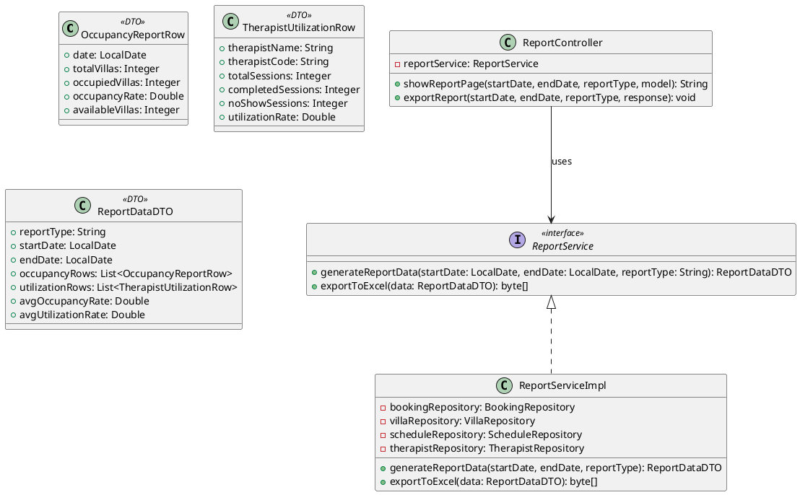
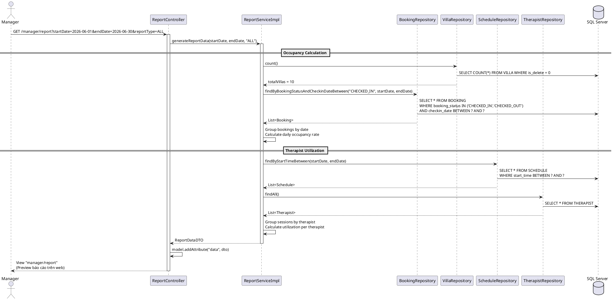
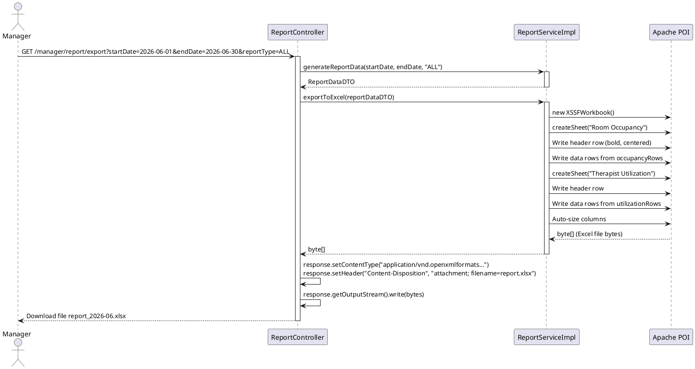

# ENGINEERING DOCUMENTATION STANDARD (EDS) v2.0

# Quy chuẩn Tài liệu Kỹ thuật và Đặc tả Hiện thực hóa

| Field                    | Value                                     |
| ------------------------ | ----------------------------------------- |
| **Document ID**    | `AURA-REPORT-IMP-025`                   |
| **Version**        | 1.0                                       |
| **Date**           | `2026-06-14`                            |
| **Status**         | ✅ Approved                                     |
| **Document Owner** | Phùng Giang Hải                         |
| **Author**         | `Phùng Giang Hải - Backend Developer` |
| **Reviewed by**    | Phùng Giang Hải                         |
| **DPO Sign-off**   | `[ ] N/A — Module không xử lý PII`  |
| **Approved by**    | `Principal Architect`                   |
| **Last Review**    | `2026-06-14`                            |
| **Based on EDS**   | v2.0                                      |

# CHANGELOG

> **Policy 4.4 — Immutable History:** Không bao giờ xóa thông tin cũ. Mọi thay đổi phải ghi vào bảng này.

| Ngày      | Người thực hiện | Nội dung thay đổi                                 |
| ---------- | ------------------- | ---------------------------------------------------- |
| 2026-06-13 | Sinh viên 5        | Tạo tài liệu EDS lần đầu — UC25 Export Report |
| 2026-06-14 | AI Assistant        | Chuẩn hóa Bảng mã lỗi (Mục 10) về chuẩn 5 cột, bảo toàn dữ liệu MVC |

# MỤC LỤC

1. Tổng quan Module
2. Ma trận Truy vết (Traceability Matrix)
3. Architecture Decision Records (ADR)
4. Non-Functional Requirements & SLA
5. Static Modeling (Mô hình Tĩnh)
6. Dynamic Modeling (Mô hình Động)
7. Domain Event Catalog
8. Interface Specification (Đặc tả Giao diện)
9. Web MVC Specification (Đặc tả MVC)
10. Bảng mã lỗi (Error Codes)
11. Quy trình Triển khai (Step-by-Step)
12. Rollback & Incident Runbook
13. Kịch bản Kiểm thử Chi tiết
14. Phương pháp Xác minh
15. Mẫu thử thực tế (MVC Verification Samples)
16. Bảng tổng hợp phân quyền (Authorization Matrix)

# 1. Tổng quan Module

> Chức năng Xuất Báo cáo (Export Report) cho phép Manager xuất dữ liệu báo cáo hiệu suất kinh doanh ra file Excel (.xlsx). Báo cáo bao gồm 2 loại chính: (1) Tỷ lệ Lấp đầy phòng (Room Occupancy) và (2) Mức độ sử dụng Chuyên viên trị liệu (Therapist Utilization). Hệ thống tổng hợp dữ liệu từ các bảng BOOKING, VILLA, SCHEDULE theo khoảng thời gian do Manager chọn, rồi render thành file Excel để tải về.

| Field                           | Value                                                                                                                  |
| ------------------------------- | ---------------------------------------------------------------------------------------------------------------------- |
| **Module Name**           | `Module 5: Performance Report Export (UC25)`                                                                         |
| **Bounded Context**       | `Reporting / Export`                                                                                                 |
| **Data Classification**   | `Internal / Confidential`                                                                                            |
| **Compliance Scope**      | `N/A`                                                                                                                |
| **Upstream Dependencies** | `UC24 (Dashboard — cung cấp data source logic), Booking Module (BOOKING, VILLA), Spa Module (SCHEDULE, THERAPIST)` |
| **Downstream Consumers**  | `Manager (file Excel tải về máy)`                                                                                 |

# 2. Ma trận Truy vết (Traceability Matrix)

| Requirement ID | Loại (BR/ADR/US) | Mô tả yêu cầu                                                                                         | Thành phần Code                          | Compliance Target                 | ADR liên quan |
| -------------- | ----------------- | --------------------------------------------------------------------------------------------------------- | ------------------------------------------ | --------------------------------- | -------------- |
| UC25           | User Story        | Manager muốn xuất báo cáo Occupancy & Therapist Utilization hàng tháng ra Excel                     | `ReportController.exportReport()`        | —                                | ADR-025        |
| BR-13          | Business Rule     | Báo cáo chỉ tính dữ liệu từ giao dịch đã hoàn tất                                             | `ReportServiceImpl.generateReportData()` | Báo cáo tài chính chính xác | —             |
| SRS §3.3.2    | Functional Req    | Giao diện có: Export PDF Button, Generate Report Button, Data Filters, KPI Cards, Data Grid, Pagination | `manager/report.html` (Thymeleaf)        | UI/UX Spec                        | —             |

# 3. Architecture Decision Records (ADR)

## ADR-025 — Chiến lược Export Excel: Apache POI vs CSV

| Field              | Value                   |
| ------------------ | ----------------------- |
| **Status**   | Accepted                |
| **Deciders** | Sinh viên 5, Tech Lead |
| **Date**     | 2026-06-13              |

**Bối cảnh (Context)**

> Manager yêu cầu xuất báo cáo ra file định dạng Excel. Câu hỏi đặt ra: Dùng thư viện nào để generate file? CSV đơn giản hay Excel (.xlsx) có format?

**Các phương án đã xem xét (Options Considered)**

| Phương án | Mô tả                               | Ưu điểm                                                                      | Nhược điểm                                                                         |
| ------------ | ------------------------------------- | ------------------------------------------------------------------------------- | -------------------------------------------------------------------------------------- |
| A            | Xuất CSV đơn giản                 | + Không cần thư viện bổ sung. + File nhẹ                                  | - Không có format, style. - Mở bằng Excel dễ bị lỗi encoding UTF-8 tiếng Việt |
| B            | Dùng Apache POI để tạo file .xlsx | + Format chuyên nghiệp (header đậm, cột tự resize). + Hỗ trợ UTF-8 tốt | - Cần thêm dependency `poi-ooxml`. - File nặng hơn CSV                           |

**Quyết định (Decision)**

> Chọn **Phương án B** — Apache POI tạo file .xlsx. Manager mong muốn file Excel có format chuyên nghiệp để báo cáo cho ban lãnh đạo. Sử dụng `XSSFWorkbook` để tạo workbook, `XSSFSheet` cho mỗi loại báo cáo (Occupancy + Utilization).

**Hệ quả (Consequences)**

**Tích cực:**

* File Excel có header đậm, cột auto-resize, tiêu đề rõ ràng — chuyên nghiệp.
* Hỗ trợ UTF-8 tiếng Việt hoàn chỉnh (tên khách, tên dịch vụ).
* Có thể mở rộng thêm sheet cho các loại báo cáo khác (Revenue, F&B...).

**Tiêu cực / Trade-offs:**

* Thêm dependency `org.apache.poi:poi-ooxml:5.2.5` vào `pom.xml`.
* File .xlsx nặng hơn CSV (~10-50KB cho 100 records).

# 4. Non-Functional Requirements & SLA

## 4.1. Performance & Availability

| Category   | Requirement                      | Target SLA     | Measurement Method        | Compliance Basis |
| ---------- | -------------------------------- | -------------- | ------------------------- | ---------------- |
| Latency    | Trang report preview load        | `< 2s`       | Manual test               | PF-01 (SRS)      |
| Latency    | File Excel generation + download | `< 10s`      | Manual test (100 records) | —               |
| Throughput | Concurrent export requests       | `10 req/min` | —                        | —               |

## 4.2. Data Integrity & Retention

| Category    | Requirement                                 | Target | Verification Method    | Compliance Basis |
| ----------- | ------------------------------------------- | ------ | ---------------------- | ---------------- |
| Consistency | Dữ liệu Excel = Dữ liệu trên Dashboard | 100%   | Cross-check thủ công | BR-13            |
| Consistency | Chỉ tính booking COMPLETED/CHECKED_OUT    | 100%   | WHERE clause verify    | BR-13            |

## 4.3. Security

| Category       | Requirement                 | Target                                  | Verification Method | Compliance Basis |
| -------------- | --------------------------- | --------------------------------------- | ------------------- | ---------------- |
| Access control | Role-based                  | Manager / Admin Only                    | Auth Matrix (§16)  | RBAC             |
| Data exposure  | File Excel không chứa PII | Không xuất dữ liệu y tế / dị ứng | Code review         | RBAC             |

## 4.4. Scalability & Capacity Planning

> Dự kiến: Manager xuất báo cáo ~2-3 lần/tuần. Dữ liệu tối đa ~500 records/tháng. Không cần optimize đặc biệt.

# 5. Static Modeling (Mô hình Tĩnh)

## 5.1. Class Diagram (PlantUML)



## 5.2. Data Structure (Java DTO)

```java
// === REPORT DTO: OccupancyReportRow ===
@Data @Builder @NoArgsConstructor @AllArgsConstructor
public class OccupancyReportRow {
    private LocalDate date;             // Ngày thống kê
    private Integer totalVillas;        // Tổng số villa
    private Integer occupiedVillas;     // Số villa đang có khách
    private Double occupancyRate;       // (occupied / total) * 100
    private Integer availableVillas;    // = total - occupied
}

// === REPORT DTO: TherapistUtilizationRow ===
@Data @Builder @NoArgsConstructor @AllArgsConstructor
public class TherapistUtilizationRow {
    private String therapistName;       // Tên chuyên viên
    private String therapistCode;       // Mã chuyên viên
    private Integer totalSessions;      // Tổng phiên được gán
    private Integer completedSessions;  // Số phiên đã hoàn thành
    private Integer noShowSessions;     // Số phiên khách vắng mặt
    private Double utilizationRate;     // (completed / total) * 100
}

// === REPORT DTO: ReportDataDTO ===
@Data @Builder @NoArgsConstructor @AllArgsConstructor
public class ReportDataDTO {
    private String reportType;                          // "OCCUPANCY" | "UTILIZATION" | "ALL"
    private LocalDate startDate;
    private LocalDate endDate;
    private List<OccupancyReportRow> occupancyRows;     // Dữ liệu lấp đầy theo ngày
    private List<TherapistUtilizationRow> utilizationRows; // Dữ liệu sử dụng theo therapist
    private Double avgOccupancyRate;                    // Trung bình occupancy trong khoảng
    private Double avgUtilizationRate;                  // Trung bình utilization trong khoảng
}
```

# 6. Dynamic Modeling (Mô hình Động)

## 6.1. Sequence Diagram — Preview Report (Happy Path)



## 6.2. Sequence Diagram — Export Excel (Download)



## 6.3. State Machine

> N/A — UC25 là chức năng export file (Read-only + File generation), không quản lý trạng thái.

# 7. Domain Event Catalog

N/A — UC25 là luồng MVC đồng bộ (đọc dữ liệu → generate Excel → trả file). Không phát sinh Domain Event.

# 8. Interface Specification (Đặc tả Giao diện)

## 8.1. Service Interface

```java
// ReportService.java — @version 1.0
package com.AuraMoon.auramoon.report.service;

import com.AuraMoon.auramoon.report.dto.ReportDataDTO;
import java.time.LocalDate;

public interface ReportService {
    /**
     * Tổng hợp dữ liệu báo cáo Occupancy và Therapist Utilization.
     * Chỉ tính từ bookings đã COMPLETED / CHECKED_OUT (BR-13).
     * @param startDate Ngày bắt đầu khoảng báo cáo
     * @param endDate Ngày kết thúc khoảng báo cáo
     * @param reportType Loại báo cáo ("OCCUPANCY" | "UTILIZATION" | "ALL")
     * @return ReportDataDTO chứa dữ liệu preview
     */
    ReportDataDTO generateReportData(LocalDate startDate, LocalDate endDate, String reportType);

    /**
     * Tạo file Excel (.xlsx) từ dữ liệu báo cáo sử dụng Apache POI.
     * @param data Dữ liệu đã tổng hợp
     * @return byte[] — nội dung file Excel
     * @throws RuntimeException nếu lỗi tạo file
     */
    byte[] exportToExcel(ReportDataDTO data);
}
```

## 8.2. Repository Interface

```java
// BookingRepository.java — Bổ sung query cho Report
@Repository
public interface BookingRepository extends JpaRepository<Booking, Integer> {
    List<Booking> findByBookingStatusInAndCheckinDateBetween(
        List<String> statuses, LocalDate start, LocalDate end);
    long countByBookingStatusAndCheckinDateBetween(
        String status, LocalDate start, LocalDate end);
}

// ScheduleRepository.java — Bổ sung query
@Repository
public interface ScheduleRepository extends JpaRepository<Schedule, Integer> {
    List<Schedule> findByStartTimeBetween(LocalDateTime start, LocalDateTime end);
}

// TherapistRepository.java
@Repository
public interface TherapistRepository extends JpaRepository<Therapist, Integer> {
    // Reuse findAll() từ JpaRepository
}
```

# 9. Web MVC Specification (Đặc tả MVC)

## 9.1. Endpoints Table

| Method | Path                       | Return Type              | Auth Level | Required Roles         | Chức năng                                      |
| ------ | -------------------------- | ------------------------ | ---------- | ---------------------- | ------------------------------------------------ |
| GET    | `/manager/report`        | `String` (View)        | Session    | `MANAGER`, `ADMIN` | Hiển thị trang preview báo cáo với bộ lọc |
| GET    | `/manager/report/export` | `void` (File Download) | Session    | `MANAGER`, `ADMIN` | Tải file Excel (.xlsx)                          |

## 9.2. Data Transfer (Model & View)

```java
@Controller
@RequestMapping("/manager")
public class ReportController {

    @Autowired
    private ReportService reportService;

    @GetMapping("/report")
    public String showReportPage(
            @RequestParam(required = false) @DateTimeFormat(iso = DateTimeFormat.ISO.DATE) LocalDate startDate,
            @RequestParam(required = false) @DateTimeFormat(iso = DateTimeFormat.ISO.DATE) LocalDate endDate,
            @RequestParam(defaultValue = "ALL") String reportType,
            Model model) {
        try {
            if (startDate == null) startDate = LocalDate.now().withDayOfMonth(1);
            if (endDate == null) endDate = LocalDate.now();

            ReportDataDTO data = reportService.generateReportData(startDate, endDate, reportType);
            model.addAttribute("data", data);
            model.addAttribute("startDate", startDate);
            model.addAttribute("endDate", endDate);
            model.addAttribute("reportType", reportType);
        } catch (Exception e) {
            model.addAttribute("error", e.getMessage());
        }
        model.addAttribute("pageTitle", "Xuất Báo cáo Hiệu suất");
        return "manager/report";
    }

    @GetMapping("/report/export")
    public void exportReport(
            @RequestParam @DateTimeFormat(iso = DateTimeFormat.ISO.DATE) LocalDate startDate,
            @RequestParam @DateTimeFormat(iso = DateTimeFormat.ISO.DATE) LocalDate endDate,
            @RequestParam(defaultValue = "ALL") String reportType,
            HttpServletResponse response) throws IOException {
        ReportDataDTO data = reportService.generateReportData(startDate, endDate, reportType);
        byte[] excelBytes = reportService.exportToExcel(data);

        String filename = String.format("AuraMoon_Report_%s_%s.xlsx",
                startDate.format(DateTimeFormatter.ofPattern("yyyyMMdd")),
                endDate.format(DateTimeFormatter.ofPattern("yyyyMMdd")));

        response.setContentType("application/vnd.openxmlformats-officedocument.spreadsheetml.sheet");
        response.setHeader("Content-Disposition", "attachment; filename=" + filename);
        response.getOutputStream().write(excelBytes);
        response.getOutputStream().flush();
    }
}
```

**Thymeleaf Binding (Preview Page):**

- Bộ lọc: `th:value="${startDate}"`, `th:value="${endDate}"`, `th:selected="${reportType == 'ALL'}"`
- KPI Cards: `th:text="${data.avgOccupancyRate} + '%'"`, `th:text="${data.avgUtilizationRate} + '%'"`
- Bảng Occupancy: `th:each="row : ${data.occupancyRows}"` → `th:text="${row.date}"`, `th:text="${row.occupancyRate}"`
- Bảng Utilization: `th:each="row : ${data.utilizationRows}"` → `th:text="${row.therapistName}"`, `th:text="${row.utilizationRate}"`
- Nút Export: `th:href="@{/manager/report/export(startDate=${startDate}, endDate=${endDate}, reportType=${reportType})}"`

# 10. Bảng mã lỗi (Error Codes)

| Code | HTTP Status | Message (EN) | Message (VI) | Trigger Condition |
| --- | --- | --- | --- | --- |
| `RPT-001` | 500 | Report generation failed | Đã xảy ra lỗi khi tạo báo cáo. Vui lòng thử lại. | Lỗi tổng hợp dữ liệu hoặc lỗi kết nối DB.<br/>• **Exception:** `Exception` (generic)<br/>• **Model Key:** `error` |
| `RPT-002` | 500 | Excel generation failed | Lỗi khi tạo file Excel. Vui lòng thử lại. | Apache POI gặp lỗi khi tạo workbook.<br/>• **Exception:** `RuntimeException`<br/>• **Model Key:** `error` |
| `RPT-003` | 400 | Invalid date range | Khoảng thời gian không hợp lệ. Ngày bắt đầu phải trước ngày kết thúc. | startDate > endDate.<br/>• **Exception:** `IllegalArgumentException`<br/>• **Model Key:** `error` |

# 11. Quy trình Triển khai (Step-by-Step)

## 11.1. Prerequisites

- [X] Database đã có các bảng: `BOOKING`, `VILLA`, `SCHEDULE`, `THERAPIST`
- [X] Entities đã mapping đúng với DB
- [X] UC24 (Dashboard) đã hoạt động — logic tính Occupancy và Utilization đã sẵn sàng
- [ ] Thêm dependency Apache POI vào `pom.xml`

## 11.2. Pre-Implementation: Maven Dependency

```xml
<!-- pom.xml — Thêm Apache POI cho Excel export -->
<dependency>
    <groupId>org.apache.poi</groupId>
    <artifactId>poi-ooxml</artifactId>
    <version>5.2.5</version>
</dependency>
```

## 11.3. Implementation Steps

### Chặng 1 — DTO Layer

Tạo 3 DTO tại `report/dto/`:

- `OccupancyReportRow`: Dữ liệu lấp đầy theo ngày
- `TherapistUtilizationRow`: Dữ liệu sử dụng theo therapist
- `ReportDataDTO`: Container tổng hợp cho preview + export

### Chặng 2 — Repository Layer (Bổ sung query)

Bổ sung method vào các Repository:

- `BookingRepository`: `findByBookingStatusInAndCheckinDateBetween()`
- `ScheduleRepository`: `findByStartTimeBetween()`

### Chặng 3 — Service Layer

Tạo `ReportService` interface và `ReportServiceImpl`:

- **generateReportData()**: Query data → Build List`<OccupancyReportRow>` + List`<TherapistUtilizationRow>`
- **exportToExcel()**: Dùng Apache POI tạo XSSFWorkbook với 2 sheets:
  - Sheet 1 "Room Occupancy": Date | Total Villas | Occupied | Rate | Available
  - Sheet 2 "Therapist Utilization": Name | Code | Total | Completed | No-Show | Rate

### Chặng 4 — Controller Layer

Tạo `ReportController`:

- `@GetMapping("/report")`: Preview dữ liệu trên web
- `@GetMapping("/report/export")`: Download file Excel

### Chặng 5 — UI Layer (Thymeleaf)

Tạo `manager/report.html` kế thừa layout chung:

- Filter bar: Date range + Report type dropdown
- KPI cards: Average Occupancy Rate, Average Utilization Rate
- Data Grid: Bảng dữ liệu chi tiết (paginated)
- Export buttons: "Xuất Excel" button

## 11.4. Deployment Checklist

- [ ] Apache POI dependency đã thêm vào `pom.xml` và `mvn clean install` thành công
- [ ] Preview page load thành công
- [ ] File Excel tải về mở đúng trong Microsoft Excel / LibreOffice
- [ ] File Excel chứa 2 sheets với header và dữ liệu chính xác
- [ ] Tên file download có format: `AuraMoon_Report_YYYYMMDD_YYYYMMDD.xlsx`
- [ ] Chỉ Manager/Admin truy cập được

# 12. Rollback & Incident Runbook

## 12.1. Đánh giá rủi ro

> UC25 là chức năng **chỉ đọc + export file** (Read-only), không thay đổi dữ liệu trong DB. Rủi ro thấp. Rủi ro duy nhất: Apache POI dependency conflict.

## 12.2. Rollback Procedure

```bash
# Revert code:
git checkout -- auramoon/src/main/java/com/AuraMoon/auramoon/report/
git checkout -- auramoon/src/main/resources/templates/manager/report.html
git checkout -- auramoon/src/main/resources/static/js/report/
git checkout -- auramoon/src/main/resources/static/css/report/

# Nếu dependency conflict, revert pom.xml:
git checkout -- auramoon/pom.xml
mvn clean install
```

## 12.3. Notification Protocol

| Thời điểm                    | Người nhận | Kênh      | Template                                              |
| ------------------------------- | ------------- | ---------- | ----------------------------------------------------- |
| Nếu file Excel bị lỗi format | Tech Lead     | Chat nhóm | `⚠️ Excel export corrupted — verify POI version` |
| Nếu dependency conflict        | Tech Lead     | Chat nhóm | `🚨 Maven build failed after POI addition`          |

# 13. Kịch bản Kiểm thử Chi tiết

> Chi tiết đầy đủ tại tài liệu `UC25_TDD_Report_Export.md`. Tóm tắt:

| TC ID      | Tên                                             | Mức độ | Kết quả mong đợi                                                      |
| ---------- | ------------------------------------------------ | --------- | ------------------------------------------------------------------------- |
| RPT-TC-001 | Generate Occupancy Report data thành công      | HIGH      | List`<OccupancyReportRow>` chứa đúng dữ liệu theo ngày            |
| RPT-TC-002 | Generate Therapist Utilization data thành công | HIGH      | List`<TherapistUtilizationRow>` chứa đúng dữ liệu theo therapist   |
| RPT-TC-003 | Export file Excel thành công                   | HIGH      | byte[] trả về > 0, file mở được trong Excel                         |
| RPT-TC-004 | Empty data → Report trả về list rỗng         | MEDIUM    | Không throw exception, file Excel có header nhưng không có data rows |
| RPT-TC-005 | Invalid date range (start > end)                 | MEDIUM    | Throw IllegalArgumentException                                            |
| RPT-TC-006 | Unauthorized access (Delegated to Module 1)      | LOW       | Module 1 Global Filter/Interceptor handles redirect to login hoặc 403. Module 5 tests disabled. |

# 14. Phương pháp Xác minh

## 14.1. Database Inspection

```sql
-- Verify Occupancy data: Bookings đang active trong khoảng thời gian
SELECT checkin_date, COUNT(*) AS active_bookings
FROM BOOKING
WHERE booking_status IN ('CHECKED_IN', 'CHECKED_OUT')
  AND checkin_date BETWEEN '2026-06-01' AND '2026-06-30'
GROUP BY checkin_date
ORDER BY checkin_date;

-- Verify total villas
SELECT COUNT(*) AS total_villas FROM VILLA WHERE is_delete = 0;

-- Verify Therapist Utilization
SELECT t.therapist_code, u.full_name,
       COUNT(s.schedule_id) AS total_sessions,
       SUM(CASE WHEN tb.status = 'COMPLETED' THEN 1 ELSE 0 END) AS completed,
       SUM(CASE WHEN tb.status = 'NO_SHOW' THEN 1 ELSE 0 END) AS no_show
FROM THERAPIST t
JOIN [USER] u ON t.therapist_id = u.user_id
LEFT JOIN SCHEDULE s ON t.therapist_code = s.therapist_code
       AND s.start_time BETWEEN '2026-06-01' AND '2026-06-30'
LEFT JOIN TREATMENT_BOOKING tb ON s.treatment_id = tb.treatment_id
GROUP BY t.therapist_code, u.full_name;
```

## 14.2. UI Verification

1. Truy cập `http://localhost:8080/manager/report`
2. Chọn khoảng thời gian và loại báo cáo → Preview hiển thị đúng
3. Click "Xuất Excel" → File tải về máy
4. Mở file Excel → Kiểm tra 2 sheets, header, dữ liệu khớp với preview

## 14.3. File Verification

```bash
# Kiểm tra file Excel hợp lệ (có thể mở bằng tool hoặc thủ công)
# File phải:
# - Có extension .xlsx
# - Chứa 2 sheets: "Room Occupancy" + "Therapist Utilization"
# - Header row đậm (bold)
# - Dữ liệu UTF-8 (tên tiếng Việt hiển thị đúng)
# - Cột auto-sized
```

# 15. Mẫu thử thực tế (MVC Verification Samples)

## 15.1. Happy Path — Preview

```
Bước 1: Truy cập URL
  GET http://localhost:8080/manager/report?startDate=2026-06-01&endDate=2026-06-30&reportType=ALL

Bước 2: Kết quả mong đợi
  - HTTP 200 OK
  - KPI cards: Avg Occupancy Rate, Avg Utilization Rate
  - Data Table: Bảng Occupancy + Bảng Utilization
  - Nút "Xuất Excel" hiển thị đúng link
```

## 15.2. Happy Path — Export Excel

```
Bước 1: Click nút "Xuất Excel" hoặc truy cập trực tiếp:
  GET http://localhost:8080/manager/report/export?startDate=2026-06-01&endDate=2026-06-30&reportType=ALL

Bước 2: Kết quả mong đợi
  - Browser tải file: AuraMoon_Report_20260601_20260630.xlsx
  - Content-Type: application/vnd.openxmlformats-officedocument.spreadsheetml.sheet
  - File mở thành công trong Excel
  - Sheet 1 "Room Occupancy": 30 rows (1 row/ngày)
  - Sheet 2 "Therapist Utilization": N rows (1 row/therapist)
```

## 15.3. Empty Data Path

```
Bước 1: Chọn khoảng thời gian không có dữ liệu
  GET http://localhost:8080/manager/report/export?startDate=2020-01-01&endDate=2020-12-31&reportType=ALL

Bước 2: Kết quả mong đợi
  - File Excel tải về thành công (không lỗi)
  - Sheet 1 + Sheet 2 chỉ có header row, không có data rows
```

# 16. Bảng tổng hợp phân quyền (Authorization Matrix)

| Endpoint                       | GUEST | RECEPTIONIST | THERAPIST | CHEF | MANAGER | ADMIN  |
| ------------------------------ | ----- | ------------ | --------- | ---- | ------- | ------ |
| `GET /manager/report`        | ❌    | ❌           | ❌        | ❌   | ✅ All  | ✅ All |
| `GET /manager/report/export` | ❌    | ❌           | ❌        | ❌   | ✅ All  | ✅ All |

**Chú thích:**

* ✅ = Được phép
* ❌ = Bị từ chối (Redirect sang trang login hoặc 403)
* **Lưu ý:** Việc kiểm tra phân quyền (Authorization) được ủy quyền (delegated) và xử lý tập trung bởi **Global Filter/Interceptor của Module 1**. UC25 không thực hiện kiểm tra quyền trực tiếp tại Controller.

# PHỤ LỤC

## A. Glossary (Thuật ngữ)

| Thuật ngữ           | Định nghĩa                                                                                 |
| --------------------- | --------------------------------------------------------------------------------------------- |
| Room Occupancy        | Tỷ lệ lấp đầy phòng = (Số Villa có khách / Tổng số Villa) × 100%                  |
| Therapist Utilization | Mức độ sử dụng chuyên viên = (Phiên hoàn thành / Tổng phiên được gán) × 100% |
| Apache POI            | Thư viện Java mã nguồn mở để đọc/ghi file Microsoft Office (Excel, Word)             |
| XSSFWorkbook          | Class trong Apache POI đại diện cho 1 file Excel .xlsx                                     |
| No-Show               | Trạng thái phiên trị liệu khi khách vắng mặt không đến                             |

## B. Tài liệu tham chiếu

| Document             | Link / Path                                                                  |
| -------------------- | ---------------------------------------------------------------------------- |
| SRS UC25             | `01_SRS/SRS_Document_SWP391_G6.md` — Section 1.3.2 (UC25) & Section 3.3.2 |
| SRS NFR Performance  | `01_SRS/SRS_Document_SWP391_G6.md` — Section 4.2.2                        |
| UC24 EDS (Dashboard) | `03_Implement/UC24/UC24_EDS_Dashboard.md`                                  |
| Database Schema      | `Database/DB.sql` — Tables: BOOKING, VILLA, SCHEDULE, THERAPIST           |
| Retreat Requirements | `Document/Retreat.md` — Section 4, Module 5                               |
| Apache POI Docs      | https://poi.apache.org/components/spreadsheet/                               |
