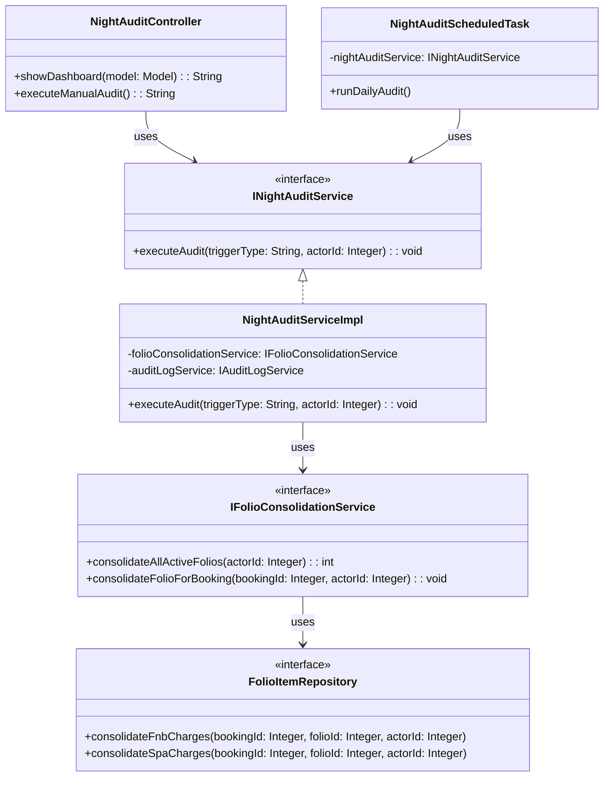
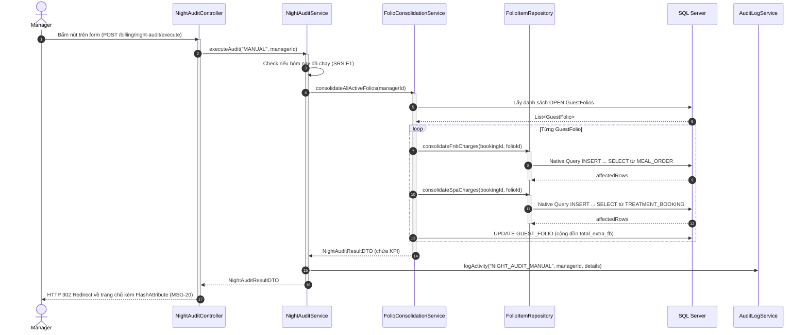
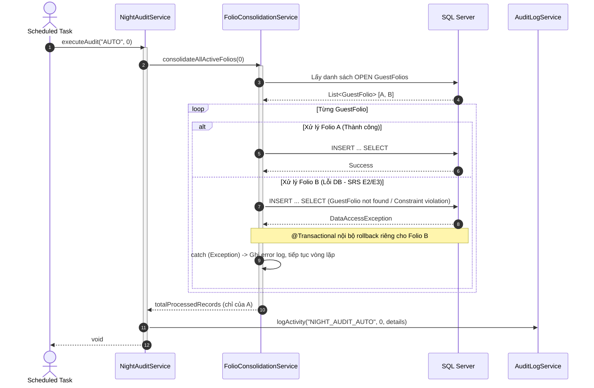
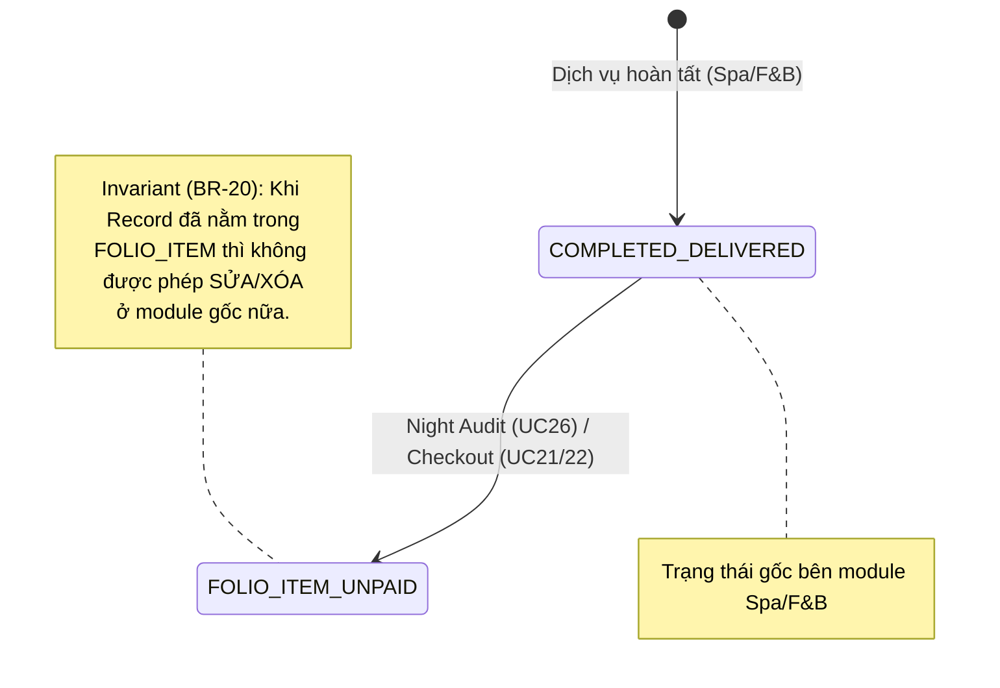

# ENGINEERING DOCUMENTATION STANDARD (EDS) v2.0

# Quy chuẩn Tài liệu Kỹ thuật và Đặc tả Hiện thực hóa

| Field                    | Value                                          |
| ------------------------ | ---------------------------------------------- |
| **Document ID**    | `AURA-BILLING-IMP-026`                       |
| **Version**        | 1.1                                            |
| **Date**           | `2026-06-16`                                 |
| **Status**         | ✅ Approved                                      |
| **Document Owner** | Phùng Giang Hải - Tech Lead & Module 5 Owner |
| **Author**         | Phùng Giang Hải - Tech Lead & Module 5 Owner |
| **Reviewed by**    | Phùng Giang Hải - Tech Lead & Module 5 Owner |
| **DPO Sign-off**   | `[ ] N/A — Module không xử lý PII`       |
| **Approved by**    | `Phùng Giang Hải`                        |
| **Last Review**    | `2026-06-16`                                 |
| **Based on EDS**   | v2.0                                           |

---

# CHANGELOG

> [!IMPORTANT]
> **Policy 4.4 — Immutable History:** Không bao giờ xóa thông tin cũ. Mọi thay đổi phải ghi vào bảng này.

| Ngày      | Người thực hiện | Nội dung thay đổi                                           |
| ---------- | ------------------- | -------------------------------------------------------------- |
| 2026-06-16 | Phùng Giang Hải        | Tạo tài liệu EDS lần đầu cho UC26 - Night Audit |
| 2026-06-16 | Phùng Giang Hải        | Cập nhật toàn diện để tuân thủ EDS v2.0 (Thêm State Machine, Error Path, Data Structure, Test Classification) |
| 2026-06-16 | Phùng Giang Hải        | Tech Lead phê duyệt tài liệu. Đổi trạng thái sang Approved. Chuẩn bị qua TDD. |

---

# MỤC LỤC

1. Tổng quan Module
2. Ma trận Truy vết (Traceability Matrix)
3. Architecture Decision Records (ADR)
4. Non-Functional Requirements & SLA
5. Static Modeling (Mô hình Tĩnh)
6. Dynamic Modeling (Mô hình Động)
7. Domain Event Catalog
8. Interface Specification (Đặc tả Giao diện)
9. Web MVC & API Specification
10. Bảng mã lỗi (Error Codes)
11. Quy trình Triển khai (Step-by-Step)
12. Rollback & Incident Runbook
13. Kịch bản Kiểm thử Chi tiết
14. Phương pháp Xác minh
15. Mẫu thử thực tế (API/MVC Verification Samples)
16. Bảng tổng hợp phân quyền (Authorization Matrix)

---

# 1. Tổng quan Module

> [!NOTE]
> Thực thi quy trình Night Audit (Chốt sổ cuối ngày). Chức năng này sẽ quét các dịch vụ (Spa, F&B) đã hoàn thành trong ngày nhưng chưa được ghi nợ, sau đó tổng hợp vào Guest Folio (Tài khoản phòng). Quá trình có thể chạy tự động vào lúc 00:00 hàng ngày hoặc kích hoạt thủ công bởi Quản lý qua UI Dashboard. Các bản ghi đã qua Audit sẽ bị khóa (locked).

| Field                           | Value                                                                                                             |
| ------------------------------- | ----------------------------------------------------------------------------------------------------------------- |
| **Module Name**           | `Module 5: Night Audit (UC26)`                                                         |
| **Bounded Context**       | `Billing / Accounting`                                                                                             |
| **Data Classification**   | `Internal / Confidential`                                                                                       |
| **Compliance Scope**      | `AHLEI Standard`                                                                                                           |
| **Upstream Dependencies** | `Booking Module (GUEST_FOLIO), Spa Module (TREATMENT_BOOKING), F&B Module (MEAL_ORDER)` |
| **Downstream Consumers**  | `UC24 (Revenue Dashboard)`                                                        |

---

# 2. Ma trận Truy vết (Traceability Matrix)

> [!NOTE]
> Ánh xạ trực tiếp các yêu cầu từ SRS sang thành phần code thực thi.

| Requirement ID | Loại (BR/ADR/US) | Mô tả yêu cầu                                                    | Thành phần Code                                         | Compliance Target | ADR liên quan |
| -------------- | ----------------- | -------------------------------------------------------------------- | --------------------------------------------------------- | ----------------- | -------------- |
| BR-20          | Business Rule     | Night Audit Consolidation — Gom Spa (COMPLETED) và F&B (DELIVERED) chưa chốt vào Folio lúc 00:00 hàng ngày. Khóa record sau chốt. | `NightAuditService.executeNightAudit()` <br> `FolioConsolidationService` | AHLEI Standard | ADR-026 |
| BR-15          | Business Rule     | Audit Trail Management — Lưu log lịch sử chạy Night Audit. | `AuditLogService.logActivity()`                         | NFR Security | — |
| UC26           | User Story        | Quản lý/Hệ thống chạy Night Audit tự động lúc 00:00 hoặc thủ công từ Dashboard. | `NightAuditController.executeManualAudit()`, `NightAuditScheduledTask` | — | — |
| E1 (SRS)       | Exception Flow    | Rejects execution nếu Night Audit đã được chạy trong ngày. Cảnh báo hiển thị. | `NightAuditService` (Check existing log) | — | — |
| E2 (SRS)       | Exception Flow    | Database transaction failure -> Rollbacks all changes and displays MSG-21. | `@Transactional` on `consolidateFolioForBooking` | — | — |
| E3 (SRS)       | Exception Flow    | Guest Folio not found -> Skips record, logs error, continues processing. | `FolioConsolidationService` `try-catch` | — | — |

---

# 3. Architecture Decision Records (ADR)

## ADR-026 — Lựa chọn cơ chế xử lý Batch cho Night Audit

| Field              | Value                   |
| ------------------ | ----------------------- |
| **Status**   | Accepted                |
| **Deciders** | Phùng Giang Hải, Tech Lead |
| **Date**     | 2026-06-16              |

**Bối cảnh (Context)**
> [!NOTE]
> UC26 yêu cầu gom toàn bộ hóa đơn của khách trong ngày vào Folio. Cần một giải pháp chạy tự động (Cron job) và chạy thủ công. Hệ thống có nên sử dụng Spring Batch (Framework xử lý batch nặng) hay dùng Spring Scheduling cơ bản kết hợp Native SQL?

**Các phương án đã xem xét (Options Considered)**

| Phương án | Mô tả                                                      | Ưu điểm                                                                             | Nhược điểm                                                                      |
| ------------ | ------------------------------------------------------------ | -------------------------------------------------------------------------------------- | ----------------------------------------------------------------------------------- |
| A            | Dùng Spring Batch (Reader, Processor, Writer) | + Xử lý hàng triệu bản ghi dễ dàng, chunk-oriented, auto retry. | - Quá phức tạp, overkill cho dự án khách sạn quy mô nhỏ/vừa (vài trăm bản ghi/ngày). |
| B            | Dùng `@Scheduled` và Native SQL (`INSERT ... SELECT`) | + Nhanh, nhẹ, dễ bảo trì, dễ trigger bằng tay qua Web form. Performance tối đa. | - Logic xử lý dồn vào SQL query thay vì code Java. |

**Quyết định (Decision)**
> [!NOTE]
> Chọn **Phương án B**. Sử dụng `FolioConsolidationService` chứa câu lệnh Native SQL `INSERT ... SELECT` là cực kỳ tối ưu. Hệ thống sẽ dùng `@Scheduled(cron = "0 0 0 * * ?")` để gọi service này. Đồng thời cung cấp form `POST /billing/night-audit/execute` để Manager kích hoạt thủ công, trả về View qua Controller.

**Hệ quả (Consequences)**
- **Tích cực:** Code gọn nhẹ, hiệu suất cao. Tách biệt `FolioConsolidationService` để gọi chung với UC21/UC22.
- **Tiêu cực:** Cần đảm bảo `@Transactional` hoạt động đúng cho từng bản ghi GuestFolio để tránh chết chùm.

---

# 4. Non-Functional Requirements & SLA

## 4.1. Performance & Availability
| Category   | Requirement               | Target SLA    | Measurement Method | Compliance Basis |
| ---------- | ------------------------- | ------------- | ------------------ | ---------------- |
| Latency    | Thực thi Night Audit (Thủ công) | `< 5s`      | Manual test        | N/A |
| Availability| Lịch trình Cron | `99.9%` | Uptime monitor | N/A |

## 4.2. Data Integrity & Retention
| Category    | Requirement             | Target | Verification Method     | Compliance Basis |
| ----------- | ----------------------- | ------ | ----------------------- | ---------------- |
| Consistency | Không chốt đúp hóa đơn | 100%   | SQL cross-check (`NOT IN`) | BR-20            |
| Durability  | Rollback khi lỗi DB     | RPO = 0| `@Transactional` rollback | SRS E2           |

## 4.3. Security
| Category       | Requirement | Target            | Verification Method | Compliance Basis |
| -------------- | ----------- | ----------------- | ------------------- | ---------------- |
| Access control | Nút chạy Thủ công | MANAGER | Auth Matrix (§16)  | RBAC             |

---

# 5. Static Modeling (Mô hình Tĩnh)

## 5.1. Class Diagram (PlantUML)



## 5.2. Data Structure (SQL Schema tham chiếu)

> [!NOTE]
> Cấu trúc bảng phải khớp 100% với `DB.sql` của dự án.

```sql
-- Bảng AUDIT_LOG (Ghi nhận tiến trình chạy Night Audit - BR-15)
CREATE TABLE AUDIT_LOG (
    log_id INT IDENTITY(1,1) PRIMARY KEY,
    action_type VARCHAR(50) NOT NULL,
    actor_id INT NOT NULL,
    target_id INT,
    details NVARCHAR(MAX),
    timestamp DATETIME DEFAULT GETDATE(),
    CONSTRAINT FK_AUDIT_ACTOR FOREIGN KEY (actor_id) REFERENCES [USER](user_id)
);

-- Bảng FOLIO_ITEM (Chứa dữ liệu các dịch vụ sau khi gom chốt - BR-20)
CREATE TABLE FOLIO_ITEM (
    folio_item_id INT IDENTITY(1,1) PRIMARY KEY,
    folio_id INT NOT NULL,
    service_category NVARCHAR(50),
    reference_id INT,
    description NVARCHAR(MAX),
    amount DECIMAL(18, 2),
    create_at DATETIME DEFAULT GETDATE(),
    create_by INT,
    status VARCHAR(10),
    CONSTRAINT FK_FOLIO_ITEM_REF FOREIGN KEY (folio_id) REFERENCES GUEST_FOLIO(folio_id)
);
```

---

# 6. Dynamic Modeling (Mô hình Hướng Động)

## 6.1. Sequence Diagram — Happy Path (Manual Trigger)



## 6.2. Sequence Diagram — Error Path (Exception Handling)



## 6.3. State Machine Diagram



> [!WARNING]
> **Invariant bất biến (BR-20)**: Các bản ghi Spa/F&B đã được Audit (có ID nằm trong cột `reference_id` của `FOLIO_ITEM`) sẽ bị KHÓA hoàn toàn đối với module Spa và F&B. Các module này phải gọi API/Service kiểm tra của Billing trước khi cho phép user update/delete dịch vụ.

---

# 7. Domain Event Catalog

N/A — Hiện tại Night Audit xử lý đồng bộ.

---

# 8. Interface Specification (Đặc tả Giao diện)

## 8.1. Service Interface

```java
// INightAuditService.java
// @version 1.0

export interface INightAuditService {
  /**
   * Thực thi quy trình Night Audit.
   * Cập nhật toàn bộ các dịch vụ Spa/F&B chưa chốt thành Folio Items.
   * @param triggerType Bắt buộc "MANUAL" hoặc "AUTO"
   * @param actorId ID của người thực hiện (0 nếu là AUTO)
   * @throws NightAuditAlreadyExecutedException Nếu phát hiện audit đã chạy trong ngày.
   */
  void executeAudit(String triggerType, Integer actorId);
}
```

---

# 9. Web MVC Specification (Đặc tả MVC)

## 9.1. Endpoints Table

| Method | Path | Auth Level | Required Roles | Chức năng |
| :--- | :--- | :--- | :--- | :--- |
| GET | `/billing/night-audit` | Session | `MANAGER` | Trả về View Dashboard kèm các Model Attribute theo SRS: `businessDate`, `auditStatus`, `kpiCards`, `folioItemsList`, `auditHistory`. |
| POST | `/billing/night-audit/execute` | Session | `MANAGER` | Xử lý form submit manual trigger. Cập nhật dữ liệu xong Redirect về `/billing/night-audit` kèm FlashMessage. |

## 9.2. Data Transfer (Model & Forms)

**Submit Form (Trigger thủ công):**

```java
@PostMapping("/execute")
public String executeManualAudit(RedirectAttributes redirectAttributes) {
    try {
        // ID cố định cho Manager hoặc lấy từ Session
        Integer managerId = 1; 
        NightAuditResultDTO result = nightAuditService.executeAudit("MANUAL", managerId);
        
        // Thêm thông báo thành công (MSG-20)
        redirectAttributes.addFlashAttribute("successMessage", "Night Audit process completed. All daily charges have been consolidated.");
    } catch (NightAuditAlreadyExecutedException e) {
        // E1: Đã chạy rồi (BIL-003)
        redirectAttributes.addFlashAttribute("errorMessage", "Night Audit has already been completed for this date.");
    } catch (Exception e) {
        // E2: Lỗi hệ thống (BIL-004) - MSG-21
        redirectAttributes.addFlashAttribute("errorMessage", "Night Audit process failed. Please review the error log and retry manually.");
    }
    return "redirect:/billing/night-audit";
}
```

---

# 10. Bảng mã lỗi (Error Codes)

| Code | HTTP Status | Message (EN) | Message (VI) | Trigger Condition |
| :--- | :--- | :--- | :--- | :--- |
| `BIL-003` | 400 | Night audit already completed | Night Audit đã hoàn tất cho ngày hôm nay | Khi hệ thống tìm thấy Log Night Audit của ngày hiện tại (SRS E1). Redirect kèm `FlashAttribute("errorMessage")` |
| `BIL-004` | 500 | System error | Có lỗi xảy ra trong quá trình Night Audit | Lỗi văng ra từ DB (Exception E2). Redirect kèm `FlashAttribute("errorMessage")` (MSG-21). |

---

# 11. Quy trình Triển khai (Step-by-Step)

### 11.1. Prerequisites
- [X] Bảng `FOLIO_ITEM`, `GUEST_FOLIO` đã tồn tại trong DB.
- [X] Các hàm `consolidateFnbCharges` và `consolidateSpaCharges` đã được định nghĩa chuẩn xác trong `FolioItemRepository`.

### 11.2. Implementation Steps
- **Bước 1**: Tạo `INightAuditService` và `NightAuditServiceImpl`.
- **Bước 2**: Trong `NightAuditServiceImpl`, kiểm tra xem log `NIGHT_AUDIT` đã có trong ngày hôm nay chưa (Nếu có, throw exception).
- **Bước 3**: Tạo `NightAuditScheduledTask` sử dụng `@Scheduled(cron = "0 0 0 * * ?")` gọi service vào nửa đêm.
- **Bước 4**: Viết `NightAuditController` để hiển thị View bằng Thymeleaf và handle lệnh POST submit form.

---

# 12. Rollback & Incident Runbook

> [!NOTE]
> Section này bắt buộc cho quy trình Batch như Night Audit.

### 12.1. Điều kiện kích hoạt Rollback (Trigger Conditions)

| Điều kiện | Ngưỡng | Người quyết định |
| :--- | :--- | :--- |
| Database transaction failure | Ngay lập tức | Tự động bởi `@Transactional` (Spring) |
| Chốt đúp do lỗi logic code | Bất kỳ | Tech Lead |

### 12.2. Rollback Procedure
Nếu xảy ra tình trạng lỗi nghiêm trọng:
1. Xác định thời điểm chạy batch bị lỗi qua bảng `AUDIT_LOG`.
2. Dùng lệnh SQL xóa các `FOLIO_ITEM` được sinh ra trong khoảng thời gian đó.
3. Reset cột `total_extra_fb` của bảng `GUEST_FOLIO` về giá trị cũ.

---

# 13. Kịch bản Kiểm thử Chi tiết

> [!IMPORTANT]
> **Policy (EDS v2.0 — Test Data)**: Mọi test scenario sử dụng `Test Data Classification: SYNTHETIC`.

### 13.1. Unit / Integration Tests

#### `TC-UNIT-001` — Chạy Night Audit tự động thành công (Happy Path)
- **Feature**: `NightAuditScheduledTask`
- **Background**:
  - **Given** test data classification: `SYNTHETIC`
  - **And** Có 2 phòng (Booking) đang có hóa đơn F&B `DELIVERED`.
  - **And** Chưa chạy Audit ngày hôm nay.
- **Scenario**: Chạy cron job
  - **When** `runDailyAudit()` được trigger.
  - **Then** Các hóa đơn F&B nhảy sang bảng `FOLIO_ITEM`.
  - **And** Bảng `AUDIT_LOG` có thêm dòng `NIGHT_AUDIT_AUTO`.

#### `TC-UNIT-002` — Xử lý khi Audit đã chạy rồi (SRS E1)
- **Scenario**: Chạy Manual khi đã chạy Auto trước đó
  - **Given** test data classification: `SYNTHETIC`
  - **And** Bảng `AUDIT_LOG` đã có log chạy thành công lúc 00:00 ngày hôm nay.
  - **When** Manager bấm nút submit form `POST /billing/night-audit/execute`.
  - **Then** Controller catch exception `NightAuditAlreadyExecutedException`.
  - **And** Thực hiện Redirect HTTP 302 về trang `/billing/night-audit`.
  - **And** Trang hiển thị thông báo lỗi "Night Audit has already been completed for this date" (FlashAttribute).

#### `TC-UNIT-003` — Skip lỗi từng Folio (SRS E3)
- **Scenario**: 1 Folio bị lỗi nhưng không ảnh hưởng toàn cục
  - **Given** Booking A hợp lệ, Booking B không tìm thấy GuestFolio.
  - **When** Night Audit chạy.
  - **Then** Booking A vẫn chốt thành công, Booking B bị skip. Quá trình không bị crash toàn bộ.

#### `TC-UNIT-004` — Không có dữ liệu mới để chốt (SRS A2)
- **Scenario**: Chạy Night Audit khi không có dịch vụ nào phát sinh trong ngày
  - **Given** test data classification: `SYNTHETIC`
  - **And** Tất cả các hoá đơn Spa và F&B trong ngày đã được chốt từ trước, hoặc khách không sử dụng thêm dịch vụ nào.
  - **When** Night Audit được trigger.
  - **Then** Hệ thống kết thúc với `totalRecordsProcessed = 0`.
  - **And** Bảng `AUDIT_LOG` vẫn ghi nhận một dòng log thông báo "No new charges".

---

# 14. Phương pháp Xác minh

### 14.1. Database Inspection
- *Verify việc tạo Folio Item*:
```sql
SELECT item_id, folio_id, service_category, amount, status, create_at
FROM FOLIO_ITEM
WHERE CAST(create_at AS DATE) = CAST(GETDATE() AS DATE);
```

- *Verify Audit Log ghi nhận*:
```sql
SELECT log_id, action_type, actor_id, timestamp 
FROM AUDIT_LOG 
WHERE action_type LIKE 'NIGHT_AUDIT%';
```

---

# 15. Mẫu thử thực tế (MVC Verification Samples)

## 15.1. Happy Path — Trigger Manual

- *Manager nhấn nút "Run Night Audit" trên UI:*
```
Bước 1: Mở trình duyệt vào trang http://localhost:8080/billing/night-audit
Bước 2: Click nút "Chạy Night Audit"
Bước 3: Trình duyệt gửi request POST /billing/night-audit/execute
Bước 4: Server xử lý xong, trả về mã HTTP 302 Redirect về lại /billing/night-audit
Bước 5: Trang load lại, hiển thị thông báo "Night Audit process completed. All daily charges have been consolidated."
```

## 15.2. Error Path — Đã Audit rồi

- *Thao tác khi Audit đã chạy thành công trước đó:*
```
Bước 1: Trên trang Dashboard, click nút "Chạy Night Audit" lần 2
Bước 2: Trình duyệt gửi request POST /billing/night-audit/execute
Bước 3: Server phát hiện ngoại lệ E1, trả về mã HTTP 302 Redirect
Bước 4: Trang load lại, hiển thị thông báo cảnh báo "Night Audit has already been completed for this date."
```

---

# 16. Bảng tổng hợp phân quyền (Authorization Matrix)

| Endpoint | GUEST | RECEPTIONIST | MANAGER | SYSTEM |
| :--- | :---: | :---: | :---: | :---: |
| GET `/billing/night-audit` | ❌ | ❌ | ✅ | ❌ |
| POST `/billing/night-audit/execute` | ❌ | ❌ | ✅ | ❌ |
| `@Scheduled` Cron Job | ❌ | ❌ | ❌ | ✅ |

---

# PHỤ LỤC

### A. Glossary (Thuật ngữ)
| Thuật ngữ | Định nghĩa |
| :--- | :--- |
| Night Audit | Quá trình chốt sổ kế toán hàng ngày, kiểm tra và tính toán lại các giao dịch chưa hạch toán của khách hàng trong ngày đó. |
| Folio Item | Đơn vị nhỏ nhất của chi phí, ánh xạ từ dịch vụ (Spa, F&B) vào Tài khoản phòng (Guest Folio). |

### B. Tài liệu tham khảo
| Document | Link / Path |
| :--- | :--- |
| SRS UC26 | `02_Requirement/SRS_Document.md` — Section 2.5.3 |
| Cấu trúc Database | `03_Design/Database/DB.sql` |
