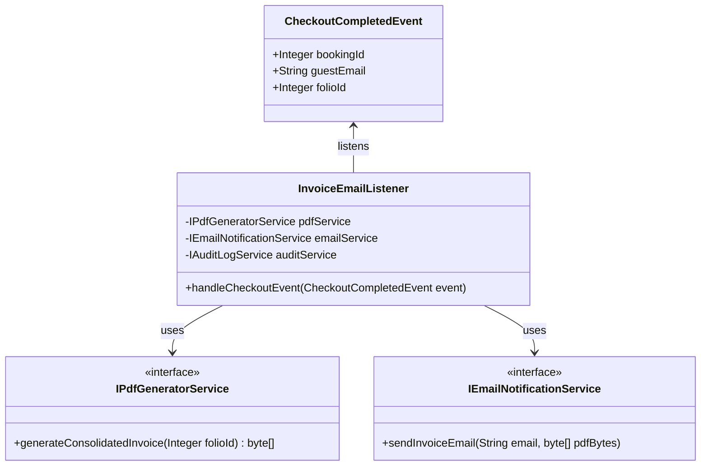
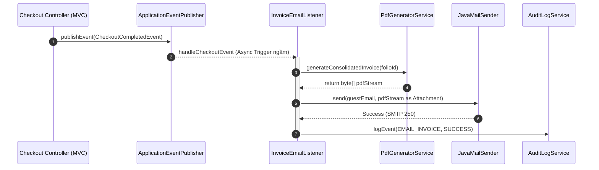
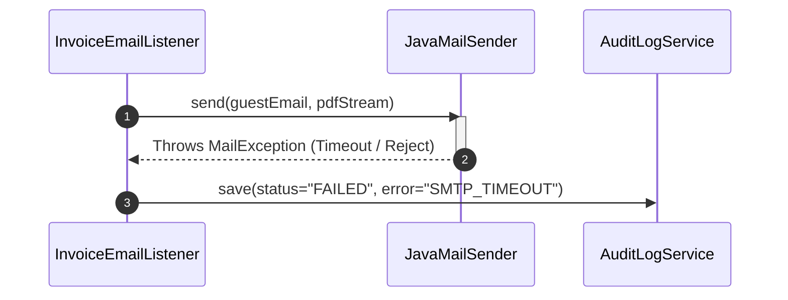

# ENGINEERING DOCUMENTATION STANDARD (EDS) v2.0

## Quy chuẩn Tài liệu Kỹ thuật và Đặc tả Hiện thực hóa

| Field                    | Value                                                                       |
| :----------------------- | :-------------------------------------------------------------------------- |
| **Document ID**    | `AM-MOD5-IMP-027`                                                         |
| **Version**        | 1.3                                                                         |
| **Date**           | 2026-06-17                                                                  |
| **Status**         | Approved                                                                    |
| **Document Owner** | Tech Lead                                                                   |
| **Author**         | Phùng Giang Hải                                                             |
| **Reviewed by**    | Tech Lead                                                                   |
| **DPO Sign-off**   | [X] Approved (PDPA scope)                                                   |
| **Approved by**    | Principal Architect                                                         |
| **Last Review**    | 2026-06-17                                                                  |
| **Based on EDS**   | v2.0                                                                        |

---

## CHANGELOG

> [!IMPORTANT]
> **Policy 4.4 — Immutable History**: Không bao giờ xóa thông tin cũ. Mọi thay đổi phải ghi vào bảng này.

| Ngày      | Người thực hiện | Nội dung thay đổi                                                                                                                                                                                                                                                  |
| :--------- | :------------------ | :-------------------------------------------------------------------------------------------------------------------------------------------------------------------------------------------------------------------------------------------------------------------- |
| 2026-06-17 | Phùng Giang Hải | Khởi tạo tài liệu lần đầu theo template EDS v2.0. |
| 2026-06-17 | Phùng Giang Hải | Khôi phục tuyệt đối 16 section của EDS Template v2.0 (Thêm các mục N/A thay vì tự ý xóa). |
| 2026-06-17 | Phùng Giang Hải | Đồng bộ EDS với SRS: (1) Bổ sung danh sách trường PDF chuẩn Bộ Tài chính vào ADR-005, (2) Thêm bước ghi Audit Log vào Sequence Diagram Happy Path, (3) Liệt kê nguồn dữ liệu gộp (Room_Booking, Folio_Item, Guest, Villa) vào Interface Spec. |
| 2026-06-17 | Phùng Giang Hải | Chuyển trạng thái sang Approved theo lệnh phê duyệt của Tech Lead. Sẵn sàng cho giai đoạn Implement (TDD Phase: GREEN). |
| 2026-06-17 | Phùng Giang Hải | Cập nhật nguyên tắc (TDD & Implementation Rule) vào mục Tổng quan: Cấm sửa lén file Test để khớp với Entity khi gặp lỗi lệch pha tên hàm/biến. Lỗi lệch pha do viết test trước là hợp lệ và cần được giải quyết ở phía Code hoặc báo cáo Tech Lead. |

---

## MỤC LỤC

1. [Tổng quan Module](#1-tổng-quan-module)
2. [Ma trận Truy vết (Traceability Matrix)](#2-ma-trận-truy-vết-traceability-matrix)
3. [Architecture Decision Records (ADR)](#3-architecture-decision-records-adr)
4. [Non-Functional Requirements &amp; SLA](#4-non-functional-requirements--sla)
5. [Static Modeling (Mô hình Tĩnh)](#5-static-modeling-mô-hình-tĩnh)
6. [Dynamic Modeling (Mô hình Hướng Động)](#6-dynamic-modeling-mô-hình-hướng-động)
7. [Domain Event Catalog](#7-domain-event-catalog)
8. [Interface Specification (Đặc tả Giao diện)](#8-interface-specification-đặc-tả-giao-diện)
9. [API Specification](#9-api-specification)
10. [Bảng mã lỗi (Error Codes)](#10-bảng-mã-lỗi-error-codes)
11. [Quy trình Triển khai (Step-by-Step)](#11-quy-trình-triển-khai-step-by-step)
12. [Rollback &amp; Incident Runbook](#12-rollback--incident-runbook)
13. [Kịch bản Kiểm thử Chi tiết](#13-kịch-bản-kiểm-thử-chi-tiết)
14. [Phương pháp Xác minh](#14-phương-pháp-xác-minh)
15. [Mẫu thử thực tế (API Verification Samples)](#15-mẫu-thử-thực-tế-api-verification-samples)
16. [Bảng tổng hợp phân quyền (Authorization Matrix)](#16-bảng-tổng-hợp-phân-quyền-authorization-matrix)

---

## 1. Tổng quan Module

> [!IMPORTANT]
> **TDD & Implementation Rule (Bài học kinh nghiệm):** Việc thiết kế bộ Test (TDD) trước khi đọc hết các file code/Entity cũ có thể dẫn đến việc các tên hàm Getter/Setter hoặc tên biến trong file Test bị sai lệch so với DB thực tế. Lỗi lệch pha này là điều ĐƯỢC PHÉP trong giai đoạn viết Test (RED Phase).
> Tuy nhiên, trong giai đoạn Implement (GREEN Phase), Lập trình viên TUYỆT ĐỐI KHÔNG ĐƯỢC tự ý sửa lại file Test gốc (hoặc tài liệu gốc) để "ép" cho khớp với Code. Mọi sự lệch pha đều phải được ưu tiên sửa phía Code/Entity (hoặc thảo luận lại với Tech Lead) thay vì lén lút sửa test để vượt qua bước compile.

> [!NOTE]
> Hệ thống background tự động kết xuất Hóa đơn gộp (Consolidated Invoice) dưới định dạng PDF theo chuẩn Bộ Tài chính và gửi email cho Khách hàng ngay sau khi Check-out thành công.

| Field                           | Value                                                    |
| :------------------------------ | :------------------------------------------------------- |
| **Module Name**           | Billing & Communication (Module 5)                       |
| **Bounded Context**       | Notification / Invoice Reporting                         |
| **Data Classification**   | Confidential / PII (Email, Họ tên, Chi phí cá nhân) |
| **Compliance Scope**      | PDPA (Nghị định 356/2025)                             |
| **Upstream Dependencies** | Reception Checkout (UC22), Guest Folio                   |
| **Downstream Consumers**  | External Email Gateway (SMTP)                            |

---

## 2. Ma trận Truy vết (Traceability Matrix)

| Requirement ID | Loại (BR/ADR/US) | Mô tả yêu cầu                                         | Thành phần Code                               | Compliance Target        | ADR liên quan |
| :------------- | :---------------- | :-------------------------------------------------------- | :---------------------------------------------- | :----------------------- | :------------- |
| BR-21          | Business Rule     | Hóa đơn chuẩn Bộ Tài chính, Không lưu file tĩnh | `PdfGeneratorService.generateInvoiceStream()` | PDPA (Data Minimization) | ADR-005        |
| BR-15          | Business Rule     | Lưu Audit Trail sau gửi Email                           | `AuditLogService.logEmail()`                  | PDPA                     | —             |
| PF-20          | NFR               | Không block giao diện lúc Checkout, chạy Asynchronous | `@Async InvoiceEmailListener`                 | SLA Latency              | —             |
| UC27           | User Story        | Kết xuất và gửi PDF sau Checkout                      | `EmailNotificationService`                    | —                       | —             |

---

## 3. Architecture Decision Records (ADR)

### `ADR-005` — Xử lý PDF In-Memory thay vì Disk Storage

| Field              | Value                     |
| :----------------- | :------------------------ |
| **Status**   | Proposed                  |
| **Deciders** | Antigravity AI, Tech Lead |
| **Date**     | 2026-06-17                |

#### Bối cảnh (Context)

Hệ thống cần tạo file PDF chứa PII của khách. File PDF phải tuân thủ chuẩn biểu mẫu hóa đơn cơ bản theo quy định Bộ Tài chính Việt Nam (BR-21), bao gồm các trường bắt buộc:

- Logo và Tên công ty (Xoai Aura Retreat)
- Mã số thuế doanh nghiệp
- Bảng chi tiết dịch vụ (Room, Spa, F&B)
- Thuế suất VAT 10% tách riêng dòng
- Tổng tiền bằng số và bằng chữ

Ghi file chứa PII ra ổ cứng vi phạm Data Minimization và gây lãng phí Disk I/O trên server Spring Boot.

#### Các phương án đã xem xét (Options Considered)

| Phương án         | Mô tả                                                                                  | Ưu điểm                                               | Nhược điểm                                   |
| :------------------- | :--------------------------------------------------------------------------------------- | :------------------------------------------------------- | :----------------------------------------------- |
| A (Disk Storage)     | Lưu file PDF vào `/tmp`, đính kèm gửi mail rồi xóa.                            | Dễ debug và truy vết khi lỗi.                        | Nguy cơ rò rỉ file rác. Vi phạm Compliance. |
| B (In-Memory Stream) | Dùng `ByteArrayOutputStream` sinh byte PDF trên RAM, truyền qua `JavaMailSender`. | An toàn tuyệt đối, nhanh, dọn RAM nhờ GC (JDK 21). | Khó debug nếu cấu trúc file PDF bị lỗi.    |

#### Quyết định (Decision)

Chọn Phương án **B (In-Memory Stream)** để tuân thủ tuyệt đối BR-21.

#### Hệ quả (Consequences)

**Tích cực**: Bảo vệ PII, tiết kiệm Disk I/O.
**Tiêu cực / Trade-offs**: Cần log Exception chi tiết để debug.

---

## 4. Non-Functional Requirements & SLA

### 4.1. Performance & Availability

| Category     | Requirement                         | Target SLA                   | Measurement Method | Compliance Basis |
| :----------- | :---------------------------------- | :--------------------------- | :----------------- | :--------------- |
| Latency      | Trigger Async không chặn Checkout | < 50ms cho khâu phát Event | APM Monitoring     | PF-20            |
| Availability | Queue xử lý Email nội bộ        | 99.9% Uptime                 | Spring Actuator    | —               |

### 4.2. Data Integrity & Retention

| Category   | Requirement                  | Target                      | Verification Method | Compliance Basis |
| :--------- | :--------------------------- | :-------------------------- | :------------------ | :--------------- |
| Durability | Zero record loss (Audit Log) | RPO = 0                     | Transaction log     | BR-15            |
| Retention  | Không lưu file PDF         | Tồn tại 0s trên ổ đĩa | Inspection server   | BR-21 (PDPA)     |

### 4.3. Security

| Category              | Requirement              | Target             | Verification Method | Compliance Basis    |
| :-------------------- | :----------------------- | :----------------- | :------------------ | :------------------ |
| Encryption in transit | Giao thức truyền Email | SMTP over TLS 1.2+ | SSL/TLS Config      | PDPA / GDPR Art. 32 |

### 4.4. Scalability & Capacity Planning

> [!NOTE]
> Hệ thống hiện tại có 1 Listener Thread Pool (Size = 10). Dự kiến tải tối đa 100 checkouts/giờ. Thread Pool đủ năng lực phục vụ mà không cần cấu hình Message Queue chuyên dụng (Kafka/RabbitMQ) ở giai đoạn này.

---

## 5. Static Modeling (Mô hình Tĩnh)

### 5.1. Class Diagram (PlantUML)



### 5.2. Data Structure (Prisma Schema / SQL Database)

Tiến trình System này không có Table riêng. Sử dụng bảng `Audit_Log` đã tồn tại:

```sql
-- Dữ liệu Audit_Log được chèn (Append-Only)
INSERT INTO audit_log (action_type, entity_id, status, error_message, created_at, created_by)
VALUES ('EMAIL_INVOICE', :bookingId, 'SUCCESS', NULL, NOW(), 'SYSTEM');
```

---

## 6. Dynamic Modeling (Mô hình Hướng Động)

### 6.1. Sequence Diagram — Happy Path (PlantUML)



### 6.2. Sequence Diagram — Error Path (PlantUML)



### 6.3. State Machine

> [!NOTE]
> Không áp dụng (N/A) – Module System này chạy một chiều (One-shot task), không có luồng trạng thái phức tạp.

---

## 7. Domain Event Catalog

### 7.1. Events Published (Phát ra)

| Event Name | Trigger                          | Publisher | Subscriber(s) | Payload Schema | Async? |
| :--------- | :------------------------------- | :-------- | :------------ | :------------- | :----- |
| N/A        | Không xuất bản sự kiện mới |           |               |                |        |

### 7.2. Events Consumed (Tiêu thụ)

| Event Name                 | Source                 | Handler                  | Action thực hiện                                |
| :------------------------- | :--------------------- | :----------------------- | :------------------------------------------------ |
| `CheckoutCompletedEvent` | Reception Checkout MVC | `InvoiceEmailListener` | Chạy ngầm kết xuất PDF, bắn Email, lưu log. |

### 7.3. Payload Schema

```java
public class CheckoutCompletedEvent extends ApplicationEvent {
    private final Integer bookingId;
    private final Integer folioId;
    private final String guestEmail;
    // Getters...
}
```

---

## 8. Interface Specification (Đặc tả Giao diện)

### 8.1. Service Interface

```java
// IPdfGeneratorService.java
// @version 1.0
// Nguồn dữ liệu gộp (Consolidated Data Sources):
//   - Room_Booking: Thông tin đặt phòng, giá gói Retreat
//   - Folio_Item: Tổng hợp chi phí phát sinh (Room Charge từ Night Audit UC26,
//                 Spa charges từ UC15, F&B charges từ UC19)
//   - Guest: Tên khách, Email
//   - Villa: Số phòng, hạng phòng
public interface IPdfGeneratorService {
    /**
     * Kết xuất Hóa đơn gộp theo chuẩn Bộ Tài chính (BR-21).
     * Bắt buộc hiển thị: Logo, Tên công ty, MST, Bảng chi tiết,
     * VAT 10% tách riêng, Tổng tiền bằng chữ.
     * @param folioId ID của Guest Folio (liên kết qua Room_Booking_ID)
     * @return byte[] chứa nội dung PDF
     */
    byte[] generateConsolidatedInvoice(Integer folioId) throws Exception;
}

// IEmailNotificationService.java
// @version 1.0
public interface IEmailNotificationService {
    /**
     * Gửi email đính kèm file PDF dưới dạng ByteArrayResource.
     * @param toEmail Địa chỉ email khách hàng
     * @param pdfAttachment Mảng byte chứa nội dung PDF
     */
    void sendInvoiceEmail(String toEmail, byte[] pdfAttachment) throws Exception;
}
```

### 8.2. Repository Interface

Không áp dụng (N/A) - Sử dụng chung `AuditLogRepository` của Core Module.

---

## 9. API Specification

> [!NOTE]
> Không áp dụng (N/A). Đây là Background System Task kích hoạt ngầm qua Spring ApplicationEvent. Không expose Endpoint (JSON REST) nào ra ngoài internet.

### 9.1. Endpoints Table

N/A

### 9.2. Request / Response Schemas

N/A

---

## 10. Bảng mã lỗi (Error Codes)

| Code        | HTTP Status | Message (EN)          | Message (VI)                   | Trigger Condition                           |
| :---------- | :---------- | :-------------------- | :----------------------------- | :------------------------------------------ |
| `INV-001` | N/A (Log)   | PDF Generation Failed | Lỗi kết xuất hóa đơn PDF | Dữ liệu Folio hỏng, lỗi Template engine |
| `MSG-22`  | N/A (Log)   | Missing Email Address | Khách hàng không có email  | `guestEmail` bị NULL hoặc rỗng         |
| `MSG-23`  | N/A (Log)   | SMTP Dispatch Error   | Lỗi hệ thống gửi email     | SMTP Server timeout, sai cấu hình TLS     |

---

## 11. Quy trình Triển khai (Step-by-Step)

### 11.1. Prerequisites

- [X] Đã cấu hình Server SMTP trong `application.yml`.
- [X] Template Thymeleaf (`invoice-template.html`) cho việc generate PDF đã sẵn sàng.
- [X] Kích hoạt annotation `@EnableAsync` trong Spring Boot.

### 11.2. Pre-Migration Checklist

Không áp dụng (N/A) – UC này không thay đổi Schema DB.

### 11.3. Implementation Steps

1. Khởi tạo `PdfGeneratorService` sử dụng iText/OpenPDF.
2. Code `EmailNotificationService` sử dụng `JavaMailSender`.
3. Khai báo Listener `@Async`.

### 11.4. Deployment Checklist

- [ ] Email gửi tới mailbox test thành công
- [ ] RAM không tăng đột biến (OOM) khi trigger 50 invoice cùng lúc.

---

## 12. Rollback & Incident Runbook

### 12.1. Điều kiện kích hoạt Rollback (Trigger Conditions)

| Điều kiện                                   | Ngưỡng           | Người quyết định |
| :--------------------------------------------- | :----------------- | :-------------------- |
| Máy chủ sập do OOM (Tràn RAM) vì tạo PDF | Heap > 90%         | On-call Engineer      |
| Kẹt hàng đợi Email                         | Timeout liên tục | On-call Engineer      |

### 12.2. Rollback Procedure

Tắt tính năng chạy ngầm bằng cách comment `@EventListener` hoặc điều chỉnh Feature Toggle trong `application.yml`.

### 12.3. Notification Protocol

Báo cáo DPO ngay lập tức nếu log hệ thống in ra các dòng byte mảng (PII Leak) do lỗi `PdfGeneratorService`.

### 12.4. Post-Incident Review (PIR)

N/A

---

## 13. Kịch bản Kiểm thử Chi tiết

> [!IMPORTANT]
> **Test Data Classification**: `SYNTHETIC` - Tuyệt đối không dùng email thật của khách hàng.

### 13.1. Unit Tests

- `TC-UNIT-PDF-001` — **Scenario Happy Path**: Đưa mock data -> Gọi `generateConsolidatedInvoice` -> Output `byte[]` không null, array bắt đầu bằng `%PDF-`.
- `TC-UNIT-MAIL-001` — **Scenario Mock SMTP**: Dùng thư viện `GreenMail` -> Gọi `sendInvoiceEmail` -> Đếm số lượng thư trong Mock Box là 1.

### 13.2. Integration Tests

- `TC-INT-001` — **Scenario Happy Path (End to End)**: Dùng `@SpringBootTest`, phát một `CheckoutCompletedEvent`. Kiểm tra DB `Audit_Log` có bản ghi `EMAIL_INVOICE` thành công.

### 13.3. E2E / Security Tests

N/A (Tiến trình chạy ngầm, không có UI Security test trực tiếp).

---

## 14. Phương pháp Xác minh

### 14.1. Database Inspection

```sql
SELECT action_type, status, created_at 
FROM audit_log 
WHERE action_type = 'EMAIL_INVOICE' AND created_at > CURRENT_DATE;
```

### 14.2. Log / Audit Verification

```bash
grep "MSG-23" /var/log/auramoon/app.log
```

### 14.3. Tool-based Verification

Sử dụng các công cụ giám sát (Grafana/Prometheus) để theo dõi Heap Memory khi luồng Event chạy để chắc chắn byte array được GC thu gom.

---

## 15. Mẫu thử thực tế (API Verification Samples)

> [!NOTE]
> Không áp dụng (N/A) – UC này không expose API Endpoint nào ra ngoài. Mọi tương tác diễn ra nội bộ hệ thống thông qua Spring Event.

---

## 16. Bảng tổng hợp phân quyền (Authorization Matrix)

Tính năng ngầm chạy dưới quyền `SYSTEM`. Không có API nên không cần phân quyền truy cập.

| Endpoint                  | GUEST | USER | ADMIN | DPO | SYSTEM |
| :------------------------ | :---: | :--: | :---: | :-: | :----: |
| Background Event Listener |  ❌  |  ❌  |  ❌  | ❌ |   ✅   |
