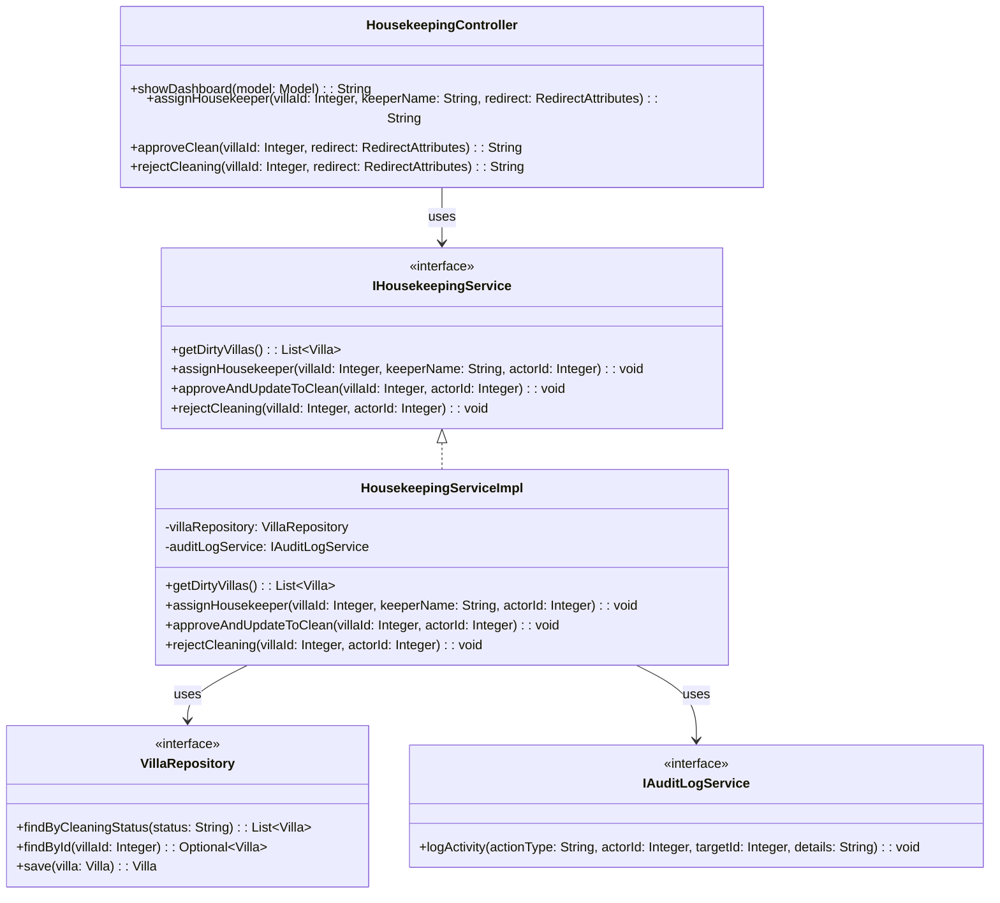
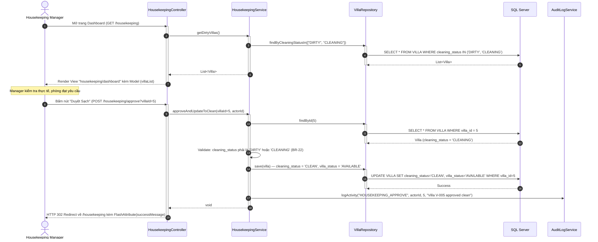
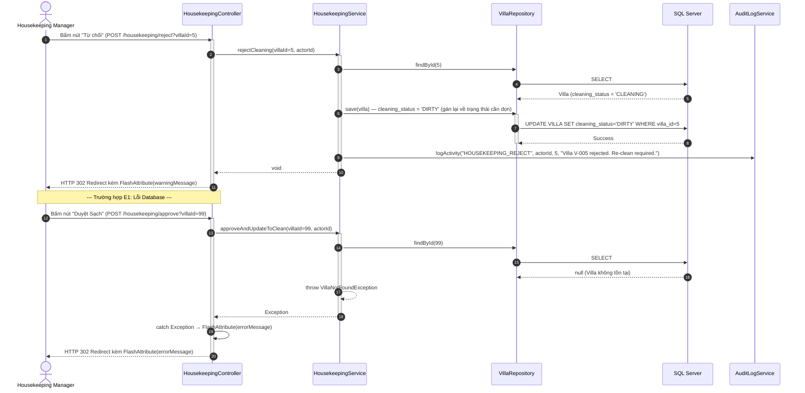
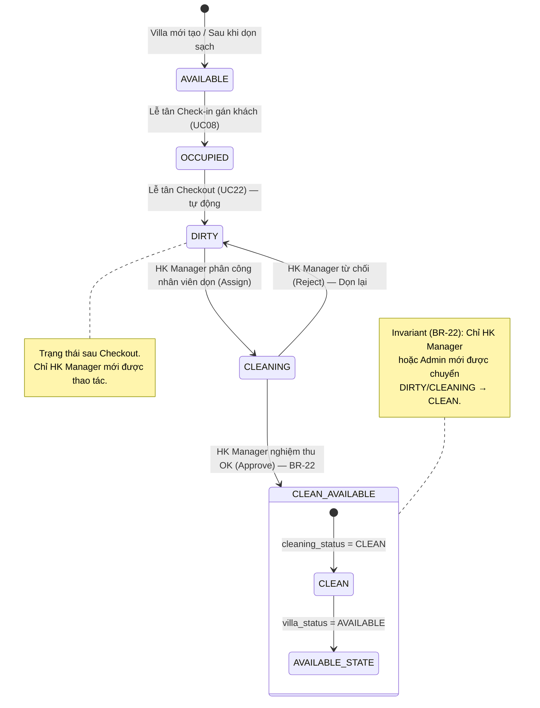

# ENGINEERING DOCUMENTATION STANDARD (EDS) v2.0

# Quy chuẩn Tài liệu Kỹ thuật và Đặc tả Hiện thực hóa

| Field                    | Value                                          |
| ------------------------ | ---------------------------------------------- |
| **Document ID**    | `AURA-BILLING-IMP-028`                       |
| **Version**        | 1.0                                            |
| **Date**           | `2026-06-20`                                 |
| **Status**         | Draft                                          |
| **Document Owner** | Phùng Giang Hải - Tech Lead & Module 5 Owner |
| **Author**         | Phùng Giang Hải - Tech Lead & Module 5 Owner |
| **Reviewed by**    | Phùng Giang Hải - Tech Lead & Module 5 Owner |
| **DPO Sign-off**   | `[ ] N/A — Module không xử lý PII`       |
| **Approved by**    | `Phùng Giang Hải`                        |
| **Last Review**    | `2026-06-20`                                 |
| **Based on EDS**   | v2.0                                           |

---

# CHANGELOG

> [!IMPORTANT]
> **Policy 4.4 — Immutable History:** Không bao giờ xóa thông tin cũ. Mọi thay đổi phải ghi vào bảng này.

| Ngày       | Người thực hiện    | Nội dung thay đổi                                           |
| ---------- | ------------------- | -------------------------------------------------------------- |
| 2026-06-20 | Phùng Giang Hải        | Tạo tài liệu EDS lần đầu cho UC28 - Housekeeping Management. Đầy đủ 16 sections theo chuẩn EDS v2.0. |

---

# MỤC LỤC

1. [Tổng quan Module](#1-tổng-quan-module)
2. [Ma trận Truy vết (Traceability Matrix)](#2-ma-trận-truy-vết-traceability-matrix)
3. [Architecture Decision Records (ADR)](#3-architecture-decision-records-adr)
4. [Non-Functional Requirements & SLA](#4-non-functional-requirements--sla)
5. [Static Modeling (Mô hình Tĩnh)](#5-static-modeling-mô-hình-tĩnh)
6. [Dynamic Modeling (Mô hình Động)](#6-dynamic-modeling-mô-hình-động)
7. [Domain Event Catalog](#7-domain-event-catalog)
8. [Interface Specification (Đặc tả Giao diện)](#8-interface-specification-đặc-tả-giao-diện)
9. [Web MVC Specification (Đặc tả MVC)](#9-web-mvc-specification-đặc-tả-mvc)
10. [Bảng mã lỗi (Error Codes)](#10-bảng-mã-lỗi-error-codes)
11. [Quy trình Triển khai (Step-by-Step)](#11-quy-trình-triển-khai-step-by-step)
12. [Rollback & Incident Runbook](#12-rollback--incident-runbook)
13. [Kịch bản Kiểm thử Chi tiết](#13-kịch-bản-kiểm-thử-chi-tiết)
14. [Phương pháp Xác minh](#14-phương-pháp-xác-minh)
15. [Mẫu thử thực tế (MVC Verification Samples)](#15-mẫu-thử-thực-tế-mvc-verification-samples)
16. [Bảng tổng hợp phân quyền (Authorization Matrix)](#16-bảng-tổng-hợp-phân-quyền-authorization-matrix)

---

# 1. Tổng quan Module

> [!NOTE]
> Quản lý Buồng phòng (Housekeeping Management). Cho phép Quản lý Buồng phòng (Housekeeping Manager / Admin) xem danh sách các Villa đang ở trạng thái "Cần dọn dẹp" (DIRTY) sau khi khách Check-out, phân công nhân viên dọn dẹp, thực hiện nghiệm thu (Quality Assurance) và cập nhật trạng thái Villa về "Sạch sẽ / Sẵn sàng" (CLEAN / AVAILABLE) trên cùng một màn hình. Đây là cầu nối nghiệp vụ giữa luồng Check-out (UC22) và luồng Check-in tiếp theo (UC08).

| Field                           | Value                                                                            |
| ------------------------------- | -------------------------------------------------------------------------------- |
| **Module Name**           | `Module 5: Housekeeping Management (UC28)`                                     |
| **Bounded Context**       | `Operations / Room Management`                                                  |
| **Data Classification**   | `Internal`                                                                      |
| **Compliance Scope**      | `N/A`                                                                            |
| **Upstream Dependencies** | `Booking Module (VILLA, VILLA_TYPE), Checkout Module (UC22 — trigger DIRTY)`   |
| **Downstream Consumers**  | `UC08 (Check-in & Room Assignment — cần Villa ở trạng thái AVAILABLE/CLEAN)`   |

---

# 2. Ma trận Truy vết (Traceability Matrix)

> [!NOTE]
> Ánh xạ trực tiếp các yêu cầu từ SRS sang thành phần code thực thi.

| Requirement ID | Loại (BR/ADR/US) | Mô tả yêu cầu                                                    | Thành phần Code                                         | Compliance Target | ADR liên quan |
| -------------- | ----------------- | -------------------------------------------------------------------- | --------------------------------------------------------- | ----------------- | -------------- |
| BR-22          | Business Rule     | Housekeeping Status Constraint — Chỉ Housekeeping Manager (hoặc Admin) mới được chuyển `cleaning_status` từ `DIRTY` sang `CLEAN`. Lễ tân chỉ được chuyển `villa_status` từ `AVAILABLE` sang `OCCUPIED`. | `HousekeepingService.approveAndUpdateToClean()` | RBAC | ADR-028 |
| BR-15          | Business Rule     | Audit Trail Management — Lưu log mọi thao tác thay đổi trạng thái Villa. | `AuditLogService.logActivity()`                         | NFR Security | — |
| UC28           | User Story        | Housekeeping Manager xem danh sách Villa DIRTY, phân công, nghiệm thu, cập nhật trạng thái. | `HousekeepingController`, `HousekeepingServiceImpl` | — | ADR-028 |
| UC22 (Post)    | Trigger           | Sau khi Checkout thành công, Villa.cleaning_status tự động chuyển sang DIRTY. | `CheckoutService` (Module có sẵn)                       | — | — |
| A1 (SRS)       | Alternative Flow  | Phòng không đạt nghiệm thu → Reject, gán lại cho nhân viên dọn. Status giữ nguyên DIRTY. | `HousekeepingService.rejectCleaning()` | — | — |
| E1 (SRS)       | Exception Flow    | Database error khi cập nhật trạng thái → Hiển thị lỗi, yêu cầu thử lại. | `@Transactional` rollback, `FlashAttribute` error | — | — |

---

# 3. Architecture Decision Records (ADR)

## ADR-028 — Thiết kế Single-Page CRUD cho Housekeeping Dashboard

| Field              | Value                   |
| ------------------ | ----------------------- |
| **Status**   | Accepted                |
| **Deciders** | Phùng Giang Hải, Tech Lead |
| **Date**     | 2026-06-20              |

**Bối cảnh (Context)**
> [!NOTE]
> UC28 yêu cầu Quản lý Buồng phòng vừa xem danh sách Villa cần dọn, vừa phân công, vừa nghiệm thu và cập nhật trạng thái, tất cả trên cùng một màn hình. Cần quyết định: Tách thành 2 trang riêng (View + Action) hay gộp vào 1 trang duy nhất (Single-Page CRUD)?

**Các phương án đã xem xét (Options Considered)**

| Phương án | Mô tả                                                      | Ưu điểm                                                                             | Nhược điểm                                                                      |
| ------------ | ------------------------------------------------------------ | -------------------------------------------------------------------------------------- | ----------------------------------------------------------------------------------- |
| A            | Tách 2 trang: Trang danh sách + Trang chi tiết/Action | + Rõ ràng từng màn hình, dễ test riêng biệt. | - Quản lý phải click qua lại nhiều lần khi dọn hàng loạt phòng, giảm UX. |
| B            | Gộp 1 trang: Dashboard kèm nút Action inline trên từng dòng | + Thao tác nhanh, 1 click. UX mượt cho người quản lý bận rộn. | - Trang phức tạp hơn, cần xử lý form submit inline hoặc Modal. |

**Quyết định (Decision)**
> [!NOTE]
> Chọn **Phương án B**. Thiết kế Single-Page Dashboard. Danh sách Villa DIRTY hiển thị dưới dạng bảng (Data Grid). Mỗi dòng có các nút Action: "Phân công", "Duyệt Sạch" (Approve), "Từ chối" (Reject). Thao tác bấm nút sẽ gửi POST form và Redirect lại chính trang Dashboard (PRG Pattern). Điều này đồng nhất với kiến trúc MVC đang dùng cho UC26 (Night Audit Dashboard).

**Hệ quả (Consequences)**
- **Tích cực:** UX tối ưu cho Quản lý Buồng phòng. Code gọn nhẹ vì chỉ cần 1 Controller method GET và 2-3 method POST. Đồng nhất pattern với UC26.
- **Tiêu cực:** Cần đảm bảo `@Transactional` khi cập nhật trạng thái để tránh race condition nếu 2 quản lý cùng duyệt 1 phòng.

---

# 4. Non-Functional Requirements & SLA

## 4.1. Performance & Availability
| Category   | Requirement               | Target SLA    | Measurement Method | Compliance Basis |
| ---------- | ------------------------- | ------------- | ------------------ | ---------------- |
| Latency    | Load trang Housekeeping Dashboard | `< 2s`      | Manual test        | N/A |
| Latency    | Cập nhật trạng thái Villa | `< 500ms`   | Manual test        | N/A |

## 4.2. Data Integrity & Retention
| Category    | Requirement             | Target | Verification Method     | Compliance Basis |
| ----------- | ----------------------- | ------ | ----------------------- | ---------------- |
| Consistency | Không có 2 người duyệt cùng 1 Villa đồng thời | 100%   | `@Transactional` + Optimistic Lock | BR-22 |
| Durability  | Mọi thao tác phải ghi Audit Log | 100%   | SQL cross-check `AUDIT_LOG` | BR-15 |

## 4.3. Security
| Category       | Requirement | Target            | Verification Method | Compliance Basis |
| -------------- | ----------- | ----------------- | ------------------- | ---------------- |
| Access control | Trang Housekeeping Dashboard | MANAGER / ADMIN | Auth Matrix (§16)  | BR-22 / RBAC |
| Access control | Nút Approve/Reject | MANAGER / ADMIN | Spring Security `@PreAuthorize` | BR-22 / RBAC |

## 4.4. Scalability & Capacity Planning
> [!NOTE]
> Dự kiến tải: Tối đa 50-100 Villa. Số lượng thao tác Housekeeping: ~20-50 lần/ngày (sau giờ checkout). Không cần chiến lược scale đặc biệt. Single DB query là đủ.

---

# 5. Static Modeling (Mô hình Tĩnh)

## 5.1. Class Diagram



## 5.2. Data Structure (SQL Schema tham chiếu)

> [!NOTE]
> Bảng `VILLA` đã tồn tại trong DB gốc (`DB.sql`). UC28 sử dụng trực tiếp cột `cleaning_status` đã được thiết kế sẵn.

```sql
-- Bảng VILLA (Đã tồn tại — UC28 sử dụng cột cleaning_status)
CREATE TABLE VILLA (
    villa_id INT IDENTITY(1,1) PRIMARY KEY,
    villa_type INT NOT NULL,
    villa_code VARCHAR(10) NOT NULL UNIQUE,
    limit_person INT,
    villa_status VARCHAR(20) CHECK (villa_status IN ('AVAILABLE', 'OCCUPIED', 'MAINTENANCE')),
    cleaning_status VARCHAR(10) CHECK (cleaning_status IN ('CLEAN', 'DIRTY', 'CLEANING')),
    is_delete BIT DEFAULT 0,
    CONSTRAINT FK_VILLA_TYPE FOREIGN KEY (villa_type) REFERENCES VILLA_TYPE(type_id)
);

-- Bảng AUDIT_LOG (Đã tồn tại — UC28 ghi log thao tác Housekeeping - BR-15)
CREATE TABLE AUDIT_LOG (
    log_id INT IDENTITY(1,1) PRIMARY KEY,
    action_type VARCHAR(50) NOT NULL,
    actor_id INT NOT NULL,
    target_id INT,
    details NVARCHAR(MAX),
    timestamp DATETIME DEFAULT GETDATE(),
    CONSTRAINT FK_AUDIT_ACTOR FOREIGN KEY (actor_id) REFERENCES [USER](user_id)
);
```

**Ý nghĩa các cột `cleaning_status`:**

| Giá trị | Mô tả | Trigger chuyển trạng thái |
| :--- | :--- | :--- |
| `CLEAN` | Villa đã được dọn sạch, sẵn sàng đón khách | Housekeeping Manager duyệt (Approve) |
| `DIRTY` | Villa cần dọn dẹp (sau khi khách Check-out) | Tự động bởi UC22 (Checkout) |
| `CLEANING` | Đang được dọn dẹp (đã phân công nhân viên) | Housekeeping Manager phân công (Assign) |

---

# 6. Dynamic Modeling (Mô hình Hướng Động)

## 6.1. Sequence Diagram — Happy Path (Approve Clean)



## 6.2. Sequence Diagram — Error Path (Reject / DB Error)



## 6.3. State Machine Diagram — Villa Cleaning Lifecycle



> [!WARNING]
> **Invariant bất biến (BR-22)**: Lễ tân (RECEPTIONIST) TUYỆT ĐỐI KHÔNG ĐƯỢC phép chuyển `cleaning_status` từ `DIRTY` sang `CLEAN`. Quyền này chỉ thuộc về Housekeeping Manager hoặc Admin. Vi phạm sẽ bị hệ thống chặn ở tầng Security (`@PreAuthorize`).

---

# 7. Domain Event Catalog

## 7.1. Events Consumed (Tiêu thụ)

| Event Name | Source | Handler | Action thực hiện |
| :--- | :--- | :--- | :--- |
| `CheckoutCompleted` | UC22 (CheckoutService) | `HousekeepingEventListener.onCheckoutCompleted()` | Tự động cập nhật `cleaning_status = 'DIRTY'` cho Villa vừa được checkout. |

## 7.2. Events Published (Phát ra)

| Event Name | Trigger | Publisher | Subscriber(s) | Payload Schema | Async? |
| :--- | :--- | :--- | :--- | :--- | :--- |
| `VillaCleanedAndAvailable` | HK Manager Approve thành công | `HousekeepingServiceImpl` | `BookingModule` (cập nhật pool phòng trống) | `villaId, villaCode, updatedAt` | No |

> [!NOTE]
> Hiện tại Event `VillaCleanedAndAvailable` được xử lý đồng bộ (synchronous) trong cùng transaction. Nếu tương lai hệ thống scale, có thể chuyển sang Async bằng Spring ApplicationEvent.

---

# 8. Interface Specification (Đặc tả Giao diện)

## 8.1. Service Interface

```java
// IHousekeepingService.java
// @version 1.0

public interface IHousekeepingService {

    /**
     * Lấy danh sách các Villa đang cần dọn dẹp (DIRTY) hoặc đang dọn (CLEANING).
     * @return Danh sách Villa kèm thông tin VillaType.
     */
    List<Villa> getDirtyAndCleaningVillas();

    /**
     * Phân công nhân viên dọn dẹp cho một Villa.
     * Chuyển cleaning_status từ DIRTY → CLEANING.
     * @param villaId ID của Villa cần phân công.
     * @param keeperName Tên nhân viên được giao dọn.
     * @param actorId ID của Manager thực hiện.
     * @throws VillaNotFoundException Khi villaId không tồn tại.
     * @throws InvalidStatusTransitionException Khi cleaning_status không phải DIRTY.
     */
    void assignHousekeeper(Integer villaId, String keeperName, Integer actorId);

    /**
     * Nghiệm thu và duyệt Villa đã sạch (Approve).
     * Chuyển cleaning_status: DIRTY/CLEANING → CLEAN, villa_status → AVAILABLE.
     * @param villaId ID của Villa cần duyệt.
     * @param actorId ID của Manager thực hiện.
     * @throws VillaNotFoundException Khi villaId không tồn tại (HK-003).
     * @throws InvalidStatusTransitionException Khi cleaning_status đã là CLEAN (HK-002).
     */
    void approveAndUpdateToClean(Integer villaId, Integer actorId);

    /**
     * Từ chối nghiệm thu, yêu cầu dọn lại.
     * Chuyển cleaning_status: CLEANING → DIRTY.
     * @param villaId ID của Villa bị từ chối.
     * @param actorId ID của Manager thực hiện.
     * @throws VillaNotFoundException Khi villaId không tồn tại.
     */
    void rejectCleaning(Integer villaId, Integer actorId);
}
```

## 8.2. Repository Interface

```java
// VillaRepository.java (extends JpaRepository — đã tồn tại trong Booking module)
// @version 1.0
// UC28 bổ sung thêm các method query sau:

public interface VillaRepository extends JpaRepository<Villa, Integer> {

    List<Villa> findByCleaningStatusIn(List<String> statuses);

    // Lưu ý: Không có delete() — Villa là master data, chỉ soft-delete (is_delete = 1).
}
```

---

# 9. Web MVC Specification (Đặc tả MVC)

## 9.1. Endpoints Table

| Method | Path | Auth Level | Required Roles | Chức năng |
| :--- | :--- | :--- | :--- | :--- |
| GET | `/housekeeping` | Session | `MANAGER`, `ADMIN` | Trả về View Dashboard. Model Attributes: `villaList` (danh sách Villa DIRTY/CLEANING), `successMessage`, `warningMessage`, `errorMessage` (FlashAttributes). |
| POST | `/housekeeping/assign` | Session | `MANAGER`, `ADMIN` | Xử lý phân công nhân viên. Params: `villaId`, `keeperName`. Redirect về `/housekeeping`. |
| POST | `/housekeeping/approve` | Session | `MANAGER`, `ADMIN` | Xử lý duyệt sạch (Approve). Params: `villaId`. Redirect về `/housekeeping`. |
| POST | `/housekeeping/reject` | Session | `MANAGER`, `ADMIN` | Xử lý từ chối (Reject). Params: `villaId`. Redirect về `/housekeeping`. |

## 9.2. Data Transfer (Model & Forms)

**Controller Pseudo-code:**

```java
@Controller
@RequestMapping("/housekeeping")
@PreAuthorize("hasAnyRole('MANAGER', 'ADMIN')")
public class HousekeepingController {

    private final IHousekeepingService housekeepingService;

    // --- GET: Hiển thị Dashboard ---
    @GetMapping
    public String showDashboard(Model model) {
        List<Villa> villaList = housekeepingService.getDirtyAndCleaningVillas();
        model.addAttribute("villaList", villaList);
        return "housekeeping/dashboard";
    }

    // --- POST: Phân công nhân viên ---
    @PostMapping("/assign")
    public String assignHousekeeper(
            @RequestParam Integer villaId,
            @RequestParam String keeperName,
            RedirectAttributes redirect) {
        try {
            Integer actorId = getLoggedInUserId(); // Lấy từ Security Context
            housekeepingService.assignHousekeeper(villaId, keeperName, actorId);
            redirect.addFlashAttribute("successMessage",
                "Đã phân công nhân viên " + keeperName + " dọn Villa thành công.");
        } catch (Exception e) {
            redirect.addFlashAttribute("errorMessage", e.getMessage());
        }
        return "redirect:/housekeeping";
    }

    // --- POST: Duyệt sạch (Approve) ---
    @PostMapping("/approve")
    public String approveClean(
            @RequestParam Integer villaId,
            RedirectAttributes redirect) {
        try {
            Integer actorId = getLoggedInUserId();
            housekeepingService.approveAndUpdateToClean(villaId, actorId);
            redirect.addFlashAttribute("successMessage",
                "Villa đã được duyệt sạch và chuyển về trạng thái Sẵn sàng.");
        } catch (InvalidStatusTransitionException e) {
            // HK-002
            redirect.addFlashAttribute("warningMessage", e.getMessage());
        } catch (VillaNotFoundException e) {
            // HK-003
            redirect.addFlashAttribute("errorMessage", e.getMessage());
        } catch (Exception e) {
            // HK-004
            redirect.addFlashAttribute("errorMessage",
                "Lỗi hệ thống khi cập nhật trạng thái. Vui lòng thử lại.");
        }
        return "redirect:/housekeeping";
    }

    // --- POST: Từ chối (Reject) ---
    @PostMapping("/reject")
    public String rejectCleaning(
            @RequestParam Integer villaId,
            RedirectAttributes redirect) {
        try {
            Integer actorId = getLoggedInUserId();
            housekeepingService.rejectCleaning(villaId, actorId);
            redirect.addFlashAttribute("warningMessage",
                "Villa đã bị từ chối nghiệm thu. Yêu cầu nhân viên dọn lại.");
        } catch (Exception e) {
            redirect.addFlashAttribute("errorMessage", e.getMessage());
        }
        return "redirect:/housekeeping";
    }
}
```

---

# 10. Bảng mã lỗi (Error Codes)

> [!IMPORTANT]
> Tiền tố mã lỗi `HK-` (Housekeeping) để phân biệt với `BIL-` (Billing) của các UC khác trong Module 5.

| Code | HTTP Status | Message (EN) | Message (VI) | Trigger Condition |
| :--- | :--- | :--- | :--- | :--- |
| `HK-001` | 400 | Validation failed | Dữ liệu không hợp lệ | Thiếu `villaId` hoặc `keeperName` khi submit form. |
| `HK-002` | 409 | Villa already clean | Villa đã ở trạng thái sạch rồi | Bấm Approve khi `cleaning_status` đã là `CLEAN`. |
| `HK-003` | 404 | Villa not found | Không tìm thấy Villa | `villaId` không tồn tại trong DB hoặc `is_delete = 1`. |
| `HK-004` | 500 | Internal error | Lỗi hệ thống khi cập nhật trạng thái | Exception bất ngờ từ DB (E1 SRS). |
| `HK-005` | 403 | Insufficient permissions | Không đủ quyền truy cập | User không có role MANAGER hoặc ADMIN (BR-22). |

---

# 11. Quy trình Triển khai (Step-by-Step)

## 11.1. Prerequisites
- [X] Bảng `VILLA` đã tồn tại trong DB với cột `cleaning_status` (CLEAN, DIRTY, CLEANING).
- [X] Bảng `AUDIT_LOG` đã tồn tại.
- [X] Entity `Villa.java` đã có field `cleaningStatus`.
- [X] `VillaRepository` đã tồn tại trong Booking module.
- [ ] Spring Security đã cấu hình role `MANAGER` và `ADMIN`.

## 11.2. Implementation Steps

#### Chặng 1 — Tạo Service Layer
- Tạo `IHousekeepingService` interface trong package `housekeeping/service/`.
- Tạo `HousekeepingServiceImpl` implements interface trên.
- Inject `VillaRepository` (từ Booking module) và `IAuditLogService`.
- Implement 4 method: `getDirtyAndCleaningVillas()`, `assignHousekeeper()`, `approveAndUpdateToClean()`, `rejectCleaning()`.

#### Chặng 2 — Tạo Controller
- Tạo `HousekeepingController` trong package `housekeeping/controller/`.
- Áp dụng `@PreAuthorize("hasAnyRole('MANAGER', 'ADMIN')")` lên class.
- Implement 4 endpoint theo §9.1.

#### Chặng 3 — Tạo Thymeleaf View
- Tạo file `templates/housekeeping/dashboard.html`.
- Hiển thị bảng danh sách Villa (villaCode, villaType, cleaningStatus, nút Action).
- Tách CSS vào `static/css/housekeeping/dashboard.css`.
- Tách JS vào `static/js/housekeeping/dashboard.js`.

#### Chặng 4 — Cấu hình Security
- Thêm path `/housekeeping/**` vào `SecurityConfig` cho role MANAGER, ADMIN.

#### Chặng 5 — Verification sau deploy
- Đăng nhập với tài khoản MANAGER, truy cập `/housekeeping`.
- Thực hiện các thao tác Assign, Approve, Reject.
- Kiểm tra bảng `AUDIT_LOG` đã ghi nhận đúng.

## 11.3. Deployment Checklist
- [ ] Service và Controller đã compile thành công.
- [ ] Trang Dashboard hiển thị đúng danh sách Villa DIRTY.
- [ ] Nút Approve cập nhật `cleaning_status = 'CLEAN'` và `villa_status = 'AVAILABLE'`.
- [ ] Nút Reject đặt lại `cleaning_status = 'DIRTY'`.
- [ ] Audit log đang sinh ra đúng format cho mọi thao tác.
- [ ] User không có role MANAGER/ADMIN bị chặn truy cập (403).

---

# 12. Rollback & Incident Runbook

> [!NOTE]
> Section này bắt buộc. UC28 thao tác trực tiếp lên bảng master data `VILLA`.

## 12.1. Điều kiện kích hoạt Rollback (Trigger Conditions)

| Điều kiện | Ngưỡng | Người quyết định |
| :--- | :--- | :--- |
| Villa bị cập nhật sai trạng thái hàng loạt | Bất kỳ | Tech Lead |
| Audit log không ghi nhận thao tác | > 1 lần | On-call Engineer |
| Race condition: 2 manager duyệt cùng 1 villa | Bất kỳ | Tech Lead |

## 12.2. Rollback Procedure

#### Bước 1: Xác định thời điểm lỗi
```sql
SELECT log_id, action_type, actor_id, target_id, details, timestamp
FROM AUDIT_LOG
WHERE action_type LIKE 'HOUSEKEEPING%'
ORDER BY timestamp DESC;
```

#### Bước 2: Revert trạng thái Villa về DIRTY
```sql
-- Revert Villa bị cập nhật sai
UPDATE VILLA
SET cleaning_status = 'DIRTY', villa_status = 'OCCUPIED'
WHERE villa_id IN ([danh sách villa_id bị ảnh hưởng]);
```

#### Bước 3: Ghi log rollback
```sql
INSERT INTO AUDIT_LOG (action_type, actor_id, target_id, details)
VALUES ('HOUSEKEEPING_ROLLBACK', [admin_id], [villa_id], 'Rollback do [lý do]');
```

#### Bước 4: Verify rollback thành công
```sql
SELECT villa_id, villa_code, cleaning_status, villa_status
FROM VILLA
WHERE villa_id IN ([danh sách villa_id]);
```

## 12.3. Notification Protocol

| Thời điểm | Người nhận | Kênh | Template |
| :--- | :--- | :--- | :--- |
| Ngay khi phát hiện | Tech Lead | Slack / Zalo | "🚨 Housekeeping: Villa [X] bị cập nhật sai trạng thái" |

---

# 13. Kịch bản Kiểm thử Chi tiết

> [!IMPORTANT]
> **Policy (EDS v2.0 — Test Data)**: Mọi test scenario sử dụng `Test Data Classification: SYNTHETIC`.

## 13.1. Unit Tests

### `TC-UNIT-001` — Lấy danh sách Villa DIRTY/CLEANING thành công (Happy Path)

- **Feature**: `HousekeepingServiceImpl.getDirtyAndCleaningVillas()`
- **Background**:
  - **Given** test data classification: `SYNTHETIC`
  - **And** DB có 3 Villa: V-001 (CLEAN), V-002 (DIRTY), V-003 (CLEANING).
- **Scenario**: Lấy danh sách Villa cần xử lý
  - **When** `getDirtyAndCleaningVillas()` được gọi.
  - **Then** Kết quả trả về `List` chứa đúng 2 Villa: V-002 và V-003.
  - **And** V-001 (CLEAN) KHÔNG nằm trong danh sách.

### `TC-UNIT-002` — Phân công nhân viên dọn dẹp thành công (Happy Path)

- **Feature**: `HousekeepingServiceImpl.assignHousekeeper()`
- **Background**:
  - **Given** test data classification: `SYNTHETIC`
  - **And** Villa V-002 có `cleaning_status = 'DIRTY'`.
- **Scenario**: Phân công nhân viên
  - **When** `assignHousekeeper(villaId=2, keeperName="Nguyễn Văn A", actorId=1)` được gọi.
  - **Then** Villa V-002 có `cleaning_status = 'CLEANING'`.
  - **And** Bảng `AUDIT_LOG` có thêm dòng `action_type = 'HOUSEKEEPING_ASSIGN'`.

### `TC-UNIT-003` — Duyệt sạch thành công (Happy Path - Approve)

- **Feature**: `HousekeepingServiceImpl.approveAndUpdateToClean()`
- **Background**:
  - **Given** test data classification: `SYNTHETIC`
  - **And** Villa V-002 có `cleaning_status = 'CLEANING'`.
- **Scenario**: Manager duyệt sạch
  - **When** `approveAndUpdateToClean(villaId=2, actorId=1)` được gọi.
  - **Then** Villa V-002 có `cleaning_status = 'CLEAN'` VÀ `villa_status = 'AVAILABLE'`.
  - **And** Bảng `AUDIT_LOG` có thêm dòng `action_type = 'HOUSEKEEPING_APPROVE'`.

### `TC-UNIT-004` — Từ chối nghiệm thu (Alternative Flow A1 - Reject)

- **Feature**: `HousekeepingServiceImpl.rejectCleaning()`
- **Background**:
  - **Given** test data classification: `SYNTHETIC`
  - **And** Villa V-003 có `cleaning_status = 'CLEANING'`.
- **Scenario**: Manager từ chối
  - **When** `rejectCleaning(villaId=3, actorId=1)` được gọi.
  - **Then** Villa V-003 có `cleaning_status = 'DIRTY'` (quay lại trạng thái cần dọn).
  - **And** Bảng `AUDIT_LOG` có thêm dòng `action_type = 'HOUSEKEEPING_REJECT'`.

### `TC-UNIT-005` — Duyệt Villa đã sạch rồi (Error Path - HK-002)

- **Feature**: `HousekeepingServiceImpl.approveAndUpdateToClean()`
- **Background**:
  - **Given** test data classification: `SYNTHETIC`
  - **And** Villa V-001 có `cleaning_status = 'CLEAN'`.
- **Scenario**: Manager duyệt Villa đã sạch
  - **When** `approveAndUpdateToClean(villaId=1, actorId=1)` được gọi.
  - **Then** Hệ thống throw `InvalidStatusTransitionException`.
  - **And** Villa V-001 KHÔNG bị thay đổi trạng thái.
  - **And** KHÔNG có dòng Audit Log mới được tạo.

### `TC-UNIT-006` — Villa không tồn tại (Error Path - HK-003)

- **Feature**: `HousekeepingServiceImpl.approveAndUpdateToClean()`
- **Background**:
  - **Given** test data classification: `SYNTHETIC`
  - **And** `villaId = 999` không tồn tại trong DB.
- **Scenario**: Approve Villa không tồn tại
  - **When** `approveAndUpdateToClean(villaId=999, actorId=1)` được gọi.
  - **Then** Hệ thống throw `VillaNotFoundException`.

## 13.2. Integration Tests

### `TC-INT-001` — Luồng hoàn chỉnh: Assign → Approve

- **Scenario**: Manager phân công rồi duyệt sạch
  - **Given** test data classification: `SYNTHETIC`
  - **And** Villa V-002 ban đầu có `cleaning_status = 'DIRTY'`.
  - **When** Manager gọi `assignHousekeeper(2, "Trần B", 1)`.
  - **Then** `cleaning_status` chuyển sang `'CLEANING'`.
  - **When** Manager gọi `approveAndUpdateToClean(2, 1)`.
  - **Then** `cleaning_status = 'CLEAN'` VÀ `villa_status = 'AVAILABLE'`.
  - **And** Bảng `AUDIT_LOG` có đúng 2 dòng log: `HOUSEKEEPING_ASSIGN` và `HOUSEKEEPING_APPROVE`.

### `TC-INT-002` — Luồng hoàn chỉnh: Assign → Reject → Re-Assign → Approve

- **Scenario**: Manager từ chối lần đầu, duyệt lần hai
  - **Given** test data classification: `SYNTHETIC`
  - **And** Villa V-003 ban đầu có `cleaning_status = 'DIRTY'`.
  - **When** Assign → Reject → Assign lại → Approve.
  - **Then** Kết quả cuối cùng: `cleaning_status = 'CLEAN'`, `villa_status = 'AVAILABLE'`.
  - **And** Bảng `AUDIT_LOG` có đúng 4 dòng log theo đúng thứ tự.

## 13.3. E2E / Security Tests

### `TC-E2E-001` — Receptionist không được phép truy cập Dashboard (BR-22)

- **Scenario**: Unauthorized access
  - **Given** test data classification: `SYNTHETIC`
  - **And** User đăng nhập với role `RECEPTIONIST`.
  - **When** Truy cập GET `/housekeeping`.
  - **Then** Hệ thống trả về HTTP 403 Forbidden.

### `TC-E2E-002` — Guest không được phép truy cập Dashboard

- **Scenario**: Guest access attempt
  - **Given** User đăng nhập với role `GUEST`.
  - **When** Truy cập GET `/housekeeping`.
  - **Then** Hệ thống trả về HTTP 403 Forbidden.

---

# 14. Phương pháp Xác minh

## 14.1. Database Inspection

- *Verify danh sách Villa cần dọn:*
```sql
SELECT villa_id, villa_code, cleaning_status, villa_status
FROM VILLA
WHERE cleaning_status IN ('DIRTY', 'CLEANING') AND is_delete = 0;
```

- *Verify Villa đã được duyệt sạch:*
```sql
SELECT villa_id, villa_code, cleaning_status, villa_status
FROM VILLA
WHERE villa_id = [id] AND cleaning_status = 'CLEAN' AND villa_status = 'AVAILABLE';
```

- *Verify Audit Log ghi nhận thao tác Housekeeping:*
```sql
SELECT log_id, action_type, actor_id, target_id, details, timestamp
FROM AUDIT_LOG
WHERE action_type LIKE 'HOUSEKEEPING%'
ORDER BY timestamp DESC;
```

## 14.2. Log / Audit Verification

- *Kiểm tra không có PII trong Log (Villa data là Internal, không phải PII):*
```sql
SELECT * FROM AUDIT_LOG
WHERE details LIKE '%password%' OR details LIKE '%cccd%';
-- Expected: No output
```

---

# 15. Mẫu thử thực tế (MVC Verification Samples)

## 15.1. Happy Path — Phân công và Duyệt sạch

```
Bước 1: Mở trình duyệt, đăng nhập với tài khoản MANAGER.
Bước 2: Truy cập http://localhost:8080/housekeeping
Bước 3: Trang Dashboard hiển thị bảng danh sách Villa có cleaning_status = DIRTY hoặc CLEANING.
Bước 4: Click nút "Phân công" trên dòng Villa V-002.
         → Nhập tên nhân viên "Nguyễn Văn A" vào modal/form.
         → Trình duyệt gửi POST /housekeeping/assign?villaId=2&keeperName=Nguyen Van A
         → Server xử lý, trả về HTTP 302 Redirect về /housekeeping.
         → Trang load lại, Villa V-002 hiển thị trạng thái "CLEANING".
         → Thông báo thành công xuất hiện.
Bước 5: Click nút "Duyệt Sạch" trên dòng Villa V-002.
         → Trình duyệt gửi POST /housekeeping/approve?villaId=2
         → Server xử lý, trả về HTTP 302 Redirect.
         → Trang load lại, Villa V-002 BIẾN MẤT khỏi danh sách (vì đã CLEAN).
         → Thông báo: "Villa đã được duyệt sạch và chuyển về trạng thái Sẵn sàng."
```

## 15.2. Error Path — Từ chối nghiệm thu

```
Bước 1: Trên Dashboard, Villa V-003 đang ở trạng thái "CLEANING".
Bước 2: Click nút "Từ chối" trên dòng Villa V-003.
         → Trình duyệt gửi POST /housekeeping/reject?villaId=3
         → Server xử lý, trả về HTTP 302 Redirect.
         → Trang load lại, Villa V-003 hiển thị trạng thái "DIRTY" (quay lại cần dọn).
         → Thông báo cảnh báo: "Villa đã bị từ chối nghiệm thu. Yêu cầu nhân viên dọn lại."
```

## 15.3. Error Path — Unauthorized Access

```
Bước 1: Đăng nhập với tài khoản RECEPTIONIST.
Bước 2: Gõ trực tiếp URL http://localhost:8080/housekeeping vào thanh địa chỉ.
Bước 3: Hệ thống chặn truy cập, hiển thị trang lỗi 403 Forbidden.
```

---

# 16. Bảng tổng hợp phân quyền (Authorization Matrix)

> [!NOTE]
> **Nguyên tắc Least Privilege**: Chỉ Housekeeping Manager và Admin mới có quyền thao tác trên module này.

| Endpoint | GUEST | RECEPTIONIST | THERAPIST | CHEF | MANAGER | ADMIN |
| :--- | :---: | :---: | :---: | :---: | :---: | :---: |
| GET `/housekeeping` | ❌ | ❌ | ❌ | ❌ | ✅ | ✅ |
| POST `/housekeeping/assign` | ❌ | ❌ | ❌ | ❌ | ✅ | ✅ |
| POST `/housekeeping/approve` | ❌ | ❌ | ❌ | ❌ | ✅ | ✅ |
| POST `/housekeeping/reject` | ❌ | ❌ | ❌ | ❌ | ✅ | ✅ |

**Chú thích**:
- ✅ = Được phép
- ❌ = Bị từ chối (403 Forbidden)

---

# PHỤ LỤC

## A. Glossary (Thuật ngữ)

| Thuật ngữ | Định nghĩa |
| :--- | :--- |
| Housekeeping | Bộ phận quản lý buồng phòng, chịu trách nhiệm dọn dẹp, kiểm tra và chuẩn bị phòng cho khách mới. |
| Housekeeping Manager | Quản lý bộ phận Buồng phòng. Người có quyền phân công dọn dẹp, nghiệm thu và chuyển trạng thái phòng. |
| QA (Quality Assurance) | Quá trình kiểm tra chất lượng phòng sau khi nhân viên dọn xong, trước khi cho phép phòng nhận khách mới. |
| cleaning_status | Cột trong bảng VILLA, theo dõi trạng thái vệ sinh của phòng (CLEAN / DIRTY / CLEANING). |
| villa_status | Cột trong bảng VILLA, theo dõi trạng thái vận hành của phòng (AVAILABLE / OCCUPIED / MAINTENANCE). |
| PRG Pattern | Post/Redirect/Get — Pattern chuẩn trong Web MVC để tránh duplicate form submission. |

## B. Tài liệu tham khảo

| Document | Link / Path |
| :--- | :--- |
| SRS UC28 | `02_Requirement/Module5/SRS_Document.md` — Section 2.7.1 |
| Retreat Business Rules | `08_Document_References/Retreat.md` — UC28 |
| Cấu trúc Database | `03_Design/Database/DB.sql` — Table VILLA (line 104) |
| Villa Entity (Java) | `05_Development/auramoon/src/main/java/com/AuraMoon/auramoon/booking/entity/Villa.java` |
| EDS Template v2.0 | `08_Document_References/Template/EDS_TEMPLATE_V2.0.md` |
| EDS Review Rules | `00_Policy/Rule/EDS_Review_Rules.md` |
