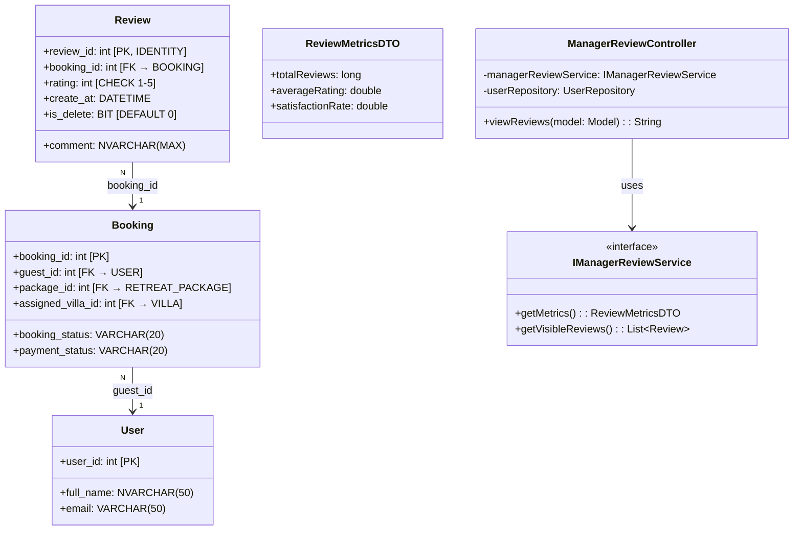
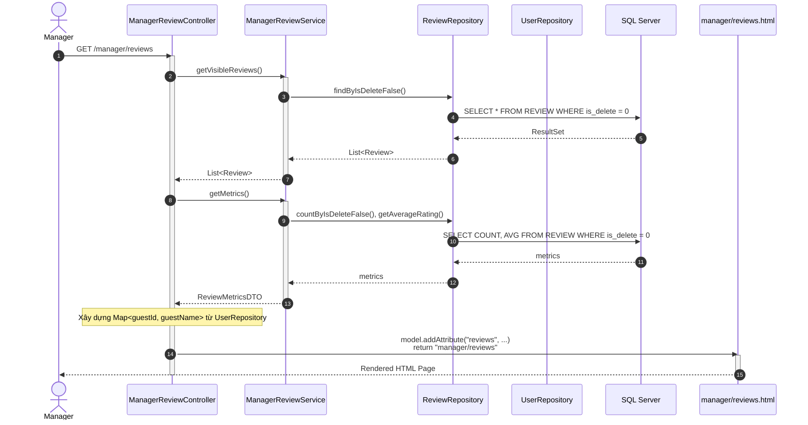
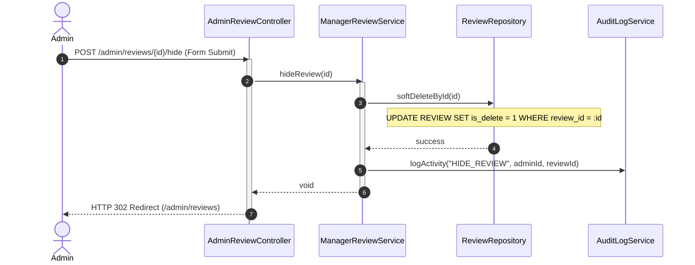

# ENGINEERING DOCUMENTATION STANDARD (EDS) v2.0
## Quy chuẩn Tài liệu Kỹ thuật và Đặc tả Hiện thực hóa - UC29 Customer Reviews

| Field | Value |
| :--- | :--- |
| **Document ID** | `XOAI-MOD5-IMP-029` |
| **Version** | 2.0 |
| **Date** | 2026-06-26 |
| **Status** | ✅ Approved |
| **Document Owner** | Management Portal Team |
| **Author** | Phùng Giang Hải |
| **Reviewed by** | Phùng Giang Hải |
| **DPO Sign-off** | `[x] Approved` — Module đọc PII khách hàng (Guest Name) từ Booking |
| **Approved by** | Principal Architect |
| **Last Review** | 2026-06-26 |
| **Based on EDS** | v2.0 |

---

## CHANGELOG

> [!IMPORTANT]
> **Policy 4.4 — Immutable History**: Không bao giờ xóa thông tin cũ. Mọi thay đổi phải ghi vào bảng này.

| Ngày | Người thực hiện | Nội dung thay đổi |
| :--- | :--- | :--- |
| 2026-06-26 | Phùng Giang Hải | Tạo tài liệu lần đầu, thiết kế UC29 Customer Reviews (Spring Boot MVC). |
| 2026-06-26 | Phùng Giang Hải | **v2.0**: Đối chiếu toàn bộ với DB.sql, Database_Status_Standardization.md, Java Enums, Entity files, SecurityConfig. Sửa endpoint `/admin/reviews` → `/manager/reviews`. Sửa trạng thái `COMPLETED` → `CHECKED_OUT`. Bổ sung endpoint mới `/manager/guest-profile/{id}`. Thêm quy định tách CSS/JS module. |

---

## MỤC LỤC
1. [Tổng quan Module](#1-tổng-quan-module)
2. [Ma trận Truy vết (Traceability Matrix)](#2-ma-trận-truy-vết-traceability-matrix)
3. [Architecture Decision Records (ADR)](#3-architecture-decision-records-adr)
4. [Non-Functional Requirements & SLA](#4-non-functional-requirements--sla)
5. [Static Modeling (Mô hình Tĩnh)](#5-static-modeling-mô-hình-tĩnh)
6. [Dynamic Modeling (Mô hình Hướng Động)](#6-dynamic-modeling-mô-hình-hướng-động)
7. [Domain Event Catalog](#7-domain-event-catalog)
8. [Interface Specification (Đặc tả Giao diện)](#8-interface-specification-đặc-tả-giao-diện)
9. [API Specification (Spring MVC Controllers)](#9-api-specification-spring-mvc-controllers)
10. [Bảng mã lỗi (Error Codes)](#10-bảng-mã-lỗi-error-codes)
11. [Quy trình Triển khai (Step-by-Step)](#11-quy-trình-triển-khai-step-by-step)
12. [Rollback & Incident Runbook](#12-rollback--incident-runbook)
13. [Kịch bản Kiểm thử Chi tiết](#13-kịch-bản-kiểm-thử-chi-tiết)
14. [Phương pháp Xác minh](#14-phương-pháp-xác-minh)
15. [Mẫu thử thực tế (MVC Verification Samples)](#15-mẫu-thử-thực-tế-mvc-verification-samples)
16. [Bảng tổng hợp phân quyền (Authorization Matrix)](#16-bảng-tổng-hợp-phân-quyền-authorization-matrix)

---

## 1. Tổng quan Module

> [!NOTE]
> Module Quản lý Đánh giá Khách hàng (Customer Reviews Dashboard). Cung cấp giao diện Dashboard phân tích dữ liệu đánh giá dạng **Read-only** dành cho **Manager**. Sử dụng Spring Boot MVC, render qua Thymeleaf. Manager chỉ được phép **xem**, không sửa/xóa. Chức năng **Ẩn đánh giá (Soft Delete)** chỉ dành cho **Admin** (role riêng biệt).

| Field | Value |
| :--- | :--- |
| **Module Name** | Customer Reviews Dashboard (UC29) |
| **Bounded Context** | Feedback & Quality Assurance |
| **Data Classification** | Internal / PII (Guest Names từ bảng `[USER]`) |
| **Compliance Scope** | PDPA (Bảo vệ thông tin định danh khách hàng) |
| **Upstream Dependencies** | `booking.entity.Review`, `booking.entity.Booking`, `auth.entity.User` |
| **Downstream Consumers** | N/A (Read-only Dashboard) |

---

## 2. Ma trận Truy vết (Traceability Matrix)

| Requirement ID | Loại (BR/ADR/US) | Mô tả yêu cầu | Thành phần Code | Compliance Target | ADR liên quan |
| :--- | :--- | :--- | :--- | :--- | :--- |
| BR-24 | Business Rule | Reviews là dữ liệu Read-only, Manager không được phép sửa/xóa. (SRS §5) | `ManagerReviewController` (Không có method POST/PUT/DELETE) | System Integrity | ADR-002 |
| BR-REV-002 | Business Rule | Guest Name và Booking ID là Deep Links dẫn tới trang Guest Profile toàn cảnh. | `reviews.html` — `<a th:href="@{/manager/guest-profile/{id}}">` | UX Standard | ADR-003 |
| US-REV-001 | User Story | Manager muốn xem tổng số review, điểm trung bình, và tỷ lệ hài lòng. | `ManagerReviewService.getMetrics()` | — | — |
| SRS §3.1 | Functional Req | Booking chỉ cho phép review khi trạng thái = `CHECKED_OUT` | `ReviewServiceImpl.canSubmitReview()` sử dụng `BookingStatus.CHECKED_OUT` | Enum chuẩn | — |

---

## 3. Architecture Decision Records (ADR)

### `ADR-002` — Kiểm soát quyền Soft Delete Review

| Field | Value |
| :--- | :--- |
| **Status** | Accepted |
| **Deciders** | Phùng Giang Hải |
| **Date** | 2026-06-26 |

#### Bối cảnh (Context)
Cần một cơ chế xử lý các review chứa nội dung nhạy cảm, thô tục hoặc khách hàng yêu cầu gỡ bỏ (Right to be forgotten). Tuy nhiên, nếu cấp quyền này cho Manager, hệ thống sẽ mất đi tính chân thực.

#### Các phương án đã xem xét (Options Considered)
| Phương án | Mô tả | Ưu điểm | Nhược điểm |
| :--- | :--- | :--- | :--- |
| A. Strict Read-only (Mọi cấp) | Cấm hoàn toàn việc xóa. | Minh bạch tuyệt đối. | Không xử lý được review rác. |
| B. Soft Delete cấp ADMIN | Mọi query thêm `is_delete = false`. Chỉ Role ADMIN mới có quyền gọi API ẩn review. Manager (Read-only) không thấy nút này. | Cân bằng giữa tính chân thực (Manager) và kiểm duyệt (Admin). Có lưu vết (Audit Log). | Khó code hơn chút xíu ở Front-end (Check Role). |

#### Quyết định (Decision)
Chọn Phương án **[B]** để bảo đảm an toàn dữ liệu và tuân thủ pháp luật (GDPR/PDPA).

#### Hệ quả (Consequences)
**Tích cực**: Giải quyết được khủng hoảng truyền thông mà Manager không thể lạm quyền xóa review.
**Tiêu cực / Trade-offs**: Bắt buộc phải tích hợp với Audit Log Module (UC30) để ghi vết hành động xóa.

---

### `ADR-003` — Deep Link tới trang Guest Profile toàn cảnh

| Field | Value |
| :--- | :--- |
| **Status** | Accepted |
| **Deciders** | Phùng Giang Hải |
| **Date** | 2026-06-26 |

#### Bối cảnh (Context)
Manager cần xem thông tin chi tiết về khách hàng khi đọc một review cụ thể. Hệ thống hiện có `/profile/me` (chỉ xem profile bản thân) và `/booking/itinerary` (xem lịch trình), nhưng không có trang nào cho Manager xem toàn cảnh về một Guest cụ thể.

#### Quyết định (Decision)
Tạo endpoint mới `GET /manager/guest-profile/{guestId}` — trang riêng biệt dành cho Manager, tổng hợp thông tin: tên, email, lịch sử booking, đánh giá. Sử dụng Aggregator Pattern để gom dữ liệu từ `UserRepository`, `BookingRepository`, `ReviewRepository`.

> [!WARNING]
> Endpoint `/manager/guest-profile/{guestId}` là **endpoint mới cần phát triển**. Đây KHÔNG phải endpoint có sẵn trong hệ thống.

#### Hệ quả (Consequences)
**Tích cực**: Manager có cái nhìn toàn cảnh về Guest, UX mượt mà khi điều hướng từ Reviews Dashboard.
**Tiêu cực**: Cần phát triển thêm Controller + Template mới.

---

## 4. Non-Functional Requirements & SLA

### 4.1. Performance & Availability
| Category | Requirement | Target SLA | Measurement Method | Compliance Basis |
| :--- | :--- | :--- | :--- | :--- |
| Latency | Page load time (Thymeleaf render) | < 800ms | Browser DevTools | — |

### 4.2. Data Integrity & Retention
| Category | Requirement | Target | Verification Method | Compliance Basis |
| :--- | :--- | :--- | :--- | :--- |
| Integrity | Read-only enforcement cho Manager | 100% | Unit Test (Không có update/delete queries trong ManagerReviewController) | Business Policy (BR-24) |

### 4.3. Security
| Category | Requirement | Target | Verification Method | Compliance Basis |
| :--- | :--- | :--- | :--- | :--- |
| Access control | Role-based (Manager + Admin) | Least privilege | Spring Security Config: `/manager/**` → `hasAnyRole("MANAGER", "ADMIN")` | GDPR Art. 25 |

---

## 5. Static Modeling (Mô hình Tĩnh)

### 5.1. Class Diagram



### 5.2. Data Structure (SQL Schema)

> [!IMPORTANT]
> Schema đối chiếu với `DB.sql` thực tế. Các cột `create_at` và `is_delete` đã được thêm vào DB production nhưng chưa cập nhật trong file `DB.sql`. Cần đồng bộ.

```sql
-- === REVIEW SCHEMA (Đã cập nhật trong DB production) ===
CREATE TABLE REVIEW (
    review_id INT IDENTITY(1,1) PRIMARY KEY,
    booking_id INT NOT NULL,
    rating INT CHECK (rating >= 1 AND rating <= 5),
    comment NVARCHAR(MAX),
    create_at DATETIME DEFAULT GETDATE(),
    is_delete BIT DEFAULT 0,
    CONSTRAINT FK_REVIEW_BOOKING FOREIGN KEY (booking_id) REFERENCES BOOKING(booking_id)
);
```

> [!WARNING]
> **Cần cập nhật file `DB.sql`** tại `03_Design/Database/DB.sql` để thêm 2 cột `create_at` và `is_delete` cho bảng REVIEW.

### 5.3. Entity Mapping thực tế

> [!IMPORTANT]
> Entity `Review.java` hiện tại nằm tại `booking.entity.Review` và **CHƯA kế thừa** `BaseEntity`. Để sử dụng `create_at` và `is_delete`, cần cập nhật Entity cho kế thừa `BaseEntity` hoặc khai báo trực tiếp 2 field này.

```java
// File: booking/entity/Review.java
// Phiên bản CẬP NHẬT — kế thừa BaseEntity để có create_at, is_delete
@Entity
@Table(name = "REVIEW")
@Data
@EqualsAndHashCode(callSuper = true)
@NoArgsConstructor
@AllArgsConstructor
@Builder
@AttributeOverrides({
    @AttributeOverride(name = "createdAt", column = @Column(name = "create_at", updatable = false)),
    @AttributeOverride(name = "updatedAt", column = @Column(name = "update_at"))
})
public class Review extends BaseEntity {
    @Id
    @GeneratedValue(strategy = GenerationType.IDENTITY)
    @Column(name = "review_id")
    private Integer id;

    @ManyToOne(fetch = FetchType.LAZY)
    @JoinColumn(name = "booking_id", nullable = false)
    private Booking booking;

    @Column(name = "rating")
    private Integer rating;

    @Lob
    @Column(name = "comment")
    private String comment;
}
```

### 5.4. Enum & Trạng thái liên quan

| Bảng | Cột | Enum Java | Giá trị hợp lệ | Tham chiếu |
| :--- | :--- | :--- | :--- | :--- |
| BOOKING | `booking_status` | `BookingStatus` | `PENDING`, `CONFIRMED`, `CHECKED_IN`, `CHECKED_OUT`, `CANCELLED` | `Database_Status_Standardization.md` §3 |
| BOOKING | `payment_status` | `PaymentStatus` | `UNPAID`, `PARTIAL`, `PAID`, `REFUNDED` | `Database_Status_Standardization.md` §3 |

> [!CAUTION]
> **TUYỆT ĐỐI KHÔNG** sử dụng giá trị `"COMPLETED"` cho `booking_status`. Giá trị đúng khi khách trả phòng là `CHECKED_OUT` theo `BookingStatus.java`.

---

## 6. Dynamic Modeling (Mô hình Hướng Động)

### 6.1. Sequence Diagram — Happy Path (Manager xem Dashboard)



### 6.2. Sequence Diagram — Hide Review Path (ADMIN Only)



### 6.3. State Machine
**N/A** — Review là dữ liệu bất biến đối với Manager, không có State Machine. Review chỉ được tạo bởi Guest (UC23) và giữ nguyên trạng thái. Hành động Soft Delete chỉ đánh dấu `is_delete = true`.

---

## 7. Domain Event Catalog

### 7.1. Events Published (Phát ra)
| Event Name | Trigger | Publisher | Subscriber(s) | Payload Schema | Async? |
| :--- | :--- | :--- | :--- | :--- | :--- |
| `ReviewHidden` | Admin bấm nút Ẩn một đánh giá | `ManagerReviewService` | `AuditLogService` (Module UC30) | `{"reviewId": int, "hiddenBy": int}` | Yes (`@Async`) |

### 7.2. Events Consumed (Tiêu thụ)
**N/A**

---

## 8. Interface Specification (Đặc tả Giao diện)

### 8.1. Service Interface

```java
// IManagerReviewService.java — SERVICE MỚI dành riêng cho Manager Dashboard
// Tách biệt hoàn toàn với ReviewService (UC23 — Guest submit review)
public interface IManagerReviewService {
    /** Lấy các chỉ số tổng quan cho Header Cards */
    ReviewMetricsDTO getMetrics();

    /** Lấy danh sách review chưa bị ẩn (is_delete = false) */
    List<ReviewDTO> getVisibleReviews();

    /** Ẩn (Soft Delete) một đánh giá — CHỈ dành cho ADMIN */
    void hideReview(int reviewId);
}
```

> [!IMPORTANT]
> Service này **TÁCH BIỆT** với `ReviewService.java` hiện có (chỉ phục vụ UC23 — Guest đánh giá).
> - `ReviewService` (UC23): `canSubmitReview()`, `submitReview()` — dành cho Guest
> - `IManagerReviewService` (UC29): `getMetrics()`, `getVisibleReviews()`, `hideReview()` — dành cho Manager/Admin

### 8.2. Repository Interface

```java
// ReviewRepository.java — CẬP NHẬT
@Repository
public interface ReviewRepository extends JpaRepository<Review, Integer> {
    // === Kế thừa từ phiên bản hiện tại (UC23) ===
    boolean existsByBookingId(Integer bookingId);

    // === BỔ SUNG cho UC29 ===
    List<Review> findByIsDeleteFalse();

    long countByIsDeleteFalse();

    @Query("SELECT AVG(r.rating) FROM Review r WHERE r.isDelete = false")
    Double getAverageRating();

    @Modifying
    @Query("UPDATE Review r SET r.isDelete = true WHERE r.id = :id")
    void softDeleteById(@Param("id") int id);
}
```

### 8.3. DTO Definitions

```java
// ReviewMetricsDTO.java
@Data @AllArgsConstructor @NoArgsConstructor
public class ReviewMetricsDTO {
    private long totalReviews;
    private double averageRating;
    private double satisfactionRate; // % rating >= 4
}

// ReviewDTO.java
@Data @AllArgsConstructor @NoArgsConstructor
public class ReviewDTO {
    private Integer reviewId;
    private Integer bookingId;
    private Integer guestId;
    private String guestName;
    private String villaCode;
    private LocalDateTime checkinDate;
    private LocalDateTime checkoutDate;
    private Integer rating;
    private String comment;
    private LocalDateTime createdAt;
}
```

---

## 9. API Specification (Spring MVC Controllers)

> [!NOTE]
> Dự án áp dụng Spring Boot MVC, hệ thống sử dụng Endpoints trả về HTML View (Thymeleaf) thay vì JSON REST APIs.

### 9.1. Endpoints Table

| Method | Path | Auth Level | Required Roles | Returns | Ghi chú |
| :--- | :--- | :--- | :--- | :--- | :--- |
| GET | `/manager/reviews` | Session/Cookie | `MANAGER`, `ADMIN` | `manager/reviews.html` | Dashboard chính |
| POST | `/admin/reviews/{id}/hide` | Session/Cookie | `ADMIN` | `redirect:/manager/reviews` | Soft Delete |
| GET | `/manager/guest-profile/{guestId}` | Session/Cookie | `MANAGER`, `ADMIN` | `manager/guest-profile.html` | **ENDPOINT MỚI** — Toàn cảnh Guest |

### 9.2. Request / Response (Controller Level)

**Controller Method (Dashboard chính — Manager)**:
```java
// File: booking/controller/ManagerReviewController.java
@Controller
@RequiredArgsConstructor
public class ManagerReviewController {
    private final IManagerReviewService reviewService;
    private final UserRepository userRepository;

    @GetMapping("/manager/reviews")
    public String viewReviews(Model model) {
        List<ReviewDTO> reviews = reviewService.getVisibleReviews();
        ReviewMetricsDTO metrics = reviewService.getMetrics();

        model.addAttribute("reviews", reviews);
        model.addAttribute("metrics", metrics);
        return "manager/reviews";  // Thymeleaf view
    }
}
```

**Controller Method (Admin Ẩn Review)**:
```java
// File: booking/controller/AdminReviewController.java
@Controller
@RequiredArgsConstructor
public class AdminReviewController {
    private final IManagerReviewService reviewService;

    @PostMapping("/admin/reviews/{id}/hide")
    public String hideReview(@PathVariable int id, RedirectAttributes redirectAttributes) {
        reviewService.hideReview(id);
        redirectAttributes.addFlashAttribute("message", "Đã ẩn đánh giá thành công.");
        return "redirect:/manager/reviews";
    }
}
```

### 9.3. SecurityConfig — Yêu cầu cập nhật

> [!WARNING]
> Path `/manager/reviews` hiện **KHÔNG** nằm trong `MANAGER_ENDPOINTS` của SecurityConfig. Cần cập nhật:

```java
// SecurityConfig.java — MANAGER_ENDPOINTS cần bổ sung
private static final String[] MANAGER_ENDPOINTS = {
    "/management/**",
    "/manager/**"  // ← BỔ SUNG: Cover toàn bộ /manager/*
};
```

### 9.4. Quy định Tách CSS/JS Module

> [!IMPORTANT]
> **User Rule #4**: Tuyệt đối không viết CSS/JS inline trong HTML. Mọi file tĩnh phải được tách riêng theo module.

| Loại | Đường dẫn | Mô tả |
| :--- | :--- | :--- |
| CSS | `static/css/booking/reviews.css` | Styles cho trang Reviews Dashboard |
| JS | `static/js/booking/reviews.js` | Logic tương tác: star rating animation, filter, etc. |

Cách nhúng trong `manager/reviews.html`:
```html
<link rel="stylesheet" th:href="@{/css/booking/reviews.css}">
<script th:src="@{/js/booking/reviews.js}" defer></script>
```

---

## 10. Bảng mã lỗi (Error Codes)

Do kiến trúc Spring MVC, lỗi sẽ được đẩy về trang `error.html` qua `@ExceptionHandler`.

| Code | HTTP Status | Message (EN) | Message (VI) | Trigger Condition |
| :--- | :--- | :--- | :--- | :--- |
| `REV-003` | 404 | Reviews not found | Không tìm thấy trang | Lỗi page out of bound |
| `REV-004` | 403 | Access Denied | Không đủ quyền | Truy cập bằng tài khoản Guest/Receptionist |

---

## 11. Quy trình Triển khai (Step-by-Step)

### 11.1. Prerequisites
- [x] Database đã có cột `create_at` và `is_delete` trong bảng REVIEW.
- [ ] Cập nhật file `DB.sql` để đồng bộ schema.
- [x] Tailwind CSS CDN đã sẵn sàng trong `admin-layout.html`.

### 11.2. Implementation Steps
1. **Cập nhật Entity**: `Review.java` kế thừa `BaseEntity` (lấy `create_at`, `is_delete`).
2. **Bổ sung Repository**: Thêm `findByIsDeleteFalse()`, `getAverageRating()`, `softDeleteById()` vào `ReviewRepository.java`.
3. **Tạo DTO**: `ReviewMetricsDTO.java`, `ReviewDTO.java` tại `booking/dto/`.
4. **Tạo Service mới**: `IManagerReviewService.java` + `ManagerReviewServiceImpl.java` tại `booking/service/`.
5. **Cập nhật Controller**: Nâng cấp `ManagerReviewController.java` để inject Service mới.
6. **Tạo AdminReviewController**: `POST /admin/reviews/{id}/hide`.
7. **Tạo CSS/JS module**: `static/css/booking/reviews.css` + `static/js/booking/reviews.js`.
8. **Cập nhật SecurityConfig**: Thêm `/manager/**` vào `MANAGER_ENDPOINTS`.
9. **Cập nhật Template**: `manager/reviews.html` — nhúng CSS/JS riêng, Deep Link tới `/manager/guest-profile/{guestId}`.

### 11.3. Deployment Checklist
- [ ] Service khởi động thành công.
- [ ] Thymeleaf templates được phân tích cú pháp không lỗi.
- [ ] Deep Link `/manager/guest-profile/{id}` trả về 200 OK.

---

## 12. Rollback & Incident Runbook

### 12.1. Điều kiện kích hoạt Rollback
| Điều kiện | Ngưỡng | Người quyết định |
| :--- | :--- | :--- |
| Trang Dashboard bị lỗi 500 (Template parse error) | Lỗi ngay khi load | Tech Lead |

### 12.2. Rollback Procedure
1. Revert commit code Controller và Thymeleaf gần nhất.
2. Restart Spring Boot application.

---

## 13. Kịch bản Kiểm thử Chi tiết

### 13.1. Unit Tests

#### `TC-UNIT-REV-001` — Hiển thị Dashboard
- **Feature**: `Review Dashboard rendering`
- **Background**: test data classification: `SYNTHETIC`
- **Scenario**: Controller trả về đúng View và Model
  - **When** gửi GET `/manager/reviews`
  - **Then** `status().isOk()`
  - **And** `view().name("manager/reviews")`
  - **And** model attribute `metrics` tồn tại.
  - **And** model attribute `reviews` tồn tại.

#### `TC-UNIT-REV-002` — Booking chỉ cho review khi CHECKED_OUT
- **Scenario**: Kiểm tra trạng thái booking trước khi cho phép đánh giá
  - **Given** Booking có `bookingStatus = "CONFIRMED"` (chưa trả phòng)
  - **When** gọi `canSubmitReview(bookingId)`
  - **Then** throw `BookingNotCompletedException`
  - **And** message chứa "CHECKED_OUT"

---

## 14. Phương pháp Xác minh

### 14.1. Database Inspection
- Lọc log truy vấn SQL (`spring.jpa.show-sql=true`) khi vào trang review, đảm bảo **không có** lệnh `UPDATE` hay `DELETE` từ Controller Manager.
- Kiểm tra mọi query đều có điều kiện `WHERE is_delete = 0`.

### 14.2. Log / Audit Verification
- Kiểm tra log HTTP requests xem có lỗi khi bind model vào file Thymeleaf hay không.

---

## 15. Mẫu thử thực tế (MVC Verification Samples)

**Kiểm thử bằng cURL cho giao diện MVC:**
```bash
curl -X GET -b "JSESSIONID=[TOKEN]" http://localhost:8080/manager/reviews
```
*Expected*: Trả về chuỗi HTML bắt đầu bằng `<!DOCTYPE html>...` chứa `<title>` với nội dung Dashboard.

---

## 16. Bảng tổng hợp phân quyền (Authorization Matrix)

| Endpoint | GUEST | RECEPTIONIST | MANAGER | ADMIN |
| :--- | :---: | :---: | :---: | :---: |
| GET `/manager/reviews` | ❌ | ❌ | ✅ | ✅ |
| POST `/admin/reviews/{id}/hide` | ❌ | ❌ | ❌ | ✅ |
| GET `/manager/guest-profile/{id}` | ❌ | ❌ | ✅ | ✅ |

---
*End of Document — XOAI-MOD5-IMP-029 v2.0*
