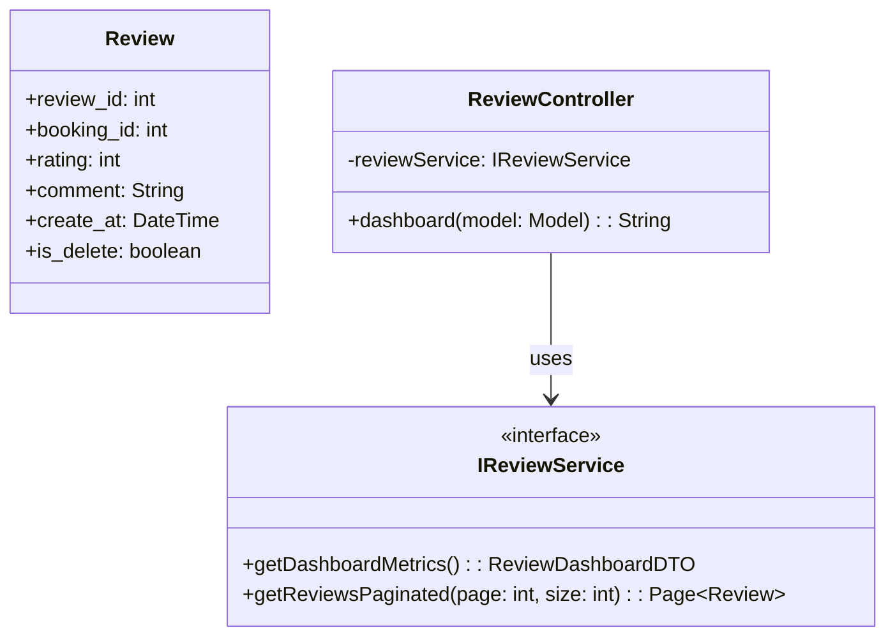
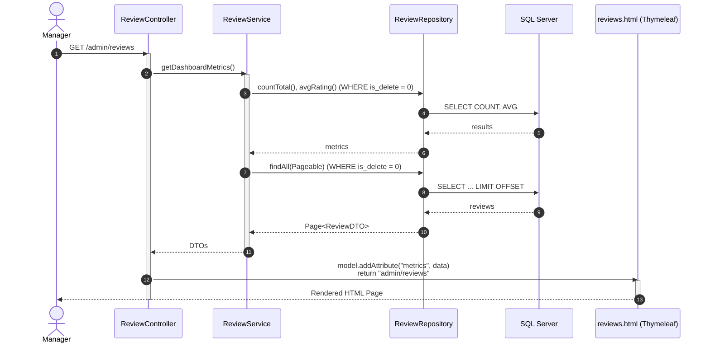
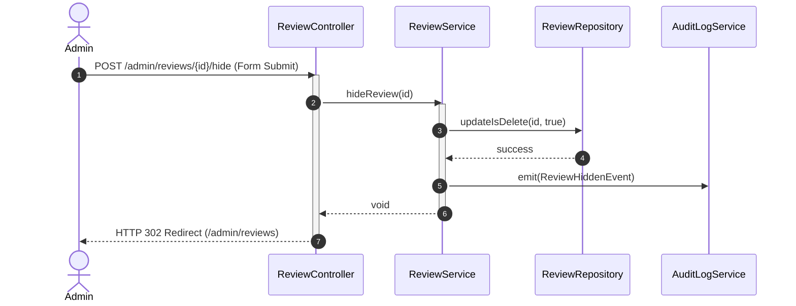

# ENGINEERING DOCUMENTATION STANDARD (EDS) v2.0
## Quy chuẩn Tài liệu Kỹ thuật và Đặc tả Hiện thực hóa - UC29 Customer Reviews

| Field | Value |
| :--- | :--- |
| **Document ID** | `XOAI-MOD5-IMP-029` |
| **Version** | 1.0 |
| **Date** | 2026-06-26 |
| **Status** | Draft |
| **Document Owner** | Management Portal Team |
| **Author** | Phùng Giang Hải |
| **Reviewed by** | [Tên Tech Lead] |
| **DPO Sign-off** | [ ] Pending / [ ] Approved — 2026-06-26 — [Tên DPO] *(Module đọc PII khách hàng từ Booking)* |
| **Approved by** | [Principal Architect] |
| **Last Review** | 2026-06-26 |
| **Based on EDS** | v2.0 |

---

## CHANGELOG

> [!IMPORTANT]
> **Policy 4.4 — Immutable History**: Không bao giờ xóa thông tin cũ. Mọi thay đổi phải ghi vào bảng này.

| Ngày | Người thực hiện | Nội dung thay đổi |
| :--- | :--- | :--- |
| 2026-06-26 | Phùng Giang Hải | Tạo tài liệu lần đầu, thiết kế UC29 Customer Reviews (Spring Boot MVC). |
| 2026-06-26 | Phùng Giang Hải | Cập nhật thiết kế: Bổ sung luồng Ẩn đánh giá (Soft Delete) dành riêng cho ADMIN. |

---

## MỤC LỤC
1. [Tổng quan Module](#1-tổng-quan-module)
2. [Ma trận Truy vết (Traceability Matrix)](#2-ma-trận-truy-vết-traceability-matrix)
3. [Architecture Decision Records (ADR)](#3-architecture-decision-records-adr)
4. [Non-Functional Requirements & SLA](#4-non-functional-requirements--sla)
5. [Static Modeling (Mô hình Tĩnh)](#5-static-modeling-mô-hình-tĩnh)
6. [Dynamic Modeling (Mô hình Hướng Động)](#6-dynamic-modeling-mô-hình-hướng-động)
7. [Domain Event Catalog](#7-domain-event-catalog)
8. [Interface Specification (Đặc tả Giao diện)](#8-interface-specification-đặc-tả-giao-diện)
9. [API Specification](#9-api-specification)
10. [Bảng mã lỗi (Error Codes)](#10-bảng-mã-lỗi-error-codes)
11. [Quy trình Triển khai (Step-by-Step)](#11-quy-trình-triển-khai-step-by-step)
12. [Rollback & Incident Runbook](#12-rollback--incident-runbook)
13. [Kịch bản Kiểm thử Chi tiết](#13-kịch-bản-kiểm-thử-chi-tiết)
14. [Phương pháp Xác minh](#14-phương-pháp-xác-minh)
15. [Mẫu thử thực tế (API Verification Samples)](#15-mẫu-thử-thực-tế-api-verification-samples)
16. [Bảng tổng hợp phân quyền (Authorization Matrix)](#16-bảng-tổng-hợp-phân-quyền-authorization-matrix)

---

## 1. Tổng quan Module

> [!NOTE]
> Module Quản lý đánh giá khách hàng (Customer Reviews). Cung cấp giao diện Dashboard phân tích dữ liệu đánh giá dạng Read-only dành cho Manager. Sử dụng Spring Boot MVC, render qua Thymeleaf.

| Field | Value |
| :--- | :--- |
| **Module Name** | Customer Reviews Dashboard |
| **Bounded Context** | Feedback & Quality Assurance |
| **Data Classification** | Internal / PII (Guest Names) |
| **Compliance Scope** | PDPA (Bảo vệ thông tin định danh khách hàng) |
| **Upstream Dependencies** | Booking Module, User Module |
| **Downstream Consumers** | N/A |

---

## 2. Ma trận Truy vết (Traceability Matrix)

| Requirement ID | Loại (BR/ADR/US) | Mô tả yêu cầu | Thành phần Code | Compliance Target | ADR liên quan |
| :--- | :--- | :--- | :--- | :--- | :--- |
| BR-REV-001 | Business Rule | Reviews là dữ liệu Read-only, Manager không được phép sửa/xóa. | `ReviewService.getReviews()` (Không có method Delete/Update) | System Integrity | ADR-002 |
| BR-REV-002 | Business Rule | Booking ID và Guest Name là Deep Links dẫn tới Lịch trình và Hồ sơ Khách hàng. | `reviews.html` (Thymeleaf `<a th:href="...">`) | UX Standard | ADR-003 |
| US-REV-001 | User Story | Manager muốn xem tổng số review và điểm trung bình. | `ReviewController.dashboard()` | — | — |

---

## 3. Architecture Decision Records (ADR)

### `ADR-002` — [Kiểm soát quyền Soft Delete Review]

| Field | Value |
| :--- | :--- |
| **Status** | Accepted |
| **Deciders** | Phùng Giang Hải |
| **Date** | 2026-06-26 |

#### Bối cảnh (Context)
Cần một cơ chế xử lý các review chứa nội dung nhạy cảm, thô tục hoặc khách hàng yêu cầu gỡ bỏ (Right to be forgotten). Tuy nhiên, nếu cấp quyền này cho Manager, hệ thống sẽ mất đi tính chân thực.

#### Các phương án đã xem xét (Options Considered)
| Phương án | Mô tả | Ưu điểm | Nhược điểm |
| :--- | :--- | :--- | :--- |
| A. Strict Read-only (Mọi cấp) | Cấm hoàn toàn việc xóa. | Minh bạch tuyệt đối. | Không xử lý được review rác. |
| B. Soft Delete cấp ADMIN | Mọi query thêm `is_delete = 0`. Chỉ Role ADMIN mới có quyền gọi API ẩn review. Manager (Read-only) không thấy nút này. | Cân bằng giữa tính chân thực (Manager) và kiểm duyệt (Admin). Có lưu vết (Audit Log). | Khó code hơn chút xíu ở Front-end (Check Role). |

#### Quyết định (Decision)
Chọn Phương án **[B]** để bảo đảm an toàn dữ liệu và tuân thủ pháp luật (GDPR/PDPA).

#### Hệ quả (Consequences)
**Tích cực**: Giải quyết được khủng hoảng truyền thông mà Manager không thể lạm quyền xóa review.
**Tiêu cực / Trade-offs**: Bắt buộc phải tích hợp với Audit Log Module để ghi vết hành động xóa.

---

### `ADR-003` — [Sử dụng Deep Linking thay cho Use Case xem chi tiết]

| Field | Value |
| :--- | :--- |
| **Status** | Accepted |
| **Deciders** | Phùng Giang Hải |
| **Date** | 2026-06-26 |

#### Bối cảnh (Context)
Quản lý cần xem chi tiết hồ sơ khách hàng khi đọc một review cụ thể.

#### Quyết định (Decision)
Thay vì tạo màn hình "Chi tiết Review" mới, sử dụng thẻ `<a>` để Deep Link trực tiếp sang trang `Guest Profile` và `Completed Itinerary` có sẵn trong hệ thống Spring Boot.

---

## 4. Non-Functional Requirements & SLA

### 4.1. Performance & Availability
| Category | Requirement | Target SLA | Measurement Method | Compliance Basis |
| :--- | :--- | :--- | :--- | :--- |
| Latency | Page load time (Thymeleaf render) | < 800ms | Browser DevTools | — |

### 4.2. Data Integrity & Retention
| Category | Requirement | Target | Verification Method | Compliance Basis |
| :--- | :--- | :--- | :--- | :--- |
| Integrity | Read-only enforcement | 100% | Unit Test (No update queries) | Business Policy |

### 4.3. Security
| Category | Requirement | Target | Verification Method | Compliance Basis |
| :--- | :--- | :--- | :--- | :--- |
| Access control | Role-based (Manager Only) | Least privilege | Spring Security Config | GDPR Art. 25 |

---

## 5. Static Modeling (Mô hình Tĩnh)

### 5.1. Class Diagram (PlantUML)



### 5.2. Data Structure (SQL Schema)

> [!WARNING]
> Lưu ý: Bảng REVIEW hiện tại trong `DB.sql` thiếu các trường Audit cơ bản. Kiến nghị cập nhật schema như sau:

```sql
-- === REVIEW SCHEMA CẬP NHẬT ===
CREATE TABLE REVIEW (
    review_id INT IDENTITY(1,1) PRIMARY KEY,
    booking_id INT NOT NULL,
    rating INT CHECK (rating >= 1 AND rating <= 5),
    comment NVARCHAR(MAX),
    -- Các trường bổ sung kiến nghị
    create_at DATETIME DEFAULT GETDATE(),
    is_delete BIT DEFAULT 0, -- Dùng cho System Admin, Manager không có quyền sửa
    CONSTRAINT FK_REVIEW_BOOKING FOREIGN KEY (booking_id) REFERENCES BOOKING(booking_id)
);
```

---

## 6. Dynamic Modeling (Mô hình Hướng Động)

### 6.1. Sequence Diagram — Happy Path (PlantUML)



### 6.2. Sequence Diagram — Hide Review Path (ADMIN Only)



### 6.3. Sequence Diagram — Error Path
**N/A** - Nếu lỗi xảy ra, GlobalExceptionHandler bắt lỗi và redirect về `error.html`.

### 6.3. State Machine
**N/A** - Review là dữ liệu bất biến đối với Manager, không có State Machine. Review chỉ được tạo bởi Guest và giữ nguyên trạng thái.

---

## 7. Domain Event Catalog

### 7.1. Events Published (Phát ra)
| Event Name | Trigger | Publisher | Subscriber(s) | Payload Schema | Async? |
| :--- | :--- | :--- | :--- | :--- | :--- |
| `ReviewHidden` | Admin bấm nút Ẩn một đánh giá | `ReviewService` | `AuditLogService` (Module UC30) | `{"reviewId": int, "hiddenBy": "AdminUser"}` | Yes |

### 7.2. Events Consumed (Tiêu thụ)
**N/A**

---

## 8. Interface Specification (Đặc tả Giao diện)

### 8.1. Service Interface

```java
// IReviewService.java
// @version 1.0

public interface IReviewService {
    /**
     * Lấy các chỉ số tổng quan cho Header Cards
     */
    ReviewMetricsDTO getDashboardMetrics();

    /**
     * Lấy danh sách review kèm phân trang
     */
    Page<ReviewDTO> getReviewsPaginated(int page, int size);

    /**
     * Ẩn (Soft Delete) một đánh giá (Chỉ dành cho ADMIN)
     */
    void hideReview(int reviewId);
}
```

### 8.2. Repository Interface

```java
// IReviewRepository.java
// @version 1.0

public interface IReviewRepository extends JpaRepository<Review, Integer> {
    @Query("SELECT AVG(r.rating) FROM Review r WHERE r.isDelete = false")
    Double getAverageRating();
    
    @Modifying
    @Query("UPDATE Review r SET r.isDelete = true WHERE r.reviewId = :id")
    void softDeleteById(@Param("id") int id);
}
```

---

## 9. API Specification (Spring MVC Controllers)

> [!NOTE]
> Do dự án áp dụng Spring Boot MVC, hệ thống sử dụng Endpoints trả về HTML View (Thymeleaf) thay vì JSON REST APIs.

### 9.1. Endpoints Table

| Method | Path | Auth Level | Required Roles | Rate Limit | Returns |
| :--- | :--- | :--- | :--- | :--- | :--- |
| GET | `/admin/reviews` | Session/Cookie | `MANAGER`, `ADMIN` | 60/min | `admin/reviews.html` |
| POST | `/admin/reviews/{id}/hide` | Session/Cookie | `ADMIN` | 30/min | `redirect:/admin/reviews` |

### 9.2. Request / Response (Controller Level)

**Controller Method (Dashboard chính)**:
```java
@GetMapping("/admin/reviews")
public String dashboard(@RequestParam(defaultValue = "1") int page, Model model) {
    ReviewMetricsDTO metrics = reviewService.getDashboardMetrics();
    Page<ReviewDTO> reviews = reviewService.getReviewsPaginated(page, 20);
    
    model.addAttribute("metrics", metrics);
    model.addAttribute("reviews", reviews);
    return "admin/reviews"; // Trả về Thymeleaf view
}
```

**Controller Method (Admin Ẩn Review)**:
```java
@PostMapping("/admin/reviews/{id}/hide")
public String hideReview(@PathVariable int id, RedirectAttributes redirectAttributes) {
    reviewService.hideReview(id);
    redirectAttributes.addFlashAttribute("message", "Đã ẩn đánh giá thành công.");
    return "redirect:/admin/reviews"; // Form submit xong redirect về lại list
}
```

---

## 10. Bảng mã lỗi (Error Codes)

Do kiến trúc Spring MVC, lỗi sẽ được đẩy về trang `error.html` qua `@ExceptionHandler`.

| Code | HTTP Status | Message (EN) | Message (VI) | Trigger Condition |
| :--- | :--- | :--- | :--- | :--- |
| `REV-003` | 404 | Reviews not found | Không tìm thấy trang | Lỗi page out of bound |
| `REV-004` | 403 | Access Denied | Không đủ quyền | Truy cập bằng tài khoản Guest |

---

## 11. Quy trình Triển khai (Step-by-Step)

### 11.1. Prerequisites
- [x] Thymeleaf templates đã chuẩn bị CSS (Xoai Aura Design System).
- [x] Database đã cập nhật field `create_at` cho bảng REVIEW.

### 11.2. Pre-Migration Checklist
- [x] Đã backup DB production: `pg_dump -h [host] -U [user] [db] > backup_YYYYMMDD.sql`

### 11.3. Implementation Steps
1. Khởi tạo `ReviewDTO` và `ReviewMetricsDTO`.
2. Tạo Spring Data JPA Repository cho `REVIEW`.
3. Code Service logic để tính AVG Rating.
4. Xây dựng `@Controller` và bind data ra giao diện `reviews.html`.
5. Đảm bảo cấu hình thẻ `<a>` (Deep Links) trỏ đúng đường dẫn `/admin/guests/folio/{bookingId}`.

### 11.4. Deployment Checklist
- [x] Service khởi động thành công.
- [x] Thymeleaf templates được phân tích cú pháp không lỗi.

---

## 12. Rollback & Incident Runbook

### 12.1. Điều kiện kích hoạt Rollback (Trigger Conditions)
| Điều kiện | Ngưỡng | Người quyết định |
| :--- | :--- | :--- |
| Trang Dashboard bị lỗi 500 (Template parse error) | Lỗi ngay khi load | Tech Lead |

### 12.2. Rollback Procedure
1. Revert commit code Controller và Thymeleaf gần nhất.
2. Restart Spring Boot application: `systemctl restart xoai-aura-app`

### 12.3. Notification Protocol
| Thời điểm | Người nhận | Kênh | Template |
| :--- | :--- | :--- | :--- |
| Ngay khi phát hiện lỗi 500 | On-call team | Slack `#incident` | "🚨 Template Error on Review Dashboard" |

### 12.4. Post-Incident Review (PIR)
**N/A** - Thực hiện sau khi xử lý xong sự cố.

---

## 13. Kịch bản Kiểm thử Chi tiết

### 13.1. Unit Tests

#### `TC-UNIT-REV-001` — Hiển thị Dashboard
- **Feature**: `Review Dashboard rendering`
- **Background**:
  - **Given** test data classification: `SYNTHETIC`
- **Scenario**: Controller trả về đúng View và Model
  - **When** gọi GET `/admin/reviews`
  - **Then** `status().isOk()`
  - **And** `view().name("admin/reviews")`
  - **And** model attribute `metrics` tồn tại.

---

## 14. Phương pháp Xác minh

### 14.1. Database Inspection
Kiểm tra tính toàn vẹn của logic Read-Only:
- Lọc log truy vấn SQL (Show SQL = true) khi vào trang review, đảm bảo không có lệnh `UPDATE` hay `DELETE`.

### 14.2. Log / Audit Verification
- Kiểm tra log HTTP requests xem có lỗi khi bind model vào file Thymeleaf hay không.

### 14.3. Tool-based Verification
**N/A** - Không áp dụng mã hóa API phức tạp cho màn hình này.

---

## 15. Mẫu thử thực tế (API Verification Samples)

**Kiểm thử bằng cURL cho giao diện MVC:**
```bash
curl -X GET -b "JSESSIONID=[TOKEN]" https://[host]/admin/reviews
```
*Expected*: Trả về chuỗi HTML bắt đầu bằng `<!DOCTYPE html>...` chứa `<title>Customer Reviews Dashboard</title>`.

---

## 16. Bảng tổng hợp phân quyền (Authorization Matrix)

| Endpoint | GUEST | RECEPTIONIST | MANAGER | ADMIN |
| :--- | :---: | :---: | :---: | :---: |
| GET `/admin/reviews` | ❌ | ❌ | ✅ | ✅ |
| POST `/admin/reviews/{id}/hide` | ❌ | ❌ | ❌ | ✅ |

---
*End of Document - XOAI-MOD5-IMP-029*
